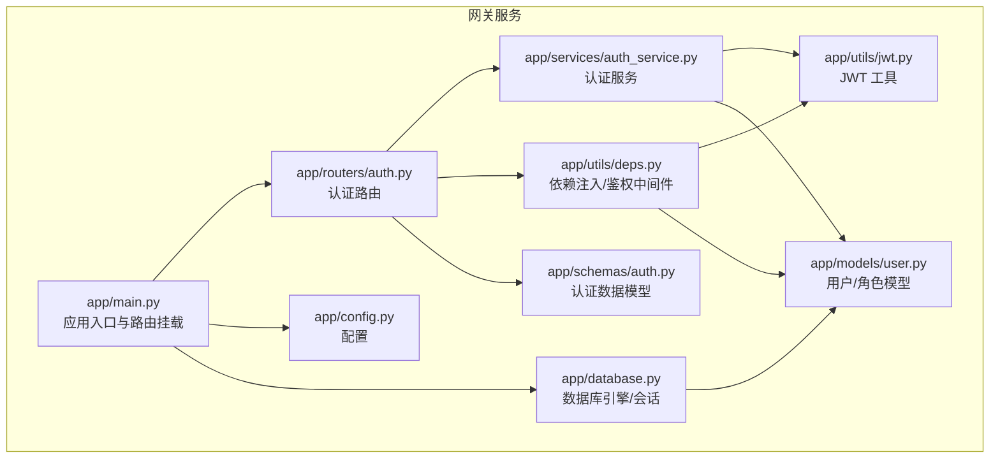
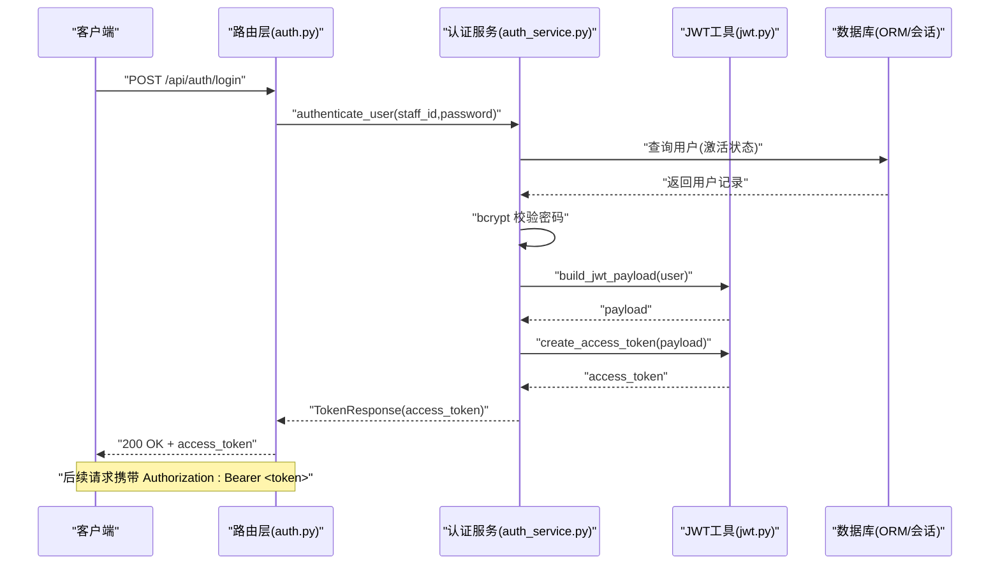
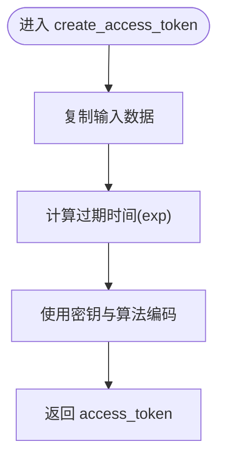
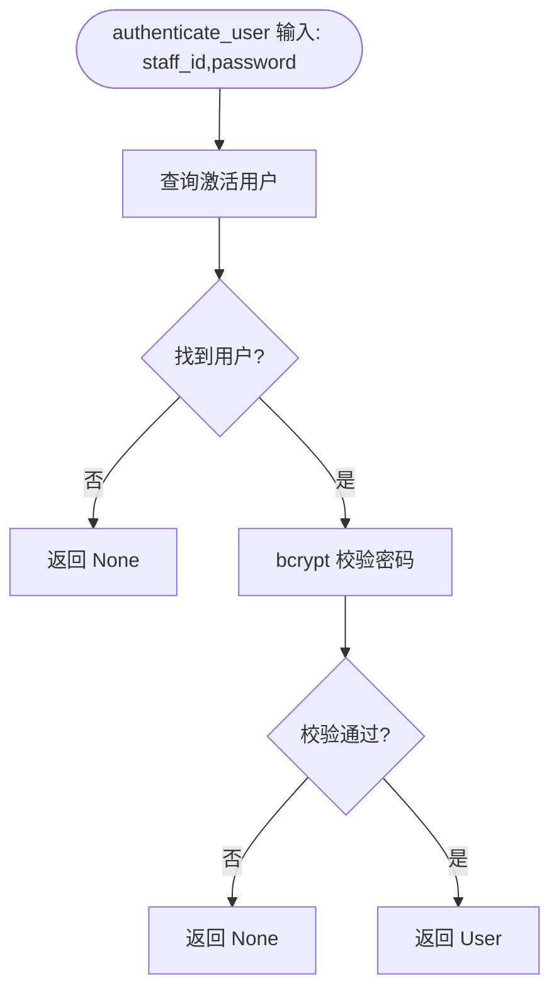
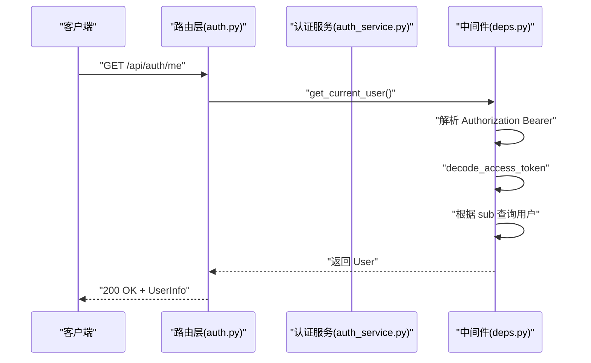
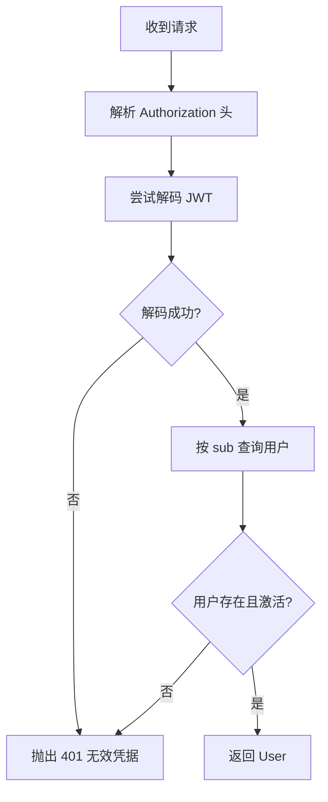
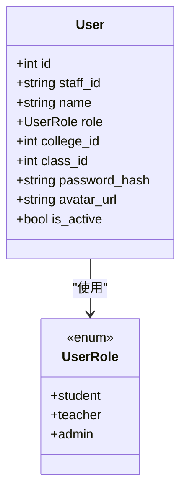
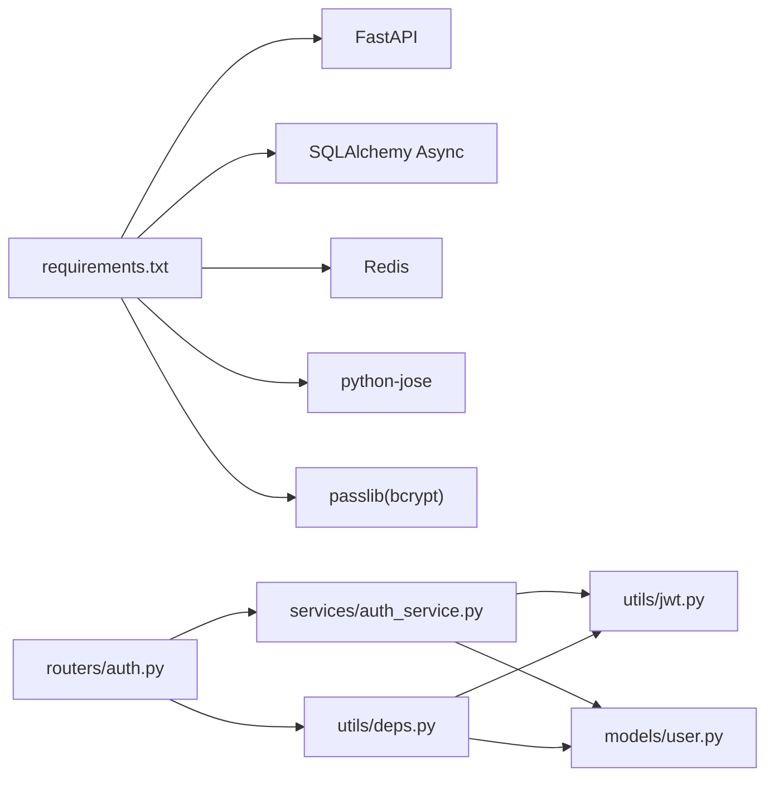

# 认证授权服务

<cite>
**本文引用的文件**
- [services/gateway/app/utils/jwt.py](file://services/gateway/app/utils/jwt.py)
- [services/gateway/app/services/auth_service.py](file://services/gateway/app/services/auth_service.py)
- [services/gateway/app/routers/auth.py](file://services/gateway/app/routers/auth.py)
- [services/gateway/app/schemas/auth.py](file://services/gateway/app/schemas/auth.py)
- [services/gateway/app/utils/deps.py](file://services/gateway/app/utils/deps.py)
- [services/gateway/app/models/user.py](file://services/gateway/app/models/user.py)
- [services/gateway/app/config.py](file://services/gateway/app/config.py)
- [services/gateway/app/main.py](file://services/gateway/app/main.py)
- [services/gateway/app/database.py](file://services/gateway/app/database.py)
- [services/gateway/requirements.txt](file://services/gateway/requirements.txt)
</cite>

## 目录
1. [简介](#简介)
2. [项目结构](#项目结构)
3. [核心组件](#核心组件)
4. [架构总览](#架构总览)
5. [详细组件分析](#详细组件分析)
6. [依赖分析](#依赖分析)
7. [性能考量](#性能考量)
8. [故障排查指南](#故障排查指南)
9. [结论](#结论)
10. [附录](#附录)

## 简介
本文件为“认证授权服务”的综合技术文档，聚焦于 JWT 令牌生成与验证、用户身份认证流程、角色权限控制、认证中间件与权限拦截逻辑、安全策略配置、用户注册/登录/登出流程、密码加密与令牌刷新、会话管理以及扩展接口与自定义认证方式的实现指导。系统基于 FastAPI + SQLAlchemy + Redis + PostgreSQL，采用异步架构，提供简洁、可扩展的认证授权能力。

## 项目结构
后端服务位于 services/gateway，核心目录与职责如下：
- app/utils：通用工具，包括 JWT 工具与依赖注入工具
- app/services：业务服务层，如认证服务
- app/routers：路由层，暴露认证相关 API
- app/schemas：Pydantic 数据模型
- app/models：SQLAlchemy ORM 模型
- app/config.py：运行时配置
- app/main.py：应用入口与生命周期管理
- app/database.py：数据库引擎与会话管理
- requirements.txt：依赖清单

图表来源
- [services/gateway/app/main.py:1-78](file://services/gateway/app/main.py#L1-L78)
- [services/gateway/app/config.py:1-31](file://services/gateway/app/config.py#L1-L31)
- [services/gateway/app/database.py:1-15](file://services/gateway/app/database.py#L1-L15)
- [services/gateway/app/utils/jwt.py:1-17](file://services/gateway/app/utils/jwt.py#L1-L17)
- [services/gateway/app/utils/deps.py:1-40](file://services/gateway/app/utils/deps.py#L1-L40)
- [services/gateway/app/services/auth_service.py:1-35](file://services/gateway/app/services/auth_service.py#L1-L35)
- [services/gateway/app/routers/auth.py:1-35](file://services/gateway/app/routers/auth.py#L1-L35)
- [services/gateway/app/schemas/auth.py:1-23](file://services/gateway/app/schemas/auth.py#L1-L23)
- [services/gateway/app/models/user.py:1-76](file://services/gateway/app/models/user.py#L1-L76)

章节来源
- [services/gateway/app/main.py:1-78](file://services/gateway/app/main.py#L1-L78)
- [services/gateway/app/config.py:1-31](file://services/gateway/app/config.py#L1-L31)
- [services/gateway/app/database.py:1-15](file://services/gateway/app/database.py#L1-L15)

## 核心组件
- JWT 工具：负责访问令牌的签发与解码
- 认证服务：负责用户凭证校验、密码哈希验证、令牌签发
- 认证路由：对外暴露登录与个人信息查询接口
- 依赖注入与鉴权中间件：从请求头解析并验证 JWT，解析当前用户
- 数据模型：用户、角色枚举、学院/班级关联
- 配置：数据库、Redis、JWT 参数、外部服务地址等
- 数据库：异步连接池与会话管理

章节来源
- [services/gateway/app/utils/jwt.py:1-17](file://services/gateway/app/utils/jwt.py#L1-L17)
- [services/gateway/app/services/auth_service.py:1-35](file://services/gateway/app/services/auth_service.py#L1-L35)
- [services/gateway/app/routers/auth.py:1-35](file://services/gateway/app/routers/auth.py#L1-L35)
- [services/gateway/app/utils/deps.py:1-40](file://services/gateway/app/utils/deps.py#L1-L40)
- [services/gateway/app/models/user.py:1-76](file://services/gateway/app/models/user.py#L1-L76)
- [services/gateway/app/config.py:1-31](file://services/gateway/app/config.py#L1-L31)
- [services/gateway/app/database.py:1-15](file://services/gateway/app/database.py#L1-L15)

## 架构总览
系统采用分层架构：路由层负责接口暴露，服务层负责业务逻辑，工具层负责通用能力（JWT、依赖注入），模型层负责数据持久化。认证流程围绕 JWT 实现，登录成功后签发令牌，后续请求通过 Authorization Bearer 传递令牌，中间件解析并校验令牌，解析出当前用户。

图表来源
- [services/gateway/app/routers/auth.py:12-21](file://services/gateway/app/routers/auth.py#L12-L21)
- [services/gateway/app/services/auth_service.py:8-17](file://services/gateway/app/services/auth_service.py#L8-L17)
- [services/gateway/app/utils/jwt.py:6-11](file://services/gateway/app/utils/jwt.py#L6-L11)

## 详细组件分析

### JWT 工具
- 功能：签发访问令牌、解码访问令牌
- 策略：使用 HS256 算法，密钥来自配置，过期时间以小时配置
- 复杂度：常数时间 O(1)，空间复杂度 O(n)（n 为 payload 键值数量）

图表来源
- [services/gateway/app/utils/jwt.py:6-11](file://services/gateway/app/utils/jwt.py#L6-L11)

章节来源
- [services/gateway/app/utils/jwt.py:1-17](file://services/gateway/app/utils/jwt.py#L1-L17)
- [services/gateway/app/config.py:10-13](file://services/gateway/app/config.py#L10-L13)

### 认证服务
- authenticate_user：按学号/工号查询激活用户，使用 bcrypt 校验密码
- build_jwt_payload：构建 JWT 载荷，包含用户标识、角色、组织信息等
- issue_token：基于 payload 生成访问令牌

图表来源
- [services/gateway/app/services/auth_service.py:8-17](file://services/gateway/app/services/auth_service.py#L8-L17)

章节来源
- [services/gateway/app/services/auth_service.py:1-35](file://services/gateway/app/services/auth_service.py#L1-L35)

### 认证路由
- /api/auth/login：接收学号/工号与密码，校验失败返回 401，成功签发令牌
- /api/auth/me：依赖鉴权中间件，返回当前用户信息

图表来源
- [services/gateway/app/routers/auth.py:24-34](file://services/gateway/app/routers/auth.py#L24-L34)
- [services/gateway/app/utils/deps.py:14-35](file://services/gateway/app/utils/deps.py#L14-L35)

章节来源
- [services/gateway/app/routers/auth.py:1-35](file://services/gateway/app/routers/auth.py#L1-L35)

### 依赖注入与鉴权中间件
- get_current_user：从 Authorization Bearer 提取令牌，解码并解析用户 ID，查询数据库确认用户存在且激活
- get_redis：从应用状态获取 Redis 客户端（用于后续扩展）

图表来源
- [services/gateway/app/utils/deps.py:14-35](file://services/gateway/app/utils/deps.py#L14-L35)

章节来源
- [services/gateway/app/utils/deps.py:1-40](file://services/gateway/app/utils/deps.py#L1-L40)

### 数据模型与角色权限
- 用户模型包含角色枚举（student、teacher、admin）、组织字段（学院/班级）、激活状态等
- 角色用于区分不同权限边界，配合中间件与路由使用

图表来源
- [services/gateway/app/models/user.py:45-58](file://services/gateway/app/models/user.py#L45-L58)

章节来源
- [services/gateway/app/models/user.py:1-76](file://services/gateway/app/models/user.py#L1-L76)

### 配置与安全策略
- 数据库与 Redis 连接串
- JWT 密钥、算法、过期时长
- 外部服务（Dify）地址与密钥
- 生产环境建议：密钥与算法需安全存储与轮换，过期时间按业务场景调整

章节来源
- [services/gateway/app/config.py:1-31](file://services/gateway/app/config.py#L1-L31)

### 数据库与会话管理
- 使用异步 SQLAlchemy 引擎，连接池大小可控
- 会话在请求范围内创建与释放，避免连接泄漏

章节来源
- [services/gateway/app/database.py:1-15](file://services/gateway/app/database.py#L1-L15)

## 依赖分析
- 外部依赖：FastAPI、SQLAlchemy(Async)、Redis、python-jose、passlib(bcrypt)、httpx 等
- 内部模块耦合：路由依赖服务与依赖注入，服务依赖 JWT 工具与模型，依赖注入依赖 JWT 工具与模型

图表来源
- [services/gateway/requirements.txt:1-29](file://services/gateway/requirements.txt#L1-L29)
- [services/gateway/app/routers/auth.py:1-35](file://services/gateway/app/routers/auth.py#L1-L35)
- [services/gateway/app/services/auth_service.py:1-35](file://services/gateway/app/services/auth_service.py#L1-L35)
- [services/gateway/app/utils/deps.py:1-40](file://services/gateway/app/utils/deps.py#L1-L40)
- [services/gateway/app/utils/jwt.py:1-17](file://services/gateway/app/utils/jwt.py#L1-L17)
- [services/gateway/app/models/user.py:1-76](file://services/gateway/app/models/user.py#L1-L76)

章节来源
- [services/gateway/requirements.txt:1-29](file://services/gateway/requirements.txt#L1-L29)

## 性能考量
- 异步 I/O：数据库与 Redis 使用异步驱动，减少阻塞
- 连接池：数据库连接池大小可调，避免频繁创建销毁
- JWT 解码：O(1) 时间复杂度，CPU 成本低
- 缓存命中：可利用 Redis 缓存热点用户信息或黑名单（扩展点）
- 过期策略：合理设置过期时间，平衡安全性与用户体验

## 故障排查指南
- 登录失败：检查学号/工号是否存在且激活，确认密码哈希匹配
- 401 未授权：确认请求头 Authorization 是否为 Bearer 令牌，令牌是否过期或签名异常
- 用户不存在或禁用：中间件会在用户不存在或 is_active=False 时返回 401
- 健康检查：/health 接口检查数据库、Redis、外部服务连通性

章节来源
- [services/gateway/app/utils/deps.py:18-35](file://services/gateway/app/utils/deps.py#L18-L35)
- [services/gateway/app/routers/auth.py:16-19](file://services/gateway/app/routers/auth.py#L16-L19)
- [services/gateway/app/main.py:30-68](file://services/gateway/app/main.py#L30-L68)

## 结论
该认证授权服务以 JWT 为核心，结合 bcrypt 密码哈希与异步数据库访问，提供了清晰、可扩展的身份认证与权限控制基础。通过依赖注入中间件统一解析与校验令牌，路由层专注于业务接口暴露。建议在生产环境中强化密钥管理、引入令牌黑名单与刷新策略，并按需扩展权限拦截与审计日志。

## 附录

### 用户注册/登录/登出流程
- 注册：当前仓库未提供注册路由与服务，可在路由层新增注册接口，服务层实现密码哈希与用户创建
- 登录：/api/auth/login，校验凭证后签发访问令牌
- 登出：当前未实现登出接口，可扩展将令牌加入黑名单或依赖短期过期策略

章节来源
- [services/gateway/app/routers/auth.py:12-21](file://services/gateway/app/routers/auth.py#L12-L21)

### 密码加密与令牌刷新
- 密码加密：使用 bcrypt，服务层提供校验逻辑
- 令牌刷新：当前未实现刷新接口，可新增 /refresh 接口，签发新令牌并使旧令牌失效（建议结合黑名单）

章节来源
- [services/gateway/app/services/auth_service.py:15-16](file://services/gateway/app/services/auth_service.py#L15-L16)
- [services/gateway/app/utils/jwt.py:6-11](file://services/gateway/app/utils/jwt.py#L6-L11)

### 会话管理与安全策略
- 会话：基于 JWT 无状态设计，Redis 可用于黑名单或临时状态（扩展点）
- 安全策略：建议启用 HTTPS、最小权限原则、短令牌过期、定期轮换密钥、限制登录尝试

章节来源
- [services/gateway/app/config.py:10-13](file://services/gateway/app/config.py#L10-L13)
- [services/gateway/app/main.py:18-22](file://services/gateway/app/main.py#L18-L22)

### 扩展接口与自定义认证方式
- 扩展接口：在 routers/auth.py 新增路由，服务层实现业务逻辑，必要时引入中间件或权限装饰器
- 自定义认证：可替换 JWT 为其他令牌格式或引入多因子认证，保持依赖注入与中间件接口一致

章节来源
- [services/gateway/app/routers/auth.py:1-35](file://services/gateway/app/routers/auth.py#L1-L35)
- [services/gateway/app/utils/deps.py:1-40](file://services/gateway/app/utils/deps.py#L1-L40)