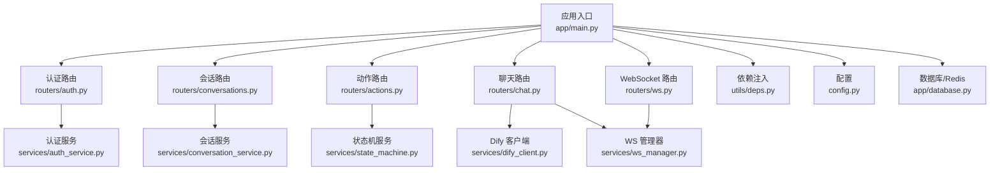
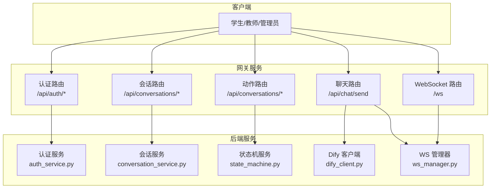
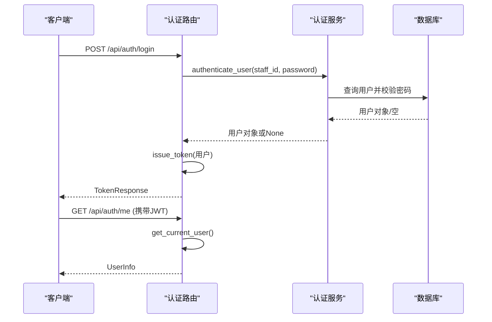
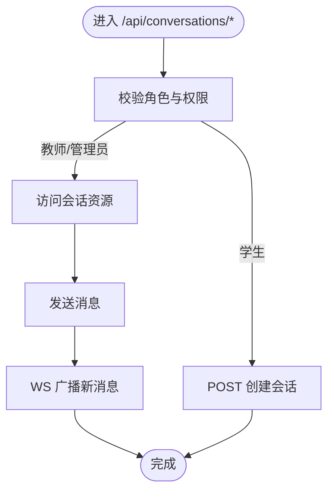
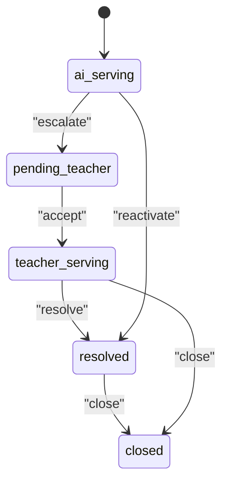
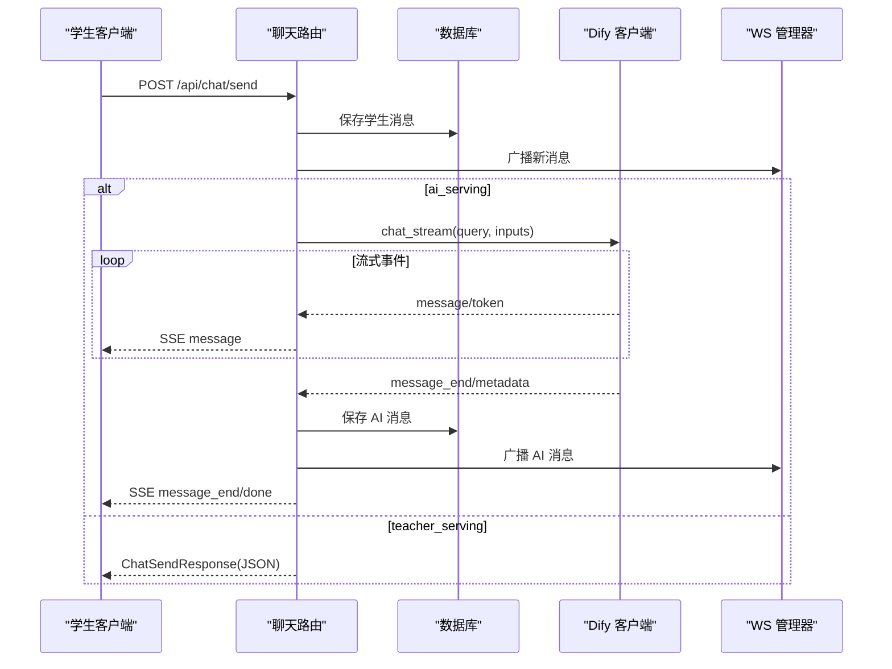
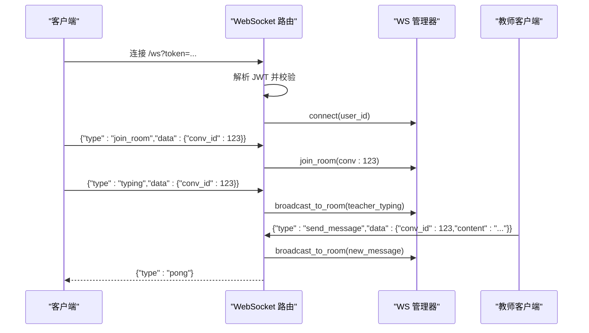
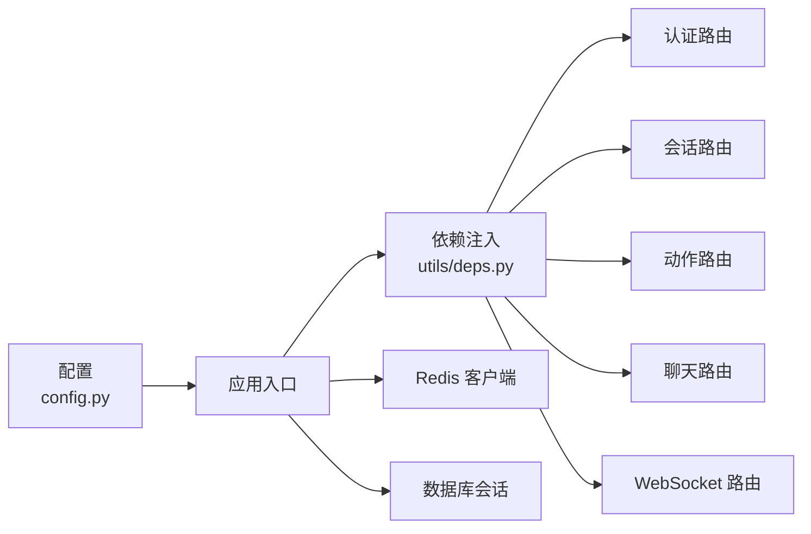

# 路由系统

<cite>
**本文引用的文件**
- [services/gateway/app/main.py](file://services/gateway/app/main.py)
- [services/gateway/app/routers/auth.py](file://services/gateway/app/routers/auth.py)
- [services/gateway/app/routers/conversations.py](file://services/gateway/app/routers/conversations.py)
- [services/gateway/app/routers/actions.py](file://services/gateway/app/routers/actions.py)
- [services/gateway/app/routers/chat.py](file://services/gateway/app/routers/chat.py)
- [services/gateway/app/routers/ws.py](file://services/gateway/app/routers/ws.py)
- [services/gateway/app/schemas/auth.py](file://services/gateway/app/schemas/auth.py)
- [services/gateway/app/schemas/chat.py](file://services/gateway/app/schemas/chat.py)
- [services/gateway/app/schemas/conversation.py](file://services/gateway/app/schemas/conversation.py)
- [services/gateway/app/utils/deps.py](file://services/gateway/app/utils/deps.py)
- [services/gateway/app/services/auth_service.py](file://services/gateway/app/services/auth_service.py)
- [services/gateway/app/models/user.py](file://services/gateway/app/models/user.py)
- [services/gateway/app/models/conversation.py](file://services/gateway/app/models/conversation.py)
- [services/gateway/app/services/ws_manager.py](file://services/gateway/app/services/ws_manager.py)
- [services/gateway/app/config.py](file://services/gateway/app/config.py)
</cite>

## 目录
1. [简介](#简介)
2. [项目结构](#项目结构)
3. [核心组件](#核心组件)
4. [架构总览](#架构总览)
5. [详细组件分析](#详细组件分析)
6. [依赖分析](#依赖分析)
7. [性能考量](#性能考量)
8. [故障排查指南](#故障排查指南)
9. [结论](#结论)
10. [附录](#附录)

## 简介
本文件系统性梳理“医小管 v2”网关服务的路由体系，覆盖认证路由、会话管理路由、聊天与状态动作路由、以及 WebSocket 路由。文档从架构、数据流、处理逻辑、错误处理、性能与安全等方面进行深入解析，并提供扩展与新增路由的最佳实践。

## 项目结构
- 路由入口在应用主文件中集中挂载，按功能域划分命名空间，统一通过 APIRouter 组织。
- 路由模块职责清晰：
  - 认证路由：登录、个人信息查询
  - 会话路由：创建、列表、详情、消息读取与发送
  - 动作路由：转态机动作（升级、接单、解决、关闭）
  - 聊天路由：学生消息发送、SSE 流式 AI 响应
  - WebSocket 路由：基于 JWT 的长连接、房间广播、打字提示
- 模型与 Schema 层负责数据结构定义与校验；依赖注入层提供鉴权与数据库连接；服务层封装业务逻辑与外部集成。

图表来源
- [services/gateway/app/main.py:70-78](file://services/gateway/app/main.py#L70-L78)
- [services/gateway/app/routers/auth.py:1-35](file://services/gateway/app/routers/auth.py#L1-L35)
- [services/gateway/app/routers/conversations.py:1-129](file://services/gateway/app/routers/conversations.py#L1-L129)
- [services/gateway/app/routers/actions.py:1-154](file://services/gateway/app/routers/actions.py#L1-L154)
- [services/gateway/app/routers/chat.py:1-191](file://services/gateway/app/routers/chat.py#L1-L191)
- [services/gateway/app/routers/ws.py:1-119](file://services/gateway/app/routers/ws.py#L1-L119)

章节来源
- [services/gateway/app/main.py:1-78](file://services/gateway/app/main.py#L1-L78)

## 核心组件
- 应用生命周期与健康检查：在 lifespan 中初始化 Redis，提供 /health 健康探针，检查 Postgres、Redis 与 Dify 服务连通性。
- 路由命名空间与标签：
  - 认证：/api/auth，标签 auth
  - 会话：/api/conversations，标签 conversations
  - 会话动作：/api/conversations（同前缀），标签 conversation-actions
  - 聊天：/api/chat，标签 chat
  - WebSocket：根路径，标签 websocket
- 依赖注入：
  - HTTP Bearer 认证中间件
  - 当前用户解析（JWT → 用户对象）
  - 数据库会话注入
  - Redis 注入（通过 app.state）

章节来源
- [services/gateway/app/main.py:16-68](file://services/gateway/app/main.py#L16-L68)
- [services/gateway/app/main.py:70-78](file://services/gateway/app/main.py#L70-L78)
- [services/gateway/app/utils/deps.py:14-39](file://services/gateway/app/utils/deps.py#L14-L39)

## 架构总览
下图展示路由层与周边服务的交互关系：认证路由负责签发令牌；会话与动作路由围绕 Conversation 状态机流转；聊天路由在不同状态下选择 SSE 或直接返回；WebSocket 路由负责房间广播与打字提示；外部 Dify 以流式事件驱动聊天响应。

图表来源
- [services/gateway/app/routers/auth.py:12-34](file://services/gateway/app/routers/auth.py#L12-L34)
- [services/gateway/app/routers/conversations.py:21-128](file://services/gateway/app/routers/conversations.py#L21-L128)
- [services/gateway/app/routers/actions.py:68-153](file://services/gateway/app/routers/actions.py#L68-L153)
- [services/gateway/app/routers/chat.py:22-191](file://services/gateway/app/routers/chat.py#L22-L191)
- [services/gateway/app/routers/ws.py:11-119](file://services/gateway/app/routers/ws.py#L11-L119)

## 详细组件分析

### 认证路由（/api/auth）
- 路由设计
  - POST /api/auth/login：接收学号/工号与密码，调用认证服务校验，成功则签发 JWT。
  - GET /api/auth/me：基于 JWT 解析当前用户，返回用户信息。
- 参数与响应
  - 请求体：LoginRequest（学号/工号、密码）
  - 响应体：TokenResponse（access_token、token_type）、UserInfo
- 错误处理
  - 登录失败返回 401；用户不存在或未激活返回 401；JWT 解析失败返回 401。
- 安全要点
  - 使用 HTTP Bearer 认证；密码采用哈希比对；JWT 包含角色、学院、班级等上下文。

图表来源
- [services/gateway/app/routers/auth.py:12-34](file://services/gateway/app/routers/auth.py#L12-L34)
- [services/gateway/app/services/auth_service.py:8-35](file://services/gateway/app/services/auth_service.py#L8-L35)
- [services/gateway/app/utils/deps.py:14-35](file://services/gateway/app/utils/deps.py#L14-L35)

章节来源
- [services/gateway/app/routers/auth.py:1-35](file://services/gateway/app/routers/auth.py#L1-L35)
- [services/gateway/app/schemas/auth.py:4-23](file://services/gateway/app/schemas/auth.py#L4-L23)
- [services/gateway/app/services/auth_service.py:1-35](file://services/gateway/app/services/auth_service.py#L1-L35)
- [services/gateway/app/utils/deps.py:14-35](file://services/gateway/app/utils/deps.py#L14-L35)

### 会话管理路由（/api/conversations）
- 路由设计
  - POST /api/conversations：学生创建会话（标题可选）
  - GET /api/conversations：分页列出会话，支持按状态过滤
  - GET /api/conversations/{conv_id}：获取会话详情
  - GET /api/conversations/{conv_id}/messages：分页读取消息
  - POST /api/conversations/{conv_id}/messages：发送消息（学生/教师）
- 参数与响应
  - 请求体：CreateConversationRequest、SendMessageRequest
  - 响应体：ConversationResponse、ConversationListResponse、MessageResponse、MessageListResponse
- 权限控制
  - 仅学生可创建会话；教师仅能回复其接单的会话；管理员可执行更多操作。
- WebSocket 广播
  - 新消息发送后通过 WS 管理器广播至房间。

图表来源
- [services/gateway/app/routers/conversations.py:21-128](file://services/gateway/app/routers/conversations.py#L21-L128)
- [services/gateway/app/services/ws_manager.py:71-81](file://services/gateway/app/services/ws_manager.py#L71-L81)

章节来源
- [services/gateway/app/routers/conversations.py:1-129](file://services/gateway/app/routers/conversations.py#L1-L129)
- [services/gateway/app/schemas/conversation.py:5-50](file://services/gateway/app/schemas/conversation.py#L5-L50)
- [services/gateway/app/services/ws_manager.py:1-100](file://services/gateway/app/services/ws_manager.py#L1-L100)

### 会话动作路由（/api/conversations/{conv_id}/...）
- 路由设计
  - POST /api/conversations/{conv_id}/escalate：学生升级为教师服务
  - POST /api/conversations/{conv_id}/accept：教师接单
  - POST /api/conversations/{conv_id}/resolve：教师标记解决
  - POST /api/conversations/{conv_id}/close：关闭会话（多角色）
- 状态机
  - 基于状态枚举与状态机服务进行合法转换，非法转换返回 409。
- 通知机制
  - 升级时向同学院教师广播通知；状态变更通过 WS 广播。

图表来源
- [services/gateway/app/models/conversation.py:11-16](file://services/gateway/app/models/conversation.py#L11-L16)
- [services/gateway/app/routers/actions.py:68-153](file://services/gateway/app/routers/actions.py#L68-L153)

章节来源
- [services/gateway/app/routers/actions.py:1-154](file://services/gateway/app/routers/actions.py#L1-L154)
- [services/gateway/app/models/conversation.py:1-63](file://services/gateway/app/models/conversation.py#L1-L63)

### 聊天路由（/api/chat/send）
- 路由设计
  - POST /api/chat/send：学生发送消息，根据会话状态选择不同路径
    - ai_serving：调用 Dify 流式返回 SSE
    - teacher_serving/pending_teacher：直接返回 JSON
- 处理流程
  - 校验角色与会话状态
  - 保存消息并广播新消息
  - 若为 ai_serving：流式生成 AI 回答，结束后保存 AI 消息并再次广播
- 参数与响应
  - 请求体：ChatSendRequest（conv_id、content）
  - 响应体：ChatSendResponse（非流式）；SSE 事件：message、message_end、done

图表来源
- [services/gateway/app/routers/chat.py:22-191](file://services/gateway/app/routers/chat.py#L22-L191)
- [services/gateway/app/schemas/chat.py:5-18](file://services/gateway/app/schemas/chat.py#L5-L18)

章节来源
- [services/gateway/app/routers/chat.py:1-191](file://services/gateway/app/routers/chat.py#L1-L191)
- [services/gateway/app/schemas/chat.py:1-18](file://services/gateway/app/schemas/chat.py#L1-L18)

### WebSocket 路由（/ws）
- 路由设计
  - WebSocket /ws：通过查询参数携带 JWT 进行认证
  - 支持的消息类型：join_room、leave_room、send_message、typing、ping
  - 下行消息：new_message、status_changed、escalation_notify、teacher_typing、pong、error
- 连接管理
  - 使用 ConnectionManager 维护用户连接与房间映射，断线自动清理
- 安全与限制
  - 仅认证通过用户可接入；未知消息类型返回 error；S2 阶段建议通过 HTTP 写库，WS 仅做通知。

图表来源
- [services/gateway/app/routers/ws.py:11-119](file://services/gateway/app/routers/ws.py#L11-L119)
- [services/gateway/app/services/ws_manager.py:25-91](file://services/gateway/app/services/ws_manager.py#L25-L91)

章节来源
- [services/gateway/app/routers/ws.py:1-119](file://services/gateway/app/routers/ws.py#L1-L119)
- [services/gateway/app/services/ws_manager.py:1-100](file://services/gateway/app/services/ws_manager.py#L1-L100)

## 依赖分析
- 路由与服务层解耦：路由仅负责参数解析、鉴权与调度，具体业务下沉到服务层。
- 依赖注入链路：
  - HTTP Bearer → JWT 解码 → 用户查询 → 数据库会话
  - 应用生命周期注入 Redis 客户端供各模块使用
- 外部依赖：
  - Postgres（SQLAlchemy Async）
  - Redis（异步）
  - Dify（外部流式 API）

图表来源
- [services/gateway/app/utils/deps.py:14-39](file://services/gateway/app/utils/deps.py#L14-L39)
- [services/gateway/app/config.py:1-31](file://services/gateway/app/config.py#L1-L31)
- [services/gateway/app/main.py:16-22](file://services/gateway/app/main.py#L16-L22)

章节来源
- [services/gateway/app/utils/deps.py:1-40](file://services/gateway/app/utils/deps.py#L1-L40)
- [services/gateway/app/config.py:1-31](file://services/gateway/app/config.py#L1-L31)
- [services/gateway/app/main.py:16-28](file://services/gateway/app/main.py#L16-L28)

## 性能考量
- 异步化
  - 数据库与 Redis 均使用异步客户端，减少阻塞。
- SSE 流式输出
  - 聊天路由在 ai_serving 场景使用 StreamingResponse，降低端到端延迟。
- 连接池与缓存
  - Redis 连接在应用生命周期内复用；Postgres 使用异步连接池。
- 广播优化
  - WS 管理器维护房间集合，广播时遍历房间内连接，避免全站扫描。
- 建议
  - 对高频接口增加缓存策略（如会话列表分页结果）。
  - 对 Dify 流式响应设置超时与重试，避免长时间占用连接。
  - 对 WebSocket 房间数量与用户连接数进行上限监控与限流。

## 故障排查指南
- 认证失败
  - 检查 JWT 是否过期或签名错误；确认用户是否存在且启用。
- 会话不存在或无权限
  - 确认 conv_id 合法；检查当前用户是否属于该会话或具备相应角色。
- 状态机冲突
  - 检查当前会话状态与允许的动作映射，避免非法转换。
- SSE 流中断
  - 关注 Dify 服务可用性与网络状况；确保客户端正确处理 message/message_end/done 事件。
- WebSocket 断连
  - 查看 WS 管理器日志；确认断线清理是否正常执行；检查客户端 ping/pong 保活。

章节来源
- [services/gateway/app/routers/auth.py:16-21](file://services/gateway/app/routers/auth.py#L16-L21)
- [services/gateway/app/routers/conversations.py:58-77](file://services/gateway/app/routers/conversations.py#L58-L77)
- [services/gateway/app/routers/actions.py:80-88](file://services/gateway/app/routers/actions.py#L80-L88)
- [services/gateway/app/routers/chat.py:150-153](file://services/gateway/app/routers/chat.py#L150-L153)
- [services/gateway/app/services/ws_manager.py:34-46](file://services/gateway/app/services/ws_manager.py#L34-L46)

## 结论
本路由系统以清晰的命名空间与标签组织功能域，结合严格的鉴权与状态机控制，实现了从认证到会话、动作、聊天与实时通知的完整闭环。通过异步化与 SSE 流式输出提升用户体验，配合 WS 广播与状态机驱动，满足教学场景下的即时沟通与协作需求。建议在生产环境中进一步完善缓存、限流与可观测性建设。

## 附录
- 新增路由最佳实践
  - 明确命名空间与标签，遵循现有前缀规范
  - 使用 Pydantic Schema 进行输入校验，明确默认值与范围
  - 在路由层仅做鉴权与调度，业务逻辑下沉到服务层
  - 对外暴露的接口尽量幂等，必要时引入请求去重
  - 对长连接与流式输出做好超时与错误恢复
- 安全建议
  - JWT 密钥与算法配置需在生产环境替换默认值
  - 对敏感字段进行脱敏输出（如密码哈希不返回）
  - 对外接口增加速率限制与 IP 白名单策略
  - WebSocket 侧对消息长度与频率进行限制