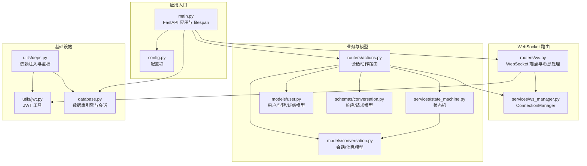
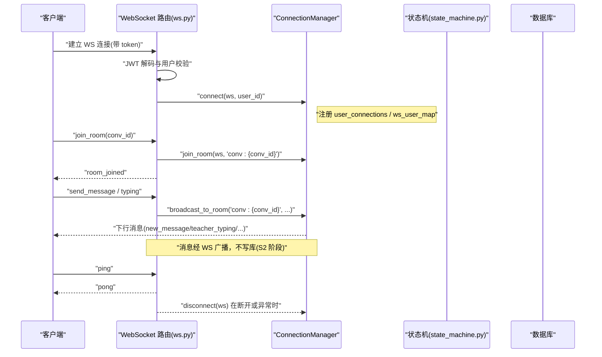
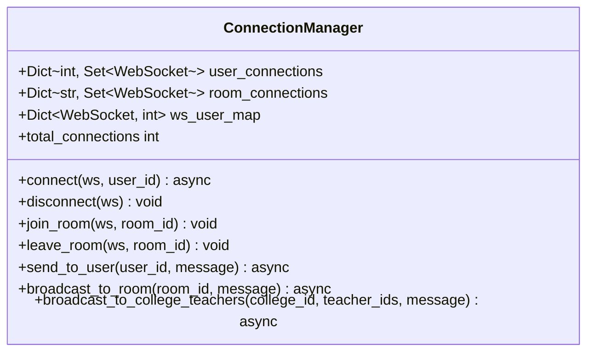
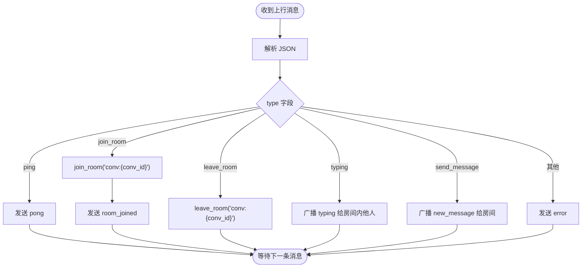
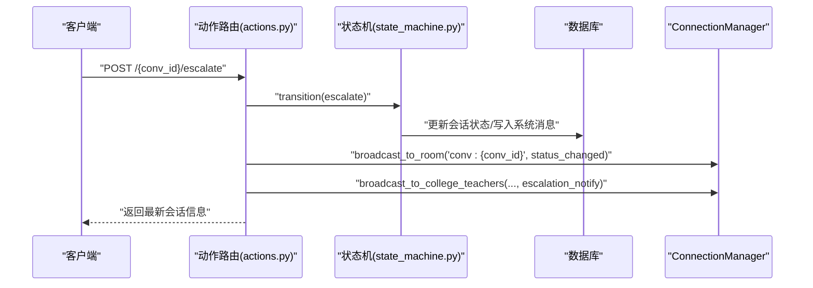
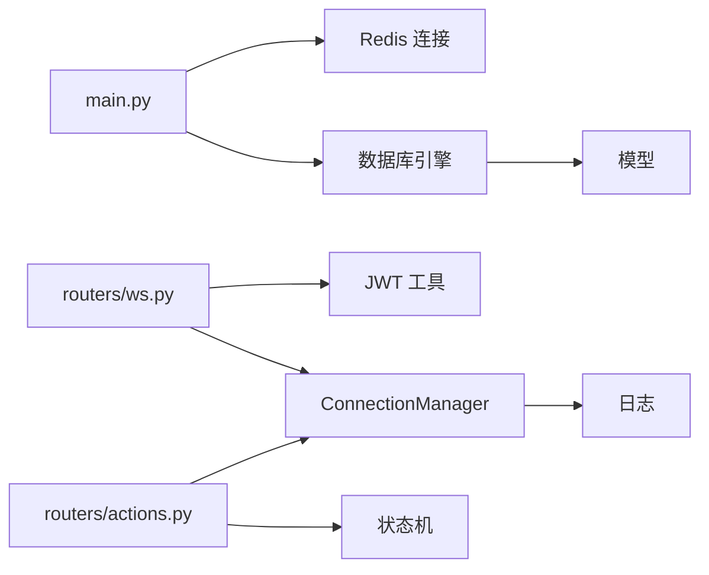

# WebSocket 服务器

<cite>
**本文引用的文件**
- [services/gateway/app/services/ws_manager.py](file://services/gateway/app/services/ws_manager.py)
- [services/gateway/app/routers/ws.py](file://services/gateway/app/routers/ws.py)
- [services/gateway/app/main.py](file://services/gateway/app/main.py)
- [services/gateway/app/config.py](file://services/gateway/app/config.py)
- [services/gateway/app/utils/jwt.py](file://services/gateway/app/utils/jwt.py)
- [services/gateway/app/routers/actions.py](file://services/gateway/app/routers/actions.py)
- [services/gateway/app/models/conversation.py](file://services/gateway/app/models/conversation.py)
- [services/gateway/app/schemas/conversation.py](file://services/gateway/app/schemas/conversation.py)
- [services/gateway/app/database.py](file://services/gateway/app/database.py)
- [services/gateway/app/utils/deps.py](file://services/gateway/app/utils/deps.py)
- [services/gateway/app/models/user.py](file://services/gateway/app/models/user.py)
- [services/gateway/app/services/state_machine.py](file://services/gateway/app/services/state_machine.py)
- [services/gateway/app/services/conversation_service.py](file://services/gateway/app/services/conversation_service.py)
- [services/gateway/requirements.txt](file://services/gateway/requirements.txt)
- [scripts/s2-ws-test.py](file://scripts/s2-ws-test.py)
</cite>

## 目录
1. [简介](#简介)
2. [项目结构](#项目结构)
3. [核心组件](#核心组件)
4. [架构总览](#架构总览)
5. [详细组件分析](#详细组件分析)
6. [依赖分析](#依赖分析)
7. [性能考虑](#性能考虑)
8. [故障排查指南](#故障排查指南)
9. [结论](#结论)
10. [附录](#附录)

## 简介
本文件面向 WebSocket 服务器的技术文档，重点围绕 ConnectionManager 的设计与实现展开，涵盖连接管理、房间管理、用户映射、连接生命周期、消息广播机制（用户级、房间级、学院级）、性能优化与内存管理、连接池与异常处理、日志记录等关键实现细节。同时结合后端路由与业务服务，说明从客户端到数据库与外部服务的完整链路。

## 项目结构
后端采用 FastAPI 应用，WebSocket 路由位于独立模块中，配合统一的配置、依赖注入、数据库与 Redis 连接管理。WebSocket 服务器通过 JWT 认证，使用房间 ID 前缀约定进行会话房间隔离，并在业务动作（如会话状态变更）时触发广播。

图表来源
- [services/gateway/app/main.py:16-28](file://services/gateway/app/main.py#L16-L28)
- [services/gateway/app/routers/ws.py:11-34](file://services/gateway/app/routers/ws.py#L11-L34)
- [services/gateway/app/services/ws_manager.py:8-24](file://services/gateway/app/services/ws_manager.py#L8-L24)
- [services/gateway/app/routers/actions.py:68-89](file://services/gateway/app/routers/actions.py#L68-L89)
- [services/gateway/app/services/state_machine.py:34-96](file://services/gateway/app/services/state_machine.py#L34-L96)
- [services/gateway/app/models/conversation.py:26-63](file://services/gateway/app/models/conversation.py#L26-L63)
- [services/gateway/app/models/user.py:45-76](file://services/gateway/app/models/user.py#L45-L76)
- [services/gateway/app/schemas/conversation.py:9-50](file://services/gateway/app/schemas/conversation.py#L9-L50)
- [services/gateway/app/utils/deps.py:14-39](file://services/gateway/app/utils/deps.py#L14-L39)
- [services/gateway/app/utils/jwt.py:6-17](file://services/gateway/app/utils/jwt.py#L6-L17)
- [services/gateway/app/database.py:6-15](file://services/gateway/app/database.py#L6-L15)

章节来源
- [services/gateway/app/main.py:16-28](file://services/gateway/app/main.py#L16-L28)
- [services/gateway/app/config.py:3-31](file://services/gateway/app/config.py#L3-L31)

## 核心组件
- ConnectionManager：负责 WebSocket 连接的注册/注销、房间加入/离开、用户级与房间级广播、以及“学院级教师广播”的聚合调用。内部维护三层映射：用户到连接集合、房间到连接集合、连接到用户的反向映射。
- WebSocket 路由：提供 /ws 端点，基于查询参数携带 JWT 进行认证；处理 ping/pong、加入/离开房间、输入打字提示、消息广播等上行消息类型。
- 业务动作路由：在会话状态变更（升级、接单、解决、关闭）时，先执行状态机更新，再广播房间级状态变更消息，并在需要时广播给学院内所有在线教师。
- 配置与依赖：集中于 config.py；依赖注入通过 utils/deps.py 提供 JWT 当前用户解析、Redis 获取等；数据库连接池通过 database.py 初始化。

章节来源
- [services/gateway/app/services/ws_manager.py:8-99](file://services/gateway/app/services/ws_manager.py#L8-L99)
- [services/gateway/app/routers/ws.py:11-119](file://services/gateway/app/routers/ws.py#L11-L119)
- [services/gateway/app/routers/actions.py:68-153](file://services/gateway/app/routers/actions.py#L68-L153)
- [services/gateway/app/config.py:3-31](file://services/gateway/app/config.py#L3-L31)
- [services/gateway/app/utils/deps.py:14-39](file://services/gateway/app/utils/deps.py#L14-L39)
- [services/gateway/app/database.py:6-15](file://services/gateway/app/database.py#L6-L15)

## 架构总览
WebSocket 服务器以 ConnectionManager 为核心枢纽，将客户端连接与业务动作解耦。客户端通过 JWT 认证接入，进入房间后接收房间级广播；业务动作触发后，服务器在数据库层面更新状态并广播相应消息。日志记录贯穿认证、消息处理与异常路径，便于运维与排障。

图表来源
- [services/gateway/app/routers/ws.py:35-119](file://services/gateway/app/routers/ws.py#L35-L119)
- [services/gateway/app/services/ws_manager.py:25-46](file://services/gateway/app/services/ws_manager.py#L25-L46)
- [services/gateway/app/services/ws_manager.py:71-81](file://services/gateway/app/services/ws_manager.py#L71-L81)

## 详细组件分析

### ConnectionManager 设计与实现
- 数据结构
  - user_connections: 用户 ID → WebSocket 集合，支持用户级广播。
  - room_connections: 房间 ID → WebSocket 集合，支持房间级广播。
  - ws_user_map: WebSocket → 用户 ID，反向映射，便于断连清理。
- 关键方法
  - connect：接受连接、注册用户映射、记录日志。
  - disconnect：清理用户映射与房间映射，必要时删除空房间。
  - join_room/leave_room：房间加入/离开。
  - send_to_user：遍历用户所有连接，逐个发送 JSON；捕获异常并回收失效连接。
  - broadcast_to_room：遍历房间内连接，逐个发送 JSON；捕获异常并回收失效连接。
  - broadcast_to_college_teachers：对指定教师列表逐一进行用户级广播。
  - total_connections：统计当前活跃连接数。
- 复杂度与性能
  - 单次广播为 O(N)，N 为房间/用户连接数；建议控制房间规模或采用分片广播。
  - 断连清理在发送失败时即时执行，避免内存泄漏与僵尸连接累积。
- 错误处理
  - 发送异常即视为断连，立即从用户映射与房间映射中剔除，确保数据一致性。
- 日志
  - 连接/断开事件记录用户 ID 与当前总连接数，便于监控与审计。

图表来源
- [services/gateway/app/services/ws_manager.py:8-99](file://services/gateway/app/services/ws_manager.py#L8-L99)

章节来源
- [services/gateway/app/services/ws_manager.py:8-99](file://services/gateway/app/services/ws_manager.py#L8-L99)

### WebSocket 路由与消息协议
- 认证流程
  - 通过查询参数携带 JWT，解码后提取用户 ID 与角色；失败则主动关闭连接。
- 支持的消息类型
  - 上行：ping、join_room、leave_room、typing、send_message。
  - 下行：pong、room_joined、new_message、status_changed、teacher_typing、student_typing、error。
- 房间命名规范
  - 使用前缀 "conv:" + 会话 ID，确保房间 ID 唯一且与业务实体关联。
- 生命周期处理
  - 连接建立：accept 并注册到 ConnectionManager。
  - 消息循环：解析 JSON，根据类型分派处理；异常捕获并记录日志，随后断开清理。
  - 断开清理：WebSocketDisconnect 或其他异常均触发 disconnect。

图表来源
- [services/gateway/app/routers/ws.py:56-113](file://services/gateway/app/routers/ws.py#L56-L113)

章节来源
- [services/gateway/app/routers/ws.py:11-119](file://services/gateway/app/routers/ws.py#L11-L119)

### 业务动作与广播策略
- 会话状态机
  - 定义合法状态转换表，支持升级、接单、解决、关闭、超时回退等动作。
  - 执行状态更新与系统消息写入，保证事务性与一致性。
- 广播策略
  - 房间级广播：状态变更消息广播至对应会话房间。
  - 学院级广播：查询同学院在线教师列表，逐一进行用户级广播，推送新工单通知。
- 权限与访问控制
  - 通过 can_access_conversation 校验当前用户是否可操作目标会话。
  - 教师仅能查看本学院待接单或自己正在服务的会话。

图表来源
- [services/gateway/app/routers/actions.py:68-89](file://services/gateway/app/routers/actions.py#L68-L89)
- [services/gateway/app/services/state_machine.py:34-96](file://services/gateway/app/services/state_machine.py#L34-L96)
- [services/gateway/app/services/ws_manager.py:71-91](file://services/gateway/app/services/ws_manager.py#L71-L91)

章节来源
- [services/gateway/app/routers/actions.py:35-65](file://services/gateway/app/routers/actions.py#L35-L65)
- [services/gateway/app/routers/actions.py:68-153](file://services/gateway/app/routers/actions.py#L68-L153)
- [services/gateway/app/services/state_machine.py:16-96](file://services/gateway/app/services/state_machine.py#L16-L96)
- [services/gateway/app/services/conversation_service.py:7-27](file://services/gateway/app/services/conversation_service.py#L7-L27)

### 数据模型与消息结构
- 会话与消息
  - 会话状态枚举覆盖 AI 服务、等待教师、教师服务、已解决、已关闭。
  - 消息发送方类型包含学生、AI、教师、系统。
- 响应模型
  - ConversationResponse、MessageResponse 等，用于 HTTP 接口与前端展示。
- 房间与用户
  - 用户角色包含学生、教师、管理员；教师可按学院维度进行广播范围限定。

章节来源
- [services/gateway/app/models/conversation.py:11-63](file://services/gateway/app/models/conversation.py#L11-L63)
- [services/gateway/app/schemas/conversation.py:9-50](file://services/gateway/app/schemas/conversation.py#L9-L50)
- [services/gateway/app/models/user.py:10-76](file://services/gateway/app/models/user.py#L10-L76)

## 依赖分析
- 应用生命周期
  - main.py 中通过 lifespan 创建 Redis 连接并在应用结束时关闭，确保资源释放。
- 数据库连接池
  - database.py 使用异步引擎与连接池，pool_size 控制并发连接上限。
- 依赖注入
  - utils/deps.py 提供 get_current_user 与 get_redis，简化路由中的依赖获取。
- 外部服务
  - health 接口检查 PostgreSQL、Redis 与 Dify API 的可用性，作为健康探针。

图表来源
- [services/gateway/app/main.py:16-28](file://services/gateway/app/main.py#L16-L28)
- [services/gateway/app/database.py:6-15](file://services/gateway/app/database.py#L6-L15)
- [services/gateway/app/utils/deps.py:14-39](file://services/gateway/app/utils/deps.py#L14-L39)
- [services/gateway/app/routers/ws.py:35-42](file://services/gateway/app/routers/ws.py#L35-L42)

章节来源
- [services/gateway/app/main.py:16-28](file://services/gateway/app/main.py#L16-L28)
- [services/gateway/app/database.py:6-15](file://services/gateway/app/database.py#L6-L15)
- [services/gateway/app/utils/deps.py:14-39](file://services/gateway/app/utils/deps.py#L14-L39)

## 性能考虑
- 连接池与数据库
  - 异步数据库连接池默认大小为 10，建议根据峰值 QPS 与慢查询情况调整，避免阻塞。
- 广播策略
  - 房间级广播为 O(N)；建议限制单房间最大连接数，或采用分片广播与多实例协调。
  - 学院级广播对在线教师列表进行逐一广播，需关注教师在线数量与网络抖动。
- 发送失败回收
  - ConnectionManager 在发送异常时自动回收断连，降低内存占用与无效广播成本。
- 日志与监控
  - 建议引入结构化日志与指标埋点（连接数、消息吞吐、广播耗时、异常率），辅助容量规划与性能优化。
- 缓存与去重
  - 对频繁的房间状态查询可引入缓存；对重复消息进行去重（如重复 typing）可减少网络压力。

[本节为通用性能指导，无需特定文件引用]

## 故障排查指南
- 认证失败
  - 现象：连接被关闭，错误码 4001。
  - 排查：确认 token 是否有效、算法与密钥一致、过期时间合理。
- 消息格式错误
  - 现象：收到 error 消息，提示 JSON 无效。
  - 排查：检查客户端消息格式，确保包含 type 与 data 字段。
- 房间加入失败
  - 现象：未收到 room_joined。
  - 排查：确认 conv_id 是否正确、房间前缀是否为 "conv:"。
- 广播无响应
  - 现象：发送消息或 typing 无下行消息。
  - 排查：确认客户端已加入房间；检查 ConnectionManager 的房间映射与发送逻辑；查看日志定位异常连接。
- 断连与清理
  - 现象：连接断开后仍占用内存。
  - 排查：确认异常路径是否触发 disconnect；检查日志中断连事件与用户映射清理情况。
- 健康检查
  - 现象：/health 返回 degraded。
  - 排查：分别检查 PostgreSQL、Redis 与 Dify API 的连通性与鉴权配置。

章节来源
- [services/gateway/app/routers/ws.py:35-42](file://services/gateway/app/routers/ws.py#L35-L42)
- [services/gateway/app/routers/ws.py:52-54](file://services/gateway/app/routers/ws.py#L52-L54)
- [services/gateway/app/routers/ws.py:114-118](file://services/gateway/app/routers/ws.py#L114-L118)
- [services/gateway/app/main.py:30-68](file://services/gateway/app/main.py#L30-L68)
- [scripts/s2-ws-test.py:37-47](file://scripts/s2-ws-test.py#L37-L47)

## 结论
本 WebSocket 服务器通过 ConnectionManager 实现了清晰的连接与房间管理，结合 JWT 认证与业务动作路由，实现了从连接建立、房间加入/离开、消息广播到状态变更通知的完整闭环。在性能方面，建议通过连接池调优、广播策略优化与日志监控持续改进；在可靠性方面，异常路径的断连回收与健康检查提供了基础保障。后续可在 S3 阶段完善消息持久化与事务一致性，进一步提升系统鲁棒性。

[本节为总结性内容，无需特定文件引用]

## 附录

### 关键实现细节清单
- 连接管理
  - connect/disconnect：注册/清理用户映射与房间映射。
  - 反向映射 ws_user_map：断连时快速回收。
- 房间管理
  - join_room/leave_room：房间加入/离开。
  - 房间 ID 规范："conv:{conv_id}"。
- 广播机制
  - send_to_user：用户级广播。
  - broadcast_to_room：房间级广播。
  - broadcast_to_college_teachers：学院级广播。
- 生命周期
  - 认证：JWT 解码与用户校验。
  - 消息循环：JSON 解析与类型分派。
  - 断开：WebSocketDisconnect 与异常清理。
- 业务集成
  - 状态机：合法状态转换与系统消息写入。
  - 权限：can_access_conversation 校验。
  - 广播：状态变更与新工单通知。

章节来源
- [services/gateway/app/services/ws_manager.py:25-91](file://services/gateway/app/services/ws_manager.py#L25-L91)
- [services/gateway/app/routers/ws.py:35-119](file://services/gateway/app/routers/ws.py#L35-L119)
- [services/gateway/app/routers/actions.py:68-153](file://services/gateway/app/routers/actions.py#L68-L153)
- [services/gateway/app/services/state_machine.py:34-96](file://services/gateway/app/services/state_machine.py#L34-L96)
- [services/gateway/app/services/conversation_service.py:7-27](file://services/gateway/app/services/conversation_service.py#L7-L27)

### 依赖版本与运行环境
- Python 依赖集中在 requirements.txt，包含 FastAPI、SQLAlchemy 异步、Redis、JWT、HTTP 客户端与配置工具等。
- 建议在生产环境设置合适的环境变量与密钥，启用 HTTPS 与连接池参数调优。

章节来源
- [services/gateway/requirements.txt:1-29](file://services/gateway/requirements.txt#L1-L29)