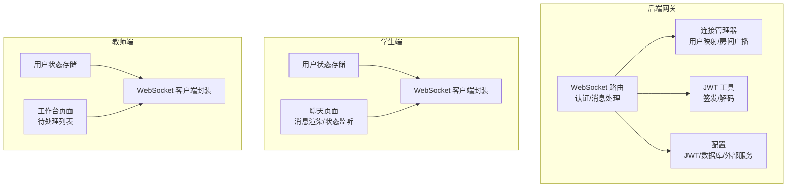
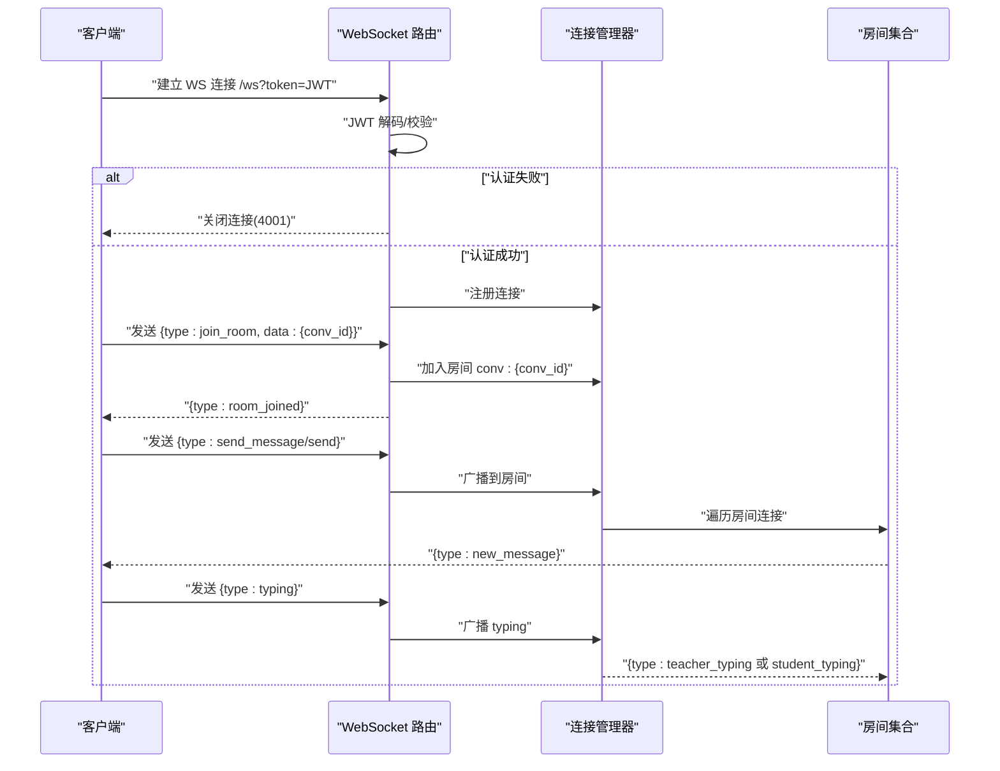
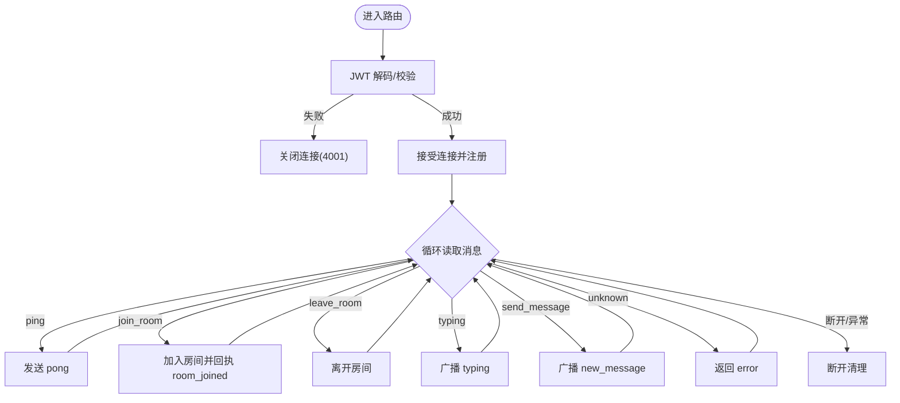
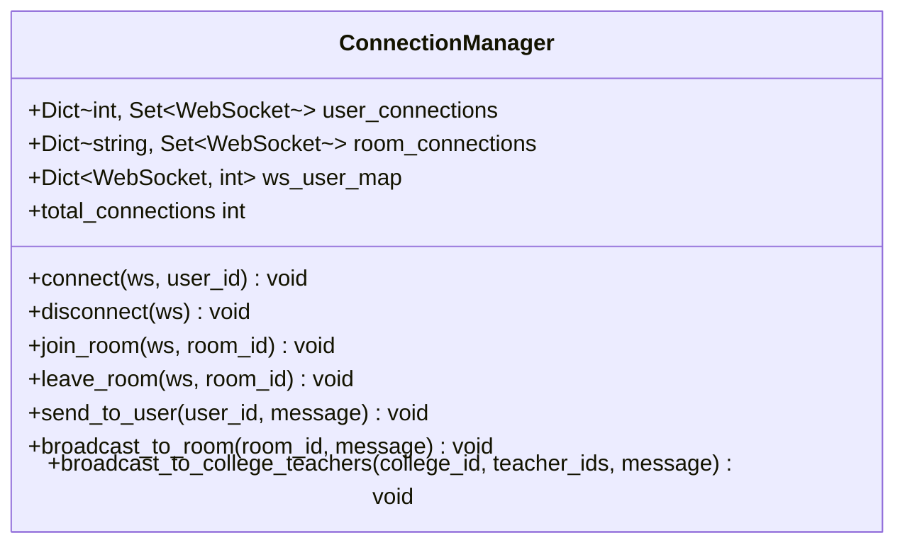
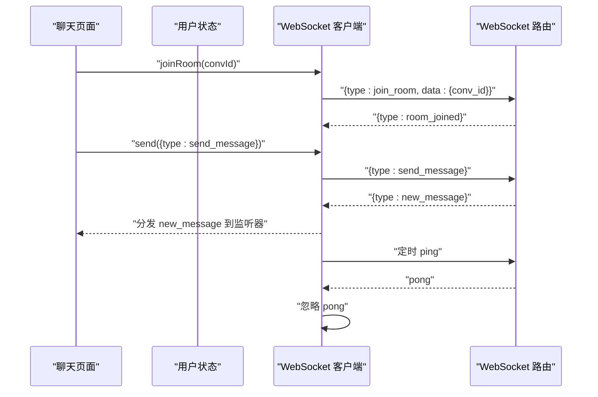
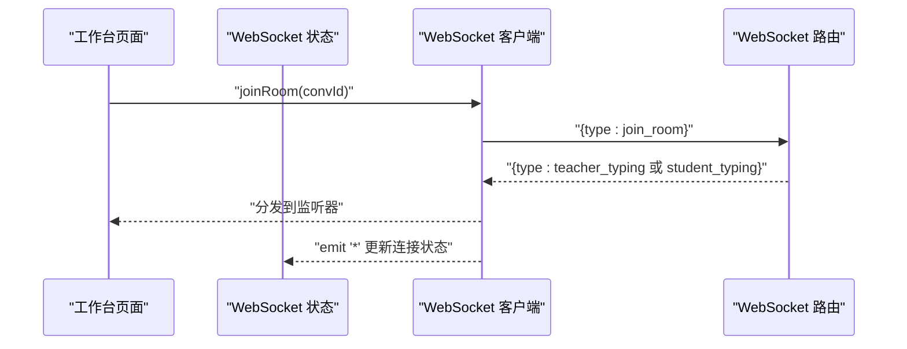
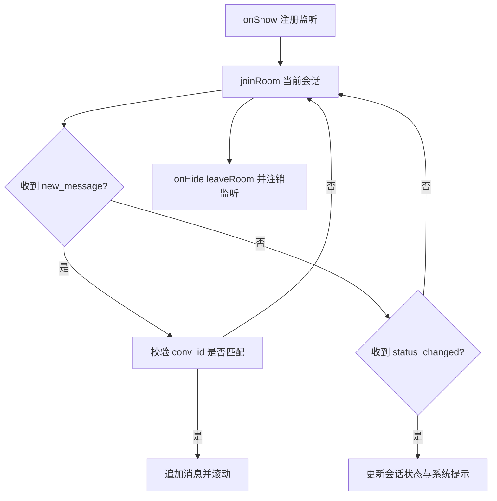
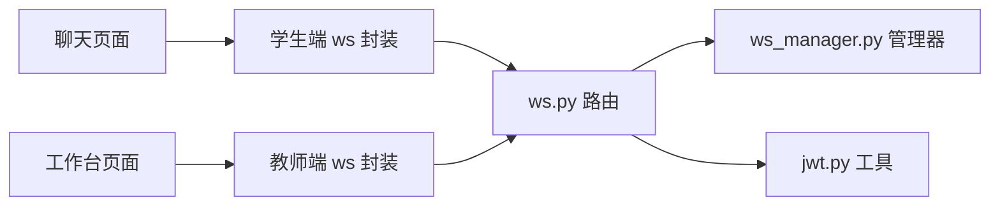

# 实时通信系统

<cite>
**本文引用的文件**
- [services/gateway/app/routers/ws.py](file://services/gateway/app/routers/ws.py)
- [services/gateway/app/services/ws_manager.py](file://services/gateway/app/services/ws_manager.py)
- [services/gateway/app/utils/jwt.py](file://services/gateway/app/utils/jwt.py)
- [services/gateway/app/config.py](file://services/gateway/app/config.py)
- [apps/student-app/src/utils/websocket.ts](file://apps/student-app/src/utils/websocket.ts)
- [apps/teacher-app/src/utils/websocket.ts](file://apps/teacher-app/src/utils/websocket.ts)
- [apps/student-app/src/pages/chat/index.vue](file://apps/student-app/src/pages/chat/index.vue)
- [apps/teacher-app/src/pages/dashboard/index.vue](file://apps/teacher-app/src/pages/dashboard/index.vue)
- [apps/student-app/src/stores/user.ts](file://apps/student-app/src/stores/user.ts)
- [apps/teacher-app/src/stores/user.ts](file://apps/teacher-app/src/stores/user.ts)
- [apps/teacher-app/src/stores/websocket.ts](file://apps/teacher-app/src/stores/websocket.ts)
- [apps/student-app/src/api/chat.ts](file://apps/student-app/src/api/chat.ts)
- [apps/teacher-app/src/api/conversations.ts](file://apps/teacher-app/src/api/conversations.ts)
- [apps/student-app/src/types/chat.ts](file://apps/student-app/src/types/chat.ts)
- [apps/teacher-app/src/types/conversation.ts](file://apps/teacher-app/src/types/conversation.ts)
- [scripts/s2-ws-test.py](file://scripts/s2-ws-test.py)
- [ws_test.py](file://ws_test.py)
</cite>

## 目录
1. [引言](#引言)
2. [项目结构](#项目结构)
3. [核心组件](#核心组件)
4. [架构总览](#架构总览)
5. [详细组件分析](#详细组件分析)
6. [依赖分析](#依赖分析)
7. [性能考虑](#性能考虑)
8. [故障排查指南](#故障排查指南)
9. [结论](#结论)
10. [附录](#附录)

## 引言
本文件面向“医小管 v2”项目的实时通信系统，围绕 WebSocket 服务器设计与实现、房间广播机制、心跳检测、消息路由与状态同步、错误恢复策略，以及客户端 WebSocket 客户端的连接建立、消息收发与自动重连机制进行系统化梳理。同时提供最佳实践、性能优化建议、常见问题排查与调试技巧，并阐述实时通知机制与用户体验优化策略。

## 项目结构
实时通信系统由三部分组成：
- 后端网关（FastAPI + WebSocket）：负责认证、连接管理、房间广播与消息分发。
- 学生端与教师端前端应用：分别提供统一的 WebSocket 客户端封装、房间加入/离开、心跳与自动重连、消息监听与状态更新。
- 测试脚本：提供基础连通性测试与协议验证。

图表来源
- [services/gateway/app/routers/ws.py:11-119](file://services/gateway/app/routers/ws.py#L11-L119)
- [services/gateway/app/services/ws_manager.py:8-100](file://services/gateway/app/services/ws_manager.py#L8-L100)
- [services/gateway/app/utils/jwt.py:6-17](file://services/gateway/app/utils/jwt.py#L6-L17)
- [services/gateway/app/config.py:3-31](file://services/gateway/app/config.py#L3-L31)
- [apps/student-app/src/utils/websocket.ts:3-153](file://apps/student-app/src/utils/websocket.ts#L3-L153)
- [apps/teacher-app/src/utils/websocket.ts:9-169](file://apps/teacher-app/src/utils/websocket.ts#L9-L169)
- [apps/student-app/src/pages/chat/index.vue:279-326](file://apps/student-app/src/pages/chat/index.vue#L279-L326)
- [apps/teacher-app/src/pages/dashboard/index.vue:200-251](file://apps/teacher-app/src/pages/dashboard/index.vue#L200-L251)

章节来源
- [services/gateway/app/routers/ws.py:11-119](file://services/gateway/app/routers/ws.py#L11-L119)
- [services/gateway/app/services/ws_manager.py:8-100](file://services/gateway/app/services/ws_manager.py#L8-L100)
- [apps/student-app/src/utils/websocket.ts:3-153](file://apps/student-app/src/utils/websocket.ts#L3-L153)
- [apps/teacher-app/src/utils/websocket.ts:9-169](file://apps/teacher-app/src/utils/websocket.ts#L9-L169)

## 核心组件
- WebSocket 路由与消息协议
  - 路由入口：/ws，使用查询参数携带 JWT token。
  - 上行消息类型：join_room、leave_room、send_message、typing、ping。
  - 下行消息类型：room_joined、new_message、status_changed、teacher_typing、pong、error。
- 连接管理器
  - 用户级连接映射：user_id → set[WebSocket]，支持向指定用户推送。
  - 房间级连接映射：room_id → set[WebSocket]，支持房间广播。
  - 断线清理：移除用户所有连接及在所有房间中的连接。
- 客户端 WebSocket 管理器（学生端/教师端）
  - 统一连接生命周期：连接、消息分发、断线重连、心跳维持。
  - 房间状态：记录已加入房间集合，断线后自动 re-join。
  - 发送队列：未连接时缓存消息，连上后 flush。
  - 心跳：周期性发送 ping，收到 pong 不触发业务回调。
- 认证与配置
  - JWT 解码校验，失败直接关闭连接。
  - JWT 过期时间、算法与密钥配置。

章节来源
- [services/gateway/app/routers/ws.py:16-34](file://services/gateway/app/routers/ws.py#L16-L34)
- [services/gateway/app/services/ws_manager.py:8-96](file://services/gateway/app/services/ws_manager.py#L8-L96)
- [apps/student-app/src/utils/websocket.ts:3-153](file://apps/student-app/src/utils/websocket.ts#L3-L153)
- [apps/teacher-app/src/utils/websocket.ts:9-169](file://apps/teacher-app/src/utils/websocket.ts#L9-L169)
- [services/gateway/app/utils/jwt.py:6-17](file://services/gateway/app/utils/jwt.py#L6-L17)
- [services/gateway/app/config.py:10-13](file://services/gateway/app/config.py#L10-L13)

## 架构总览
下图展示了从客户端发起连接到消息广播的完整链路，包括认证、房间加入、消息广播与状态同步。

图表来源
- [services/gateway/app/routers/ws.py:35-119](file://services/gateway/app/routers/ws.py#L35-L119)
- [services/gateway/app/services/ws_manager.py:25-81](file://services/gateway/app/services/ws_manager.py#L25-L81)

## 详细组件分析

### 后端 WebSocket 路由与消息处理
- 认证流程
  - 从查询参数提取 token，调用 JWT 工具解码；失败则关闭连接。
- 连接注册
  - 接受连接后注册到连接管理器，建立 user_id → WebSocket 的映射。
- 消息处理
  - ping/pong：保持心跳，pong 不触发业务回调。
  - join_room/leave_room：加入/离开房间，房间 ID 规范为 "conv:{conversation_id}"。
  - typing：根据用户角色广播教师/学生正在输入的状态。
  - send_message：在 S2 阶段仅做房间广播，不落库；正式环境应通过 HTTP API 写库并通知。
  - 未知类型：返回 error 类型消息。
- 错误处理
  - WebSocketDisconnect：断开清理。
  - 其他异常：记录日志并断开清理。

图表来源
- [services/gateway/app/routers/ws.py:35-119](file://services/gateway/app/routers/ws.py#L35-L119)

章节来源
- [services/gateway/app/routers/ws.py:11-119](file://services/gateway/app/routers/ws.py#L11-L119)
- [services/gateway/app/utils/jwt.py:14-17](file://services/gateway/app/utils/jwt.py#L14-L17)

### 连接管理器（ConnectionManager）
- 数据结构
  - user_connections：用户到连接集合的映射。
  - room_connections：房间到连接集合的映射。
  - ws_user_map：连接到用户的反向映射。
- 方法
  - connect/disconnect：连接生命周期管理与断线清理。
  - join_room/leave_room：房间加入/离开。
  - send_to_user：向指定用户所有连接发送消息。
  - broadcast_to_room：向房间内所有连接广播。
  - broadcast_to_college_teachers：向指定教师集合广播（扩展能力）。
- 异常处理
  - 广播过程中捕获异常并清理失效连接，避免阻塞后续广播。

图表来源
- [services/gateway/app/services/ws_manager.py:8-96](file://services/gateway/app/services/ws_manager.py#L8-L96)

章节来源
- [services/gateway/app/services/ws_manager.py:8-100](file://services/gateway/app/services/ws_manager.py#L8-L100)

### 客户端 WebSocket 客户端（学生端）
- 关键特性
  - 单连接模型：一个连接承载多个房间。
  - 房间追踪：断线后自动 re-join。
  - 发送队列：未连接时缓存消息，连上后 flush。
  - 心跳：每 30 秒发送一次 ping，忽略 pong 回包。
  - 事件分发：统一分发到注册的监听器。
- 生命周期
  - connect：构造 URL（wss/ws + host + token），建立连接。
  - onOpen：标记连接状态、启动心跳、flush 发送队列、re-join 房间、触发 _connected。
  - onMessage：解析 JSON，忽略 pong，分发到对应 type 的监听器。
  - onClose/onError：停止心跳、调度指数退避重连、触发 _disconnected。
  - disconnect：清理资源、清空发送队列、阻止重连。

图表来源
- [apps/student-app/src/utils/websocket.ts:20-153](file://apps/student-app/src/utils/websocket.ts#L20-L153)
- [apps/student-app/src/pages/chat/index.vue:279-326](file://apps/student-app/src/pages/chat/index.vue#L279-L326)
- [services/gateway/app/routers/ws.py:59-112](file://services/gateway/app/routers/ws.py#L59-L112)

章节来源
- [apps/student-app/src/utils/websocket.ts:3-153](file://apps/student-app/src/utils/websocket.ts#L3-L153)
- [apps/student-app/src/pages/chat/index.vue:279-326](file://apps/student-app/src/pages/chat/index.vue#L279-L326)

### 客户端 WebSocket 客户端（教师端）
- 关键特性
  - 与学生端一致的单连接 + 房间模式。
  - 支持 '*' 通配符监听，便于全局状态维护。
  - 断线清理更彻底：停止心跳、清除重连定时器、关闭连接句柄。
- 生命周期
  - connect：构造 URL，建立连接。
  - onOpen：启动心跳、flush 发送队列、re-join 房间、触发 _connected。
  - onMessage：解析 JSON，忽略 pong，分发到具体 type 与 '*'。
  - onClose：停止心跳、触发 _disconnected、指数退避重连。
  - disconnect：阻止重连、清理资源。

图表来源
- [apps/teacher-app/src/utils/websocket.ts:26-169](file://apps/teacher-app/src/utils/websocket.ts#L26-L169)
- [apps/teacher-app/src/stores/websocket.ts:9-31](file://apps/teacher-app/src/stores/websocket.ts#L9-L31)

章节来源
- [apps/teacher-app/src/utils/websocket.ts:9-169](file://apps/teacher-app/src/utils/websocket.ts#L9-L169)
- [apps/teacher-app/src/stores/websocket.ts:5-31](file://apps/teacher-app/src/stores/websocket.ts#L5-L31)

### 实时消息处理流程与状态同步
- 学生端
  - 监听 new_message：当消息属于当前会话时，追加到消息列表并滚动到底部。
  - 监听 status_changed：根据新状态更新会话状态与系统提示消息。
  - 生命周期：onShow 时注册监听并 joinRoom；onHide 时 leaveRoom 并注销监听。
- 教师端
  - 通过工作台页面加载待处理会话列表，状态变化通过 WebSocket 通知驱动 UI 更新。
  - 使用 '*' 监听器维护全局连接状态与未读计数。

图表来源
- [apps/student-app/src/pages/chat/index.vue:279-326](file://apps/student-app/src/pages/chat/index.vue#L279-L326)
- [apps/teacher-app/src/pages/dashboard/index.vue:200-251](file://apps/teacher-app/src/pages/dashboard/index.vue#L200-L251)

章节来源
- [apps/student-app/src/pages/chat/index.vue:279-326](file://apps/student-app/src/pages/chat/index.vue#L279-L326)
- [apps/teacher-app/src/pages/dashboard/index.vue:200-251](file://apps/teacher-app/src/pages/dashboard/index.vue#L200-L251)

### 实时通知机制与用户体验优化
- 通知策略
  - 教师端：工作台顶部徽标显示未读数，结合 '*' 监听器动态更新。
  - 学生端：当处于 pending_teacher 状态时，AI 提示转人工按钮，点击后发送转人工请求并显示系统提示。
- 体验优化
  - 输入防抖与禁用：发送中禁用输入，流式响应时显示打字动画与光标闪烁。
  - 时间戳与滚动：消息新增后自动滚动到底部，提升阅读连续性。
  - Markdown 渲染与来源展示：支持参考文献弹层，增强可信度与可追溯性。

章节来源
- [apps/teacher-app/src/stores/websocket.ts:5-31](file://apps/teacher-app/src/stores/websocket.ts#L5-L31)
- [apps/student-app/src/pages/chat/index.vue:117-128](file://apps/student-app/src/pages/chat/index.vue#L117-L128)
- [apps/student-app/src/pages/chat/index.vue:536-553](file://apps/student-app/src/pages/chat/index.vue#L536-L553)

## 依赖分析
- 后端
  - WebSocket 路由依赖连接管理器与 JWT 工具。
  - 连接管理器内部使用集合与字典进行 O(1) 级别的查找与删除。
- 前端
  - 学生端与教师端均依赖统一的 WebSocket 客户端封装。
  - 页面组件通过 Pinia store 管理用户态与连接状态，减少耦合。

图表来源
- [services/gateway/app/routers/ws.py:1-8](file://services/gateway/app/routers/ws.py#L1-L8)
- [services/gateway/app/services/ws_manager.py:1-6](file://services/gateway/app/services/ws_manager.py#L1-L6)
- [apps/student-app/src/utils/websocket.ts:1-10](file://apps/student-app/src/utils/websocket.ts#L1-L10)
- [apps/teacher-app/src/utils/websocket.ts:1-10](file://apps/teacher-app/src/utils/websocket.ts#L1-L10)

章节来源
- [services/gateway/app/routers/ws.py:1-8](file://services/gateway/app/routers/ws.py#L1-L8)
- [services/gateway/app/services/ws_manager.py:1-6](file://services/gateway/app/services/ws_manager.py#L1-L6)
- [apps/student-app/src/utils/websocket.ts:1-10](file://apps/student-app/src/utils/websocket.ts#L1-L10)
- [apps/teacher-app/src/utils/websocket.ts:1-10](file://apps/teacher-app/src/utils/websocket.ts#L1-L10)

## 性能考虑
- 连接与广播
  - 使用集合存储连接，广播时逐个发送，异常连接及时清理，避免阻塞。
  - 房间 ID 采用 "conv:{id}" 规范，便于快速定位与清理。
- 心跳与重连
  - 心跳间隔 30 秒，降低网络与 CPU 开销。
  - 指数退避重连上限 30 秒，防止雪崩效应。
- 前端优化
  - 发送队列与 flush 机制确保弱网环境下消息不丢失。
  - UI 层仅在必要时滚动与渲染，避免频繁重排。
- 后端优化
  - 建议在 S3 阶段将消息持久化与通知分离：WS 仅做通知，HTTP API 写库，保障一致性与事务性。

## 故障排查指南
- 常见问题
  - 认证失败：检查 token 是否有效、是否过期、是否正确传递到查询参数。
  - 无法加入房间：确认 conv_id 是否存在、房间 ID 格式是否为 "conv:{id}"。
  - 消息未到达：检查房间是否正确加入、广播逻辑是否执行、客户端是否过滤了非当前会话的消息。
  - 心跳异常：确认客户端是否定时发送 ping、服务端是否返回 pong。
- 调试技巧
  - 使用测试脚本验证基本连通性与协议行为。
  - 在客户端开启日志，观察连接、断开、重连与消息分发过程。
  - 在后端启用日志，观察连接注册、断线清理与广播次数。
- 单元测试与集成测试
  - 基础连通性：ping/pong、join_room 返回 room_joined、未知类型返回 error。
  - 异常场景：无效 token 应导致连接被关闭。

章节来源
- [scripts/s2-ws-test.py:8-50](file://scripts/s2-ws-test.py#L8-L50)
- [ws_test.py:1-8](file://ws_test.py#L1-L8)
- [apps/student-app/src/utils/websocket.ts:129-135](file://apps/student-app/src/utils/websocket.ts#L129-L135)
- [services/gateway/app/routers/ws.py:40-42](file://services/gateway/app/routers/ws.py#L40-L42)

## 结论
本系统以“单连接 + 房间广播”的轻量模式实现了高效稳定的实时通信，结合心跳与指数退避重连机制，兼顾了可用性与性能。前端通过统一的 WebSocket 客户端封装与 Pinia 状态管理，简化了业务复杂度；后端通过连接管理器与清晰的消息协议，提供了良好的扩展性。建议在后续阶段完善消息持久化与事务一致性，进一步提升系统可靠性与可观测性。

## 附录
- 消息协议速查
  - 上行：join_room、leave_room、send_message、typing、ping
  - 下行：room_joined、new_message、status_changed、teacher_typing、pong、error
- 关键实现路径
  - 后端路由与处理：[services/gateway/app/routers/ws.py:11-119](file://services/gateway/app/routers/ws.py#L11-L119)
  - 连接管理器：[services/gateway/app/services/ws_manager.py:8-100](file://services/gateway/app/services/ws_manager.py#L8-L100)
  - 学生端客户端：[apps/student-app/src/utils/websocket.ts:3-153](file://apps/student-app/src/utils/websocket.ts#L3-L153)
  - 教师端客户端：[apps/teacher-app/src/utils/websocket.ts:9-169](file://apps/teacher-app/src/utils/websocket.ts#L9-L169)
  - 学生端聊天页监听：[apps/student-app/src/pages/chat/index.vue:279-326](file://apps/student-app/src/pages/chat/index.vue#L279-L326)
  - 教师端工作台监听：[apps/teacher-app/src/pages/dashboard/index.vue:200-251](file://apps/teacher-app/src/pages/dashboard/index.vue#L200-L251)
  - 测试脚本：[scripts/s2-ws-test.py:8-50](file://scripts/s2-ws-test.py#L8-L50)、[ws_test.py:1-8](file://ws_test.py#L1-L8)