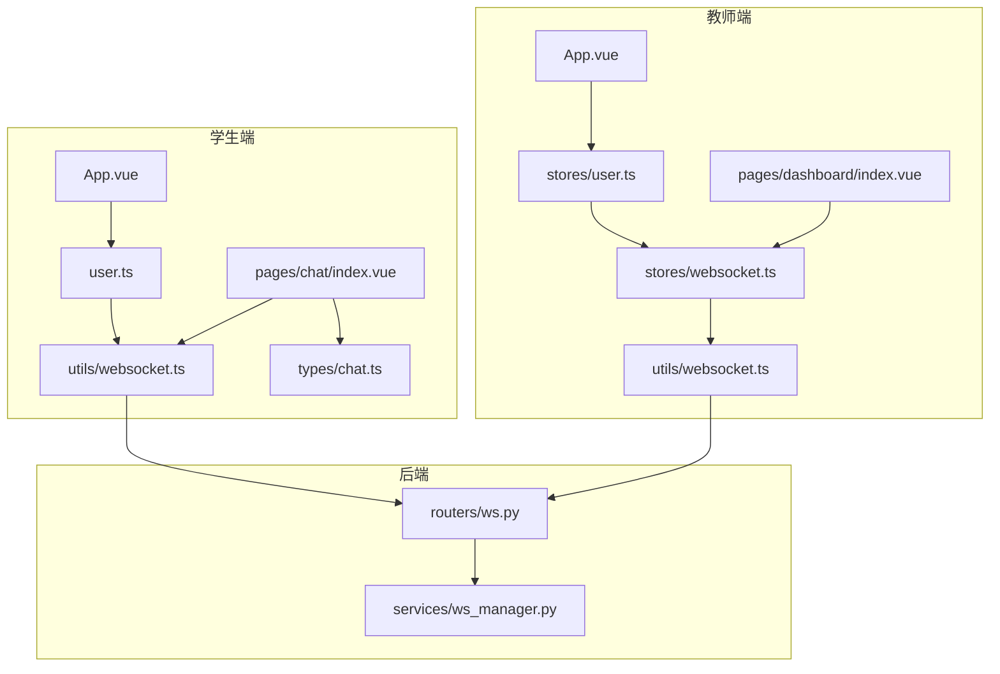
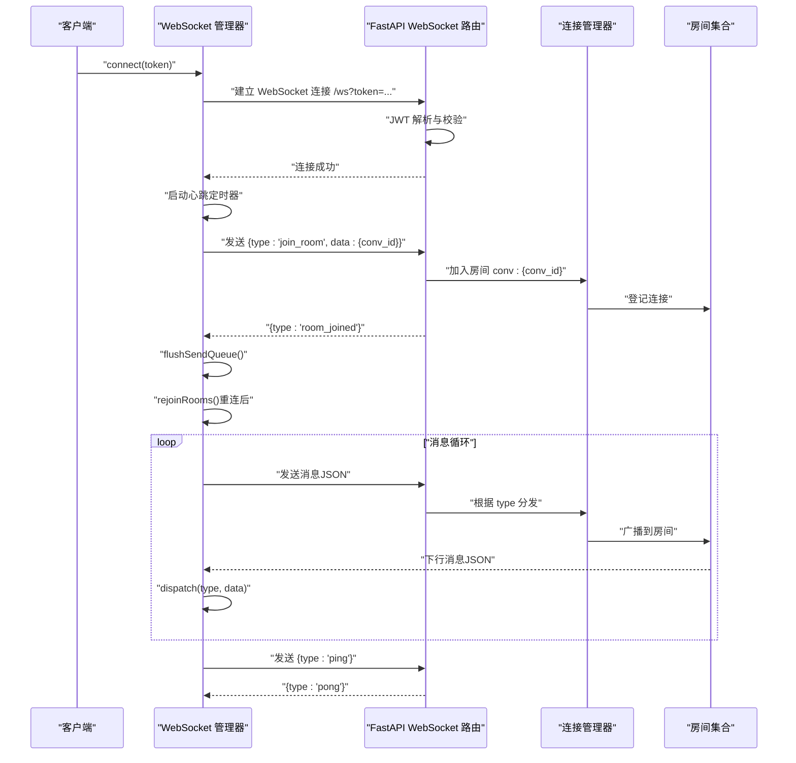
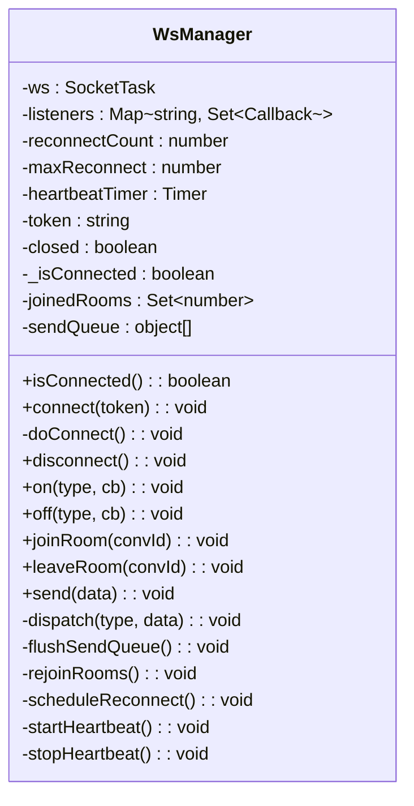
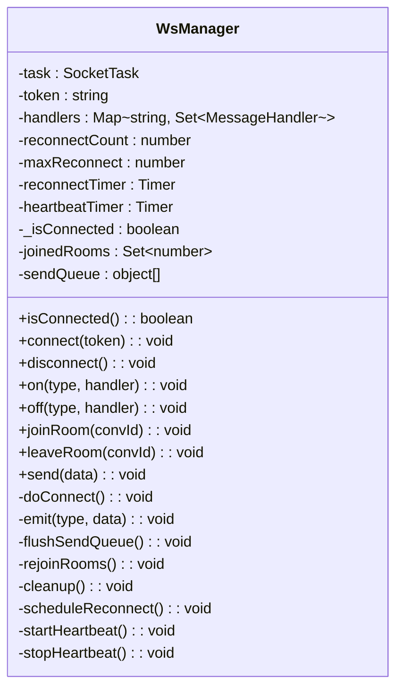
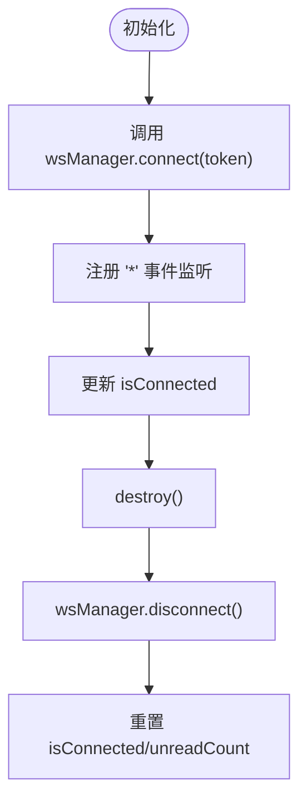
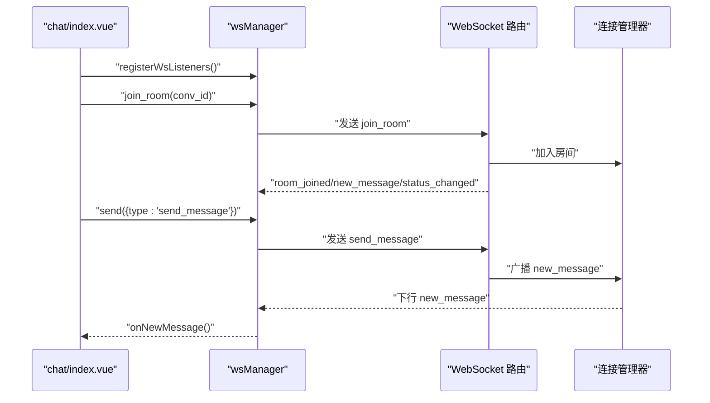
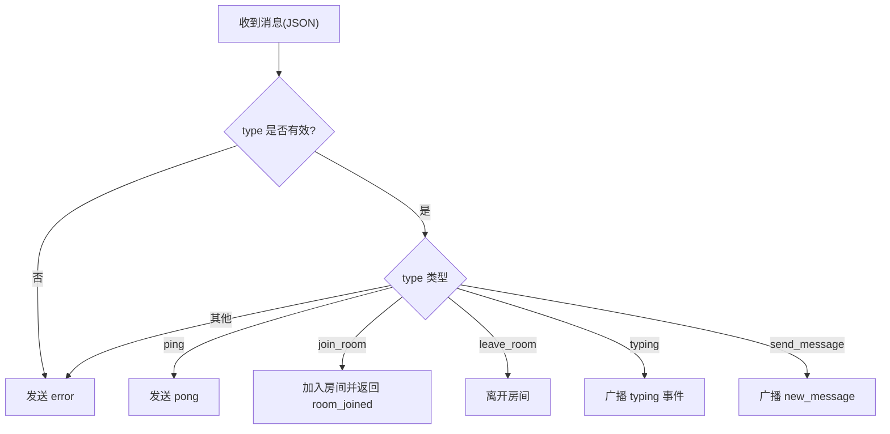
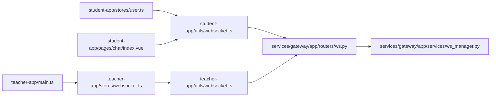

# 客户端 WebSocket 实现

<cite>
**本文档引用的文件**
- [apps/student-app/src/utils/websocket.ts](file://apps/student-app/src/utils/websocket.ts)
- [apps/teacher-app/src/utils/websocket.ts](file://apps/teacher-app/src/utils/websocket.ts)
- [apps/teacher-app/src/stores/websocket.ts](file://apps/teacher-app/src/stores/websocket.ts)
- [apps/student-app/src/stores/user.ts](file://apps/student-app/src/stores/user.ts)
- [apps/teacher-app/src/stores/user.ts](file://apps/teacher-app/src/stores/user.ts)
- [apps/student-app/src/pages/chat/index.vue](file://apps/student-app/src/pages/chat/index.vue)
- [apps/teacher-app/src/pages/dashboard/index.vue](file://apps/teacher-app/src/pages/dashboard/index.vue)
- [services/gateway/app/routers/ws.py](file://services/gateway/app/routers/ws.py)
- [services/gateway/app/services/ws_manager.py](file://services/gateway/app/services/ws_manager.py)
- [apps/student-app/src/types/chat.ts](file://apps/student-app/src/types/chat.ts)
- [apps/teacher-app/src/types/conversation.ts](file://apps/teacher-app/src/types/conversation.ts)
- [scripts/s2-ws-test.py](file://scripts/s2-ws-test.py)
</cite>

## 目录
1. [简介](#简介)
2. [项目结构](#项目结构)
3. [核心组件](#核心组件)
4. [架构总览](#架构总览)
5. [详细组件分析](#详细组件分析)
6. [依赖关系分析](#依赖关系分析)
7. [性能考虑](#性能考虑)
8. [故障排除指南](#故障排除指南)
9. [结论](#结论)
10. [附录](#附录)

## 简介
本文件面向前端 WebSocket 客户端实现，系统性阐述连接建立、认证传递、消息收发、事件分发、心跳保活、自动重连、错误处理与性能优化等关键主题。文档同时结合后端 WebSocket 路由与连接管理器，给出端到端的消息流与状态流转图示，帮助开发者快速理解并维护该聊天系统的实时通信能力。

## 项目结构
本项目采用多应用架构，学生端与教师端分别拥有独立的 WebSocket 客户端实现与状态管理。后端使用 FastAPI 提供 WebSocket 路由，并通过连接管理器维护用户与房间级连接。

图表来源
- [apps/student-app/src/utils/websocket.ts:1-153](file://apps/student-app/src/utils/websocket.ts#L1-L153)
- [apps/teacher-app/src/utils/websocket.ts:1-169](file://apps/teacher-app/src/utils/websocket.ts#L1-L169)
- [apps/teacher-app/src/stores/websocket.ts:1-32](file://apps/teacher-app/src/stores/websocket.ts#L1-L32)
- [apps/student-app/src/stores/user.ts:1-56](file://apps/student-app/src/stores/user.ts#L1-L56)
- [apps/teacher-app/src/stores/user.ts:1-63](file://apps/teacher-app/src/stores/user.ts#L1-L63)
- [apps/student-app/src/pages/chat/index.vue:1-649](file://apps/student-app/src/pages/chat/index.vue#L1-L649)
- [apps/teacher-app/src/pages/dashboard/index.vue:1-669](file://apps/teacher-app/src/pages/dashboard/index.vue#L1-L669)
- [services/gateway/app/routers/ws.py:1-119](file://services/gateway/app/routers/ws.py#L1-L119)
- [services/gateway/app/services/ws_manager.py:1-100](file://services/gateway/app/services/ws_manager.py#L1-L100)

章节来源
- [apps/student-app/src/utils/websocket.ts:1-153](file://apps/student-app/src/utils/websocket.ts#L1-L153)
- [apps/teacher-app/src/utils/websocket.ts:1-169](file://apps/teacher-app/src/utils/websocket.ts#L1-L169)
- [services/gateway/app/routers/ws.py:1-119](file://services/gateway/app/routers/ws.py#L1-L119)

## 核心组件
- 学生端 WebSocket 管理器：封装连接、消息分发、房间加入/离开、发送队列、心跳与指数退避重连。
- 教师端 WebSocket 管理器：与学生端类似，但通过 Pinia Store 管理连接状态与未读数。
- 后端 WebSocket 路由：基于 FastAPI 的 WebSocketEndpoint，负责认证、消息路由与房间广播。
- 后端连接管理器：维护用户连接集合与房间连接集合，支持广播与清理。

章节来源
- [apps/student-app/src/utils/websocket.ts:1-153](file://apps/student-app/src/utils/websocket.ts#L1-L153)
- [apps/teacher-app/src/utils/websocket.ts:1-169](file://apps/teacher-app/src/utils/websocket.ts#L1-L169)
- [services/gateway/app/routers/ws.py:1-119](file://services/gateway/app/routers/ws.py#L1-L119)
- [services/gateway/app/services/ws_manager.py:1-100](file://services/gateway/app/services/ws_manager.py#L1-L100)

## 架构总览
下图展示了从前端到后端的完整 WebSocket 交互路径，包括认证、房间加入、消息广播与心跳保活。

图表来源
- [apps/student-app/src/utils/websocket.ts:20-64](file://apps/student-app/src/utils/websocket.ts#L20-L64)
- [apps/teacher-app/src/utils/websocket.ts:26-114](file://apps/teacher-app/src/utils/websocket.ts#L26-L114)
- [services/gateway/app/routers/ws.py:11-119](file://services/gateway/app/routers/ws.py#L11-L119)
- [services/gateway/app/services/ws_manager.py:25-82](file://services/gateway/app/services/ws_manager.py#L25-L82)

## 详细组件分析

### 学生端 WebSocket 管理器（WsManager）
- 连接参数与认证
  - 使用当前协议与主机拼接 WebSocket 地址，查询参数携带 JWT token。
  - 连接成功后清零重连计数，启动心跳，刷新发送队列，重新加入房间。
- 事件与消息处理
  - onMessage 解析 JSON，忽略 pong；统一分发到监听者。
  - onClose 触发断开事件并调度重连；onError 由 onClose 统一处理。
- 房间管理
  - joinRoom/leaveRoom 维护房间集合，发送 join_room/leave_room。
  - 重连后自动 rejoinRooms。
- 发送队列与回放
  - 未连接时消息入队，连接后 flushSendQueue 逐条发送。
- 心跳与保活
  - 每 30 秒发送 ping，收到 pong 不触发业务逻辑。
- 自动重连
  - 指数退避，上限 30 秒，最多重连 10 次。

图表来源
- [apps/student-app/src/utils/websocket.ts:3-150](file://apps/student-app/src/utils/websocket.ts#L3-L150)

章节来源
- [apps/student-app/src/utils/websocket.ts:1-153](file://apps/student-app/src/utils/websocket.ts#L1-L153)

### 教师端 WebSocket 管理器（WsManager）
- 连接与清理
  - connect 重置重连计数并发起连接；disconnect 设置重连上限以阻止重连。
  - cleanup 统一停止心跳、清除定时器、关闭连接并清空发送队列。
- 事件与消息处理
  - onMessage 解析 JSON，忽略 pong；统一分发到监听者，并额外广播通配符事件。
  - onClose 触发断开事件并调度重连；onError 输出错误日志。
- 房间管理与发送队列
  - 与学生端一致，支持 join/leave 与重连 rejoin。
- 心跳与保活
  - 每 30 秒发送 ping。
- 自动重连
  - 指数退避，上限 30 秒，最多重连 10 次。

图表来源
- [apps/teacher-app/src/utils/websocket.ts:9-166](file://apps/teacher-app/src/utils/websocket.ts#L9-L166)

章节来源
- [apps/teacher-app/src/utils/websocket.ts:1-169](file://apps/teacher-app/src/utils/websocket.ts#L1-L169)

### 教师端 WebSocket Store（useWsStore）
- 初始化与销毁
  - init(token) 调用 wsManager.connect 并监听 '*' 事件更新 isConnected。
  - destroy() 调用 wsManager.disconnect 并重置状态。
- 未读数管理
  - incrementUnread/resetUnread 用于未读提示。

图表来源
- [apps/teacher-app/src/stores/websocket.ts:5-31](file://apps/teacher-app/src/stores/websocket.ts#L5-L31)

章节来源
- [apps/teacher-app/src/stores/websocket.ts:1-32](file://apps/teacher-app/src/stores/websocket.ts#L1-L32)

### 学生端页面集成（chat/index.vue）
- 生命周期与房间管理
  - onShow 时注册 WS 监听，加入当前会话房间；onHide 时离开房间并注销监听。
- 事件处理
  - onNewMessage/onStatusChanged 处理下行消息，更新消息列表与会话状态。
- 发送消息
  - 未创建会话则先创建并加入房间；根据会话状态选择走教师端直连或 AI 流式响应。

图表来源
- [apps/student-app/src/pages/chat/index.vue:249-276](file://apps/student-app/src/pages/chat/index.vue#L249-L276)
- [apps/student-app/src/pages/chat/index.vue:319-326](file://apps/student-app/src/pages/chat/index.vue#L319-L326)
- [apps/student-app/src/pages/chat/index.vue:370-402](file://apps/student-app/src/pages/chat/index.vue#L370-L402)
- [services/gateway/app/routers/ws.py:62-112](file://services/gateway/app/routers/ws.py#L62-L112)
- [services/gateway/app/services/ws_manager.py:71-81](file://services/gateway/app/services/ws_manager.py#L71-L81)

章节来源
- [apps/student-app/src/pages/chat/index.vue:1-649](file://apps/student-app/src/pages/chat/index.vue#L1-L649)

### 后端 WebSocket 路由与连接管理
- 认证
  - 从查询参数解析 JWT，失败则关闭连接（4001）。
- 消息类型与处理
  - ping -> pong
  - join_room/leave_room -> 房间登记/移除
  - typing -> 广播教师/学生打字状态
  - send_message -> 广播 new_message
  - 未知类型 -> error
- 连接管理
  - accept 连接，维护 user_connections 与 ws_user_map，支持按用户广播与房间广播。

图表来源
- [services/gateway/app/routers/ws.py:47-113](file://services/gateway/app/routers/ws.py#L47-L113)
- [services/gateway/app/services/ws_manager.py:48-81](file://services/gateway/app/services/ws_manager.py#L48-L81)

章节来源
- [services/gateway/app/routers/ws.py:1-119](file://services/gateway/app/routers/ws.py#L1-L119)
- [services/gateway/app/services/ws_manager.py:1-100](file://services/gateway/app/services/ws_manager.py#L1-L100)

## 依赖关系分析
- 前端依赖
  - 学生端：user.ts 在初始化时调用 wsManager.connect，页面在 onShow/onHide 中加入/离开房间。
  - 教师端：main.ts 在登录后自动初始化 WebSocket；store 管理连接状态。
- 后端依赖
  - ws.py 依赖 ws_manager.py 的连接管理能力；连接管理器维护房间与用户映射。

图表来源
- [apps/student-app/src/stores/user.ts:24-34](file://apps/student-app/src/stores/user.ts#L24-L34)
- [apps/student-app/src/pages/chat/index.vue:249-276](file://apps/student-app/src/pages/chat/index.vue#L249-L276)
- [apps/teacher-app/src/main.ts:9-19](file://apps/teacher-app/src/main.ts#L9-L19)
- [apps/teacher-app/src/stores/websocket.ts:9-14](file://apps/teacher-app/src/stores/websocket.ts#L9-L14)
- [apps/teacher-app/src/utils/websocket.ts:26-30](file://apps/teacher-app/src/utils/websocket.ts#L26-L30)
- [services/gateway/app/routers/ws.py:11-46](file://services/gateway/app/routers/ws.py#L11-L46)
- [services/gateway/app/services/ws_manager.py:25-46](file://services/gateway/app/services/ws_manager.py#L25-L46)

章节来源
- [apps/student-app/src/stores/user.ts:1-56](file://apps/student-app/src/stores/user.ts#L1-L56)
- [apps/teacher-app/src/main.ts:1-25](file://apps/teacher-app/src/main.ts#L1-L25)
- [apps/teacher-app/src/stores/websocket.ts:1-32](file://apps/teacher-app/src/stores/websocket.ts#L1-L32)
- [services/gateway/app/routers/ws.py:1-119](file://services/gateway/app/routers/ws.py#L1-L119)
- [services/gateway/app/services/ws_manager.py:1-100](file://services/gateway/app/services/ws_manager.py#L1-L100)

## 性能考虑
- 发送队列与回放
  - 未连接时消息入队，连接后一次性 flush，避免重复发送与丢失。
- 心跳保活
  - 固定周期 ping/pong，降低网络异常导致的假死风险。
- 指数退避重连
  - 避免频繁重连造成服务器压力，上限与最大次数限制防止无限重试。
- 房间广播
  - 后端按房间广播，减少无效消息传输。
- 建议
  - 对高频消息进行去抖/节流（如 typing）。
  - 在页面隐藏时延迟或暂停非必要消息处理。
  - 对消息解析失败进行幂等处理，避免重复渲染。

[本节为通用性能建议，无需具体文件引用]

## 故障排除指南
- 连接失败（无效 token）
  - 现象：连接被关闭，代码 4001。
  - 排查：确认 token 是否正确、是否过期、是否与用户角色匹配。
  - 参考测试脚本验证。
- 重连过多
  - 现象：控制台输出多次 reconnect 日志。
  - 排查：检查网络稳定性、服务器负载、指数退避是否生效。
- 消息未到达
  - 现象：发送成功但未收到下行消息。
  - 排查：确认房间是否加入、消息类型是否受支持、后端是否广播。
- 心跳异常
  - 现象：长时间无 ping/pong。
  - 排查：检查前端心跳定时器是否运行、网络代理是否拦截 ping。

章节来源
- [scripts/s2-ws-test.py:37-47](file://scripts/s2-ws-test.py#L37-L47)
- [services/gateway/app/routers/ws.py:35-42](file://services/gateway/app/routers/ws.py#L35-L42)

## 结论
该客户端 WebSocket 实现以“单连接 + 房间模式”为核心，具备完善的认证、房间管理、消息分发、心跳保活与指数退避重连机制。前后端通过统一的消息格式与房间广播实现高效协作。建议在生产环境中进一步引入去抖、节流与更细粒度的错误分类，以提升稳定性与用户体验。

[本节为总结性内容，无需具体文件引用]

## 附录

### 消息格式定义
- 上行消息（客户端 -> 服务端）
  - join_room/leave_room：包含 conv_id
  - send_message：包含 conv_id 与 content
  - typing：包含 conv_id
  - ping
- 下行消息（服务端 -> 客户端）
  - room_joined：包含 conv_id
  - new_message：包含 conv_id、sender_id、sender_type、content
  - status_changed：包含会话状态变化
  - teacher_typing/student_typing：包含打字状态
  - pong
  - error：包含错误信息

章节来源
- [services/gateway/app/routers/ws.py:20-34](file://services/gateway/app/routers/ws.py#L20-L34)

### 连接参数与认证
- 连接地址：基于当前协议与主机，附加查询参数 token。
- 认证方式：JWT，后端解码并校验，失败则关闭连接。

章节来源
- [apps/student-app/src/utils/websocket.ts:26-30](file://apps/student-app/src/utils/websocket.ts#L26-L30)
- [apps/teacher-app/src/utils/websocket.ts:66-70](file://apps/teacher-app/src/utils/websocket.ts#L66-L70)
- [services/gateway/app/routers/ws.py:35-42](file://services/gateway/app/routers/ws.py#L35-L42)

### 自动重连策略
- 退避算法：2^N 秒，上限 30 秒。
- 最大重试次数：10 次。
- 触发条件：onClose（onError 由 onClose 统一处理）。

章节来源
- [apps/student-app/src/utils/websocket.ts:129-135](file://apps/student-app/src/utils/websocket.ts#L129-L135)
- [apps/teacher-app/src/utils/websocket.ts:148-154](file://apps/teacher-app/src/utils/websocket.ts#L148-L154)

### 错误处理与最佳实践
- 前端
  - 捕获 JSON 解析异常，忽略非 JSON 消息。
  - 在断开时停止心跳、清理定时器、记录日志。
  - 页面生命周期中正确加入/离开房间。
- 后端
  - 对未知类型返回 error。
  - 广播失败时清理失效连接。

章节来源
- [apps/student-app/src/utils/websocket.ts:44-51](file://apps/student-app/src/utils/websocket.ts#L44-L51)
- [apps/teacher-app/src/utils/websocket.ts:88-97](file://apps/teacher-app/src/utils/websocket.ts#L88-L97)
- [services/gateway/app/routers/ws.py:52-54](file://services/gateway/app/routers/ws.py#L52-L54)
- [services/gateway/app/services/ws_manager.py:62-70](file://services/gateway/app/services/ws_manager.py#L62-L70)