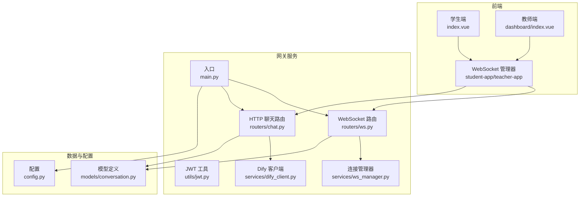
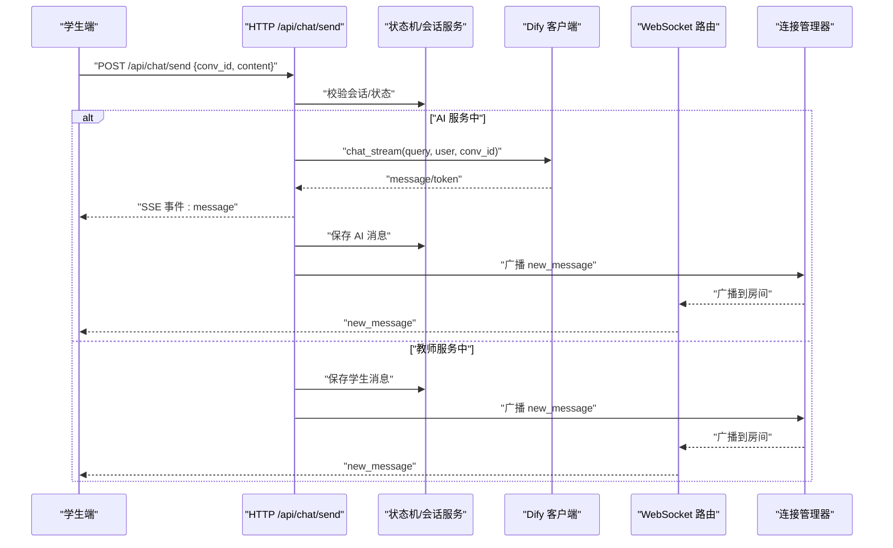
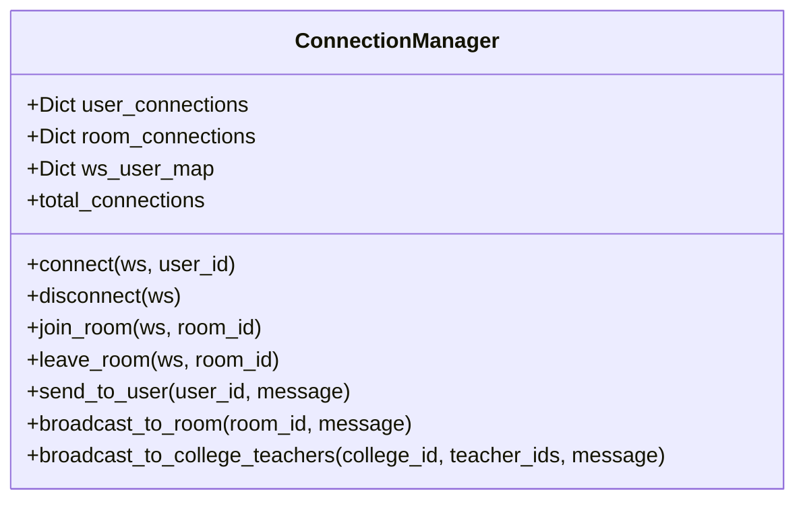
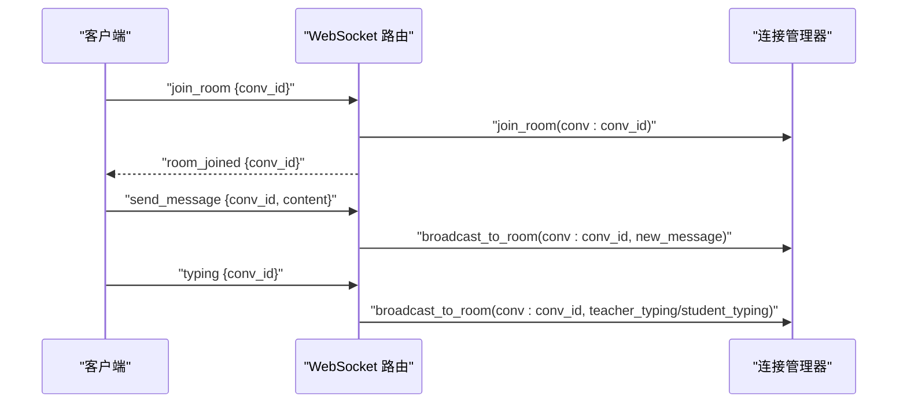
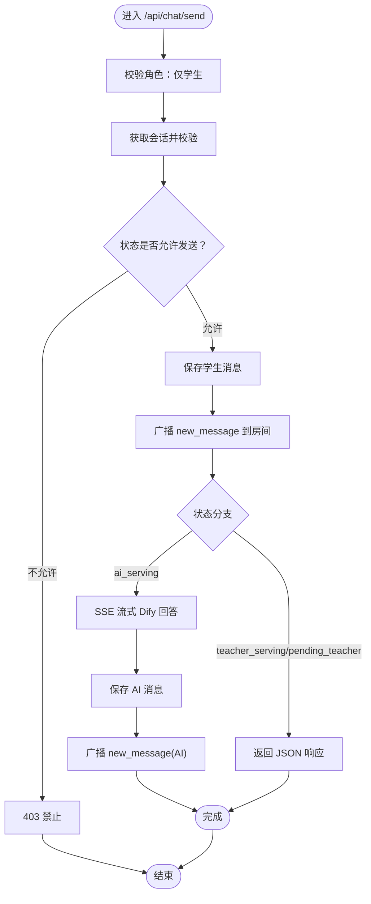
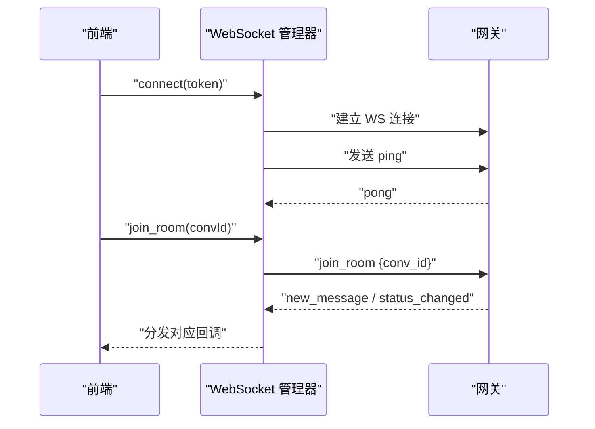
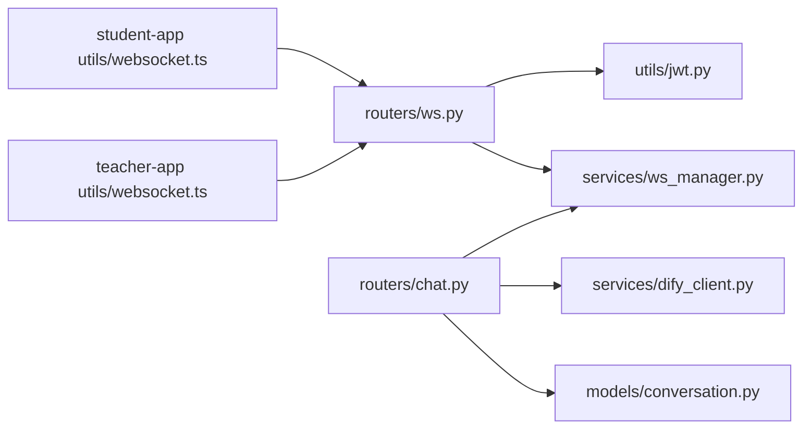
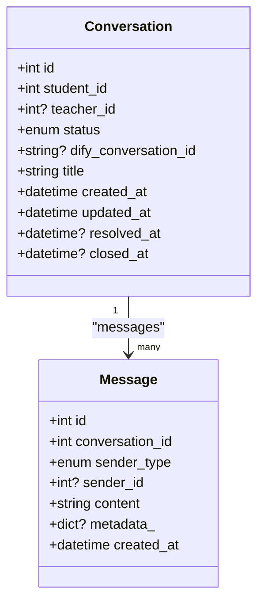

# 消息处理与路由

<cite>
**本文档引用的文件**
- [services/gateway/app/main.py](file://services/gateway/app/main.py)
- [services/gateway/app/routers/ws.py](file://services/gateway/app/routers/ws.py)
- [services/gateway/app/services/ws_manager.py](file://services/gateway/app/services/ws_manager.py)
- [services/gateway/app/routers/chat.py](file://services/gateway/app/routers/chat.py)
- [services/gateway/app/services/dify_client.py](file://services/gateway/app/services/dify_client.py)
- [services/gateway/app/utils/jwt.py](file://services/gateway/app/utils/jwt.py)
- [services/gateway/app/config.py](file://services/gateway/app/config.py)
- [services/gateway/app/models/conversation.py](file://services/gateway/app/models/conversation.py)
- [apps/student-app/src/utils/websocket.ts](file://apps/student-app/src/utils/websocket.ts)
- [apps/teacher-app/src/utils/websocket.ts](file://apps/teacher-app/src/utils/websocket.ts)
- [apps/student-app/src/pages/chat/index.vue](file://apps/student-app/src/pages/chat/index.vue)
- [apps/teacher-app/src/pages/dashboard/index.vue](file://apps/teacher-app/src/pages/dashboard/index.vue)
- [apps/student-app/src/types/chat.ts](file://apps/student-app/src/types/chat.ts)
- [apps/teacher-app/src/types/conversation.ts](file://apps/teacher-app/src/types/conversation.ts)
- [apps/student-app/src/api/chat.ts](file://apps/student-app/src/api/chat.ts)
</cite>

## 目录
1. [简介](#简介)
2. [项目结构](#项目结构)
3. [核心组件](#核心组件)
4. [架构总览](#架构总览)
5. [详细组件分析](#详细组件分析)
6. [依赖分析](#依赖分析)
7. [性能考虑](#性能考虑)
8. [故障排查指南](#故障排查指南)
9. [结论](#结论)
10. [附录](#附录)

## 简介
本文件系统性梳理“消息处理与路由”子系统，覆盖实时消息的接收、解析、路由、转发全流程；解释聊天消息、状态变更通知、系统消息等类型的消息处理逻辑；阐述基于用户身份、会话ID、房间ID的消息分发机制；给出消息序列化与反序列化的实现要点；并提出消息去重、顺序保证、错误恢复等高级特性在当前架构下的实现方案与改进建议。

## 项目结构
该系统由三层组成：
- 网关服务（FastAPI）：负责认证、路由、状态机与Dify集成，提供HTTP接口与WebSocket端点。
- 前端应用（学生端/教师端）：通过WebSocket与网关交互，同时通过HTTP接口拉取历史与状态。
- 数据与状态：PostgreSQL存储会话与消息，Redis用于健康检查与未来扩展（当前未直接用于消息路由）。

图表来源
- [services/gateway/app/main.py:1-78](file://services/gateway/app/main.py#L1-L78)
- [services/gateway/app/routers/ws.py:1-119](file://services/gateway/app/routers/ws.py#L1-L119)
- [services/gateway/app/routers/chat.py:1-191](file://services/gateway/app/routers/chat.py#L1-L191)
- [services/gateway/app/services/ws_manager.py:1-100](file://services/gateway/app/services/ws_manager.py#L1-L100)
- [services/gateway/app/services/dify_client.py:1-105](file://services/gateway/app/services/dify_client.py#L1-L105)
- [services/gateway/app/utils/jwt.py:1-17](file://services/gateway/app/utils/jwt.py#L1-L17)
- [services/gateway/app/config.py:1-31](file://services/gateway/app/config.py#L1-L31)
- [services/gateway/app/models/conversation.py:1-63](file://services/gateway/app/models/conversation.py#L1-L63)
- [apps/student-app/src/pages/chat/index.vue:1-649](file://apps/student-app/src/pages/chat/index.vue#L1-L649)
- [apps/teacher-app/src/pages/dashboard/index.vue:1-669](file://apps/teacher-app/src/pages/dashboard/index.vue#L1-L669)

章节来源
- [services/gateway/app/main.py:1-78](file://services/gateway/app/main.py#L1-L78)

## 核心组件
- WebSocket 管理器：维护用户到连接集合、房间到连接集合的双层映射，支持向用户或房间广播消息。
- WebSocket 路由：鉴权、连接生命周期管理、上行消息解析与分发（加入/离开房间、发送消息、打字通知、心跳）。
- HTTP 聊天路由：学生消息发送、状态流转、SSE流式响应、与Dify集成。
- Dify 客户端：封装Dify流式Chat API，逐token产出事件。
- JWT 工具：签发与解码访问令牌。
- 配置与模型：数据库、Redis、JWT、Dify参数；会话与消息模型。

章节来源
- [services/gateway/app/services/ws_manager.py:1-100](file://services/gateway/app/services/ws_manager.py#L1-L100)
- [services/gateway/app/routers/ws.py:1-119](file://services/gateway/app/routers/ws.py#L1-L119)
- [services/gateway/app/routers/chat.py:1-191](file://services/gateway/app/routers/chat.py#L1-L191)
- [services/gateway/app/services/dify_client.py:1-105](file://services/gateway/app/services/dify_client.py#L1-L105)
- [services/gateway/app/utils/jwt.py:1-17](file://services/gateway/app/utils/jwt.py#L1-L17)
- [services/gateway/app/config.py:1-31](file://services/gateway/app/config.py#L1-L31)
- [services/gateway/app/models/conversation.py:1-63](file://services/gateway/app/models/conversation.py#L1-L63)

## 架构总览
系统采用“HTTP + SSE + WebSocket”的混合模式：
- HTTP：学生发送消息、获取历史、状态变更（如转人工）。
- SSE：AI流式回答，逐token推送至前端。
- WebSocket：实时消息广播、打字指示、房间管理、心跳保活。

图表来源
- [services/gateway/app/routers/chat.py:22-102](file://services/gateway/app/routers/chat.py#L22-L102)
- [services/gateway/app/services/dify_client.py:22-69](file://services/gateway/app/services/dify_client.py#L22-L69)
- [services/gateway/app/services/ws_manager.py:71-81](file://services/gateway/app/services/ws_manager.py#L71-L81)

## 详细组件分析

### WebSocket 连接与房间管理
- 连接注册：建立WebSocket后，按用户ID注册到user_connections，记录反向映射。
- 房间管理：房间ID格式为“conv:{conversation_id}”，支持加入/离开房间。
- 广播策略：向房间内所有连接广播；向用户广播时遍历其所有连接，清理失效连接。
- 心跳与保活：前端定时发送ping，后端返回pong；断线自动清理。

图表来源
- [services/gateway/app/services/ws_manager.py:8-99](file://services/gateway/app/services/ws_manager.py#L8-L99)

章节来源
- [services/gateway/app/services/ws_manager.py:1-100](file://services/gateway/app/services/ws_manager.py#L1-L100)

### WebSocket 路由与消息协议
- 认证：查询参数携带JWT，解码后提取用户ID与角色。
- 上行消息类型：
  - join_room/leave_room：房间加入/离开
  - send_message：向房间广播新消息
  - typing：广播打字状态（区分教师/学生）
  - ping：心跳
- 下行消息类型：
  - new_message：新消息
  - status_changed：会话状态变更
  - teacher_typing/student_typing：对方正在输入
  - pong/error：心跳与错误

图表来源
- [services/gateway/app/routers/ws.py:11-119](file://services/gateway/app/routers/ws.py#L11-L119)
- [services/gateway/app/services/ws_manager.py:48-81](file://services/gateway/app/services/ws_manager.py#L48-L81)

章节来源
- [services/gateway/app/routers/ws.py:1-119](file://services/gateway/app/routers/ws.py#L1-L119)

### HTTP 聊天路由与状态机
- 角色限制：仅学生可调用发送接口。
- 会话校验：获取并校验会话归属与状态。
- 状态分支：
  - ai_serving：保存学生消息 → 调用Dify流式回答 → SSE逐token推送 → 保存AI消息 → 广播新消息。
  - teacher_serving/pending_teacher：保存学生消息 → 广播新消息 → 返回JSON。
- 状态变更：若会话处于resolved，发送消息会触发状态回退并广播状态变更。

图表来源
- [services/gateway/app/routers/chat.py:22-102](file://services/gateway/app/routers/chat.py#L22-L102)
- [services/gateway/app/routers/chat.py:105-191](file://services/gateway/app/routers/chat.py#L105-L191)

章节来源
- [services/gateway/app/routers/chat.py:1-191](file://services/gateway/app/routers/chat.py#L1-L191)

### Dify 客户端与流式事件
- 使用httpx_sse异步连接Dify的chat-messages流式接口。
- 事件类型：
  - message：逐token增量内容
  - message_end：最终元数据（如来源引用）、conversation_id
  - error：错误信息
- 调用方职责：首次事件中若出现新的conversation_id需持久化；逐token转发给SSE；message_end后保存完整AI消息并广播。

章节来源
- [services/gateway/app/services/dify_client.py:1-105](file://services/gateway/app/services/dify_client.py#L1-L105)

### JWT 认证与配置
- JWT签发：设置过期时间，返回签名字符串。
- JWT解码：验证签名与算法，失败抛异常。
- 配置项：数据库URL、Redis URL、JWT密钥与算法、Dify API地址与密钥等。

章节来源
- [services/gateway/app/utils/jwt.py:1-17](file://services/gateway/app/utils/jwt.py#L1-L17)
- [services/gateway/app/config.py:1-31](file://services/gateway/app/config.py#L1-L31)

### 前端 WebSocket 管理器与消息消费
- 单连接模型：每个端只维护一个WebSocket实例，自动重连、心跳、发送队列。
- 房间重连：断线后自动重新加入已加入的房间。
- 消息分发：统一解析JSON后按type分发给监听者，忽略非JSON与pong。

图表来源
- [apps/student-app/src/utils/websocket.ts:1-153](file://apps/student-app/src/utils/websocket.ts#L1-L153)
- [apps/teacher-app/src/utils/websocket.ts:1-169](file://apps/teacher-app/src/utils/websocket.ts#L1-L169)

章节来源
- [apps/student-app/src/utils/websocket.ts:1-153](file://apps/student-app/src/utils/websocket.ts#L1-L153)
- [apps/teacher-app/src/utils/websocket.ts:1-169](file://apps/teacher-app/src/utils/websocket.ts#L1-L169)

### 前端页面与消息渲染
- 学生端页面：监听WebSocket消息，渲染用户消息、AI消息（含流式光标与来源引用）、系统消息；根据会话状态动态提示。
- 教师端页面：工作台展示待处理会话列表，配合状态枚举与标签映射。

章节来源
- [apps/student-app/src/pages/chat/index.vue:1-649](file://apps/student-app/src/pages/chat/index.vue#L1-L649)
- [apps/teacher-app/src/pages/dashboard/index.vue:1-669](file://apps/teacher-app/src/pages/dashboard/index.vue#L1-L669)
- [apps/student-app/src/types/chat.ts:1-45](file://apps/student-app/src/types/chat.ts#L1-L45)
- [apps/teacher-app/src/types/conversation.ts:1-18](file://apps/teacher-app/src/types/conversation.ts#L1-L18)

## 依赖分析
- 组件耦合：
  - WebSocket路由依赖JWT工具与连接管理器。
  - HTTP聊天路由依赖会话服务、状态机、Dify客户端与连接管理器。
  - 前端WebSocket管理器独立于后端业务逻辑，仅依赖后端消息协议。
- 外部依赖：
  - httpx、httpx_sse：SSE与HTTP客户端。
  - SQLAlchemy：ORM模型与索引。
  - Redis：健康检查（当前未用于消息路由）。

图表来源
- [services/gateway/app/routers/ws.py:1-119](file://services/gateway/app/routers/ws.py#L1-L119)
- [services/gateway/app/routers/chat.py:1-191](file://services/gateway/app/routers/chat.py#L1-L191)
- [services/gateway/app/services/ws_manager.py:1-100](file://services/gateway/app/services/ws_manager.py#L1-L100)
- [services/gateway/app/services/dify_client.py:1-105](file://services/gateway/app/services/dify_client.py#L1-L105)
- [services/gateway/app/models/conversation.py:1-63](file://services/gateway/app/models/conversation.py#L1-L63)
- [apps/student-app/src/utils/websocket.ts:1-153](file://apps/student-app/src/utils/websocket.ts#L1-L153)
- [apps/teacher-app/src/utils/websocket.ts:1-169](file://apps/teacher-app/src/utils/websocket.ts#L1-L169)

章节来源
- [services/gateway/app/routers/ws.py:1-119](file://services/gateway/app/routers/ws.py#L1-L119)
- [services/gateway/app/routers/chat.py:1-191](file://services/gateway/app/routers/chat.py#L1-L191)
- [services/gateway/app/services/ws_manager.py:1-100](file://services/gateway/app/services/ws_manager.py#L1-L100)
- [services/gateway/app/services/dify_client.py:1-105](file://services/gateway/app/services/dify_client.py#L1-L105)
- [services/gateway/app/models/conversation.py:1-63](file://services/gateway/app/models/conversation.py#L1-L63)
- [apps/student-app/src/utils/websocket.ts:1-153](file://apps/student-app/src/utils/websocket.ts#L1-L153)
- [apps/teacher-app/src/utils/websocket.ts:1-169](file://apps/teacher-app/src/utils/websocket.ts#L1-L169)

## 性能考虑
- 连接与广播：
  - 广播时遍历房间内连接，复杂度O(N)；建议在高并发下引入Redis Pub/Sub作为广播层，降低Python进程广播开销。
- SSE流式：
  - Dify流式事件逐token推送，前端按事件拼接；注意网络抖动与缓冲区大小。
- 数据库：
  - 消息表与会话表建有索引，建议在高并发写入场景下评估分库分表与批量写入策略。
- 心跳与重连：
  - 前端指数退避重连，避免雪崩；建议后端也增加连接数上限与速率限制。

[本节为通用指导，无需列出章节来源]

## 故障排查指南
- WebSocket连接失败：
  - 检查JWT是否有效、是否过期；确认查询参数token正确传递。
  - 查看后端日志中的认证异常与WebSocketDisconnect。
- 消息未到达：
  - 确认房间加入成功（收到room_joined）；检查房间ID格式“conv:{conv_id}”。
  - 检查连接管理器中是否存在该房间与连接。
- SSE无流式输出：
  - 检查Dify服务可用性与API密钥；关注message_end之前的事件是否正常。
- 前端不显示新消息：
  - 检查WebSocket消息分发逻辑，确认type与data字段正确；排除JSON解析异常。
- 状态变更未生效：
  - 确认HTTP接口返回的状态码与前端状态更新逻辑；检查会话状态枚举一致性。

章节来源
- [services/gateway/app/routers/ws.py:35-42](file://services/gateway/app/routers/ws.py#L35-L42)
- [services/gateway/app/routers/ws.py:114-119](file://services/gateway/app/routers/ws.py#L114-L119)
- [services/gateway/app/routers/chat.py:105-191](file://services/gateway/app/routers/chat.py#L105-L191)
- [apps/student-app/src/utils/websocket.ts:44-51](file://apps/student-app/src/utils/websocket.ts#L44-L51)

## 结论
该系统以“HTTP + SSE + WebSocket”协同的方式实现了完整的消息处理与路由能力：学生端通过HTTP发送消息并接收SSE流式响应，教师端通过WebSocket接收房间广播与状态变更。当前实现简洁可靠，具备良好的扩展性。为进一步提升可靠性与性能，建议引入Redis Pub/Sub优化广播、完善消息去重与顺序保证机制，并在网关侧增加速率限制与熔断策略。

[本节为总结性内容，无需列出章节来源]

## 附录

### 消息类型与字段规范
- 上行消息（客户端 → 服务端）
  - join_room：{ conv_id }
  - leave_room：{ conv_id }
  - send_message：{ conv_id, content }
  - typing：{ conv_id }
  - ping：{}
- 下行消息（服务端 → 客户端）
  - new_message：{ id, conv_id, sender_type, sender_id, content, created_at, metadata? }
  - status_changed：{ conv_id, status, previous_status? }
  - teacher_typing/student_typing：{ conv_id, user_id }
  - pong：{}
  - error：{ message }

章节来源
- [services/gateway/app/routers/ws.py:20-34](file://services/gateway/app/routers/ws.py#L20-L34)

### 数据模型概览

图表来源
- [services/gateway/app/models/conversation.py:26-63](file://services/gateway/app/models/conversation.py#L26-L63)

### 前端类型与API
- 类型定义：Message、ConversationResponse、ConversationStatus等。
- API：创建会话、获取会话、获取消息、转人工等。

章节来源
- [apps/student-app/src/types/chat.ts:1-45](file://apps/student-app/src/types/chat.ts#L1-L45)
- [apps/teacher-app/src/types/conversation.ts:1-18](file://apps/teacher-app/src/types/conversation.ts#L1-L18)
- [apps/student-app/src/api/chat.ts:1-36](file://apps/student-app/src/api/chat.ts#L1-L36)