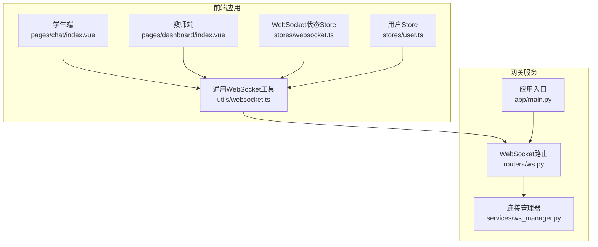
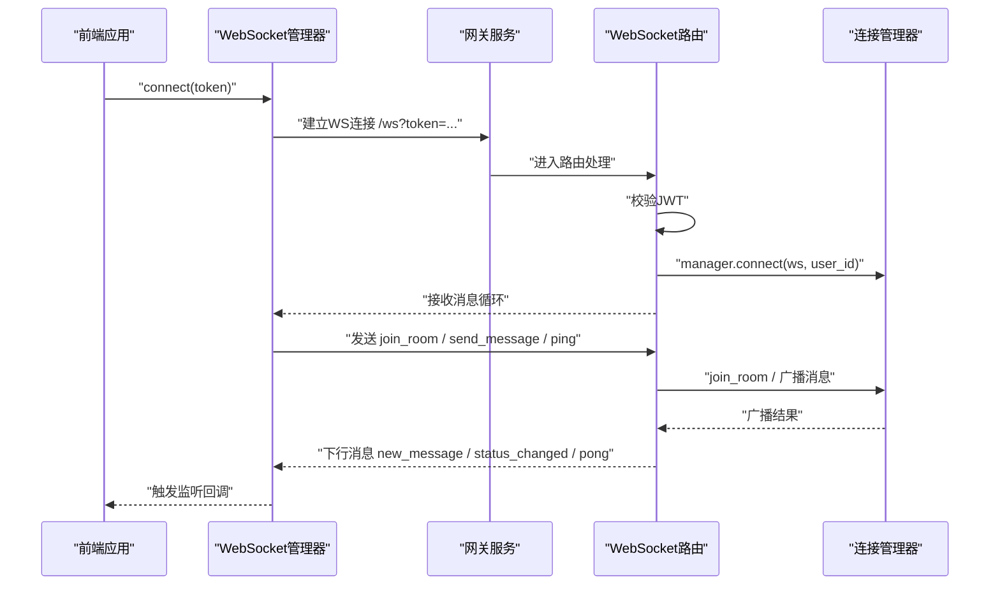
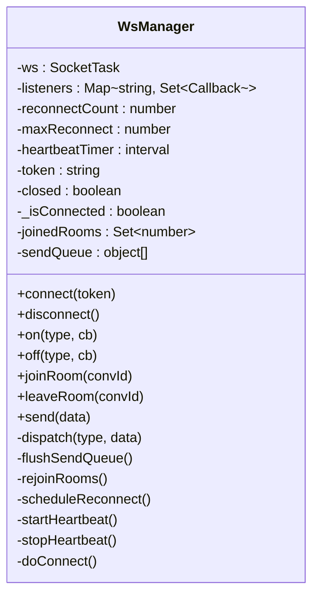
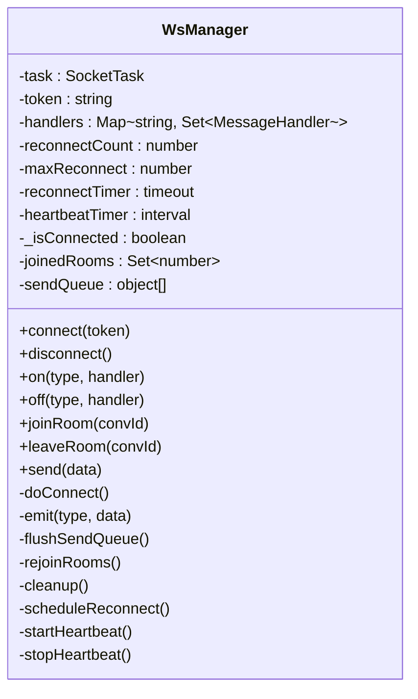
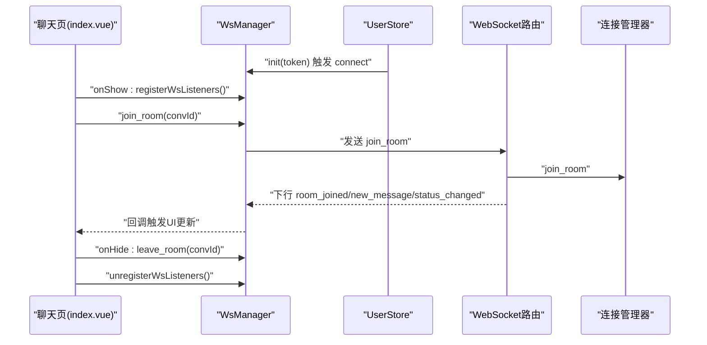
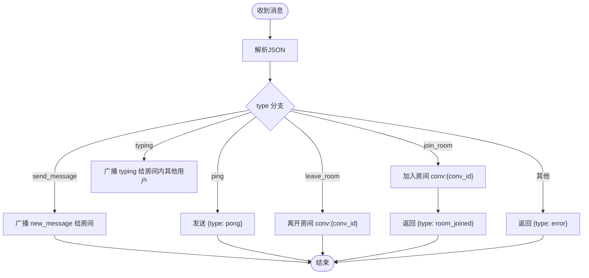
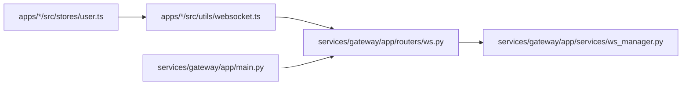

# 连接管理与状态同步

<cite>
**本文引用的文件**
- [apps/student-app/src/utils/websocket.ts](file://apps/student-app/src/utils/websocket.ts)
- [apps/teacher-app/src/utils/websocket.ts](file://apps/teacher-app/src/utils/websocket.ts)
- [apps/teacher-app/src/stores/websocket.ts](file://apps/teacher-app/src/stores/websocket.ts)
- [apps/student-app/src/pages/chat/index.vue](file://apps/student-app/src/pages/chat/index.vue)
- [apps/student-app/src/stores/user.ts](file://apps/student-app/src/stores/user.ts)
- [apps/teacher-app/src/stores/user.ts](file://apps/teacher-app/src/stores/user.ts)
- [services/gateway/app/routers/ws.py](file://services/gateway/app/routers/ws.py)
- [services/gateway/app/services/ws_manager.py](file://services/gateway/app/services/ws_manager.py)
- [services/gateway/app/main.py](file://services/gateway/app/main.py)
- [scripts/s2-ws-test.py](file://scripts/s2-ws-test.py)
</cite>

## 目录
1. [简介](#简介)
2. [项目结构](#项目结构)
3. [核心组件](#核心组件)
4. [架构总览](#架构总览)
5. [详细组件分析](#详细组件分析)
6. [依赖分析](#依赖分析)
7. [性能考虑](#性能考虑)
8. [故障排查指南](#故障排查指南)
9. [结论](#结论)
10. [附录](#附录)

## 简介
本文件围绕“连接管理与状态同步”主题，系统梳理前端 WebSocket 管理器、后端连接管理器以及状态同步机制，重点覆盖以下方面：
- WebSocket 连接生命周期：建立、维护、断开与重连
- 连接状态跟踪与同步：用户在线状态、房间成员状态、会话状态
- 心跳检测与保活：心跳间隔、超时处理、异常恢复
- 连接池与资源优化：发送队列、房间重入、定时器管理
- 异常检测与自动清理：错误捕获、连接清理、健康检查

## 项目结构
该仓库采用多应用与微服务分层组织：
- 前端应用（学生端与教师端）：各自包含 WebSocket 管理器、Pinia Store、页面组件
- 网关服务（FastAPI）：提供 WebSocket 路由、连接管理与业务消息分发
- 测试脚本：用于冒烟测试 WebSocket 行为

图表来源
- [apps/student-app/src/pages/chat/index.vue](file://apps/student-app/src/pages/chat/index.vue)
- [apps/teacher-app/src/stores/websocket.ts](file://apps/teacher-app/src/stores/websocket.ts)
- [apps/student-app/src/stores/user.ts](file://apps/student-app/src/stores/user.ts)
- [apps/teacher-app/src/stores/user.ts](file://apps/teacher-app/src/stores/user.ts)
- [services/gateway/app/main.py](file://services/gateway/app/main.py)
- [services/gateway/app/routers/ws.py](file://services/gateway/app/routers/ws.py)
- [services/gateway/app/services/ws_manager.py](file://services/gateway/app/services/ws_manager.py)

章节来源
- [services/gateway/app/main.py:1-78](file://services/gateway/app/main.py#L1-L78)

## 核心组件
- 前端 WebSocket 管理器（学生端/教师端）：封装连接、消息分发、房间加入/离开、心跳、重连与发送队列
- 后端连接管理器：维护用户连接与房间连接映射，支持广播与清理
- WebSocket 路由：认证、消息类型处理、心跳响应
- 前端状态 Store：订阅连接事件，驱动 UI 状态更新
- 用户 Store：登录初始化与登出清理

章节来源
- [apps/student-app/src/utils/websocket.ts:1-153](file://apps/student-app/src/utils/websocket.ts#L1-L153)
- [apps/teacher-app/src/utils/websocket.ts:1-169](file://apps/teacher-app/src/utils/websocket.ts#L1-L169)
- [services/gateway/app/services/ws_manager.py:1-100](file://services/gateway/app/services/ws_manager.py#L1-L100)
- [services/gateway/app/routers/ws.py:1-119](file://services/gateway/app/routers/ws.py#L1-L119)
- [apps/teacher-app/src/stores/websocket.ts:1-32](file://apps/teacher-app/src/stores/websocket.ts#L1-L32)
- [apps/student-app/src/stores/user.ts:1-56](file://apps/student-app/src/stores/user.ts#L1-L56)
- [apps/teacher-app/src/stores/user.ts:1-63](file://apps/teacher-app/src/stores/user.ts#L1-L63)

## 架构总览
整体交互链路如下：
- 前端通过查询参数携带 JWT Token 连接 /ws
- 后端解码 Token，建立连接并登记用户与房间映射
- 前端发送 join_room、send_message、typing、ping 等消息
- 后端根据消息类型进行房间广播或状态通知
- 前端收到 new_message、status_changed、teacher_typing 等下行消息，更新 UI

图表来源
- [services/gateway/app/routers/ws.py:11-119](file://services/gateway/app/routers/ws.py#L11-L119)
- [services/gateway/app/services/ws_manager.py:20-96](file://services/gateway/app/services/ws_manager.py#L20-L96)
- [apps/student-app/src/utils/websocket.ts:20-64](file://apps/student-app/src/utils/websocket.ts#L20-L64)
- [apps/teacher-app/src/utils/websocket.ts:26-114](file://apps/teacher-app/src/utils/websocket.ts#L26-L114)

## 详细组件分析

### 前端 WebSocket 管理器（学生端）
- 连接建立：构造 wss/ws 地址，使用 uni.connectSocket 建立连接；onOpen 后置状态、启动心跳、刷新发送队列、重入房间、派发连接事件
- 消息分发：解析 JSON，过滤 pong，统一分发到监听者
- 房间管理：记录已加入房间集合，支持 join_room/leave_room，并在重连后自动 re-join
- 发送队列：未连接时将消息入队，连上后逐条出队发送
- 重连策略：指数回退，上限 30 秒，最大次数限制
- 心跳保活：每 30 秒发送 ping，避免被中间代理断开
- 断开与清理：onClose 触发重连调度；disconnect 清理定时器、关闭连接、清空队列与状态

图表来源
- [apps/student-app/src/utils/websocket.ts:3-150](file://apps/student-app/src/utils/websocket.ts#L3-L150)

章节来源
- [apps/student-app/src/utils/websocket.ts:1-153](file://apps/student-app/src/utils/websocket.ts#L1-L153)

### 前端 WebSocket 管理器（教师端）
- 与学生端类似，但增加了 * 通配符消息分发，便于统一处理
- 提供更完善的清理流程：cleanup 中停止心跳、清除重连定时器、关闭连接、清空队列
- 在 onError 回调中输出错误日志，便于调试

图表来源
- [apps/teacher-app/src/utils/websocket.ts:9-166](file://apps/teacher-app/src/utils/websocket.ts#L9-L166)

章节来源
- [apps/teacher-app/src/utils/websocket.ts:1-169](file://apps/teacher-app/src/utils/websocket.ts#L1-L169)

### 前端状态与页面联动（学生端聊天页）
- 生命周期：onShow 时注册 WS 监听、加入房间；onHide 时离开房间并注销监听
- 监听消息：new_message、status_changed 等，更新消息列表与会话状态
- 会话创建与历史加载：首次发送时创建会话并加入房间
- 与用户 Store 协作：登录初始化时自动连接

图表来源
- [apps/student-app/src/pages/chat/index.vue:249-276](file://apps/student-app/src/pages/chat/index.vue#L249-L276)
- [apps/student-app/src/pages/chat/index.vue:319-326](file://apps/student-app/src/pages/chat/index.vue#L319-L326)
- [apps/student-app/src/pages/chat/index.vue:329-339](file://apps/student-app/src/pages/chat/index.vue#L329-L339)
- [apps/student-app/src/stores/user.ts:24-34](file://apps/student-app/src/stores/user.ts#L24-L34)
- [services/gateway/app/routers/ws.py:62-86](file://services/gateway/app/routers/ws.py#L62-L86)
- [services/gateway/app/services/ws_manager.py:48-58](file://services/gateway/app/services/ws_manager.py#L48-L58)

章节来源
- [apps/student-app/src/pages/chat/index.vue:249-276](file://apps/student-app/src/pages/chat/index.vue#L249-L276)
- [apps/student-app/src/pages/chat/index.vue:319-339](file://apps/student-app/src/pages/chat/index.vue#L319-L339)
- [apps/student-app/src/stores/user.ts:24-34](file://apps/student-app/src/stores/user.ts#L24-L34)

### 教师端 WebSocket 状态 Store
- 初始化：接收 token 后连接，监听 * 通配符消息以更新 isConnected
- 销毁：断开连接并重置状态
- 未读数：提供增量与重置接口，便于 UI 展示

章节来源
- [apps/teacher-app/src/stores/websocket.ts:1-32](file://apps/teacher-app/src/stores/websocket.ts#L1-L32)

### 后端连接管理器与路由
- 连接管理器：维护 user_connections 与 room_connections 映射，支持向用户或房间广播，自动清理死连接
- WebSocket 路由：认证 JWT，处理 join_room、leave_room、send_message、typing、ping/pong，未知类型返回 error
- 房间命名规范：conv:{conversation_id}

图表来源
- [services/gateway/app/routers/ws.py:56-112](file://services/gateway/app/routers/ws.py#L56-L112)
- [services/gateway/app/services/ws_manager.py:48-81](file://services/gateway/app/services/ws_manager.py#L48-L81)

章节来源
- [services/gateway/app/routers/ws.py:1-119](file://services/gateway/app/routers/ws.py#L1-L119)
- [services/gateway/app/services/ws_manager.py:1-100](file://services/gateway/app/services/ws_manager.py#L1-L100)

### 心跳保活与异常恢复
- 前端：每 30 秒发送 ping，收到 pong 后维持活跃；onClose 触发指数回退重连
- 后端：收到 ping 返回 pong，确保连接可用性
- 重连上限：最大尝试次数与最大延迟控制资源占用

章节来源
- [apps/student-app/src/utils/websocket.ts:137-142](file://apps/student-app/src/utils/websocket.ts#L137-L142)
- [apps/teacher-app/src/utils/websocket.ts:156-161](file://apps/teacher-app/src/utils/websocket.ts#L156-L161)
- [services/gateway/app/routers/ws.py:59-60](file://services/gateway/app/routers/ws.py#L59-L60)

### 连接池与资源优化
- 发送队列：未连接时缓存消息，连上后顺序发送，避免丢包
- 房间重入：断线重连后自动 re-join，保障会话连续性
- 定时器管理：统一启动/停止心跳与重连定时器，防止内存泄漏
- 连接清理：断开时从用户与房间映射中移除，释放资源

章节来源
- [apps/student-app/src/utils/websocket.ts:112-127](file://apps/student-app/src/utils/websocket.ts#L112-L127)
- [apps/teacher-app/src/utils/websocket.ts:137-146](file://apps/teacher-app/src/utils/websocket.ts#L137-L146)
- [services/gateway/app/services/ws_manager.py:34-46](file://services/gateway/app/services/ws_manager.py#L34-L46)

## 依赖分析
- 前端应用依赖各自的 WebSocket 管理器与 Pinia Store
- WebSocket 管理器依赖 uni.connectSocket API（H5 原生 WebSocket 或小程序适配）
- 网关服务依赖 FastAPI、SQLAlchemy、Redis、Dify 客户端
- WebSocket 路由依赖 JWT 解码与连接管理器

图表来源
- [apps/student-app/src/stores/user.ts:24-34](file://apps/student-app/src/stores/user.ts#L24-L34)
- [apps/teacher-app/src/stores/user.ts:19-28](file://apps/teacher-app/src/stores/user.ts#L19-L28)
- [apps/teacher-app/src/stores/websocket.ts:9-14](file://apps/teacher-app/src/stores/websocket.ts#L9-L14)
- [services/gateway/app/main.py:70-78](file://services/gateway/app/main.py#L70-L78)
- [services/gateway/app/routers/ws.py:1-119](file://services/gateway/app/routers/ws.py#L1-L119)
- [services/gateway/app/services/ws_manager.py:1-100](file://services/gateway/app/services/ws_manager.py#L1-L100)

章节来源
- [services/gateway/app/main.py:1-78](file://services/gateway/app/main.py#L1-L78)

## 性能考虑
- 心跳频率：30 秒一次，平衡保活与带宽
- 重连退避：指数回退上限 30 秒，避免风暴式重连
- 发送队列：批量出队发送，减少频繁 I/O
- 房间广播：按房间集合遍历，注意大规模房间时的广播成本
- 健康检查：后端 /health 接口检查数据库、Redis、外部服务可用性

章节来源
- [apps/student-app/src/utils/websocket.ts:129-135](file://apps/student-app/src/utils/websocket.ts#L129-L135)
- [apps/teacher-app/src/utils/websocket.ts:148-154](file://apps/teacher-app/src/utils/websocket.ts#L148-L154)
- [services/gateway/app/main.py:30-68](file://services/gateway/app/main.py#L30-L68)

## 故障排查指南
- 连接失败：检查 Token 是否有效，路由是否正确返回 4001 关闭码
- 心跳异常：确认前端定时器是否启动，后端是否返回 pong
- 房间消息不同步：确认 join_room 是否成功返回 room_joined，房间名格式是否为 conv:{id}
- 断线重连：观察指数回退是否生效，最大重连次数是否达到
- 冒烟测试：使用脚本验证 ping/pong、join_room、未知类型与无效 Token 的行为

章节来源
- [scripts/s2-ws-test.py:1-51](file://scripts/s2-ws-test.py#L1-L51)
- [services/gateway/app/routers/ws.py:36-42](file://services/gateway/app/routers/ws.py#L36-L42)
- [services/gateway/app/routers/ws.py:59-60](file://services/gateway/app/routers/ws.py#L59-L60)
- [services/gateway/app/routers/ws.py:62-69](file://services/gateway/app/routers/ws.py#L62-L69)

## 结论
本项目通过前后端协同实现了稳健的 WebSocket 连接管理与状态同步：
- 前端提供统一的连接生命周期管理、房间状态与心跳保活
- 后端提供可靠的连接登记、房间广播与异常清理
- 通过 Store 与页面联动，实现会话状态与 UI 的实时同步
- 借助冒烟测试与健康检查，保障系统可用性与稳定性

## 附录
- 常见消息类型
  - 上行：join_room、leave_room、send_message、typing、ping
  - 下行：room_joined、new_message、status_changed、teacher_typing、pong、error
- 房间命名：conv:{conversation_id}