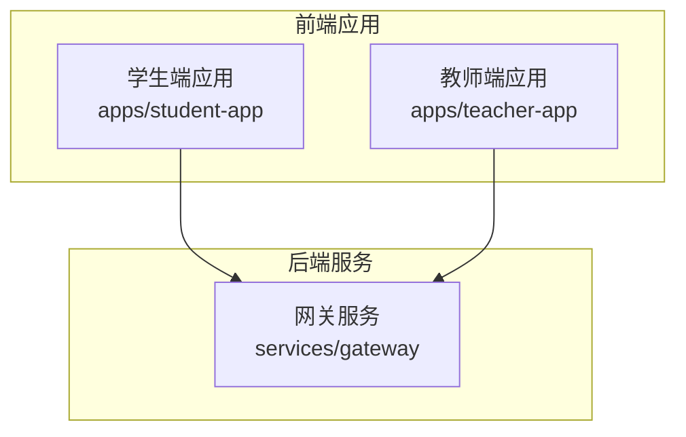
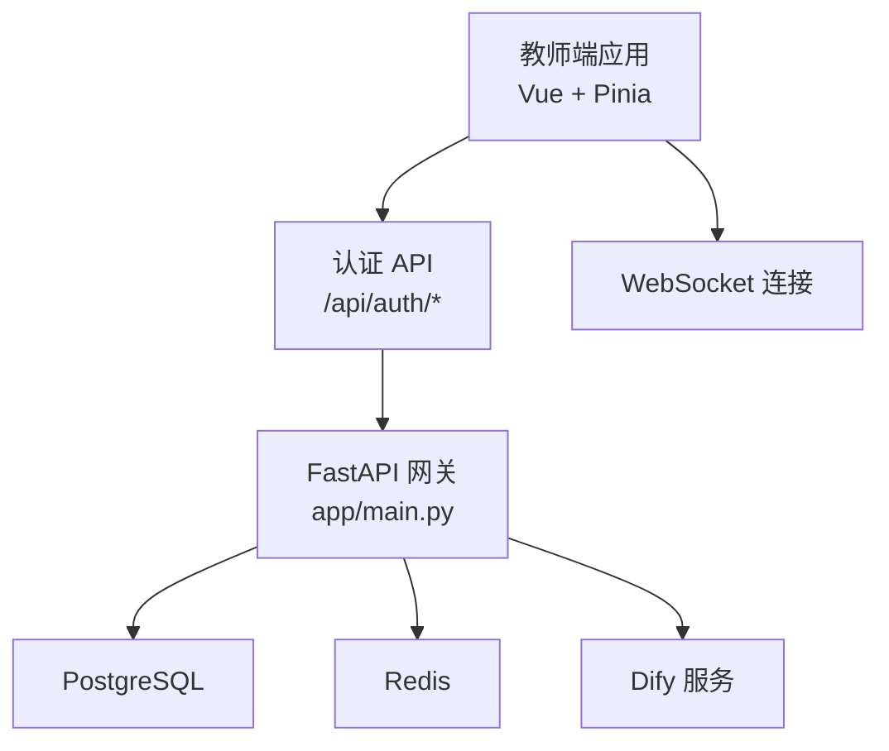
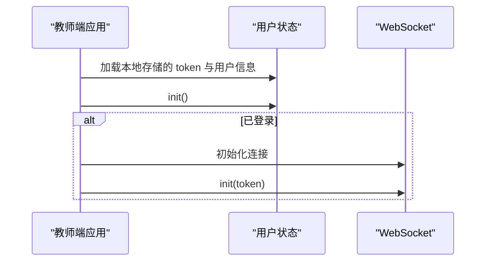
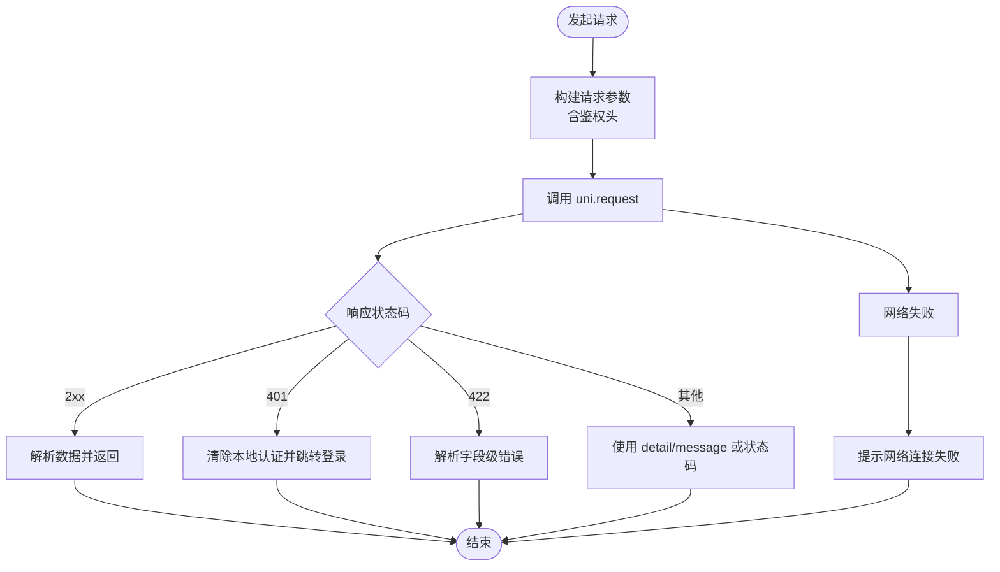
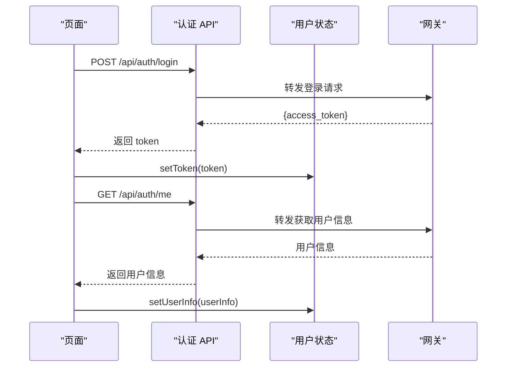
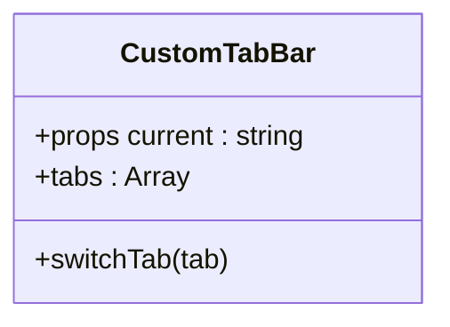
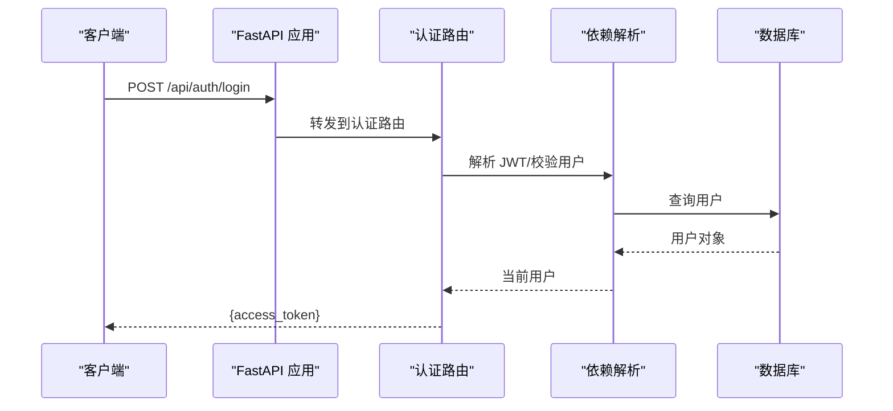
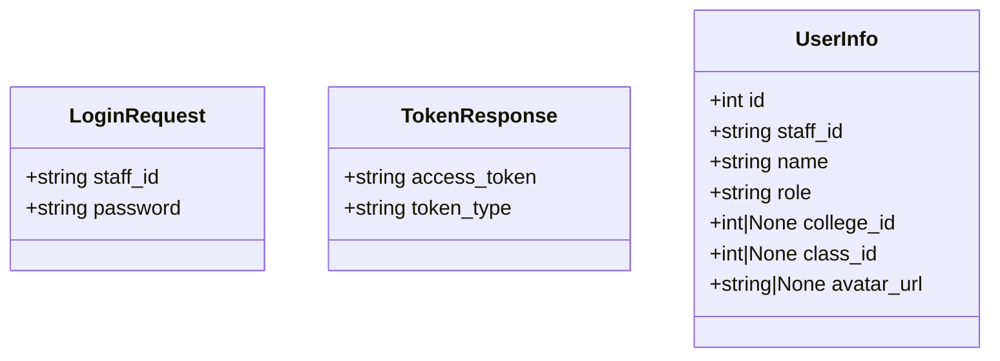
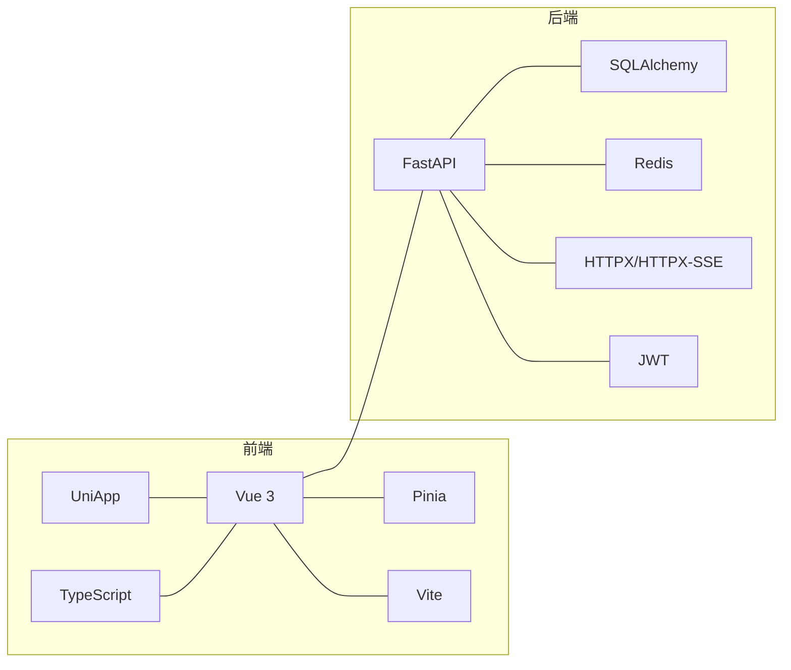

# 代码规范与最佳实践

<cite>
**本文引用的文件**
- [apps/student-app/package.json](file://apps/student-app/package.json)
- [apps/teacher-app/package.json](file://apps/teacher-app/package.json)
- [apps/student-app/tsconfig.json](file://apps/student-app/tsconfig.json)
- [apps/teacher-app/tsconfig.json](file://apps/teacher-app/tsconfig.json)
- [apps/student-app/src/main.ts](file://apps/student-app/src/main.ts)
- [apps/teacher-app/src/main.ts](file://apps/teacher-app/src/main.ts)
- [apps/student-app/src/api/auth.ts](file://apps/student-app/src/api/auth.ts)
- [apps/teacher-app/src/api/auth.ts](file://apps/teacher-app/src/api/auth.ts)
- [apps/student-app/src/utils/request.ts](file://apps/student-app/src/utils/request.ts)
- [apps/teacher-app/src/stores/user.ts](file://apps/teacher-app/src/stores/user.ts)
- [apps/teacher-app/src/types/api.ts](file://apps/teacher-app/src/types/api.ts)
- [apps/student-app/src/types/chat.ts](file://apps/student-app/src/types/chat.ts)
- [apps/student-app/src/components/CustomTabBar.vue](file://apps/student-app/src/components/CustomTabBar.vue)
- [services/gateway/app/main.py](file://services/gateway/app/main.py)
- [services/gateway/requirements.txt](file://services/gateway/requirements.txt)
- [services/gateway/app/routers/auth.py](file://services/gateway/app/routers/auth.py)
- [services/gateway/app/schemas/auth.py](file://services/gateway/app/schemas/auth.py)
- [services/gateway/app/utils/deps.py](file://services/gateway/app/utils/deps.py)
</cite>

## 目录
1. [引言](#引言)
2. [项目结构](#项目结构)
3. [核心组件](#核心组件)
4. [架构总览](#架构总览)
5. [详细组件分析](#详细组件分析)
6. [依赖分析](#依赖分析)
7. [性能考虑](#性能考虑)
8. [故障排查指南](#故障排查指南)
9. [结论](#结论)
10. [附录](#附录)

## 引言
本文件面向“医小管 v2”项目，系统化梳理前后端分离的代码规范与最佳实践，覆盖以下方面：
- TypeScript/Vue.js 前端：命名约定、文件组织、导入导出、类型定义、注释与文档字符串、错误处理模式
- Python FastAPI 后端：类与函数命名、模块组织、异常处理、路由与依赖注入
- 前后端协作：接口命名、鉴权与状态管理、错误码与消息一致性
- 工具链与自动化：TypeScript 类型检查、Vite 构建、Python 依赖与运行环境

## 项目结构
项目采用多应用与多服务的分层组织方式：
- 前端应用
  - 学生端应用：apps/student-app
  - 教师端应用：apps/teacher-app
- 后端服务
  - 网关服务：services/gateway
- 部署与文档
  - 部署脚本与 Nginx 配置：deploy
  - 设计与需求文档：docs

**章节来源**
- [apps/student-app/package.json:1-37](file://apps/student-app/package.json#L1-L37)
- [apps/teacher-app/package.json:1-46](file://apps/teacher-app/package.json#L1-L46)
- [services/gateway/app/main.py:1-78](file://services/gateway/app/main.py#L1-L78)

## 核心组件
- 前端应用入口与状态管理
  - 学生端：应用入口导出 createApp 工厂函数，使用 Pinia 状态管理
  - 教师端：应用入口在初始化时加载用户状态与 WebSocket 连接
- API 层
  - 统一请求封装：基于 uni.request 的 Promise 化封装，内置鉴权头与错误处理
  - 认证 API：登录与获取当前用户信息
- 类型系统
  - 前端类型：用户信息、会话、消息、分页等
  - 后端模型：Pydantic 模型作为请求/响应载体
- 后端服务
  - FastAPI 应用：健康检查、路由挂载、生命周期管理
  - 鉴权依赖：基于 JWT 的用户解析与数据库校验

**章节来源**
- [apps/student-app/src/main.ts:1-11](file://apps/student-app/src/main.ts#L1-L11)
- [apps/teacher-app/src/main.ts:1-25](file://apps/teacher-app/src/main.ts#L1-L25)
- [apps/student-app/src/utils/request.ts:1-44](file://apps/student-app/src/utils/request.ts#L1-L44)
- [apps/teacher-app/src/stores/user.ts:1-63](file://apps/teacher-app/src/stores/user.ts#L1-L63)
- [apps/teacher-app/src/types/api.ts:1-51](file://apps/teacher-app/src/types/api.ts#L1-L51)
- [services/gateway/app/main.py:1-78](file://services/gateway/app/main.py#L1-L78)
- [services/gateway/app/routers/auth.py:1-35](file://services/gateway/app/routers/auth.py#L1-L35)
- [services/gateway/app/schemas/auth.py:1-23](file://services/gateway/app/schemas/auth.py#L1-L23)
- [services/gateway/app/utils/deps.py:1-40](file://services/gateway/app/utils/deps.py#L1-L40)

## 架构总览
前后端通过 REST API 协作，教师端应用在启动时完成用户态初始化与 WebSocket 连接；网关服务提供统一的健康检查与路由聚合。

**图表来源**
- [apps/teacher-app/src/main.ts:9-19](file://apps/teacher-app/src/main.ts#L9-L19)
- [apps/teacher-app/src/api/auth.ts:1-43](file://apps/teacher-app/src/api/auth.ts#L1-L43)
- [services/gateway/app/main.py:16-68](file://services/gateway/app/main.py#L16-L68)

**章节来源**
- [apps/teacher-app/src/main.ts:1-25](file://apps/teacher-app/src/main.ts#L1-L25)
- [services/gateway/app/main.py:1-78](file://services/gateway/app/main.py#L1-L78)

## 详细组件分析

### 前端：应用入口与状态管理
- 学生端应用入口
  - 使用 createApp 工厂函数创建 SSR 应用实例并注册 Pinia
  - 便于测试与服务端渲染场景下的统一创建流程
- 教师端应用入口
  - 在应用创建后异步初始化用户状态与 WebSocket
  - 若存在 token，则自动建立 WebSocket 连接以支持实时通信

**图表来源**
- [apps/teacher-app/src/main.ts:9-19](file://apps/teacher-app/src/main.ts#L9-L19)
- [apps/teacher-app/src/stores/user.ts:19-28](file://apps/teacher-app/src/stores/user.ts#L19-L28)

**章节来源**
- [apps/student-app/src/main.ts:1-11](file://apps/student-app/src/main.ts#L1-L11)
- [apps/teacher-app/src/main.ts:1-25](file://apps/teacher-app/src/main.ts#L1-L25)

### 前端：统一请求与错误处理
- 请求封装
  - 支持 GET/POST/PUT/DELETE 方法
  - 自动附加 Content-Type 与 Authorization 头（若存在 token）
  - 将 uni.request 的回调式 API Promise 化
- 错误处理
  - 401：清除本地认证并跳转至登录页
  - 422：解析字段级错误消息
  - 其他错误：优先使用后端 detail/message，否则回退为 HTTP 状态码
  - 网络失败：统一提示网络连接失败

**图表来源**
- [apps/student-app/src/utils/request.ts:10-43](file://apps/student-app/src/utils/request.ts#L10-L43)

**章节来源**
- [apps/student-app/src/utils/request.ts:1-44](file://apps/student-app/src/utils/request.ts#L1-L44)

### 前端：认证 API 与类型定义
- 认证 API
  - 登录：POST /api/auth/login，返回 access_token
  - 获取当前用户：GET /api/auth/me，返回用户信息
- 类型定义
  - 教师端：UserInfo、LoginResult、PageResult 等
  - 学生端：Message、ConversationResponse、ConversationStatus 等

**图表来源**
- [apps/teacher-app/src/api/auth.ts:27-42](file://apps/teacher-app/src/api/auth.ts#L27-L42)
- [apps/student-app/src/api/auth.ts:9-19](file://apps/student-app/src/api/auth.ts#L9-L19)
- [apps/teacher-app/src/stores/user.ts:30-38](file://apps/teacher-app/src/stores/user.ts#L30-L38)

**章节来源**
- [apps/teacher-app/src/api/auth.ts:1-43](file://apps/teacher-app/src/api/auth.ts#L1-L43)
- [apps/student-app/src/api/auth.ts:1-20](file://apps/student-app/src/api/auth.ts#L1-L20)
- [apps/teacher-app/src/types/api.ts:1-51](file://apps/teacher-app/src/types/api.ts#L1-L51)
- [apps/student-app/src/types/chat.ts:1-45](file://apps/student-app/src/types/chat.ts#L1-L45)

### 前端：组件与样式
- 自定义 TabBar 组件
  - 使用 defineProps 接收当前激活项
  - 内置标签与图标集合，点击切换页面
  - 固定底部栏，适配安全区域

**图表来源**
- [apps/student-app/src/components/CustomTabBar.vue:15-26](file://apps/student-app/src/components/CustomTabBar.vue#L15-L26)

**章节来源**
- [apps/student-app/src/components/CustomTabBar.vue:1-75](file://apps/student-app/src/components/CustomTabBar.vue#L1-L75)

### 后端：FastAPI 网关与认证路由
- 应用生命周期
  - lifespan 中初始化 Redis 客户端，应用退出时关闭连接
  - 提供 /health 健康检查，包含 PostgreSQL、Redis、Dify 服务连通性
- 路由组织
  - 认证路由：/api/auth
  - 会话路由：/api/conversations
  - 动作路由：/api/conversations 下挂载
  - WebSocket 路由：无前缀标签
  - 聊天路由：/api/chat
- 认证依赖
  - 从 Authorization 头解析 JWT，查询用户并校验是否启用
  - 数据库依赖注入与当前用户解析

**图表来源**
- [services/gateway/app/main.py:16-28](file://services/gateway/app/main.py#L16-L28)
- [services/gateway/app/main.py:70-78](file://services/gateway/app/main.py#L70-L78)
- [services/gateway/app/routers/auth.py:12-21](file://services/gateway/app/routers/auth.py#L12-L21)
- [services/gateway/app/utils/deps.py:14-35](file://services/gateway/app/utils/deps.py#L14-L35)

**章节来源**
- [services/gateway/app/main.py:1-78](file://services/gateway/app/main.py#L1-L78)
- [services/gateway/app/routers/auth.py:1-35](file://services/gateway/app/routers/auth.py#L1-L35)
- [services/gateway/app/utils/deps.py:1-40](file://services/gateway/app/utils/deps.py#L1-L40)

### 后端：Pydantic 模型与响应
- 登录请求模型：包含学号/工号与密码
- Token 响应模型：包含 access_token 与默认 token_type
- 用户信息模型：包含基础字段与可空字段

**图表来源**
- [services/gateway/app/schemas/auth.py:4-23](file://services/gateway/app/schemas/auth.py#L4-L23)

**章节来源**
- [services/gateway/app/schemas/auth.py:1-23](file://services/gateway/app/schemas/auth.py#L1-L23)

## 依赖分析
- 前端依赖
  - Vue 3、Pinia、UniApp 生态、TypeScript、Sass、Vite
  - 类型检查通过 vue-tsc 执行
- 后端依赖
  - FastAPI、Uvicorn、SQLAlchemy asyncio、asyncpg、Alembic
  - Redis、HTTPX/HTTPX-SSE、Pydantic Settings、JWT、bcrypt、pytest

**图表来源**
- [apps/student-app/package.json:11-35](file://apps/student-app/package.json#L11-L35)
- [apps/teacher-app/package.json:11-44](file://apps/teacher-app/package.json#L11-L44)
- [services/gateway/requirements.txt:1-29](file://services/gateway/requirements.txt#L1-L29)

**章节来源**
- [apps/student-app/package.json:1-37](file://apps/student-app/package.json#L1-L37)
- [apps/teacher-app/package.json:1-46](file://apps/teacher-app/package.json#L1-L46)
- [services/gateway/requirements.txt:1-29](file://services/gateway/requirements.txt#L1-L29)

## 性能考虑
- 前端
  - 使用 Pinia 管理轻量状态，避免过度拆分 store
  - 组件按需加载与懒加载策略，减少首屏体积
  - 请求缓存与去重（如需要），避免重复触发相同 API
- 后端
  - 异步数据库访问与连接池配置
  - Redis 缓存热点数据，降低数据库压力
  - 限流与熔断策略，保护下游服务（如 Dify）

## 故障排查指南
- 健康检查
  - /health 返回 postgres、redis、dify 三项检查结果，状态为 ok 或 degraded
  - 若某项异常，检查对应服务连通性与密钥配置
- 鉴权问题
  - 401：确认 Authorization 头是否携带 Bearer token
  - 用户不存在或被禁用：确认数据库中用户状态与 JWT payload 的 sub 字段一致
- 前端错误
  - 422 参数错误：根据 detail 中的字段提示修正请求体
  - 网络失败：检查代理配置与跨域设置

**章节来源**
- [services/gateway/app/main.py:30-68](file://services/gateway/app/main.py#L30-L68)
- [services/gateway/app/utils/deps.py:18-35](file://services/gateway/app/utils/deps.py#L18-L35)
- [apps/student-app/src/utils/request.ts:25-40](file://apps/student-app/src/utils/request.ts#L25-L40)

## 结论
本项目在前后端分离架构下，遵循清晰的模块划分与类型约束，结合 FastAPI 的依赖注入与 Vue 的组合式 API，实现了可维护、可扩展的系统。建议持续完善：
- 补充 ESLint/Prettier 与 Black 的配置文件与 CI 流水线
- 规范注释与文档字符串，统一接口命名与错误码
- 增强单元测试与集成测试覆盖率

## 附录

### TypeScript/Vue.js 代码规范要点
- 命名约定
  - 组件：帕斯卡命名（如 CustomTabBar.vue）
  - 函数：驼峰命名（如 login、getUserInfo）
  - 类型接口：帕斯卡命名（如 UserInfo、LoginResult）
  - 常量：全大写下划线（如 TOKEN_KEY）
- 文件组织
  - 页面：pages/xxx/index.vue
  - 组件：components/xxx.vue
  - API：api/xxx.ts
  - 类型：types/xxx.ts
  - 工具：utils/xxx.ts
  - 状态：stores/xxx.ts
- 导入导出
  - 统一使用路径别名 @/*，确保 tsconfig 中 baseUrl 与 paths 正确
  - API 层集中导出函数，避免在页面直接拼接 URL
- 注释与文档字符串
  - API 文件顶部简述接口用途与请求/响应说明
  - 复杂逻辑函数添加 JSDoc 风格注释
- 类型定义最佳实践
  - 明确可空字段（如 number | null）
  - 使用联合类型表达枚举值（如 ConversationStatus）
  - 对外暴露的类型尽量与后端模型保持一致

**章节来源**
- [apps/student-app/tsconfig.json:1-14](file://apps/student-app/tsconfig.json#L1-L14)
- [apps/teacher-app/tsconfig.json:1-14](file://apps/teacher-app/tsconfig.json#L1-L14)
- [apps/teacher-app/src/types/api.ts:1-51](file://apps/teacher-app/src/types/api.ts#L1-L51)
- [apps/student-app/src/types/chat.ts:1-45](file://apps/student-app/src/types/chat.ts#L1-L45)
- [apps/teacher-app/src/api/auth.ts:1-6](file://apps/teacher-app/src/api/auth.ts#L1-L6)

### Python FastAPI 代码规范要点
- 命名约定
  - 路由器：小写下划线（如 auth.py）
  - 服务函数：小写下划线（如 authenticate_user）
  - 模型类：帕斯卡命名（如 LoginRequest）
- 模块组织
  - 路由：routers/
  - 模型：models/
  - 服务：services/
  - 模式：schemas/
  - 工具：utils/
- 异常处理
  - 使用 HTTPException 抛出明确的 4xx/5xx 错误
  - 依赖解析失败时抛出 401 并给出具体原因
- 依赖注入
  - 通过 Depends 获取数据库会话、Redis 实例、当前用户
  - 在 lifespan 中初始化外部资源并在退出时释放

**章节来源**
- [services/gateway/app/routers/auth.py:1-35](file://services/gateway/app/routers/auth.py#L1-L35)
- [services/gateway/app/utils/deps.py:1-40](file://services/gateway/app/utils/deps.py#L1-L40)
- [services/gateway/app/schemas/auth.py:1-23](file://services/gateway/app/schemas/auth.py#L1-L23)

### 前后端协作与接口命名
- 接口命名
  - 认证：/api/auth/login、/api/auth/me
  - 会话：/api/conversations/*
  - 动作：/api/conversations/*（动作类）
  - 聊天：/api/chat/*
- 错误处理模式
  - 前端：401 清理本地状态并跳转登录；422 解析字段级错误；其他回退为 detail/message
  - 后端：统一使用 Pydantic 模型校验输入，HTTPException 抛出语义化错误

**章节来源**
- [apps/teacher-app/src/api/auth.ts:27-42](file://apps/teacher-app/src/api/auth.ts#L27-L42)
- [apps/student-app/src/utils/request.ts:25-40](file://apps/student-app/src/utils/request.ts#L25-L40)
- [services/gateway/app/routers/auth.py:12-34](file://services/gateway/app/routers/auth.py#L12-L34)

### 工具链与自动化检查
- TypeScript 类型检查
  - 使用 vue-tsc 执行类型检查，建议在 CI 中执行
- 构建与运行
  - 前端：Vite 构建，支持 H5 与小程序平台
  - 后端：Uvicorn 运行，依赖 SQLAlchemy 与 Alembic 管理迁移
- 建议补充
  - ESLint + Prettier（前端）
  - Black + isort（Python）
  - 在 CI 中加入 lint 与测试步骤

**章节来源**
- [apps/student-app/package.json:4-9](file://apps/student-app/package.json#L4-L9)
- [apps/teacher-app/package.json:4-9](file://apps/teacher-app/package.json#L4-L9)
- [services/gateway/requirements.txt:1-29](file://services/gateway/requirements.txt#L1-L29)