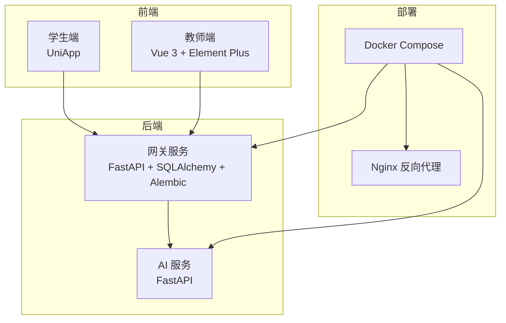
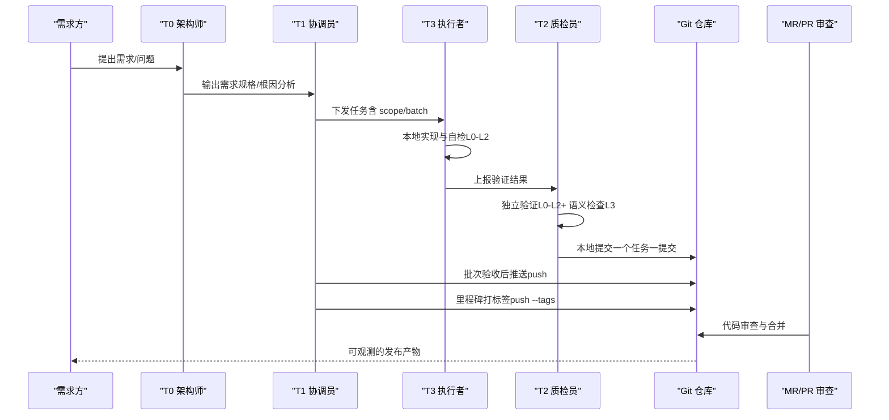
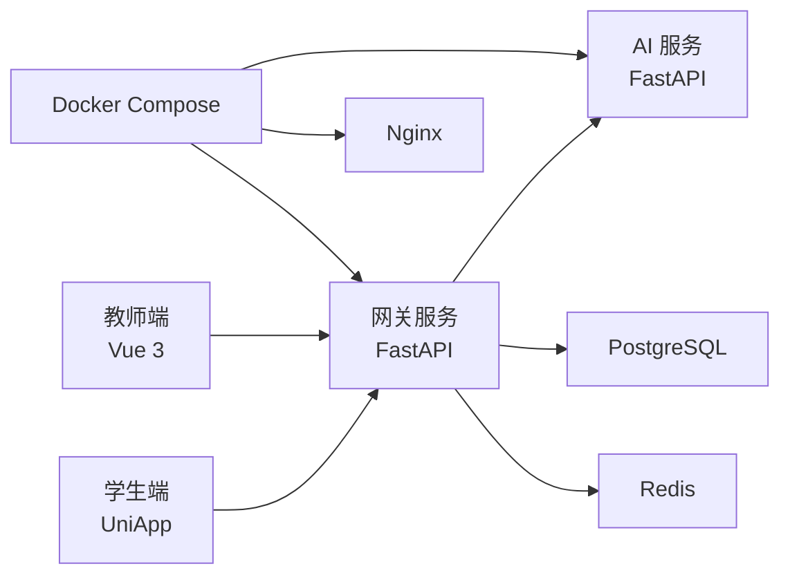

# 分支管理与Git工作流

<cite>
**本文引用的文件**
- [README.md](file://README.md)
- [.gitignore](file://.gitignore)
- [.teb/guides/git-strategy.md](file://.teb/guides/git-strategy.md)
- [.teb/guides/verification-guide.md](file://.teb/guides/verification-guide.md)
- [.teb/boot/t2.md](file://.teb/boot/t2.md)
- [.teb/prompts/t1-coordinator.md](file://.teb/prompts/t1-coordinator.md)
- [.teb/prompts/t3-executor.md](file://.teb/prompts/t3-executor.md)
- [.teb/antipatterns.md](file://.teb/antipatterns.md)
- [docs/design/dev-plan-v2.md](file://docs/design/dev-plan-v2.md)
- [docs/requirements/R03-开发前确认事项.md](file://docs/requirements/R03-开发前确认事项.md)
- [docs/requirements/R05-KB-增强需求.md](file://docs/requirements/R05-KB-增强需求.md)
- [services/gateway/requirements.txt](file://services/gateway/requirements.txt)
- [apps/student-app/package.json](file://apps/student-app/package.json)
- [apps/teacher-app/package.json](file://apps/teacher-app/package.json)
- [docs/design/teb-mutagen-remote-dev.md](file://docs/design/teb-mutagen-remote-dev.md)
</cite>

## 目录
1. [简介](#简介)
2. [项目结构](#项目结构)
3. [核心组件](#核心组件)
4. [架构总览](#架构总览)
5. [详细组件分析](#详细组件分析)
6. [依赖分析](#依赖分析)
7. [性能考虑](#性能考虑)
8. [故障排查指南](#故障排查指南)
9. [结论](#结论)
10. [附录](#附录)

## 简介
本指南面向医小管 v2 项目，提供一套完整的分支管理与 Git 工作流规范，覆盖主分支保护、功能分支命名、发布分支管理、PR/MR 创建与审查、冲突解决策略、版本标签与发布流程、回滚策略、代码审查清单与质量门禁、团队协作与沟通流程。工作流以 TEB 四层协作体系为核心，强调“验证先行、可追溯、可回滚”的工程实践。

## 项目结构
项目采用多模块架构：
- 前端：学生端（UniApp）、教师端（Vue 3 + Element Plus）
- 后端：网关服务（FastAPI + SQLAlchemy + Alembic）、AI 服务（FastAPI）
- 部署：Docker Compose 统一编排
- 文档：需求与设计文档、开发计划、TEB 工作流指南

图表来源
- [apps/student-app/package.json:1-37](file://apps/student-app/package.json#L1-L37)
- [apps/teacher-app/package.json:1-46](file://apps/teacher-app/package.json#L1-L46)
- [services/gateway/requirements.txt:1-29](file://services/gateway/requirements.txt#L1-L29)
- [README.md:1-18](file://README.md#L1-L18)

章节来源
- [README.md:1-18](file://README.md#L1-L18)
- [apps/student-app/package.json:1-37](file://apps/student-app/package.json#L1-L37)
- [apps/teacher-app/package.json:1-46](file://apps/teacher-app/package.json#L1-L46)
- [services/gateway/requirements.txt:1-29](file://services/gateway/requirements.txt#L1-L29)

## 核心组件
- 分支策略与提交规范：基于“一个任务一个提交”，提交信息引用任务 ID，仅在验证通过后合并至主分支。
- 验证层级（L0-L3）：自动化（L0/L1/L2）优先，人工语义验证（L3）兜底。
- 角色与职责：T0（架构澄清）、T1（任务分解与验收）、T2（独立验证与评审）、T3（执行与报告）。
- 标签与里程碑：批次完成打标签、模块集成打标签、里程碑推送标签。
- 回滚机制：基于任务粒度的提交与报告，使用 revert 精准回滚。

章节来源
- [.teb/guides/git-strategy.md:1-63](file://.teb/guides/git-strategy.md#L1-L63)
- [.teb/guides/verification-guide.md:1-181](file://.teb/guides/verification-guide.md#L1-L181)
- [.teb/prompts/t1-coordinator.md:1-110](file://.teb/prompts/t1-coordinator.md#L1-L110)
- [.teb/prompts/t2-reviewer.md:1-21](file://.teb/boot/t2.md#L1-L21)
- [.teb/prompts/t3-executor.md:42-53](file://.teb/prompts/t3-executor.md#L42-L53)

## 架构总览
下图展示从需求到代码合并的完整工作流，涵盖任务分解、执行、验证、审查、合并与发布。

图表来源
- [.teb/prompts/t1-coordinator.md:12-94](file://.teb/prompts/t1-coordinator.md#L12-L94)
- [.teb/guides/verification-guide.md:7-136](file://.teb/guides/verification-guide.md#L7-L136)
- [.teb/guides/git-strategy.md:10-29](file://.teb/guides/git-strategy.md#L10-L29)

章节来源
- [.teb/prompts/t1-coordinator.md:1-110](file://.teb/prompts/t1-coordinator.md#L1-L110)
- [.teb/guides/verification-guide.md:1-181](file://.teb/guides/verification-guide.md#L1-L181)
- [.teb/guides/git-strategy.md:1-63](file://.teb/guides/git-strategy.md#L1-L63)

## 详细组件分析

### 分支策略与命名规范
- 主分支保护：仅合并已验证通过的代码，避免未验证代码进入主分支。
- 功能分支：以 feat/<目标名> 命名，T3 在此分支完成任务，每个任务通过后提交一次。
- 修复分支：以 fix/<bug名> 命名，遵循与功能分支相同的验证与合并流程。
- 发布分支：建议在里程碑前创建 release/<version>，冻结变更，进行回归测试与最终验证。

章节来源
- [.teb/guides/git-strategy.md:51-63](file://.teb/guides/git-strategy.md#L51-L63)

### 提交策略与消息规范
- 原则：一个任务一个提交；只提交验证通过的代码；提交信息引用任务 ID；不提交未验证的代码到主分支。
- 提交时机：T2 验证 L0-L2 全通过后自动本地提交；批次 L3 通过后由 T1 推送；模块集成测试通过后打标签。
- 提交信息格式：<type>(<scope>): <简述> [task:<task-id>]，类型包括 feat/fix/test/refactor/docs。

章节来源
- [.teb/guides/git-strategy.md:3-49](file://.teb/guides/git-strategy.md#L3-L49)

### PR/MR 创建、审查与合并
- 创建：在功能分支完成并通过本地验证后创建 MR/PR，附带任务报告与验证结论。
- 审查：至少一名维护者进行代码审查，关注功能正确性、安全性、可维护性与一致性。
- 合并：满足质量门禁后合并至主分支，保持提交历史整洁（建议 squash 或 rebase 合并）。

章节来源
- [.teb/prompts/t1-coordinator.md:14-22](file://.teb/prompts/t1-coordinator.md#L14-L22)
- [.teb/guides/git-strategy.md:22-29](file://.teb/guides/git-strategy.md#L22-L29)

### 冲突解决策略与最佳实践
- 预防：小步提交、频繁同步、明确 scope；避免跨模块修改。
- 发现：在同步或合并时出现冲突，优先回退到最近稳定提交，重新变基或合并。
- 解决：逐文件解决冲突，保留最小修改面；通过 L2 测试验证修复。
- 记录：在任务报告中记录冲突原因与解决过程，纳入错题本。

章节来源
- [.teb/antipatterns.md:1-25](file://.teb/antipatterns.md#L1-L25)
- [.teb/prompts/t3-executor.md:42-53](file://.teb/prompts/t3-executor.md#L42-L53)

### 版本标签管理与发布流程
- 标签策略：
  - 批次完成：打 <batch-name>-done 标签
  - 模块集成：打 <module>-integrated 标签
  - 里程碑发布：推送标签（git push --tags）
- 发布流程：批次 L3 通过后由 T1 推送；里程碑完成后统一打标签并发布。

章节来源
- [.teb/guides/git-strategy.md:14-29](file://.teb/guides/git-strategy.md#L14-L29)

### 回滚策略
- 基于任务粒度的回滚：每个任务对应一个提交与报告；定位问题任务 ID，使用 git revert 精准回滚。
- 回滚流程：查找提交（git log --grep="task:<task-id>"），执行回滚，重新验证并打标签。

章节来源
- [.teb/guides/git-strategy.md:74-79](file://.teb/guides/git-strategy.md#L74-L79)

### 代码审查清单与质量门禁
- L0：存在性检查（文件/函数/导出是否存在）
- L1：静态检查（类型/语法/格式）
- L2：运行时检查（功能按预期运行）
- L3：语义检查（业务/用户层面是否正确）
- 门禁：所有任务必须具备 L0-L2 的自动化验证证据，L3 为兜底。

章节来源
- [.teb/guides/verification-guide.md:7-136](file://.teb/guides/verification-guide.md#L7-L136)
- [.teb/prompts/t1-coordinator.md:29-36](file://.teb/prompts/t1-coordinator.md#L29-L36)

### 团队协作规范与沟通流程
- 角色职责：
  - T0：澄清需求与边界，输出需求规格或根因分析
  - T1：任务分解、派发、验收与进度跟踪
  - T2：独立验证、Scope 审计、回归检查
  - T3：执行与报告，严格遵守 scope/out_of_scope
- 沟通：任务文件中明确下一步与改进意见；错题本沉淀反模式；远程协作使用 Mutagen 同步。

章节来源
- [.teb/prompts/t1-coordinator.md:1-110](file://.teb/prompts/t1-coordinator.md#L1-L110)
- [.teb/prompts/t2-reviewer.md:1-21](file://.teb/boot/t2.md#L1-L21)
- [.teb/prompts/t3-executor.md:42-53](file://.teb/prompts/t3-executor.md#L42-L53)
- [docs/design/teb-mutagen-remote-dev.md:241-331](file://docs/design/teb-mutagen-remote-dev.md#L241-L331)

## 依赖分析
- 前端依赖：学生端与教师端均基于 UniApp 生态，使用 Vue 3、Pinia、Vite 等工具链。
- 后端依赖：网关服务依赖 FastAPI、SQLAlchemy、Alembic、Redis、HTTPX 等；AI 服务依赖 FastAPI。
- 部署依赖：Docker Compose 统一编排，Nginx 反向代理。

图表来源
- [apps/student-app/package.json:11-35](file://apps/student-app/package.json#L11-L35)
- [apps/teacher-app/package.json:11-44](file://apps/teacher-app/package.json#L11-L44)
- [services/gateway/requirements.txt:1-29](file://services/gateway/requirements.txt#L1-L29)
- [README.md:12-15](file://README.md#L12-L15)

章节来源
- [apps/student-app/package.json:1-37](file://apps/student-app/package.json#L1-L37)
- [apps/teacher-app/package.json:1-46](file://apps/teacher-app/package.json#L1-L46)
- [services/gateway/requirements.txt:1-29](file://services/gateway/requirements.txt#L1-L29)
- [README.md:12-15](file://README.md#L12-L15)

## 性能考虑
- 验证前置：优先在本地完成 L0-L2 自动化验证，减少远端资源占用。
- 小步提交：缩短任务周期，降低合并冲突概率与审查成本。
- 远程同步：使用 Mutagen 进行增量同步，减少网络抖动对开发效率的影响。
- 部署一致性：本地与服务器使用相同 Docker Compose 配置，降低环境差异导致的性能波动。

章节来源
- [.teb/guides/verification-guide.md:104-135](file://.teb/guides/verification-guide.md#L104-L135)
- [docs/design/teb-mutagen-remote-dev.md:303-331](file://docs/design/teb-mutagen-remote-dev.md#L303-L331)

## 故障排查指南
- 提交未通过验证：检查 L0-L2 的自动化命令是否通过；必要时在本地执行相同命令复现。
- 冲突与回滚：使用 git log --grep 定位问题提交，执行 git revert；在任务报告中记录冲突与修复过程。
- 远端同步问题：确认 Mutagen 同步状态；必要时重启同步或回退到稳定提交。
- 依赖与环境：核对 requirements.txt 与 package.json 的版本兼容性；确保 Docker Compose 服务健康。

章节来源
- [.teb/guides/git-strategy.md:74-79](file://.teb/guides/git-strategy.md#L74-L79)
- [.teb/guides/verification-guide.md:33-100](file://.teb/guides/verification-guide.md#L33-L100)
- [services/gateway/requirements.txt:1-29](file://services/gateway/requirements.txt#L1-L29)
- [apps/student-app/package.json:1-37](file://apps/student-app/package.json#L1-L37)
- [apps/teacher-app/package.json:1-46](file://apps/teacher-app/package.json#L1-L46)

## 结论
本指南以 TEB 四层协作体系为基础，结合医小管 v2 的多模块架构，构建了从需求到发布的完整 Git 工作流。通过“验证先行、可追溯、可回滚”的工程实践，确保交付质量与团队协作效率。建议在项目实践中持续优化任务分解、验证脚本与审查清单，逐步形成稳定的发布节奏与回滚预案。

## 附录
- 常用 Git 命令示例（路径引用）
  - 查找任务相关提交：[git log --grep="task:<task-id>":78-79](file://.teb/guides/git-strategy.md#L78-L79)
  - 回滚某个提交：[git revert <commit>:78-79](file://.teb/guides/git-strategy.md#L78-L79)
  - 推送分支：[git push:26-26](file://.teb/guides/git-strategy.md#L26-L26)
  - 推送标签：[git push --tags:27-27](file://.teb/guides/git-strategy.md#L27-L27)
  - 创建功能分支：[git checkout -b feat/<目标名>:56-58](file://.teb/guides/git-strategy.md#L56-L58)
  - 创建修复分支：[git checkout -b fix/<bug名>:60-61](file://.teb/guides/git-strategy.md#L60-L61)
- 相关文档索引
  - 开发计划：[docs/design/dev-plan-v2.md:1-285](file://docs/design/dev-plan-v2.md#L1-L285)
  - 开发前确认事项：[docs/requirements/R03-开发前确认事项.md:1-269](file://docs/requirements/R03-开发前确认事项.md#L1-L269)
  - KB 增强需求：[docs/requirements/R05-KB-增强需求.md:1-202](file://docs/requirements/R05-KB-增强需求.md#L1-L202)
  - TEB 远程开发：[docs/design/teb-mutagen-remote-dev.md:241-331](file://docs/design/teb-mutagen-remote-dev.md#L241-L331)