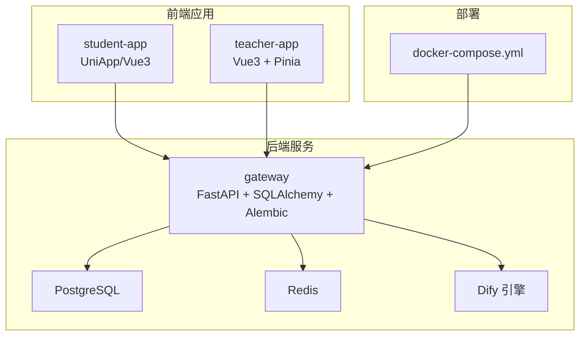
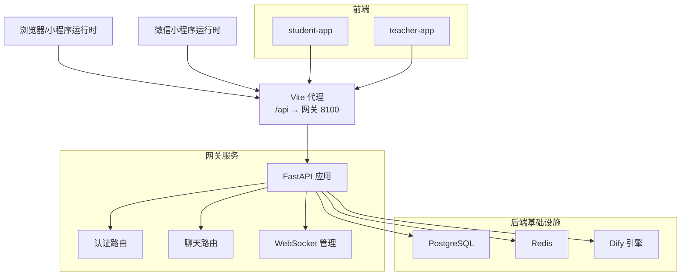
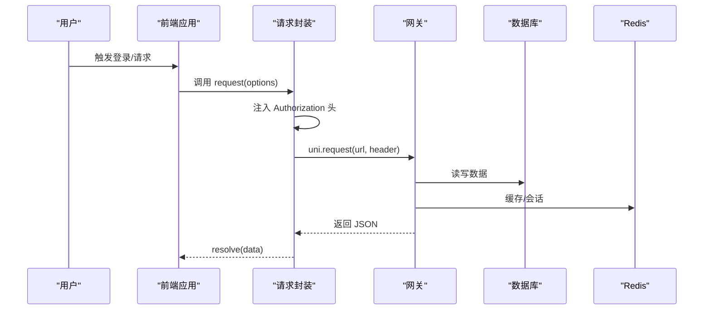
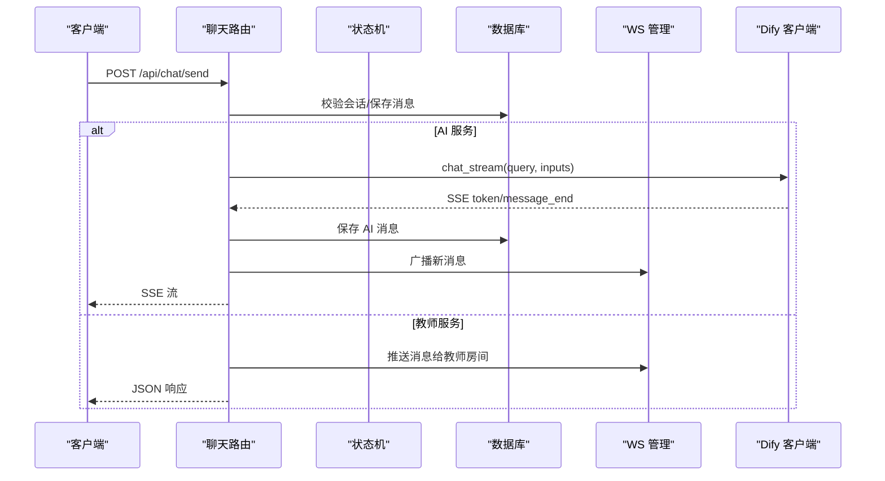
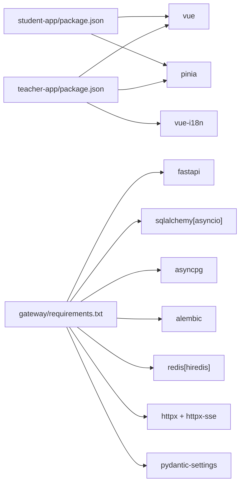

# 开发指南

<cite>
**本文档引用的文件**
- [README.md](file://README.md)
- [apps/student-app/package.json](file://apps/student-app/package.json)
- [apps/teacher-app/package.json](file://apps/teacher-app/package.json)
- [apps/student-app/vite.config.ts](file://apps/student-app/vite.config.ts)
- [apps/teacher-app/vite.config.ts](file://apps/teacher-app/vite.config.ts)
- [apps/student-app/src/main.ts](file://apps/student-app/src/main.ts)
- [apps/teacher-app/src/main.ts](file://apps/teacher-app/src/main.ts)
- [apps/student-app/src/stores/user.ts](file://apps/student-app/src/stores/user.ts)
- [apps/teacher-app/src/stores/user.ts](file://apps/teacher-app/src/stores/user.ts)
- [apps/student-app/src/utils/request.ts](file://apps/student-app/src/utils/request.ts)
- [apps/teacher-app/src/utils/request.ts](file://apps/teacher-app/src/utils/request.ts)
- [services/gateway/app/main.py](file://services/gateway/app/main.py)
- [services/gateway/app/config.py](file://services/gateway/app/config.py)
- [services/gateway/app/routers/auth.py](file://services/gateway/app/routers/auth.py)
- [services/gateway/app/routers/chat.py](file://services/gateway/app/routers/chat.py)
- [services/gateway/app/utils/deps.py](file://services/gateway/app/utils/deps.py)
- [services/gateway/requirements.txt](file://services/gateway/requirements.txt)
- [deploy/docker-compose.yml](file://deploy/docker-compose.yml)
</cite>

## 目录
1. [简介](#简介)
2. [项目结构](#项目结构)
3. [核心组件](#核心组件)
4. [架构总览](#架构总览)
5. [详细组件分析](#详细组件分析)
6. [依赖关系分析](#依赖关系分析)
7. [性能考虑](#性能考虑)
8. [故障排查指南](#故障排查指南)
9. [结论](#结论)
10. [附录](#附录)

## 简介
本指南面向“医小管 v2”项目的开发者，提供从代码规范、分支与工作流、本地调试、项目结构与模块划分、贡献与评审、工具配置到重构与遗留代码处理的全流程开发指导。项目采用多应用架构：前端包含学生端与教师端（均为 UniApp/Vue 3），后端为基于 FastAPI 的网关服务，集成 Dify 自托管 AI 引擎，数据库与缓存通过 Docker Compose 编排。

## 项目结构
项目采用按功能域分层的多包结构：
- apps：前端应用目录，包含 student-app（UniApp）与 teacher-app（Vue 3）
- services/gateway：后端网关服务，FastAPI + SQLAlchemy + Alembic
- deploy：部署编排，Docker Compose
- docs：设计与需求文档
- scripts：迁移与测试脚本

图表来源
- [deploy/docker-compose.yml:1-22](file://deploy/docker-compose.yml#L1-L22)
- [services/gateway/app/main.py:1-78](file://services/gateway/app/main.py#L1-L78)

章节来源
- [README.md:1-18](file://README.md#L1-L18)
- [apps/student-app/package.json:1-37](file://apps/student-app/package.json#L1-L37)
- [apps/teacher-app/package.json:1-46](file://apps/teacher-app/package.json#L1-L46)
- [services/gateway/requirements.txt:1-29](file://services/gateway/requirements.txt#L1-L29)

## 核心组件
- 前端应用
  - student-app：基于 Pinia 状态管理，统一请求封装与 WebSocket 管理，页面路由与主题样式分离。
  - teacher-app：同构初始化逻辑，登录态与 WebSocket 自动建立，类型与图标组件化。
- 后端网关
  - FastAPI 应用：健康检查、路由挂载、生命周期注入 Redis；认证、聊天、会话、动作、WebSocket 路由。
  - 配置中心：Pydantic Settings 加载 .env 环境变量，集中管理数据库、Redis、JWT、Dify 等参数。
  - 认证与鉴权：JWT 解析、用户校验、依赖注入。
  - 聊天与状态机：根据会话状态分流至 AI 或教师路径，支持 SSE 流式输出与 WebSocket 广播。

章节来源
- [apps/student-app/src/main.ts:1-11](file://apps/student-app/src/main.ts#L1-L11)
- [apps/teacher-app/src/main.ts:1-25](file://apps/teacher-app/src/main.ts#L1-L25)
- [apps/student-app/src/stores/user.ts:1-56](file://apps/student-app/src/stores/user.ts#L1-L56)
- [apps/teacher-app/src/stores/user.ts:1-63](file://apps/teacher-app/src/stores/user.ts#L1-L63)
- [services/gateway/app/main.py:1-78](file://services/gateway/app/main.py#L1-L78)
- [services/gateway/app/config.py:1-31](file://services/gateway/app/config.py#L1-L31)
- [services/gateway/app/routers/auth.py:1-35](file://services/gateway/app/routers/auth.py#L1-L35)
- [services/gateway/app/routers/chat.py:1-191](file://services/gateway/app/routers/chat.py#L1-L191)
- [services/gateway/app/utils/deps.py:1-40](file://services/gateway/app/utils/deps.py#L1-L40)

## 架构总览
下图展示前后端交互与外部依赖的整体架构：

图表来源
- [apps/student-app/vite.config.ts:1-22](file://apps/student-app/vite.config.ts#L1-L22)
- [apps/teacher-app/vite.config.ts:1-22](file://apps/teacher-app/vite.config.ts#L1-L22)
- [services/gateway/app/main.py:1-78](file://services/gateway/app/main.py#L1-L78)

## 详细组件分析

### 前端应用（学生端与教师端）
- 应用入口与状态
  - student-app：创建 SSR 应用与 Pinia 实例，导出工厂函数供构建工具使用。
  - teacher-app：在入口中异步初始化用户状态与 WebSocket，若存在 token 则自动建立连接。
- 用户状态管理
  - 统一使用 Pinia Store，持久化存储 token 与用户信息，提供登录、登出、初始化等动作。
  - 存储键名区分不同应用，避免冲突。
- 请求封装
  - 统一封装 uni.request，自动注入 Authorization 头，处理 401、422、网络错误等场景。
  - 支持 GET/POST/PUT/DELETE 方法别名，支持查询参数拼接。
- Vite 代理
  - /api 与 /ws 代理到网关地址，便于本地联调。

图表来源
- [apps/student-app/src/utils/request.ts:1-44](file://apps/student-app/src/utils/request.ts#L1-L44)
- [apps/teacher-app/src/utils/request.ts:1-108](file://apps/teacher-app/src/utils/request.ts#L1-L108)
- [services/gateway/app/main.py:30-68](file://services/gateway/app/main.py#L30-L68)

章节来源
- [apps/student-app/src/main.ts:1-11](file://apps/student-app/src/main.ts#L1-L11)
- [apps/teacher-app/src/main.ts:1-25](file://apps/teacher-app/src/main.ts#L1-L25)
- [apps/student-app/src/stores/user.ts:1-56](file://apps/student-app/src/stores/user.ts#L1-L56)
- [apps/teacher-app/src/stores/user.ts:1-63](file://apps/teacher-app/src/stores/user.ts#L1-L63)
- [apps/student-app/src/utils/request.ts:1-44](file://apps/student-app/src/utils/request.ts#L1-L44)
- [apps/teacher-app/src/utils/request.ts:1-108](file://apps/teacher-app/src/utils/request.ts#L1-L108)
- [apps/student-app/vite.config.ts:1-22](file://apps/student-app/vite.config.ts#L1-L22)
- [apps/teacher-app/vite.config.ts:1-22](file://apps/teacher-app/vite.config.ts#L1-L22)

### 后端网关（FastAPI）
- 应用生命周期
  - 在 lifespan 中创建 Redis 连接，应用退出时关闭连接。
  - 提供 /health 健康检查，检测 Postgres、Redis、Dify 服务可用性。
- 路由组织
  - 认证：登录、获取当前用户信息。
  - 聊天：消息发送、SSE 流式响应、状态机流转。
  - 会话与动作：会话管理与状态转换。
  - WebSocket：房间广播、实时消息推送。
- 配置加载
  - 使用 Pydantic Settings 从 .env 文件加载配置，支持数据库、Redis、JWT、Dify 等参数。
- 依赖注入
  - JWT 校验与当前用户解析，数据库会话注入，Redis 实例注入。

图表来源
- [services/gateway/app/routers/chat.py:22-191](file://services/gateway/app/routers/chat.py#L22-L191)
- [services/gateway/app/services/state_machine.py](file://services/gateway/app/services/state_machine.py)
- [services/gateway/app/services/ws_manager.py](file://services/gateway/app/services/ws_manager.py)
- [services/gateway/app/services/dify_client.py](file://services/gateway/app/services/dify_client.py)

章节来源
- [services/gateway/app/main.py:16-78](file://services/gateway/app/main.py#L16-L78)
- [services/gateway/app/config.py:1-31](file://services/gateway/app/config.py#L1-L31)
- [services/gateway/app/routers/auth.py:1-35](file://services/gateway/app/routers/auth.py#L1-L35)
- [services/gateway/app/routers/chat.py:1-191](file://services/gateway/app/routers/chat.py#L1-L191)
- [services/gateway/app/utils/deps.py:1-40](file://services/gateway/app/utils/deps.py#L1-L40)

### 配置与部署
- 环境变量
  - 数据库、Redis、Dify、JWT 等参数通过 .env 注入，生产环境需替换默认值。
- Docker Compose
  - 网关容器映射 8100:8000，使用 host.docker.internal 访问宿主机服务。
  - 复用现有 PostgreSQL 与 Redis 容器（v1 环境）。

章节来源
- [services/gateway/app/config.py:1-31](file://services/gateway/app/config.py#L1-L31)
- [deploy/docker-compose.yml:1-22](file://deploy/docker-compose.yml#L1-L22)

## 依赖关系分析
- 前端依赖
  - student-app/teacher-app 均依赖 @dcloudio/uni-app、vue、pinia、typescript、sass、vite 等。
  - teacher-app 额外包含 vue-i18n。
- 后端依赖
  - FastAPI、SQLAlchemy asyncio、asyncpg、Alembic、Redis、httpx/httpx-sse、Pydantic Settings、pytest 等。
- 代理与运行
  - 前端通过 Vite 代理访问网关；网关通过 Alembic 进行数据库迁移；Docker Compose 统一编排。

图表来源
- [apps/student-app/package.json:1-37](file://apps/student-app/package.json#L1-L37)
- [apps/teacher-app/package.json:1-46](file://apps/teacher-app/package.json#L1-L46)
- [services/gateway/requirements.txt:1-29](file://services/gateway/requirements.txt#L1-L29)

章节来源
- [apps/student-app/package.json:1-37](file://apps/student-app/package.json#L1-L37)
- [apps/teacher-app/package.json:1-46](file://apps/teacher-app/package.json#L1-L46)
- [services/gateway/requirements.txt:1-29](file://services/gateway/requirements.txt#L1-L29)

## 性能考虑
- 前端
  - 使用 Pinia 管理轻量状态，避免过度嵌套；对持久化存储进行异常兜底，防止序列化失败影响应用。
  - 请求封装统一处理 401/422，减少重复判断。
- 后端
  - 使用异步 SQLAlchemy 与 Redis，降低阻塞；SSE 流式返回减少一次性大响应开销。
  - 状态机与 WS 广播确保消息实时性与一致性。
- 部署
  - Docker Compose 映射端口避免冲突；使用 host.docker.internal 保证容器内可达宿主机服务。

章节来源
- [apps/student-app/src/stores/user.ts:1-56](file://apps/student-app/src/stores/user.ts#L1-L56)
- [apps/teacher-app/src/stores/user.ts:1-63](file://apps/teacher-app/src/stores/user.ts#L1-L63)
- [apps/student-app/src/utils/request.ts:1-44](file://apps/student-app/src/utils/request.ts#L1-L44)
- [apps/teacher-app/src/utils/request.ts:1-108](file://apps/teacher-app/src/utils/request.ts#L1-L108)
- [services/gateway/app/main.py:30-68](file://services/gateway/app/main.py#L30-L68)
- [services/gateway/app/routers/chat.py:84-102](file://services/gateway/app/routers/chat.py#L84-L102)
- [deploy/docker-compose.yml:1-22](file://deploy/docker-compose.yml#L1-L22)

## 故障排查指南
- 健康检查
  - 访问 /health，查看 postgres、redis、dify 三项检查结果；任一异常将返回 degraded。
- 认证问题
  - 401 未授权：前端会清理本地 token 并跳转登录页；后端依赖 JWT 解析失败会抛出 401。
- 请求错误
  - 422 参数错误：前端解析 detail 并提示第一条错误信息；网络失败统一提示“网络连接失败”。
- Dify 流式响应
  - message/token/message_end/error 事件按序到达；异常时返回 error 事件并终止。
- WebSocket
  - 教师端登录后自动初始化 WS；房间广播用于实时消息推送。

章节来源
- [services/gateway/app/main.py:30-68](file://services/gateway/app/main.py#L30-L68)
- [services/gateway/app/utils/deps.py:14-35](file://services/gateway/app/utils/deps.py#L14-L35)
- [apps/student-app/src/utils/request.ts:25-36](file://apps/student-app/src/utils/request.ts#L25-L36)
- [apps/teacher-app/src/utils/request.ts:42-56](file://apps/teacher-app/src/utils/request.ts#L42-L56)
- [services/gateway/app/routers/chat.py:105-153](file://services/gateway/app/routers/chat.py#L105-L153)

## 结论
本指南提供了从项目结构、核心组件、架构交互到调试与部署的系统性开发指引。建议在开发中遵循统一的命名与模块划分、严格的依赖注入与错误处理、以及清晰的路由与状态机设计，以保障系统的可维护性与扩展性。

## 附录

### 代码规范与最佳实践
- 命名约定
  - 变量与函数：使用语义化英文，避免缩写；store 动作使用 setXxx/clearXxx/logout 等动词形式。
  - 文件与目录：按功能域划分（api、components、pages、stores、utils、types），保持扁平清晰。
- 代码组织
  - 前端：页面组件与通用组件分离，状态集中于 Pinia；请求封装统一出口。
  - 后端：路由按领域拆分，服务层负责业务逻辑，依赖注入贯穿始终。
- 注释标准
  - 关键函数与复杂逻辑添加简要注释；对外接口与状态机行为明确注释。
- 类型与接口
  - 前端使用 TypeScript，接口定义集中在 types 目录；后端使用 Pydantic 模型与类型注解。

### 分支管理策略与 Git 工作流
- 分支模型
  - develop：主开发分支，合并功能特性与修复。
  - feature/*：功能开发分支，完成后合并至 develop。
  - release/*：发布准备分支，进行最终测试与版本号更新。
  - hotfix/*：紧急修复分支，直接从对应 tag 切出并回并至 develop 与 main。
- 合并策略
  - 使用 squash merge 保持提交历史整洁；合并前要求通过 CI 与代码审查。
- 提交信息
  - 格式：type(scope): subject；示例：feat(gateway): 添加健康检查接口。

### 本地开发环境与调试
- 启动顺序
  - 启动数据库与 Redis（复用 v1 环境）；启动 Dify；启动网关；启动前端应用。
- 端口与代理
  - 网关：8100:8000；前端：student-app 5174、teacher-app 5175；Vite 代理 /api 与 /ws。
- 调试技巧
  - 前端：利用 uni.request 的统一拦截与 toast 提示定位问题；在 store 中断点观察状态变化。
  - 后端：开启 uvicorn 日志，结合 /health 与 SSE/WS 事件验证链路。

章节来源
- [apps/student-app/vite.config.ts:6-20](file://apps/student-app/vite.config.ts#L6-L20)
- [apps/teacher-app/vite.config.ts:6-20](file://apps/teacher-app/vite.config.ts#L6-L20)
- [deploy/docker-compose.yml:9-17](file://deploy/docker-compose.yml#L9-L17)

### 贡献指南与代码审查流程
- 提交前检查
  - 通过类型检查与单元测试；确保日志与错误处理完善。
- 代码审查
  - 至少一名 reviewer 通过；关注安全性（JWT、输入校验）、可维护性（依赖注入、模块拆分）。
- 版本与发布
  - 通过 release/* 分支进行版本打包与变更记录；hotfix/* 应快速回归并同步至主干。

### 开发工具配置与效率提升
- 前端
  - VS Code 插件：Vue Language Features、TypeScript Importer、ESLint、Prettier。
  - 命令：type-check、dev:h5、build:h5；微信小程序平台使用 dev:mp-weixin/build:mp-weixin。
- 后端
  - Python 环境：使用 requirements.txt 安装依赖；pytest 运行测试；Alembic 执行迁移。
- Docker
  - 使用 docker-compose 一键启动网关与外部依赖；注意 host.docker.internal 的网络映射。

章节来源
- [apps/student-app/package.json:4-9](file://apps/student-app/package.json#L4-L9)
- [apps/teacher-app/package.json:4-9](file://apps/teacher-app/package.json#L4-L9)
- [services/gateway/requirements.txt:1-29](file://services/gateway/requirements.txt#L1-L29)

### 重构策略与遗留代码处理
- 渐进式重构
  - 将复杂函数拆分为小函数，明确职责；引入中间状态与错误边界，逐步替换遗留逻辑。
- 遗留接口迁移
  - 保留旧接口一段时间并打桩，逐步引导前端切换至新接口；同时完善类型与注释。
- 状态与存储
  - 对持久化键名进行统一管理，避免跨应用冲突；对异常情况增加 try/catch 保护。
- 依赖与配置
  - 将硬编码参数移至配置中心；对第三方 SDK（如 Dify）增加超时与重试策略。