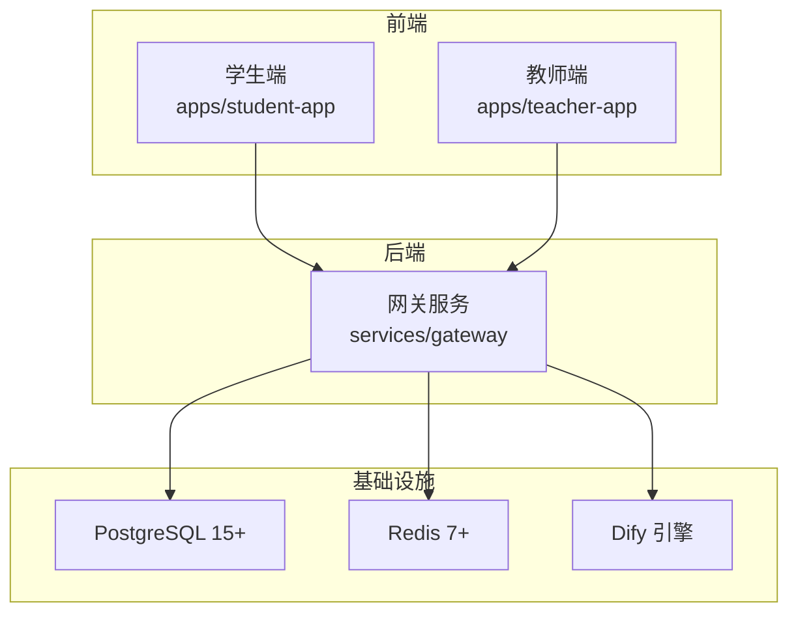
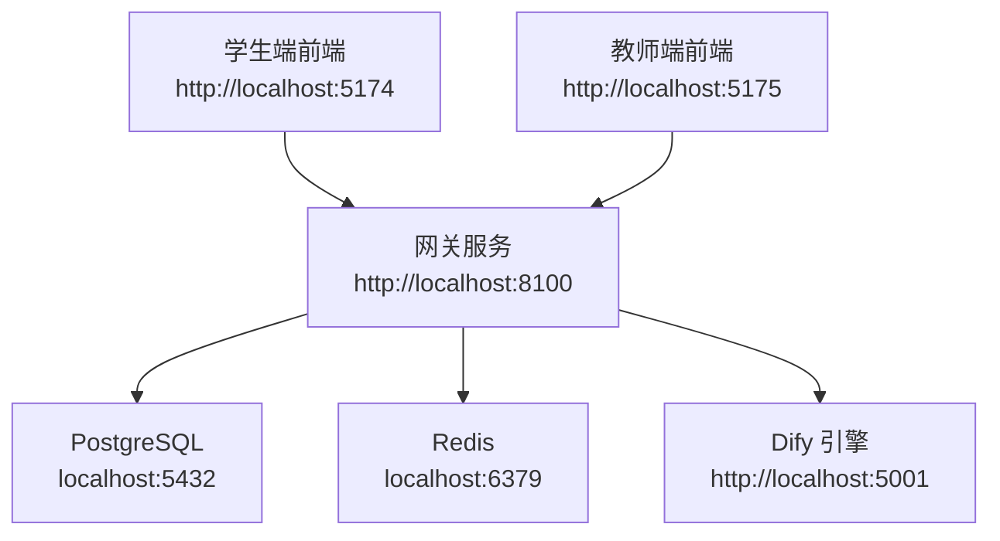
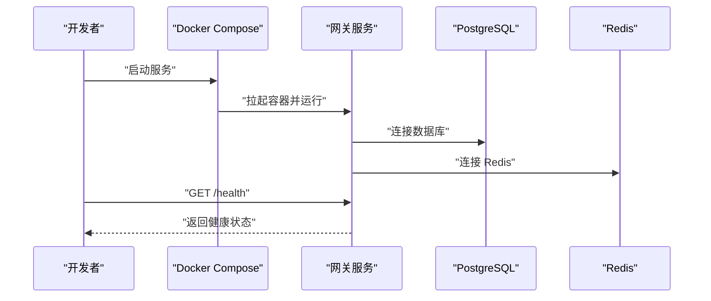
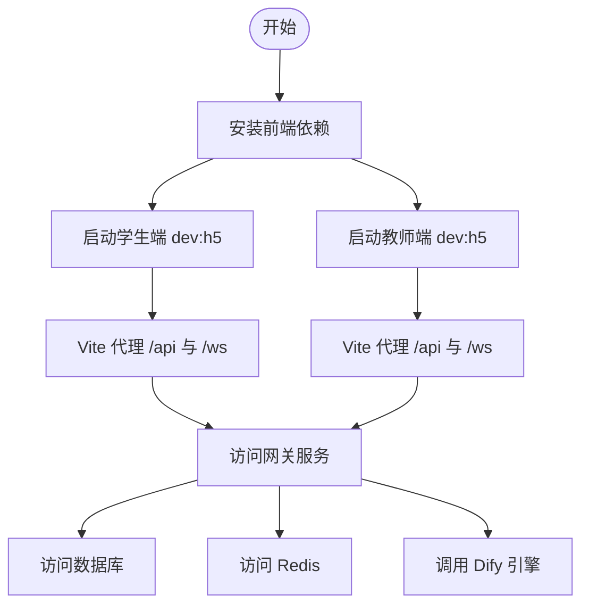
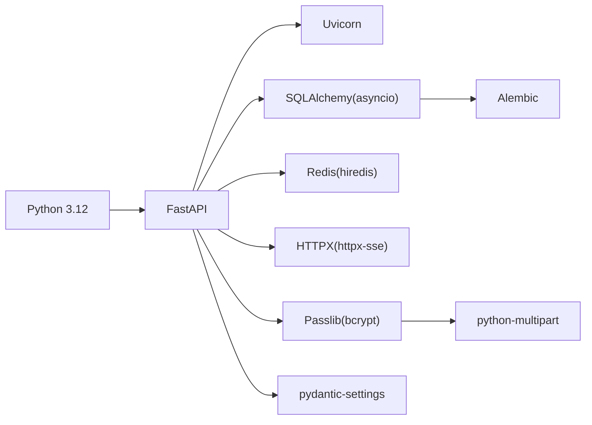

# 本地开发环境配置

<cite>
**本文引用的文件**
- [README.md](file://README.md)
- [docker-compose.yml](file://deploy/docker-compose.yml)
- [Dockerfile](file://services/gateway/Dockerfile)
- [requirements.txt](file://services/gateway/requirements.txt)
- [config.py](file://services/gateway/app/config.py)
- [main.py](file://services/gateway/app/main.py)
- [vite.config.ts（学生端）](file://apps/student-app/vite.config.ts)
- [vite.config.ts（教师端）](file://apps/teacher-app/vite.config.ts)
- [package.json（学生端）](file://apps/student-app/package.json)
- [package.json（教师端）](file://apps/teacher-app/package.json)
- [mutagen.yml](file://mutagen.yml)
- [dev-plan-v2.md](file://docs/design/dev-plan-v2.md)
</cite>

## 目录
1. [简介](#简介)
2. [项目结构](#项目结构)
3. [核心组件](#核心组件)
4. [架构总览](#架构总览)
5. [详细组件分析](#详细组件分析)
6. [依赖关系分析](#依赖关系分析)
7. [性能考虑](#性能考虑)
8. [故障排查指南](#故障排查指南)
9. [结论](#结论)
10. [附录](#附录)

## 简介
本指南面向医小管 v2 项目的本地开发环境搭建与维护，覆盖系统要求、前置依赖、数据库初始化、后端服务启动、前端应用运行、Docker 开发环境使用、开发工具配置、常见问题排查、性能优化与备份恢复流程。目标是帮助开发者以最小成本完成从零到可运行的本地开发链路。

## 项目结构
项目采用多模块分层组织：
- 前端应用：学生端与教师端均为 UniApp/Vue 3 应用，分别位于 apps/student-app 与 apps/teacher-app。
- 后端服务：统一网关 gateway 使用 FastAPI + SQLAlchemy + Alembic，位于 services/gateway。
- 部署与编排：使用 Docker Compose 进行容器化部署，位于 deploy/docker-compose.yml。
- 文档与设计：docs/design 下包含开发计划与设计文档，便于理解整体架构与开发策略。

**图表来源**
- [README.md:1-18](file://README.md#L1-L18)
- [docker-compose.yml:1-22](file://deploy/docker-compose.yml#L1-L22)
- [config.py:1-31](file://services/gateway/app/config.py#L1-L31)

**章节来源**
- [README.md:1-18](file://README.md#L1-L18)
- [dev-plan-v2.md:8-20](file://docs/design/dev-plan-v2.md#L8-L20)

## 核心组件
- 网关服务（FastAPI + SQLAlchemy + Alembic）
  - 提供认证、会话、动作与聊天等路由，内置健康检查，连接数据库与 Redis，并调用 Dify 引擎。
  - 配置来源于 pydantic-settings，支持 .env 文件与环境变量注入。
- 学生端与教师端（UniApp/Vue 3）
  - 基于 Vite 插件 @dcloudio/vite-plugin-uni，提供 H5 与多端构建脚本。
  - 前端通过代理将 /api 与 /ws 请求转发至网关服务端口。
- Docker 编排
  - 使用 docker-compose 启动网关服务，暴露端口并注入数据库、Redis、Dify 与 JWT 等环境变量。
  - 通过 extra_hosts 与 host.docker.internal 实现容器内访问宿主机服务。

**章节来源**
- [main.py:1-78](file://services/gateway/app/main.py#L1-L78)
- [config.py:1-31](file://services/gateway/app/config.py#L1-L31)
- [requirements.txt:1-29](file://services/gateway/requirements.txt#L1-L29)
- [vite.config.ts（学生端）:1-22](file://apps/student-app/vite.config.ts#L1-L22)
- [vite.config.ts（教师端）:1-22](file://apps/teacher-app/vite.config.ts#L1-L22)
- [docker-compose.yml:1-22](file://deploy/docker-compose.yml#L1-L22)

## 架构总览
下图展示了本地开发环境中的典型交互：前端通过代理访问网关，网关连接数据库与 Redis，并向 Dify 发起请求；Docker Compose 将这些服务解耦并以容器形式运行。

**图表来源**
- [vite.config.ts（学生端）:6-20](file://apps/student-app/vite.config.ts#L6-L20)
- [vite.config.ts（教师端）:6-20](file://apps/teacher-app/vite.config.ts#L6-L20)
- [docker-compose.yml:9-17](file://deploy/docker-compose.yml#L9-L17)
- [config.py:6-19](file://services/gateway/app/config.py#L6-L19)

## 详细组件分析

### 系统要求与前置依赖
- 操作系统
  - Windows/Linux/macOS 均可，建议使用最新稳定版本。
- 容器与编排
  - Docker Desktop（含 Docker Engine 与 Docker Compose 插件）。
- 后端运行时
  - Python 3.12（镜像已内置）。
  - PostgreSQL 15+ 与 Redis 7+（建议使用官方镜像或宿主机实例）。
- 前端运行时
  - Node.js 18+（建议使用 LTS 版本）。
  - pnpm 或 npm/yarn（任选其一）。
- 可选：远程同步
  - Mutagen（用于双向同步与远程开发场景，见 mutagen.yml）。

**章节来源**
- [README.md:5-11](file://README.md#L5-L11)
- [Dockerfile:1-14](file://services/gateway/Dockerfile#L1-L14)
- [requirements.txt:1-29](file://services/gateway/requirements.txt#L1-L29)
- [mutagen.yml:1-27](file://mutagen.yml#L1-L27)

### 数据库初始化与迁移
- 初始化步骤
  - 确保 PostgreSQL 与 Redis 可用（可使用 Docker Compose 或宿主机实例）。
  - 在网关服务中执行 Alembic 迁移以创建初始表结构。
- 迁移命令（在网关服务容器内执行）
  - 初始化迁移目录与版本：[alembic init](file://services/gateway/alembic/)
  - 应用迁移：[alembic upgrade head](file://services/gateway/alembic/)
  - 如需回滚：[alembic downgrade -1](file://services/gateway/alembic/)
- 数据库连接
  - 默认连接串可在配置中查看与修改：[config.py:7](file://services/gateway/app/config.py#L7)

**章节来源**
- [config.py:6-8](file://services/gateway/app/config.py#L6-L8)
- [docker-compose.yml:12](file://deploy/docker-compose.yml#L12)

### 后端服务启动
- 使用 Docker Compose 启动
  - 在 deploy 目录执行：[docker compose up -d:12-17](file://deploy/docker-compose.yml#L12-L17)
  - 端口映射：容器 8000 -> 主机 8100（避免与 v1 冲突）。
- 本地开发（非容器）
  - 安装依赖：[pip install -r requirements.txt:1-29](file://services/gateway/requirements.txt#L1-L29)
  - 启动服务：[uvicorn app.main:app --host 0.0.0.0 --port 8000:11-13](file://services/gateway/Dockerfile#L11-L13)
  - 配置文件：[app/config.py:1-31](file://services/gateway/app/config.py#L1-L31)
- 健康检查
  - 访问：[GET /health:30-68](file://services/gateway/app/main.py#L30-L68)
  - 检查项：PostgreSQL、Redis、Dify 引擎连通性。

**图表来源**
- [docker-compose.yml:1-22](file://deploy/docker-compose.yml#L1-L22)
- [main.py:30-68](file://services/gateway/app/main.py#L30-L68)

**章节来源**
- [docker-compose.yml:1-22](file://deploy/docker-compose.yml#L1-L22)
- [main.py:16-28](file://services/gateway/app/main.py#L16-L28)
- [main.py:30-68](file://services/gateway/app/main.py#L30-L68)

### 前端应用运行
- 学生端
  - 启动命令：[npm run dev:h5](file://apps/student-app/package.json#L4)
  - 代理配置：将 /api 与 /ws 代理至网关地址：[vite.config.ts:9-19](file://apps/student-app/vite.config.ts#L9-L19)
- 教师端
  - 启动命令：[npm run dev:h5](file://apps/teacher-app/package.json#L4)
  - 代理配置：同上，端口与目标地址见：[vite.config.ts:9-19](file://apps/teacher-app/vite.config.ts#L9-L19)
- 依赖安装
  - 使用 npm/pnpm/yarn 安装依赖后启动。

**图表来源**
- [package.json（学生端）:4](file://apps/student-app/package.json#L4)
- [package.json（教师端）:4](file://apps/teacher-app/package.json#L4)
- [vite.config.ts（学生端）:6-20](file://apps/student-app/vite.config.ts#L6-L20)
- [vite.config.ts（教师端）:6-20](file://apps/teacher-app/vite.config.ts#L6-L20)

**章节来源**
- [package.json（学生端）:1-37](file://apps/student-app/package.json#L1-L37)
- [package.json（教师端）:1-46](file://apps/teacher-app/package.json#L1-L46)
- [vite.config.ts（学生端）:1-22](file://apps/student-app/vite.config.ts#L1-L22)
- [vite.config.ts（教师端）:1-22](file://apps/teacher-app/vite.config.ts#L1-L22)

### Docker 开发环境使用
- 容器编排
  - 使用 [deploy/docker-compose.yml:1-22](file://deploy/docker-compose.yml#L1-L22) 定义服务与端口映射。
  - 环境变量包括数据库连接、Redis 连接、Dify 地址与密钥、JWT 密钥等。
- 服务依赖管理
  - 网关服务依赖 PostgreSQL 与 Redis；Dify 作为外部服务需独立部署或使用本地实例。
- 环境变量配置
  - 在 compose 中设置 DATABASE_URL、REDIS_URL、DIFY_API_URL、DIFY_API_KEY、JWT_SECRET。
  - 如需本地开发，可将 host.docker.internal 指向宿主机 IP（extra_hosts）。
- 容器内运行
  - 基于 Python 3.12 镜像，复制依赖与源码，暴露 8000 端口并使用 Uvicorn 启动。

**章节来源**
- [docker-compose.yml:1-22](file://deploy/docker-compose.yml#L1-L22)
- [Dockerfile:1-14](file://services/gateway/Dockerfile#L1-L14)

### 开发工具配置
- IDE 设置
  - 建议使用 VS Code 或 WebStorm，启用 TypeScript/Vue 语法检查与 ESLint/Prettier。
  - 前端项目可启用 Volar、TypeScript Vue Plugin 等扩展。
- 调试配置
  - 后端：使用 Python 调试器附加到 Uvicorn 进程，或在 IDE 中配置 FastAPI 调试任务。
  - 前端：浏览器调试工具配合 Vite HMR。
- 热重载
  - Vite 已内置 HMR；如需远程同步，可结合 Mutagen（见下节）。

**章节来源**
- [mutagen.yml:1-27](file://mutagen.yml#L1-L27)

### 远程同步与双向同步（可选）
- 使用 Mutagen 进行双向同步，忽略常见缓存与虚拟环境目录。
- 同步目标：本地 alpha 与远端 beta（示例为某固定地址）。
- 建议仅在需要远程开发或跨设备同步时启用。

**章节来源**
- [mutagen.yml:1-27](file://mutagen.yml#L1-L27)

## 依赖关系分析
- 后端依赖
  - FastAPI、Uvicorn、SQLAlchemy（异步）、Alembic、Redis、HTTPX、Pydantic Settings、Passlib、bcrypt、python-multipart。
- 前端依赖
  - @dcloudio/uni-app、Vue 3、Pinia、Sass、TypeScript、Vite、vue-tsc 等。
- 运行时依赖
  - PostgreSQL 15+、Redis 7+、Dify（可选自托管）。

**图表来源**
- [requirements.txt:1-29](file://services/gateway/requirements.txt#L1-L29)

**章节来源**
- [requirements.txt:1-29](file://services/gateway/requirements.txt#L1-L29)
- [package.json（学生端）:11-35](file://apps/student-app/package.json#L11-L35)
- [package.json（教师端）:11-44](file://apps/teacher-app/package.json#L11-L44)

## 性能考虑
- 数据库与缓存
  - 使用异步 SQLAlchemy 与连接池，合理设置连接数与超时。
  - Redis 作为缓存与会话存储，注意键空间与过期策略。
- 网关服务
  - 控制并发与路由层级，避免阻塞操作；对 Dify 调用设置合理超时与重试。
- 前端
  - 合理拆分包与懒加载；关闭不必要的开发插件与 SourceMap。
- Docker
  - 限制资源使用（CPU/内存），确保宿主机磁盘与网络性能满足需求。

[本节为通用指导，无需特定文件引用]

## 故障排查指南
- 网关无法连接数据库
  - 检查 DATABASE_URL 是否正确，确认 PostgreSQL 可达且账号密码无误。
  - 参考配置位置：[config.py:7](file://services/gateway/app/config.py#L7)
- 网关无法连接 Redis
  - 检查 REDIS_URL 与 Redis 服务状态。
  - 参考配置位置：[config.py:8](file://services/gateway/app/config.py#L8)
- Dify 无法访问
  - 检查 DIFY_API_URL 与 DIFY_API_KEY，确认 Dify 服务可达。
  - 参考配置位置：[config.py:16-17](file://services/gateway/app/config.py#L16-L17)
- 健康检查失败
  - 访问 /health 获取详细检查项与错误信息。
  - 参考实现：[main.py:30-68](file://services/gateway/app/main.py#L30-L68)
- 前端代理无效
  - 确认 Vite 代理配置与网关端口一致，浏览器控制台查看网络请求。
  - 参考配置：[vite.config.ts（学生端）:9-19](file://apps/student-app/vite.config.ts#L9-L19)，[vite.config.ts（教师端）:9-19](file://apps/teacher-app/vite.config.ts#L9-L19)
- Docker 端口冲突
  - 修改 docker-compose.yml 中的端口映射，避免与宿主机服务冲突。
  - 参考映射：[docker-compose.yml:10](file://deploy/docker-compose.yml#L10)
- 容器内无法访问宿主机服务
  - 使用 extra_hosts 与 host.docker.internal，确保解析到宿主机 IP。
  - 参考配置：[docker-compose.yml:18-19](file://deploy/docker-compose.yml#L18-L19)

**章节来源**
- [config.py:6-19](file://services/gateway/app/config.py#L6-L19)
- [main.py:30-68](file://services/gateway/app/main.py#L30-L68)
- [vite.config.ts（学生端）:6-20](file://apps/student-app/vite.config.ts#L6-L20)
- [vite.config.ts（教师端）:6-20](file://apps/teacher-app/vite.config.ts#L6-L20)
- [docker-compose.yml:9-19](file://deploy/docker-compose.yml#L9-L19)

## 结论
通过本指南，您可以在本地快速搭建医小管 v2 的开发环境：使用 Docker Compose 启动网关与基础设施，使用 Vite 启动前端应用并通过代理访问网关；在需要时结合 Mutagen 进行远程同步。遇到问题时，可依据健康检查与配置文件进行定位与修复。建议在开发过程中持续关注数据库与缓存性能、Dify 调用稳定性以及前端热重载效率。

[本节为总结性内容，无需特定文件引用]

## 附录

### 开发服务器配置要点
- 网关
  - 端口：8000（容器内），映射至 8100（宿主机）。
  - 环境变量：DATABASE_URL、REDIS_URL、DIFY_API_URL、DIFY_API_KEY、JWT_SECRET。
- 前端
  - 学生端端口：5174；教师端端口：5175。
  - 代理：/api 与 /ws 转发至网关地址。

**章节来源**
- [docker-compose.yml:9-17](file://deploy/docker-compose.yml#L9-L17)
- [vite.config.ts（学生端）:6-20](file://apps/student-app/vite.config.ts#L6-L20)
- [vite.config.ts（教师端）:6-20](file://apps/teacher-app/vite.config.ts#L6-L20)

### 备份与恢复流程（建议）
- 数据库备份
  - 使用 pg_dump 备份 PostgreSQL 数据库，定期归档。
- 配置备份
  - 备份 .env 文件与 docker-compose.yml，确保环境变量与服务配置可恢复。
- 容器卷
  - 如使用命名卷存放数据，请记录卷名并在恢复时重新挂载。
- 恢复验证
  - 启动后访问 /health，确认数据库、Redis、Dify 均正常。

[本节为通用指导，无需特定文件引用]