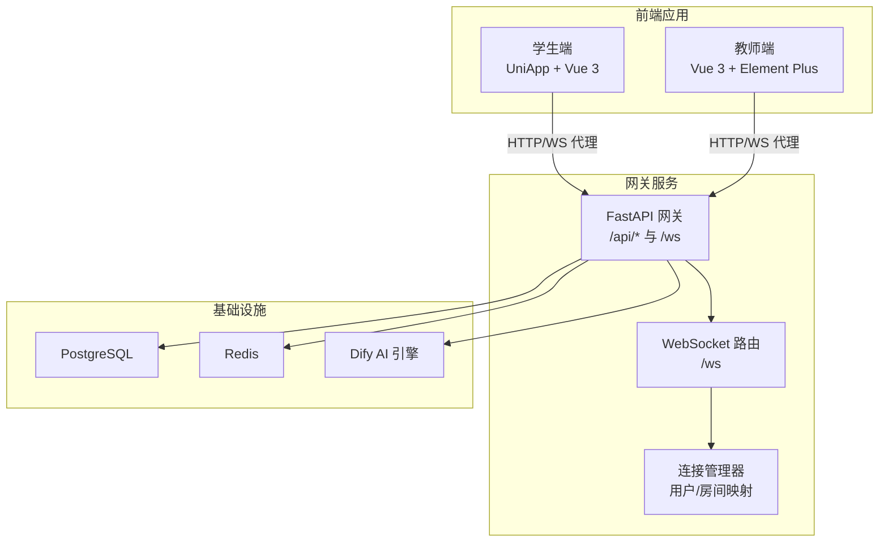
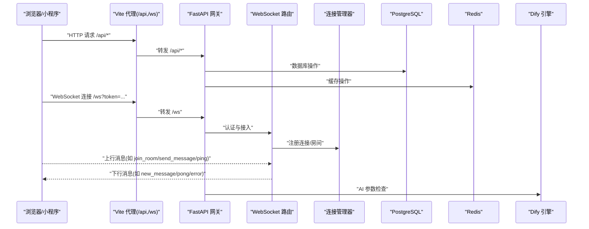
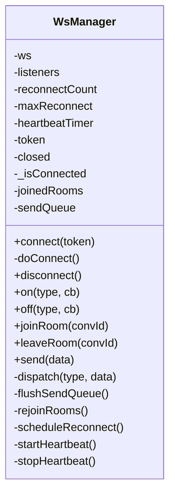
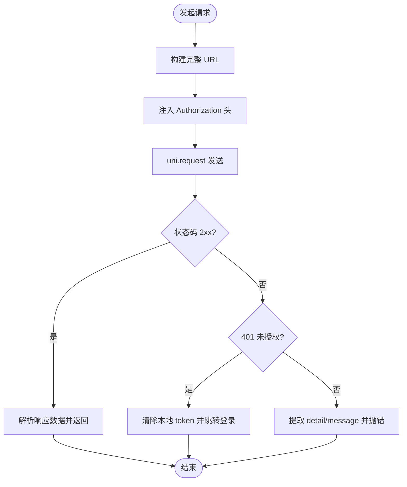
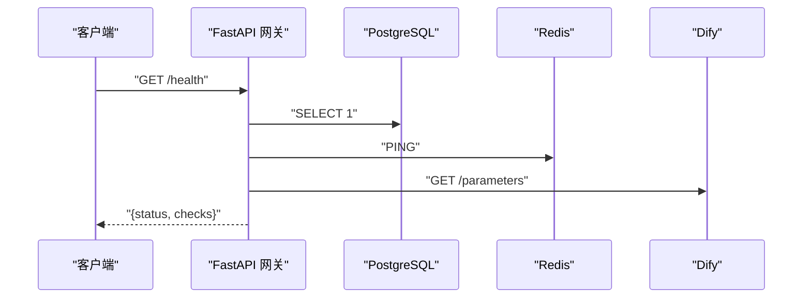
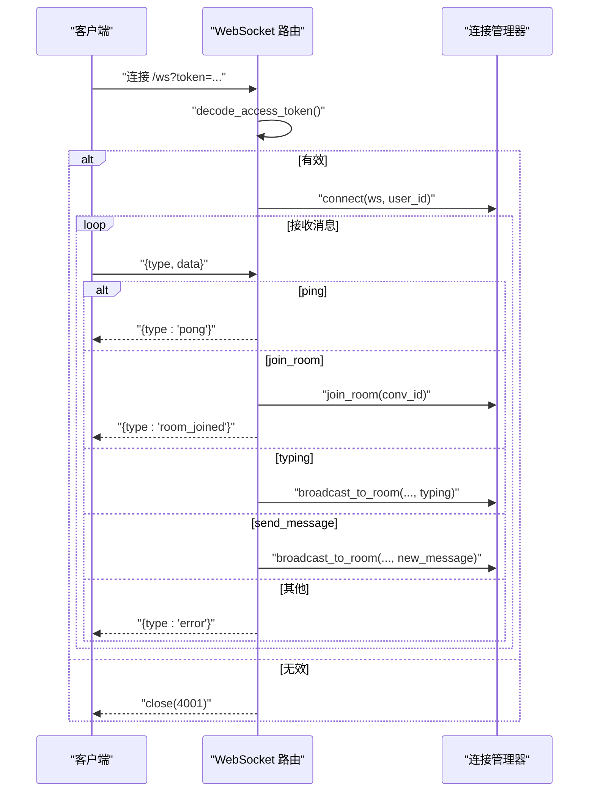
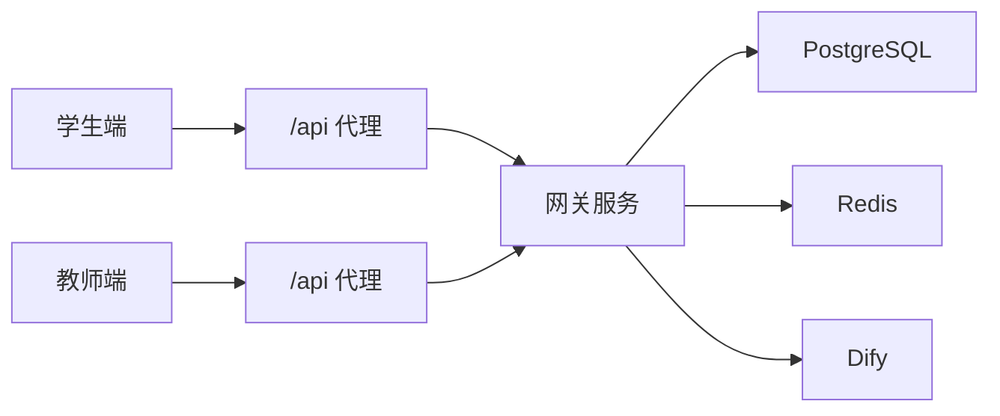

# 调试技巧与工具使用

<cite>
**本文引用的文件**
- [README.md](file://README.md)
- [apps/student-app/vite.config.ts](file://apps/student-app/vite.config.ts)
- [apps/teacher-app/vite.config.ts](file://apps/teacher-app/vite.config.ts)
- [services/gateway/app/main.py](file://services/gateway/app/main.py)
- [services/gateway/app/config.py](file://services/gateway/app/config.py)
- [services/gateway/app/routers/ws.py](file://services/gateway/app/routers/ws.py)
- [services/gateway/app/services/ws_manager.py](file://services/gateway/app/services/ws_manager.py)
- [apps/student-app/src/utils/websocket.ts](file://apps/student-app/src/utils/websocket.ts)
- [apps/teacher-app/src/utils/websocket.ts](file://apps/teacher-app/src/utils/websocket.ts)
- [apps/student-app/src/stores/user.ts](file://apps/student-app/src/stores/user.ts)
- [apps/teacher-app/src/stores/user.ts](file://apps/teacher-app/src/stores/user.ts)
- [apps/student-app/src/utils/request.ts](file://apps/student-app/src/utils/request.ts)
- [apps/teacher-app/src/utils/request.ts](file://apps/teacher-app/src/utils/request.ts)
- [deploy/docker-compose.yml](file://deploy/docker-compose.yml)
- [scripts/s2-ws-test.py](file://scripts/s2-ws-test.py)
- [scripts/migrate_kb.py](file://scripts/migrate_kb.py)
</cite>

## 目录
1. [简介](#简介)
2. [项目结构](#项目结构)
3. [核心组件](#核心组件)
4. [架构总览](#架构总览)
5. [详细组件分析](#详细组件分析)
6. [依赖关系分析](#依赖关系分析)
7. [性能调试要点](#性能调试要点)
8. [故障排查指南](#故障排查指南)
9. [结论](#结论)
10. [附录](#附录)

## 简介
本指南面向“医小管 v2”项目的前端与后端开发者，提供系统化的调试方法与工具使用建议，覆盖以下主题：
- 前端调试：浏览器开发者工具、Vue DevTools、网络请求监控、WebSocket 消息调试
- 后端调试：FastAPI 应用调试、数据库查询调试、日志分析
- 实时通信系统：连接状态监控、消息序列跟踪、异常排查
- 性能调试：内存泄漏检测、CPU 性能分析、网络性能监控
- 常见问题流程与解决方案
- 调试脚本与自动化测试工具使用
- 远程调试与生产环境问题排查

## 项目结构
项目采用多应用与多服务分层组织：
- 前端：学生端与教师端分别基于 UniApp/Vue 3 开发，使用 Vite 作为本地开发服务器，并通过代理将 /api 与 /ws 请求转发至网关服务
- 后端：网关服务基于 FastAPI，负责认证、聊天路由、WebSocket 管理与健康检查
- 部署：使用 Docker Compose 编排，暴露网关服务端口并注入环境变量

图表来源
- [apps/student-app/vite.config.ts:1-22](file://apps/student-app/vite.config.ts#L1-L22)
- [apps/teacher-app/vite.config.ts:1-22](file://apps/teacher-app/vite.config.ts#L1-L22)
- [services/gateway/app/main.py:1-78](file://services/gateway/app/main.py#L1-L78)
- [services/gateway/app/routers/ws.py:1-119](file://services/gateway/app/routers/ws.py#L1-L119)
- [services/gateway/app/services/ws_manager.py:1-100](file://services/gateway/app/services/ws_manager.py#L1-L100)
- [deploy/docker-compose.yml:1-22](file://deploy/docker-compose.yml#L1-L22)

章节来源
- [README.md:1-18](file://README.md#L1-L18)
- [apps/student-app/vite.config.ts:1-22](file://apps/student-app/vite.config.ts#L1-L22)
- [apps/teacher-app/vite.config.ts:1-22](file://apps/teacher-app/vite.config.ts#L1-L22)
- [services/gateway/app/main.py:1-78](file://services/gateway/app/main.py#L1-L78)
- [deploy/docker-compose.yml:1-22](file://deploy/docker-compose.yml#L1-L22)

## 核心组件
- 前端 WebSocket 管理器：统一处理连接、心跳、房间加入/离开、消息派发与重连策略
- 前端请求封装：统一封装 HTTP 请求，自动注入 Authorization 头与错误处理
- 网关 FastAPI：路由挂载、健康检查、JWT 认证、WebSocket 终端
- WebSocket 管理器：维护用户与房间的连接映射，支持广播与按用户推送
- 配置与环境：集中管理数据库、Redis、Dify、JWT 等配置项

章节来源
- [apps/student-app/src/utils/websocket.ts:1-153](file://apps/student-app/src/utils/websocket.ts#L1-L153)
- [apps/teacher-app/src/utils/websocket.ts:1-169](file://apps/teacher-app/src/utils/websocket.ts#L1-L169)
- [apps/student-app/src/utils/request.ts:1-44](file://apps/student-app/src/utils/request.ts#L1-L44)
- [apps/teacher-app/src/utils/request.ts:1-108](file://apps/teacher-app/src/utils/request.ts#L1-L108)
- [services/gateway/app/main.py:1-78](file://services/gateway/app/main.py#L1-L78)
- [services/gateway/app/routers/ws.py:1-119](file://services/gateway/app/routers/ws.py#L1-L119)
- [services/gateway/app/services/ws_manager.py:1-100](file://services/gateway/app/services/ws_manager.py#L1-L100)
- [services/gateway/app/config.py:1-31](file://services/gateway/app/config.py#L1-L31)

## 架构总览
下图展示从浏览器到后端服务的典型交互路径，以及 WebSocket 的双向通信模型。

图表来源
- [apps/student-app/vite.config.ts:1-22](file://apps/student-app/vite.config.ts#L1-L22)
- [apps/teacher-app/vite.config.ts:1-22](file://apps/teacher-app/vite.config.ts#L1-L22)
- [services/gateway/app/main.py:1-78](file://services/gateway/app/main.py#L1-L78)
- [services/gateway/app/routers/ws.py:1-119](file://services/gateway/app/routers/ws.py#L1-L119)
- [services/gateway/app/services/ws_manager.py:1-100](file://services/gateway/app/services/ws_manager.py#L1-L100)

## 详细组件分析

### 前端 WebSocket 管理器（学生端/教师端）
- 功能要点
  - 自动连接：根据当前协议与主机拼接 /ws 地址并发起连接
  - 心跳机制：周期性发送 ping，维持长连接活跃
  - 房间管理：记录已加入房间，在重连后自动 re-join
  - 发送队列：未连接时将消息入队，连接恢复后 flush
  - 事件派发：收到消息后按 type 分发给订阅者
  - 重连策略：指数回退，最大重连次数限制
- 关键行为
  - onOpen/onMessage/onClose/onError 生命周期钩子
  - joinRoom/leaveRoom/send 等接口
  - 断线清理与反向映射（WebSocket → user_id）

图表来源
- [apps/student-app/src/utils/websocket.ts:1-153](file://apps/student-app/src/utils/websocket.ts#L1-L153)
- [apps/teacher-app/src/utils/websocket.ts:1-169](file://apps/teacher-app/src/utils/websocket.ts#L1-L169)

章节来源
- [apps/student-app/src/utils/websocket.ts:1-153](file://apps/student-app/src/utils/websocket.ts#L1-L153)
- [apps/teacher-app/src/utils/websocket.ts:1-169](file://apps/teacher-app/src/utils/websocket.ts#L1-L169)

### 前端请求封装（学生端/教师端）
- 功能要点
  - 统一入口：request(options) 返回 Promise
  - 自动注入 Authorization：若存在 token 则附加 Bearer
  - 错误处理：401 跳转登录；422 参数错误提取提示；其他 HTTP 错误统一提示
  - 教师端额外：支持 BASE_URL 与超时配置，GET/POST/PUT/DELETE 方法封装
- 调试建议
  - 在浏览器 Network 面板观察 /api/* 请求头与响应体
  - 使用 Application/Storage 查看本地存储中的 token 与用户信息
  - 在 Console 面板查看错误日志与状态码分支

图表来源
- [apps/student-app/src/utils/request.ts:1-44](file://apps/student-app/src/utils/request.ts#L1-L44)
- [apps/teacher-app/src/utils/request.ts:1-108](file://apps/teacher-app/src/utils/request.ts#L1-L108)

章节来源
- [apps/student-app/src/utils/request.ts:1-44](file://apps/student-app/src/utils/request.ts#L1-L44)
- [apps/teacher-app/src/utils/request.ts:1-108](file://apps/teacher-app/src/utils/request.ts#L1-L108)

### 网关 FastAPI（健康检查与路由）
- 健康检查
  - 检查 PostgreSQL、Redis、Dify 服务可用性，返回聚合状态
- 路由挂载
  - /api/auth、/api/conversations、/api/conversations/actions、/api/chat 等
  - /ws WebSocket 入口
- 配置中心
  - 数据库、Redis、JWT、Dify 等配置项集中管理

图表来源
- [services/gateway/app/main.py:1-78](file://services/gateway/app/main.py#L1-L78)
- [services/gateway/app/config.py:1-31](file://services/gateway/app/config.py#L1-L31)

章节来源
- [services/gateway/app/main.py:1-78](file://services/gateway/app/main.py#L1-L78)
- [services/gateway/app/config.py:1-31](file://services/gateway/app/config.py#L1-L31)

### WebSocket 路由与连接管理
- 路由职责
  - 认证：校验 JWT，失败则关闭连接
  - 消息类型：ping、join_room、leave_room、typing、send_message
  - 下行消息：new_message、status_changed、escalation_notify、teacher_typing、pong、error
- 连接管理
  - user_connections：用户 → 连接集合
  - room_connections：房间 → 连接集合
  - 支持按用户推送与房间广播
  - 断线清理与反向映射

图表来源
- [services/gateway/app/routers/ws.py:1-119](file://services/gateway/app/routers/ws.py#L1-L119)
- [services/gateway/app/services/ws_manager.py:1-100](file://services/gateway/app/services/ws_manager.py#L1-L100)

章节来源
- [services/gateway/app/routers/ws.py:1-119](file://services/gateway/app/routers/ws.py#L1-L119)
- [services/gateway/app/services/ws_manager.py:1-100](file://services/gateway/app/services/ws_manager.py#L1-L100)

### 用户状态与初始化（前端）
- 学生端：初始化时从本地存储读取 token 与用户信息，若存在则自动连接 WebSocket
- 教师端：初始化时从本地存储读取 token 与用户信息（含显示名计算）

章节来源
- [apps/student-app/src/stores/user.ts:1-56](file://apps/student-app/src/stores/user.ts#L1-L56)
- [apps/teacher-app/src/stores/user.ts:1-63](file://apps/teacher-app/src/stores/user.ts#L1-L63)

## 依赖关系分析
- 前端对网关的依赖
  - /api 代理：学生端与教师端均通过 Vite 代理将 /api 与 /ws 转发至网关地址
  - 环境变量：教师端通过 import.meta.env.VITE_API_BASE_URL 控制基础 URL
- 后端对基础设施的依赖
  - PostgreSQL/Redis：数据库与缓存
  - Dify：AI 参数检查
  - Docker Compose：容器编排与端口映射

图表来源
- [apps/student-app/vite.config.ts:1-22](file://apps/student-app/vite.config.ts#L1-L22)
- [apps/teacher-app/vite.config.ts:1-22](file://apps/teacher-app/vite.config.ts#L1-L22)
- [services/gateway/app/main.py:1-78](file://services/gateway/app/main.py#L1-L78)
- [deploy/docker-compose.yml:1-22](file://deploy/docker-compose.yml#L1-L22)

章节来源
- [apps/student-app/vite.config.ts:1-22](file://apps/student-app/vite.config.ts#L1-L22)
- [apps/teacher-app/vite.config.ts:1-22](file://apps/teacher-app/vite.config.ts#L1-L22)
- [deploy/docker-compose.yml:1-22](file://deploy/docker-compose.yml#L1-L22)

## 性能调试要点
- 浏览器性能分析
  - 使用 Performance 面板录制交互，关注主线程耗时、布局与绘制开销
  - 使用 Memory 面板进行堆快照对比，定位内存增长与泄漏点
- 网络性能监控
  - Network 面板观察请求耗时、重定向、缓存命中情况
  - 对比 /api 与 /ws 的延迟与丢包率
- 后端性能
  - FastAPI 应用可通过日志与指标系统观测慢查询与异常
  - 数据库层面使用 EXPLAIN/EXPLAIN ANALYZE 分析慢 SQL
- 前端优化建议
  - 合理使用虚拟列表、图片懒加载与缓存策略
  - 减少不必要的响应式更新与深层嵌套对象

## 故障排查指南

### 前端常见问题
- 登录后无法进入聊天页
  - 检查本地存储中 token 是否存在
  - 观察 Network 面板 /api/auth 登录接口是否成功
  - 若 401，确认请求头 Authorization 是否正确注入
- WebSocket 无法连接或频繁断开
  - 检查 /ws 地址与 token 参数
  - 查看 Console 中连接/断开日志与重连计数
  - 确认代理配置与跨域设置
- 消息不显示或延迟严重
  - 确认已加入房间（join_room）
  - 检查心跳是否正常（ping/pong）
  - 观察 Network 面板 WebSocket 文本帧内容

章节来源
- [apps/student-app/src/stores/user.ts:1-56](file://apps/student-app/src/stores/user.ts#L1-L56)
- [apps/teacher-app/src/stores/user.ts:1-63](file://apps/teacher-app/src/stores/user.ts#L1-L63)
- [apps/student-app/src/utils/request.ts:1-44](file://apps/student-app/src/utils/request.ts#L1-L44)
- [apps/teacher-app/src/utils/request.ts:1-108](file://apps/teacher-app/src/utils/request.ts#L1-L108)
- [apps/student-app/src/utils/websocket.ts:1-153](file://apps/student-app/src/utils/websocket.ts#L1-L153)
- [apps/teacher-app/src/utils/websocket.ts:1-169](file://apps/teacher-app/src/utils/websocket.ts#L1-L169)

### 后端常见问题
- /health 返回降级状态
  - 检查 PostgreSQL/Redis/Dify 的连通性与凭据
  - 查看网关日志中的异常堆栈
- WebSocket 认证失败
  - 确认 token 有效且未过期
  - 检查 JWT 密钥与算法配置
- 消息广播异常
  - 检查房间 ID 格式与连接映射
  - 观察连接管理器的断线清理逻辑

章节来源
- [services/gateway/app/main.py:1-78](file://services/gateway/app/main.py#L1-L78)
- [services/gateway/app/routers/ws.py:1-119](file://services/gateway/app/routers/ws.py#L1-L119)
- [services/gateway/app/services/ws_manager.py:1-100](file://services/gateway/app/services/ws_manager.py#L1-L100)
- [services/gateway/app/config.py:1-31](file://services/gateway/app/config.py#L1-L31)

### 自动化测试与调试脚本
- WebSocket 冒烟测试
  - 获取学生 token → 建立 WS 连接 → ping/pong → join_room → 未知类型 → 无效 token 关闭
  - 便于快速验证网关认证与消息协议一致性
- 知识库迁移脚本
  - 支持断点续传、CSV 输出、可选写入 PG kb_entries 表
  - 便于批量迁移与结果核对

章节来源
- [scripts/s2-ws-test.py:1-51](file://scripts/s2-ws-test.py#L1-L51)
- [scripts/migrate_kb.py:1-201](file://scripts/migrate_kb.py#L1-L201)

### 远程调试与生产环境排查
- 远程调试
  - 使用浏览器的远程调试功能（移动端/平板）
  - 在生产环境开启最小化日志级别，收集关键链路日志
- 生产环境排查
  - 通过 /health 快速判断基础设施健康状况
  - 使用 APM/日志平台聚合后端与前端日志
  - 对 WebSocket 连接数与房间广播频率进行基线监控

章节来源
- [services/gateway/app/main.py:1-78](file://services/gateway/app/main.py#L1-L78)
- [deploy/docker-compose.yml:1-22](file://deploy/docker-compose.yml#L1-L22)

## 结论
本指南围绕“医小管 v2”的前端与后端调试实践，提供了从代理配置、请求封装、WebSocket 管理到健康检查与自动化脚本的全链路方法论。建议在日常开发中：
- 前端优先使用代理与本地存储模拟真实环境
- 后端以健康检查与日志为第一抓手
- 通过自动化脚本与冒烟测试保障关键路径稳定
- 在性能与生产环境中建立可观测性体系

## 附录

### 常用调试清单
- 前端
  - 浏览器 Network：/api 与 /ws 请求详情
  - Application/Storage：token 与用户信息
  - Console：连接/断开/错误日志
- 后端
  - /health：基础设施健康
  - 日志：认证、广播、异常堆栈
  - 数据库：慢查询与索引缺失

### 关键文件定位
- 学生端 WebSocket 管理器：[apps/student-app/src/utils/websocket.ts:1-153](file://apps/student-app/src/utils/websocket.ts#L1-L153)
- 教师端 WebSocket 管理器：[apps/teacher-app/src/utils/websocket.ts:1-169](file://apps/teacher-app/src/utils/websocket.ts#L1-L169)
- 前端请求封装（学生端）：[apps/student-app/src/utils/request.ts:1-44](file://apps/student-app/src/utils/request.ts#L1-L44)
- 前端请求封装（教师端）：[apps/teacher-app/src/utils/request.ts:1-108](file://apps/teacher-app/src/utils/request.ts#L1-L108)
- 网关主程序与健康检查：[services/gateway/app/main.py:1-78](file://services/gateway/app/main.py#L1-L78)
- WebSocket 路由与消息协议：[services/gateway/app/routers/ws.py:1-119](file://services/gateway/app/routers/ws.py#L1-L119)
- 连接管理器（用户/房间映射）：[services/gateway/app/services/ws_manager.py:1-100](file://services/gateway/app/services/ws_manager.py#L1-L100)
- Vite 代理配置（学生端）：[apps/student-app/vite.config.ts:1-22](file://apps/student-app/vite.config.ts#L1-L22)
- Vite 代理配置（教师端）：[apps/teacher-app/vite.config.ts:1-22](file://apps/teacher-app/vite.config.ts#L1-L22)
- Docker Compose 编排：[deploy/docker-compose.yml:1-22](file://deploy/docker-compose.yml#L1-L22)
- WebSocket 冒烟测试脚本：[scripts/s2-ws-test.py:1-51](file://scripts/s2-ws-test.py#L1-L51)
- 知识库迁移脚本：[scripts/migrate_kb.py:1-201](file://scripts/migrate_kb.py#L1-L201)