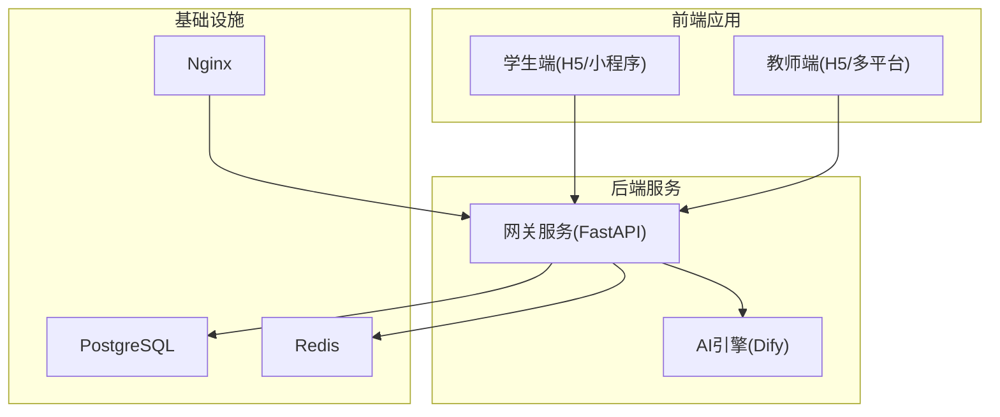
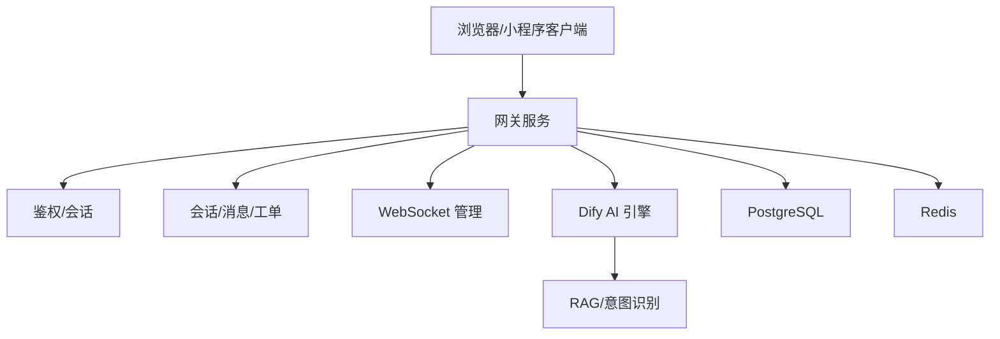
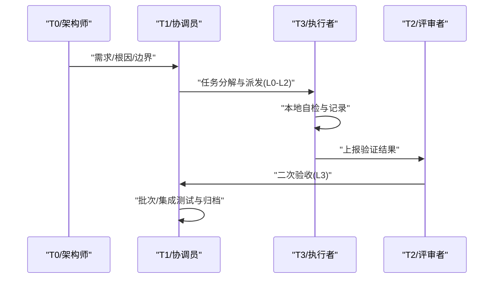
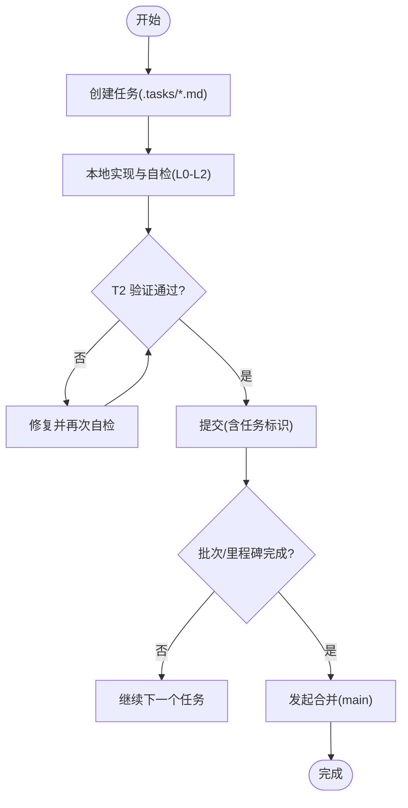
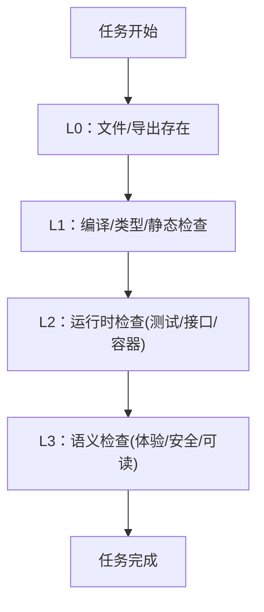
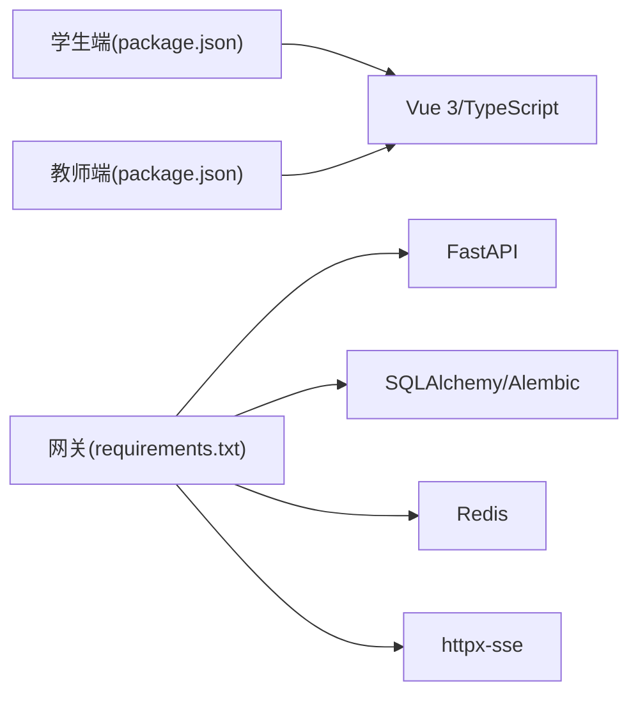

# 贡献指南与代码审查

<cite>
**本文引用的文件**
- [README.md](file://README.md)
- [.teb/guides/git-strategy.md](file://.teb/guides/git-strategy.md)
- [.teb/prompts/t1-coordinator.md](file://.teb/prompts/t1-coordinator.md)
- [.teb/prompts/t3-executor.md](file://.teb/prompts/t3-executor.md)
- [.teb/guides/verification-guide.md](file://.teb/guides/verification-guide.md)
- [docs/design/teb-mutagen-remote-dev.md](file://docs/design/teb-mutagen-remote-dev.md)
- [docs/design/dev-plan-v2.md](file://docs/design/dev-plan-v2.md)
- [docs/requirements/R03-开发前确认事项.md](file://docs/requirements/R03-开发前确认事项.md)
- [docs/requirements/R05-KB-增强需求.md](file://docs/requirements/R05-KB-增强需求.md)
- [apps/student-app/package.json](file://apps/student-app/package.json)
- [apps/teacher-app/package.json](file://apps/teacher-app/package.json)
- [services/gateway/requirements.txt](file://services/gateway/requirements.txt)
- [deploy/docker-compose.yml](file://deploy/docker-compose.yml)
- [scripts/s2-smoke-test.sh](file://scripts/s2-smoke-test.sh)
- [ws_test.py](file://ws_test.py)
- [test_login.py](file://test_login.py)
</cite>

## 目录
1. [简介](#简介)
2. [项目结构](#项目结构)
3. [核心组件](#核心组件)
4. [架构总览](#架构总览)
5. [详细组件分析](#详细组件分析)
6. [依赖分析](#依赖分析)
7. [性能考量](#性能考量)
8. [故障排查指南](#故障排查指南)
9. [结论](#结论)
10. [附录](#附录)

## 简介
本指南面向所有希望参与“医小管 v2”项目的贡献者，涵盖问题报告、功能请求、代码与文档贡献的流程；定义代码审查的标准与流程（审查清单、质量标准、反馈处理）；提供提交最佳实践（提交信息格式、变更范围控制、测试要求）；说明社区行为准则与沟通规范；给出新贡献者的入门指导与资源链接；明确维护者职责与决策流程；列举常见贡献场景的处理方式与模板；并说明贡献者认可与激励机制。

## 项目结构
项目采用多应用与多服务的分层组织方式：
- 前端应用
  - 学生端：基于 uni-app 的 H5/小程序应用
  - 教师端：基于 uni-app 的 H5/多平台应用
- 后端服务
  - 网关服务（FastAPI + SQLAlchemy + Alembic）：统一鉴权、路由、与 AI 引擎交互
  - AI 引擎（Dify 自托管）：意图识别与 RAG
- 基础设施与部署
  - Docker Compose 统一编排 PostgreSQL、Redis、Nginx、后端服务与 AI 服务
- 文档与规范
  - TEB 工作流与验证分层（L0/L1/L2/L3）
  - 开发计划与需求确认文档

图表来源
- [deploy/docker-compose.yml:1-200](file://deploy/docker-compose.yml#L1-L200)
- [services/gateway/requirements.txt:1-29](file://services/gateway/requirements.txt#L1-L29)
- [apps/student-app/package.json:1-37](file://apps/student-app/package.json#L1-L37)
- [apps/teacher-app/package.json:1-46](file://apps/teacher-app/package.json#L1-L46)

章节来源
- [README.md:12-18](file://README.md#L12-L18)
- [deploy/docker-compose.yml](file://deploy/docker-compose.yml)
- [services/gateway/requirements.txt:1-29](file://services/gateway/requirements.txt#L1-L29)
- [apps/student-app/package.json:1-37](file://apps/student-app/package.json#L1-L37)
- [apps/teacher-app/package.json:1-46](file://apps/teacher-app/package.json#L1-L46)

## 核心组件
- 网关服务（Gateway）
  - 职责：统一鉴权、路由、与 AI 引擎交互、会话与消息持久化、WebSocket 管理
  - 技术栈：FastAPI、SQLAlchemy、Alembic、Redis、httpx-sse
- 学生端（Student App）
  - 技术栈：uni-app + Vue 3 + TypeScript
  - 能力：聊天、历史、首页、登录、个人中心
- 教师端（Teacher App）
  - 技术栈：uni-app + Vue 3 + Element Plus
  - 能力：仪表盘、知识库、问题管理、登录、个人中心
- AI 引擎（Dify）
  - 职责：意图识别、RAG、流式回答
- 基础设施
  - PostgreSQL、Redis、Nginx、Docker Compose

章节来源
- [services/gateway/requirements.txt:1-29](file://services/gateway/requirements.txt#L1-L29)
- [apps/student-app/package.json:11-35](file://apps/student-app/package.json#L11-L35)
- [apps/teacher-app/package.json:11-44](file://apps/teacher-app/package.json#L11-L44)
- [docs/design/dev-plan-v2.md:8-40](file://docs/design/dev-plan-v2.md#L8-L40)

## 架构总览
整体架构遵循“前端多端 + 网关统一 + AI 引擎”的模式。前端通过网关访问后端服务与 AI 引擎，网关负责鉴权、路由、持久化与实时通信。

图表来源
- [docs/design/dev-plan-v2.md:44-65](file://docs/design/dev-plan-v2.md#L44-L65)
- [services/gateway/requirements.txt:1-29](file://services/gateway/requirements.txt#L1-L29)

章节来源
- [docs/design/dev-plan-v2.md:44-65](file://docs/design/dev-plan-v2.md#L44-L65)
- [services/gateway/requirements.txt:1-29](file://services/gateway/requirements.txt#L1-L29)

## 详细组件分析

### TEB 协作与验证分层
TEB 工作流定义了角色分工与验证分层，确保贡献过程可控、可追溯、可验收。

图表来源
- [docs/design/teb-mutagen-remote-dev.md:241-331](file://docs/design/teb-mutagen-remote-dev.md#L241-L331)
- [.teb/prompts/t1-coordinator.md:1-82](file://.teb/prompts/t1-coordinator.md#L1-L82)
- [.teb/guides/verification-guide.md:71-181](file://.teb/guides/verification-guide.md#L71-L181)

章节来源
- [docs/design/teb-mutagen-remote-dev.md:241-331](file://docs/design/teb-mutagen-remote-dev.md#L241-L331)
- [.teb/prompts/t1-coordinator.md:1-82](file://.teb/prompts/t1-coordinator.md#L1-L82)
- [.teb/guides/verification-guide.md:71-181](file://.teb/guides/verification-guide.md#L71-L181)

### 提交与分支策略
- 一个任务一个提交，仅在 T2 验证通过后提交至主分支
- 提交信息包含任务标识，便于回溯
- 分支策略：feature/ 与 fix/ 分支隔离未完成工作，通过批次与里程碑合并到 main

图表来源
- [.teb/guides/git-strategy.md:1-63](file://.teb/guides/git-strategy.md#L1-L63)
- [.teb/prompts/t3-executor.md:42-52](file://.teb/prompts/t3-executor.md#L42-L52)

章节来源
- [.teb/guides/git-strategy.md:1-63](file://.teb/guides/git-strategy.md#L1-L63)
- [.teb/prompts/t3-executor.md:42-52](file://.teb/prompts/t3-executor.md#L42-L52)

### 验证分层（L0-L3）
- L0：文件/导出存在、语法正确
- L1：编译/类型检查/静态检查通过
- L2：运行时检查（测试/接口/容器健康）
- L3：语义检查（用户体验/安全性/可读性）

图表来源
- [.teb/guides/verification-guide.md:71-181](file://.teb/guides/verification-guide.md#L71-L181)

章节来源
- [.teb/guides/verification-guide.md:71-181](file://.teb/guides/verification-guide.md#L71-L181)

### 代码审查清单与质量标准
- 作用域审计：严格遵守 scope 与 out_of_scope
- 代码质量：L0-L2 自动化验证通过；L3 语义验收
- 安全与合规：不硬编码敏感信息；不引入未要求功能
- 文档与测试：任务需包含完成标准；测试覆盖关键路径
- 回归与集成：集成测试任务确保模块间连接

章节来源
- [.teb/prompts/t3-executor.md:42-52](file://.teb/prompts/t3-executor.md#L42-L52)
- [.teb/prompts/t1-coordinator.md:29-54](file://.teb/prompts/t1-coordinator.md#L29-L54)
- [.teb/guides/verification-guide.md:71-181](file://.teb/guides/verification-guide.md#L71-L181)

### 常见贡献场景模板
- 新建 API 端点
  - L0：文件存在且导出可用
  - L1：类型/编译/静态检查通过
  - L2：测试命令通过（含正反用例）
  - L3：业务语义正确（如 JWT 有效期、payload 字段）
- 新建前端页面
  - L0：页面文件存在
  - L1：编译/类型/ESLint 通过
  - L2：构建成功且路由可访问
  - L3：表单验证与交互符合预期
- 修复 Bug
  - L0：修改文件存在且无语法错误
  - L1：类型/编译检查通过
  - L2：新增回归测试覆盖原场景
  - L3：原始问题现象不再出现
- 编写文档
  - L0：文档文件存在
  - L1：Markdown/格式检查通过
  - L2：示例可直接复制运行
  - L3：覆盖关键流程与边界

章节来源
- [.teb/guides/verification-guide.md:138-181](file://.teb/guides/verification-guide.md#L138-L181)

### 提交流程与最佳实践
- 提交信息格式
  - <type>(<scope>): <简述> [task:<任务ID>]
  - 类型：feat、fix、test、refactor、docs
- 变更范围控制
  - 严格遵循 scope 与 out_of_scope；不添加未要求功能
  - 不在代码中硬编码敏感信息
- 测试要求
  - L2：优先使用既有测试框架（Jest/Pytest）执行自动化测试
  - L3：语义验收由 T2/协调员进行
- 集成与验收
  - 批次完成并通过 T1 验收后方可合并
  - 远端推送需明确触发，代表工作对外可见

章节来源
- [.teb/guides/git-strategy.md:31-49](file://.teb/guides/git-strategy.md#L31-L49)
- [.teb/prompts/t3-executor.md:42-52](file://.teb/prompts/t3-executor.md#L42-L52)
- [.teb/guides/verification-guide.md:71-108](file://.teb/guides/verification-guide.md#L71-L108)

### 文档贡献方式与标准
- 文档类型：需求文档、设计文档、开发计划、验证报告
- 质量标准：L0-L2 自动化检查；L3 语义可读性与完整性
- 归档与追踪：执行报告与设计文档沉淀至 .tasks/ 与 docs/

章节来源
- [.teb/guides/verification-guide.md:138-181](file://.teb/guides/verification-guide.md#L138-L181)
- [docs/requirements/R03-开发前确认事项.md:1-269](file://docs/requirements/R03-开发前确认事项.md#L1-L269)
- [docs/requirements/R05-KB-增强需求.md:1-202](file://docs/requirements/R05-KB-增强需求.md#L1-L202)

### 社区行为准则与沟通规范
- 角色边界：T1 不直接写代码、不改业务文件
- 信息代理：在现有系统上开发时，通过代理工具读写项目信息
- 进度与下一步：每次汇报必须给出明确的下一步
- 风险控制：高风险任务优先人工审查或强模型验收

章节来源
- [.teb/prompts/t1-coordinator.md:3-11](file://.teb/prompts/t1-coordinator.md#L3-L11)
- [.teb/prompts/t1-coordinator.md:74-82](file://.teb/prompts/t1-coordinator.md#L74-L82)

### 新贡献者入门指导
- 快速启动
  - 使用 Docker Compose 启动全套服务
- 开发环境
  - 学生端/教师端：uni-app + Vite + TypeScript
  - 网关服务：FastAPI + SQLAlchemy + Alembic
- 参考文档
  - 开发计划与需求确认
  - TEB 工作流与验证分层
  - 提交与分支策略

章节来源
- [README.md:12-18](file://README.md#L12-L18)
- [apps/student-app/package.json:1-37](file://apps/student-app/package.json#L1-L37)
- [apps/teacher-app/package.json:1-46](file://apps/teacher-app/package.json#L1-L46)
- [services/gateway/requirements.txt:1-29](file://services/gateway/requirements.txt#L1-L29)
- [docs/design/dev-plan-v2.md:1-285](file://docs/design/dev-plan-v2.md#L1-L285)
- [docs/requirements/R03-开发前确认事项.md:1-269](file://docs/requirements/R03-开发前确认事项.md#L1-L269)

### 维护者职责与决策流程
- 维护者职责
  - 审查与验收：独立验证（T2）、范围审计、回归检查
  - 计划与协调：任务分解、批次编排、集成测试
  - 质量把关：L3 语义验收、风险标注与防停滞
- 决策流程
  - T0 明确需求与边界
  - T1 拆分任务并派发
  - T3 实施与自检
  - T2 独立验证
  - T1 二次验收与归档

章节来源
- [docs/design/teb-mutagen-remote-dev.md:241-331](file://docs/design/teb-mutagen-remote-dev.md#L241-L331)
- [.teb/prompts/t1-coordinator.md:14-22](file://.teb/prompts/t1-coordinator.md#L14-L22)
- [.teb/guides/verification-guide.md:129-135](file://.teb/guides/verification-guide.md#L129-L135)

### 贡献者认可与激励机制
- 任务完成与归档：在 .tasks/ 与 docs/ 中沉淀成果
- 批次与里程碑：通过标签与合并推动项目进展
- 高风险任务优先人工审查：保障关键路径质量

章节来源
- [.teb/guides/git-strategy.md:14-28](file://.teb/guides/git-strategy.md#L14-L28)
- [.teb/prompts/t1-coordinator.md:74-82](file://.teb/prompts/t1-coordinator.md#L74-L82)

## 依赖分析
- 前端依赖
  - 学生端与教师端均使用 uni-app 生态，分别包含 H5 与多平台编译脚本
- 后端依赖
  - 网关服务依赖 FastAPI、SQLAlchemy、Alembic、Redis、httpx-sse、Pydantic Settings 等
- 基础设施
  - Docker Compose 统一编排数据库、缓存、反向代理与服务容器

图表来源
- [apps/student-app/package.json:1-37](file://apps/student-app/package.json#L1-L37)
- [apps/teacher-app/package.json:1-46](file://apps/teacher-app/package.json#L1-L46)
- [services/gateway/requirements.txt:1-29](file://services/gateway/requirements.txt#L1-L29)

章节来源
- [apps/student-app/package.json:1-37](file://apps/student-app/package.json#L1-L37)
- [apps/teacher-app/package.json:1-46](file://apps/teacher-app/package.json#L1-L46)
- [services/gateway/requirements.txt:1-29](file://services/gateway/requirements.txt#L1-L29)

## 性能考量
- 本地与远端协同：通过远程同步工具减少往返成本，提高验证效率
- 验证分层：优先自动化验证（L0-L2），降低 L3 人为判断带来的不确定性
- 集成测试：模块完成后进行集成测试，避免跨模块耦合导致的性能退化

章节来源
- [docs/design/teb-mutagen-remote-dev.md:281-331](file://docs/design/teb-mutagen-remote-dev.md#L281-L331)
- [.teb/guides/verification-guide.md:71-108](file://.teb/guides/verification-guide.md#L71-L108)

## 故障排查指南
- 本地自检
  - 类型检查：使用类型检查脚本
  - 构建与运行：使用 uni-app 脚本进行 H5/小程序构建
  - 网关服务：使用测试脚本进行登录与 WebSocket 测试
- 远端验证
  - 使用脚本进行冒烟测试与 WebSocket 测试
  - 检查容器健康状态与日志

章节来源
- [apps/student-app/package.json:4-10](file://apps/student-app/package.json#L4-L10)
- [apps/teacher-app/package.json:4-10](file://apps/teacher-app/package.json#L4-L10)
- [scripts/s2-smoke-test.sh](file://scripts/s2-smoke-test.sh)
- [ws_test.py](file://ws_test.py)
- [test_login.py](file://test_login.py)

## 结论
本指南将 TEB 工作流、验证分层与项目技术栈有机结合，形成可执行、可追溯、可验收的贡献与审查流程。建议贡献者在任务开始前明确完成标准（L0-L2），在实施过程中严格控制作用域，通过自动化测试与语义验收保证质量，并在批次与里程碑完成后进行归档与回顾，持续改进协作效率与交付质量。

## 附录
- 快速启动与部署
  - 使用 Docker Compose 启动全套服务
- 相关文档
  - 开发计划与需求确认
  - TEB 工作流与验证分层
  - 提交与分支策略

章节来源
- [README.md:12-18](file://README.md#L12-L18)
- [docs/design/dev-plan-v2.md:1-285](file://docs/design/dev-plan-v2.md#L1-L285)
- [docs/requirements/R03-开发前确认事项.md:1-269](file://docs/requirements/R03-开发前确认事项.md#L1-L269)
- [.teb/guides/git-strategy.md:1-63](file://.teb/guides/git-strategy.md#L1-L63)