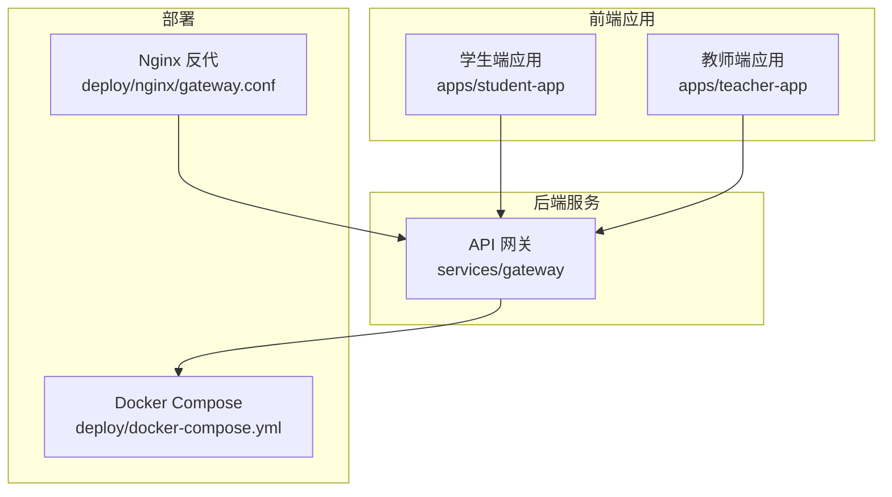
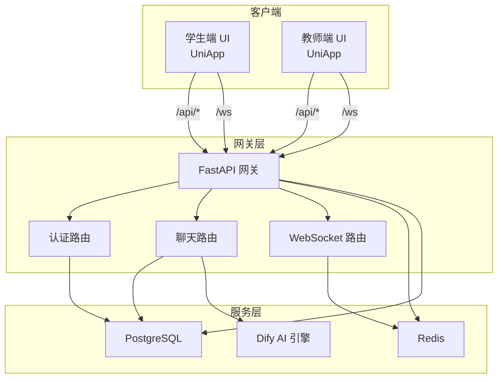
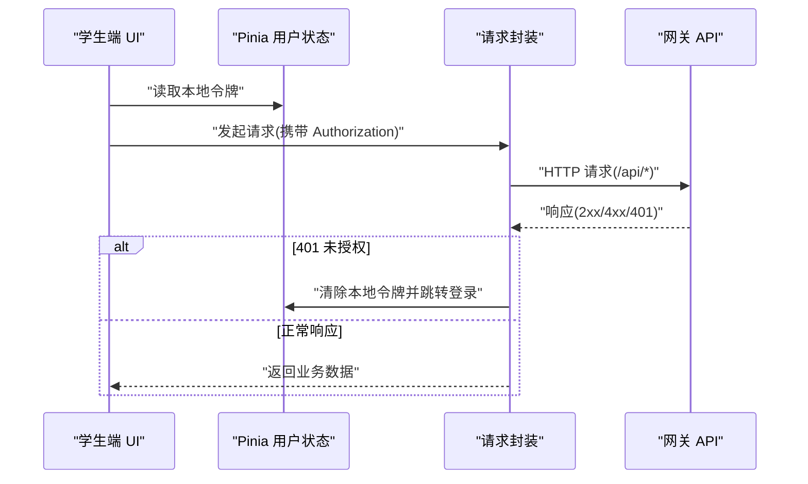
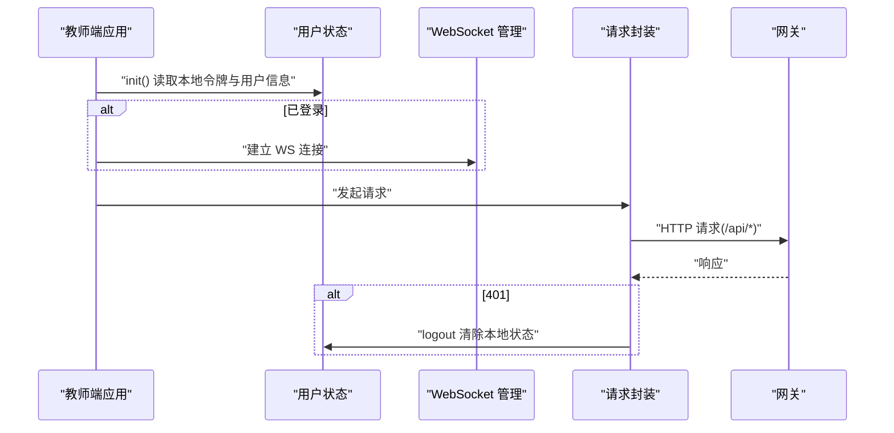
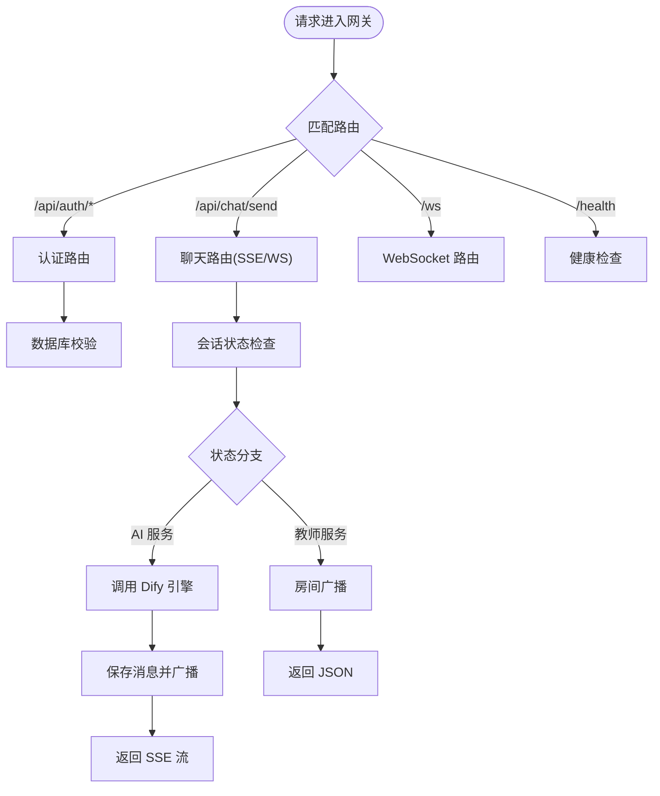
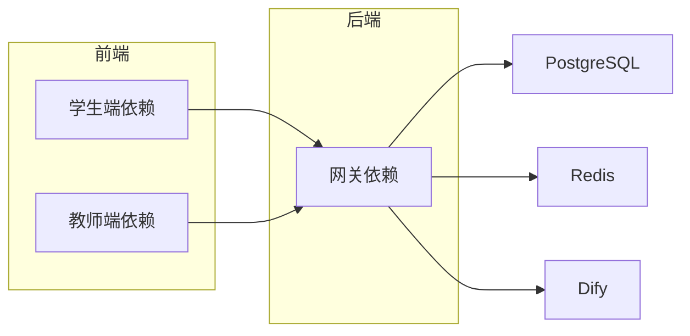

# 项目结构与模块划分

<cite>
**本文引用的文件**
- [README.md](file://README.md)
- [apps/student-app/package.json](file://apps/student-app/package.json)
- [apps/teacher-app/package.json](file://apps/teacher-app/package.json)
- [apps/student-app/vite.config.ts](file://apps/student-app/vite.config.ts)
- [apps/teacher-app/vite.config.ts](file://apps/teacher-app/vite.config.ts)
- [apps/student-app/src/main.ts](file://apps/student-app/src/main.ts)
- [apps/teacher-app/src/main.ts](file://apps/teacher-app/src/main.ts)
- [apps/student-app/src/stores/user.ts](file://apps/student-app/src/stores/user.ts)
- [apps/teacher-app/src/stores/user.ts](file://apps/teacher-app/src/stores/user.ts)
- [apps/student-app/src/utils/request.ts](file://apps/student-app/src/utils/request.ts)
- [apps/teacher-app/src/utils/request.ts](file://apps/teacher-app/src/utils/request.ts)
- [services/gateway/app/main.py](file://services/gateway/app/main.py)
- [services/gateway/app/config.py](file://services/gateway/app/config.py)
- [services/gateway/app/routers/auth.py](file://services/gateway/app/routers/auth.py)
- [services/gateway/app/routers/chat.py](file://services/gateway/app/routers/chat.py)
- [services/gateway/requirements.txt](file://services/gateway/requirements.txt)
- [deploy/docker-compose.yml](file://deploy/docker-compose.yml)
- [deploy/nginx/gateway.conf](file://deploy/nginx/gateway.conf)
</cite>

## 目录
1. [引言](#引言)
2. [项目结构](#项目结构)
3. [核心组件](#核心组件)
4. [架构总览](#架构总览)
5. [详细组件分析](#详细组件分析)
6. [依赖分析](#依赖分析)
7. [性能考虑](#性能考虑)
8. [故障排查指南](#故障排查指南)
9. [结论](#结论)
10. [附录](#附录)

## 引言
本文件面向“医小管 v2”项目，系统化梳理其整体目录结构与模块划分，重点覆盖：
- 前后端分离架构下的模块组织方式
- 前端应用（学生端与教师端）的组件层次、API 层设计与状态管理架构
- 后端服务（API 网关、业务逻辑、数据访问层）的职责划分
- 配置文件组织（环境配置、构建配置、部署配置）
- 模块间依赖关系与数据流向
- 新功能模块的添加流程与最佳实践
- 代码复用与组件抽象的设计原则
- 模块测试与集成测试策略

## 项目结构
项目采用“多应用 + 多服务”的分层组织方式：
- apps：前端应用目录，包含学生端与教师端两个独立的 UniApp 应用
- services：后端服务目录，包含 API 网关（FastAPI）与数据库迁移脚本
- deploy：部署相关配置，包含 Docker Compose 与 Nginx 反向代理
- docs：设计与需求文档（用于补充说明）

图表来源
- [apps/student-app/package.json:1-37](file://apps/student-app/package.json#L1-L37)
- [apps/teacher-app/package.json:1-46](file://apps/teacher-app/package.json#L1-L46)
- [services/gateway/app/main.py:1-78](file://services/gateway/app/main.py#L1-L78)
- [deploy/docker-compose.yml:1-22](file://deploy/docker-compose.yml#L1-L22)
- [deploy/nginx/gateway.conf:1-36](file://deploy/nginx/gateway.conf#L1-L36)

章节来源
- [README.md:1-18](file://README.md#L1-L18)
- [apps/student-app/package.json:1-37](file://apps/student-app/package.json#L1-L37)
- [apps/teacher-app/package.json:1-46](file://apps/teacher-app/package.json#L1-L46)
- [services/gateway/app/main.py:1-78](file://services/gateway/app/main.py#L1-L78)
- [deploy/docker-compose.yml:1-22](file://deploy/docker-compose.yml#L1-L22)
- [deploy/nginx/gateway.conf:1-36](file://deploy/nginx/gateway.conf#L1-L36)

## 核心组件
- 前端应用
  - 学生端与教师端均基于 UniApp/Vue 3，使用 Pinia 进行状态管理
  - 通过 Vite 插件进行多平台构建与开发服务器
  - 统一的请求封装，自动注入认证头并处理鉴权失败场景
- 后端服务
  - API 网关基于 FastAPI，提供健康检查、认证、聊天、会话等接口
  - 使用 SQLAlchemy 异步 ORM 与 Alembic 进行数据库迁移
  - 使用 Redis 缓存与会话管理，集成 Dify 自托管 AI 引擎
- 部署与反向代理
  - Docker Compose 统一编排后端服务，暴露网关端口
  - Nginx 作为反向代理，分流 API 与 WebSocket 请求，并限制 Dify 控制台访问

章节来源
- [apps/student-app/src/main.ts:1-11](file://apps/student-app/src/main.ts#L1-L11)
- [apps/teacher-app/src/main.ts:1-25](file://apps/teacher-app/src/main.ts#L1-L25)
- [apps/student-app/src/utils/request.ts:1-44](file://apps/student-app/src/utils/request.ts#L1-L44)
- [apps/teacher-app/src/utils/request.ts:1-108](file://apps/teacher-app/src/utils/request.ts#L1-L108)
- [services/gateway/app/main.py:1-78](file://services/gateway/app/main.py#L1-L78)
- [services/gateway/app/config.py:1-31](file://services/gateway/app/config.py#L1-L31)
- [services/gateway/requirements.txt:1-29](file://services/gateway/requirements.txt#L1-L29)
- [deploy/docker-compose.yml:1-22](file://deploy/docker-compose.yml#L1-L22)
- [deploy/nginx/gateway.conf:1-36](file://deploy/nginx/gateway.conf#L1-L36)

## 架构总览
系统采用“前端多应用 + 后端 API 网关”的前后端分离架构。前端通过统一的 /api 前缀与 WebSocket /ws 访问后端；后端负责认证、会话管理、AI 对话流式响应与状态机转换；Redis 与 PostgreSQL 分别承担缓存与持久化；Docker Compose 与 Nginx 实现容器化与反向代理。

图表来源
- [services/gateway/app/main.py:1-78](file://services/gateway/app/main.py#L1-L78)
- [services/gateway/app/routers/auth.py:1-35](file://services/gateway/app/routers/auth.py#L1-L35)
- [services/gateway/app/routers/chat.py:1-191](file://services/gateway/app/routers/chat.py#L1-L191)
- [deploy/docker-compose.yml:1-22](file://deploy/docker-compose.yml#L1-L22)

章节来源
- [services/gateway/app/main.py:1-78](file://services/gateway/app/main.py#L1-L78)
- [services/gateway/app/routers/auth.py:1-35](file://services/gateway/app/routers/auth.py#L1-L35)
- [services/gateway/app/routers/chat.py:1-191](file://services/gateway/app/routers/chat.py#L1-L191)
- [deploy/docker-compose.yml:1-22](file://deploy/docker-compose.yml#L1-L22)

## 详细组件分析

### 前端应用（学生端）
- 应用入口与状态初始化
  - 创建 SSR 应用实例并注册 Pinia
  - 用户状态存储负责令牌与用户信息的本地持久化与鉴权头注入
- 请求封装
  - 统一处理 401 未授权、422 参数错误与网络失败
  - 自动在请求头中附加 Bearer Token
- 开发与构建
  - Vite 插件支持多平台开发与构建
  - 本地开发服务器通过代理将 /api 与 /ws 转发至网关地址

图表来源
- [apps/student-app/src/main.ts:1-11](file://apps/student-app/src/main.ts#L1-L11)
- [apps/student-app/src/stores/user.ts:1-56](file://apps/student-app/src/stores/user.ts#L1-L56)
- [apps/student-app/src/utils/request.ts:1-44](file://apps/student-app/src/utils/request.ts#L1-L44)
- [apps/student-app/vite.config.ts:1-22](file://apps/student-app/vite.config.ts#L1-L22)

章节来源
- [apps/student-app/src/main.ts:1-11](file://apps/student-app/src/main.ts#L1-L11)
- [apps/student-app/src/stores/user.ts:1-56](file://apps/student-app/src/stores/user.ts#L1-L56)
- [apps/student-app/src/utils/request.ts:1-44](file://apps/student-app/src/utils/request.ts#L1-L44)
- [apps/student-app/vite.config.ts:1-22](file://apps/student-app/vite.config.ts#L1-L22)

### 前端应用（教师端）
- 应用入口与自动初始化
  - 在应用启动时加载本地令牌与用户信息
  - 若存在令牌则自动建立 WebSocket 连接
- 请求封装
  - 支持查询参数拼接、超时控制与统一错误提示
  - 401 时触发登出并跳转登录页
- 开发与构建
  - 与学生端一致的多平台构建与代理配置

图表来源
- [apps/teacher-app/src/main.ts:1-25](file://apps/teacher-app/src/main.ts#L1-L25)
- [apps/teacher-app/src/stores/user.ts:1-63](file://apps/teacher-app/src/stores/user.ts#L1-L63)
- [apps/teacher-app/src/utils/request.ts:1-108](file://apps/teacher-app/src/utils/request.ts#L1-L108)
- [apps/teacher-app/vite.config.ts:1-22](file://apps/teacher-app/vite.config.ts#L1-L22)

章节来源
- [apps/teacher-app/src/main.ts:1-25](file://apps/teacher-app/src/main.ts#L1-L25)
- [apps/teacher-app/src/stores/user.ts:1-63](file://apps/teacher-app/src/stores/user.ts#L1-L63)
- [apps/teacher-app/src/utils/request.ts:1-108](file://apps/teacher-app/src/utils/request.ts#L1-L108)
- [apps/teacher-app/vite.config.ts:1-22](file://apps/teacher-app/vite.config.ts#L1-L22)

### 后端服务（API 网关）
- 应用生命周期与健康检查
  - 启动时连接 Redis，关闭时释放连接
  - 提供 /health 探针，检查数据库、Redis 与 Dify 服务连通性
- 路由组织
  - 认证路由：登录与获取当前用户信息
  - 聊天路由：学生消息发送、SSE 流式响应、AI 消息落库与广播
  - WebSocket 路由：会话房间广播与状态变更通知
- 配置管理
  - 使用 Pydantic Settings 从 .env 文件加载数据库、Redis、JWT、Dify 等配置

图表来源
- [services/gateway/app/main.py:1-78](file://services/gateway/app/main.py#L1-L78)
- [services/gateway/app/routers/auth.py:1-35](file://services/gateway/app/routers/auth.py#L1-L35)
- [services/gateway/app/routers/chat.py:1-191](file://services/gateway/app/routers/chat.py#L1-L191)
- [services/gateway/app/config.py:1-31](file://services/gateway/app/config.py#L1-L31)

章节来源
- [services/gateway/app/main.py:1-78](file://services/gateway/app/main.py#L1-L78)
- [services/gateway/app/routers/auth.py:1-35](file://services/gateway/app/routers/auth.py#L1-L35)
- [services/gateway/app/routers/chat.py:1-191](file://services/gateway/app/routers/chat.py#L1-L191)
- [services/gateway/app/config.py:1-31](file://services/gateway/app/config.py#L1-L31)

### 配置文件组织
- 环境配置
  - 网关通过 .env 加载数据库、Redis、JWT、Dify 等敏感配置
- 构建配置
  - 前端应用通过 Vite 插件与多平台目标进行开发与构建
  - 本地开发服务器通过代理将 /api 与 /ws 转发到网关
- 部署配置
  - Docker Compose 将网关容器映射到宿主机 8100 端口，并注入环境变量
  - Nginx 作为反向代理，分流 /api 与 /ws，并限制 Dify 控制台访问

章节来源
- [services/gateway/app/config.py:1-31](file://services/gateway/app/config.py#L1-L31)
- [apps/student-app/vite.config.ts:1-22](file://apps/student-app/vite.config.ts#L1-L22)
- [apps/teacher-app/vite.config.ts:1-22](file://apps/teacher-app/vite.config.ts#L1-L22)
- [deploy/docker-compose.yml:1-22](file://deploy/docker-compose.yml#L1-L22)
- [deploy/nginx/gateway.conf:1-36](file://deploy/nginx/gateway.conf#L1-L36)

## 依赖分析
- 前端依赖
  - 学生端与教师端均依赖 @dcloudio/uni-app、Vue 3、Pinia 与 TypeScript
  - 教师端额外引入国际化依赖
- 后端依赖
  - FastAPI、SQLAlchemy 异步、Alembic、Redis、httpx、Pydantic Settings 等
- 运行时依赖
  - PostgreSQL 与 Redis 由外部服务提供，Dify 作为自托管 AI 引擎

图表来源
- [apps/student-app/package.json:1-37](file://apps/student-app/package.json#L1-L37)
- [apps/teacher-app/package.json:1-46](file://apps/teacher-app/package.json#L1-L46)
- [services/gateway/requirements.txt:1-29](file://services/gateway/requirements.txt#L1-L29)

章节来源
- [apps/student-app/package.json:1-37](file://apps/student-app/package.json#L1-L37)
- [apps/teacher-app/package.json:1-46](file://apps/teacher-app/package.json#L1-L46)
- [services/gateway/requirements.txt:1-29](file://services/gateway/requirements.txt#L1-L29)

## 性能考虑
- 前端
  - 使用 Pinia 进行轻量状态管理，避免不必要的全局刷新
  - 请求封装统一处理错误与重试策略，减少重复逻辑
- 后端
  - 使用异步数据库与 Redis，降低阻塞
  - SSE 流式响应减少一次性大包传输，提升交互体验
  - WebSocket 房间广播按会话维度隔离，避免全量广播
- 部署
  - Nginx 反代提升并发与稳定性，限制 Dify 控制台访问范围

## 故障排查指南
- 健康检查
  - 通过 /health 检查数据库、Redis 与 Dify 服务状态
- 常见问题定位
  - 401 未授权：检查前端是否正确注入 Authorization 头与本地令牌是否过期
  - SSE/WS 连接失败：确认 /ws 路由与 WebSocket 管理器状态
  - Dify 异常：检查 Dify API 地址与密钥配置

章节来源
- [services/gateway/app/main.py:30-68](file://services/gateway/app/main.py#L30-L68)
- [apps/student-app/src/utils/request.ts:25-36](file://apps/student-app/src/utils/request.ts#L25-L36)
- [apps/teacher-app/src/utils/request.ts:42-56](file://apps/teacher-app/src/utils/request.ts#L42-L56)

## 结论
本项目以“多应用 + 多服务”为核心，通过清晰的模块划分与职责边界，实现了前后端分离、可扩展的校园智能服务系统。前端采用统一的状态管理与请求封装，后端以 FastAPI 为网关，结合数据库、缓存与 AI 引擎，形成稳定的服务体系。配合 Docker Compose 与 Nginx，具备良好的可运维性与上线准备度。

## 附录

### 新功能模块添加流程与最佳实践
- 前端
  - 在对应应用的 src 下新增页面与组件，统一放置于 pages 与 components 目录
  - 在 utils 中新增通用工具函数，避免重复逻辑
  - 在 stores 中新增状态模块，遵循单一职责与命名规范
- 后端
  - 在 app/routers 下新增路由模块，按领域拆分（如知识库、问答等）
  - 在 app/schemas 定义请求/响应模型，确保类型安全
  - 在 app/services 中实现业务逻辑，必要时调用 app/services 下的专用客户端
  - 在 app/models 与 app/database 中维护数据模型与迁移脚本
- 配置
  - 在 app/config.py 中新增配置项，并在 .env 中设置默认值
  - 在 Docker Compose 与 Nginx 中同步更新端口与代理规则

### 代码复用与组件抽象的设计原则
- 前端
  - 将通用 UI 组件抽象为可复用组件，集中管理样式与交互
  - 将通用逻辑抽离为 Composable 或工具函数，减少重复代码
- 后端
  - 将通用依赖（如数据库会话、Redis 连接）抽象为依赖函数
  - 将通用错误处理与响应格式化抽象为中间件或装饰器

### 模块测试与集成测试策略
- 单元测试
  - 前端：对工具函数与纯函数进行单元测试，使用 Vitest 或 Jest
  - 后端：对服务层函数进行单元测试，使用 pytest 与 asyncio 支持
- 集成测试
  - 前端：通过 E2E 测试覆盖关键用户流程（登录、聊天、状态切换）
  - 后端：通过 FastAPI TestClient 编写接口测试，覆盖认证、聊天与状态机转换
- 端到端验证
  - 使用脚本对网关健康检查、SSE/WS 连接与 Dify 交互进行冒烟测试