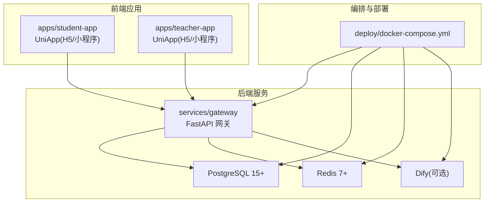
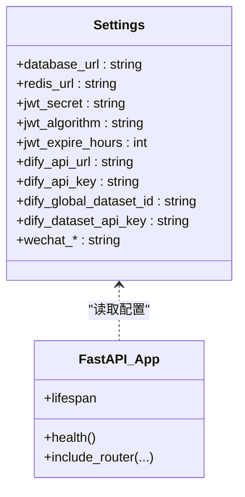
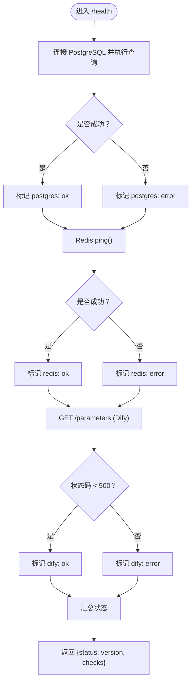
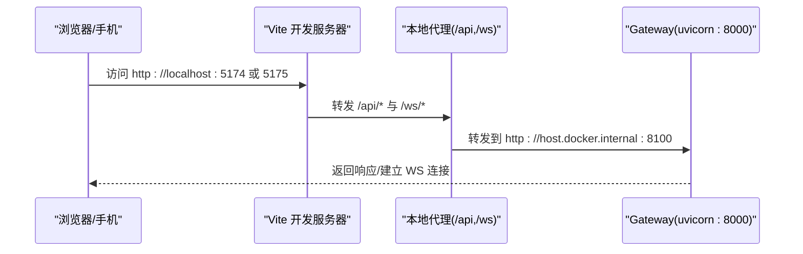
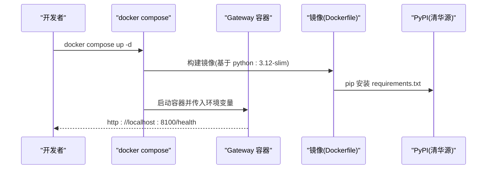
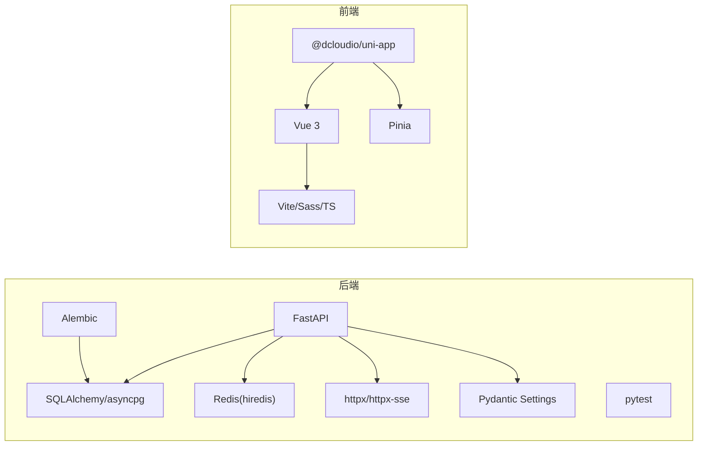

# 快速开始

<cite>
**本文引用的文件**
- [README.md](file://README.md)
- [docker-compose.yml](file://deploy/docker-compose.yml)
- [Dockerfile](file://services/gateway/Dockerfile)
- [requirements.txt](file://services/gateway/requirements.txt)
- [config.py](file://services/gateway/app/config.py)
- [main.py](file://services/gateway/app/main.py)
- [vite.config.ts（学生端）](file://apps/student-app/vite.config.ts)
- [vite.config.ts（教师端）](file://apps/teacher-app/vite.config.ts)
- [package.json（学生端）](file://apps/student-app/package.json)
- [package.json（教师端）](file://apps/teacher-app/package.json)
- [dev-plan-v2.md](file://docs/design/dev-plan-v2.md)
- [alembic.ini](file://services/gateway/alembic.ini)
- [env.py（Alembic）](file://services/gateway/alembic/env.py)
</cite>

## 目录
1. [简介](#简介)
2. [项目结构](#项目结构)
3. [核心组件](#核心组件)
4. [架构总览](#架构总览)
5. [详细组件分析](#详细组件分析)
6. [依赖关系分析](#依赖关系分析)
7. [性能考虑](#性能考虑)
8. [故障排除指南](#故障排除指南)
9. [结论](#结论)
10. [附录](#附录)

## 简介
本指南面向新加入的开发者，帮助你在最短时间内完成医小管 v2 项目的本地开发与运行。你将获得：
- 环境要求与前置条件（Python、Node.js、Docker 等）
- 本地开发环境搭建步骤（数据库、AI 服务、前端依赖）
- Docker 开发环境配置与使用说明（docker-compose）
- 常见安装问题与故障排除建议
- 基本项目结构与启动命令示例

## 项目结构
项目采用多模块组织方式：
- 后端网关服务：FastAPI + SQLAlchemy + Alembic（位于 services/gateway）
- 学生端应用：UniApp（位于 apps/student-app）
- 教师端应用：UniApp（位于 apps/teacher-app）
- 部署与编排：Docker Compose（位于 deploy/docker-compose.yml）
- 文档与设计：docs/design、docs/requirements



图表来源
- [docker-compose.yml:1-22](file://deploy/docker-compose.yml#L1-L22)
- [Dockerfile:1-14](file://services/gateway/Dockerfile#L1-L14)
- [config.py:6-26](file://services/gateway/app/config.py#L6-L26)

章节来源
- [README.md:1-18](file://README.md#L1-L18)
- [dev-plan-v2.md:8-20](file://docs/design/dev-plan-v2.md#L8-L20)

## 核心组件
- 后端网关（FastAPI）
  - 提供认证、会话、动作、WebSocket、聊天等路由
  - 健康检查接口会检测数据库、Redis、Dify 服务连通性
- 学生端与教师端（UniApp）
  - 使用 Vite 插件进行构建与代理，开发时通过 /api 与 /ws 访问后端
- Docker 编排
  - 一键拉起网关服务，并通过环境变量注入数据库、Redis、Dify 等配置

章节来源
- [main.py:30-68](file://services/gateway/app/main.py#L30-L68)
- [config.py:6-26](file://services/gateway/app/config.py#L6-L26)
- [vite.config.ts（学生端）:6-21](file://apps/student-app/vite.config.ts#L6-L21)
- [vite.config.ts（教师端）:6-21](file://apps/teacher-app/vite.config.ts#L6-L21)
- [docker-compose.yml:1-22](file://deploy/docker-compose.yml#L1-L22)

## 架构总览
下图展示了前后端与外部服务的关系，以及 Docker 编排如何统一启动各组件。

```mermaid
graph TB
U1["浏览器/手机<br/>学生端 UniApp"]
U2["浏览器/手机<br/>教师端 UniApp"]
G["Gateway(FastAPI)<br/>uvicorn:8000"]
P["PostgreSQL 15+<br/>5432"]
R["Redis 7+<br/>6379"]
D["Dify(可选)<br/>5001"]
U1 --> |HTTP/WS| G
U2 --> |HTTP/WS| G
G --> |SQLAlchemy/AsyncPG| P
G --> |Redis(hiredis)| R
G --> |httpx SSE| D
```

图表来源
- [main.py:1-28](file://services/gateway/app/main.py#L1-L28)
- [config.py:6-26](file://services/gateway/app/config.py#L6-L26)
- [docker-compose.yml:9-16](file://deploy/docker-compose.yml#L9-L16)

## 详细组件分析

### 后端网关（FastAPI）
- 配置项
  - 数据库连接字符串与 Redis 连接字符串
  - JWT 密钥、算法与过期时长
  - Dify API 地址、密钥、全局知识库 ID 等
- 健康检查
  - 检测 PostgreSQL、Redis、Dify 的可用性
  - 返回整体状态与各组件检查结果
- 路由
  - 认证、会话、动作、WebSocket、聊天等模块化挂载



图表来源
- [config.py:3-30](file://services/gateway/app/config.py#L3-L30)
- [main.py:16-78](file://services/gateway/app/main.py#L16-L78)

章节来源
- [config.py:6-26](file://services/gateway/app/config.py#L6-L26)
- [main.py:30-68](file://services/gateway/app/main.py#L30-L68)

### 健康检查流程
健康检查依次对数据库、Redis、Dify 进行探测，汇总状态并返回。



图表来源
- [main.py:30-68](file://services/gateway/app/main.py#L30-L68)

章节来源
- [main.py:30-68](file://services/gateway/app/main.py#L30-L68)

### 前端开发代理与端口
- 学生端与教师端分别使用不同的开发端口
- 通过代理将 /api 与 /ws 请求转发至网关服务（默认 8100 端口）



图表来源
- [vite.config.ts（学生端）:6-21](file://apps/student-app/vite.config.ts#L6-L21)
- [vite.config.ts（教师端）:6-21](file://apps/teacher-app/vite.config.ts#L6-L21)
- [docker-compose.yml:9-11](file://deploy/docker-compose.yml#L9-L11)

章节来源
- [vite.config.ts（学生端）:6-21](file://apps/student-app/vite.config.ts#L6-L21)
- [vite.config.ts（教师端）:6-21](file://apps/teacher-app/vite.config.ts#L6-L21)

### Docker 开发环境
- 使用 docker-compose.yml 启动网关服务
- 环境变量用于注入数据库、Redis、Dify、JWT 等配置
- 端口映射：容器 8000 映射到宿主 8100（避免与 v1 冲突）



图表来源
- [docker-compose.yml:1-22](file://deploy/docker-compose.yml#L1-L22)
- [Dockerfile:1-14](file://services/gateway/Dockerfile#L1-L14)
- [requirements.txt:1-29](file://services/gateway/requirements.txt#L1-L29)

章节来源
- [docker-compose.yml:1-22](file://deploy/docker-compose.yml#L1-L22)
- [Dockerfile:1-14](file://services/gateway/Dockerfile#L1-L14)
- [requirements.txt:1-29](file://services/gateway/requirements.txt#L1-L29)

## 依赖关系分析
- 后端依赖
  - FastAPI、Uvicorn、SQLAlchemy(asyncio)、asyncpg、Alembic、Redis(hiredis)、httpx(httpx-sse)、Pydantic Settings、pytest、bcrypt 等
- 前端依赖
  - @dcloudio/uni-app、vue、pinia、sass、typescript、vite、vue-tsc 等
- 外部服务
  - PostgreSQL、Redis、Dify（可选）



图表来源
- [requirements.txt:1-29](file://services/gateway/requirements.txt#L1-L29)
- [package.json（学生端）:11-35](file://apps/student-app/package.json#L11-L35)
- [package.json（教师端）:11-44](file://apps/teacher-app/package.json#L11-L44)

章节来源
- [requirements.txt:1-29](file://services/gateway/requirements.txt#L1-L29)
- [package.json（学生端）:1-37](file://apps/student-app/package.json#L1-L37)
- [package.json（教师端）:1-46](file://apps/teacher-app/package.json#L1-L46)

## 性能考虑
- 数据库与缓存
  - 使用异步 SQLAlchemy 与 asyncpg，减少阻塞
  - Redis 用于会话与临时状态，注意键空间与过期策略
- 网关并发
  - Uvicorn 默认多进程/多协程，合理设置 workers 数量
- 健康检查
  - 定时健康检查避免误判，Dify 探测设置合理超时
- 前端代理
  - 仅在开发阶段启用代理，生产环境由 Nginx 或网关统一出口

## 故障排除指南
- 网关无法访问
  - 检查端口映射：容器 8000 -> 主机 8100
  - 访问 http://localhost:8100/health 确认服务就绪
- 数据库连接失败
  - 确认 DATABASE_URL 与主机网络可达
  - 若使用 Docker，确保数据库服务已启动且可被容器访问
- Redis 连接失败
  - 确认 REDIS_URL 与主机网络可达
  - 检查 Redis 服务状态与密码
- Dify 服务不可达
  - 确认 DIFY_API_URL 与 DIFY_API_KEY
  - 健康检查会返回 Dify 的状态码，便于定位
- 前端无法代理到后端
  - 检查 vite.config.ts 中的代理 target 是否指向正确的主机地址
  - 确保宿主机 IP 可被容器访问（extra_hosts 配置）
- Alembic 迁移失败
  - 确认 alembic.ini 中的 sqlalchemy.url 与 settings.database_url 一致
  - 在网关容器内执行迁移，或在本地使用相同数据库配置

章节来源
- [docker-compose.yml:9-19](file://deploy/docker-compose.yml#L9-L19)
- [main.py:30-68](file://services/gateway/app/main.py#L30-L68)
- [vite.config.ts（学生端）:9-18](file://apps/student-app/vite.config.ts#L9-L18)
- [vite.config.ts（教师端）:9-18](file://apps/teacher-app/vite.config.ts#L9-L18)
- [alembic.ini:86-89](file://services/gateway/alembic.ini#L86-L89)
- [env.py（Alembic）:73-82](file://services/gateway/alembic/env.py#L73-L82)

## 结论
通过本指南，你可以：
- 明确环境要求与前置条件
- 快速搭建本地开发环境并运行
- 使用 Docker 一键启动后端服务
- 在遇到问题时快速定位与解决

建议在完成本地验证后，继续阅读设计文档以了解更深入的功能与架构细节。

## 附录

### 环境要求与前置条件
- Python
  - 版本：3.12（容器镜像已内置）
- Node.js
  - 版本：满足 Vite 与 UniApp 构建需求（随项目依赖）
- Docker
  - 用于一键编排后端服务与外部依赖
- 外部服务
  - PostgreSQL 15+、Redis 7+（可复用 v1 环境）
  - Dify（可选，用于本地化 AI 引擎）

章节来源
- [Dockerfile:1-1](file://services/gateway/Dockerfile#L1-L1)
- [requirements.txt:1-29](file://services/gateway/requirements.txt#L1-L29)
- [README.md:8-8](file://README.md#L8-L8)

### 本地开发环境搭建步骤
- 后端
  - 安装 Python 依赖：pip install -r services/gateway/requirements.txt
  - 设置环境变量（可选）：DATABASE_URL、REDIS_URL、DIFY_API_URL、DIFY_API_KEY、JWT_SECRET
  - 启动服务：uvicorn app.main:app --host 0.0.0.0 --port 8000
- 前端
  - 安装依赖：npm install（或对应包管理器）
  - 学生端：npm run dev:h5 或 dev:mp-weixin
  - 教师端：npm run dev:h5 或 dev:mp-weixin
- 数据库迁移（可选）
  - 在网关容器内执行 Alembic 迁移，或在本地使用相同数据库配置

章节来源
- [requirements.txt:1-29](file://services/gateway/requirements.txt#L1-L29)
- [package.json（学生端）:4-10](file://apps/student-app/package.json#L4-L10)
- [package.json（教师端）:4-10](file://apps/teacher-app/package.json#L4-L10)
- [alembic.ini:86-89](file://services/gateway/alembic.ini#L86-L89)
- [env.py（Alembic）:73-82](file://services/gateway/alembic/env.py#L73-L82)

### Docker 开发环境配置指南
- 启动
  - 在 deploy 目录执行：docker compose up -d
- 端口
  - 网关服务映射到宿主 8100（避免与 v1 冲突）
- 环境变量
  - DATABASE_URL、REDIS_URL、DIFY_API_URL、DIFY_API_KEY、JWT_SECRET
- 外部主机
  - 使用 extra_hosts 将 host.docker.internal 指向 host-gateway

章节来源
- [docker-compose.yml:1-22](file://deploy/docker-compose.yml#L1-L22)

### 基本项目结构与启动命令示例
- 项目根目录
  - README.md：技术栈与快速启动
- 后端
  - services/gateway：FastAPI 网关、数据库模型、路由、服务、工具
- 前端
  - apps/student-app、apps/teacher-app：UniApp 应用
- 部署
  - deploy/docker-compose.yml：编排文件
- 启动命令
  - 快速启动：cd deploy && docker compose up -d
  - 健康检查：curl http://localhost:8100/health

章节来源
- [README.md:12-15](file://README.md#L12-L15)
- [docker-compose.yml:14-14](file://deploy/docker-compose.yml#L14-L14)