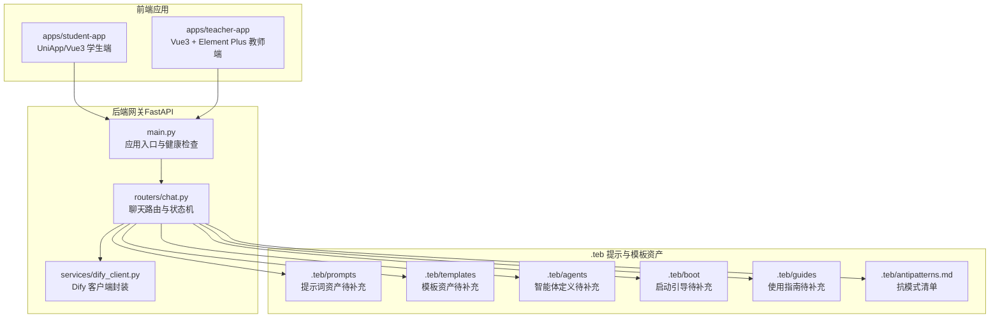
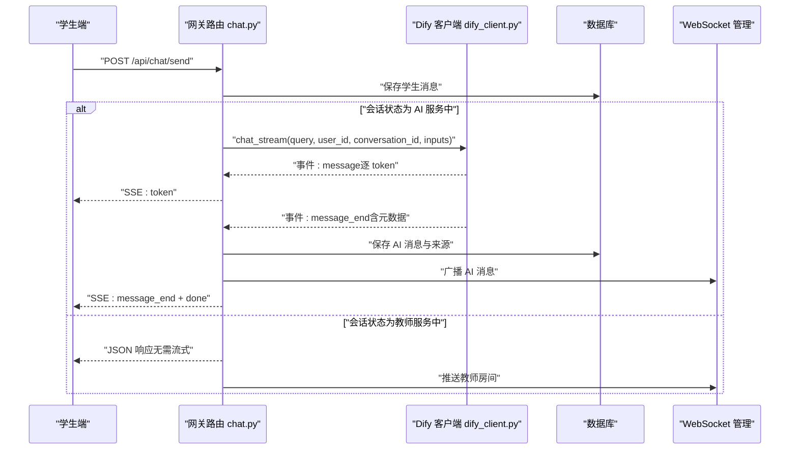
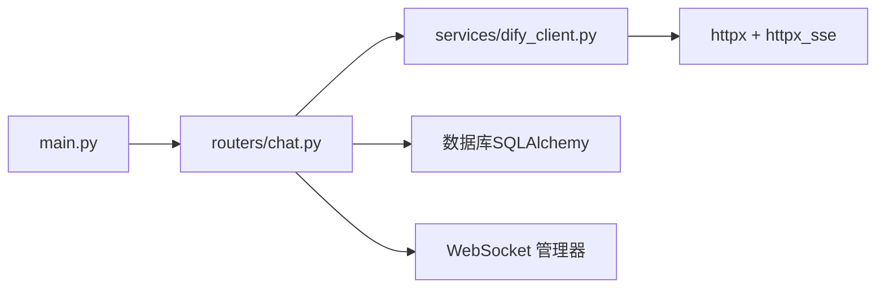

# TEA 框架定制

<cite>
**本文档引用的文件**
- [README.md](file://README.md)
- [main.py](file://services/gateway/app/main.py)
- [chat.py](file://services/gateway/app/routers/chat.py)
- [dify_client.py](file://services/gateway/app/services/dify_client.py)
- [antipatterns.md](file://.teb/antipatterns.md)
</cite>

## 目录
1. [简介](#简介)
2. [项目结构](#项目结构)
3. [核心组件](#核心组件)
4. [架构总览](#架构总览)
5. [详细组件分析](#详细组件分析)
6. [依赖分析](#依赖分析)
7. [性能考虑](#性能考虑)
8. [故障排除指南](#故障排除指南)
9. [结论](#结论)
10. [附录](#附录)

## 简介
本指南面向希望在 TEA 框架上进行定制与扩展的工程师与产品人员。TEA 框架围绕“提示词工程（Prompts）—模板系统（Templates）—智能体设计（Agents）”三要素构建，结合 Dify 自托管 AI 引擎与前后端应用，形成可流式交互、可观测、可治理的校园智能服务系统。

- 项目目标：通过 TEA 框架实现可复用、可演进的 AI 服务能力，支持学生端与教师端的多场景对话与知识问答。
- 技术栈：后端为 FastAPI + SQLAlchemy + Alembic；AI 引擎为 Dify（自托管）；前端为 UniApp/Vue 3（学生端）与 Vue 3 + Element Plus（教师端）。
- 关键能力：基于 Dify 的流式对话（SSE），会话状态机驱动的多角色协作，以及基于 .teb 目录的提示词与模板资产沉淀。

本指南将从系统架构入手，逐步拆解提示词工程、模板系统与智能体设计的定制方法，并提供抗模式管理、最佳实践与故障排除建议。

**章节来源**
- [README.md:1-18](file://README.md#L1-L18)

## 项目结构
TEA 框架的核心位于 .teb 目录，包含 agents、boot、guides、prompts、templates 等子目录，用于沉淀智能体、引导流程、提示词与模板资产。后端网关服务位于 services/gateway，负责会话管理、状态流转、Dify 集成与 SSE 流式输出。

**图示来源**
- [main.py:1-78](file://services/gateway/app/main.py#L1-L78)
- [chat.py:1-191](file://services/gateway/app/routers/chat.py#L1-L191)
- [dify_client.py:1-105](file://services/gateway/app/services/dify_client.py#L1-L105)
- [antipatterns.md:1-25](file://.teb/antipatterns.md#L1-L25)

**章节来源**
- [README.md:5-11](file://README.md#L5-L11)
- [main.py:16-28](file://services/gateway/app/main.py#L16-L28)
- [chat.py:22-103](file://services/gateway/app/routers/chat.py#L22-L103)

## 核心组件
- 应用入口与生命周期：定义 FastAPI 应用、Redis 连接与健康检查，挂载认证、会话、动作、WebSocket 与聊天路由。
- 聊天路由与状态机：根据会话状态（AI 服务中、等待教师、教师服务中等）分流至 Dify 流式对话或 WebSocket 推送教师。
- Dify 客户端：封装 Dify Chatflow 的流式调用，按事件类型（message/message_end/error）分发数据，供后端聚合与持久化。
- 抗模式管理：集中记录 AI 常见反模式与纠正方法，指导团队规范使用。

**章节来源**
- [main.py:16-68](file://services/gateway/app/main.py#L16-L68)
- [chat.py:22-191](file://services/gateway/app/routers/chat.py#L22-L191)
- [dify_client.py:11-105](file://services/gateway/app/services/dify_client.py#L11-L105)
- [antipatterns.md:8-24](file://.teb/antipatterns.md#L8-L24)

## 架构总览
下图展示了从客户端到后端网关再到 Dify 的端到端交互流程，重点体现状态机驱动与流式响应机制。

**图示来源**
- [chat.py:22-191](file://services/gateway/app/routers/chat.py#L22-L191)
- [dify_client.py:22-69](file://services/gateway/app/services/dify_client.py#L22-L69)

## 详细组件分析

### 提示词工程（Prompts）定制指南
提示词工程是 TEA 框架的“输入层”，决定模型行为与输出质量。建议在 .teb/prompts 下建立分层结构，例如：
- system.md：系统级指令，定义角色、约束与输出格式
- user.md：用户侧提示，描述具体任务与上下文
- tool.md：工具调用提示，定义检索、查询与知识来源格式
- role-play.md：角色扮演类提示，用于模拟不同身份的对话风格
- examples/：示例集合，包含正反例与边界情况

提示词设计原则
- 明确角色与权限：限定模型只能回答与知识库相关的领域内容
- 结构化输出：要求模型以固定格式输出（如 JSON、带编号的要点）
- 边界控制：限制长度、避免过度推理与敏感信息泄露
- 可测试性：为每类提示准备若干样例，便于回归验证

提示词与模板的衔接
- 将提示词作为模板变量的“静态值”，在模板中通过占位符注入动态上下文
- 对于复杂提示，采用“主提示 + 多个子提示”的组合方式，按需拼装

**章节来源**
- [antipatterns.md:16-24](file://.teb/antipatterns.md#L16-L24)

### 模板系统（Templates）定制指南
模板系统用于将提示词、上下文与业务数据组合为最终的请求体或展示内容。建议在 .teb/templates 下按功能域组织：
- chat/：对话相关模板（历史消息、当前问题、知识来源）
- knowledge/：知识检索与展示模板
- agent/：智能体工作流模板（决策分支、工具调用序列）

模板变量与渲染
- 变量命名：采用语义化命名（如 college_id、student_name、question），与后端输入保持一致
- 条件渲染：对可选字段使用条件判断，避免空值污染
- 循环处理：对列表型数据（如知识来源）进行安全遍历与截断
- 安全性：对用户输入进行转义与长度限制，防止注入与超长响应

模板与提示词的协同
- 将提示词作为模板的“静态段”，变量作为“动态段”
- 通过模板引擎（如 Jinja2 或自研占位符替换）实现一次性拼装

**章节来源**
- [chat.py:118-122](file://services/gateway/app/routers/chat.py#L118-L122)

### 智能体设计（Agents）定制指南
智能体是 TEA 框架的“决策层”，负责在多角色、多状态之间做出选择。建议在 .teb/agents 下以 YAML/JSON 描述智能体：
- 基本属性：名称、角色、能力、约束
- 状态机：定义状态、触发条件、转移动作
- 规则集：优先级排序的策略规则（如“优先 AI 回答，超阈值转人工”）
- 工具集：可调用的知识检索、外部接口等

智能体与后端集成
- 在 chat.py 中根据会话状态调用对应智能体逻辑
- 将智能体决策结果映射为路由分支（SSE 或 WS 推送）

智能体配置示例（步骤化）
- 步骤一：读取会话上下文与历史消息
- 步骤二：评估是否满足 AI 自动回答条件
- 步骤三：若满足，调用 Dify 流式接口；否则进入教师服务状态
- 步骤四：根据 Dify 返回的元数据（如来源）更新展示模板

**章节来源**
- [chat.py:34-59](file://services/gateway/app/routers/chat.py#L34-L59)
- [chat.py:84-102](file://services/gateway/app/routers/chat.py#L84-L102)

### 抗模式管理与最佳实践
抗模式管理是保障团队协作质量的关键。建议：
- 维护 .teb/antipatterns.md，记录常见问题与纠正方法
- 在任务开始前，强制阅读抗模式清单，避免重复踩坑
- 将抗模式纳入评审清单，新条目通过报告与审阅流程统一沉淀

最佳实践
- 分层治理：提示词、模板、智能体分层沉淀，职责清晰
- 可观测性：为每个提示词与模板标注版本、适用范围与变更日志
- 安全基线：默认拒绝越权回答，严格限制输出格式与长度
- 回归保障：为关键提示与模板建立自动化测试样例

**章节来源**
- [antipatterns.md:3-13](file://.teb/antipatterns.md#L3-L13)
- [antipatterns.md:16-24](file://.teb/antipatterns.md#L16-L24)

## 依赖分析
后端服务依赖关系如下：
- 应用入口 main.py 负责生命周期管理与健康检查
- 路由 chat.py 依赖数据库、WebSocket 管理器与 Dify 客户端
- Dify 客户端封装 HTTP(SSE) 请求，向上游提供事件流

**图示来源**
- [main.py:16-28](file://services/gateway/app/main.py#L16-L28)
- [chat.py:11-16](file://services/gateway/app/routers/chat.py#L11-L16)
- [dify_client.py:1-6](file://services/gateway/app/services/dify_client.py#L1-L6)

**章节来源**
- [main.py:16-28](file://services/gateway/app/main.py#L16-L28)
- [chat.py:11-16](file://services/gateway/app/routers/chat.py#L11-L16)
- [dify_client.py:14-17](file://services/gateway/app/services/dify_client.py#L14-L17)

## 性能考虑
- 流式传输：使用 SSE 将 Dify 的 token 逐字节下发，降低首包延迟，提升感知速度
- 连接池与超时：合理设置 httpx 超时与连接池参数，避免阻塞与资源泄漏
- 数据库写入：批量/异步写入消息与元数据，减少事务锁竞争
- 缓存与预热：对热点提示词与模板进行缓存，减少重复解析成本
- 监控与告警：在健康检查中加入 Dify 与数据库状态监控，及时发现异常

[本节为通用性能建议，不直接分析具体文件]

## 故障排除指南
常见问题与排查步骤
- Dify 服务不可用
  - 现象：SSE 返回 error 事件或健康检查失败
  - 排查：检查 Dify 地址、API Key 与网络连通性；查看后端日志中的异常堆栈
  - 参考：健康检查与流式事件处理逻辑
- 会话状态异常
  - 现象：无法发送消息或状态不更新
  - 排查：确认会话存在且状态允许发送；检查状态机转换逻辑
  - 参考：会话状态校验与转换
- 前端无流式输出
  - 现象：SSE 无 token 推送
  - 排查：确认浏览器支持 SSE、代理配置与 CORS；检查后端 headers 设置
- 知识来源缺失
  - 现象：message_end 事件缺少 retriever_resources
  - 排查：确认 Dify Chatflow 已启用知识检索；检查 inputs 是否包含必要字段

**章节来源**
- [main.py:51-61](file://services/gateway/app/main.py#L51-L61)
- [chat.py:145-153](file://services/gateway/app/routers/chat.py#L145-L153)
- [chat.py:133-142](file://services/gateway/app/routers/chat.py#L133-L142)

## 结论
TEA 框架通过“提示词工程—模板系统—智能体设计”的分层架构，实现了可治理、可扩展的 AI 能力。结合 Dify 的流式能力与后端的状态机驱动，既能满足学生端的即时问答，也能支撑教师端的人机协作。建议团队在 .teb 目录中沉淀资产，遵循抗模式清单，持续优化提示词与模板，确保系统稳定与可演进。

[本节为总结性内容，不直接分析具体文件]

## 附录
- 快速启动：使用 docker compose 启动后端服务
- 前端接入：学生端与教师端通过网关提供的 API 进行认证、会话与聊天交互
- 版本与健康：后端提供 /health 接口，包含数据库、Redis 与 Dify 的连通性检查

**章节来源**
- [README.md:12-15](file://README.md#L12-L15)
- [main.py:30-68](file://services/gateway/app/main.py#L30-L68)