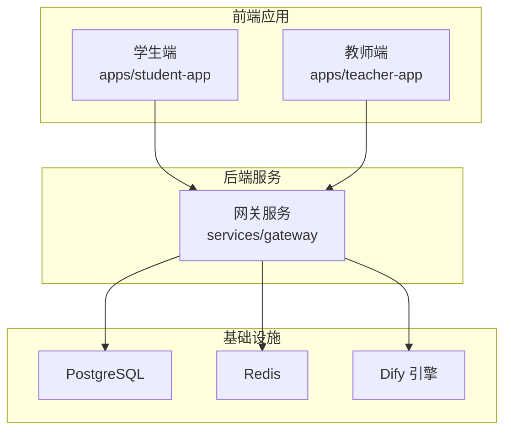
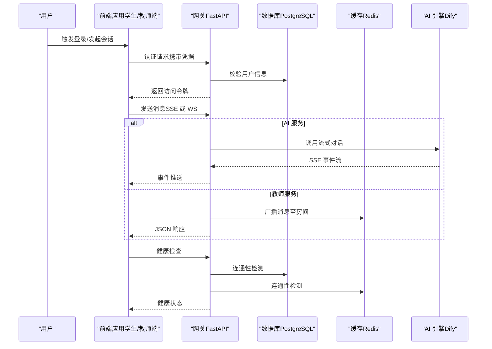
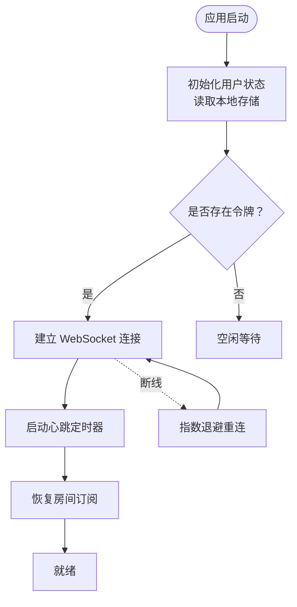
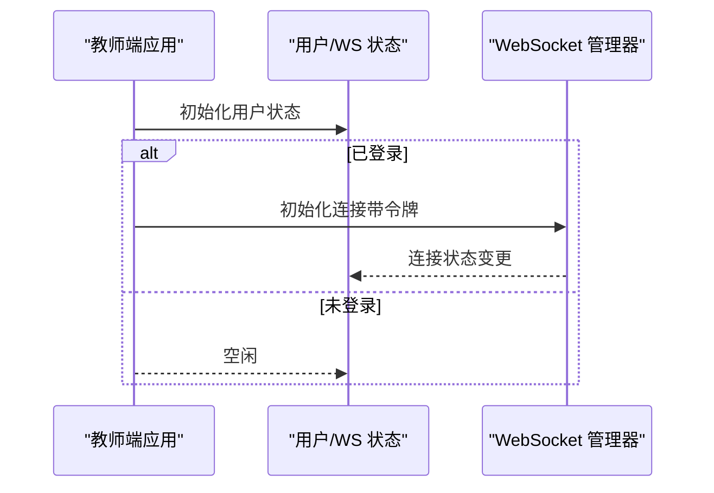
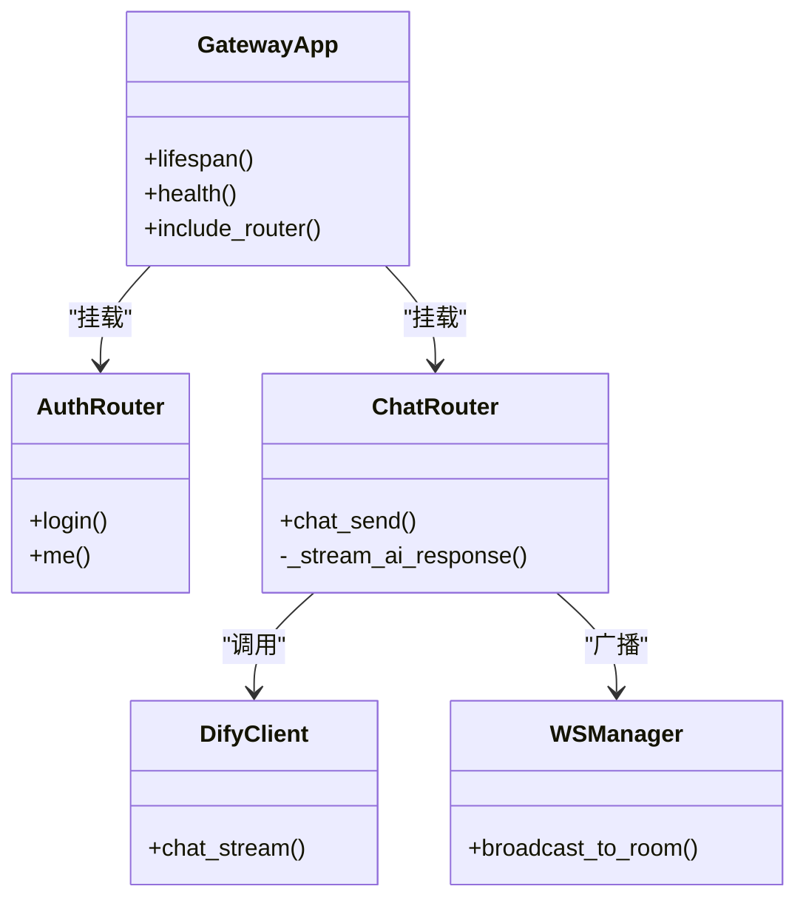
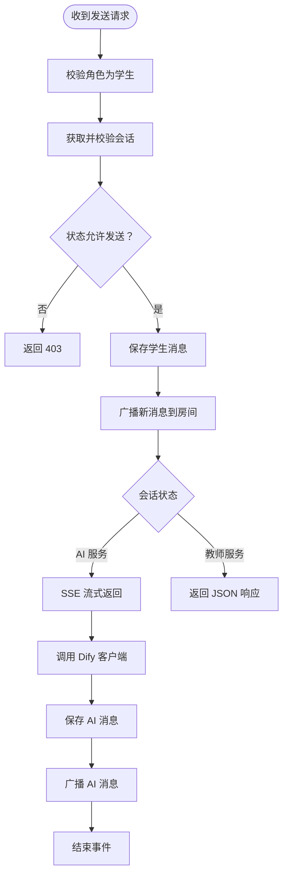
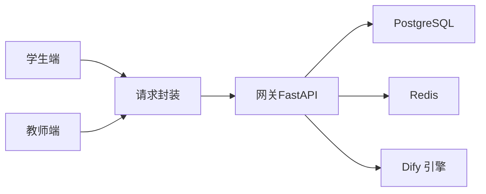

# 使用指南与最佳实践

<cite>
**本文引用的文件**
- [README.md](file://README.md)
- [docker-compose.yml](file://deploy/docker-compose.yml)
- [vite.config.ts](file://apps/student-app/vite.config.ts)
- [main.ts（学生端）](file://apps/student-app/src/main.ts)
- [main.ts（教师端）](file://apps/teacher-app/src/main.ts)
- [user.ts（学生端）](file://apps/student-app/src/stores/user.ts)
- [user.ts（教师端）](file://apps/teacher-app/src/stores/user.ts)
- [websocket.ts（学生端）](file://apps/student-app/src/utils/websocket.ts)
- [websocket.ts（教师端）](file://apps/teacher-app/src/utils/websocket.ts)
- [request.ts（学生端）](file://apps/student-app/src/utils/request.ts)
- [request.ts（教师端）](file://apps/teacher-app/src/utils/request.ts)
- [main.py（网关）](file://services/gateway/app/main.py)
- [auth.py（网关认证路由）](file://services/gateway/app/routers/auth.py)
- [chat.py（网关聊天路由）](file://services/gateway/app/routers/chat.py)
- [requirements.txt（网关依赖）](file://services/gateway/requirements.txt)
</cite>

## 目录
1. [简介](#简介)
2. [项目结构](#项目结构)
3. [核心组件](#核心组件)
4. [架构总览](#架构总览)
5. [详细组件分析](#详细组件分析)
6. [依赖关系分析](#依赖关系分析)
7. [性能考虑](#性能考虑)
8. [故障排除指南](#故障排除指南)
9. [结论](#结论)
10. [附录](#附录)

## 简介
本指南面向希望在本项目中使用 TEA 框架进行开发与集成的工程师与产品团队。TEA 框架以“任务驱动”为核心理念，通过统一的代理（Agent）、提示词（Prompt）、模板（Template）与引导（Guide）体系，实现从用户意图到系统行为的闭环。本仓库提供了完整的前后端实现：前端采用 UniApp（Vue 3）构建学生端与教师端应用；后端基于 FastAPI 提供网关服务，并对接 Dify 自托管 AI 引擎与 PostgreSQL/Redis 数据存储。

本指南涵盖：
- 环境准备与部署
- 前后端基础使用与配置
- 高级功能（SSE 流式响应、WebSocket 实时通信、状态机流转）
- 常见问题与排障
- 性能优化建议
- 实战案例与最佳实践

## 项目结构
项目采用多应用与多服务分层组织：
- apps：前端应用目录，包含学生端与教师端
- services/gateway：后端网关服务（FastAPI）
- deploy：容器化与部署编排
- docs：设计与需求文档
- scripts：数据迁移与测试脚本

图表来源
- [README.md:1-18](file://README.md#L1-L18)
- [docker-compose.yml:1-22](file://deploy/docker-compose.yml#L1-L22)
- [main.py（网关）:1-78](file://services/gateway/app/main.py#L1-L78)

章节来源
- [README.md:1-18](file://README.md#L1-L18)
- [docker-compose.yml:1-22](file://deploy/docker-compose.yml#L1-L22)

## 核心组件
- 前端应用（学生端/教师端）
  - 使用 Pinia 管理全局状态（用户信息、WebSocket 连接状态等）
  - 使用统一封装的请求函数处理 API 调用与鉴权
  - 使用 WebSocket 管理器实现单连接、房间订阅与心跳保活
- 后端网关（FastAPI）
  - 提供认证、会话管理、聊天交互、WebSocket 路由
  - 对接 Dify 引擎，支持 SSE 流式输出
  - 健康检查接口，联动数据库与缓存状态

章节来源
- [main.ts（学生端）:1-11](file://apps/student-app/src/main.ts#L1-L11)
- [main.ts（教师端）:1-25](file://apps/teacher-app/src/main.ts#L1-L25)
- [user.ts（学生端）:1-56](file://apps/student-app/src/stores/user.ts#L1-L56)
- [user.ts（教师端）:1-63](file://apps/teacher-app/src/stores/user.ts#L1-L63)
- [websocket.ts（学生端）:1-153](file://apps/student-app/src/utils/websocket.ts#L1-L153)
- [websocket.ts（教师端）:1-169](file://apps/teacher-app/src/utils/websocket.ts#L1-L169)
- [request.ts（学生端）:1-44](file://apps/student-app/src/utils/request.ts#L1-L44)
- [request.ts（教师端）:1-108](file://apps/teacher-app/src/utils/request.ts#L1-L108)
- [main.py（网关）:1-78](file://services/gateway/app/main.py#L1-L78)

## 架构总览
下图展示了从前端到后端、再到 AI 引擎与数据存储的整体交互流程。

图表来源
- [auth.py（网关认证路由）:12-35](file://services/gateway/app/routers/auth.py#L12-L35)
- [chat.py（网关聊天路由）:22-191](file://services/gateway/app/routers/chat.py#L22-L191)
- [main.py（网关）:30-68](file://services/gateway/app/main.py#L30-L68)

## 详细组件分析

### 前端应用（学生端）
- 应用初始化
  - 创建 SSR 应用实例并注册 Pinia
  - 初始化用户状态与 WebSocket 连接
- 用户状态管理
  - 本地持久化存储令牌与用户信息
  - 登出时清理存储并断开 WebSocket
- 请求封装
  - 自动注入 Authorization 头
  - 统一处理 401、422 及其他错误码
- WebSocket 管理
  - 单连接、心跳保活、断线重连
  - 房间加入/离开、消息发送队列、重连后自动 rejoin

图表来源
- [main.ts（学生端）:5-10](file://apps/student-app/src/main.ts#L5-L10)
- [user.ts（学生端）:24-34](file://apps/student-app/src/stores/user.ts#L24-L34)
- [websocket.ts（学生端）:20-64](file://apps/student-app/src/utils/websocket.ts#L20-L64)

章节来源
- [main.ts（学生端）:1-11](file://apps/student-app/src/main.ts#L1-L11)
- [user.ts（学生端）:18-56](file://apps/student-app/src/stores/user.ts#L18-L56)
- [request.ts（学生端）:1-44](file://apps/student-app/src/utils/request.ts#L1-L44)
- [websocket.ts（学生端）:1-153](file://apps/student-app/src/utils/websocket.ts#L1-L153)

### 前端应用（教师端）
- 应用初始化
  - 注册 Pinia 并延迟初始化用户状态
  - 已登录时自动建立 WebSocket 连接
- 用户状态管理
  - 本地持久化存储令牌与用户信息
  - 提供显示名计算属性
- WebSocket 管理
  - 与学生端一致的连接策略与房间机制
  - 增加 '*' 事件分发用于通用监听

图表来源
- [main.ts（教师端）:9-24](file://apps/teacher-app/src/main.ts#L9-L24)
- [user.ts（教师端）:19-28](file://apps/teacher-app/src/stores/user.ts#L19-L28)
- [websocket.ts（教师端）:26-114](file://apps/teacher-app/src/utils/websocket.ts#L26-L114)

章节来源
- [main.ts（教师端）:1-25](file://apps/teacher-app/src/main.ts#L1-L25)
- [user.ts（教师端）:1-63](file://apps/teacher-app/src/stores/user.ts#L1-L63)
- [websocket.ts（教师端）:1-169](file://apps/teacher-app/src/utils/websocket.ts#L1-L169)

### 后端网关（FastAPI）
- 应用生命周期
  - 启动时创建 Redis 连接，关闭时释放
- 健康检查
  - 检测数据库、缓存与 Dify 引擎可用性
- 路由模块
  - 认证：登录、获取当前用户
  - 会话与动作：会话管理、状态转换
  - 聊天：SSE 流式响应、消息广播
  - WebSocket：房间订阅、心跳保活

图表来源
- [main.py（网关）:16-78](file://services/gateway/app/main.py#L16-L78)
- [auth.py（网关认证路由）:12-35](file://services/gateway/app/routers/auth.py#L12-L35)
- [chat.py（网关聊天路由）:22-191](file://services/gateway/app/routers/chat.py#L22-L191)

章节来源
- [main.py（网关）:1-78](file://services/gateway/app/main.py#L1-L78)
- [auth.py（网关认证路由）:1-35](file://services/gateway/app/routers/auth.py#L1-L35)
- [chat.py（网关聊天路由）:1-191](file://services/gateway/app/routers/chat.py#L1-L191)

### 聊天与状态流转（后端）
- 学生发送消息
  - 校验会话与状态
  - 保存消息并广播给房间
  - 根据状态选择 AI 流式或教师服务路径
- AI 流式响应
  - 调用 Dify 客户端，逐 token 产出 SSE 事件
  - 结束后保存 AI 回答并再次广播
- 状态机
  - 会话状态转换（如从已解决到重新激活）

图表来源
- [chat.py（网关聊天路由）:22-191](file://services/gateway/app/routers/chat.py#L22-L191)

章节来源
- [chat.py（网关聊天路由）:1-191](file://services/gateway/app/routers/chat.py#L1-L191)

## 依赖关系分析
- 前端依赖
  - Vue 3、Pinia、UniApp 生态
  - 开发工具链：Vite、TypeScript、Sass
- 后端依赖
  - FastAPI、SQLAlchemy（异步）、Alembic
  - Redis、JWT、HTTPX（SSE）、Pydantic Settings
- 部署依赖
  - Docker Compose、Nginx 网关配置

图表来源
- [requirements.txt（网关依赖）:1-29](file://services/gateway/requirements.txt#L1-L29)
- [docker-compose.yml:1-22](file://deploy/docker-compose.yml#L1-L22)

章节来源
- [requirements.txt（网关依赖）:1-29](file://services/gateway/requirements.txt#L1-L29)
- [docker-compose.yml:1-22](file://deploy/docker-compose.yml#L1-L22)

## 性能考虑
- 前端
  - 使用请求封装统一处理鉴权与错误，避免重复逻辑
  - WebSocket 连接池化与发送队列，减少频繁连接开销
  - 本地持久化令牌与用户信息，降低重复登录成本
- 后端
  - 使用异步 SQLAlchemy 与 Redis，提升并发能力
  - SSE 流式输出减少一次性大响应的内存占用
  - 会话状态机避免无效状态下的处理
- 部署
  - Docker Compose 统一编排，便于横向扩展
  - Nginx 网关反向代理与静态资源缓存

## 故障排除指南
- 登录失败
  - 检查网关健康状态与数据库/缓存连通性
  - 确认 JWT 密钥与 Dify 凭据配置正确
- 无法接收实时消息
  - 检查 WebSocket 连接是否建立成功
  - 关注心跳与断线重连日志
- 请求报错 401
  - 前端需确保 Authorization 头正确注入
  - 后端需验证令牌有效性与用户状态
- SSE 无流式输出
  - 检查 Dify 引擎可用性与超时设置
  - 确认浏览器/小程序对 SSE 的支持

章节来源
- [main.py（网关）:30-68](file://services/gateway/app/main.py#L30-L68)
- [request.ts（学生端）:25-36](file://apps/student-app/src/utils/request.ts#L25-L36)
- [request.ts（教师端）:42-56](file://apps/teacher-app/src/utils/request.ts#L42-L56)
- [websocket.ts（学生端）:129-135](file://apps/student-app/src/utils/websocket.ts#L129-L135)
- [websocket.ts（教师端）:148-154](file://apps/teacher-app/src/utils/websocket.ts#L148-L154)

## 结论
TEA 框架通过清晰的前后端职责划分与统一的协议设计，实现了从用户意图到 AI/AI+人工服务的高效闭环。结合本项目的工程实践，建议在实际落地中重点关注：
- 前后端一致的鉴权与错误处理策略
- WebSocket 的稳定性与断线重连机制
- SSE 流式输出的可观测性与容错
- 部署与运维的标准化与自动化

## 附录

### 环境配置与快速启动
- 使用 Docker Compose 启动网关服务，映射端口并配置数据库、Redis、Dify 与 JWT 参数
- 学生端 Vite 开发服务器通过代理将 /api 与 /ws 转发至网关
- 教师端通过环境变量控制 API 基础地址

章节来源
- [README.md:12-18](file://README.md#L12-L18)
- [docker-compose.yml:11-17](file://deploy/docker-compose.yml#L11-L17)
- [vite.config.ts:9-19](file://apps/student-app/vite.config.ts#L9-L19)

### 前端使用要点
- 在应用入口初始化 Pinia 与用户状态
- 使用统一封装的请求函数进行 API 调用
- 在需要时初始化 WebSocket 并加入房间
- 注意在登出时清理本地存储与断开连接

章节来源
- [main.ts（学生端）:5-10](file://apps/student-app/src/main.ts#L5-L10)
- [main.ts（教师端）:9-24](file://apps/teacher-app/src/main.ts#L9-L24)
- [request.ts（学生端）:10-43](file://apps/student-app/src/utils/request.ts#L10-L43)
- [request.ts（教师端）:10-77](file://apps/teacher-app/src/utils/request.ts#L10-L77)
- [websocket.ts（学生端）:20-74](file://apps/student-app/src/utils/websocket.ts#L20-L74)
- [websocket.ts（教师端）:26-35](file://apps/teacher-app/src/utils/websocket.ts#L26-L35)

### 后端路由与服务
- 认证路由提供登录与当前用户查询
- 聊天路由支持学生消息发送与 AI 流式响应
- 健康检查接口统一检测下游依赖可用性

章节来源
- [auth.py（网关认证路由）:12-35](file://services/gateway/app/routers/auth.py#L12-L35)
- [chat.py（网关聊天路由）:22-191](file://services/gateway/app/routers/chat.py#L22-L191)
- [main.py（网关）:30-68](file://services/gateway/app/main.py#L30-L68)