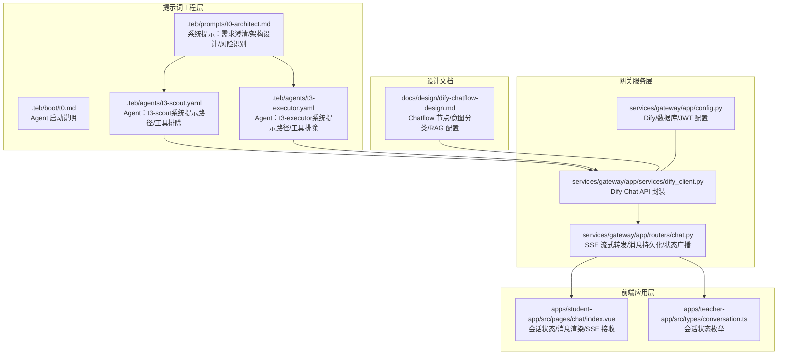
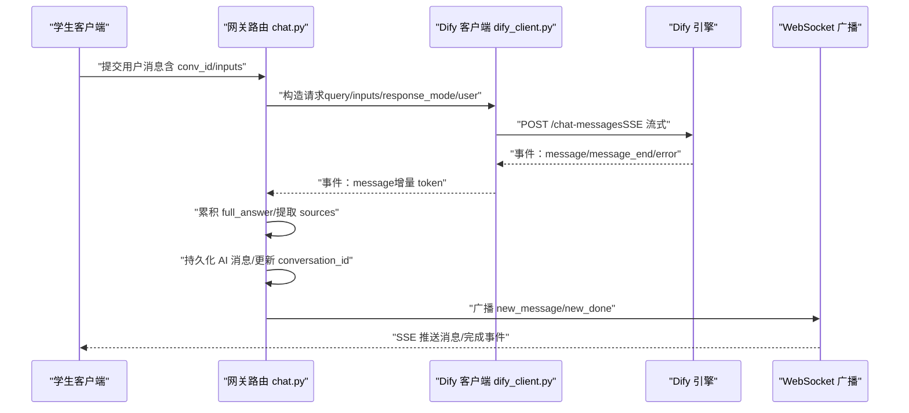
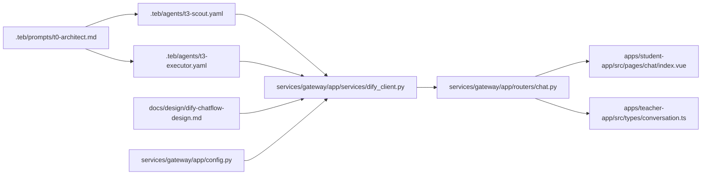

# 提示词工程

<cite>
**本文引用的文件**
- [.teb/antipatterns.md](file://.teb/antipatterns.md)
- [.teb/boot/t0.md](file://.teb/boot/t0.md)
- [.teb/prompts/t0-architect.md](file://.teb/prompts/t0-architect.md)
- [.teb/agents/t3-scout.yaml](file://.teb/agents/t3-scout.yaml)
- [.teb/agents/t3-executor.yaml](file://.teb/agents/t3-executor.yaml)
- [README.md](file://README.md)
- [services/gateway/app/config.py](file://services/gateway/app/config.py)
- [services/gateway/app/services/dify_client.py](file://services/gateway/app/services/dify_client.py)
- [services/gateway/app/routers/chat.py](file://services/gateway/app/routers/chat.py)
- [docs/design/dify-chatflow-design.md](file://docs/design/dify-chatflow-design.md)
- [apps/student-app/src/pages/chat/index.vue](file://apps/student-app/src/pages/chat/index.vue)
- [apps/teacher-app/src/types/conversation.ts](file://apps/teacher-app/src/types/conversation.ts)
</cite>

## 目录
1. [引言](#引言)
2. [项目结构](#项目结构)
3. [核心组件](#核心组件)
4. [架构总览](#架构总览)
5. [详细组件分析](#详细组件分析)
6. [依赖分析](#依赖分析)
7. [性能考虑](#性能考虑)
8. [故障排查指南](#故障排查指南)
9. [结论](#结论)
10. [附录](#附录)

## 引言
本文件面向 TEA 框架下的提示词工程，系统阐述提示词的设计原则与最佳实践，覆盖系统提示、用户提示、工具提示等类型提示词的创建方法；详解提示词模板的结构与参数配置（变量占位符、条件逻辑、上下文管理）；提供抗模式识别与规避指南；并结合实际代码路径给出案例分析与性能优化建议。目标是帮助开发者在真实业务场景中构建稳定、可控、可演进的提示词体系。

## 项目结构
TEA 框架围绕“提示词工程”形成多层协作：顶层以 T0 架构师角色定义需求与边界，中间层以 Agent 配置绑定系统提示与工具限制，底层以网关服务对接 Dify 引擎并管理上下文与流式输出。前端应用负责会话状态与消息渲染，教师端负责状态展示与交互。

图表来源
- [.teb/prompts/t0-architect.md:1-81](file://.teb/prompts/t0-architect.md#L1-L81)
- [.teb/boot/t0.md:1-18](file://.teb/boot/t0.md#L1-L18)
- [.teb/agents/t3-scout.yaml:1-11](file://.teb/agents/t3-scout.yaml#L1-L11)
- [.teb/agents/t3-executor.yaml:1-9](file://.teb/agents/t3-executor.yaml#L1-L9)
- [services/gateway/app/routers/chat.py:125-190](file://services/gateway/app/routers/chat.py#L125-L190)
- [services/gateway/app/services/dify_client.py:1-104](file://services/gateway/app/services/dify_client.py#L1-L104)
- [services/gateway/app/config.py:1-30](file://services/gateway/app/config.py#L1-L30)
- [apps/student-app/src/pages/chat/index.vue:1-200](file://apps/student-app/src/pages/chat/index.vue#L1-L200)
- [apps/teacher-app/src/types/conversation.ts:1-17](file://apps/teacher-app/src/types/conversation.ts#L1-L17)
- [docs/design/dify-chatflow-design.md:1-146](file://docs/design/dify-chatflow-design.md#L1-L146)

章节来源
- [README.md:1-18](file://README.md#L1-L18)
- [.teb/prompts/t0-architect.md:1-81](file://.teb/prompts/t0-architect.md#L1-L81)
- [.teb/boot/t0.md:1-18](file://.teb/boot/t0.md#L1-L18)
- [.teb/agents/t3-scout.yaml:1-11](file://.teb/agents/t3-scout.yaml#L1-L11)
- [.teb/agents/t3-executor.yaml:1-9](file://.teb/agents/t3-executor.yaml#L1-L9)
- [services/gateway/app/routers/chat.py:125-190](file://services/gateway/app/routers/chat.py#L125-L190)
- [services/gateway/app/services/dify_client.py:1-104](file://services/gateway/app/services/dify_client.py#L1-L104)
- [services/gateway/app/config.py:1-30](file://services/gateway/app/config.py#L1-L30)
- [apps/student-app/src/pages/chat/index.vue:1-200](file://apps/student-app/src/pages/chat/index.vue#L1-L200)
- [apps/teacher-app/src/types/conversation.ts:1-17](file://apps/teacher-app/src/types/conversation.ts#L1-L17)
- [docs/design/dify-chatflow-design.md:1-146](file://docs/design/dify-chatflow-design.md#L1-L146)

## 核心组件
- 系统提示词（System Prompt）
  - 作用：定义角色边界、工作职责、输出格式与约束，确保 LLM 在既定框架内工作。
  - 示例：T0 架构师提示词明确了“不写代码、不改文件、不执行任务”的身份红线与工作规则；Agent 配置中的 system_prompt_path 指向具体系统提示文件。
  - 关键点：明确角色、职责、限制、输出规范；与工具链集成时需声明工具排除策略。

- 用户提示词（User Prompt）
  - 作用：承载用户输入与上下文，驱动下游意图分类、RAG 检索与回复生成。
  - 关键点：在网关层将用户 query 与 inputs（如学院信息）拼装为 Dify 请求负载；前端负责收集用户输入并触发会话。

- 工具提示词（Tool Prompt）
  - 作用：限定 Agent 可用工具集，避免越界操作；例如在 Agent 配置中显式排除文件写入与网络搜索工具。
  - 关键点：通过 exclude_tools 控制工具可用性，确保安全与一致性。

- 模板与参数
  - 变量占位符：在 Dify 检索输出节点中使用变量注入个性化信息（如学院名称、校区）。
  - 条件逻辑：根据会话状态（AI/教师服务、待处理、已解决、已关闭）动态插入 system 消息，引导用户行为。
  - 上下文管理：通过 conversation_id 与 inputs 传递上下文，保证跨轮次连贯性与个性化。

章节来源
- [.teb/prompts/t0-architect.md:1-81](file://.teb/prompts/t0-architect.md#L1-L81)
- [.teb/boot/t0.md:1-18](file://.teb/boot/t0.md#L1-L18)
- [.teb/agents/t3-scout.yaml:1-11](file://.teb/agents/t3-scout.yaml#L1-L11)
- [.teb/agents/t3-executor.yaml:1-9](file://.teb/agents/t3-executor.yaml#L1-L9)
- [services/gateway/app/services/dify_client.py:22-34](file://services/gateway/app/services/dify_client.py#L22-L34)
- [services/gateway/app/routers/chat.py:125-190](file://services/gateway/app/routers/chat.py#L125-L190)
- [apps/student-app/src/pages/chat/index.vue:307-435](file://apps/student-app/src/pages/chat/index.vue#L307-L435)
- [docs/design/dify-chatflow-design.md:60-72](file://docs/design/dify-chatflow-design.md#L60-L72)

## 架构总览
从用户输入到 AI 回复的完整链路如下：

图表来源
- [services/gateway/app/routers/chat.py:125-190](file://services/gateway/app/routers/chat.py#L125-L190)
- [services/gateway/app/services/dify_client.py:22-34](file://services/gateway/app/services/dify_client.py#L22-L34)
- [services/gateway/app/config.py:15-20](file://services/gateway/app/config.py#L15-L20)
- [apps/student-app/src/pages/chat/index.vue:424-435](file://apps/student-app/src/pages/chat/index.vue#L424-L435)

## 详细组件分析

### 系统提示词：T0 架构师
- 角色边界与职责
  - 明确“不写代码、不改文件、不执行任务”，仅进行需求澄清、架构设计、风险识别与 Bug 诊断。
  - 输出规范：需求 Spec（YAML）或 Bug 诊断报告（YAML）。
- 工作规则
  - 需求阶段：观察现有系统、复述目标、提出开放问题、标注地基模块与风险等级。
  - Bug 诊断阶段：复现、定位根因、评估影响范围并输出修复方向与回归测试建议。
- 最佳实践
  - 保持“先理解，后行动”的节奏，避免过早进入实现细节。
  - 使用结构化 YAML 输出，便于后续自动化处理与版本追踪。

章节来源
- [.teb/prompts/t0-architect.md:1-81](file://.teb/prompts/t0-architect.md#L1-L81)
- [.teb/boot/t0.md:1-18](file://.teb/boot/t0.md#L1-L18)

### Agent 系统提示与工具限制
- t3-scout
  - system_prompt_path 指向具体系统提示文件。
  - 显式排除文件写入与网络搜索工具，降低越界风险。
- t3-executor
  - system_prompt_path 指向具体系统提示文件。
  - 显式排除网络搜索工具，聚焦执行层面的安全控制。
- 最佳实践
  - 为不同 Agent 角色定制专属系统提示，明确权限与边界。
  - 通过 exclude_tools 严格限制工具集，避免意外副作用。

章节来源
- [.teb/agents/t3-scout.yaml:1-11](file://.teb/agents/t3-scout.yaml#L1-L11)
- [.teb/agents/t3-executor.yaml:1-9](file://.teb/agents/t3-executor.yaml#L1-L9)

### Dify Chatflow 与提示词模板
- Chatflow 节点与意图分类
  - 意图分类器：闲聊、greeting、出发点、意义点、kb_query、投诉点、transfer。
  - RAG 检索：global-kb 数据集，语义检索 + 重排，Top K=3。
- 提示词模板与变量注入
  - 在知识检索输出节点中注入个性化变量（如学院名称、校区），实现“优先引用与该学生学院直接相关的内容”的策略。
- 最佳实践
  - 将个性化信息作为 inputs 注入 Dify，避免在提示词中硬编码。
  - 结合 Chatflow 分支与 RAG 输出节点，实现“意图识别 + 知识检索 + 个性化回答”的闭环。

章节来源
- [docs/design/dify-chatflow-design.md:10-72](file://docs/design/dify-chatflow-design.md#L10-L72)

### 网关服务：提示词与上下文的落地
- 流式转发与事件处理
  - 解析 Dify SSE 事件，累积增量 token，提取检索来源（sources）。
  - 在 message_end 事件后进行消息持久化、conversation_id 更新与 WebSocket 广播。
- 配置与密钥
  - 通过配置类集中管理 Dify API 地址、API Key、数据集 ID 等，确保部署一致性。
- 最佳实践
  - 将用户上下文（inputs）与 query 一起传入 Dify，提升检索与回答质量。
  - 在 message_end 之后再广播，确保前端一次性接收完整内容与来源信息。

章节来源
- [services/gateway/app/routers/chat.py:125-190](file://services/gateway/app/routers/chat.py#L125-L190)
- [services/gateway/app/services/dify_client.py:22-34](file://services/gateway/app/services/dify_client.py#L22-L34)
- [services/gateway/app/config.py:15-20](file://services/gateway/app/config.py#L15-L20)

### 前端会话：状态驱动的消息呈现
- 会话状态与 system 消息
  - 根据会话状态（AI 服务中、待处理、处理中、已解决、已关闭）动态插入 system 消息，引导用户下一步操作。
- 流式渲染与来源引用
  - 支持 Markdown 渲染、打字动画、流式光标与来源引用卡片。
- 最佳实践
  - 将状态变化与 system 消息联动，减少用户困惑。
  - 在拒绝回答场景提供“转人工”入口，提升用户体验。

章节来源
- [apps/student-app/src/pages/chat/index.vue:307-435](file://apps/student-app/src/pages/chat/index.vue#L307-L435)

### 教师端状态：会话状态枚举与展示
- 会话状态枚举
  - ai_serving、pending_teacher、teacher_serving、resolved、closed。
- 最佳实践
  - 与前端保持一致的状态定义，确保跨端一致性。
  - 在工作台中直观展示待处理数量与状态分布，辅助运营决策。

章节来源
- [apps/teacher-app/src/types/conversation.ts:1-17](file://apps/teacher-app/src/types/conversation.ts#L1-L17)

## 依赖分析
提示词工程的依赖关系体现在“角色定义 → Agent 配置 → Dify Chatflow → 网关服务 → 前端渲染”的链路上，各层之间通过明确的接口与约定耦合。

图表来源
- [.teb/prompts/t0-architect.md:1-81](file://.teb/prompts/t0-architect.md#L1-L81)
- [.teb/agents/t3-scout.yaml:1-11](file://.teb/agents/t3-scout.yaml#L1-L11)
- [.teb/agents/t3-executor.yaml:1-9](file://.teb/agents/t3-executor.yaml#L1-L9)
- [services/gateway/app/services/dify_client.py:1-104](file://services/gateway/app/services/dify_client.py#L1-L104)
- [services/gateway/app/routers/chat.py:125-190](file://services/gateway/app/routers/chat.py#L125-L190)
- [apps/student-app/src/pages/chat/index.vue:1-200](file://apps/student-app/src/pages/chat/index.vue#L1-L200)
- [apps/teacher-app/src/types/conversation.ts:1-17](file://apps/teacher-app/src/types/conversation.ts#L1-L17)
- [docs/design/dify-chatflow-design.md:1-146](file://docs/design/dify-chatflow-design.md#L1-L146)
- [services/gateway/app/config.py:1-30](file://services/gateway/app/config.py#L1-L30)

## 性能考虑
- 流式传输与延迟
  - 使用 SSE 流式事件逐步推送增量 token，前端即时渲染，降低首屏等待时间。
- 检索效率
  - RAG Top K 与重排策略在准确性与性能间平衡；合理设置阈值与上下文长度，避免过度检索。
- 上下文管理
  - 将个性化信息通过 inputs 注入，减少提示词冗余；在首次对话时同步 conversation_id，避免重复初始化。
- 前端渲染
  - 对长内容采用分页/懒加载与 Markdown 渲染优化，减少 DOM 压力。

## 故障排查指南
- 常见问题与定位
  - AI 服务不可用：检查 Dify API Key、API 地址与数据集配置是否正确。
  - 会话无响应：确认前端是否正确订阅 SSE 事件，网关是否正常转发 message_end/done。
  - 来源缺失：核对 message_end 事件是否在持久化与广播之前触发，确保 sources 字段完整。
- 抗模式识别
  - 在提示词中硬编码敏感信息（如密钥、路径），应改为通过配置与工具注入。
  - 未声明工具排除导致 Agent 越界操作，应在 Agent 配置中显式排除。
  - 缺少结构化输出规范，导致下游解析困难，应采用 YAML/JSON 约束。

章节来源
- [.teb/antipatterns.md:1-25](file://.teb/antipatterns.md#L1-L25)
- [services/gateway/app/config.py:15-20](file://services/gateway/app/config.py#L15-L20)
- [services/gateway/app/routers/chat.py:145-153](file://services/gateway/app/routers/chat.py#L145-L153)

## 结论
TEA 框架的提示词工程以“角色边界 + 结构化输出 + 工具限制 + 上下文注入”为核心，结合 Dify Chatflow 的意图识别与 RAG 检索，形成从需求到实现的闭环。通过系统化的提示词设计与严格的抗模式治理，可在复杂业务场景中保持稳定性与可演进性。

## 附录
- 实战建议
  - 为每个 Agent 角色编写独立系统提示文件，并在 Agent 配置中声明其路径与工具排除项。
  - 将个性化信息统一通过 inputs 注入 Dify，避免在提示词中硬编码。
  - 在网关层集中处理 Dify 事件与消息持久化，前端专注渲染与交互。
  - 建立提示词变更的评审与回归测试机制，确保线上稳定性。