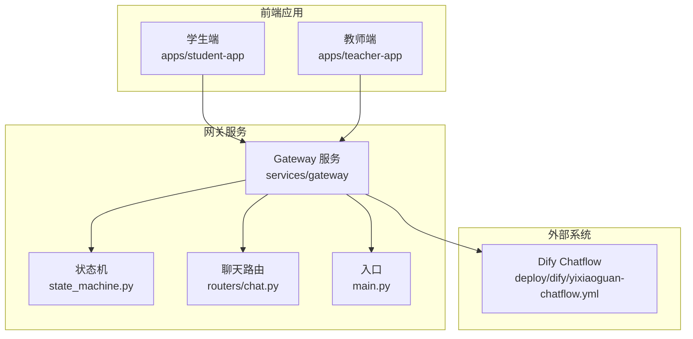
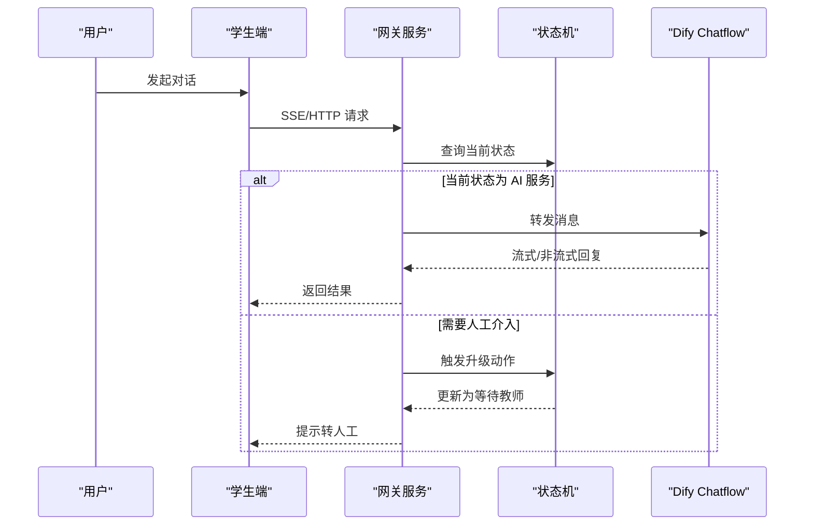
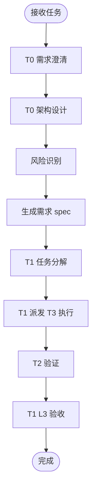
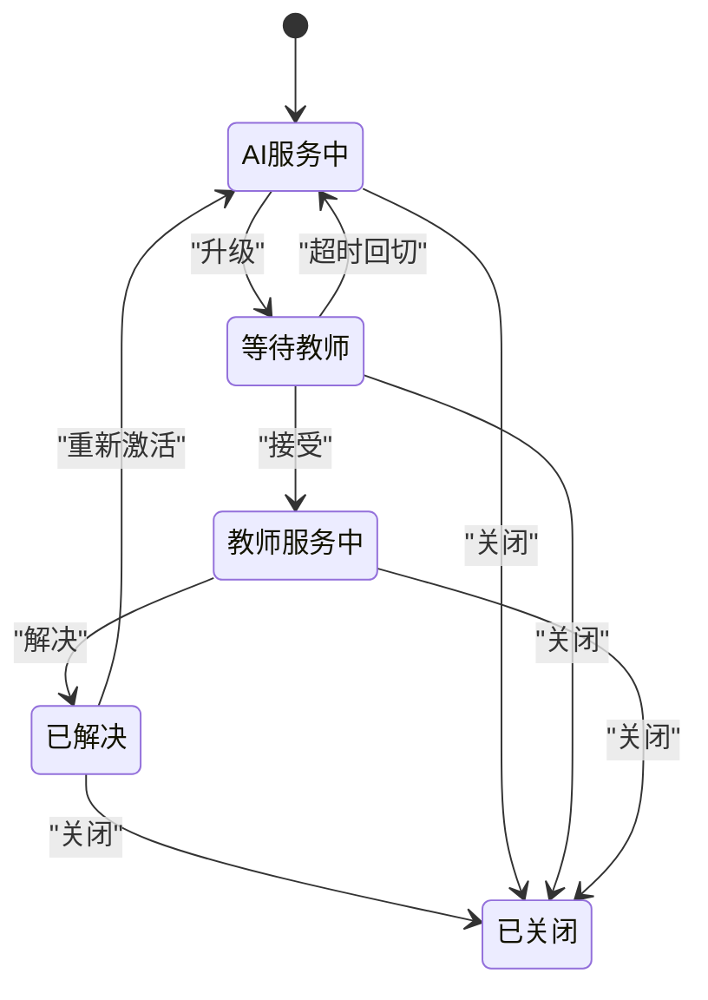
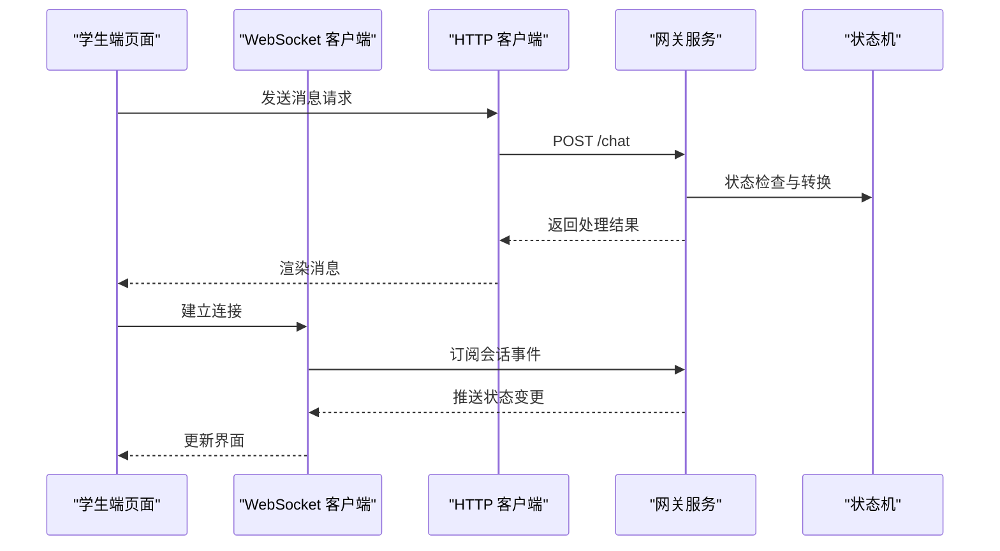
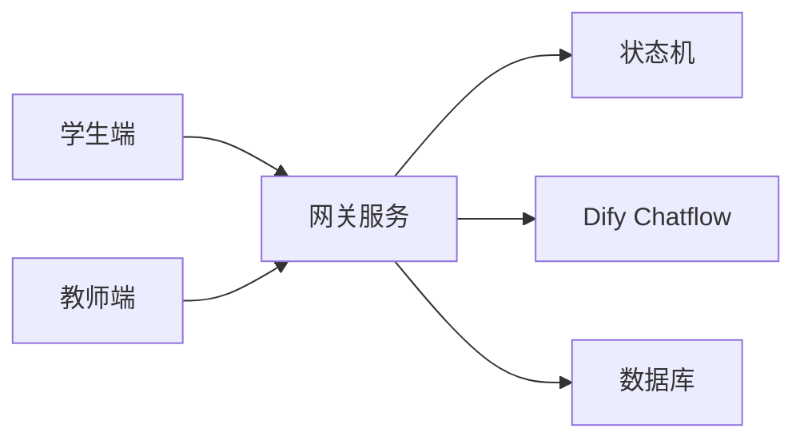
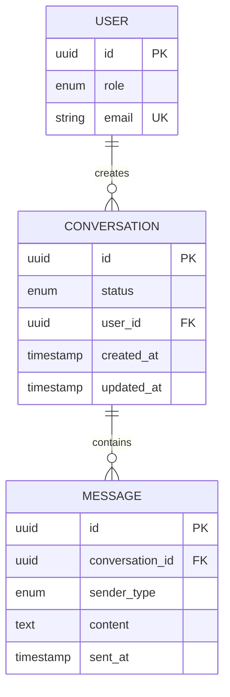

# 智能体设计

<cite>
**本文引用的文件**
- [.teb/antipatterns.md](file://.teb/antipatterns.md)
- [.teb/boot/t0.md](file://.teb/boot/t0.md)
- [.teb/boot/t1.md](file://.teb/boot/t1.md)
- [.teb/boot/t3-scout.md](file://.teb/boot/t3-scout.md)
- [.teb/prompts/t0-architect.md](file://.teb/prompts/t0-architect.md)
- [services/gateway/app/services/state_machine.py](file://services/gateway/app/services/state_machine.py)
- [services/gateway/app/models/conversation.py](file://services/gateway/app/models/conversation.py)
- [services/gateway/app/routers/chat.py](file://services/gateway/app/routers/chat.py)
- [services/gateway/app/main.py](file://services/gateway/app/main.py)
- [apps/student-app/src/pages/chat/index.vue](file://apps/student-app/src/pages/chat/index.vue)
- [apps/teacher-app/src/pages/dashboard/index.vue](file://apps/teacher-app/src/pages/dashboard/index.vue)
- [apps/teacher-app/src/pages/questions/index.vue](file://apps/teacher-app/src/pages/questions/index.vue)
- [apps/teacher-app/src/pages/knowledge/index.vue](file://apps/teacher-app/src/pages/knowledge/index.vue)
- [apps/teacher-app/src/stores/user.ts](file://apps/teacher-app/src/stores/user.ts)
- [apps/teacher-app/src/utils/websocket.ts](file://apps/teacher-app/src/utils/websocket.ts)
- [apps/teacher-app/src/types/conversation.ts](file://apps/teacher-app/src/types/conversation.ts)
- [apps/student-app/src/types/chat.ts](file://apps/student-app/src/types/chat.ts)
- [apps/student-app/src/utils/sse.ts](file://apps/student-app/src/utils/sse.ts)
- [apps/student-app/src/utils/request.ts](file://apps/student-app/src/utils/request.ts)
- [apps/teacher-app/src/utils/request.ts](file://apps/teacher-app/src/utils/request.ts)
- [deploy/dify/yixiaoguan-chatflow.yml](file://deploy/dify/yixiaoguan-chatflow.yml)
- [deploy/docker-compose.yml](file://deploy/docker-compose.yml)
- [scripts/migrate_kb.py](file://scripts/migrate_kb.py)
- [scripts/seed.py](file://scripts/seed.py)
- [README.md](file://README.md)
</cite>

## 目录
1. [引言](#引言)
2. [项目结构](#项目结构)
3. [核心组件](#核心组件)
4. [架构总览](#架构总览)
5. [详细组件分析](#详细组件分析)
6. [依赖分析](#依赖分析)
7. [性能考虑](#性能考虑)
8. [故障排查指南](#故障排查指南)
9. [结论](#结论)
10. [附录](#附录)

## 引言
本文件面向 TEA 框架下的智能体设计与实现，围绕“智能体类型、行为模式、决策机制”展开，结合仓库中的 TEB 协作体系（T0 架构师、T1 协调者、T3 侦察员）与网关服务的状态机设计，系统阐述智能体的配置方法、定制选项、交互协议、错误处理、性能优化与可扩展性，并提供开发最佳实践与调试指南。

## 项目结构
TEA 框架以“前端应用 + 网关服务 + 部署与脚本”为核心组织方式：
- 前端应用：学生端与教师端，分别承载对话、问答、知识库与仪表盘等页面，使用 TypeScript/Vue 生态与状态管理。
- 网关服务：基于 Python/Starlette/FastAPI，提供认证、会话、聊天路由与 WebSocket 管理，集成 Dify 接入。
- 部署与脚本：Docker Compose 编排、知识库迁移与种子数据脚本。

图表来源
- [services/gateway/app/main.py](file://services/gateway/app/main.py)
- [services/gateway/app/routers/chat.py](file://services/gateway/app/routers/chat.py)
- [services/gateway/app/services/state_machine.py](file://services/gateway/app/services/state_machine.py)
- [deploy/dify/yixiaoguan-chatflow.yml](file://deploy/dify/yixiaoguan-chatflow.yml)

章节来源
- [README.md](file://README.md)
- [deploy/docker-compose.yml](file://deploy/docker-compose.yml)

## 核心组件
- TEB 协作体系（智能体角色）
  - T0 架构师：需求澄清、架构设计、风险识别、Bug 诊断，输出需求 spec 或诊断报告。
  - T1 协调者：将需求分解为任务树、编排批量任务、防停滞与 L3 验收。
  - T3 侦察员：只读采集信息，输出结构化摘要，不参与决策。
- 网关服务状态机（智能体决策机制）
  - 定义对话状态与合法转换，支持从 AI 服务到教师服务的升级、接受、超时回切、解决与关闭等动作。
- 前端智能体交互
  - 学生端：SSE 流式响应、请求封装、页面聊天与历史记录。
  - 教师端：WebSocket 连接、仪表盘、问题列表、知识库浏览与用户状态管理。

章节来源
- [.teb/boot/t0.md](file://.teb/boot/t0.md)
- [.teb/boot/t1.md](file://.teb/boot/t1.md)
- [.teb/boot/t3-scout.md](file://.teb/boot/t3-scout.md)
- [.teb/prompts/t0-architect.md](file://.teb/prompts/t0-architect.md)
- [services/gateway/app/services/state_machine.py](file://services/gateway/app/services/state_machine.py)
- [apps/student-app/src/utils/sse.ts](file://apps/student-app/src/utils/sse.ts)
- [apps/teacher-app/src/utils/websocket.ts](file://apps/teacher-app/src/utils/websocket.ts)

## 架构总览
TEA 智能体在系统中承担“需求理解—任务分解—信息采集—决策执行”的职责链路。前端通过标准协议与网关交互，网关依据状态机进行服务路由与升级，最终对接 Dify Chatflow 实现智能回答与知识检索。

图表来源
- [services/gateway/app/routers/chat.py](file://services/gateway/app/routers/chat.py)
- [services/gateway/app/services/state_machine.py](file://services/gateway/app/services/state_machine.py)
- [deploy/dify/yixiaoguan-chatflow.yml](file://deploy/dify/yixiaoguan-chatflow.yml)

## 详细组件分析

### TEB 智能体角色与工作流
- T0 架构师
  - 职责：需求澄清、架构设计、风险识别、Bug 诊断。
  - 输出：需求 spec（YAML）或 Bug 诊断报告。
- T1 协调者
  - 职责：任务分解、批处理编排、防停滞、L3 验收。
  - 下发链：T1 → T3（执行）→ T2 Reviewer（验证）→ T1（验收）。
- T3 侦察员
  - 职责：只读采集、结构化摘要、不确定性标注。

图表来源
- [.teb/prompts/t0-architect.md](file://.teb/prompts/t0-architect.md)
- [.teb/boot/t1.md](file://.teb/boot/t1.md)
- [.teb/boot/t3-scout.md](file://.teb/boot/t3-scout.md)

章节来源
- [.teb/boot/t0.md](file://.teb/boot/t0.md)
- [.teb/boot/t1.md](file://.teb/boot/t1.md)
- [.teb/boot/t3-scout.md](file://.teb/boot/t3-scout.md)
- [.teb/prompts/t0-architect.md](file://.teb/prompts/t0-architect.md)

### 网关服务状态机（智能体决策机制）
- 状态定义：AI 服务中、等待教师、教师服务中、已解决、已关闭等。
- 合法转换：升级、接受、超时回切、解决、重新激活、关闭等。
- 错误处理：非法状态转换抛出异常，避免无效状态流转。

图表来源
- [services/gateway/app/services/state_machine.py](file://services/gateway/app/services/state_machine.py)

章节来源
- [services/gateway/app/services/state_machine.py](file://services/gateway/app/services/state_machine.py)

### 前端智能体交互协议
- 学生端
  - SSE 流式响应：用于实时接收模型回复片段。
  - 请求封装：统一的 HTTP 客户端，便于切换环境与鉴权。
  - 页面与状态：聊天页、历史页、类型定义与工具函数。
- 教师端
  - WebSocket：长连接用于实时消息与状态推送。
  - 仪表盘与问题列表：展示会话状态与待处理项。
  - 知识库浏览：查看与管理知识条目。
  - 用户状态管理：登录、权限与角色信息。

图表来源
- [apps/student-app/src/utils/sse.ts](file://apps/student-app/src/utils/sse.ts)
- [apps/student-app/src/utils/request.ts](file://apps/student-app/src/utils/request.ts)
- [apps/teacher-app/src/utils/websocket.ts](file://apps/teacher-app/src/utils/websocket.ts)
- [apps/teacher-app/src/stores/user.ts](file://apps/teacher-app/src/stores/user.ts)
- [services/gateway/app/routers/chat.py](file://services/gateway/app/routers/chat.py)
- [services/gateway/app/services/state_machine.py](file://services/gateway/app/services/state_machine.py)

章节来源
- [apps/student-app/src/pages/chat/index.vue](file://apps/student-app/src/pages/chat/index.vue)
- [apps/teacher-app/src/pages/dashboard/index.vue](file://apps/teacher-app/src/pages/dashboard/index.vue)
- [apps/teacher-app/src/pages/questions/index.vue](file://apps/teacher-app/src/pages/questions/index.vue)
- [apps/teacher-app/src/pages/knowledge/index.vue](file://apps/teacher-app/src/pages/knowledge/index.vue)
- [apps/teacher-app/src/stores/user.ts](file://apps/teacher-app/src/stores/user.ts)
- [apps/teacher-app/src/utils/websocket.ts](file://apps/teacher-app/src/utils/websocket.ts)
- [apps/teacher-app/src/types/conversation.ts](file://apps/teacher-app/src/types/conversation.ts)
- [apps/student-app/src/types/chat.ts](file://apps/student-app/src/types/chat.ts)
- [apps/student-app/src/utils/sse.ts](file://apps/student-app/src/utils/sse.ts)
- [apps/student-app/src/utils/request.ts](file://apps/student-app/src/utils/request.ts)
- [apps/teacher-app/src/utils/request.ts](file://apps/teacher-app/src/utils/request.ts)

### 配置方法与定制选项
- 网关服务
  - 状态机配置：通过状态与动作映射控制智能体行为路径。
  - 路由与协议：聊天路由定义消息入口，支持 SSE/HTTP。
  - Dify 集成：通过部署配置指向 Chatflow，实现智能回答与知识检索。
- 前端
  - 环境变量与请求封装：便于切换不同网关地址与鉴权方式。
  - 类型定义：约束消息、会话与用户状态，提升可维护性。
  - WebSocket 与 SSE：按需选择实时通信协议。

章节来源
- [services/gateway/app/routers/chat.py](file://services/gateway/app/routers/chat.py)
- [services/gateway/app/main.py](file://services/gateway/app/main.py)
- [deploy/dify/yixiaoguan-chatflow.yml](file://deploy/dify/yixiaoguan-chatflow.yml)
- [apps/student-app/src/utils/request.ts](file://apps/student-app/src/utils/request.ts)
- [apps/teacher-app/src/utils/request.ts](file://apps/teacher-app/src/utils/request.ts)
- [apps/teacher-app/src/utils/websocket.ts](file://apps/teacher-app/src/utils/websocket.ts)
- [apps/student-app/src/utils/sse.ts](file://apps/student-app/src/utils/sse.ts)

### 开发最佳实践与设计模式
- 错误处理
  - 状态机：非法状态转换抛出异常，避免进入不可预期状态。
  - 前端：SSE/HTTP 统一错误捕获与重试策略，WebSocket 断线重连。
- 性能优化
  - SSE 流式传输减少首字节延迟；WebSocket 用于高频状态推送。
  - 网关路由按需分流，避免不必要的计算与网络往返。
- 可扩展性
  - 状态机以映射表扩展新状态与动作，降低耦合。
  - 前端类型与工具函数模块化，便于替换与扩展。
- TEB 协同
  - T0 明确边界与风险；T1 任务粒度控制在 3-5 个文件内；T3 只读采集，避免越权修改。

章节来源
- [services/gateway/app/services/state_machine.py](file://services/gateway/app/services/state_machine.py)
- [.teb/antipatterns.md](file://.teb/antipatterns.md)
- [.teb/boot/t1.md](file://.teb/boot/t1.md)
- [.teb/boot/t3-scout.md](file://.teb/boot/t3-scout.md)

## 依赖分析
- 组件耦合
  - 前端依赖网关服务提供的聊天与会话接口；网关依赖状态机与 Dify Chatflow。
  - 教师端依赖用户状态与 WebSocket；学生端依赖 SSE 与 HTTP。
- 外部依赖
  - Dify Chatflow：作为智能回答与知识检索的后端能力。
  - Docker Compose：统一编排前后端与数据库。

图表来源
- [services/gateway/app/main.py](file://services/gateway/app/main.py)
- [services/gateway/app/services/state_machine.py](file://services/gateway/app/services/state_machine.py)
- [deploy/docker-compose.yml](file://deploy/docker-compose.yml)
- [deploy/dify/yixiaoguan-chatflow.yml](file://deploy/dify/yixiaoguan-chatflow.yml)

章节来源
- [deploy/docker-compose.yml](file://deploy/docker-compose.yml)
- [deploy/dify/yixiaoguan-chatflow.yml](file://deploy/dify/yixiaoguan-chatflow.yml)

## 性能考虑
- 通信协议选择
  - SSE：适合长文本流式输出，降低延迟与带宽占用。
  - WebSocket：适合频繁状态更新与双向交互。
- 状态机优化
  - 将状态转换映射集中管理，便于缓存与快速判定。
- 前端渲染
  - 消息分片渲染与虚拟滚动，避免大列表卡顿。
- 网关路由
  - 按会话维度缓存轻量元数据，减少重复查询。

## 故障排查指南
- 状态机异常
  - 现象：非法状态转换导致服务中断。
  - 处理：检查状态与动作映射，补充缺失转换；在异常处记录上下文并回滚。
- SSE/HTTP 错误
  - 现象：消息丢失或断流。
  - 处理：前端实现指数退避重试与断流恢复；后端检查上游服务可用性。
- WebSocket 断连
  - 现象：状态推送不及时。
  - 处理：实现自动重连与心跳检测；服务端清理僵尸连接。
- TEB 协同问题
  - 现象：任务越界或停滞。
  - 处理：T1 拆分任务、标注可并行组；T3 报告不确定性；T0 追加反模式。

章节来源
- [services/gateway/app/services/state_machine.py](file://services/gateway/app/services/state_machine.py)
- [.teb/antipatterns.md](file://.teb/antipatterns.md)
- [.teb/boot/t1.md](file://.teb/boot/t1.md)
- [.teb/boot/t3-scout.md](file://.teb/boot/t3-scout.md)

## 结论
TEA 框架通过 TEB 智能体角色与网关服务状态机，构建了“需求—任务—执行—验收”的闭环协作体系。前端采用 SSE/HTTP 与 WebSocket 实现多样化交互，后端以状态机驱动智能体决策，结合 Dify Chatflow 提供强大的智能回答与知识检索能力。遵循本文的配置方法、最佳实践与故障排查指南，可在保证稳定性的同时持续扩展智能体能力。

## 附录
- 数据模型（会话与消息）
  - 会话状态枚举：AI 服务中、等待教师、教师服务中、已解决、已关闭。
  - 发送方类型：AI、教师、学生。
- 脚本与迁移
  - 知识库迁移与种子数据脚本：用于初始化与验证数据一致性。

图表来源
- [services/gateway/app/models/conversation.py](file://services/gateway/app/models/conversation.py)

章节来源
- [services/gateway/app/models/conversation.py](file://services/gateway/app/models/conversation.py)
- [scripts/migrate_kb.py](file://scripts/migrate_kb.py)
- [scripts/seed.py](file://scripts/seed.py)