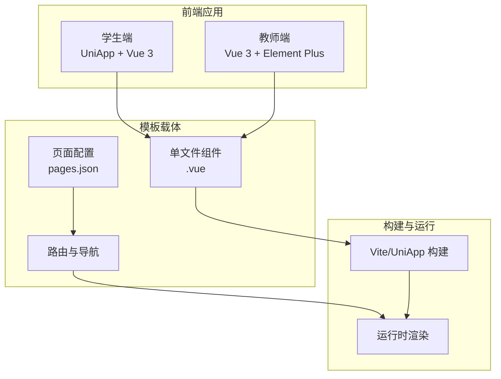
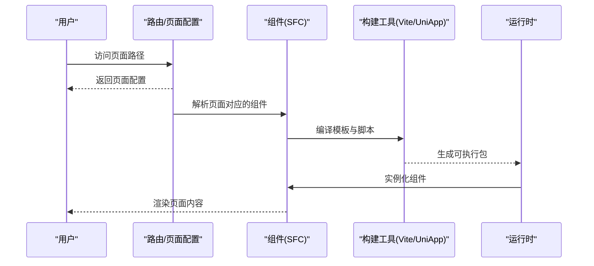
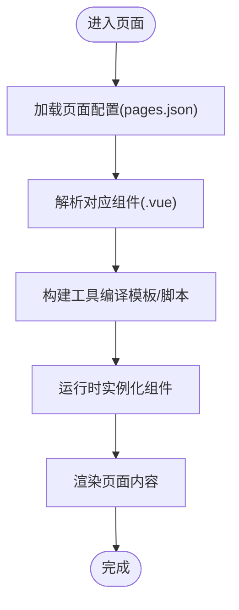
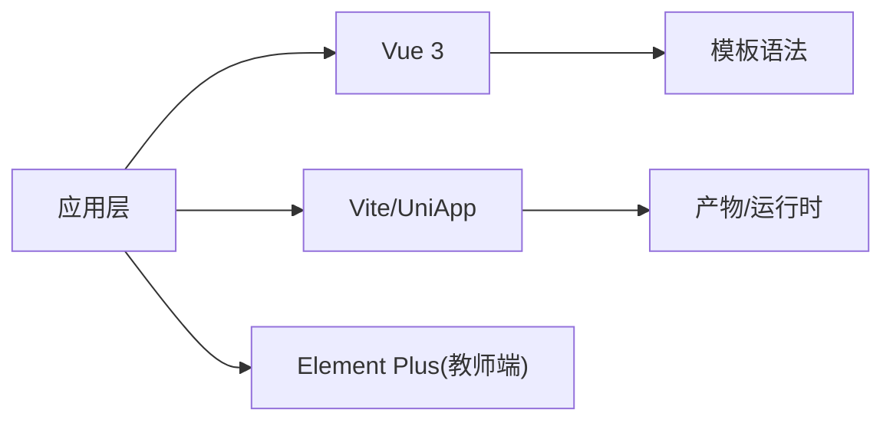

# 模板系统

<cite>
**本文引用的文件**
- [README.md](file://README.md)
- [antipatterns.md](file://.teb/antipatterns.md)
- [t0-architect.md](file://.teb/prompts/t0-architect.md)
- [t0.md](file://.teb/boot/t0.md)
- [package-lock.json（学生端）](file://apps/student-app/package-lock.json)
- [package-lock.json（教师端）](file://apps/teacher-app/package-lock.json)
</cite>

## 目录
1. [引言](#引言)
2. [项目结构](#项目结构)
3. [核心组件](#核心组件)
4. [架构总览](#架构总览)
5. [详细组件分析](#详细组件分析)
6. [依赖分析](#依赖分析)
7. [性能考虑](#性能考虑)
8. [故障排查指南](#故障排查指南)
9. [结论](#结论)
10. [附录](#附录)

## 引言
本文件围绕 TEA 框架模板系统进行系统性梳理与说明，目标是帮助开发者快速理解模板引擎的工作原理与使用方法，掌握变量替换、条件渲染、循环处理、模板继承等核心能力，并建立模板文件的组织结构与命名规范意识，明确模板加载与缓存机制，提供调试技巧与性能优化建议。  
在当前仓库中，模板系统并非以独立后端服务形式存在，而是通过前端框架（Vue 3）与构建工具链（Vite/UniApp）实现页面与组件级别的“模板”能力。因此，本文将从“前端模板视角”解释 TEA 框架下模板系统的典型实践与最佳实践。

## 项目结构
- 仓库采用多应用结构，包含学生端与教师端两个前端应用，分别基于 Vue 3 与 UniApp 技术栈。
- 模板系统在本项目中体现为：
  - 单文件组件（.vue 文件）作为“模板单元”，内含模板、脚本与样式。
  - 页面路由与页面 JSON 配置用于组织页面级模板布局。
  - 构建工具链（Vite/UniApp）负责模板编译、打包与运行时渲染。
- .teb 目录提供 TEA 四层协作体系的提示词与反模式清单，为模板设计与实现提供方法论支撑。

**图表来源**
- [README.md:1-18](file://README.md#L1-L18)
- [package-lock.json（学生端）:12843-12873](file://apps/student-app/package-lock.json#L12843-L12873)
- [package-lock.json（教师端）:6082-6116](file://apps/teacher-app/package-lock.json#L6082-L6116)

**章节来源**
- [README.md:1-18](file://README.md#L1-L18)

## 核心组件
- 单文件组件（SFC）
  - 模板语法：支持 Vue 3 模板语法，用于声明式渲染与交互逻辑。
  - 数据绑定：通过响应式数据驱动视图更新。
  - 组合式 API：通过 <script setup> 或组合式 API 组织逻辑。
- 页面配置（pages.json）
  - 定义页面路径、窗口样式、导航栏等页面级模板属性。
- 构建与运行
  - Vite/UniApp 负责编译模板、合并资源、注入运行时渲染逻辑。
  - 运行时根据路由与组件树完成页面渲染。

**章节来源**
- [README.md:9-10](file://README.md#L9-L10)

## 架构总览
下图展示了从页面请求到模板渲染的关键流程，强调模板系统在前端应用中的位置与职责边界。

**图表来源**
- [README.md:9-10](file://README.md#L9-L10)
- [package-lock.json（学生端）:12843-12873](file://apps/student-app/package-lock.json#L12843-L12873)
- [package-lock.json（教师端）:6082-6116](file://apps/teacher-app/package-lock.json#L6082-L6116)

## 详细组件分析

### 组件级模板（.vue）
- 结构组成
  - 模板区：声明式 HTML 结构与指令（如条件渲染、循环、事件绑定）。
  - 脚本区：使用组合式 API 或选项式 API 组织逻辑与状态。
  - 样式区：局部样式或全局样式，支持主题与变量。
- 典型能力
  - 变量替换：通过响应式数据在模板中展示动态内容。
  - 条件渲染：按条件显示/隐藏元素。
  - 循环处理：遍历列表渲染重复结构。
  - 插槽与组件通信：通过插槽与 props 实现模板复用与扩展。
- 设计模式
  - 页面模板：以页面为单位组织，配合 pages.json 定义入口与窗口样式。
  - 组件模板：以可复用组件为单位，通过 props 与事件实现解耦。
  - 主题模板：通过 SCSS 变量与主题文件集中管理样式规范。

**图表来源**
- [README.md:9-10](file://README.md#L9-L10)

**章节来源**
- [README.md:9-10](file://README.md#L9-L10)

### 页面级模板（pages.json）
- 作用
  - 定义页面路径、窗口样式（标题、导航栏、底部标签栏等）。
  - 控制页面生命周期与行为（如是否需要导航栏、是否 TabBar 页面等）。
- 规范
  - 页面路径与组件文件一一对应，遵循约定优于配置的原则。
  - 窗口样式统一管理，便于跨页面一致性与主题化。

**章节来源**
- [README.md:9-10](file://README.md#L9-L10)

### 模板加载与缓存机制
- 加载机制
  - 构建期：Vite/UniApp 将 .vue 文件解析为可执行模块，内联模板与脚本。
  - 运行期：路由触发时按需加载组件，组件实例化后渲染。
- 缓存策略
  - 浏览器缓存：静态资源（JS/CSS/图片）通过构建工具生成带哈希的文件名，利用浏览器缓存提升二次加载速度。
  - 组件缓存：Vue 运行时对已渲染组件进行缓存，减少重复渲染成本。
  - 页面缓存：路由守卫与 keep-alive 可控制页面级缓存策略。

**章节来源**
- [package-lock.json（学生端）:12843-12873](file://apps/student-app/package-lock.json#L12843-L12873)
- [package-lock.json（教师端）:6082-6116](file://apps/teacher-app/package-lock.json#L6082-L6116)

### 模板调试技巧
- 开发环境
  - 使用 Vue DevTools 检查组件树、状态与事件流。
  - 启用严格模式与 ESLint 规则，避免模板语法错误。
- 日志与断点
  - 在组件生命周期钩子中打印关键状态，定位渲染异常。
  - 使用浏览器开发者工具检查 DOM 与样式，验证模板渲染结果。
- 性能分析
  - 关注重渲染热点，使用 Vue 3 的响应式追踪与组件拆分降低不必要的更新。

**章节来源**
- [antipatterns.md:1-25](file://.teb/antipatterns.md#L1-L25)

### 模板设计模式与示例思路
- 页面模板模式
  - 通用页面骨架：统一头部、主体、底部结构，通过 props 注入内容。
  - 动态标题与导航：根据页面配置动态设置标题与导航按钮。
- 组件模板模式
  - 列表模板：统一列表项渲染，支持空状态与加载状态。
  - 表单模板：统一表单项与校验逻辑，通过插槽扩展自定义字段。
- 主题模板模式
  - SCSS 变量与 Mixin：集中管理颜色、字体、间距等设计令牌。
  - 暗色/亮色主题：通过主题切换变量实现一键切换。

**章节来源**
- [README.md:9-10](file://README.md#L9-L10)

## 依赖分析
- 前端依赖
  - Vue 3：提供模板语法与响应式系统。
  - Vite/UniApp：提供开发服务器、热更新与生产构建。
  - Element Plus（教师端）：提供 UI 组件库，辅助模板布局与交互。
- 依赖关系
  - 应用层依赖于框架与构建工具，组件层依赖于框架提供的模板能力。
  - 页面配置与组件通过路由连接，形成完整的页面渲染链路。

**图表来源**
- [README.md:9-10](file://README.md#L9-L10)
- [package-lock.json（学生端）:12843-12873](file://apps/student-app/package-lock.json#L12843-L12873)
- [package-lock.json（教师端）:6082-6116](file://apps/teacher-app/package-lock.json#L6082-L6116)

**章节来源**
- [README.md:9-10](file://README.md#L9-L10)
- [package-lock.json（学生端）:12843-12873](file://apps/student-app/package-lock.json#L12843-L12873)
- [package-lock.json（教师端）:6082-6116](file://apps/teacher-app/package-lock.json#L6082-L6116)

## 性能考虑
- 模板层面
  - 避免在模板中进行复杂计算，将计算逻辑前置到数据准备阶段。
  - 使用 v-memo（Vue 3.2+）对昂贵的子树进行记忆化。
  - 合理拆分组件，减少不必要的整体重渲染。
- 构建与缓存
  - 利用构建工具的代码分割与懒加载，按需加载页面与组件。
  - 通过静态资源指纹与长缓存策略提升二次加载性能。
- 运行时
  - 使用 keep-alive 缓存页面状态，减少重复初始化成本。
  - 控制事件监听数量，避免内存泄漏与性能抖动。

**章节来源**
- [antipatterns.md:1-25](file://.teb/antipatterns.md#L1-L25)

## 故障排查指南
- 常见问题
  - 模板语法错误：检查指令拼写与表达式合法性。
  - 数据未更新：确认响应式数据变更方式与作用域。
  - 组件未渲染：检查路由配置与组件导出。
- 方法论参考
  - 使用 TEA 提示词与反模式清单，避免“顺手重构不相关代码”等反模式。
  - 通过日志与断点定位根因，必要时回退并重新验证。

**章节来源**
- [antipatterns.md:1-25](file://.teb/antipatterns.md#L1-L25)
- [t0-architect.md:1-31](file://.teb/prompts/t0-architect.md#L1-L31)
- [t0.md:1-18](file://.teb/boot/t0.md#L1-L18)

## 结论
在 TEA 框架下，模板系统以 Vue 3 的单文件组件为核心载体，结合页面配置与构建工具链实现高效、可维护的页面与组件模板。通过统一的设计模式、严格的调试流程与性能优化策略，可以显著提升模板质量与用户体验。建议在实际开发中遵循约定优于配置的原则，将页面与组件模板标准化，持续沉淀模板库与最佳实践。

## 附录
- TEA 提示词与反模式
  - 在任务开始前阅读反模式清单，避免常见陷阱。
  - 使用 T0 提示词进行需求澄清与架构设计，确保模板设计与业务目标一致。

**章节来源**
- [antipatterns.md:1-25](file://.teb/antipatterns.md#L1-L25)
- [t0-architect.md:1-31](file://.teb/prompts/t0-architect.md#L1-L31)
- [t0.md:1-18](file://.teb/boot/t0.md#L1-L18)