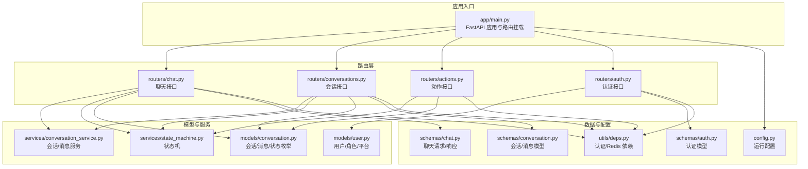
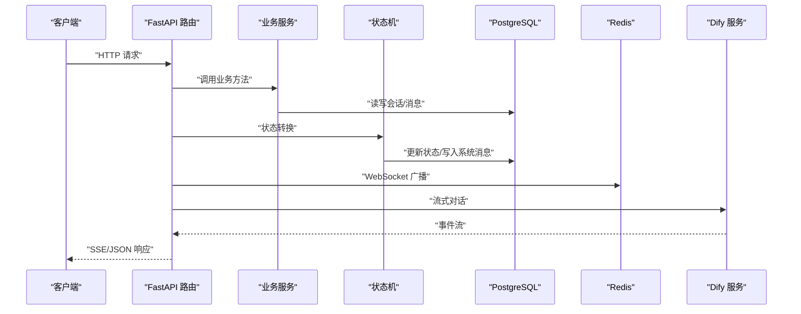
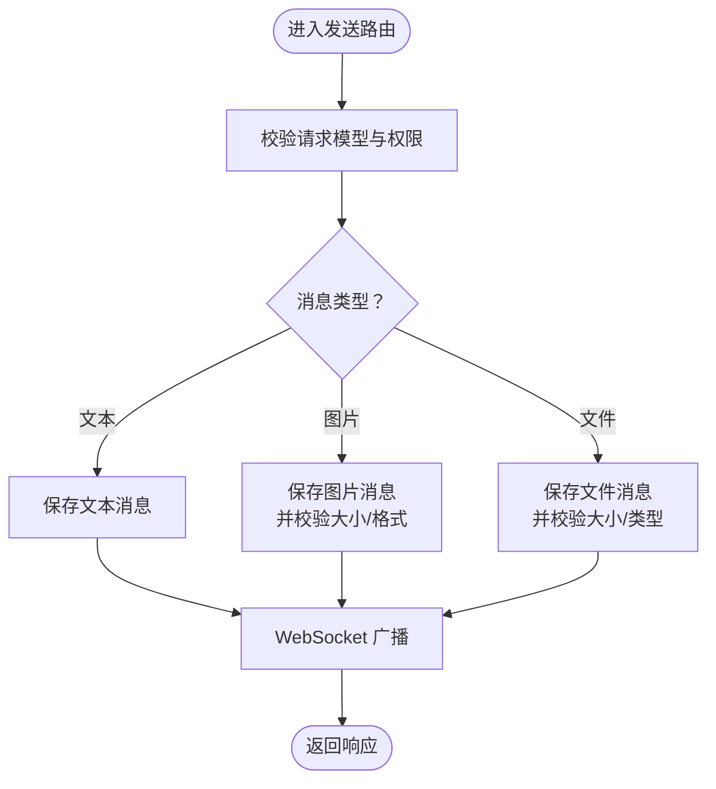
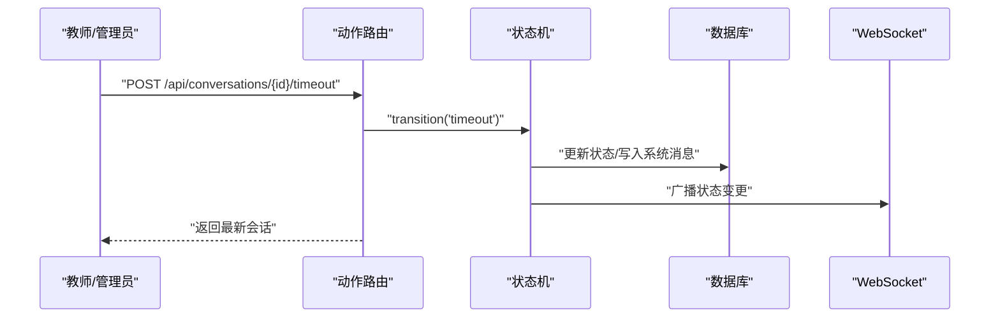
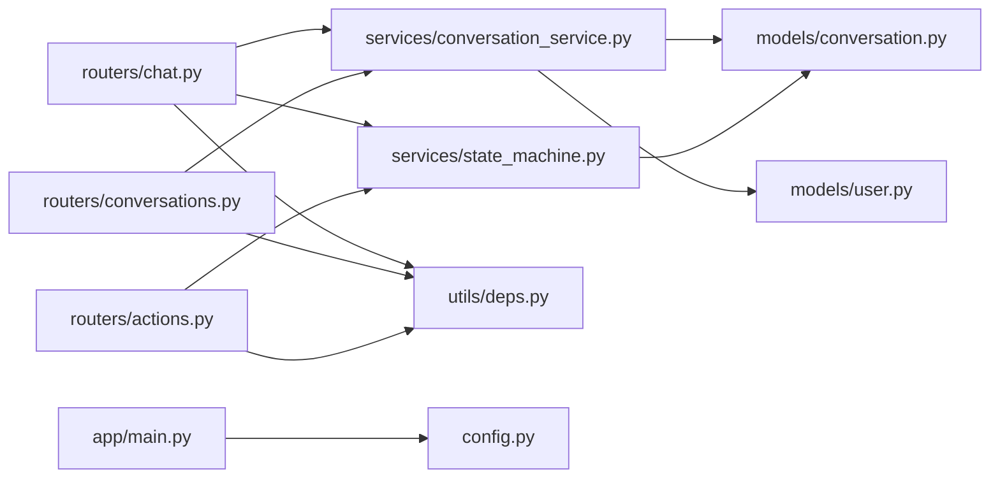

# API 接口扩展

<cite>
**本文档引用的文件**
- [services/gateway/app/main.py](file://services/gateway/app/main.py)
- [services/gateway/app/routers/chat.py](file://services/gateway/app/routers/chat.py)
- [services/gateway/app/routers/conversations.py](file://services/gateway/app/routers/conversations.py)
- [services/gateway/app/routers/actions.py](file://services/gateway/app/routers/actions.py)
- [services/gateway/app/routers/auth.py](file://services/gateway/app/routers/auth.py)
- [services/gateway/app/schemas/chat.py](file://services/gateway/app/schemas/chat.py)
- [services/gateway/app/schemas/conversation.py](file://services/gateway/app/schemas/conversation.py)
- [services/gateway/app/schemas/auth.py](file://services/gateway/app/schemas/auth.py)
- [services/gateway/app/models/conversation.py](file://services/gateway/app/models/conversation.py)
- [services/gateway/app/models/user.py](file://services/gateway/app/models/user.py)
- [services/gateway/app/services/state_machine.py](file://services/gateway/app/services/state_machine.py)
- [services/gateway/app/services/conversation_service.py](file://services/gateway/app/services/conversation_service.py)
- [services/gateway/app/utils/deps.py](file://services/gateway/app/utils/deps.py)
- [services/gateway/app/config.py](file://services/gateway/app/config.py)
- [apps/student-app/src/api/chat.ts](file://apps/student-app/src/api/chat.ts)
- [apps/teacher-app/src/api/conversations.ts](file://apps/teacher-app/src/api/conversations.ts)
- [apps/teacher-app/src/types/conversation.ts](file://apps/teacher-app/src/types/conversation.ts)
</cite>

## 目录
1. [简介](#简介)
2. [项目结构](#项目结构)
3. [核心组件](#核心组件)
4. [架构总览](#架构总览)
5. [详细组件分析](#详细组件分析)
6. [依赖分析](#依赖分析)
7. [性能考虑](#性能考虑)
8. [故障排查指南](#故障排查指南)
9. [结论](#结论)
10. [附录](#附录)

## 简介
本文件面向在 FastAPI 框架上扩展 API 的开发者，系统性讲解如何在现有网关服务中添加新的 RESTful 端点，涵盖请求参数验证、响应数据结构设计、错误处理机制、状态机驱动的会话流转、WebSocket 广播、认证与授权、以及版本化与文档自动生成的最佳实践。文档以实际源码为依据，提供可复用的扩展模板与流程图，帮助你快速、安全地迭代聊天、动作与会话相关功能。

## 项目结构
后端采用分层架构：入口应用负责生命周期与路由挂载；routers 定义 API 路由与权限控制；schemas 定义请求/响应模型；models 定义数据库实体与枚举；services 实现业务逻辑与状态机；utils 提供依赖注入与认证工具；config 统一配置。

图表来源
- [services/gateway/app/main.py:1-78](file://services/gateway/app/main.py#L1-L78)
- [services/gateway/app/routers/chat.py:1-191](file://services/gateway/app/routers/chat.py#L1-L191)
- [services/gateway/app/routers/conversations.py:1-129](file://services/gateway/app/routers/conversations.py#L1-L129)
- [services/gateway/app/routers/actions.py:1-154](file://services/gateway/app/routers/actions.py#L1-L154)
- [services/gateway/app/routers/auth.py:1-35](file://services/gateway/app/routers/auth.py#L1-L35)
- [services/gateway/app/schemas/chat.py:1-18](file://services/gateway/app/schemas/chat.py#L1-L18)
- [services/gateway/app/schemas/conversation.py:1-50](file://services/gateway/app/schemas/conversation.py#L1-L50)
- [services/gateway/app/schemas/auth.py:1-23](file://services/gateway/app/schemas/auth.py#L1-L23)
- [services/gateway/app/models/conversation.py:1-63](file://services/gateway/app/models/conversation.py#L1-L63)
- [services/gateway/app/models/user.py:1-76](file://services/gateway/app/models/user.py#L1-L76)
- [services/gateway/app/services/state_machine.py:1-96](file://services/gateway/app/services/state_machine.py#L1-L96)
- [services/gateway/app/services/conversation_service.py:1-179](file://services/gateway/app/services/conversation_service.py#L1-L179)
- [services/gateway/app/utils/deps.py:1-40](file://services/gateway/app/utils/deps.py#L1-L40)
- [services/gateway/app/config.py:1-31](file://services/gateway/app/config.py#L1-L31)

章节来源
- [services/gateway/app/main.py:1-78](file://services/gateway/app/main.py#L1-L78)

## 核心组件
- 应用入口与路由挂载：统一创建 FastAPI 实例，注册健康检查、认证、会话、动作、聊天、WebSocket 路由，并通过前缀与标签组织 API 分组。
- 认证与依赖：基于 HTTP Bearer Token 的 JWT 解析，校验用户有效性与激活状态；提供 Redis 连接依赖。
- 数据模型：会话状态枚举、发送方类型枚举、用户角色与绑定信息；消息与会话的 ORM 映射。
- 业务服务：会话创建/查询/消息增删、状态机转换、Dify 流式对话与 WebSocket 广播。
- 请求/响应模型：Pydantic 定义的输入输出结构，自动进行字段校验与序列化。

章节来源
- [services/gateway/app/main.py:16-78](file://services/gateway/app/main.py#L16-L78)
- [services/gateway/app/utils/deps.py:14-40](file://services/gateway/app/utils/deps.py#L14-L40)
- [services/gateway/app/models/conversation.py:11-63](file://services/gateway/app/models/conversation.py#L11-L63)
- [services/gateway/app/models/user.py:10-76](file://services/gateway/app/models/user.py#L10-L76)
- [services/gateway/app/services/state_machine.py:34-96](file://services/gateway/app/services/state_machine.py#L34-L96)
- [services/gateway/app/services/conversation_service.py:29-179](file://services/gateway/app/services/conversation_service.py#L29-L179)
- [services/gateway/app/schemas/chat.py:5-18](file://services/gateway/app/schemas/chat.py#L5-L18)
- [services/gateway/app/schemas/conversation.py:5-50](file://services/gateway/app/schemas/conversation.py#L5-L50)
- [services/gateway/app/schemas/auth.py:4-23](file://services/gateway/app/schemas/auth.py#L4-L23)

## 架构总览
下图展示了从客户端请求到数据库与外部服务的交互路径，以及状态机与 WebSocket 的联动。

图表来源
- [services/gateway/app/routers/chat.py:22-103](file://services/gateway/app/routers/chat.py#L22-L103)
- [services/gateway/app/routers/conversations.py:81-129](file://services/gateway/app/routers/conversations.py#L81-L129)
- [services/gateway/app/routers/actions.py:68-153](file://services/gateway/app/routers/actions.py#L68-L153)
- [services/gateway/app/services/state_machine.py:34-96](file://services/gateway/app/services/state_machine.py#L34-L96)
- [services/gateway/app/services/conversation_service.py:148-179](file://services/gateway/app/services/conversation_service.py#L148-L179)
- [services/gateway/app/main.py:30-68](file://services/gateway/app/main.py#L30-L68)

## 详细组件分析

### 路由与认证扩展模板
- 在 routers 下新增模块（如 my_feature.py），定义 APIRouter 实例与路由函数。
- 使用依赖注入获取数据库会话、当前用户、Redis 连接。
- 通过装饰器实现权限控制（角色校验、会话访问校验）。
- 使用 Pydantic 模型进行请求参数验证与响应序列化。
- 将新路由通过 include_router 挂载到主应用，并设置前缀与标签。

章节来源
- [services/gateway/app/routers/auth.py:12-35](file://services/gateway/app/routers/auth.py#L12-L35)
- [services/gateway/app/utils/deps.py:14-40](file://services/gateway/app/utils/deps.py#L14-L40)
- [services/gateway/app/main.py:70-78](file://services/gateway/app/main.py#L70-L78)

### 聊天接口扩展（新增消息类型）
目标：在现有聊天接口基础上支持新的消息类型（例如图片、文件、富文本）。

- 扩展请求模型：在 schemas/chat.py 中新增消息类型字段与长度限制。
- 扩展发送逻辑：在 routers/chat.py 的发送路由中增加类型判断与预校验。
- 扩展状态机与存储：在 models/conversation.py 的枚举中加入新类型；在 services/conversation_service.py 的 add_message 中处理新类型元数据。
- 扩展前端：在 apps/student-app/src/api/chat.ts 与 apps/teacher-app/src/api/conversations.ts 中同步新增接口与类型定义。

图表来源
- [services/gateway/app/routers/chat.py:22-103](file://services/gateway/app/routers/chat.py#L22-L103)
- [services/gateway/app/schemas/chat.py:5-18](file://services/gateway/app/schemas/chat.py#L5-L18)
- [services/gateway/app/services/conversation_service.py:148-179](file://services/gateway/app/services/conversation_service.py#L148-L179)
- [services/gateway/app/models/conversation.py:19-24](file://services/gateway/app/models/conversation.py#L19-L24)

章节来源
- [services/gateway/app/routers/chat.py:22-103](file://services/gateway/app/routers/chat.py#L22-L103)
- [services/gateway/app/schemas/chat.py:5-18](file://services/gateway/app/schemas/chat.py#L5-L18)
- [services/gateway/app/models/conversation.py:19-24](file://services/gateway/app/models/conversation.py#L19-L24)
- [services/gateway/app/services/conversation_service.py:148-179](file://services/gateway/app/services/conversation_service.py#L148-L179)

### 动作接口扩展（扩展会话状态管理）
目标：新增“转接超时”、“标记回访”等动作，完善状态机。

- 新增动作路由：在 routers/actions.py 中添加 POST 动作端点。
- 状态机扩展：在 services/state_machine.py 的 TRANSITIONS 中补充合法转换，并在 transition 函数中处理额外元数据与系统消息。
- 权限与通知：校验操作人身份，必要时广播给教师或学生。
- 前端集成：在 apps/teacher-app/src/api/conversations.ts 中新增对应调用。

图表来源
- [services/gateway/app/routers/actions.py:137-153](file://services/gateway/app/routers/actions.py#L137-L153)
- [services/gateway/app/services/state_machine.py:20-96](file://services/gateway/app/services/state_machine.py#L20-L96)

章节来源
- [services/gateway/app/routers/actions.py:68-153](file://services/gateway/app/routers/actions.py#L68-L153)
- [services/gateway/app/services/state_machine.py:20-96](file://services/gateway/app/services/state_machine.py#L20-L96)

### 会话接口扩展（新增用户操作）
目标：在会话列表与详情中新增“导出记录”、“批量操作”等能力。

- 新增路由：在 routers/conversations.py 中添加 GET/POST 扩展端点。
- 权限校验：使用 can_access_conversation 确保操作者可见性。
- 数据导出：在服务层聚合消息与元数据，生成 CSV/JSON 报表。
- 分页与筛选：沿用现有 Query 参数模式，保持一致性。

章节来源
- [services/gateway/app/routers/conversations.py:34-129](file://services/gateway/app/routers/conversations.py#L34-L129)
- [services/gateway/app/services/conversation_service.py:7-27](file://services/gateway/app/services/conversation_service.py#L7-L27)

### 错误处理与安全认证
- 统一异常：在 routers 层抛出 HTTPException，包含明确的错误码与消息。
- 认证中间件：通过 get_current_user 从 JWT 提取用户并校验激活状态。
- 角色控制：在路由层与服务层双重校验用户角色与会话归属。
- 配置管理：通过 config.py 管理数据库、Redis、Dify、JWT 等配置项。

章节来源
- [services/gateway/app/routers/chat.py:34-41](file://services/gateway/app/routers/chat.py#L34-L41)
- [services/gateway/app/routers/actions.py:75-79](file://services/gateway/app/routers/actions.py#L75-L79)
- [services/gateway/app/utils/deps.py:14-40](file://services/gateway/app/utils/deps.py#L14-L40)
- [services/gateway/app/config.py:3-31](file://services/gateway/app/config.py#L3-L31)

### API 版本管理与文档自动生成
- 版本号：在 main.py 中设置 FastAPI 的 version 字段，便于客户端识别。
- 文档：启用默认的 /docs 与 /redoc；可结合 FastAPI 的 openapi_tags 与 router.tags 组织端点分组。
- 前缀隔离：通过 include_router(prefix=...) 将不同模块 API 放入独立命名空间，避免冲突。

章节来源
- [services/gateway/app/main.py:24-28](file://services/gateway/app/main.py#L24-L28)
- [services/gateway/app/main.py:70-78](file://services/gateway/app/main.py#L70-L78)

## 依赖分析
- 路由到服务：聊天与会话路由依赖 conversation_service；动作路由依赖 state_machine。
- 服务到模型：服务层读写 SQLAlchemy 模型，使用枚举与外键关系。
- 依赖注入：通过 Depends 注入数据库会话、当前用户、Redis 连接。
- 外部集成：Dify 流式对话与 WebSocket 广播贯穿聊天与动作流程。

图表来源
- [services/gateway/app/routers/chat.py:11-16](file://services/gateway/app/routers/chat.py#L11-L16)
- [services/gateway/app/routers/conversations.py:12-15](file://services/gateway/app/routers/conversations.py#L12-L15)
- [services/gateway/app/routers/actions.py:7-11](file://services/gateway/app/routers/actions.py#L7-L11)
- [services/gateway/app/services/conversation_service.py:1-5](file://services/gateway/app/services/conversation_service.py#L1-L5)
- [services/gateway/app/services/state_machine.py:1-6](file://services/gateway/app/services/state_machine.py#L1-L6)
- [services/gateway/app/utils/deps.py:14-40](file://services/gateway/app/utils/deps.py#L14-L40)
- [services/gateway/app/main.py:16-22](file://services/gateway/app/main.py#L16-L22)
- [services/gateway/app/config.py:3-31](file://services/gateway/app/config.py#L3-L31)

章节来源
- [services/gateway/app/routers/chat.py:11-16](file://services/gateway/app/routers/chat.py#L11-L16)
- [services/gateway/app/routers/conversations.py:12-15](file://services/gateway/app/routers/conversations.py#L12-L15)
- [services/gateway/app/routers/actions.py:7-11](file://services/gateway/app/routers/actions.py#L7-L11)
- [services/gateway/app/services/conversation_service.py:1-5](file://services/gateway/app/services/conversation_service.py#L1-L5)
- [services/gateway/app/services/state_machine.py:1-6](file://services/gateway/app/services/state_machine.py#L1-L6)
- [services/gateway/app/utils/deps.py:14-40](file://services/gateway/app/utils/deps.py#L14-L40)
- [services/gateway/app/main.py:16-22](file://services/gateway/app/main.py#L16-L22)
- [services/gateway/app/config.py:3-31](file://services/gateway/app/config.py#L3-L31)

## 性能考虑
- 异步 I/O：数据库与 Redis 使用异步连接，减少阻塞。
- 流式响应：聊天接口使用 SSE，降低长连接开销。
- 状态机原子更新：在单事务内完成状态更新与系统消息写入。
- 缓存与索引：模型中已建立常用索引，建议根据查询模式进一步优化。
- 外部服务降级：Dify 调用失败时返回错误事件，前端可重试或提示。

## 故障排查指南
- 认证失败：检查 JWT 是否过期或被篡改；确认用户存在且 is_active。
- 会话无权限：确认用户角色与会话归属；教师只能操作本学院待接单或已接单。
- 状态转换异常：检查当前状态是否允许执行该动作；查看 InvalidTransition 错误。
- 健康检查：通过 /health 检查数据库、Redis、Dify 服务连通性。

章节来源
- [services/gateway/app/utils/deps.py:14-40](file://services/gateway/app/utils/deps.py#L14-L40)
- [services/gateway/app/services/state_machine.py:8-14](file://services/gateway/app/services/state_machine.py#L8-L14)
- [services/gateway/app/main.py:30-68](file://services/gateway/app/main.py#L30-L68)

## 结论
通过以上架构与最佳实践，你可以安全、可维护地扩展聊天、动作与会话相关 API。建议遵循“模型先行、路由约束、服务解耦、状态机驱动”的原则，配合统一的错误处理与认证体系，确保扩展的一致性与稳定性。

## 附录
- 前端对接参考：
  - 学生端会话与聊天：apps/student-app/src/api/chat.ts
  - 教师端会话与动作：apps/teacher-app/src/api/conversations.ts
  - 会话状态映射：apps/teacher-app/src/types/conversation.ts

章节来源
- [apps/student-app/src/api/chat.ts:9-35](file://apps/student-app/src/api/chat.ts#L9-L35)
- [apps/teacher-app/src/api/conversations.ts:8-43](file://apps/teacher-app/src/api/conversations.ts#L8-L43)
- [apps/teacher-app/src/types/conversation.ts:4-17](file://apps/teacher-app/src/types/conversation.ts#L4-L17)