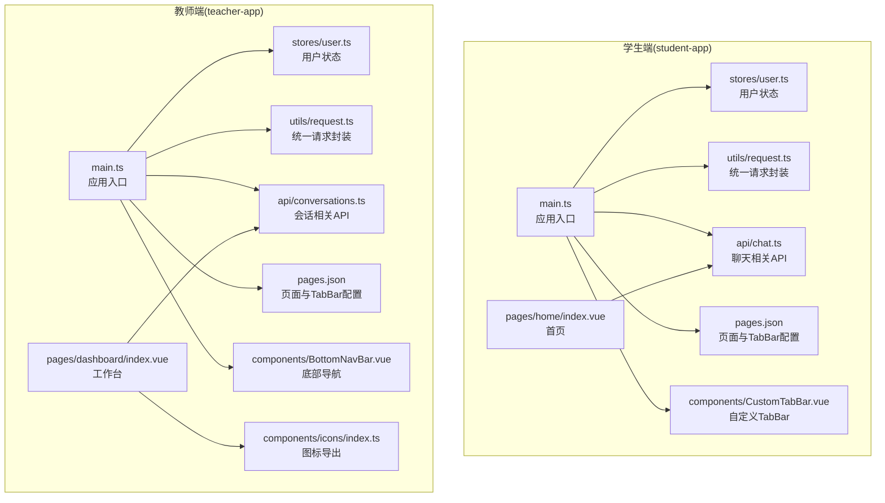
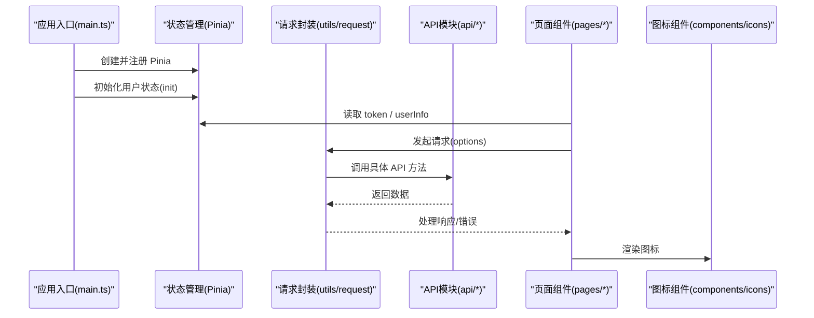
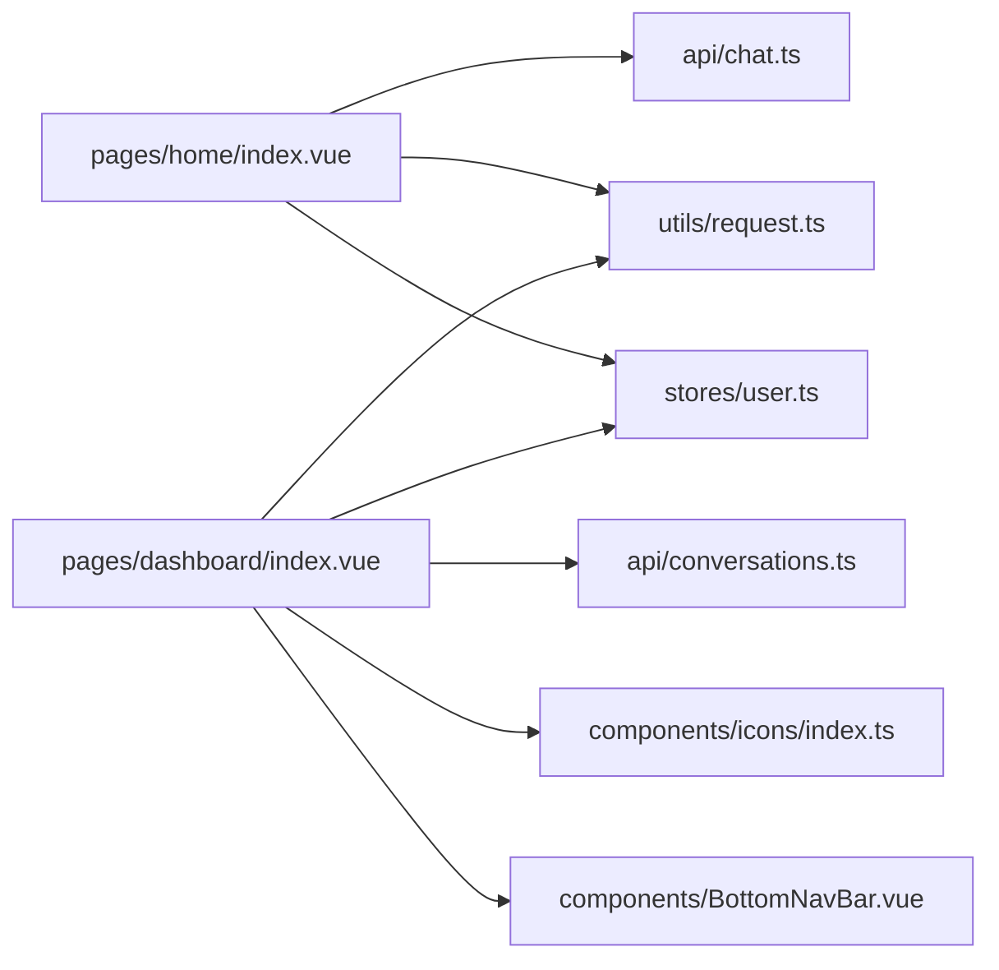

# 前端功能扩展

<cite>
**本文引用的文件**
- [apps/student-app/src/main.ts](file://apps/student-app/src/main.ts)
- [apps/teacher-app/src/main.ts](file://apps/teacher-app/src/main.ts)
- [apps/student-app/src/pages.json](file://apps/student-app/src/pages.json)
- [apps/teacher-app/src/pages.json](file://apps/teacher-app/src/pages.json)
- [apps/student-app/src/stores/user.ts](file://apps/student-app/src/stores/user.ts)
- [apps/teacher-app/src/stores/user.ts](file://apps/teacher-app/src/stores/user.ts)
- [apps/student-app/src/api/chat.ts](file://apps/student-app/src/api/chat.ts)
- [apps/teacher-app/src/api/conversations.ts](file://apps/teacher-app/src/api/conversations.ts)
- [apps/student-app/src/utils/request.ts](file://apps/student-app/src/utils/request.ts)
- [apps/teacher-app/src/utils/request.ts](file://apps/teacher-app/src/utils/request.ts)
- [apps/student-app/src/components/CustomTabBar.vue](file://apps/student-app/src/components/CustomTabBar.vue)
- [apps/teacher-app/src/components/BottomNavBar.vue](file://apps/teacher-app/src/components/BottomNavBar.vue)
- [apps/student-app/src/pages/home/index.vue](file://apps/student-app/src/pages/home/index.vue)
- [apps/teacher-app/src/pages/dashboard/index.vue](file://apps/teacher-app/src/pages/dashboard/index.vue)
- [apps/teacher-app/src/components/icons/index.ts](file://apps/teacher-app/src/components/icons/index.ts)
- [apps/teacher-app/src/types/api.ts](file://apps/teacher-app/src/types/api.ts)
- [apps/student-app/src/types/chat.ts](file://apps/student-app/src/types/chat.ts)
- [apps/teacher-app/src/stores/websocket.ts](file://apps/teacher-app/src/stores/websocket.ts)
</cite>

## 目录
1. [引言](#引言)
2. [项目结构](#项目结构)
3. [核心组件](#核心组件)
4. [架构总览](#架构总览)
5. [详细组件分析](#详细组件分析)
6. [依赖分析](#依赖分析)
7. [性能考虑](#性能考虑)
8. [故障排查指南](#故障排查指南)
9. [结论](#结论)
10. [附录](#附录)

## 引言
本指南面向在现有 Vue 3 + UniApp 前端架构上进行功能扩展的开发者，覆盖组件扩展、页面扩展、API 接口扩展、会话管理扩展、状态管理与路由配置更新、图标与样式定制、国际化增强等最佳实践。文档以 student-app 与 teacher-app 两个应用为蓝本，给出可复用的扩展步骤与图示，帮助你快速、安全地添加新功能。

## 项目结构
- 应用分层清晰：每个应用包含 pages、components、stores、utils、api、types、styles 等目录，职责明确。
- 共享基础设施：统一的请求封装、状态管理（Pinia）、图标导出、主题样式等。
- 页面路由：通过 pages.json 集中声明页面路径与 TabBar 配置，便于扩展与维护。

图表来源
- [apps/student-app/src/main.ts:1-11](file://apps/student-app/src/main.ts#L1-L11)
- [apps/teacher-app/src/main.ts:1-25](file://apps/teacher-app/src/main.ts#L1-L25)
- [apps/student-app/src/pages.json:1-65](file://apps/student-app/src/pages.json#L1-L65)
- [apps/teacher-app/src/pages.json:1-84](file://apps/teacher-app/src/pages.json#L1-L84)
- [apps/student-app/src/stores/user.ts:1-56](file://apps/student-app/src/stores/user.ts#L1-L56)
- [apps/teacher-app/src/stores/user.ts:1-63](file://apps/teacher-app/src/stores/user.ts#L1-L63)
- [apps/student-app/src/api/chat.ts:1-36](file://apps/student-app/src/api/chat.ts#L1-L36)
- [apps/teacher-app/src/api/conversations.ts:1-44](file://apps/teacher-app/src/api/conversations.ts#L1-L44)
- [apps/student-app/src/utils/request.ts:1-44](file://apps/student-app/src/utils/request.ts#L1-L44)
- [apps/teacher-app/src/utils/request.ts:1-108](file://apps/teacher-app/src/utils/request.ts#L1-L108)
- [apps/student-app/src/components/CustomTabBar.vue:1-75](file://apps/student-app/src/components/CustomTabBar.vue#L1-L75)
- [apps/teacher-app/src/components/BottomNavBar.vue:1-147](file://apps/teacher-app/src/components/BottomNavBar.vue#L1-L147)
- [apps/student-app/src/pages/home/index.vue:1-129](file://apps/student-app/src/pages/home/index.vue#L1-L129)
- [apps/teacher-app/src/pages/dashboard/index.vue:1-669](file://apps/teacher-app/src/pages/dashboard/index.vue#L1-L669)
- [apps/teacher-app/src/components/icons/index.ts:1-28](file://apps/teacher-app/src/components/icons/index.ts#L1-L28)

章节来源
- [apps/student-app/src/pages.json:1-65](file://apps/student-app/src/pages.json#L1-L65)
- [apps/teacher-app/src/pages.json:1-84](file://apps/teacher-app/src/pages.json#L1-L84)

## 核心组件
- 状态管理（Pinia）
  - 学生端用户状态：token、userInfo、初始化、登录/登出、WebSocket 连接管理。
  - 教师端用户状态：token、userInfo、显示名、初始化、清理与登出。
  - 教师端 WebSocket 状态：连接状态、未读数、初始化与销毁。
- 统一请求封装
  - 学生端：自动注入 Authorization，401 跳转登录，422 参数错误提示。
  - 教师端：支持 BASE_URL、超时、401 登录过期提示与跳转、GET/POST/PUT/DELETE 方法封装。
- 图标系统
  - 教师端通过 icons/index.ts 导出所有图标组件，便于按需引入与统一管理。
- 页面与导航
  - 学生端：自定义 TabBar；教师端：底部导航栏组件。
  - 页面路由集中于 pages.json，TabBar 列表与页面路径一一对应。

章节来源
- [apps/student-app/src/stores/user.ts:1-56](file://apps/student-app/src/stores/user.ts#L1-L56)
- [apps/teacher-app/src/stores/user.ts:1-63](file://apps/teacher-app/src/stores/user.ts#L1-L63)
- [apps/teacher-app/src/stores/websocket.ts:1-32](file://apps/teacher-app/src/stores/websocket.ts#L1-L32)
- [apps/student-app/src/utils/request.ts:1-44](file://apps/student-app/src/utils/request.ts#L1-L44)
- [apps/teacher-app/src/utils/request.ts:1-108](file://apps/teacher-app/src/utils/request.ts#L1-L108)
- [apps/teacher-app/src/components/icons/index.ts:1-28](file://apps/teacher-app/src/components/icons/index.ts#L1-L28)
- [apps/student-app/src/components/CustomTabBar.vue:1-75](file://apps/student-app/src/components/CustomTabBar.vue#L1-L75)
- [apps/teacher-app/src/components/BottomNavBar.vue:1-147](file://apps/teacher-app/src/components/BottomNavBar.vue#L1-L147)

## 架构总览
下图展示了“应用入口 → 状态管理 → 请求封装 → API 层 → 页面组件”的调用链路，以及图标与导航组件在页面中的使用关系。

图表来源
- [apps/student-app/src/main.ts:1-11](file://apps/student-app/src/main.ts#L1-L11)
- [apps/teacher-app/src/main.ts:1-25](file://apps/teacher-app/src/main.ts#L1-L25)
- [apps/student-app/src/stores/user.ts:1-56](file://apps/student-app/src/stores/user.ts#L1-L56)
- [apps/teacher-app/src/stores/user.ts:1-63](file://apps/teacher-app/src/stores/user.ts#L1-L63)
- [apps/student-app/src/utils/request.ts:1-44](file://apps/student-app/src/utils/request.ts#L1-L44)
- [apps/teacher-app/src/utils/request.ts:1-108](file://apps/teacher-app/src/utils/request.ts#L1-L108)
- [apps/student-app/src/api/chat.ts:1-36](file://apps/student-app/src/api/chat.ts#L1-L36)
- [apps/teacher-app/src/api/conversations.ts:1-44](file://apps/teacher-app/src/api/conversations.ts#L1-L44)
- [apps/student-app/src/pages/home/index.vue:1-129](file://apps/student-app/src/pages/home/index.vue#L1-L129)
- [apps/teacher-app/src/pages/dashboard/index.vue:1-669](file://apps/teacher-app/src/pages/dashboard/index.vue#L1-L669)
- [apps/teacher-app/src/components/icons/index.ts:1-28](file://apps/teacher-app/src/components/icons/index.ts#L1-L28)

## 详细组件分析

### 扩展组件：新增图标组件与样式定制
- 新增图标组件
  - 在教师端 icons 目录新增图标组件文件，并在 icons/index.ts 中导出。
  - 在页面中按需引入图标组件并传入 size、color、stroke-width 等属性。
- 样式定制
  - 使用 SCSS 变量与主题色常量，保持视觉一致性。
  - 导航栏与卡片组件采用统一的尺寸、阴影与圆角规范。

章节来源
- [apps/teacher-app/src/components/icons/index.ts:1-28](file://apps/teacher-app/src/components/icons/index.ts#L1-L28)
- [apps/teacher-app/src/pages/dashboard/index.vue:1-669](file://apps/teacher-app/src/pages/dashboard/index.vue#L1-L669)

### 扩展页面：在 student-app 中添加新页面组件
- 步骤
  - 在 pages 目录下创建新页面目录与 index.vue 文件。
  - 在 pages.json 中注册页面路径与导航样式，如需加入 TabBar，将其 pagePath 添加到 tabBar.list。
  - 在页面中引入所需组件（如自定义 TabBar），并调用 API 或状态管理。
- 示例参考
  - 首页页面展示了“快捷提问”、“最近对话”等交互，可作为新增页面的模板。

章节来源
- [apps/student-app/src/pages/home/index.vue:1-129](file://apps/student-app/src/pages/home/index.vue#L1-L129)
- [apps/student-app/src/pages.json:1-65](file://apps/student-app/src/pages.json#L1-L65)
- [apps/student-app/src/components/CustomTabBar.vue:1-75](file://apps/student-app/src/components/CustomTabBar.vue#L1-L75)

### 扩展页面：在 teacher-app 中添加新页面组件
- 步骤
  - 在 pages 目录下创建新页面目录与 index.vue 文件。
  - 在 pages.json 中注册页面路径与导航样式，如需加入 TabBar，将其 pagePath 添加到 tabBar.list。
  - 在页面中引入底部导航组件 BottomNavBar，并按需引入图标组件。
- 示例参考
  - 工作台页面展示了欢迎横幅、快捷操作、统计网格与待处理提问列表，可作为新增页面的模板。

章节来源
- [apps/teacher-app/src/pages/dashboard/index.vue:1-669](file://apps/teacher-app/src/pages/dashboard/index.vue#L1-L669)
- [apps/teacher-app/src/pages.json:1-84](file://apps/teacher-app/src/pages.json#L1-L84)
- [apps/teacher-app/src/components/BottomNavBar.vue:1-147](file://apps/teacher-app/src/components/BottomNavBar.vue#L1-L147)

### 扩展 API：新增聊天/会话相关接口
- 学生端
  - 在 api/chat.ts 中新增方法，封装对 /api/conversations 与 /api/conversations/{id}/messages 的调用。
  - 类型定义参考 types/chat.ts，确保返回值与状态枚举一致。
- 教师端
  - 在 api/conversations.ts 中新增方法，封装对 /api/conversations 的 GET/POST 操作。
  - 类型定义参考 types/api.ts，确保分页结果与消息体结构一致。

章节来源
- [apps/student-app/src/api/chat.ts:1-36](file://apps/student-app/src/api/chat.ts#L1-L36)
- [apps/teacher-app/src/api/conversations.ts:1-44](file://apps/teacher-app/src/api/conversations.ts#L1-L44)
- [apps/student-app/src/types/chat.ts:1-45](file://apps/student-app/src/types/chat.ts#L1-L45)
- [apps/teacher-app/src/types/api.ts:1-51](file://apps/teacher-app/src/types/api.ts#L1-L51)

### 扩展状态管理：会话管理与未读数
- 学生端
  - 用户状态初始化时自动连接 WebSocket，登出时断开连接。
  - 可在 stores/user.ts 中扩展更多会话相关的持久化字段或行为。
- 教师端
  - 新增 useWsStore 管理连接状态与未读数，监听 wsManager 事件并更新状态。
  - 在页面中根据未读数动态渲染徽标。

章节来源
- [apps/student-app/src/stores/user.ts:1-56](file://apps/student-app/src/stores/user.ts#L1-L56)
- [apps/teacher-app/src/stores/websocket.ts:1-32](file://apps/teacher-app/src/stores/websocket.ts#L1-L32)

### 扩展路由配置：更新 pages.json
- 新增页面
  - 在 pages 数组中添加新页面对象，设置 path 与 style。
  - 如需加入 TabBar，将 pagePath 添加到 tabBar.list，并设置文本。
- 更新全局样式
  - 可调整全局导航栏文字颜色、背景色与页面背景色，保持品牌一致性。

章节来源
- [apps/student-app/src/pages.json:1-65](file://apps/student-app/src/pages.json#L1-L65)
- [apps/teacher-app/src/pages.json:1-84](file://apps/teacher-app/src/pages.json#L1-L84)

### 扩展图标组件：新增图标与导出
- 新增步骤
  - 在 icons 目录新增图标组件文件。
  - 在 icons/index.ts 中导出该图标组件。
  - 在需要的页面中引入并使用。
- 注意事项
  - 保持图标命名规范与语义化，避免命名冲突。
  - 统一图标尺寸与描边宽度，保证视觉一致性。

章节来源
- [apps/teacher-app/src/components/icons/index.ts:1-28](file://apps/teacher-app/src/components/icons/index.ts#L1-L28)

### 扩展导航栏：自定义 TabBar 与底部导航
- 学生端
  - 自定义 TabBar 通过 props 接收当前激活项，点击后切换 Tab。
  - 可在 tabs 列表中新增条目，并绑定对应的页面路径。
- 教师端
  - 底部导航栏支持徽标显示未读数，图标组件通过动态组件方式渲染。
  - 可在 tabs 列表中新增条目，并绑定对应的页面路径。

章节来源
- [apps/student-app/src/components/CustomTabBar.vue:1-75](file://apps/student-app/src/components/CustomTabBar.vue#L1-L75)
- [apps/teacher-app/src/components/BottomNavBar.vue:1-147](file://apps/teacher-app/src/components/BottomNavBar.vue#L1-L147)

### 扩展请求封装：统一错误处理与鉴权
- 学生端
  - 401 自动登出并跳转登录页；422 参数错误提取 detail 提示。
- 教师端
  - 支持 BASE_URL、超时控制；401 登录过期提示并跳转；GET/POST/PUT/DELETE 方法封装。
- 最佳实践
  - 在 options 中注入 Authorization，避免重复拼接头信息。
  - 对网络失败与 HTTP 错误进行统一 toast 提示。

章节来源
- [apps/student-app/src/utils/request.ts:1-44](file://apps/student-app/src/utils/request.ts#L1-L44)
- [apps/teacher-app/src/utils/request.ts:1-108](file://apps/teacher-app/src/utils/request.ts#L1-L108)

### 扩展类型定义：API 与聊天消息
- 学生端
  - ConversationResponse、MessageResponse、ConversationStatus 等类型定义，确保前后端契约一致。
- 教师端
  - UserInfo、Conversation、Message、PageResult 等类型定义，支持分页与多端消息体。
- 最佳实践
  - 在新增字段时同步更新类型定义，避免运行时错误。
  - 对可空字段使用可选属性，提升健壮性。

章节来源
- [apps/student-app/src/types/chat.ts:1-45](file://apps/student-app/src/types/chat.ts#L1-L45)
- [apps/teacher-app/src/types/api.ts:1-51](file://apps/teacher-app/src/types/api.ts#L1-L51)

## 依赖分析
- 组件耦合
  - 页面组件依赖状态管理与请求封装，保持低耦合高内聚。
  - 导航组件与图标组件解耦，通过 props 与导出统一管理。
- 外部依赖
  - UniApp 运行时 API（uni.request、uni.switchTab、uni.navigateTo 等）。
  - Pinia 状态管理库。
- 潜在循环依赖
  - API 与 utils 之间为单向依赖，避免循环导入。
  - icons/index.ts 仅做导出聚合，不引入页面组件。

图表来源
- [apps/student-app/src/pages/home/index.vue:1-129](file://apps/student-app/src/pages/home/index.vue#L1-L129)
- [apps/teacher-app/src/pages/dashboard/index.vue:1-669](file://apps/teacher-app/src/pages/dashboard/index.vue#L1-L669)
- [apps/student-app/src/api/chat.ts:1-36](file://apps/student-app/src/api/chat.ts#L1-L36)
- [apps/teacher-app/src/api/conversations.ts:1-44](file://apps/teacher-app/src/api/conversations.ts#L1-L44)
- [apps/student-app/src/utils/request.ts:1-44](file://apps/student-app/src/utils/request.ts#L1-L44)
- [apps/teacher-app/src/utils/request.ts:1-108](file://apps/teacher-app/src/utils/request.ts#L1-L108)
- [apps/teacher-app/src/components/icons/index.ts:1-28](file://apps/teacher-app/src/components/icons/index.ts#L1-L28)
- [apps/teacher-app/src/components/BottomNavBar.vue:1-147](file://apps/teacher-app/src/components/BottomNavBar.vue#L1-L147)

## 性能考虑
- 请求缓存与去重
  - 对高频查询（如最近对话列表）增加本地缓存与去重逻辑，减少重复请求。
- 图标懒加载
  - 对非首屏图标采用动态 import，降低首屏体积。
- 动画与滚动
  - 合理使用 CSS 动画与滚动容器，避免过度重绘。
- 状态粒度
  - 将大对象拆分为细粒度状态，减少不必要的响应式更新。

## 故障排查指南
- 登录态异常
  - 检查 stores/user.ts 中 token 与 userInfo 的存储键是否正确，确认初始化流程。
  - 若出现 401，确认 request.ts 是否正确注入 Authorization 并触发登出与跳转。
- 页面无法切换
  - 检查 pages.json 中 path 与 tabBar.list 的配置是否一致。
  - 确认 uni.switchTab/uni.navigateTo 的目标路径存在且正确。
- 图标不显示
  - 检查 icons/index.ts 是否导出对应图标组件，页面是否正确引入。
- WebSocket 未读数不更新
  - 确认 useWsStore 是否在 main.ts 中初始化，wsManager 事件是否正确监听。

章节来源
- [apps/student-app/src/stores/user.ts:1-56](file://apps/student-app/src/stores/user.ts#L1-L56)
- [apps/teacher-app/src/stores/user.ts:1-63](file://apps/teacher-app/src/stores/user.ts#L1-L63)
- [apps/student-app/src/utils/request.ts:1-44](file://apps/student-app/src/utils/request.ts#L1-L44)
- [apps/teacher-app/src/utils/request.ts:1-108](file://apps/teacher-app/src/utils/request.ts#L1-L108)
- [apps/teacher-app/src/stores/websocket.ts:1-32](file://apps/teacher-app/src/stores/websocket.ts#L1-L32)
- [apps/student-app/src/pages.json:1-65](file://apps/student-app/src/pages.json#L1-L65)
- [apps/teacher-app/src/pages.json:1-84](file://apps/teacher-app/src/pages.json#L1-L84)
- [apps/teacher-app/src/components/icons/index.ts:1-28](file://apps/teacher-app/src/components/icons/index.ts#L1-L28)

## 结论
通过遵循本文档的扩展步骤与最佳实践，你可以安全、高效地在 Vue 3 + UniApp 架构下添加新功能。建议始终以“状态管理 → 请求封装 → API 定义 → 页面组件 → 导航与图标”的顺序推进，并在 pages.json 中同步更新路由配置。对于会话管理与消息类型扩展，优先完善类型定义与状态模型，再逐步接入 UI 与交互。

## 附录
- 国际化增强建议
  - 使用 uni.getSystemInfoSync 获取语言设置，结合 i18n 工具（如 vue-i18n）进行文案替换。
  - 将文案集中管理，避免硬编码字符串散落各处。
- 主题与样式
  - 统一使用 SCSS 变量与主题色常量，确保深浅色模式兼容。
- 安全与鉴权
  - 严格校验 Authorization 头与 401 行为，防止越权访问。
- 可测试性
  - 将 API 方法与工具函数抽离为纯函数，便于单元测试与模拟。