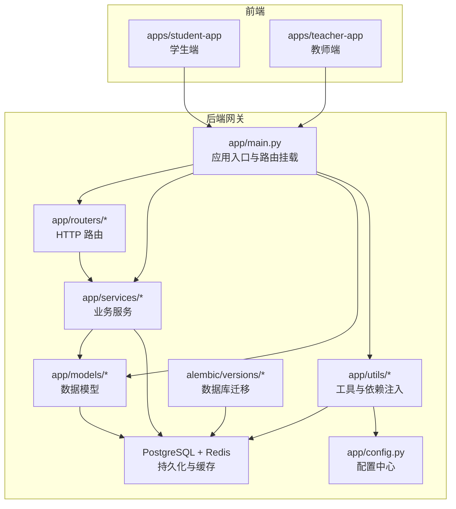
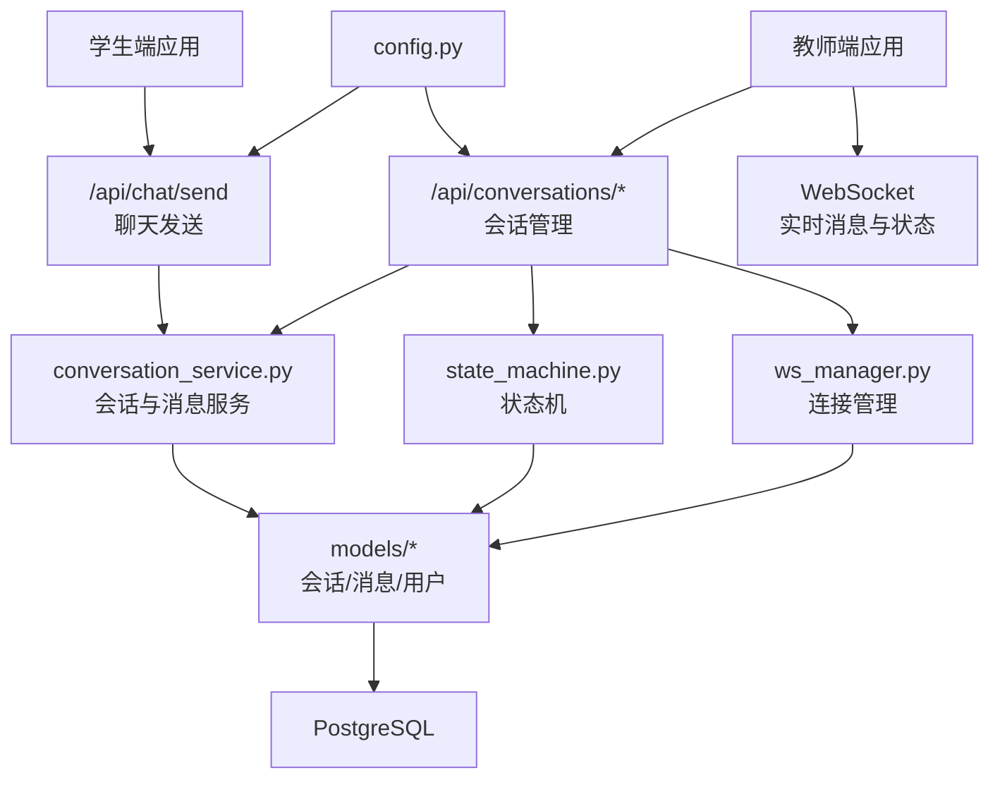
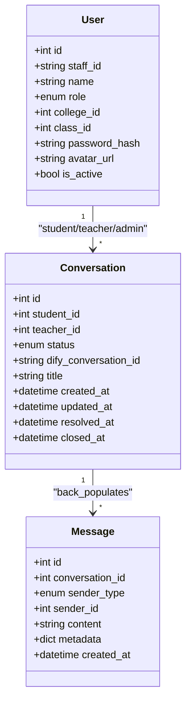
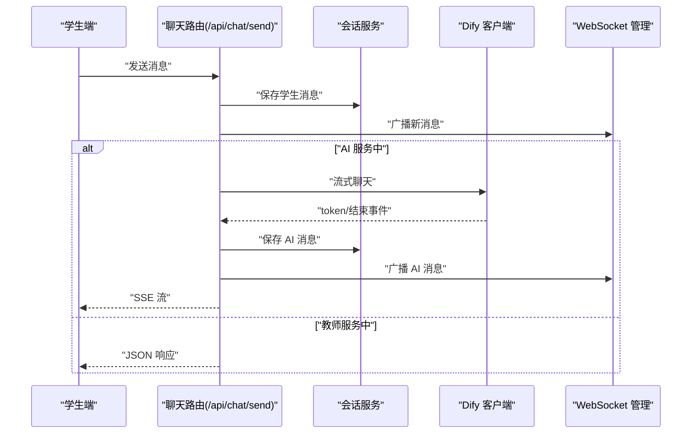
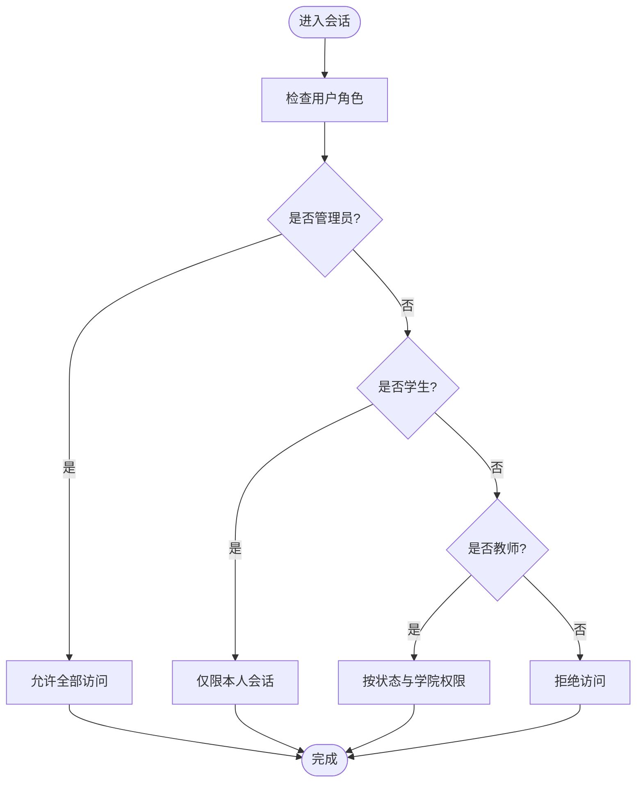
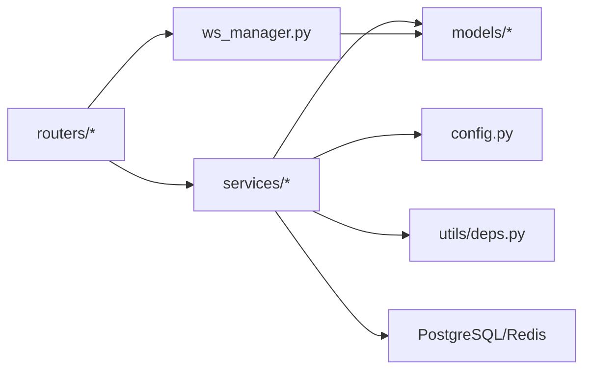

# 功能扩展方法

<cite>
**本文档引用的文件**
- [README.md](file://README.md)
- [services/gateway/app/main.py](file://services/gateway/app/main.py)
- [services/gateway/app/config.py](file://services/gateway/app/config.py)
- [services/gateway/app/models/conversation.py](file://services/gateway/app/models/conversation.py)
- [services/gateway/app/models/user.py](file://services/gateway/app/models/user.py)
- [services/gateway/app/routers/chat.py](file://services/gateway/app/routers/chat.py)
- [services/gateway/app/schemas/chat.py](file://services/gateway/app/schemas/chat.py)
- [services/gateway/app/services/conversation_service.py](file://services/gateway/app/services/conversation_service.py)
- [services/gateway/app/services/state_machine.py](file://services/gateway/app/services/state_machine.py)
- [services/gateway/app/services/ws_manager.py](file://services/gateway/app/services/ws_manager.py)
- [services/gateway/app/utils/deps.py](file://services/gateway/app/utils/deps.py)
- [services/gateway/alembic/versions/e11bb6c9d4b8_v2_initial_schema.py](file://services/gateway/alembic/versions/e11bb6c9d4b8_v2_initial_schema.py)
- [apps/student-app/src/main.ts](file://apps/student-app/src/main.ts)
- [apps/teacher-app/src/main.ts](file://apps/teacher-app/src/main.ts)
- [apps/student-app/src/types/chat.ts](file://apps/student-app/src/types/chat.ts)
- [apps/teacher-app/src/types/conversation.ts](file://apps/teacher-app/src/types/conversation.ts)
- [apps/student-app/src/api/chat.ts](file://apps/student-app/src/api/chat.ts)
- [apps/teacher-app/src/api/conversations.ts](file://apps/teacher-app/src/api/conversations.ts)
</cite>

## 目录
1. [简介](#简介)
2. [项目结构](#项目结构)
3. [核心组件](#核心组件)
4. [架构总览](#架构总览)
5. [详细组件分析](#详细组件分析)
6. [依赖关系分析](#依赖关系分析)
7. [性能考虑](#性能考虑)
8. [故障排查指南](#故障排查指南)
9. [结论](#结论)
10. [附录](#附录)

## 简介
本指南面向“医小管 v2”系统的扩展开发者，系统性阐述模块化设计原则与接口抽象方法，覆盖会话管理扩展、聊天功能增强、用户权限扩展等主题。文档以现有架构为基础，提供服务层扩展、API 接口扩展、前端组件扩展的实操步骤，并给出新增消息类型、扩展会话状态、新增用户角色等具体扩展示例。同时，重点说明配置管理、版本兼容与向后兼容的关键技术要点，帮助团队在保持系统稳定性的前提下高效迭代。

## 项目结构
- 后端网关服务采用 FastAPI + SQLAlchemy + Alembic 架构，统一对外提供认证、会话、聊天、动作控制与 WebSocket 管理能力。
- 前端包含学生端与教师端两个独立应用，均基于 Vue 3 与 Pinia 状态管理，通过统一的 API 层与后端交互。
- 数据库采用 PostgreSQL，配合 Alembic 进行迁移管理；Redis 用于会话与缓存相关场景。

图表来源
- [services/gateway/app/main.py:1-78](file://services/gateway/app/main.py#L1-L78)
- [services/gateway/app/config.py:1-31](file://services/gateway/app/config.py#L1-L31)
- [services/gateway/alembic/versions/e11bb6c9d4b8_v2_initial_schema.py:21-160](file://services/gateway/alembic/versions/e11bb6c9d4b8_v2_initial_schema.py#L21-L160)

章节来源
- [README.md:1-18](file://README.md#L1-L18)
- [services/gateway/app/main.py:1-78](file://services/gateway/app/main.py#L1-L78)

## 核心组件
- 应用入口与路由挂载：集中注册认证、会话、动作、WebSocket 与聊天路由，支持后续按需扩展。
- 数据模型：定义会话、消息、用户、角色、平台绑定等核心实体，支撑权限与状态流转。
- 业务服务：封装会话访问控制、创建、列表查询、消息增删、状态机转换、WebSocket 管理等。
- 配置中心：统一管理数据库、Redis、JWT、Dify 等外部服务参数。
- 前端应用：学生端与教师端分别提供聊天、会话、知识库、仪表盘等功能页面与 API 封装。

章节来源
- [services/gateway/app/main.py:16-78](file://services/gateway/app/main.py#L16-L78)
- [services/gateway/app/models/conversation.py:1-63](file://services/gateway/app/models/conversation.py#L1-L63)
- [services/gateway/app/models/user.py:1-76](file://services/gateway/app/models/user.py#L1-L76)
- [services/gateway/app/services/conversation_service.py:1-179](file://services/gateway/app/services/conversation_service.py#L1-L179)
- [services/gateway/app/services/state_machine.py:1-96](file://services/gateway/app/services/state_machine.py#L1-L96)
- [services/gateway/app/services/ws_manager.py:1-100](file://services/gateway/app/services/ws_manager.py#L1-L100)
- [services/gateway/app/config.py:1-31](file://services/gateway/app/config.py#L1-L31)

## 架构总览
系统采用“网关 + 服务层 + 前端应用”的分层架构。后端通过 FastAPI 提供 REST 与 WebSocket 接口，业务逻辑集中在服务层，数据模型与迁移脚本确保数据库一致性。前端通过统一 API 与后端交互，实现会话管理、消息收发、状态变更等核心流程。

图表来源
- [services/gateway/app/routers/chat.py:1-191](file://services/gateway/app/routers/chat.py#L1-L191)
- [services/gateway/app/services/conversation_service.py:1-179](file://services/gateway/app/services/conversation_service.py#L1-L179)
- [services/gateway/app/services/state_machine.py:1-96](file://services/gateway/app/services/state_machine.py#L1-L96)
- [services/gateway/app/services/ws_manager.py:1-100](file://services/gateway/app/services/ws_manager.py#L1-L100)
- [services/gateway/app/models/conversation.py:1-63](file://services/gateway/app/models/conversation.py#L1-L63)
- [services/gateway/app/models/user.py:1-76](file://services/gateway/app/models/user.py#L1-L76)
- [services/gateway/app/config.py:1-31](file://services/gateway/app/config.py#L1-L31)

## 详细组件分析

### 会话管理扩展
- 扩展点
  - 新增消息类型：在消息模型中增加枚举值，并在路由与服务层适配处理。
  - 扩展会话状态：在状态机中补充合法转换规则，并在会话模型与前端类型中同步更新。
  - 权限控制：在访问控制函数中根据新角色或新状态进行授权判断。
- 实施步骤
  - 数据模型：在会话与消息模型中新增字段或枚举项，确保迁移脚本包含对应变更。
  - 服务层：在会话服务与状态机中处理新状态与新消息类型的业务逻辑。
  - 路由层：在聊天与会话路由中校验新状态与消息类型，必要时调整流式响应或广播策略。
  - 前端类型：在前端类型定义中同步新增状态与消息类型，保证 UI 与交互一致。
- 示例参考
  - 新增消息类型：参考消息模型中的发送者类型枚举与消息元数据字段。
  - 扩展会话状态：参考状态机中的状态转换表与系统消息写入逻辑。
  - 权限控制：参考会话访问控制函数中的角色与状态判断。

图表来源
- [services/gateway/app/models/conversation.py:26-63](file://services/gateway/app/models/conversation.py#L26-L63)
- [services/gateway/app/models/user.py:45-76](file://services/gateway/app/models/user.py#L45-L76)

章节来源
- [services/gateway/app/models/conversation.py:1-63](file://services/gateway/app/models/conversation.py#L1-L63)
- [services/gateway/app/models/user.py:1-76](file://services/gateway/app/models/user.py#L1-L76)
- [services/gateway/app/services/conversation_service.py:1-179](file://services/gateway/app/services/conversation_service.py#L1-L179)
- [services/gateway/app/services/state_machine.py:1-96](file://services/gateway/app/services/state_machine.py#L1-L96)

### 聊天功能增强
- 扩展点
  - 流式响应增强：在聊天路由中扩展事件类型与元数据字段，支持多模态输出或引用来源扩展。
  - 会话状态驱动：根据状态选择 SSE 或 JSON 响应路径，确保前后端一致消费。
  - 实时广播：在消息保存后通过 WebSocket 广播新消息，支持 AI 与教师两种场景。
- 实施步骤
  - 路由层：在聊天发送接口中根据会话状态分流至 AI 流式或教师直连路径。
  - 服务层：在消息服务中统一处理消息写入与会话更新时间戳。
  - WebSocket：在连接管理中维护房间与用户映射，确保消息广播准确无误。
- 示例参考
  - 流式响应：参考聊天路由中的事件类型与消息结束事件。
  - 广播策略：参考 WebSocket 管理器中的房间广播与用户推送。

图表来源
- [services/gateway/app/routers/chat.py:22-191](file://services/gateway/app/routers/chat.py#L22-L191)
- [services/gateway/app/services/conversation_service.py:148-179](file://services/gateway/app/services/conversation_service.py#L148-L179)
- [services/gateway/app/services/ws_manager.py:71-82](file://services/gateway/app/services/ws_manager.py#L71-L82)

章节来源
- [services/gateway/app/routers/chat.py:1-191](file://services/gateway/app/routers/chat.py#L1-L191)
- [services/gateway/app/services/conversation_service.py:1-179](file://services/gateway/app/services/conversation_service.py#L1-L179)
- [services/gateway/app/services/ws_manager.py:1-100](file://services/gateway/app/services/ws_manager.py#L1-L100)

### 用户权限扩展
- 扩展点
  - 新增用户角色：在用户模型中扩展角色枚举，并在访问控制与状态机中处理新角色的权限边界。
  - 平台绑定与认证：在用户绑定模型中支持新平台类型，认证依赖注入中适配新平台的令牌解析。
- 实施步骤
  - 数据模型：在用户与绑定模型中新增枚举值与约束，确保迁移脚本包含变更。
  - 访问控制：在会话访问控制函数中为新角色设置合理的可见范围与操作权限。
  - 认证依赖：在依赖注入中扩展令牌解析与用户加载逻辑，确保新角色可用。
- 示例参考
  - 角色枚举：参考用户模型中的角色与平台类型定义。
  - 访问控制：参考会话访问控制函数中的角色分支与学院级权限判断。

图表来源
- [services/gateway/app/services/conversation_service.py:7-27](file://services/gateway/app/services/conversation_service.py#L7-L27)
- [services/gateway/app/models/user.py:10-14](file://services/gateway/app/models/user.py#L10-L14)

章节来源
- [services/gateway/app/models/user.py:1-76](file://services/gateway/app/models/user.py#L1-L76)
- [services/gateway/app/services/conversation_service.py:1-179](file://services/gateway/app/services/conversation_service.py#L1-L179)
- [services/gateway/app/utils/deps.py:14-35](file://services/gateway/app/utils/deps.py#L14-L35)

### API 接口扩展
- 扩展点
  - 新增路由：在网关主程序中挂载新路由，并在 routers 目录下创建对应模块。
  - 请求/响应模型：在 schemas 目录下定义 Pydantic 模型，确保类型安全与文档自动生成。
  - 业务服务：在 services 目录下实现新功能的业务逻辑，并复用现有依赖注入与数据库会话。
- 实施步骤
  - 路由层：定义新路由与端点，使用依赖注入获取当前用户与数据库会话。
  - 服务层：封装业务逻辑，处理权限校验、数据校验与错误处理。
  - 前端 API：在前端应用中新增 API 封装与类型定义，保持与后端一致。
- 示例参考
  - 路由挂载：参考网关主程序中的路由挂载点注释与 include_router 调用。
  - 请求模型：参考聊天发送请求模型与响应模型。

章节来源
- [services/gateway/app/main.py:70-78](file://services/gateway/app/main.py#L70-L78)
- [services/gateway/app/schemas/chat.py:1-18](file://services/gateway/app/schemas/chat.py#L1-L18)
- [apps/student-app/src/api/chat.ts:1-36](file://apps/student-app/src/api/chat.ts#L1-L36)
- [apps/teacher-app/src/api/conversations.ts:1-44](file://apps/teacher-app/src/api/conversations.ts#L1-L44)

### 前端组件扩展
- 扩展点
  - 类型定义：在前端 types 目录下新增接口与枚举，确保与后端模型一致。
  - 页面与组件：在 pages 与 components 目录下新增页面与可复用组件。
  - 状态管理：在 stores 中新增或扩展 Pinia Store，管理全局状态与异步数据。
  - API 封装：在 api 目录下新增或扩展 API 方法，统一错误处理与加载状态。
- 实施步骤
  - 类型对齐：确保前端类型与后端模型保持一致，避免运行时错误。
  - 组件拆分：将复杂页面拆分为多个小组件，提升可维护性与复用性。
  - 状态抽取：将通用状态抽取到 Store，减少重复逻辑与副作用。
  - 错误处理：在 API 封装中统一处理网络错误与业务错误，提供友好的提示。
- 示例参考
  - 学生端入口：参考学生端主程序初始化与 Pinia 注册。
  - 教师端入口：参考教师端主程序初始化与自动 WS 连接逻辑。
  - 前端类型：参考学生端与教师端的会话与消息类型定义。

章节来源
- [apps/student-app/src/main.ts:1-11](file://apps/student-app/src/main.ts#L1-L11)
- [apps/teacher-app/src/main.ts:1-25](file://apps/teacher-app/src/main.ts#L1-L25)
- [apps/student-app/src/types/chat.ts:1-45](file://apps/student-app/src/types/chat.ts#L1-L45)
- [apps/teacher-app/src/types/conversation.ts:1-18](file://apps/teacher-app/src/types/conversation.ts#L1-L18)

## 依赖关系分析
- 组件耦合
  - 路由层依赖服务层与模型层，服务层依赖模型层与配置中心，形成清晰的单向依赖。
  - WebSocket 管理器与会话服务解耦，通过广播接口进行通信，降低耦合度。
- 外部依赖
  - 数据库与 Redis 通过依赖注入提供，便于替换与测试。
  - Dify 作为外部 AI 引擎，通过配置中心统一管理访问参数。
- 潜在循环依赖
  - 当前结构未发现循环依赖，建议新增模块时遵循“上层依赖下层”的原则。

图表来源
- [services/gateway/app/routers/chat.py:1-191](file://services/gateway/app/routers/chat.py#L1-L191)
- [services/gateway/app/services/conversation_service.py:1-179](file://services/gateway/app/services/conversation_service.py#L1-L179)
- [services/gateway/app/services/ws_manager.py:1-100](file://services/gateway/app/services/ws_manager.py#L1-L100)
- [services/gateway/app/config.py:1-31](file://services/gateway/app/config.py#L1-L31)
- [services/gateway/app/utils/deps.py:1-40](file://services/gateway/app/utils/deps.py#L1-L40)

章节来源
- [services/gateway/app/routers/chat.py:1-191](file://services/gateway/app/routers/chat.py#L1-L191)
- [services/gateway/app/services/conversation_service.py:1-179](file://services/gateway/app/services/conversation_service.py#L1-L179)
- [services/gateway/app/services/ws_manager.py:1-100](file://services/gateway/app/services/ws_manager.py#L1-L100)
- [services/gateway/app/utils/deps.py:1-40](file://services/gateway/app/utils/deps.py#L1-L40)

## 性能考虑
- 数据库优化
  - 使用索引加速会话与消息查询，如会话状态与学生索引、消息会话与时间索引。
  - 分页查询与计数分离，避免大结果集全量扫描。
- 缓存策略
  - Redis 用于会话与缓存，建议对热点数据设置合理过期时间，避免内存膨胀。
- 流式传输
  - SSE 流式响应减少一次性响应体积，提升用户体验；注意客户端缓冲与断线重连。
- WebSocket 广播
  - 房间广播与用户推送分离，避免广播风暴；及时清理失效连接。

## 故障排查指南
- 健康检查
  - 网关健康端点同时检查 PostgreSQL、Redis 与 Dify 服务状态，便于快速定位依赖问题。
- 认证与授权
  - JWT 解析失败或用户不存在/禁用会导致 401，需检查令牌格式与数据库状态。
- 会话状态
  - 非法状态转换会抛出异常，需核对状态机转换表与前端状态显示。
- WebSocket 连接
  - 连接断开后自动清理映射，若出现消息丢失，需检查广播接口与客户端重连逻辑。
- 数据库迁移
  - 迁移脚本需与模型定义保持一致，升级/降级前做好备份与回滚预案。

章节来源
- [services/gateway/app/main.py:30-68](file://services/gateway/app/main.py#L30-L68)
- [services/gateway/app/utils/deps.py:14-35](file://services/gateway/app/utils/deps.py#L14-L35)
- [services/gateway/app/services/state_machine.py:8-48](file://services/gateway/app/services/state_machine.py#L8-L48)
- [services/gateway/app/services/ws_manager.py:34-46](file://services/gateway/app/services/ws_manager.py#L34-L46)
- [services/gateway/alembic/versions/e11bb6c9d4b8_v2_initial_schema.py:21-160](file://services/gateway/alembic/versions/e11bb6c9d4b8_v2_initial_schema.py#L21-L160)

## 结论
通过模块化设计与接口抽象，医小管 v2 在保持清晰职责边界的同时，提供了良好的扩展空间。围绕会话管理、聊天功能与用户权限三大领域，结合服务层、API 层与前端组件的协同扩展，可以高效地实现新功能上线。在实施过程中，务必关注配置管理、版本兼容与向后兼容，确保系统稳定性与可维护性。

## 附录
- 配置管理
  - 通过配置中心集中管理数据库、Redis、JWT、Dify 等参数，支持环境变量覆盖。
- 版本兼容与向后兼容
  - 数据库迁移脚本确保模式演进；前端类型与后端模型保持一致；状态机与权限控制向前兼容旧状态与角色。
- 扩展清单
  - 新增消息类型：消息模型枚举与元数据字段。
  - 扩展会话状态：状态机转换表与系统消息。
  - 新增用户角色：用户模型枚举与访问控制分支。
  - 新增 API 端点：路由、请求/响应模型与服务实现。
  - 新增前端页面：类型定义、页面组件与 API 封装。

章节来源
- [services/gateway/app/config.py:1-31](file://services/gateway/app/config.py#L1-L31)
- [services/gateway/app/models/conversation.py:11-17](file://services/gateway/app/models/conversation.py#L11-L17)
- [services/gateway/app/models/user.py:10-14](file://services/gateway/app/models/user.py#L10-L14)
- [services/gateway/app/schemas/chat.py:1-18](file://services/gateway/app/schemas/chat.py#L1-L18)
- [apps/student-app/src/types/chat.ts:39-45](file://apps/student-app/src/types/chat.ts#L39-L45)
- [apps/teacher-app/src/types/conversation.ts:4-17](file://apps/teacher-app/src/types/conversation.ts#L4-L17)