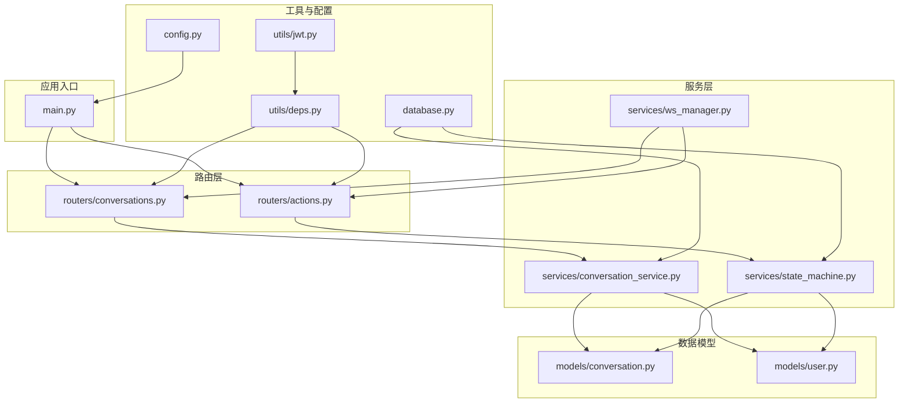
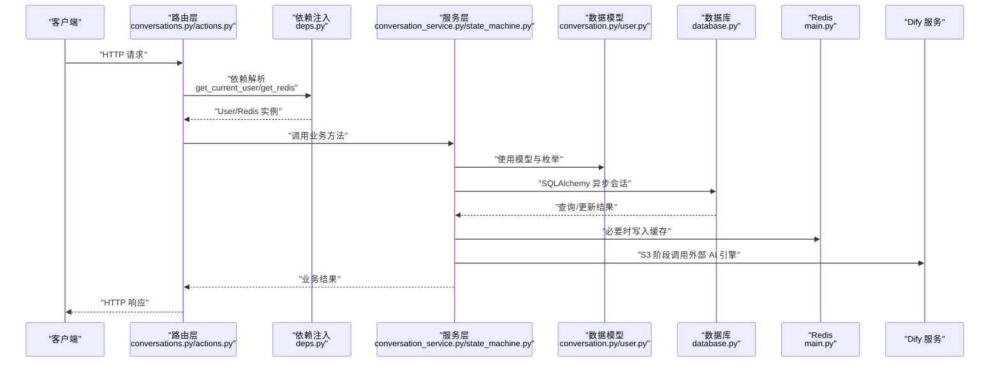
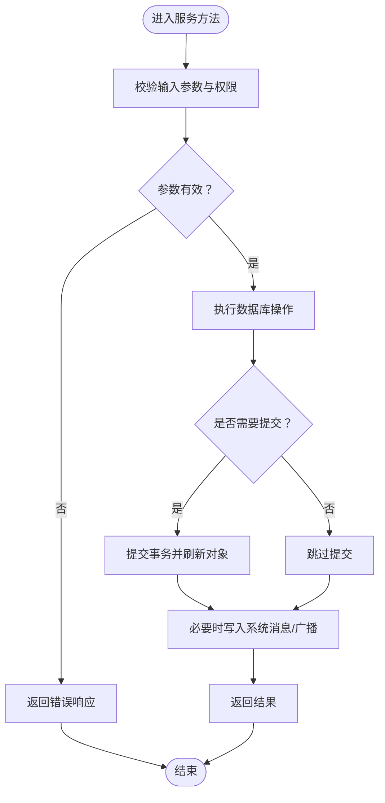
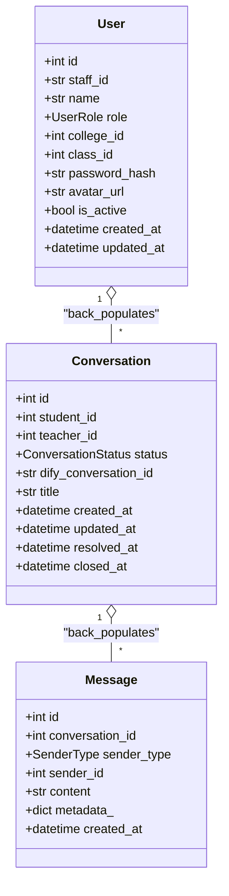
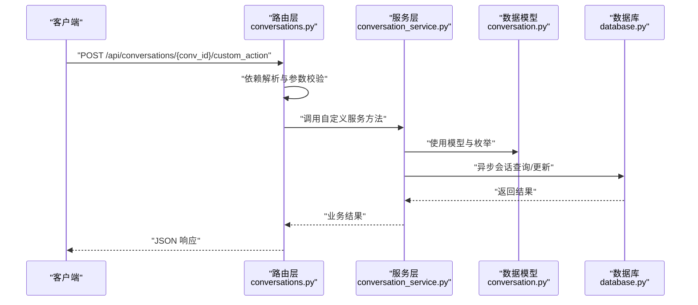
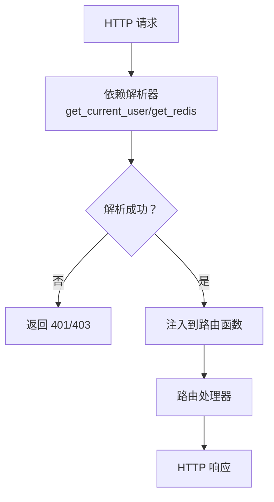
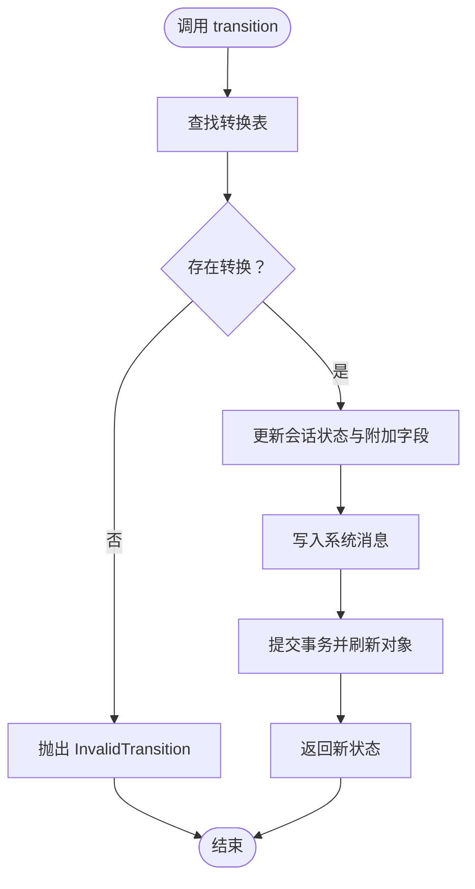
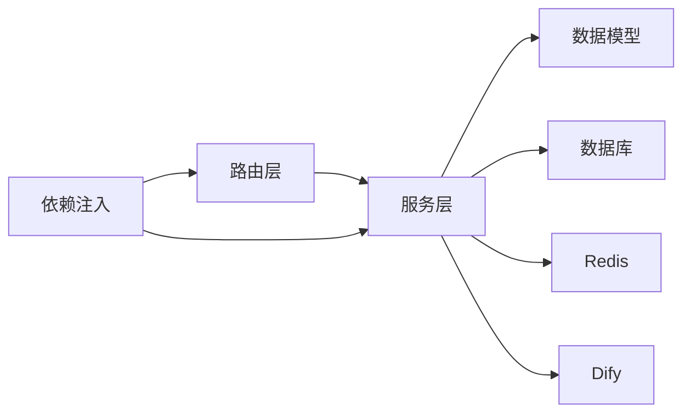

# 后端服务扩展

<cite>
**本文引用的文件**
- [main.py](file://services/gateway/app/main.py)
- [conversation_service.py](file://services/gateway/app/services/conversation_service.py)
- [conversation.py](file://services/gateway/app/models/conversation.py)
- [conversations.py](file://services/gateway/app/routers/conversations.py)
- [deps.py](file://services/gateway/app/utils/deps.py)
- [conversation.py](file://services/gateway/app/schemas/conversation.py)
- [user.py](file://services/gateway/app/models/user.py)
- [database.py](file://services/gateway/app/database.py)
- [config.py](file://services/gateway/app/config.py)
- [state_machine.py](file://services/gateway/app/services/state_machine.py)
- [actions.py](file://services/gateway/app/routers/actions.py)
- [ws_manager.py](file://services/gateway/app/services/ws_manager.py)
- [jwt.py](file://services/gateway/app/utils/jwt.py)
</cite>

## 目录
1. [简介](#简介)
2. [项目结构](#项目结构)
3. [核心组件](#核心组件)
4. [架构总览](#架构总览)
5. [详细组件分析](#详细组件分析)
6. [依赖分析](#依赖分析)
7. [性能考虑](#性能考虑)
8. [故障排查指南](#故障排查指南)
9. [结论](#结论)
10. [附录](#附录)

## 简介
本指南面向在现有 FastAPI 服务架构上进行扩展的开发者，围绕“会话服务”的扩展实践，系统讲解如何在以下方面进行扩展与集成：
- 服务层扩展：在 conversation_service.py 中新增服务方法，实现新的业务逻辑
- 数据模型扩展：在 models 中新增数据模型与枚举，支持新的状态与字段
- 路由扩展：在 routers 中添加新的 API 端点，对接服务层与数据模型
- 依赖注入扩展：通过 utils/deps.py 提供新的依赖解析器
- 中间件与异常处理：在主应用中统一接入健康检查、Redis 连接与外部服务探测
- 会话状态机扩展：在 state_machine.py 中新增状态转换规则与系统消息

本指南以现有代码为蓝本，提供可落地的扩展步骤与最佳实践，帮助你快速、安全地在现有架构上添加新功能模块。

## 项目结构
后端服务采用 FastAPI + SQLAlchemy + Alembic 的分层架构，核心目录与职责如下：
- app/main.py：应用入口，注册路由、初始化 Redis、健康检查与外部服务探测
- app/routers/*：路由层，定义 API 端点，负责参数解析、鉴权与响应封装
- app/services/*：服务层，封装业务逻辑，协调模型与外部服务
- app/models/*：数据模型，定义实体、枚举与索引
- app/schemas/*：Pydantic 模型，用于请求/响应序列化
- app/utils/*：工具模块，包含依赖注入、JWT 工具等
- app/database.py：数据库引擎与会话工厂
- app/config.py：配置项集中管理
- alembic/*：数据库迁移脚本

图表来源
- [main.py:1-78](file://services/gateway/app/main.py#L1-L78)
- [conversations.py:1-129](file://services/gateway/app/routers/conversations.py#L1-L129)
- [actions.py:1-154](file://services/gateway/app/routers/actions.py#L1-L154)
- [conversation_service.py:1-179](file://services/gateway/app/services/conversation_service.py#L1-L179)
- [state_machine.py:1-96](file://services/gateway/app/services/state_machine.py#L1-L96)
- [ws_manager.py:1-100](file://services/gateway/app/services/ws_manager.py#L1-L100)
- [conversation.py:1-63](file://services/gateway/app/models/conversation.py#L1-L63)
- [user.py:1-76](file://services/gateway/app/models/user.py#L1-L76)
- [deps.py:1-40](file://services/gateway/app/utils/deps.py#L1-L40)
- [jwt.py:1-17](file://services/gateway/app/utils/jwt.py#L1-L17)
- [config.py:1-31](file://services/gateway/app/config.py#L1-L31)
- [database.py:1-15](file://services/gateway/app/database.py#L1-L15)

章节来源
- [main.py:1-78](file://services/gateway/app/main.py#L1-L78)
- [config.py:1-31](file://services/gateway/app/config.py#L1-L31)

## 核心组件
- 应用入口与生命周期
  - 初始化 Redis 连接并注入到 app.state.redis
  - 健康检查接口：检测 Postgres、Redis 与 Dify 服务连通性
  - 路由挂载：认证、会话、动作、WebSocket、聊天等
- 依赖注入
  - get_current_user：从 Authorization 头解析 JWT，查询用户并校验有效性
  - get_redis：从 app.state.redis 获取 Redis 客户端
- 会话服务
  - 权限校验 can_access_conversation
  - 会话 CRUD：创建、列表、详情、消息列表、新增消息
- 会话状态机
  - 合法状态转换表与异常类型
  - 状态变更时写入系统消息并刷新对象
- WebSocket 管理
  - 用户连接、房间连接、广播与清理
- 数据模型
  - 会话与消息实体、枚举（状态、发送方类型）、索引
  - 用户与角色、学院与班级、绑定信息

章节来源
- [main.py:16-78](file://services/gateway/app/main.py#L16-L78)
- [deps.py:14-40](file://services/gateway/app/utils/deps.py#L14-L40)
- [conversation_service.py:7-179](file://services/gateway/app/services/conversation_service.py#L7-L179)
- [state_machine.py:8-96](file://services/gateway/app/services/state_machine.py#L8-L96)
- [ws_manager.py:8-100](file://services/gateway/app/services/ws_manager.py#L8-L100)
- [conversation.py:11-63](file://services/gateway/app/models/conversation.py#L11-L63)
- [user.py:10-76](file://services/gateway/app/models/user.py#L10-L76)

## 架构总览
下图展示了从客户端请求到数据库与外部服务的整体流程，重点体现依赖注入、服务层与状态机协作：

图表来源
- [conversations.py:1-129](file://services/gateway/app/routers/conversations.py#L1-L129)
- [actions.py:1-154](file://services/gateway/app/routers/actions.py#L1-L154)
- [deps.py:14-40](file://services/gateway/app/utils/deps.py#L14-L40)
- [conversation_service.py:1-179](file://services/gateway/app/services/conversation_service.py#L1-L179)
- [state_machine.py:1-96](file://services/gateway/app/services/state_machine.py#L1-L96)
- [database.py:1-15](file://services/gateway/app/database.py#L1-L15)
- [main.py:16-22](file://services/gateway/app/main.py#L16-L22)

## 详细组件分析

### 会话服务扩展（conversation_service.py）
目标：在现有服务方法基础上新增业务能力，如扩展会话属性、新增状态流转、添加新的业务逻辑。

- 新增服务方法的步骤
  1) 在 conversation_service.py 中定义异步函数，接收 db: AsyncSession 与业务所需参数
  2) 使用 SQLAlchemy 异步查询与更新，确保事务一致性
  3) 在需要时调用状态机 transition 或写入系统消息
  4) 返回 Pydantic 模型或基础数据结构，便于路由层序列化
- 示例扩展方向
  - 扩展会话属性：在 Conversation 模型中新增字段后，在服务层读取与更新
  - 新增业务逻辑：如自动归档、超时处理、评分统计等
  - 新增消息类型：在 SenderType 中新增枚举值并在服务层处理
- 关键注意点
  - 保持幂等性与事务边界
  - 严格校验用户权限与会话归属
  - 与状态机协同，避免非法状态转换

图表来源
- [conversation_service.py:148-179](file://services/gateway/app/services/conversation_service.py#L148-L179)
- [state_machine.py:34-96](file://services/gateway/app/services/state_machine.py#L34-L96)

章节来源
- [conversation_service.py:1-179](file://services/gateway/app/services/conversation_service.py#L1-L179)
- [state_machine.py:1-96](file://services/gateway/app/services/state_machine.py#L1-L96)

### 数据模型扩展（models）
目标：在 models 中新增数据模型与枚举，支撑新的业务需求。

- 新增枚举
  - 在 conversation.py 中新增枚举值（如状态、发送方类型），并在数据库中使用 Enum 类型
  - 在 user.py 中新增枚举（如平台类型、角色），并与用户表关联
- 新增实体
  - 在 models 中定义新表，设置外键、索引与关系
  - 在 schemas 中定义对应的 Pydantic 模型，确保路由层序列化
- 迁移与索引
  - 使用 Alembic 生成迁移脚本，添加列、索引或新表
  - 在模型中维护索引元组，提升查询性能

图表来源
- [conversation.py:26-63](file://services/gateway/app/models/conversation.py#L26-L63)
- [user.py:45-76](file://services/gateway/app/models/user.py#L45-L76)

章节来源
- [conversation.py:1-63](file://services/gateway/app/models/conversation.py#L1-L63)
- [user.py:1-76](file://services/gateway/app/models/user.py#L1-L76)

### 路由扩展（routers）
目标：在 routers 中添加新的 API 端点，对接服务层与数据模型。

- 新增端点的步骤
  1) 在对应 router 文件中定义路径操作函数，声明依赖（数据库、当前用户、Redis）
  2) 在函数内部调用服务层方法，处理权限校验与业务逻辑
  3) 使用 schemas 中的 Pydantic 模型作为请求/响应体
  4) 在 main.py 中挂载新路由，设置前缀与标签
- 示例扩展方向
  - 新增会话管理端点：如批量归档、导出历史
  - 新增消息处理端点：如消息标记、检索与统计
  - 新增状态机动作端点：如强制关闭、重置状态
- 注意事项
  - 严格控制访问权限（角色校验）
  - 对外部依赖（如 Dify）进行降级与超时处理
  - 统一异常处理与日志记录

图表来源
- [conversations.py:21-31](file://services/gateway/app/routers/conversations.py#L21-L31)
- [conversation_service.py:29-51](file://services/gateway/app/services/conversation_service.py#L29-L51)
- [conversation.py:26-63](file://services/gateway/app/models/conversation.py#L26-L63)
- [database.py:12-15](file://services/gateway/app/database.py#L12-L15)

章节来源
- [conversations.py:1-129](file://services/gateway/app/routers/conversations.py#L1-L129)
- [actions.py:1-154](file://services/gateway/app/routers/actions.py#L1-L154)
- [main.py:70-78](file://services/gateway/app/main.py#L70-L78)

### 依赖注入扩展（utils/deps.py）
目标：通过依赖注入机制扩展新的解析器，统一获取用户、Redis、数据库会话等资源。

- 扩展思路
  - 在 deps.py 中新增异步依赖函数，使用 Depends 注入到路由层
  - 将依赖函数注册到路由层，确保每个端点都能按需获取资源
  - 对于 Redis、JWT、数据库会话等，遵循现有模式进行封装
- 示例
  - 新增 get_redis 的变体或基于请求上下文的自定义依赖
  - 基于角色或组织维度的权限解析器

图表来源
- [deps.py:14-40](file://services/gateway/app/utils/deps.py#L14-L40)
- [jwt.py:6-17](file://services/gateway/app/utils/jwt.py#L6-L17)

章节来源
- [deps.py:1-40](file://services/gateway/app/utils/deps.py#L1-L40)
- [jwt.py:1-17](file://services/gateway/app/utils/jwt.py#L1-L17)

### 会话状态机扩展（services/state_machine.py）
目标：在现有状态机基础上新增状态转换规则与系统消息，满足更复杂的业务流转。

- 扩展步骤
  1) 在 TRANSITIONS 中新增合法转换键值对
  2) 在 transition 方法中处理新动作的额外字段（如教师分配、评分、备注）
  3) 在系统消息字典中新增对应文案，确保前端与通知一致
  4) 在路由层暴露新的动作端点，调用 transition 并广播状态变更
- 注意事项
  - 保证状态转换的幂等性与可审计性
  - 对异常状态转换抛出明确的 InvalidTransition 异常
  - 广播消息格式与前端约定保持一致

图表来源
- [state_machine.py:34-96](file://services/gateway/app/services/state_machine.py#L34-L96)

章节来源
- [state_machine.py:1-96](file://services/gateway/app/services/state_machine.py#L1-L96)
- [actions.py:68-154](file://services/gateway/app/routers/actions.py#L68-L154)

### WebSocket 扩展（services/ws_manager.py）
目标：在现有 WebSocket 管理器基础上，支持新的广播场景与房间策略。

- 扩展方向
  - 新增房间类型：如“学院房间”、“课程房间”，在广播方法中区分
  - 新增用户订阅：根据用户角色或组织维度推送消息
  - 增强连接管理：心跳检测、断线重连、离线消息队列
- 注意事项
  - 保持连接清理的幂等性，避免内存泄漏
  - 对广播失败的连接及时剔除，确保广播性能

章节来源
- [ws_manager.py:1-100](file://services/gateway/app/services/ws_manager.py#L1-L100)
- [actions.py:35-66](file://services/gateway/app/routers/actions.py#L35-L66)

### 中间件与异常处理（应用层）
目标：在主应用中统一接入中间件、健康检查与异常处理。

- 健康检查
  - 在 main.py 中实现 /health 接口，检测数据库、Redis 与 Dify 服务
  - 对外部服务进行超时与降级处理，返回聚合状态
- 生命周期
  - 使用 lifespan 管理 Redis 连接的创建与关闭
- 异常处理
  - 在路由层捕获业务异常（如 404、403、409），返回统一格式
  - 在服务层抛出语义化异常（如 InvalidTransition），由路由层转换为 HTTP 错误

章节来源
- [main.py:16-78](file://services/gateway/app/main.py#L16-L78)
- [state_machine.py:8-14](file://services/gateway/app/services/state_machine.py#L8-L14)
- [actions.py:82-83](file://services/gateway/app/routers/actions.py#L82-L83)

## 依赖分析
- 组件耦合与内聚
  - 路由层依赖服务层；服务层依赖模型与数据库；依赖注入贯穿各层
  - 状态机与服务层紧密耦合，确保状态变更的一致性
- 外部依赖
  - Redis 用于 WebSocket 连接管理与缓存
  - Dify 作为外部 AI 引擎，需在服务层进行降级与超时控制
- 潜在循环依赖
  - 当前结构清晰，未发现循环导入；新增模块需避免反向依赖

图表来源
- [main.py:16-78](file://services/gateway/app/main.py#L16-L78)
- [deps.py:14-40](file://services/gateway/app/utils/deps.py#L14-L40)
- [conversation_service.py:1-179](file://services/gateway/app/services/conversation_service.py#L1-L179)
- [state_machine.py:1-96](file://services/gateway/app/services/state_machine.py#L1-L96)

章节来源
- [main.py:1-78](file://services/gateway/app/main.py#L1-L78)
- [deps.py:1-40](file://services/gateway/app/utils/deps.py#L1-L40)

## 性能考虑
- 数据库性能
  - 为高频查询字段建立索引（如 conversations 的 student_id、status；messages 的 conversation_id、created_at）
  - 使用分页查询与子查询计数，避免一次性加载大量数据
- 缓存策略
  - 使用 Redis 缓存热点数据（如用户信息、会话概要），减少数据库压力
  - 对 WebSocket 房间与用户连接进行集中管理，避免重复广播
- 外部服务
  - 对 Dify 等外部服务设置合理超时与重试策略，防止阻塞请求
  - 在健康检查中隔离外部依赖故障，保障核心接口可用

## 故障排查指南
- 认证失败
  - 检查 Authorization 头中的 JWT 是否有效，用户是否存在且启用
  - 参考依赖注入解析器与 JWT 工具函数
- 权限不足
  - 校验用户角色与会话归属，确保 can_access_conversation 返回正确
- 状态转换异常
  - 检查状态机转换表与当前状态，确认动作是否合法
  - 捕获 InvalidTransition 并返回 409 冲突
- WebSocket 广播失败
  - 检查连接管理器的房间与用户映射，清理失效连接
- 健康检查失败
  - 检查数据库、Redis 与 Dify 的连通性与配置项

章节来源
- [deps.py:14-40](file://services/gateway/app/utils/deps.py#L14-L40)
- [jwt.py:14-17](file://services/gateway/app/utils/jwt.py#L14-L17)
- [conversation_service.py:7-27](file://services/gateway/app/services/conversation_service.py#L7-L27)
- [state_machine.py:8-14](file://services/gateway/app/services/state_machine.py#L8-L14)
- [ws_manager.py:34-46](file://services/gateway/app/services/ws_manager.py#L34-L46)
- [main.py:30-68](file://services/gateway/app/main.py#L30-L68)

## 结论
通过以上扩展指南，你可以在现有 FastAPI 服务架构上安全、高效地添加新功能模块。建议遵循以下原则：
- 以服务层为核心，路由层仅做参数与响应处理
- 严格使用依赖注入，确保资源获取与权限校验一致
- 在状态机中统一管理状态转换，保证业务一致性
- 通过模型与迁移脚本管理数据演进，保持版本可控
- 在路由层与服务层做好异常处理与日志记录，便于排障

## 附录
- 快速参考清单
  - 新增服务方法：在 conversation_service.py 中定义异步函数，使用 db 与用户参数
  - 新增模型：在 models 中定义实体与枚举，同步在 schemas 中定义 Pydantic 模型
  - 新增路由：在 routers 中定义端点，声明依赖并调用服务层
  - 新增状态：在 state_machine.py 中补充转换规则与系统消息
  - 新增依赖：在 utils/deps.py 中新增解析器，注入到路由层
  - 健康检查：在 main.py 中完善 /health 接口，检测外部依赖