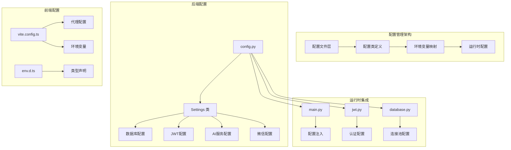
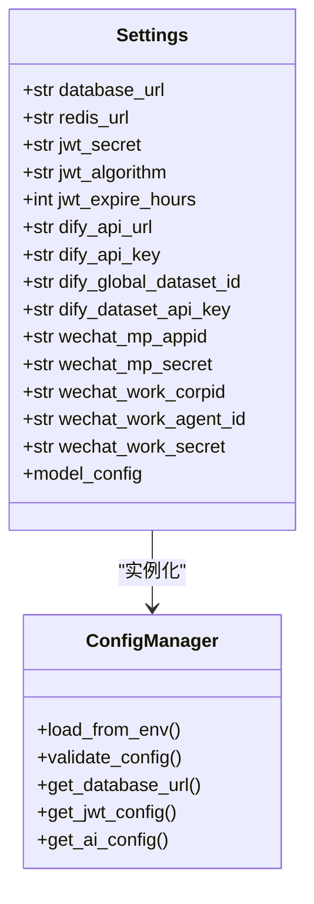
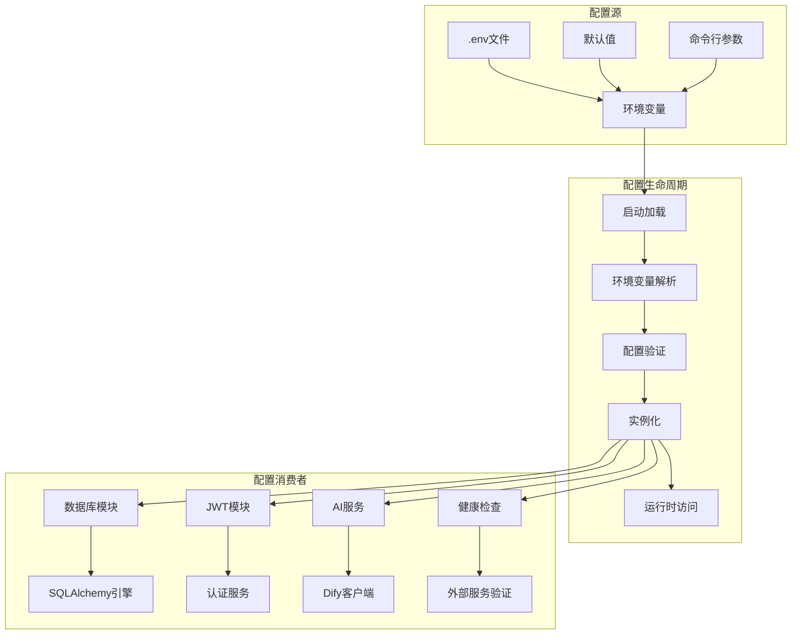
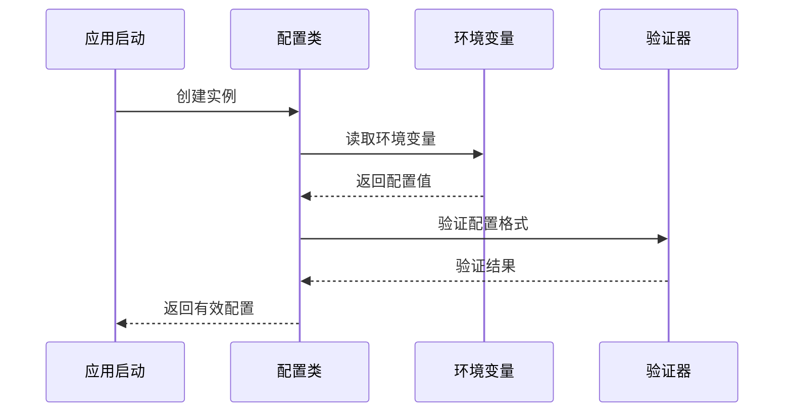
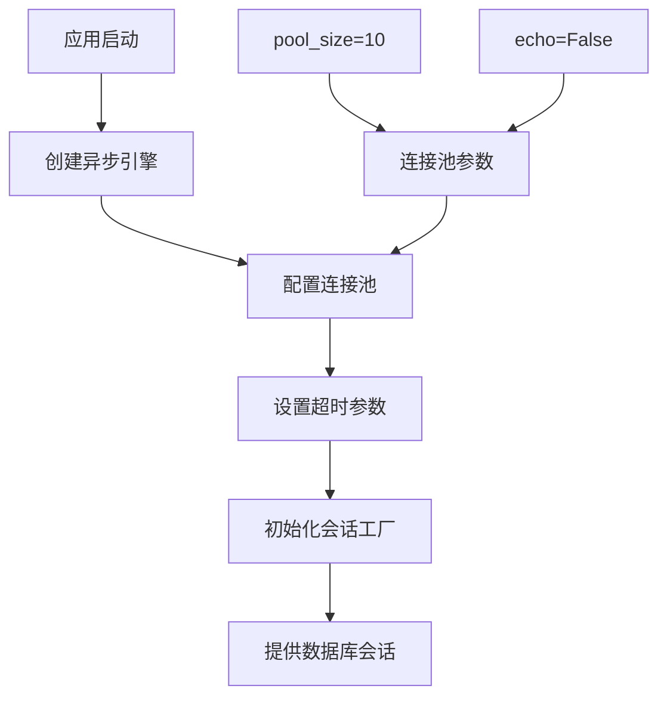
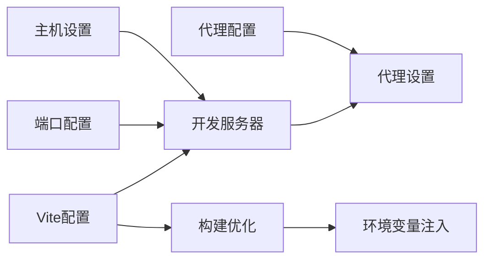
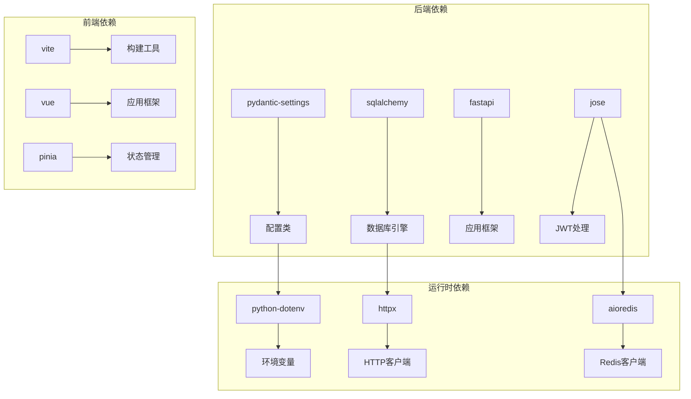

# 配置管理扩展

<cite>
**本文档引用的文件**
- [config.py](file://services/gateway/app/config.py)
- [main.py](file://services/gateway/app/main.py)
- [jwt.py](file://services/gateway/app/utils/jwt.py)
- [database.py](file://services/gateway/app/database.py)
- [auth.py](file://services/gateway/app/routers/auth.py)
- [vite.config.ts（学生端）](file://apps/student-app/vite.config.ts)
- [vite.config.ts（教师端）](file://apps/teacher-app/vite.config.ts)
- [main.ts（学生端）](file://apps/student-app/src/main.ts)
- [main.ts（教师端）](file://apps/teacher-app/src/main.ts)
</cite>

## 目录
1. [简介](#简介)
2. [项目结构](#项目结构)
3. [核心组件](#核心组件)
4. [架构概览](#架构概览)
5. [详细组件分析](#详细组件分析)
6. [依赖分析](#依赖分析)
7. [性能考虑](#性能考虑)
8. [故障排除指南](#故障排除指南)
9. [结论](#结论)

## 简介

本文档提供了配置管理扩展的综合指南，基于现有代码库中的配置体系进行深入分析。该系统采用分层配置管理模式，包括：

- **后端配置管理**：使用 Pydantic Settings 实现强类型配置管理
- **前端环境配置**：通过 Vite 配置和构建时环境变量管理
- **运行时配置更新**：支持配置的动态加载和验证
- **多环境部署**：支持开发、测试、生产环境的差异化配置

系统当前包含数据库连接、JWT 认证、AI 服务集成、微信集成等关键配置模块。

## 项目结构

**图表来源**
- [config.py:1-31](file://services/gateway/app/config.py#L1-L31)
- [vite.config.ts:1-22](file://apps/student-app/vite.config.ts#L1-L22)

**章节来源**
- [config.py:1-31](file://services/gateway/app/config.py#L1-L31)
- [vite.config.ts:1-22](file://apps/student-app/vite.config.ts#L1-L22)

## 核心组件

### 配置类设计模式

系统采用 Pydantic Settings 基础类实现统一的配置管理：

**图表来源**
- [config.py:3-28](file://services/gateway/app/config.py#L3-L28)

### 配置分类结构

系统配置按功能域进行模块化管理：

| 配置类别 | 关键字段 | 默认值 | 用途 |
|---------|----------|--------|------|
| 数据库 | `database_url`, `redis_url` | 开发环境默认值 | 持久化存储和缓存 |
| JWT | `jwt_secret`, `jwt_algorithm`, `jwt_expire_hours` | 安全令牌管理 | 用户身份认证 |
| AI服务 | `dify_api_url`, `dify_api_key` | 服务集成 | 人工智能对话功能 |
| 微信集成 | `wechat_mp_appid`, `wechat_work_*` | 第三方平台 | 微信公众号和企业微信 |

**章节来源**
- [config.py:6-26](file://services/gateway/app/config.py#L6-L26)

## 架构概览

**图表来源**
- [config.py:28-30](file://services/gateway/app/config.py#L28-L30)
- [main.py:7-8](file://services/gateway/app/main.py#L7-L8)

## 详细组件分析

### 后端配置管理

#### 配置类实现

配置类采用 Pydantic Settings 提供的类型安全特性：

**图表来源**
- [config.py:1-31](file://services/gateway/app/config.py#L1-L31)

#### 配置验证机制

系统实现了多层次的配置验证：

1. **类型验证**：Pydantic 自动验证字段类型
2. **格式验证**：URL 格式、JWT 算法等特定格式检查
3. **必需性验证**：关键配置项的强制校验

**章节来源**
- [config.py:3-28](file://services/gateway/app/config.py#L3-L28)

### JWT 认证配置扩展

#### 当前配置结构

JWT 配置包含三个核心参数：

| 参数名 | 类型 | 默认值 | 说明 |
|--------|------|--------|------|
| `jwt_secret` | str | "change-me-in-production" | 密钥材料 |
| `jwt_algorithm` | str | "HS256" | 加密算法 |
| `jwt_expire_hours` | int | 72 | 过期时间（小时） |

#### 扩展实现示例

要添加新的 JWT 配置选项，可以按照以下步骤进行：

1. **添加配置字段**：在 Settings 类中添加新字段
2. **设置默认值**：提供合理的默认值
3. **更新验证逻辑**：如有需要添加自定义验证
4. **集成到认证流程**：修改 JWT 工具函数

**章节来源**
- [jwt.py:6-16](file://services/gateway/app/utils/jwt.py#L6-L16)

### 数据库连接配置

#### 连接池配置

数据库连接采用异步 SQLAlchemy 引擎配置：

**图表来源**
- [database.py:6-7](file://services/gateway/app/database.py#L6-L7)

#### 连接管理

数据库会话采用异步生成器模式管理：

**章节来源**
- [database.py:12-15](file://services/gateway/app/database.py#L12-L15)

### AI 服务配置扩展

#### Dify 集成配置

AI 服务配置包含多个关键参数：

| 参数名 | 用途 | 必需性 |
|--------|------|--------|
| `dify_api_url` | 服务端点地址 | 是 |
| `dify_api_key` | API 访问密钥 | 是 |
| `dify_global_dataset_id` | 全局数据集ID | 可选 |
| `dify_dataset_api_key` | 数据集访问密钥 | 可选 |

#### 健康检查集成

系统在健康检查中集成 AI 服务可用性验证：

**章节来源**
- [main.py:51-61](file://services/gateway/app/main.py#L51-L61)

### 前端环境配置

#### Vite 配置管理

前端应用通过 Vite 进行环境配置管理：

**图表来源**
- [vite.config.ts:6-20](file://apps/student-app/vite.config.ts#L6-L20)

#### 环境变量处理

前端环境变量通过 Vite 的 `envPrefix` 机制处理：

**章节来源**
- [vite.config.ts:1-22](file://apps/student-app/vite.config.ts#L1-L22)

## 依赖分析

**图表来源**
- [config.py:1](file://services/gateway/app/config.py#L1)
- [main.py:1](file://services/gateway/app/main.py#L1)

**章节来源**
- [config.py:1](file://services/gateway/app/config.py#L1)
- [main.py:1](file://services/gateway/app/main.py#L1)

## 性能考虑

### 配置加载性能

1. **延迟加载**：配置在首次访问时才进行环境变量解析
2. **缓存机制**：Pydantic Settings 提供内置缓存
3. **最小化 I/O**：仅在应用启动时读取环境变量文件

### 连接池优化

数据库连接池配置考虑了并发访问需求：

- **连接数限制**：pool_size=10 控制最大并发连接
- **会话过期**：expire_on_commit=False 减少会话管理开销
- **异步处理**：使用异步引擎支持高并发请求

## 故障排除指南

### 常见配置问题

#### 环境变量未生效

**症状**：配置值仍使用默认值而非环境变量

**排查步骤**：
1. 检查 .env 文件路径是否正确
2. 验证环境变量名称大小写
3. 确认文件编码为 UTF-8

#### JWT 配置错误

**症状**：JWT 令牌生成或验证失败

**排查步骤**：
1. 验证 `jwt_secret` 是否足够复杂
2. 检查 `jwt_algorithm` 支持情况
3. 确认 `jwt_expire_hours` 设置合理

#### 数据库连接失败

**症状**：应用启动时报数据库连接错误

**排查步骤**：
1. 验证 `database_url` 格式正确
2. 检查数据库服务状态
3. 确认网络连通性

**章节来源**
- [config.py:28](file://services/gateway/app/config.py#L28)

## 结论

该配置管理体系提供了完整的配置管理解决方案，具有以下特点：

1. **类型安全**：使用 Pydantic 提供编译时和运行时类型检查
2. **环境隔离**：支持多环境配置和环境变量覆盖
3. **运行时验证**：配置在加载时进行格式和必需性验证
4. **模块化设计**：按功能域组织配置，便于维护和扩展
5. **性能优化**：采用延迟加载和缓存机制提升启动性能

通过遵循本文档提供的扩展指南，可以在保持现有配置体系稳定性的前提下，安全地添加新的配置项和功能模块。