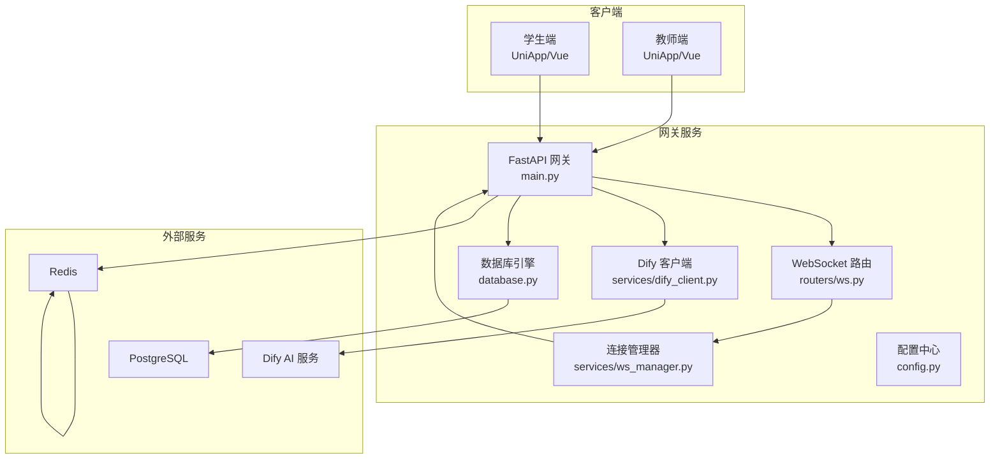
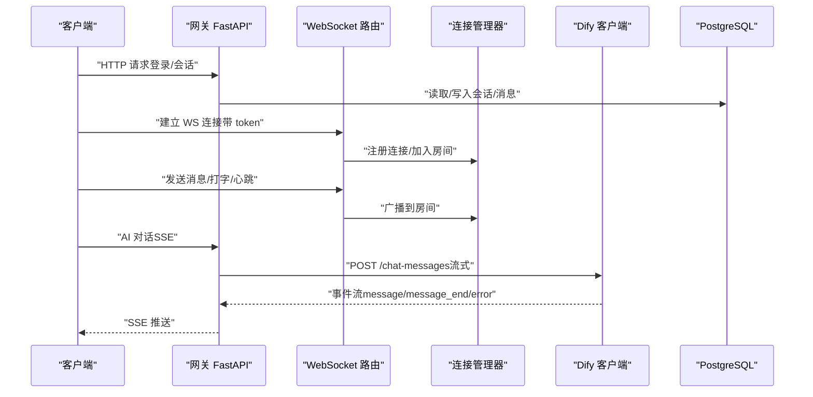
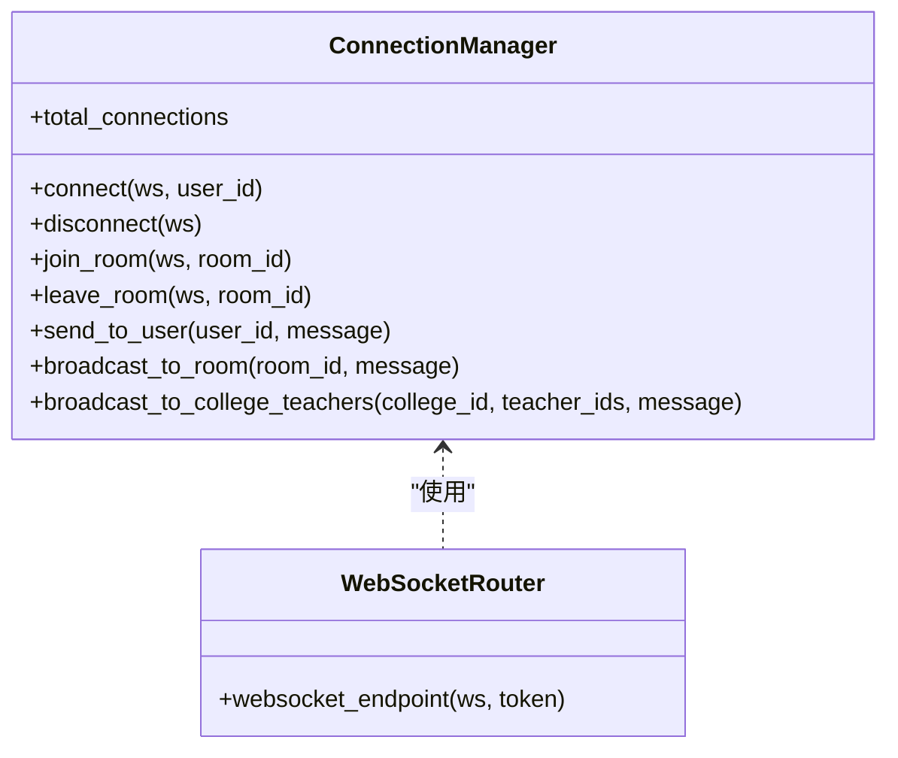
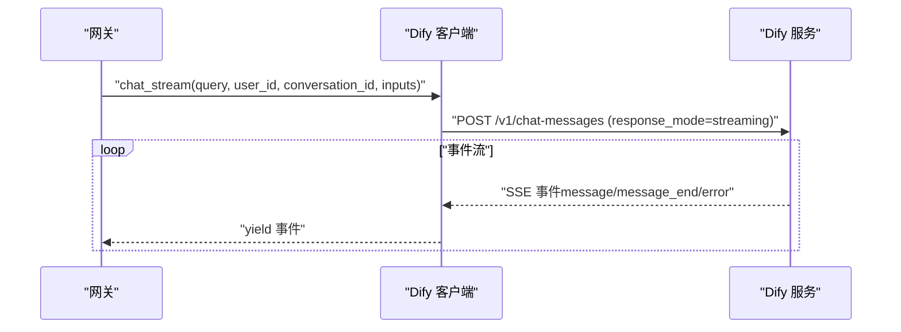
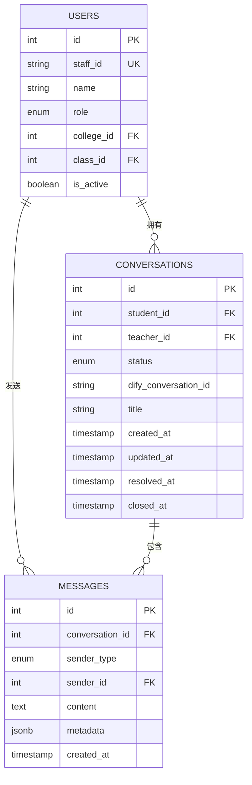
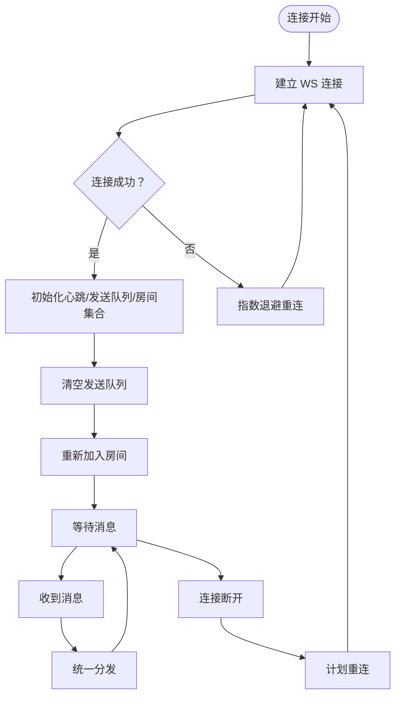
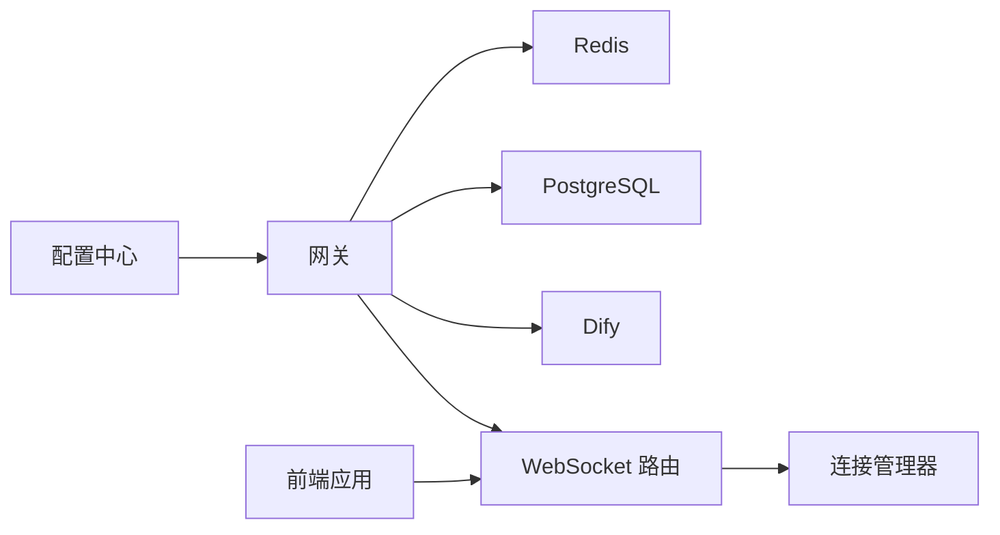

# 性能优化与规模化扩展

<cite>
**本文档引用的文件**
- [services/gateway/app/main.py](file://services/gateway/app/main.py)
- [services/gateway/app/config.py](file://services/gateway/app/config.py)
- [services/gateway/app/database.py](file://services/gateway/app/database.py)
- [services/gateway/app/routers/ws.py](file://services/gateway/app/routers/ws.py)
- [services/gateway/app/services/ws_manager.py](file://services/gateway/app/services/ws_manager.py)
- [services/gateway/app/services/dify_client.py](file://services/gateway/app/services/dify_client.py)
- [services/gateway/app/models/conversation.py](file://services/gateway/app/models/conversation.py)
- [services/gateway/app/models/user.py](file://services/gateway/app/models/user.py)
- [services/gateway/app/utils/deps.py](file://services/gateway/app/utils/deps.py)
- [apps/student-app/src/utils/websocket.ts](file://apps/student-app/src/utils/websocket.ts)
- [apps/teacher-app/src/utils/websocket.ts](file://apps/teacher-app/src/utils/websocket.ts)
- [apps/student-app/src/pages/chat/index.vue](file://apps/student-app/src/pages/chat/index.vue)
- [apps/teacher-app/src/pages/dashboard/index.vue](file://apps/teacher-app/src/pages/dashboard/index.vue)
- [deploy/docker-compose.yml](file://deploy/docker-compose.yml)
- [scripts/s2-ws-test.py](file://scripts/s2-ws-test.py)
</cite>

## 目录
1. [引言](#引言)
2. [项目结构](#项目结构)
3. [核心组件](#核心组件)
4. [架构总览](#架构总览)
5. [详细组件分析](#详细组件分析)
6. [依赖分析](#依赖分析)
7. [性能考量](#性能考量)
8. [故障排查指南](#故障排查指南)
9. [结论](#结论)
10. [附录](#附录)

## 引言
本指南面向“医小管 v2”项目的性能优化与规模化扩展，聚焦以下目标：
- 识别并优化系统性能瓶颈：数据库、缓存、并发与网络
- 设计水平/垂直扩展方案：负载均衡、集群部署、微服务拆分
- 提供具体优化案例：WebSocket 连接、AI 服务调用、数据库查询
- 构建监控指标、性能测试与容量规划体系
- 覆盖高可用、灾难恢复与弹性伸缩等高级主题

## 项目结构
系统采用前后端分离与网关聚合的架构：
- 网关服务（FastAPI）：统一入口、鉴权、路由与外部服务编排
- 前端应用（Vue + UniApp）：学生端与教师端，分别管理 WebSocket 连接与消息流
- 外部服务：Dify AI 服务（流式聊天）、PostgreSQL（持久化）、Redis（缓存）
- 部署：Docker Compose 编排

图表来源
- [services/gateway/app/main.py:1-78](file://services/gateway/app/main.py#L1-L78)
- [services/gateway/app/routers/ws.py:1-119](file://services/gateway/app/routers/ws.py#L1-L119)
- [services/gateway/app/services/ws_manager.py:1-100](file://services/gateway/app/services/ws_manager.py#L1-L100)
- [services/gateway/app/services/dify_client.py:1-105](file://services/gateway/app/services/dify_client.py#L1-L105)
- [services/gateway/app/database.py:1-15](file://services/gateway/app/database.py#L1-L15)
- [services/gateway/app/config.py:1-31](file://services/gateway/app/config.py#L1-L31)

章节来源
- [services/gateway/app/main.py:1-78](file://services/gateway/app/main.py#L1-L78)
- [services/gateway/app/config.py:1-31](file://services/gateway/app/config.py#L1-L31)
- [deploy/docker-compose.yml:1-22](file://deploy/docker-compose.yml#L1-L22)

## 核心组件
- 网关主程序：健康检查、生命周期管理 Redis、挂载路由
- WebSocket 路由与连接管理：JWT 认证、房间广播、心跳与重连
- Dify 客户端：流式调用与文档创建
- 数据库与模型：异步 SQLAlchemy 引擎、索引优化
- 前端 WebSocket 管理器：连接池、重连指数退避、发送队列、房间重入
- 配置中心：数据库、Redis、JWT、Dify 参数

章节来源
- [services/gateway/app/main.py:16-68](file://services/gateway/app/main.py#L16-L68)
- [services/gateway/app/routers/ws.py:11-119](file://services/gateway/app/routers/ws.py#L11-L119)
- [services/gateway/app/services/ws_manager.py:8-99](file://services/gateway/app/services/ws_manager.py#L8-L99)
- [services/gateway/app/services/dify_client.py:11-105](file://services/gateway/app/services/dify_client.py#L11-L105)
- [services/gateway/app/database.py:6-14](file://services/gateway/app/database.py#L6-L14)
- [apps/student-app/src/utils/websocket.ts:1-153](file://apps/student-app/src/utils/websocket.ts#L1-L153)
- [apps/teacher-app/src/utils/websocket.ts:1-169](file://apps/teacher-app/src/utils/websocket.ts#L1-L169)

## 架构总览
网关作为统一入口，负责：
- 鉴权与会话管理（JWT）
- WebSocket 连接与房间广播
- 调用 Dify AI 服务进行流式对话
- 访问 PostgreSQL 存储会话与消息
- 使用 Redis 进行缓存与状态存储

图表来源
- [services/gateway/app/routers/ws.py:11-119](file://services/gateway/app/routers/ws.py#L11-L119)
- [services/gateway/app/services/ws_manager.py:25-95](file://services/gateway/app/services/ws_manager.py#L25-L95)
- [services/gateway/app/services/dify_client.py:22-69](file://services/gateway/app/services/dify_client.py#L22-L69)
- [services/gateway/app/database.py:6-14](file://services/gateway/app/database.py#L6-L14)

## 详细组件分析

### WebSocket 连接与广播
- 连接管理器维护两类映射：用户到连接集合、房间到连接集合，并提供清理与广播能力
- 路由层完成 JWT 校验、房间加入/离开、打字广播与错误处理
- 前端实现指数退避重连、心跳保活、发送队列与房间重入

图表来源
- [services/gateway/app/services/ws_manager.py:8-99](file://services/gateway/app/services/ws_manager.py#L8-L99)
- [services/gateway/app/routers/ws.py:11-119](file://services/gateway/app/routers/ws.py#L11-L119)

章节来源
- [services/gateway/app/services/ws_manager.py:1-100](file://services/gateway/app/services/ws_manager.py#L1-L100)
- [services/gateway/app/routers/ws.py:1-119](file://services/gateway/app/routers/ws.py#L1-L119)
- [apps/student-app/src/utils/websocket.ts:20-153](file://apps/student-app/src/utils/websocket.ts#L20-L153)
- [apps/teacher-app/src/utils/websocket.ts:26-169](file://apps/teacher-app/src/utils/websocket.ts#L26-L169)

### AI 服务调用（Dify）
- 使用异步 HTTP 客户端与 SSE 连接，流式消费 Dify 事件
- 对非 JSON 数据进行告警记录，避免阻塞事件流
- 提供文档创建接口以支持知识库迁移

图表来源
- [services/gateway/app/services/dify_client.py:22-69](file://services/gateway/app/services/dify_client.py#L22-L69)

章节来源
- [services/gateway/app/services/dify_client.py:1-105](file://services/gateway/app/services/dify_client.py#L1-L105)

### 数据库模型与查询优化
- 会话与消息表均建立复合索引，加速状态与时间维度查询
- 使用异步 SQLAlchemy 引擎，连接池大小为 10
- 建议在高并发场景下结合只读副本与查询拆分

图表来源
- [services/gateway/app/models/conversation.py:26-63](file://services/gateway/app/models/conversation.py#L26-L63)
- [services/gateway/app/models/user.py:45-76](file://services/gateway/app/models/user.py#L45-L76)

章节来源
- [services/gateway/app/models/conversation.py:1-63](file://services/gateway/app/models/conversation.py#L1-L63)
- [services/gateway/app/models/user.py:1-76](file://services/gateway/app/models/user.py#L1-L76)
- [services/gateway/app/database.py:6-14](file://services/gateway/app/database.py#L6-L14)

### 前端 WebSocket 管理器
- 单连接模式，支持小程序与 H5
- 指数退避重连、心跳保活、发送队列与房间重入
- 统一分发消息类型，过滤心跳包

图表来源
- [apps/student-app/src/utils/websocket.ts:20-153](file://apps/student-app/src/utils/websocket.ts#L20-L153)
- [apps/teacher-app/src/utils/websocket.ts:26-169](file://apps/teacher-app/src/utils/websocket.ts#L26-L169)

章节来源
- [apps/student-app/src/utils/websocket.ts:1-153](file://apps/student-app/src/utils/websocket.ts#L1-L153)
- [apps/teacher-app/src/utils/websocket.ts:1-169](file://apps/teacher-app/src/utils/websocket.ts#L1-L169)

## 依赖分析
- 网关依赖 Redis（连接池）、PostgreSQL（异步引擎）、Dify（HTTP/SSE）
- WebSocket 路由依赖 JWT 解码与连接管理器
- 前端依赖 UniApp Socket API 与自研 WebSocket 管理器

图表来源
- [services/gateway/app/main.py:16-28](file://services/gateway/app/main.py#L16-L28)
- [services/gateway/app/config.py:6-19](file://services/gateway/app/config.py#L6-L19)
- [services/gateway/app/routers/ws.py:35-42](file://services/gateway/app/routers/ws.py#L35-L42)
- [services/gateway/app/services/ws_manager.py:20-23](file://services/gateway/app/services/ws_manager.py#L20-L23)

章节来源
- [services/gateway/app/main.py:1-78](file://services/gateway/app/main.py#L1-L78)
- [services/gateway/app/config.py:1-31](file://services/gateway/app/config.py#L1-L31)

## 性能考量

### 数据库优化
- 索引策略
  - 会话表：学生 ID、状态字段索引，支撑按学生与状态查询
  - 消息表：会话 ID、会话+时间复合索引，支撑分页与时间序列查询
- 连接池与并发
  - 当前连接池大小为 10；建议根据 QPS 与慢查询分析动态调整
  - 引入只读副本，将报表类查询分流至只读实例
- 查询优化
  - 使用分页与游标翻页，避免 OFFSET 大量数据
  - 对高频统计查询引入物化视图或缓存

章节来源
- [services/gateway/app/models/conversation.py:26-63](file://services/gateway/app/models/conversation.py#L26-L63)
- [services/gateway/app/database.py:6-14](file://services/gateway/app/database.py#L6-L14)

### 缓存策略
- Redis 用途
  - 会话状态、限流令牌、用户信息、热点查询结果
  - 建议对会话详情、消息列表、知识条目进行缓存
- 缓存一致性
  - 写路径采用“先写数据库，再更新/删除缓存”
  - 读路径采用“缓存命中优先，未命中回源并回填”

章节来源
- [services/gateway/app/main.py:18-22](file://services/gateway/app/main.py#L18-L22)
- [services/gateway/app/utils/deps.py:38-40](file://services/gateway/app/utils/deps.py#L38-L40)

### 并发与网络
- WebSocket
  - 连接管理器使用集合存储连接，广播复杂度 O(n)
  - 建议按房间拆分连接池或引入房间级广播队列
  - 前端心跳间隔 30 秒，建议在网关侧增加更细粒度的心跳检测
- SSE 与 AI 服务
  - Dify 客户端使用异步 HTTP 客户端，注意超时与重试
  - 建议对 Dify 调用增加熔断与降级策略

章节来源
- [services/gateway/app/services/ws_manager.py:71-81](file://services/gateway/app/services/ws_manager.py#L71-L81)
- [services/gateway/app/services/dify_client.py:55-69](file://services/gateway/app/services/dify_client.py#L55-L69)

### 水平扩展与集群
- 负载均衡
  - 使用 Nginx 或反向代理，基于会话粘性或轮询策略
  - WebSocket 连接需确保粘性或采用共享状态
- 集群部署
  - 网关多实例部署，共享 PostgreSQL 与 Redis
  - Docker Compose 示例已提供基础编排
- 微服务拆分（演进方向）
  - 将会话管理、消息持久化、知识库服务独立为微服务
  - 通过事件总线解耦，引入消息队列（如 Kafka/RabbitMQ）

章节来源
- [deploy/docker-compose.yml:1-22](file://deploy/docker-compose.yml#L1-L22)

### 监控指标与性能测试
- 关键指标
  - 网关：请求延迟（P50/P95/P99）、错误率、并发连接数、Redis/PG 使用率
  - WebSocket：连接成功率、掉线率、广播延迟、房间规模
  - AI 服务：Dify 调用延迟、失败率、超时比例
- 性能测试
  - 使用脚本进行 WebSocket 冒烟测试，验证 ping/pong、房间加入、未知类型处理与无效 token 场景
  - 建议引入压力测试工具（如 k6/JMeter）模拟高并发场景

章节来源
- [scripts/s2-ws-test.py:8-51](file://scripts/s2-ws-test.py#L8-L51)
- [services/gateway/app/main.py:30-68](file://services/gateway/app/main.py#L30-L68)

### 容量规划
- 基于历史峰值与增长趋势估算 CPU/内存/IO/网络带宽
- 评估 WebSocket 连接数上限与广播成本，预留 30%-50% 缓冲
- 评估 Dify 调用量与并发，确保外部服务 SLA 满足

### 高可用与弹性伸缩
- 高可用
  - PostgreSQL 主从复制、自动故障转移
  - Redis Sentinel 或集群模式
  - 网关多副本部署，健康检查失败自动摘除
- 弹性伸缩
  - 基于 CPU/连接数/队列长度触发扩缩容
  - WebSocket 连接数达到阈值时自动扩容网关实例

## 故障排查指南
- WebSocket 连接问题
  - 检查前端心跳是否正常、重连次数是否超过最大限制
  - 后端连接管理器是否正确清理断开连接
- 认证失败
  - JWT 解码异常会导致连接被关闭，检查 token 生成与有效期
- Dify 调用异常
  - 观察超时与非 JSON 数据告警，必要时增加重试与熔断
- 数据库慢查询
  - 分析索引使用情况，补充缺失索引或改写查询

章节来源
- [services/gateway/app/routers/ws.py:35-42](file://services/gateway/app/routers/ws.py#L35-L42)
- [services/gateway/app/services/dify_client.py:64-68](file://services/gateway/app/services/dify_client.py#L64-L68)
- [apps/student-app/src/utils/websocket.ts:129-135](file://apps/student-app/src/utils/websocket.ts#L129-L135)

## 结论
通过数据库索引优化、缓存策略、并发与网络层面的改进，以及合理的水平/垂直扩展与高可用设计，系统可在保证用户体验的同时实现稳定扩展。建议持续完善监控与压测体系，配合容量规划与弹性伸缩机制，确保在业务高峰期间仍能保持低延迟与高可用。

## 附录

### 优化案例清单
- WebSocket 连接优化：心跳保活、指数退避、发送队列、房间重入
- AI 服务调用优化：异步客户端、SSE 事件流、超时与重试、熔断降级
- 数据库查询优化：索引设计、连接池调优、只读副本与查询拆分

### 前端页面与 WebSocket 集成要点
- 学生端聊天页：会话加载、消息渲染、流式接收、来源弹层
- 教师端工作台：待处理提问列表、状态展示、快捷操作

章节来源
- [apps/student-app/src/pages/chat/index.vue:279-326](file://apps/student-app/src/pages/chat/index.vue#L279-L326)
- [apps/teacher-app/src/pages/dashboard/index.vue:200-211](file://apps/teacher-app/src/pages/dashboard/index.vue#L200-L211)