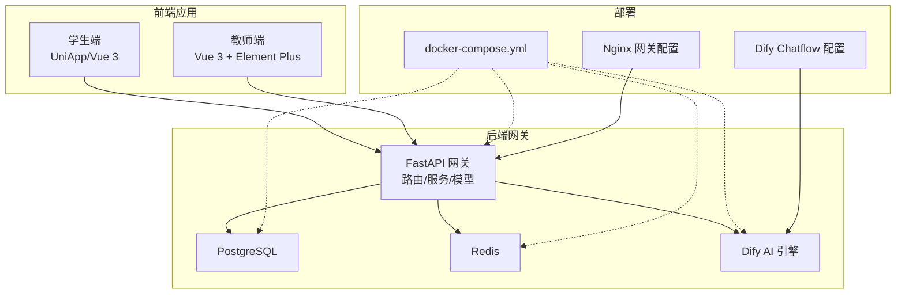
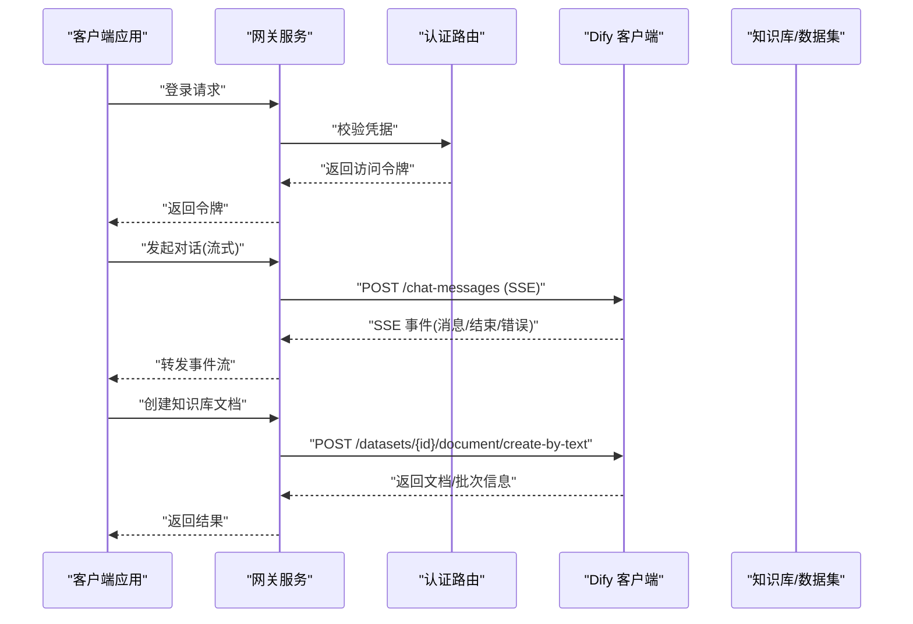
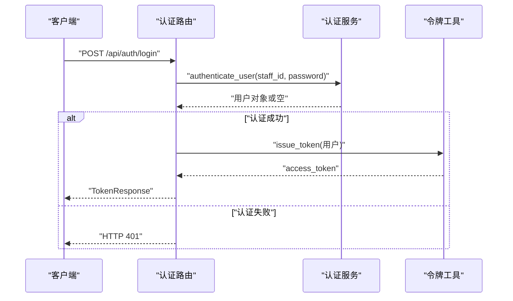
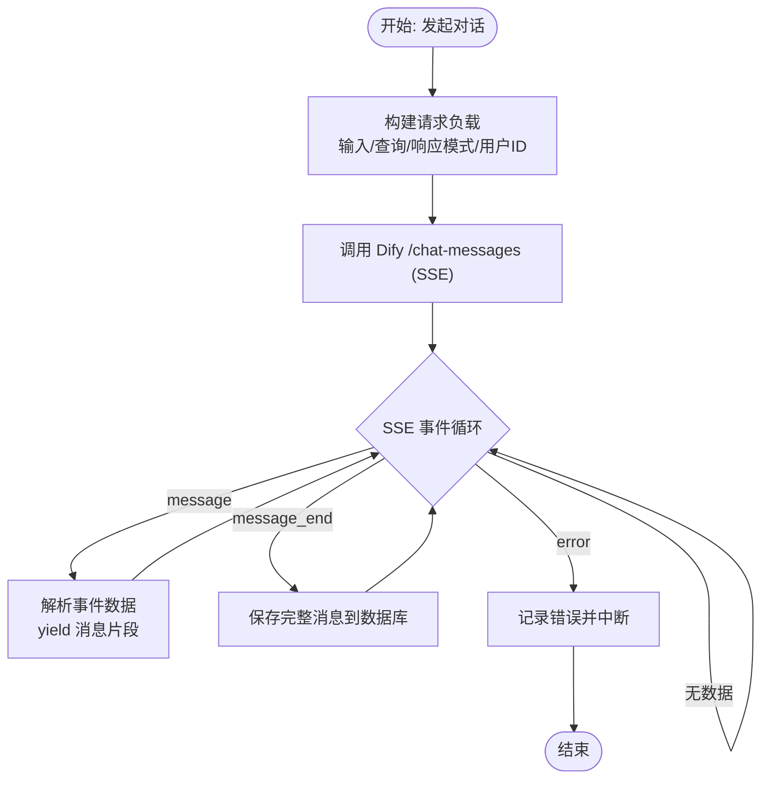
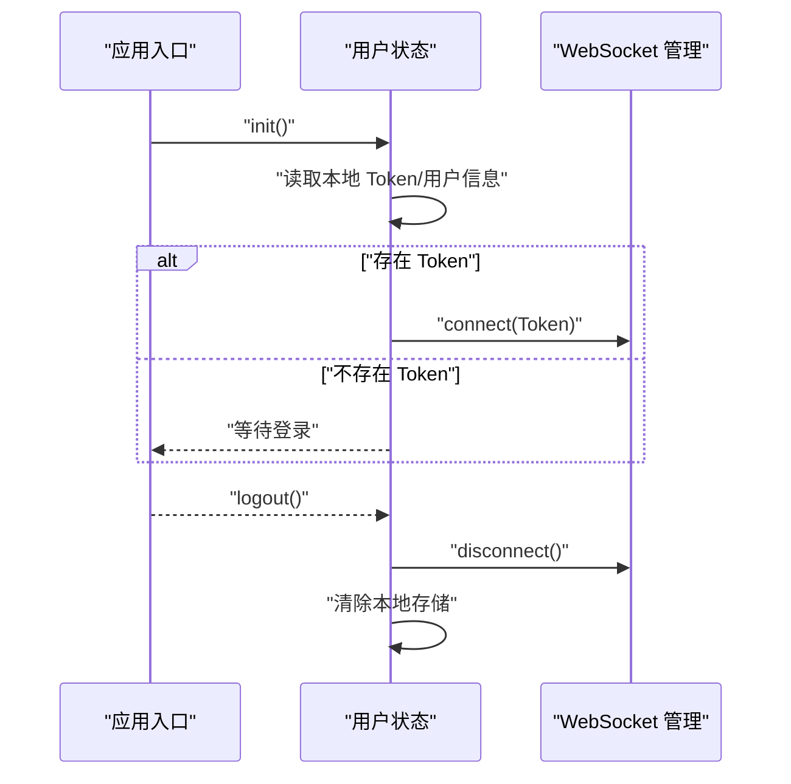
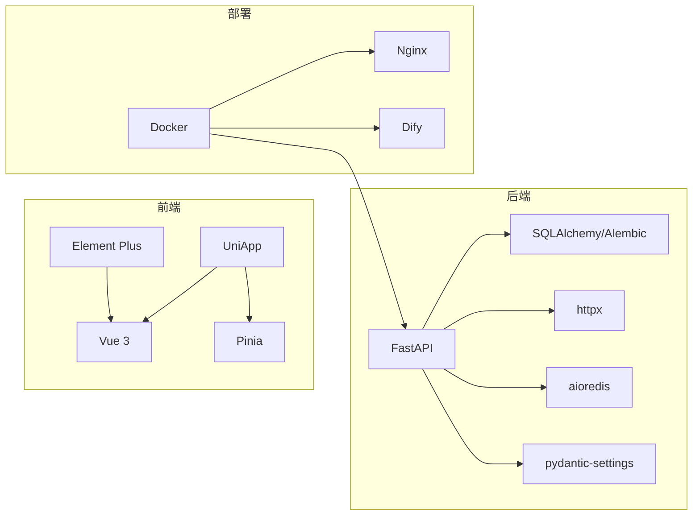

# 扩展与定制

<cite>
**本文引用的文件**
- [README.md](file://README.md)
- [.teb/antipatterns.md](file://.teb/antipatterns.md)
- [services/gateway/app/main.py](file://services/gateway/app/main.py)
- [services/gateway/app/config.py](file://services/gateway/app/config.py)
- [services/gateway/app/routers/auth.py](file://services/gateway/app/routers/auth.py)
- [services/gateway/app/services/dify_client.py](file://services/gateway/app/services/dify_client.py)
- [services/gateway/app/models/user.py](file://services/gateway/app/models/user.py)
- [services/gateway/app/schemas/auth.py](file://services/gateway/app/schemas/auth.py)
- [apps/student-app/src/main.ts](file://apps/student-app/src/main.ts)
- [apps/teacher-app/src/main.ts](file://apps/teacher-app/src/main.ts)
- [apps/student-app/src/stores/user.ts](file://apps/student-app/src/stores/user.ts)
- [apps/teacher-app/src/stores/user.ts](file://apps/teacher-app/src/stores/user.ts)
- [apps/student-app/package.json](file://apps/student-app/package.json)
- [apps/teacher-app/package.json](file://apps/teacher-app/package.json)
- [deploy/docker-compose.yml](file://deploy/docker-compose.yml)
- [deploy/nginx/gateway.conf](file://deploy/nginx/gateway.conf)
- [deploy/dify/yixiaoguan-chatflow.yml](file://deploy/dify/yixiaoguan-chatflow.yml)
- [scripts/migrate_kb.py](file://scripts/migrate_kb.py)
- [scripts/seed.py](file://scripts/seed.py)
- [docs/design/dev-plan-v2.md](file://docs/design/dev-plan-v2.md)
- [docs/design/dify-chatflow-design.md](file://docs/design/dify-chatflow-design.md)
- [docs/requirements/R03-开发前确认事项.md](file://docs/requirements/R03-开发前确认事项.md)
- [docs/requirements/R05-KB-增强需求.md](file://docs/requirements/R05-KB-增强需求.md)
</cite>

## 目录
1. [简介](#简介)
2. [项目结构](#项目结构)
3. [核心组件](#核心组件)
4. [架构总览](#架构总览)
5. [详细组件分析](#详细组件分析)
6. [依赖分析](#依赖分析)
7. [性能考虑](#性能考虑)
8. [故障排查指南](#故障排查指南)
9. [结论](#结论)
10. [附录](#附录)

## 简介
本指南面向希望对“医小管 v2”进行扩展与定制的开发者，围绕以下目标展开：
- 插件化扩展与扩展点设计：包括 AI 服务插件、认证插件、通知插件等的接入方式与最佳实践
- TEA 框架的使用与定制：提示词工程、模板系统、抗模式管理
- 第三方服务集成：新的 AI 引擎、数据库、消息队列等
- 配置定制与环境适配：多环境变量、部署配置、Nginx 网关与 Dify 集成
- 性能优化与规模化扩展：连接池、缓存、限流与异步处理

## 项目结构
项目采用前后端分离与多应用并行的组织方式：
- 后端网关服务：FastAPI + SQLAlchemy + Alembic，负责统一鉴权、会话管理、AI 引擎对接与健康检查
- 前端应用：学生端与教师端分别基于 UniApp/Vue 3，共享状态管理与 WebSocket 连接
- 部署与脚本：Docker Compose 编排、Nginx 网关、Dify Chatflow 配置、知识库迁移与种子数据脚本
- TEA 框架：提示词、模板、抗模式等可扩展资源目录

图表来源
- [services/gateway/app/main.py:1-78](file://services/gateway/app/main.py#L1-L78)
- [services/gateway/app/config.py:1-31](file://services/gateway/app/config.py#L1-L31)
- [deploy/docker-compose.yml](file://deploy/docker-compose.yml)
- [deploy/nginx/gateway.conf](file://deploy/nginx/gateway.conf)
- [deploy/dify/yixiaoguan-chatflow.yml](file://deploy/dify/yixiaoguan-chatflow.yml)

章节来源
- [README.md:1-18](file://README.md#L1-L18)
- [apps/student-app/package.json:1-37](file://apps/student-app/package.json#L1-L37)
- [apps/teacher-app/package.json:1-46](file://apps/teacher-app/package.json#L1-L46)

## 核心组件
- 网关主程序与生命周期：负责 Redis 连接注入、健康检查、路由挂载与版本信息输出
- 配置中心：集中管理数据库、Redis、JWT、Dify、微信等配置项，并支持 .env 文件加载
- 认证与用户模型：登录、令牌签发、用户信息查询与角色枚举
- Dify 客户端：封装流式聊天与知识库文档创建接口，支持 SSE 事件解析
- 前端应用入口与状态：Pinia Store 管理登录态、用户信息与 WebSocket 连接初始化

章节来源
- [services/gateway/app/main.py:1-78](file://services/gateway/app/main.py#L1-L78)
- [services/gateway/app/config.py:1-31](file://services/gateway/app/config.py#L1-L31)
- [services/gateway/app/routers/auth.py:1-35](file://services/gateway/app/routers/auth.py#L1-L35)
- [services/gateway/app/models/user.py:1-76](file://services/gateway/app/models/user.py#L1-L76)
- [services/gateway/app/services/dify_client.py:1-105](file://services/gateway/app/services/dify_client.py#L1-L105)
- [apps/student-app/src/main.ts:1-11](file://apps/student-app/src/main.ts#L1-L11)
- [apps/teacher-app/src/main.ts:1-25](file://apps/teacher-app/src/main.ts#L1-L25)

## 架构总览
下图展示从客户端到后端网关再到 AI 引擎的整体调用链路与扩展点。

图表来源
- [services/gateway/app/routers/auth.py:1-35](file://services/gateway/app/routers/auth.py#L1-L35)
- [services/gateway/app/services/dify_client.py:1-105](file://services/gateway/app/services/dify_client.py#L1-L105)
- [services/gateway/app/main.py:1-78](file://services/gateway/app/main.py#L1-L78)

## 详细组件分析

### 网关服务与扩展点
- 生命周期与健康检查：在应用启动时建立 Redis 连接，关闭时释放；提供 /health 接口检查数据库、缓存与 Dify 可用性
- 路由挂载点：当前已挂载认证、会话、动作、WebSocket 与聊天路由；预留知识库路由挂载点
- 扩展建议：
  - 新增路由：遵循现有命名空间与标签规范，按领域拆分模块
  - 插件化中间件：在路由层增加统一鉴权、限流、审计日志中间件
  - 多引擎适配：通过配置切换不同 AI 引擎，保持统一接口

章节来源
- [services/gateway/app/main.py:16-78](file://services/gateway/app/main.py#L16-L78)

### 配置管理与环境适配
- 配置类集中定义：数据库、Redis、JWT、Dify、微信等参数
- 环境变量加载：通过 .env 文件注入，支持生产环境安全覆盖
- 环境适配建议：
  - 开发/测试/生产三套 .env 文件，区分端口与密钥
  - Nginx 层做反向代理与静态资源分发，结合上游健康检查
  - Docker Compose 统一编排，确保服务间网络连通与依赖顺序

章节来源
- [services/gateway/app/config.py:1-31](file://services/gateway/app/config.py#L1-L31)
- [deploy/docker-compose.yml](file://deploy/docker-compose.yml)
- [deploy/nginx/gateway.conf](file://deploy/nginx/gateway.conf)

### 认证与用户模型
- 登录流程：接收学号/工号与密码，验证失败返回 401
- 令牌签发：基于用户信息生成 JWT，包含角色与基础属性
- 用户模型：角色枚举、平台绑定、学院/班级关联
- 扩展建议：
  - 多因子认证：在登录阶段增加 MFA
  - 平台解绑与合并：支持跨平台账号合并
  - 角色权限细化：引入 RBAC 或基于角色的细粒度权限

图表来源
- [services/gateway/app/routers/auth.py:12-21](file://services/gateway/app/routers/auth.py#L12-L21)
- [services/gateway/app/schemas/auth.py:1-23](file://services/gateway/app/schemas/auth.py#L1-L23)
- [services/gateway/app/models/user.py:45-58](file://services/gateway/app/models/user.py#L45-L58)

章节来源
- [services/gateway/app/routers/auth.py:1-35](file://services/gateway/app/routers/auth.py#L1-L35)
- [services/gateway/app/schemas/auth.py:1-23](file://services/gateway/app/schemas/auth.py#L1-L23)
- [services/gateway/app/models/user.py:1-76](file://services/gateway/app/models/user.py#L1-L76)

### Dify 客户端与 AI 插件化
- 流式聊天：封装 SSE 事件，支持消息增量与结束事件
- 知识库文档创建：按文本创建文档并返回批次信息
- 抗模式管理：通过 .teb/antipatterns.md 记录与沉淀常见错误模式，指导提示词编写与任务范围约束
- 扩展建议：
  - 多引擎适配器：抽象统一的 Chat/Embedding 接口，按配置切换实现
  - 提示词工程：将提示词与模板分离，支持版本化与 A/B 实验
  - 会话上下文：在事件中携带 conversation_id，便于持久化与检索

图表来源
- [services/gateway/app/services/dify_client.py:22-69](file://services/gateway/app/services/dify_client.py#L22-L69)

章节来源
- [services/gateway/app/services/dify_client.py:1-105](file://services/gateway/app/services/dify_client.py#L1-L105)
- [.teb/antipatterns.md:1-25](file://.teb/antipatterns.md#L1-L25)

### 前端应用与状态管理
- 应用入口：创建 SSR 应用与 Pinia，教师端在初始化时尝试自动登录并建立 WebSocket
- 用户状态：Token 与用户信息本地持久化，登出清理存储并断开连接
- 扩展建议：
  - 统一拦截器：在请求前注入 Token，处理 401 自动跳转登录
  - 多语言与主题：结合 i18n 与主题变量，支持动态切换
  - WebSocket 管理：抽象连接池与重连策略，支持多标签页共享状态

图表来源
- [apps/teacher-app/src/main.ts:9-19](file://apps/teacher-app/src/main.ts#L9-L19)
- [apps/student-app/src/stores/user.ts:24-34](file://apps/student-app/src/stores/user.ts#L24-L34)
- [apps/teacher-app/src/stores/user.ts:19-28](file://apps/teacher-app/src/stores/user.ts#L19-L28)

章节来源
- [apps/student-app/src/main.ts:1-11](file://apps/student-app/src/main.ts#L1-L11)
- [apps/teacher-app/src/main.ts:1-25](file://apps/teacher-app/src/main.ts#L1-L25)
- [apps/student-app/src/stores/user.ts:1-56](file://apps/student-app/src/stores/user.ts#L1-L56)
- [apps/teacher-app/src/stores/user.ts:1-63](file://apps/teacher-app/src/stores/user.ts#L1-L63)

### TEA 框架与定制
- 抗模式管理：以清单形式沉淀常见错误模式，指导任务边界与提示词约束
- 提示词工程：建议将提示词与模板分离，支持版本化与灰度实验
- 模板系统：为不同角色与场景提供可复用模板，降低重复劳动
- 最佳实践：
  - 任务前先审阅抗模式，明确 out_of_scope
  - 将复杂提示词拆分为多个子提示词，逐步构建上下文
  - 对外暴露最小接口，内部通过适配器屏蔽具体实现差异

章节来源
- [.teb/antipatterns.md:1-25](file://.teb/antipatterns.md#L1-L25)

### 第三方服务集成指南
- 新的 AI 引擎：
  - 抽象统一接口：Chat/Embedding/评分
  - 适配器实现：按配置选择 Dify 或其他引擎
  - 事件映射：将 SSE/回调转换为统一事件流
- 数据库：
  - 使用 SQLAlchemy ORM 管理实体与关系
  - 通过 Alembic 进行迁移管理，确保版本一致
- 消息队列：
  - 引入异步任务队列（如 Celery/RQ），将长耗时任务异步化
  - 与 WebSocket 结合，推送任务进度与结果

章节来源
- [services/gateway/app/models/user.py:1-76](file://services/gateway/app/models/user.py#L1-L76)
- [services/gateway/app/main.py:1-78](file://services/gateway/app/main.py#L1-L78)

### 配置定制与环境适配
- 环境变量：
  - 数据库与缓存：database_url、redis_url
  - 安全：jwt_secret、jwt_algorithm、jwt_expire_hours
  - AI 引擎：dify_api_url、dify_api_key、dify_global_dataset_id、dify_dataset_api_key
  - 微信：微信小程序与企业微信相关配置
- 部署：
  - Docker Compose：统一编排数据库、缓存、网关与 AI 引擎
  - Nginx：反向代理、静态资源与健康检查
  - Chatflow：通过 YAML 配置 Dify 的工作流与触发条件

章节来源
- [services/gateway/app/config.py:1-31](file://services/gateway/app/config.py#L1-L31)
- [deploy/docker-compose.yml](file://deploy/docker-compose.yml)
- [deploy/nginx/gateway.conf](file://deploy/nginx/gateway.conf)
- [deploy/dify/yixiaoguan-chatflow.yml](file://deploy/dify/yixiaoguan-chatflow.yml)

## 依赖分析
- 后端依赖：FastAPI、SQLAlchemy、Alembic、httpx、aioredis、pydantic-settings
- 前端依赖：Vue 3、Pinia、UniApp、Element Plus（教师端）、Sass、TypeScript
- 部署依赖：Docker、Nginx、Dify

图表来源
- [apps/student-app/package.json:11-21](file://apps/student-app/package.json#L11-L21)
- [apps/teacher-app/package.json:11-31](file://apps/teacher-app/package.json#L11-L31)
- [services/gateway/app/main.py:1-14](file://services/gateway/app/main.py#L1-L14)
- [services/gateway/app/config.py:1-31](file://services/gateway/app/config.py#L1-L31)

章节来源
- [apps/student-app/package.json:1-37](file://apps/student-app/package.json#L1-L37)
- [apps/teacher-app/package.json:1-46](file://apps/teacher-app/package.json#L1-L46)

## 性能考虑
- 连接池与超时：
  - 数据库：使用异步连接池，合理设置最大连接数与空闲回收
  - 缓存：Redis 连接池与命令超时控制
  - HTTP：Dify 请求设置合理超时，避免阻塞
- 缓存策略：
  - 热点数据：用户信息、会话摘要、常用知识片段
  - 失效策略：基于 TTL 与写后失效
- 异步与流式：
  - SSE 事件流直传，避免中间缓冲
  - 长轮询替换为 WebSocket，减少连接开销
- 限流与熔断：
  - 基于 IP/用户维度限流
  - Dify 调用熔断与降级（如兜底回复）

## 故障排查指南
- 健康检查：
  - /health 接口返回数据库、Redis、Dify 的可用性状态
  - 关注 degraded 状态，定位具体组件异常
- 认证问题：
  - 登录失败：核对学号/工号与密码是否匹配
  - 令牌无效：检查 JWT 密钥与过期时间
- AI 引擎问题：
  - Chatflow 无响应：检查 Dify API 地址与密钥
  - SSE 解析异常：关注非 JSON 数据与事件格式
- 前端登录态：
  - Token 丢失：检查本地存储与生命周期
  - WebSocket 断连：确认 Token 有效与服务端连接状态

章节来源
- [services/gateway/app/main.py:30-68](file://services/gateway/app/main.py#L30-L68)
- [services/gateway/app/routers/auth.py:12-21](file://services/gateway/app/routers/auth.py#L12-L21)
- [services/gateway/app/services/dify_client.py:61-69](file://services/gateway/app/services/dify_client.py#L61-L69)
- [apps/student-app/src/stores/user.ts:46-52](file://apps/student-app/src/stores/user.ts#L46-L52)
- [apps/teacher-app/src/stores/user.ts:40-47](file://apps/teacher-app/src/stores/user.ts#L40-L47)

## 结论
通过模块化设计、接口抽象与配置中心，医小管 v2 提供了清晰的扩展路径。围绕 TEA 框架的提示词工程与抗模式管理，可显著提升 AI 交互质量与可控性。结合 Docker 与 Nginx 的部署方案，以及对数据库、缓存与 AI 引擎的优化策略，能够支撑系统的性能与规模化扩展。

## 附录
- 设计文档与需求：
  - 开发计划、Dify Chatflow 设计、开发前确认事项、KB 增强需求
- 脚本工具：
  - 知识库迁移与种子数据脚本，辅助快速初始化与回归测试

章节来源
- [docs/design/dev-plan-v2.md](file://docs/design/dev-plan-v2.md)
- [docs/design/dify-chatflow-design.md](file://docs/design/dify-chatflow-design.md)
- [docs/requirements/R03-开发前确认事项.md](file://docs/requirements/R03-开发前确认事项.md)
- [docs/requirements/R05-KB-增强需求.md](file://docs/requirements/R05-KB-增强需求.md)
- [scripts/migrate_kb.py](file://scripts/migrate_kb.py)
- [scripts/seed.py](file://scripts/seed.py)