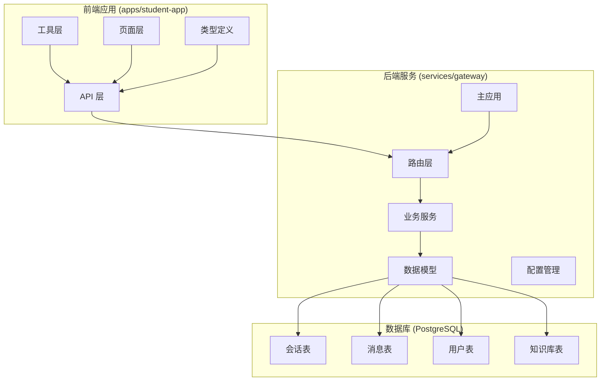
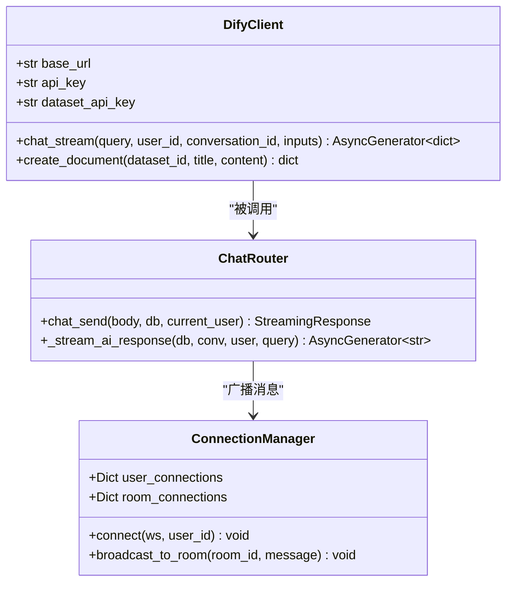
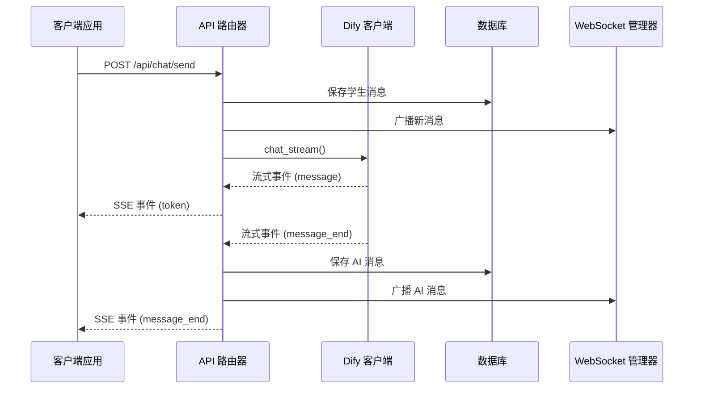
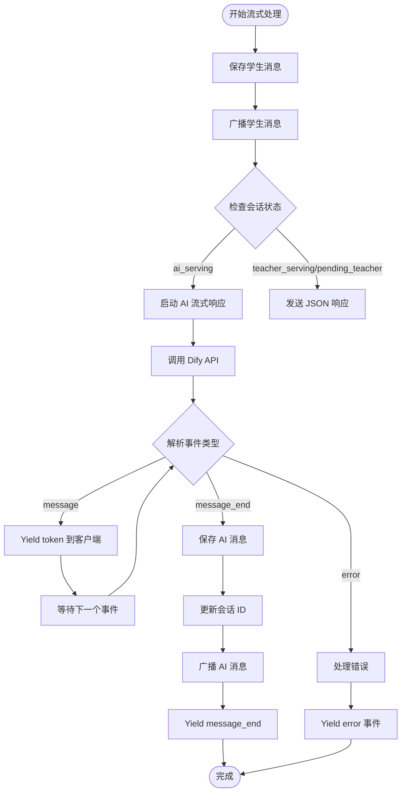
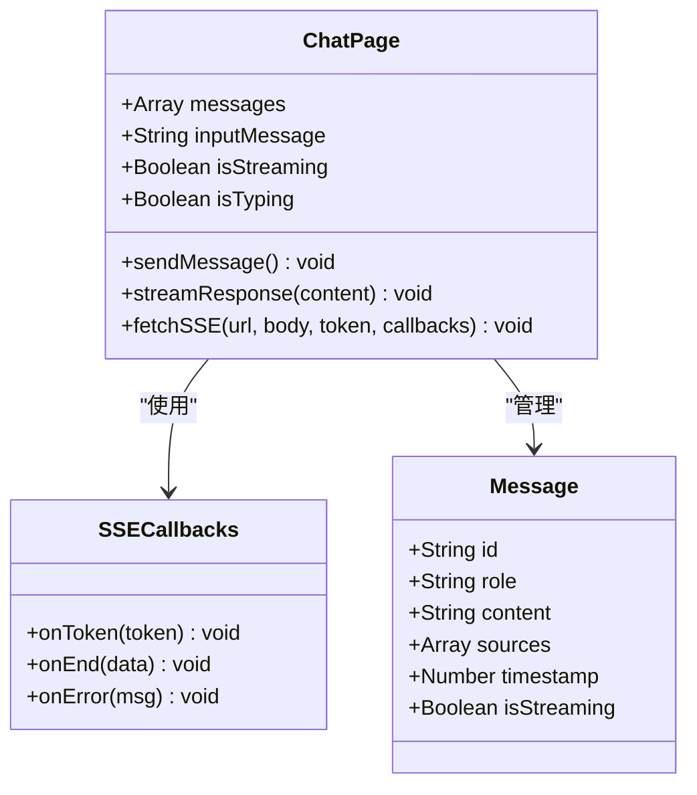
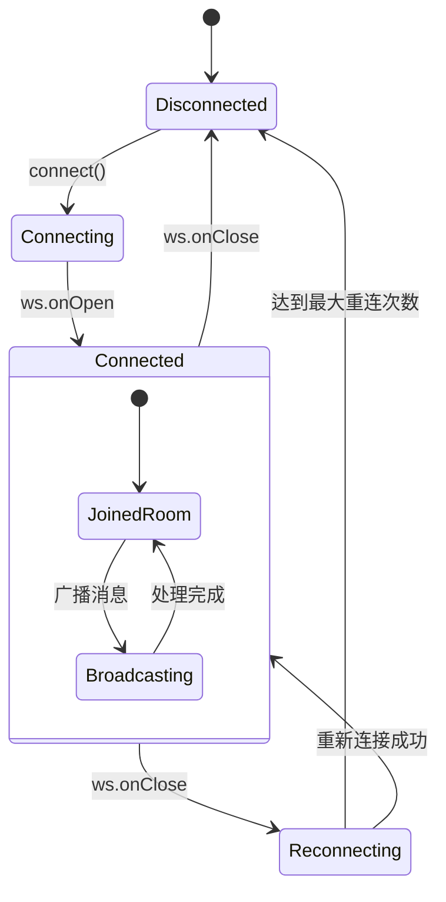
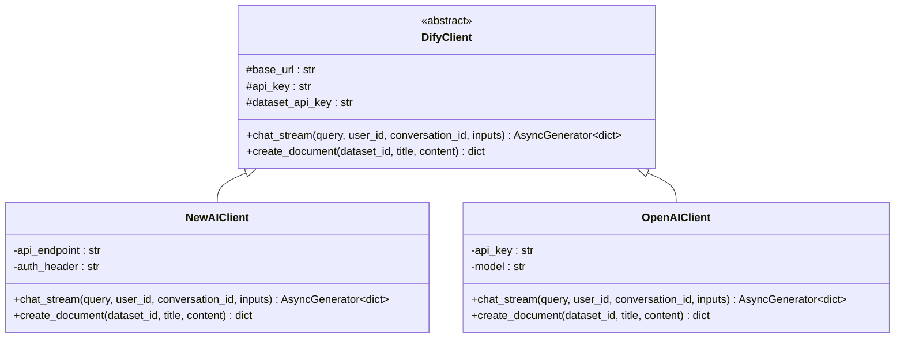
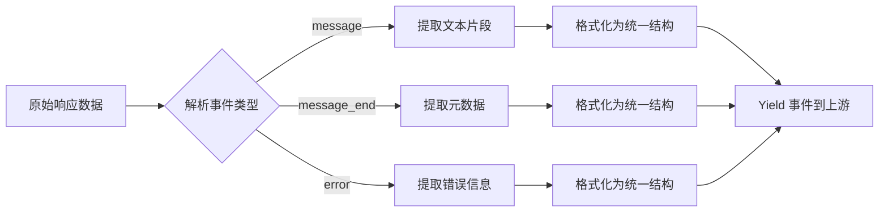
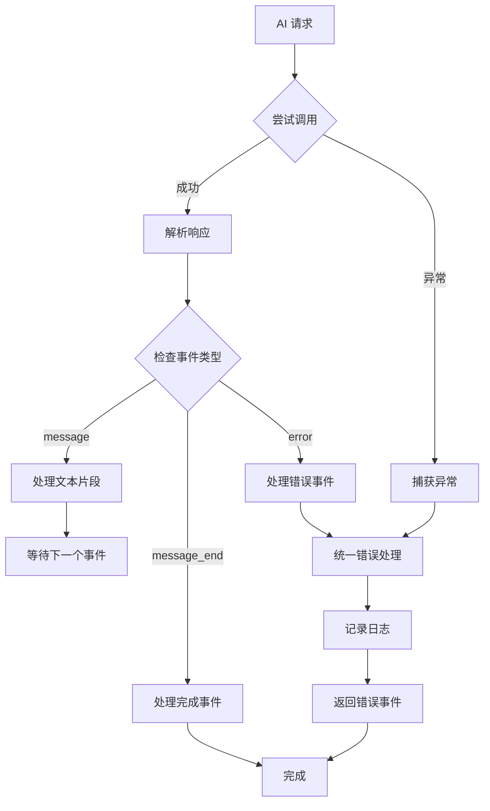
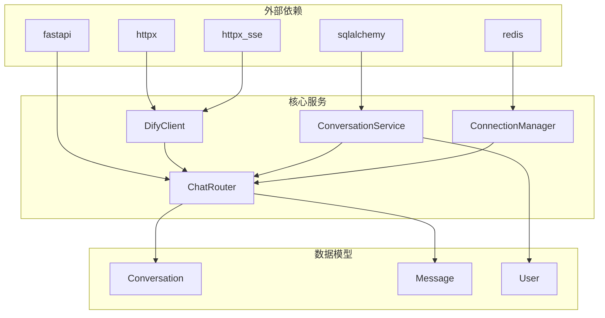

# AI 服务插件

<cite>
**本文档引用的文件**
- [dify_client.py](file://services/gateway/app/services/dify_client.py)
- [chat.py](file://services/gateway/app/routers/chat.py)
- [main.py](file://services/gateway/app/main.py)
- [config.py](file://services/gateway/app/config.py)
- [conversation_service.py](file://services/gateway/app/services/conversation_service.py)
- [conversation.py](file://services/gateway/app/models/conversation.py)
- [ws_manager.py](file://services/gateway/app/services/ws_manager.py)
- [chat.py](file://services/gateway/app/schemas/chat.py)
- [sse.ts](file://apps/student-app/src/utils/sse.ts)
- [websocket.ts](file://apps/student-app/src/utils/websocket.ts)
- [index.vue](file://apps/student-app/src/pages/chat/index.vue)
- [chat.ts](file://apps/student-app/src/types/chat.ts)
- [e11bb6c9d4b8_v2_initial_schema.py](file://services/gateway/alembic/versions/e11bb6c9d4b8_v2_initial_schema.py)
</cite>

## 目录
1. [简介](#简介)
2. [项目结构](#项目结构)
3. [核心组件](#核心组件)
4. [架构概览](#架构概览)
5. [详细组件分析](#详细组件分析)
6. [插件开发指南](#插件开发指南)
7. [依赖关系分析](#依赖关系分析)
8. [性能考虑](#性能考虑)
9. [故障排除指南](#故障排除指南)
10. [结论](#结论)

## 简介

本指南详细介绍医小管 v2 项目中的 AI 服务插件开发，特别是基于 Dify 客户端的插件化设计。该项目实现了完整的智能问答系统，支持流式响应处理、意图识别、知识库检索等功能，并提供了灵活的插件架构以支持多种 AI 引擎的集成。

系统采用前后端分离架构，后端使用 FastAPI 提供 RESTful API 和 WebSocket 服务，前端使用 Vue.js + UniApp 开发跨平台应用。核心功能包括：

- **流式对话响应**：实时传输 AI 生成的文本片段
- **多引擎支持**：可扩展的 AI 引擎插件架构
- **知识库集成**：与 Dify 知识库的无缝对接
- **状态管理**：完整的会话状态流转控制
- **实时通信**：WebSocket 实时消息推送

## 项目结构

项目采用模块化的三层架构设计：



**图表来源**
- [main.py:1-78](file://services/gateway/app/main.py#L1-L78)
- [chat.py:1-191](file://services/gateway/app/routers/chat.py#L1-L191)

**章节来源**
- [main.py:1-78](file://services/gateway/app/main.py#L1-L78)
- [config.py:1-31](file://services/gateway/app/config.py#L1-L31)

## 核心组件

### Dify 客户端插件

DifyClient 是整个 AI 服务的核心插件类，负责与 Dify API 的交互：



**图表来源**
- [dify_client.py:11-105](file://services/gateway/app/services/dify_client.py#L11-L105)
- [chat.py:22-191](file://services/gateway/app/routers/chat.py#L22-L191)
- [ws_manager.py:8-100](file://services/gateway/app/services/ws_manager.py#L8-L100)

### 会话管理系统

系统实现了完整的会话状态管理机制：

| 状态 | 描述 | 触发条件 |
|------|------|----------|
| ai_serving | AI 服务中 | 学生创建会话或从 resolved 状态恢复 |
| pending_teacher | 等待教师接入 | 学生主动转人工或 AI 无法回答 |
| teacher_serving | 教师服务中 | 教师接入会话 |
| resolved | 已解决 | 教师标记问题解决 |
| closed | 已关闭 | 管理员或系统关闭会话 |

**章节来源**
- [conversation.py:11-16](file://services/gateway/app/models/conversation.py#L11-L16)
- [conversation_service.py:7-27](file://services/gateway/app/services/conversation_service.py#L7-L27)

## 架构概览

系统采用事件驱动的流式架构，支持实时双向通信：



**图表来源**
- [chat.py:105-191](file://services/gateway/app/routers/chat.py#L105-L191)
- [dify_client.py:22-69](file://services/gateway/app/services/dify_client.py#L22-L69)

**章节来源**
- [chat.py:105-191](file://services/gateway/app/routers/chat.py#L105-L191)
- [dify_client.py:22-69](file://services/gateway/app/services/dify_client.py#L22-L69)

## 详细组件分析

### 流式响应处理机制

系统实现了高效的流式响应处理，支持实时文本生成：



**图表来源**
- [chat.py:105-191](file://services/gateway/app/routers/chat.py#L105-L191)

### 前端流式渲染组件

前端实现了完整的流式渲染逻辑：



**图表来源**
- [index.vue:424-481](file://apps/student-app/src/pages/chat/index.vue#L424-L481)
- [sse.ts:13-69](file://apps/student-app/src/utils/sse.ts#L13-L69)

**章节来源**
- [index.vue:424-481](file://apps/student-app/src/pages/chat/index.vue#L424-L481)
- [sse.ts:13-69](file://apps/student-app/src/utils/sse.ts#L13-L69)

### WebSocket 实时通信

系统使用 WebSocket 实现实时消息推送：



**图表来源**
- [websocket.ts:26-64](file://apps/student-app/src/utils/websocket.ts#L26-L64)
- [ws_manager.py:25-47](file://services/gateway/app/services/ws_manager.py#L25-L47)

**章节来源**
- [websocket.ts:26-64](file://apps/student-app/src/utils/websocket.ts#L26-L64)
- [ws_manager.py:25-47](file://services/gateway/app/services/ws_manager.py#L25-L47)

## 插件开发指南

### 扩展 DifyClient 类

要实现新的 AI 引擎集成，需要创建一个继承自 DifyClient 的新类：



**图表来源**
- [dify_client.py:11-105](file://services/gateway/app/services/dify_client.py#L11-L105)

### 关键接口适配

#### 1. 流式响应接口

新 AI 引擎必须实现相同的流式响应接口：

```typescript
// 必须实现的方法签名
async def chat_stream(
    self,
    query: str,
    user_id: str,
    conversation_id: Optional[str] = None,
    inputs: Optional[dict] = None,
) -> AsyncGenerator[dict, None]:
    """
    返回格式要求：
    - {"event": "message", "answer": "文本片段"}
    - {"event": "message_end", "metadata": {...}}
    - {"event": "error", "message": "错误信息"}
    """
```

#### 2. 参数映射策略

不同 AI 引擎的参数映射示例：

| 参数 | Dify | OpenAI | 百度文心 | 阿里通义 |
|------|------|--------|----------|----------|
| 查询文本 | query | messages | prompt | messages |
| 用户标识 | user | user_id | user_id | user_id |
| 会话ID | conversation_id | conversation_id | conversation_id | conversation_id |
| 输入参数 | inputs | extra_params | extra_params | extra_params |

#### 3. 响应解析规范

统一的响应解析流程：



**图表来源**
- [chat.py:114-153](file://services/gateway/app/routers/chat.py#L114-L153)

### 插件配置管理

#### 环境变量配置

```python
class Settings(BaseSettings):
    # -- Dify 配置 --
    dify_api_url: str = "http://localhost:5001/v1"
    dify_api_key: str = ""
    dify_global_dataset_id: str = ""
    dify_dataset_api_key: str = ""
    
    # -- 新 AI 引擎配置 --
    openai_api_key: str = ""
    openai_base_url: str = ""
    baidu_api_key: str = ""
    baidu_secret_key: str = ""
    
    model_config = {"env_file": ".env", "env_file_encoding": "utf-8"}
```

#### 运行时配置切换

```python
# 在运行时根据配置选择 AI 引擎
def get_ai_client(engine_type: str) -> DifyClient:
    if engine_type == "dify":
        return DifyClient()
    elif engine_type == "openai":
        return OpenAIClient()
    elif engine_type == "baidu":
        return BaiduClient()
    else:
        raise ValueError(f"不支持的 AI 引擎: {engine_type}")
```

### 错误处理机制

#### 统一错误处理流程



**图表来源**
- [chat.py:150-153](file://services/gateway/app/routers/chat.py#L150-L153)

### 性能优化策略

#### 1. 连接池管理

```python
# 使用连接池减少连接开销
async with httpx.AsyncClient(
    timeout=120.0,
    limits=httpx.Limits(
        max_connections=100,
        max_keepalive_connections=20,
        keepalive_expiry=600
    )
) as client:
    # 使用 client 进行请求
```

#### 2. 缓存策略

```python
# Redis 缓存常用查询结果
async def cached_chat_stream(
    self, query: str, cache_key: str
) -> AsyncGenerator[dict, None]:
    # 尝试从缓存获取
    cached = await self.redis.get(cache_key)
    if cached:
        yield json.loads(cached)
        return
    
    # 从 AI 引擎获取并缓存
    async for event in self._original_chat_stream(query):
        await self.redis.setex(cache_key, 300, json.dumps(event))
        yield event
```

#### 3. 流式传输优化

```typescript
// 前端流式渲染优化
const debouncedRender = debounce(() => {
    // 批量更新 DOM
    scrollToBottom()
}, 16) // ~60fps
```

## 依赖关系分析

系统各组件之间的依赖关系如下：



**图表来源**
- [dify_client.py:1-6](file://services/gateway/app/services/dify_client.py#L1-L6)
- [chat.py:1-16](file://services/gateway/app/routers/chat.py#L1-L16)

**章节来源**
- [dify_client.py:1-6](file://services/gateway/app/services/dify_client.py#L1-L6)
- [chat.py:1-16](file://services/gateway/app/routers/chat.py#L1-L16)

## 性能考虑

### 1. 流式传输性能

- **SSE vs WebSocket**: SSE 更适合单向流式传输，WebSocket 适合双向通信
- **缓冲区管理**: 合理设置缓冲区大小，避免内存泄漏
- **背压处理**: 当客户端处理速度慢时，适当降低发送频率

### 2. 数据库性能优化

- **索引优化**: 为常用查询字段建立索引
- **批量操作**: 使用批量插入减少数据库往返
- **连接池**: 合理配置连接池大小

### 3. 缓存策略

- **Redis 缓存**: 缓存热点数据和计算结果
- **CDN 加速**: 静态资源使用 CDN
- **浏览器缓存**: 合理设置缓存头

## 故障排除指南

### 常见问题及解决方案

#### 1. Dify API 连接失败

**症状**: `/health` 接口显示 Dify 服务不可用

**排查步骤**:
1. 检查 `.env` 文件中的 Dify 配置
2. 验证 API Key 是否正确
3. 确认 Dify 服务是否正常运行

**解决方案**:
```python
# 在 main.py 中添加更详细的错误信息
try:
    resp = await client.get(
        f"{settings.dify_api_url}/parameters",
        headers={"Authorization": f"Bearer {settings.dify_api_key}"},
        timeout=5.0
    )
    if resp.status_code >= 500:
        checks["dify"] = f"error: Dify 服务器内部错误 {resp.status_code}"
    elif resp.status_code == 401:
        checks["dify"] = "error: API Key 无效"
    elif resp.status_code == 403:
        checks["dify"] = "error: API Key 权限不足"
    else:
        checks["dify"] = "ok"
except TimeoutError:
    checks["dify"] = "error: 连接超时"
except Exception as e:
    checks["dify"] = f"error: {str(e)}"
```

#### 2. 流式响应中断

**症状**: SSE 流在中间断开

**排查步骤**:
1. 检查网络连接稳定性
2. 验证 Dify API 的流式响应能力
3. 检查客户端的 SSE 处理逻辑

**解决方案**:
```python
# 添加重连机制
async def fetchSSEWithRetry(url, body, token, callbacks, max_retries=3):
    for attempt in range(max_retries):
        try:
            await fetchSSE(url, body, token, callbacks)
            return
        except Exception as e:
            if attempt == max_retries - 1:
                raise e
            await asyncio.sleep(2 ** attempt)  # 指数退避
```

#### 3. WebSocket 连接问题

**症状**: WebSocket 无法连接或频繁断开

**排查步骤**:
1. 检查 Nginx 配置中的 WebSocket 支持
2. 验证防火墙设置
3. 检查服务器资源使用情况

**解决方案**:
```typescript
// 增强的 WebSocket 连接管理
private scheduleReconnect() {
    if (this.reconnectCount >= this.maxReconnect) {
        console.error('达到最大重连次数')
        return
    }
    
    const delay = Math.min(
        1000 * Math.pow(2, this.reconnectCount), 
        30000  // 最大 30 秒
    )
    this.reconnectCount++
    console.log(`[WS] 第 ${this.reconnectCount} 次重连，延迟 ${delay}ms`)
    setTimeout(() => this.doConnect(), delay)
}
```

**章节来源**
- [main.py:51-61](file://services/gateway/app/main.py#L51-L61)
- [websocket.ts:129-135](file://apps/student-app/src/utils/websocket.ts#L129-L135)

## 结论

本指南详细介绍了医小管 v2 项目中 AI 服务插件的开发方法和最佳实践。通过模块化的插件架构，系统实现了：

1. **灵活的 AI 引擎集成**：支持多种 AI 服务提供商的无缝切换
2. **高效的流式响应处理**：实现实时文本生成和传输
3. **完善的错误处理机制**：确保系统的稳定性和可靠性
4. **可扩展的架构设计**：为未来的功能扩展预留空间

开发者可以基于现有的 DifyClient 插件模式，快速实现其他 AI 引擎的集成。通过遵循本文档的指导原则，可以确保新插件与现有系统的兼容性和一致性。

关键要点总结：
- 保持统一的接口规范和响应格式
- 实现健壮的错误处理和重试机制
- 优化流式传输性能和资源使用
- 建立完善的监控和日志体系
- 设计合理的配置管理和环境隔离