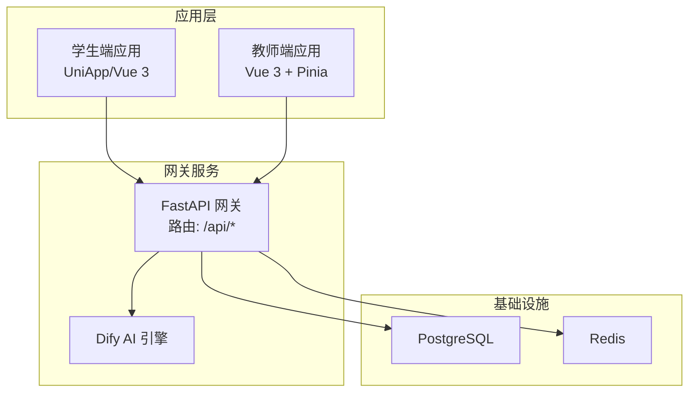
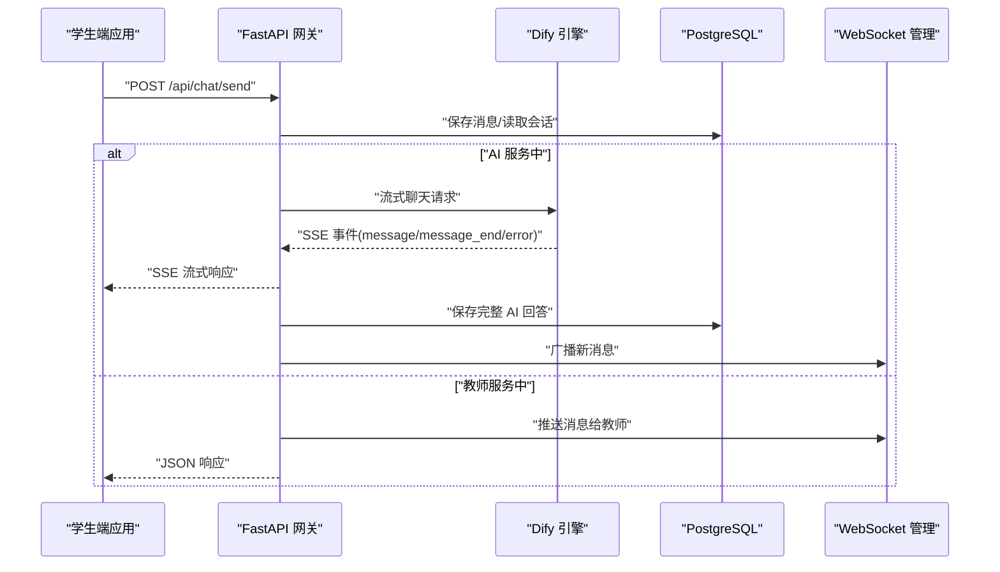
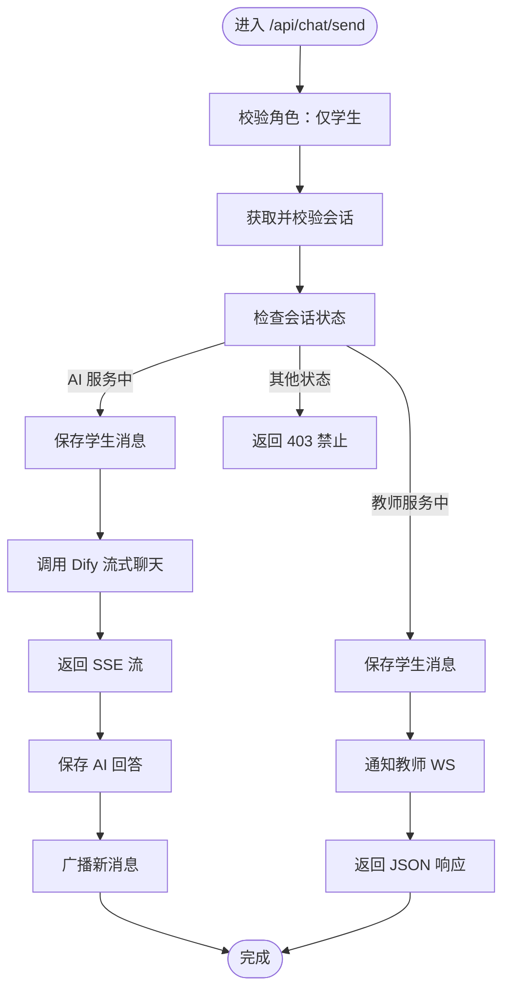
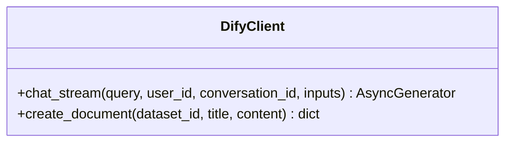
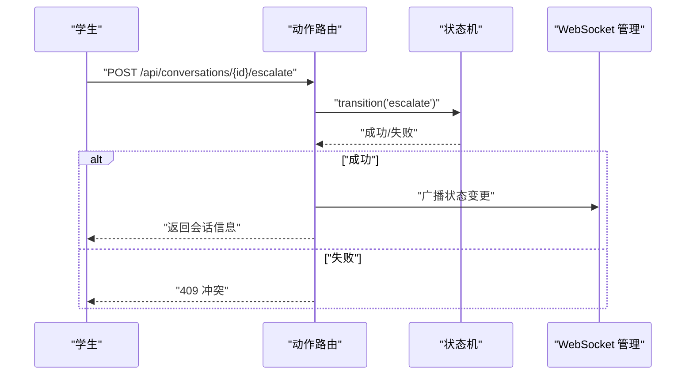
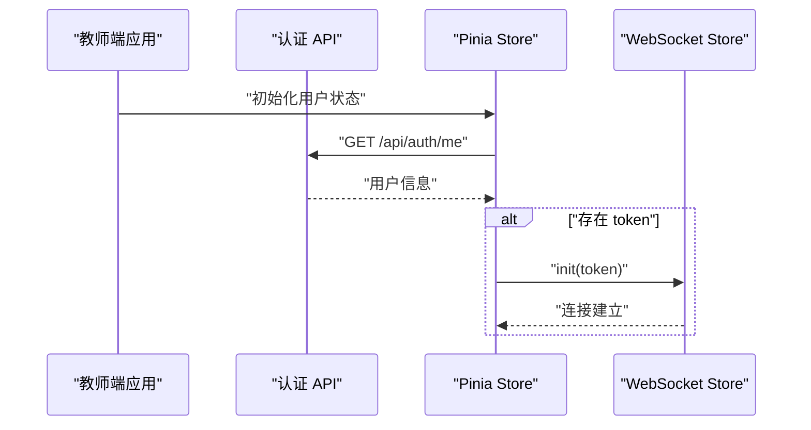
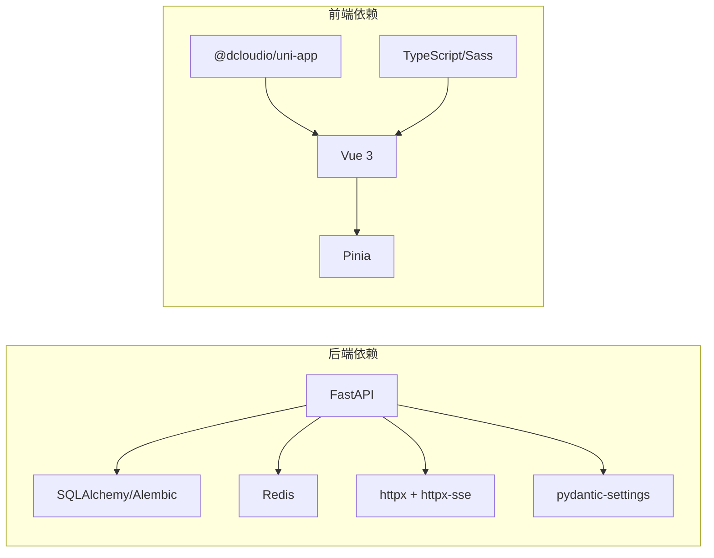

# 插件开发指南

<cite>
**本文档引用的文件**
- [README.md](file://README.md)
- [package.json](file://apps/student-app/package.json)
- [package.json](file://apps/teacher-app/package.json)
- [main.py](file://services/gateway/app/main.py)
- [chat.py](file://services/gateway/app/routers/chat.py)
- [actions.py](file://services/gateway/app/routers/actions.py)
- [dify_client.py](file://services/gateway/app/services/dify_client.py)
- [config.py](file://services/gateway/app/config.py)
- [requirements.txt](file://services/gateway/requirements.txt)
- [docker-compose.yml](file://deploy/docker-compose.yml)
- [chat.ts](file://apps/student-app/src/api/chat.ts)
- [auth.ts](file://apps/teacher-app/src/api/auth.ts)
- [chat.ts](file://apps/student-app/src/types/chat.ts)
- [main.ts](file://apps/student-app/src/main.ts)
- [main.ts](file://apps/teacher-app/src/main.ts)
</cite>

## 目录
1. [简介](#简介)
2. [项目结构](#项目结构)
3. [核心组件](#核心组件)
4. [架构总览](#架构总览)
5. [详细组件分析](#详细组件分析)
6. [依赖关系分析](#依赖关系分析)
7. [性能考虑](#性能考虑)
8. [故障排查指南](#故障排查指南)
9. [结论](#结论)
10. [附录](#附录)

## 简介
本指南面向从零开始开发“医小管 v2”插件的开发者，覆盖开发环境搭建、项目结构组织、代码编写规范、插件接口设计原则、参数与返回值规范、最佳实践（错误处理、日志记录、性能优化）、测试调试打包部署流程以及常见问题解决方案。目标是帮助你在现有系统基础上快速、安全地扩展功能。

## 项目结构
- 应用层
  - 学生端应用：基于 UniApp/Vue 3，负责聊天、会话管理等前端交互。
  - 教师端应用：基于 Vue 3 + Pinia，负责教师工作台、知识库、问答等。
- 网关服务（Gateway）
  - 基于 FastAPI 的后端网关，统一暴露认证、会话、动作、聊天、WebSocket 等接口，并对接 Dify AI 引擎。
- 部署与配置
  - 使用 Docker Compose 编排，包含网关服务、数据库与缓存等依赖。

图表来源
- [main.py:1-78](file://services/gateway/app/main.py#L1-L78)
- [docker-compose.yml:1-22](file://deploy/docker-compose.yml#L1-L22)

章节来源
- [README.md:1-18](file://README.md#L1-L18)
- [package.json:1-37](file://apps/student-app/package.json#L1-L37)
- [package.json:1-46](file://apps/teacher-app/package.json#L1-L46)

## 核心组件
- 网关主程序
  - 初始化 FastAPI 应用、健康检查、挂载路由。
- 聊天路由
  - 学生发送消息、AI 流式响应、状态流转、消息广播。
- 动作路由
  - 会话升级、接单、解决、关闭等状态机动作。
- Dify 客户端
  - 封装 Dify Chatflow 流式调用与数据集文档创建。
- 配置与依赖
  - 环境变量驱动的配置、Python 依赖清单、Docker 编排。

章节来源
- [main.py:1-78](file://services/gateway/app/main.py#L1-L78)
- [chat.py:1-191](file://services/gateway/app/routers/chat.py#L1-L191)
- [actions.py:1-154](file://services/gateway/app/routers/actions.py#L1-L154)
- [dify_client.py:1-105](file://services/gateway/app/services/dify_client.py#L1-L105)
- [config.py:1-31](file://services/gateway/app/config.py#L1-L31)
- [requirements.txt:1-29](file://services/gateway/requirements.txt#L1-L29)
- [docker-compose.yml:1-22](file://deploy/docker-compose.yml#L1-L22)

## 架构总览
下图展示从应用到网关再到 AI 引擎与数据库的整体交互流程。

图表来源
- [chat.py:22-103](file://services/gateway/app/routers/chat.py#L22-L103)
- [dify_client.py:22-69](file://services/gateway/app/services/dify_client.py#L22-L69)
- [main.py:70-78](file://services/gateway/app/main.py#L70-L78)

## 详细组件分析

### 组件一：聊天接口（学生发送消息）
- 设计原则
  - 明确的角色权限控制（仅学生可用）。
  - 会话状态机驱动的消息发送策略（AI/教师两种路径）。
  - 流式响应与非流式响应的差异化处理。
- 参数与返回
  - 请求体：包含会话 ID 与消息内容。
  - 返回：AI 服务中返回 SSE 流；教师服务中返回 JSON。
- 错误处理
  - 会话不存在、状态不允许发送、权限不足等均抛出明确错误。
- 性能与可靠性
  - 使用异步客户端与流式传输，避免阻塞。
  - 对 Dify 异常进行降级处理，保证前端体验。

图表来源
- [chat.py:22-103](file://services/gateway/app/routers/chat.py#L22-L103)

章节来源
- [chat.py:1-191](file://services/gateway/app/routers/chat.py#L1-L191)
- [schemas/chat.py:1-18](file://services/gateway/app/schemas/chat.py#L1-L18)
- [types/chat.ts:1-45](file://apps/student-app/src/types/chat.ts#L1-L45)

### 组件二：Dify 客户端
- 设计原则
  - 封装 Dify Chatflow 流式调用，统一事件解析。
  - 提供数据集文档创建能力（迁移场景）。
- 关键行为
  - chat_stream：按事件类型分发 message/message_end/error。
  - create_document：向数据集批量创建文档。
- 可靠性
  - 使用超时控制与异常捕获，避免上游异常影响下游。

图表来源
- [dify_client.py:11-105](file://services/gateway/app/services/dify_client.py#L11-L105)

章节来源
- [dify_client.py:1-105](file://services/gateway/app/services/dify_client.py#L1-L105)

### 组件三：会话动作（升级/接单/解决/关闭）
- 设计原则
  - 基于状态机的幂等与一致性控制。
  - 权限校验与访问控制（仅相关角色可执行）。
  - 通过 WebSocket 广播状态变更，保持实时同步。
- 关键动作
  - escalate：学生发起升级。
  - accept：教师接单。
  - resolve：教师标记解决。
  - close：任意有权限者关闭。
- 错误处理
  - 非法状态转换抛出 409 冲突。
  - 权限不足或资源不存在返回相应错误码。

图表来源
- [actions.py:68-89](file://services/gateway/app/routers/actions.py#L68-L89)

章节来源
- [actions.py:1-154](file://services/gateway/app/routers/actions.py#L1-L154)

### 组件四：应用层集成（前端）
- 学生端
  - 会话与消息 API：创建会话、列出会话、获取会话详情、拉取消息列表、会话升级。
  - 类型定义：消息、会话、来源等。
- 教师端
  - 认证 API：登录、获取当前用户信息。
  - 应用初始化：自动登录后建立 WebSocket 连接。

图表来源
- [main.ts:1-25](file://apps/teacher-app/src/main.ts#L1-L25)
- [auth.ts:1-43](file://apps/teacher-app/src/api/auth.ts#L1-L43)

章节来源
- [chat.ts:1-36](file://apps/student-app/src/api/chat.ts#L1-L36)
- [auth.ts:1-43](file://apps/teacher-app/src/api/auth.ts#L1-L43)
- [chat.ts:1-45](file://apps/student-app/src/types/chat.ts#L1-L45)
- [main.ts:1-11](file://apps/student-app/src/main.ts#L1-L11)
- [main.ts:1-25](file://apps/teacher-app/src/main.ts#L1-L25)

## 依赖关系分析
- 后端依赖
  - FastAPI、SQLAlchemy、Alembic、Redis、httpx、pydantic-settings 等。
- 前端依赖
  - @dcloudio/uni-app、vue、pinia、typescript、sass 等。
- 部署依赖
  - Docker Compose 编排，暴露网关端口，注入环境变量。

图表来源
- [requirements.txt:1-29](file://services/gateway/requirements.txt#L1-L29)
- [package.json:1-37](file://apps/student-app/package.json#L1-L37)
- [package.json:1-46](file://apps/teacher-app/package.json#L1-L46)

章节来源
- [requirements.txt:1-29](file://services/gateway/requirements.txt#L1-L29)
- [package.json:1-37](file://apps/student-app/package.json#L1-L37)
- [package.json:1-46](file://apps/teacher-app/package.json#L1-L46)

## 性能考虑
- 异步与流式
  - 使用异步客户端与 SSE 流式传输，降低延迟与内存占用。
- 缓存与索引
  - 利用 Redis 缓存热点数据，PostgreSQL 为常用查询字段建立索引。
- 超时与重试
  - 对外部服务设置合理超时，必要时实现指数退避重试。
- 日志与监控
  - 在关键路径增加结构化日志，便于定位性能瓶颈。
- 并发与连接池
  - 控制并发数，复用数据库与 HTTP 连接池。

## 故障排查指南
- 网关健康检查
  - 访问 /health，查看数据库、Redis、Dify 服务连通性与状态。
- Dify 连接问题
  - 检查 DIFY_API_URL、DIFY_API_KEY 是否正确配置。
- 数据库连接
  - 确认 DATABASE_URL 正确，网络可达。
- 前端联调
  - 使用浏览器开发者工具查看网络请求与 SSE 流是否正常。
- Docker 端口冲突
  - 确保宿主机端口未被占用，或修改 docker-compose 映射。

章节来源
- [main.py:30-68](file://services/gateway/app/main.py#L30-L68)
- [config.py:15-26](file://services/gateway/app/config.py#L15-L26)
- [docker-compose.yml:9-17](file://deploy/docker-compose.yml#L9-L17)

## 结论
通过遵循本文档的开发规范与最佳实践，你可以基于“医小管 v2”的现有架构高效扩展插件功能。建议在开发过程中始终关注接口一致性、错误处理与日志记录，并结合流式传输与异步编程提升用户体验与系统性能。

## 附录

### 开发环境搭建
- 后端
  - 安装 Python 依赖：参考 requirements.txt。
  - 配置环境变量：DATABASE_URL、REDIS_URL、DIFY_API_URL、DIFY_API_KEY、JWT_SECRET 等。
  - 启动服务：使用 uvicorn 或直接运行 main.py。
- 前端
  - 安装依赖：npm install。
  - 开发模式：npm run dev:h5 或 dev:mp-weixin。
  - 构建产物：npm run build:h5 或 build:mp-weixin。
- 部署
  - 使用 Docker Compose 编排，确保端口映射与环境变量正确。

章节来源
- [requirements.txt:1-29](file://services/gateway/requirements.txt#L1-L29)
- [package.json:1-37](file://apps/student-app/package.json#L1-L37)
- [package.json:1-46](file://apps/teacher-app/package.json#L1-L46)
- [docker-compose.yml:1-22](file://deploy/docker-compose.yml#L1-L22)

### 插件接口设计原则与规范
- 接口命名
  - 使用 RESTful 风格，路径清晰表达资源与动作。
- 参数定义
  - 使用 Pydantic 模型约束输入，明确必填项、长度限制与类型。
- 返回值规范
  - 成功返回标准结构；错误返回明确的状态码与错误信息。
- 权限与鉴权
  - 所有敏感接口需鉴权；对资源访问进行权限校验。
- 错误处理
  - 统一错误格式，区分业务错误与系统错误。
- 日志记录
  - 关键路径记录请求上下文与耗时，便于追踪与审计。

章节来源
- [chat.py:5-18](file://services/gateway/app/routers/chat.py#L5-L18)
- [schemas/chat.py:1-18](file://services/gateway/app/schemas/chat.py#L1-L18)
- [actions.py:1-13](file://services/gateway/app/routers/actions.py#L1-L13)

### 测试、调试、打包与部署流程
- 测试
  - 后端：pytest + pytest-asyncio，覆盖路由与服务层。
  - 前端：单元测试与端到端测试（根据项目脚手架支持）。
- 调试
  - 后端：开启 DEBUG 日志级别，使用断点调试。
  - 前端：浏览器调试工具、Vue DevTools。
- 打包
  - 前端：使用 uni-app 的构建命令生成 H5/小程序产物。
  - 后端：Docker 镜像构建，镜像内运行 uvicorn。
- 部署
  - 使用 docker-compose 启动，确保环境变量与端口映射正确。

章节来源
- [requirements.txt:26-29](file://services/gateway/requirements.txt#L26-L29)
- [package.json:4-10](file://apps/student-app/package.json#L4-L10)
- [package.json:4-10](file://apps/teacher-app/package.json#L4-L10)
- [docker-compose.yml:1-22](file://deploy/docker-compose.yml#L1-L22)

### 常见问题与解决方案
- 会话状态异常
  - 检查状态机转换逻辑与权限校验，确保状态流转合法。
- SSE 流中断
  - 检查 Dify 服务稳定性与网络连通性，增加超时与重试。
- 前端无法接收消息
  - 确认 WebSocket 连接与房间订阅，检查广播逻辑。
- Docker 端口冲突
  - 修改映射端口或停止占用进程。

章节来源
- [actions.py:74-84](file://services/gateway/app/routers/actions.py#L74-L84)
- [chat.py:105-154](file://services/gateway/app/routers/chat.py#L105-L154)
- [main.py:70-78](file://services/gateway/app/main.py#L70-L78)
- [docker-compose.yml:9-11](file://deploy/docker-compose.yml#L9-L11)