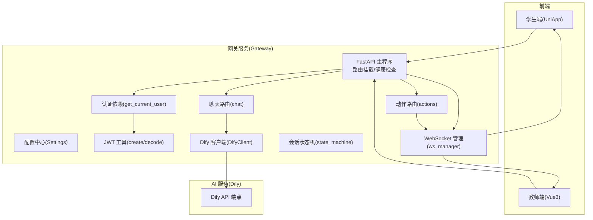
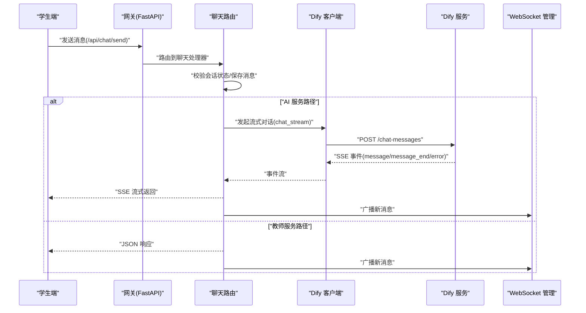
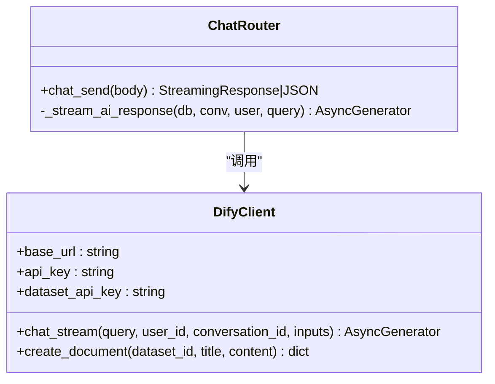
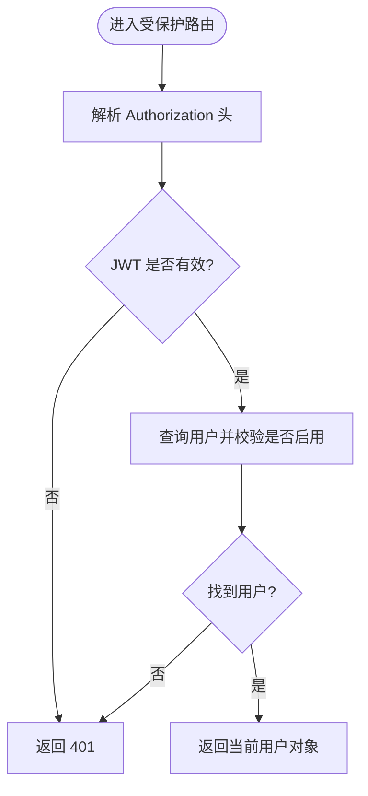
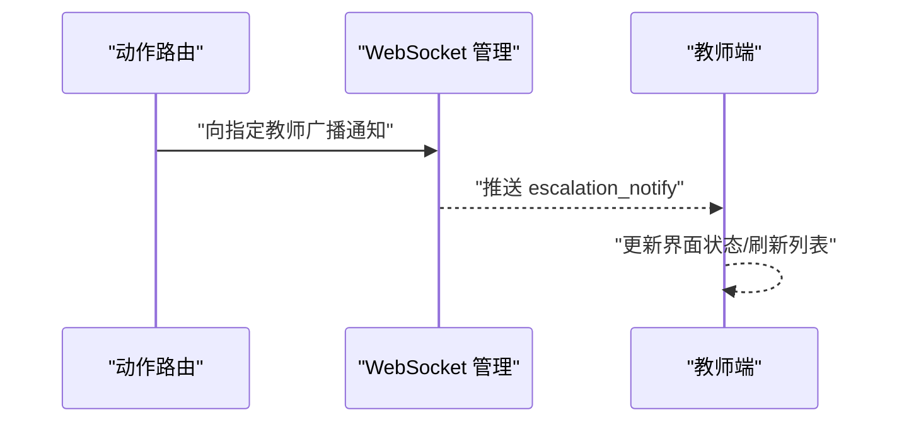
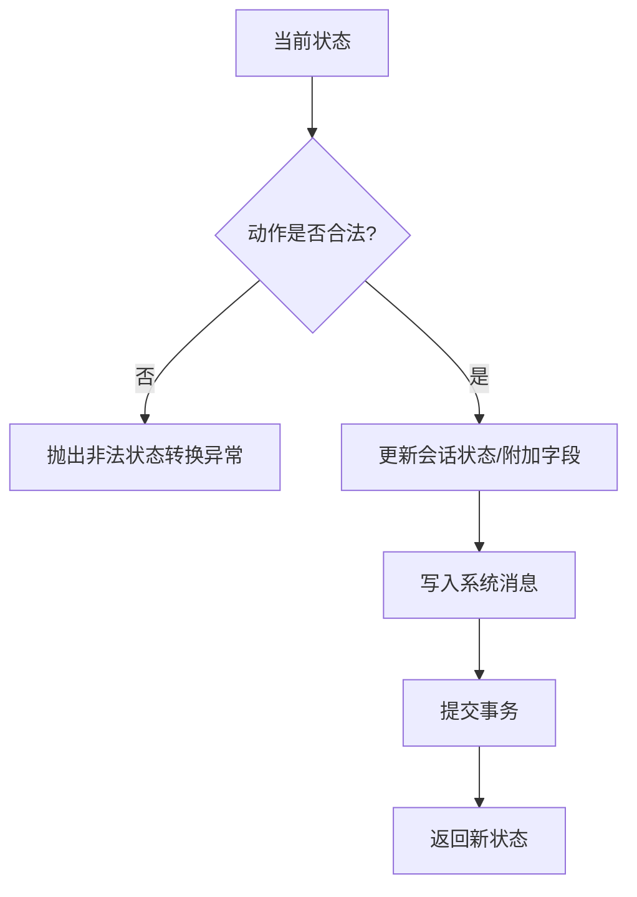
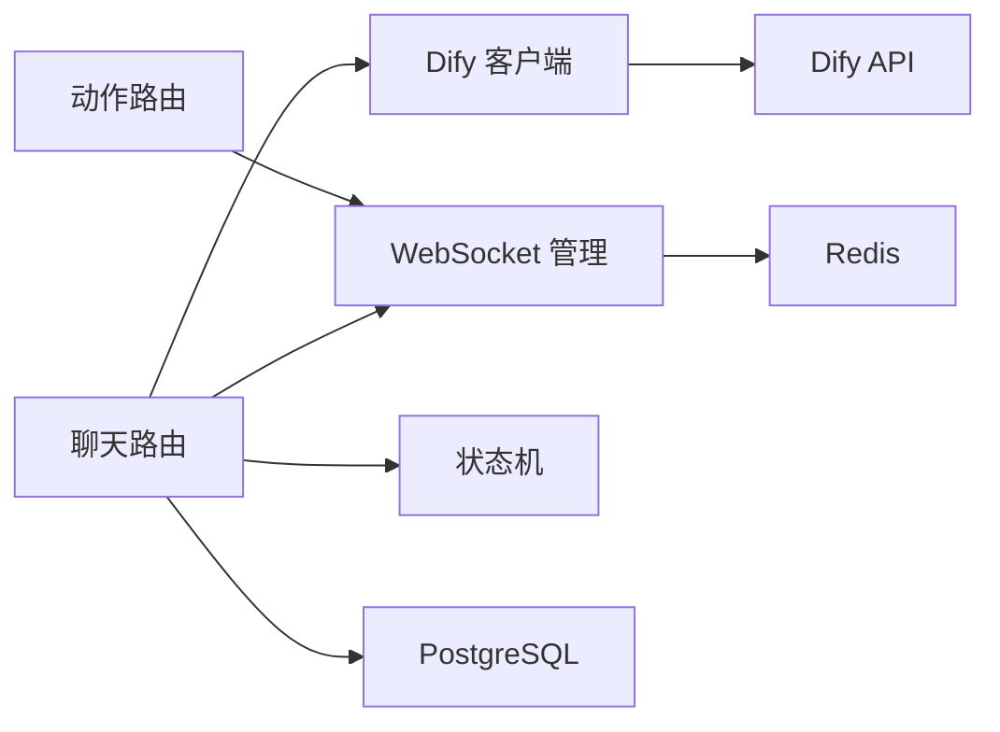

# 插件开发机制

<cite>
**本文引用的文件**
- [README.md](file://README.md)
- [services/gateway/app/main.py](file://services/gateway/app/main.py)
- [services/gateway/app/config.py](file://services/gateway/app/config.py)
- [services/gateway/app/routers/chat.py](file://services/gateway/app/routers/chat.py)
- [services/gateway/app/services/dify_client.py](file://services/gateway/app/services/dify_client.py)
- [services/gateway/app/utils/deps.py](file://services/gateway/app/utils/deps.py)
- [services/gateway/app/utils/jwt.py](file://services/gateway/app/utils/jwt.py)
- [services/gateway/app/services/state_machine.py](file://services/gateway/app/services/state_machine.py)
- [services/gateway/app/services/ws_manager.py](file://services/gateway/app/services/ws_manager.py)
- [services/gateway/app/routers/actions.py](file://services/gateway/app/routers/actions.py)
- [apps/student-app/src/utils/websocket.ts](file://apps/student-app/src/utils/websocket.ts)
- [apps/teacher-app/src/stores/websocket.ts](file://apps/teacher-app/src/stores/websocket.ts)
- [apps/teacher-app/src/pages/questions/detail.vue](file://apps/teacher-app/src/pages/questions/detail.vue)
- [scripts/s2-ws-test.py](file://scripts/s2-ws-test.py)
- [s2-final.md](file://s2-final.md)
- [docs/design/dev-plan-v2.md](file://docs/design/dev-plan-v2.md)
</cite>

## 目录
1. [简介](#简介)
2. [项目结构](#项目结构)
3. [核心组件](#核心组件)
4. [架构总览](#架构总览)
5. [详细组件分析](#详细组件分析)
6. [依赖关系分析](#依赖关系分析)
7. [性能考量](#性能考量)
8. [故障排查指南](#故障排查指南)
9. [结论](#结论)
10. [附录](#附录)

## 简介
本指南面向希望在“医小管 v2”系统中进行插件化扩展的开发者，重点围绕以下插件类型与扩展点展开：
- AI 服务插件（以 Dify 客户端为例）
- 认证插件（基于 JWT 的用户解析与鉴权）
- 通知插件（基于 WebSocket 的实时广播与通知）

文档将系统讲解插件接口定义、注册机制、生命周期管理、配置与依赖注入、错误处理、测试与调试、以及部署流程，并给出可操作的开发步骤与最佳实践。

## 项目结构
后端采用 FastAPI + SQLAlchemy + Alembic 架构，前端包含学生端（UniApp）与教师端（Vue 3 + Element Plus）。AI 服务通过 Dify（自托管）提供 RAG/Agent 能力，网关负责统一认证、路由、状态机与 WebSocket 广播。

图表来源
- [services/gateway/app/main.py:1-78](file://services/gateway/app/main.py#L1-L78)
- [services/gateway/app/config.py:1-31](file://services/gateway/app/config.py#L1-L31)
- [services/gateway/app/routers/chat.py:1-191](file://services/gateway/app/routers/chat.py#L1-L191)
- [services/gateway/app/services/dify_client.py:1-105](file://services/gateway/app/services/dify_client.py#L1-L105)
- [services/gateway/app/utils/deps.py:1-40](file://services/gateway/app/utils/deps.py#L1-L40)
- [services/gateway/app/utils/jwt.py:1-16](file://services/gateway/app/utils/jwt.py#L1-L16)
- [services/gateway/app/services/state_machine.py:1-96](file://services/gateway/app/services/state_machine.py#L1-L96)
- [services/gateway/app/services/ws_manager.py:1-100](file://services/gateway/app/services/ws_manager.py#L1-L100)
- [services/gateway/app/routers/actions.py:35-65](file://services/gateway/app/routers/actions.py#L35-L65)

章节来源
- [README.md:1-18](file://README.md#L1-L18)
- [services/gateway/app/main.py:1-78](file://services/gateway/app/main.py#L1-L78)

## 核心组件
- 配置中心：集中管理数据库、Redis、JWT、Dify 等配置项，支持环境变量覆盖。
- 认证依赖：从 Authorization 头解析 JWT，查询用户并校验有效性。
- Dify 客户端：封装 Dify Chatflow 的流式调用与知识库文档创建接口。
- 聊天路由：根据会话状态选择 AI 流式响应或教师路径，并通过 WebSocket 广播消息。
- 状态机：定义会话状态转换规则与系统消息记录。
- WebSocket 管理：维护用户连接与房间广播，支持向教师推送通知。
- 动作路由：触发针对教师的通知广播（如转人工通知）。

章节来源
- [services/gateway/app/config.py:1-31](file://services/gateway/app/config.py#L1-L31)
- [services/gateway/app/utils/deps.py:14-35](file://services/gateway/app/utils/deps.py#L14-L35)
- [services/gateway/app/services/dify_client.py:11-105](file://services/gateway/app/services/dify_client.py#L11-L105)
- [services/gateway/app/routers/chat.py:22-191](file://services/gateway/app/routers/chat.py#L22-L191)
- [services/gateway/app/services/state_machine.py:34-96](file://services/gateway/app/services/state_machine.py#L34-L96)
- [services/gateway/app/services/ws_manager.py:8-100](file://services/gateway/app/services/ws_manager.py#L8-L100)
- [services/gateway/app/routers/actions.py:35-65](file://services/gateway/app/routers/actions.py#L35-L65)

## 架构总览
下图展示了“学生端 → 网关 → Dify → WebSocket 广播”的端到端交互流程，体现插件化扩展的关键节点与数据流。

图表来源
- [services/gateway/app/routers/chat.py:22-191](file://services/gateway/app/routers/chat.py#L22-L191)
- [services/gateway/app/services/dify_client.py:22-69](file://services/gateway/app/services/dify_client.py#L22-L69)
- [services/gateway/app/services/ws_manager.py:71-82](file://services/gateway/app/services/ws_manager.py#L71-L82)

## 详细组件分析

### 组件一：AI 服务插件（Dify 客户端）
- 接口职责
  - 流式对话：封装 Dify Chatflow 的流式调用，按事件类型分发 token、结束与错误。
  - 文档入库：提供知识库文档创建接口，用于 KB 迁移场景。
- 生命周期
  - 初始化：读取配置中的 Dify API 地址与密钥。
  - 使用：在聊天路由中被调用，产生事件流并回写数据库与 WebSocket 广播。
- 错误处理
  - 非 JSON SSE 数据记录警告；异常时返回 error 事件并终止。
- 依赖注入
  - 通过全局单例实例在路由中直接使用，便于扩展与替换。

图表来源
- [services/gateway/app/services/dify_client.py:11-105](file://services/gateway/app/services/dify_client.py#L11-L105)
- [services/gateway/app/routers/chat.py:22-191](file://services/gateway/app/routers/chat.py#L22-L191)

章节来源
- [services/gateway/app/services/dify_client.py:11-105](file://services/gateway/app/services/dify_client.py#L11-L105)
- [services/gateway/app/routers/chat.py:105-191](file://services/gateway/app/routers/chat.py#L105-L191)

### 组件二：认证插件（JWT 依赖）
- 接口职责
  - 从 Authorization 头解析 JWT，解析用户标识并查询数据库校验用户有效性。
- 生命周期
  - FastAPI 依赖注入：每次请求通过依赖注入解析当前用户。
- 错误处理
  - JWT 解析失败或用户不存在/禁用时返回 401。
- 扩展点
  - 可替换为其他认证方式（如企业微信登录），仅需实现相同签名的依赖函数。

图表来源
- [services/gateway/app/utils/deps.py:14-35](file://services/gateway/app/utils/deps.py#L14-L35)
- [services/gateway/app/utils/jwt.py:6-16](file://services/gateway/app/utils/jwt.py#L6-L16)

章节来源
- [services/gateway/app/utils/deps.py:14-35](file://services/gateway/app/utils/deps.py#L14-L35)
- [services/gateway/app/utils/jwt.py:6-16](file://services/gateway/app/utils/jwt.py#L6-L16)

### 组件三：通知插件（WebSocket 广播）
- 接口职责
  - 维护用户连接与房间广播，支持向教师推送新工单通知。
- 生命周期
  - 网关启动时注入 Redis；路由中通过依赖注入获取。
- 扩展点
  - 可新增通知类型（如语音播报、站内信），在动作路由中扩展广播消息结构。

图表来源
- [services/gateway/app/routers/actions.py:35-65](file://services/gateway/app/routers/actions.py#L35-L65)
- [services/gateway/app/services/ws_manager.py:83-92](file://services/gateway/app/services/ws_manager.py#L83-L92)

章节来源
- [services/gateway/app/routers/actions.py:35-65](file://services/gateway/app/routers/actions.py#L35-L65)
- [services/gateway/app/services/ws_manager.py:8-100](file://services/gateway/app/services/ws_manager.py#L8-L100)

### 组件四：会话状态机（扩展点）
- 接口职责
  - 定义合法状态转换表，执行状态更新并写入系统消息。
- 扩展点
  - 可新增状态与动作，补充系统消息模板，保持与前端状态展示一致。

图表来源
- [services/gateway/app/services/state_machine.py:34-96](file://services/gateway/app/services/state_machine.py#L34-L96)

章节来源
- [services/gateway/app/services/state_machine.py:19-31](file://services/gateway/app/services/state_machine.py#L19-L31)
- [services/gateway/app/services/state_machine.py:34-96](file://services/gateway/app/services/state_machine.py#L34-L96)

## 依赖关系分析
- 组件耦合
  - 路由层依赖服务层（DifyClient、状态机、WebSocket 管理）。
  - 服务层依赖配置中心与数据库/Redis。
  - 前端通过 HTTP 与 WebSocket 与后端交互。
- 外部依赖
  - Dify API（Chatflow/知识库）
  - Redis（心跳与连接管理）
  - PostgreSQL（用户与会话数据）
- 潜在循环依赖
  - 当前结构清晰，无明显循环导入。

图表来源
- [services/gateway/app/routers/chat.py:14-15](file://services/gateway/app/routers/chat.py#L14-L15)
- [services/gateway/app/services/dify_client.py:14-17](file://services/gateway/app/services/dify_client.py#L14-L17)
- [services/gateway/app/services/ws_manager.py:20-24](file://services/gateway/app/services/ws_manager.py#L20-L24)
- [services/gateway/app/services/state_machine.py:34-71](file://services/gateway/app/services/state_machine.py#L34-L71)

章节来源
- [services/gateway/app/main.py:16-28](file://services/gateway/app/main.py#L16-L28)
- [services/gateway/app/utils/deps.py:38-39](file://services/gateway/app/utils/deps.py#L38-L39)

## 性能考量
- 流式传输
  - 使用 SSE 将 Dify 的增量 token 实时推送到前端，避免长连接阻塞。
- 连接池与超时
  - Dify 客户端设置合理超时；HTTP 客户端按需创建，减少资源占用。
- 广播效率
  - 仅对房间内连接进行广播，避免对离线连接的无效尝试。
- 缓存与状态
  - Redis 用于连接状态与心跳；数据库异步写入，保证一致性与性能平衡。

## 故障排查指南
- 认证失败
  - 检查 Authorization 头格式与 JWT 有效期；确认用户存在且启用。
- Dify 不可用
  - 网关健康检查会探测 Dify 参数端点；核对 API 地址与密钥。
- WebSocket 断连与重连
  - 前端实现指数退避重连与房间重加入；后端断开时清理连接。
- 通知未达
  - 确认教师在线且加入对应房间；检查广播消息类型与目标用户集合。

章节来源
- [services/gateway/app/main.py:51-68](file://services/gateway/app/main.py#L51-L68)
- [services/gateway/app/utils/deps.py:14-35](file://services/gateway/app/utils/deps.py#L14-L35)
- [apps/student-app/src/utils/websocket.ts:129-135](file://apps/student-app/src/utils/websocket.ts#L129-L135)
- [services/gateway/app/services/ws_manager.py:34-46](file://services/gateway/app/services/ws_manager.py#L34-L46)

## 结论
“医小管 v2”的插件化扩展以“配置中心 + 依赖注入 + 明确接口契约”为核心，围绕 AI 服务、认证与通知三大领域提供了清晰的扩展点。通过 Dify 客户端、JWT 依赖、WebSocket 管理与状态机等组件，开发者可以安全地实现新的 AI 引擎集成、自定义认证方式与通知渠道，并在统一的生命周期与错误处理机制下稳定运行。

## 附录

### 插件开发示例：实现新的 AI 引擎集成
- 目标：替换或并行接入新的 AI 引擎（如本地 LLM 或其他云厂商 Chatflow）。
- 步骤
  - 定义统一接口：仿照 DifyClient 的 chat_stream 方法签名，确保返回事件流。
  - 注册配置：在配置中心新增引擎地址与密钥。
  - 替换依赖：在聊天路由中切换到新客户端实例，或通过工厂模式按配置选择。
  - 测试：使用 SSE 事件模拟器验证事件类型与数据结构兼容性。
- 注意
  - 保持事件流的“message/message_end/error”语义，以便前端与后端逻辑一致。

章节来源
- [services/gateway/app/services/dify_client.py:22-69](file://services/gateway/app/services/dify_client.py#L22-L69)
- [services/gateway/app/routers/chat.py:105-191](file://services/gateway/app/routers/chat.py#L105-L191)
- [services/gateway/app/config.py:15-28](file://services/gateway/app/config.py#L15-L28)

### 插件开发示例：自定义认证方式
- 目标：替换 JWT 为其他认证方式（如企业微信登录）。
- 步骤
  - 实现新的依赖函数：保持与 get_current_user 相同签名与行为（解析凭据、查询用户、返回对象）。
  - 替换依赖：在路由层注入新依赖，或通过中间件统一拦截。
  - 测试：构造不同凭据与用户状态，验证 401 与 403 的正确返回。
- 注意
  - 保持与 JWT 工具的一致性，避免跨插件的认证模型差异。

章节来源
- [services/gateway/app/utils/deps.py:14-35](file://services/gateway/app/utils/deps.py#L14-L35)
- [services/gateway/app/utils/jwt.py:6-16](file://services/gateway/app/utils/jwt.py#L6-L16)

### 插件开发示例：扩展通知渠道
- 目标：新增站内信、短信或企业微信机器人通知。
- 步骤
  - 在动作路由中新增广播类型与目标集合（如按学院/班级推送）。
  - 在 WebSocket 管理中扩展广播方法，或引入外部通知服务 SDK。
  - 前端监听新类型事件并更新 UI。
- 注意
  - 保持消息结构与现有类型一致，避免前端适配成本。

章节来源
- [services/gateway/app/routers/actions.py:35-65](file://services/gateway/app/routers/actions.py#L35-L65)
- [services/gateway/app/services/ws_manager.py:83-92](file://services/gateway/app/services/ws_manager.py#L83-L92)
- [apps/teacher-app/src/pages/questions/detail.vue:228-232](file://apps/teacher-app/src/pages/questions/detail.vue#L228-L232)

### 插件配置管理与依赖注入最佳实践
- 配置管理
  - 使用 Pydantic Settings 管理环境变量；为每个插件提供独立配置段。
  - 默认值与类型校验确保部署一致性。
- 依赖注入
  - 使用 FastAPI Depends 统一注入数据库、Redis、JWT 工具与自定义服务。
  - 将插件实例作为全局单例或通过工厂注入，便于替换与测试。
- 错误处理
  - 明确异常类型与返回码；在路由层统一捕获并返回标准错误结构。
  - 记录关键日志（认证失败、Dify 调用异常、WS 广播失败）。

章节来源
- [services/gateway/app/config.py:1-31](file://services/gateway/app/config.py#L1-L31)
- [services/gateway/app/utils/deps.py:14-39](file://services/gateway/app/utils/deps.py#L14-L39)
- [services/gateway/app/main.py:16-28](file://services/gateway/app/main.py#L16-L28)

### 插件测试与调试流程
- 单元测试
  - 对认证依赖进行参数化测试（有效/无效 JWT、禁用用户）。
  - 对 Dify 客户端进行事件流模拟测试（message/message_end/error）。
- 集成测试
  - 使用脚本对 WebSocket 连接、心跳与未知类型处理进行端到端验证。
  - 在网关健康检查中验证 Dify 与数据库/Redis 的连通性。
- 调试建议
  - 前端开启重连与房间重加入逻辑；后端记录 WS 清理与广播失败。
  - 使用最小化场景复现问题（单用户、单房间、单事件）。

章节来源
- [scripts/s2-ws-test.py:31-50](file://scripts/s2-ws-test.py#L31-L50)
- [s2-final.md:25-36](file://s2-final.md#L25-L36)
- [services/gateway/app/main.py:51-68](file://services/gateway/app/main.py#L51-L68)

### 插件部署与运维
- 环境准备
  - 部署 Dify 服务并配置 API 地址与密钥；准备 PostgreSQL 与 Redis。
- 网关部署
  - 使用 Docker Compose 启动网关；配置 .env 文件覆盖默认值。
- 健康检查
  - 通过 /health 端点监控数据库、Redis 与 Dify 的可用性。
- 前端接入
  - 学生端与教师端分别建立 WebSocket 连接并加入房间；处理断线重连与消息分发。

章节来源
- [README.md:12-18](file://README.md#L12-L18)
- [services/gateway/app/main.py:30-68](file://services/gateway/app/main.py#L30-L68)
- [apps/student-app/src/utils/websocket.ts:85-93](file://apps/student-app/src/utils/websocket.ts#L85-L93)
- [apps/teacher-app/src/stores/websocket.ts:9-14](file://apps/teacher-app/src/stores/websocket.ts#L9-L14)