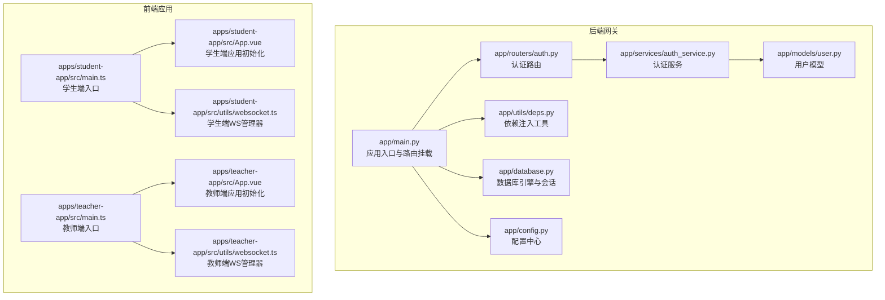
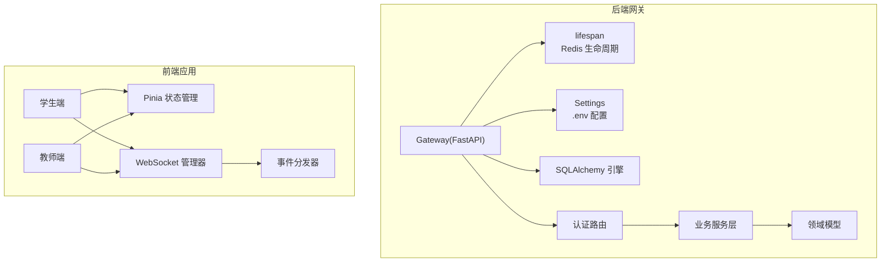
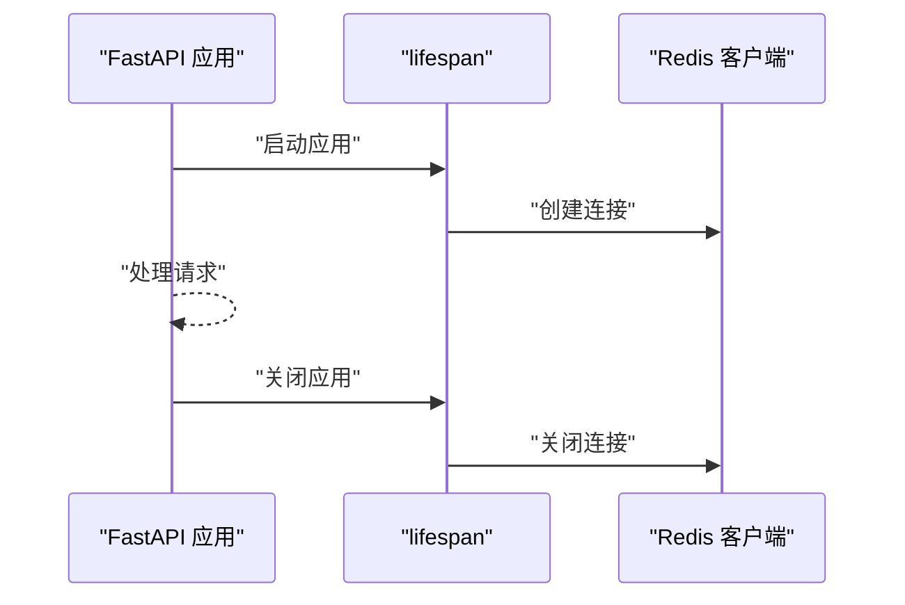
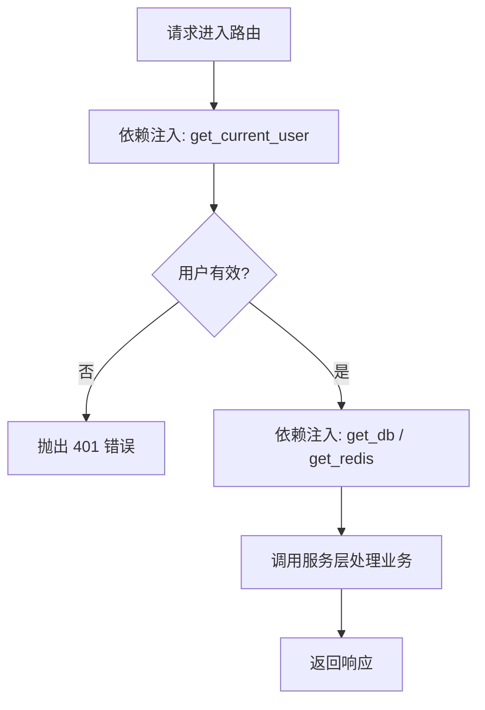
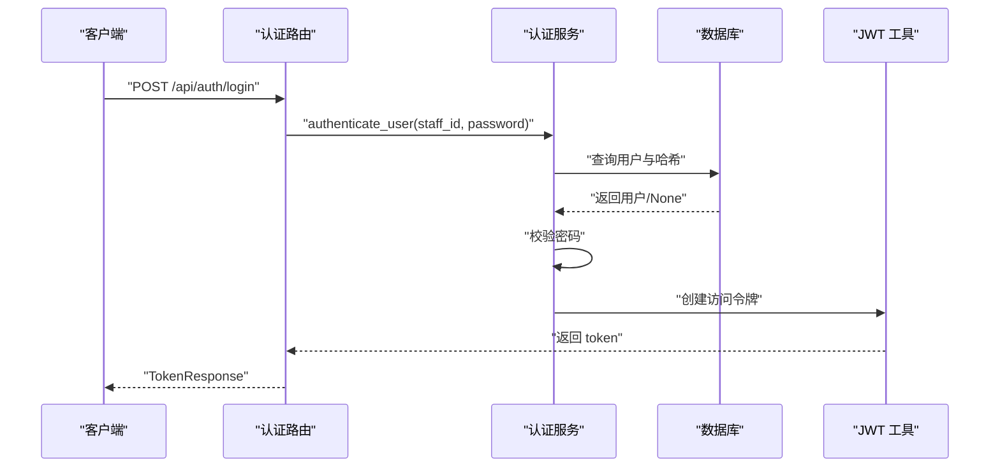
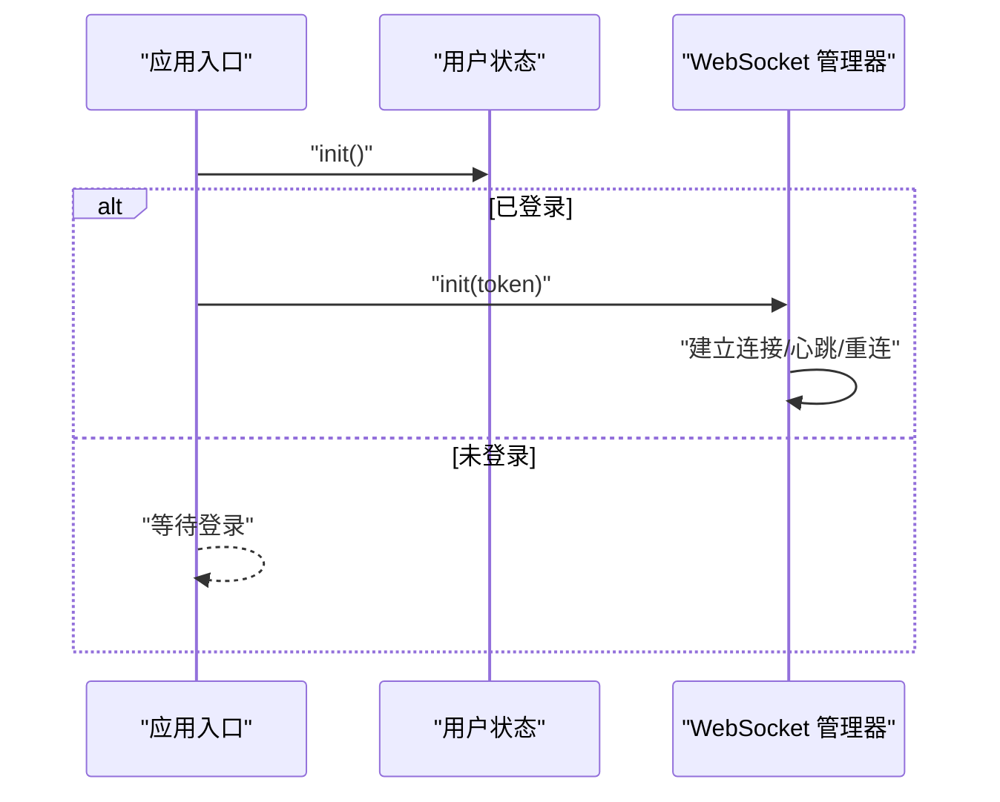
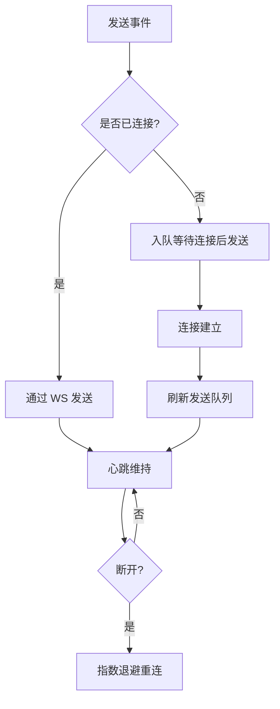
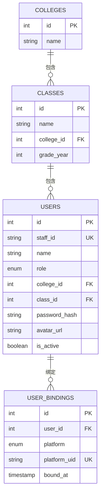
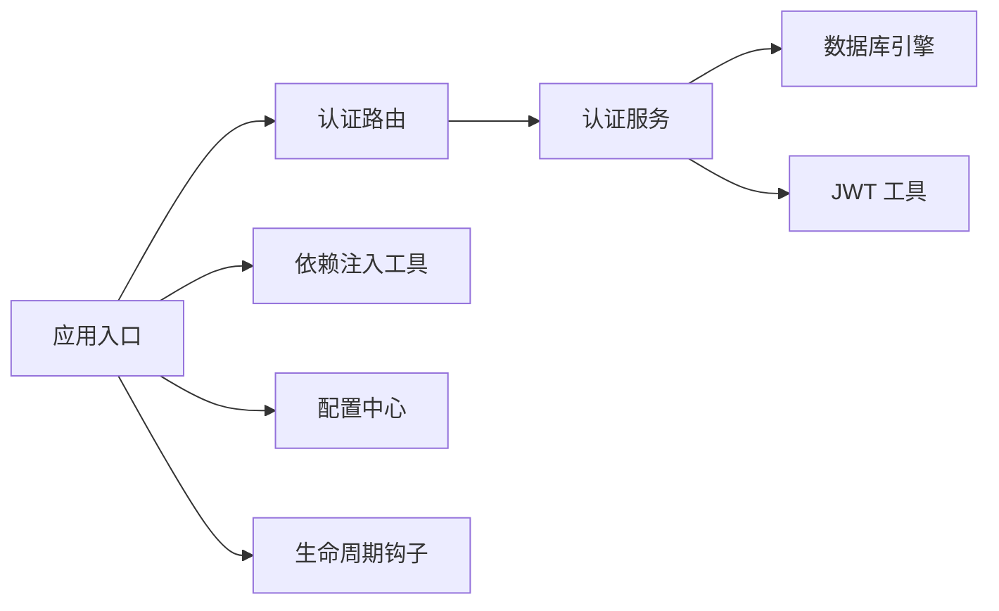

# 插件架构设计

<cite>
**本文引用的文件**
- [README.md](file://README.md)
- [services/gateway/app/main.py](file://services/gateway/app/main.py)
- [services/gateway/app/config.py](file://services/gateway/app/config.py)
- [services/gateway/app/database.py](file://services/gateway/app/database.py)
- [services/gateway/app/utils/deps.py](file://services/gateway/app/utils/deps.py)
- [services/gateway/app/routers/auth.py](file://services/gateway/app/routers/auth.py)
- [services/gateway/app/services/auth_service.py](file://services/gateway/app/services/auth_service.py)
- [services/gateway/app/models/user.py](file://services/gateway/app/models/user.py)
- [apps/student-app/src/main.ts](file://apps/student-app/src/main.ts)
- [apps/teacher-app/src/main.ts](file://apps/teacher-app/src/main.ts)
- [apps/student-app/src/App.vue](file://apps/student-app/src/App.vue)
- [apps/teacher-app/src/App.vue](file://apps/teacher-app/src/App.vue)
- [apps/student-app/src/utils/websocket.ts](file://apps/student-app/src/utils/websocket.ts)
- [apps/teacher-app/src/utils/websocket.ts](file://apps/teacher-app/src/utils/websocket.ts)
</cite>

## 目录
1. [引言](#引言)
2. [项目结构](#项目结构)
3. [核心组件](#核心组件)
4. [架构总览](#架构总览)
5. [详细组件分析](#详细组件分析)
6. [依赖分析](#依赖分析)
7. [性能考虑](#性能考虑)
8. [故障排查指南](#故障排查指南)
9. [结论](#结论)
10. [附录](#附录)

## 引言
本文件面向“医小管 v2”插件系统的架构设计与实现，聚焦于后端网关（FastAPI）与前端应用（UniApp/Vue 3）之间的插件化扩展能力。通过对现有代码的系统性分析，梳理插件接口抽象、依赖注入机制、配置管理、生命周期与注册流程、以及插件间通信与事件分发机制，并给出可复用的设计模式与最佳实践建议。

## 项目结构
- 后端网关采用 FastAPI + SQLAlchemy + Alembic，提供统一入口与路由挂载点，预留插件式扩展空间。
- 前端应用分为学生端与教师端，均基于 Vue 3 + Pinia，具备 WebSocket 事件驱动与状态管理能力，便于插件化功能集成。
- 配置通过 Pydantic Settings 管理，支持环境变量覆盖；数据库连接池与会话管理标准化。

**图示来源**
- [services/gateway/app/main.py:1-78](file://services/gateway/app/main.py#L1-L78)
- [services/gateway/app/config.py:1-31](file://services/gateway/app/config.py#L1-L31)
- [services/gateway/app/database.py:1-15](file://services/gateway/app/database.py#L1-L15)
- [services/gateway/app/utils/deps.py:1-40](file://services/gateway/app/utils/deps.py#L1-L40)
- [services/gateway/app/routers/auth.py:1-35](file://services/gateway/app/routers/auth.py#L1-L35)
- [services/gateway/app/services/auth_service.py:1-35](file://services/gateway/app/services/auth_service.py#L1-L35)
- [services/gateway/app/models/user.py:1-76](file://services/gateway/app/models/user.py#L1-L76)
- [apps/student-app/src/main.ts:1-11](file://apps/student-app/src/main.ts#L1-L11)
- [apps/teacher-app/src/main.ts:1-25](file://apps/teacher-app/src/main.ts#L1-L25)
- [apps/student-app/src/App.vue:1-36](file://apps/student-app/src/App.vue#L1-L36)
- [apps/teacher-app/src/App.vue:1-56](file://apps/teacher-app/src/App.vue#L1-L56)
- [apps/student-app/src/utils/websocket.ts:44-152](file://apps/student-app/src/utils/websocket.ts#L44-L152)
- [apps/teacher-app/src/utils/websocket.ts:99-168](file://apps/teacher-app/src/utils/websocket.ts#L99-L168)

**章节来源**
- [README.md:1-18](file://README.md#L1-L18)
- [services/gateway/app/main.py:1-78](file://services/gateway/app/main.py#L1-L78)
- [apps/student-app/src/main.ts:1-11](file://apps/student-app/src/main.ts#L1-L11)
- [apps/teacher-app/src/main.ts:1-25](file://apps/teacher-app/src/main.ts#L1-L25)

## 核心组件
- 应用入口与生命周期
  - 后端使用 lifespan 管理 Redis 连接的创建与关闭，确保资源生命周期可控。
  - 前端在应用启动时初始化用户状态与 WebSocket 连接，体现插件化初始化的典型模式。
- 依赖注入与中间件
  - 通过依赖注入函数获取数据库会话、Redis 实例与当前用户上下文，形成可替换、可测试的依赖链。
- 配置管理
  - 使用 Pydantic Settings 读取 .env 并暴露统一配置对象，便于插件读取运行参数。
- 认证与授权
  - 提供登录接口与基于 JWT 的用户解析逻辑，作为插件鉴权与权限控制的基础。
- 数据模型
  - 用户、角色、平台绑定等模型为插件扩展用户域能力提供数据基础。

**章节来源**
- [services/gateway/app/main.py:16-28](file://services/gateway/app/main.py#L16-L28)
- [services/gateway/app/utils/deps.py:14-39](file://services/gateway/app/utils/deps.py#L14-L39)
- [services/gateway/app/config.py:3-31](file://services/gateway/app/config.py#L3-L31)
- [services/gateway/app/routers/auth.py:12-35](file://services/gateway/app/routers/auth.py#L12-L35)
- [services/gateway/app/services/auth_service.py:8-35](file://services/gateway/app/services/auth_service.py#L8-L35)
- [services/gateway/app/models/user.py:45-76](file://services/gateway/app/models/user.py#L45-L76)
- [apps/teacher-app/src/main.ts:9-19](file://apps/teacher-app/src/main.ts#L9-L19)
- [apps/student-app/src/App.vue:5-8](file://apps/student-app/src/App.vue#L5-L8)

## 架构总览
下图展示“医小管 v2”的插件化扩展视图：后端网关作为统一入口，前端应用通过事件驱动与状态管理实现插件化功能；认证与会话贯穿前后端，为插件提供一致的上下文。

**图示来源**
- [services/gateway/app/main.py:16-28](file://services/gateway/app/main.py#L16-L28)
- [services/gateway/app/config.py:3-31](file://services/gateway/app/config.py#L3-L31)
- [services/gateway/app/database.py:6-15](file://services/gateway/app/database.py#L6-L15)
- [services/gateway/app/routers/auth.py:12-35](file://services/gateway/app/routers/auth.py#L12-L35)
- [services/gateway/app/services/auth_service.py:8-35](file://services/gateway/app/services/auth_service.py#L8-L35)
- [services/gateway/app/models/user.py:45-76](file://services/gateway/app/models/user.py#L45-L76)
- [apps/student-app/src/utils/websocket.ts:44-152](file://apps/student-app/src/utils/websocket.ts#L44-L152)
- [apps/teacher-app/src/utils/websocket.ts:99-168](file://apps/teacher-app/src/utils/websocket.ts#L99-L168)

## 详细组件分析

### 后端网关与生命周期管理
- 生命周期钩子
  - 在 lifespan 中创建 Redis 连接并在应用结束时释放，保证插件扩展的外部依赖（如缓存、消息队列）得到统一管理。
- 路由挂载点
  - 主程序预留多个 include_router 调用位置，便于按功能模块（如知识库、对话、动作）逐步引入插件式路由。
- 健康检查
  - 提供多组件健康检查（PostgreSQL、Redis、Dify），为插件部署与监控提供统一入口。

**图示来源**
- [services/gateway/app/main.py:16-28](file://services/gateway/app/main.py#L16-L28)

**章节来源**
- [services/gateway/app/main.py:16-28](file://services/gateway/app/main.py#L16-L28)
- [services/gateway/app/main.py:30-68](file://services/gateway/app/main.py#L30-L68)

### 依赖注入机制与配置管理
- 依赖注入
  - 通过 get_db、get_redis、get_current_user 等依赖函数，将数据库、缓存与用户上下文注入到路由处理器中，形成可替换、可测试的依赖链。
- 配置管理
  - Settings 类集中管理数据库、Redis、JWT、Dify、微信等配置项，支持 .env 文件覆盖，便于插件读取运行参数。

**图示来源**
- [services/gateway/app/utils/deps.py:14-39](file://services/gateway/app/utils/deps.py#L14-L39)
- [services/gateway/app/routers/auth.py:12-35](file://services/gateway/app/routers/auth.py#L12-L35)

**章节来源**
- [services/gateway/app/utils/deps.py:14-39](file://services/gateway/app/utils/deps.py#L14-L39)
- [services/gateway/app/config.py:3-31](file://services/gateway/app/config.py#L3-L31)

### 认证与授权插件化
- 登录流程
  - 路由接收凭证，服务层进行密码校验与用户状态检查，成功后签发 JWT。
- 当前用户解析
  - 依赖函数从 Authorization 头解析 JWT，查询用户并校验有效性，失败则返回 401。
- 插件扩展点
  - 可在服务层增加多因子认证、第三方登录、角色权限矩阵等扩展。

**图示来源**
- [services/gateway/app/routers/auth.py:12-21](file://services/gateway/app/routers/auth.py#L12-L21)
- [services/gateway/app/services/auth_service.py:8-17](file://services/gateway/app/services/auth_service.py#L8-L17)
- [services/gateway/app/services/auth_service.py:32-35](file://services/gateway/app/services/auth_service.py#L32-L35)

**章节来源**
- [services/gateway/app/routers/auth.py:12-35](file://services/gateway/app/routers/auth.py#L12-L35)
- [services/gateway/app/services/auth_service.py:8-35](file://services/gateway/app/services/auth_service.py#L8-L35)
- [services/gateway/app/utils/deps.py:14-35](file://services/gateway/app/utils/deps.py#L14-L35)

### 前端应用初始化与插件化入口
- 学生端
  - 应用启动时初始化用户状态，随后根据需要建立 WebSocket 连接，体现插件化初始化的典型模式。
- 教师端
  - 同步初始化用户状态与 WebSocket，支持断线重连与房间加入/离开等事件。

**图示来源**
- [apps/teacher-app/src/main.ts:9-19](file://apps/teacher-app/src/main.ts#L9-L19)
- [apps/student-app/src/App.vue:5-8](file://apps/student-app/src/App.vue#L5-L8)
- [apps/student-app/src/utils/websocket.ts:44-152](file://apps/student-app/src/utils/websocket.ts#L44-L152)
- [apps/teacher-app/src/utils/websocket.ts:99-168](file://apps/teacher-app/src/utils/websocket.ts#L99-L168)

**章节来源**
- [apps/teacher-app/src/main.ts:9-19](file://apps/teacher-app/src/main.ts#L9-L19)
- [apps/student-app/src/App.vue:5-8](file://apps/student-app/src/App.vue#L5-L8)

### 插件间通信与事件传递
- WebSocket 事件模型
  - 两端均实现事件分发器，支持监听/移除监听、发送队列、心跳与断线重连，形成稳定的插件间通信通道。
- 房间管理
  - 支持加入/离开房间，便于插件按会话维度隔离与聚合事件。

**图示来源**
- [apps/student-app/src/utils/websocket.ts:95-152](file://apps/student-app/src/utils/websocket.ts#L95-L152)
- [apps/teacher-app/src/utils/websocket.ts:120-168](file://apps/teacher-app/src/utils/websocket.ts#L120-L168)

**章节来源**
- [apps/student-app/src/utils/websocket.ts:44-152](file://apps/student-app/src/utils/websocket.ts#L44-L152)
- [apps/teacher-app/src/utils/websocket.ts:99-168](file://apps/teacher-app/src/utils/websocket.ts#L99-L168)

### 数据模型与状态共享
- 用户与角色
  - 用户模型包含角色、学院/班级关联与激活状态，为插件按角色/组织维度扩展提供数据基础。
- 平台绑定
  - 支持多平台绑定与唯一约束，便于插件跨平台状态同步与去重。

**图示来源**
- [services/gateway/app/models/user.py:23-76](file://services/gateway/app/models/user.py#L23-L76)

**章节来源**
- [services/gateway/app/models/user.py:45-76](file://services/gateway/app/models/user.py#L45-L76)

## 依赖分析
- 后端耦合与内聚
  - 路由层仅负责协议与参数，业务逻辑集中在服务层；依赖注入降低模块间耦合度。
- 前端状态与通信
  - Pinia 提供全局状态，WebSocket 管理器封装事件与连接，插件通过事件订阅实现松耦合扩展。
- 外部依赖
  - 数据库、Redis、Dify 通过配置与依赖注入统一接入，便于替换与扩展。

**图示来源**
- [services/gateway/app/routers/auth.py:12-35](file://services/gateway/app/routers/auth.py#L12-L35)
- [services/gateway/app/services/auth_service.py:8-35](file://services/gateway/app/services/auth_service.py#L8-L35)
- [services/gateway/app/database.py:6-15](file://services/gateway/app/database.py#L6-L15)
- [services/gateway/app/utils/deps.py:14-39](file://services/gateway/app/utils/deps.py#L14-L39)
- [services/gateway/app/config.py:3-31](file://services/gateway/app/config.py#L3-L31)
- [services/gateway/app/main.py:16-28](file://services/gateway/app/main.py#L16-L28)

**章节来源**
- [services/gateway/app/main.py:1-78](file://services/gateway/app/main.py#L1-L78)
- [services/gateway/app/utils/deps.py:14-39](file://services/gateway/app/utils/deps.py#L14-L39)

## 性能考虑
- 连接池与会话
  - 数据库连接池大小与会话过期策略需结合插件并发量调整，避免连接争用。
- 缓存与热点
  - Redis 作为缓存与会话存储，插件应避免热键与大体积数据，必要时拆分键空间。
- WebSocket
  - 合理设置心跳间隔与重连策略，避免频繁抖动；对高并发房间事件进行节流与批量处理。
- 健康检查
  - 将外部依赖纳入健康检查，及时发现插件扩展带来的性能瓶颈。

## 故障排查指南
- 认证失败
  - 检查 JWT 解析与用户状态，确认依赖注入链路与数据库连通性。
- WebSocket 断连
  - 查看心跳与重连日志，确认网络与服务端状态；核对房间加入/离开事件是否匹配。
- 配置异常
  - 核对 .env 文件与配置类字段映射，确保插件所需参数正确加载。

**章节来源**
- [services/gateway/app/utils/deps.py:14-35](file://services/gateway/app/utils/deps.py#L14-L35)
- [apps/student-app/src/utils/websocket.ts:129-135](file://apps/student-app/src/utils/websocket.ts#L129-L135)
- [apps/teacher-app/src/utils/websocket.ts:148-154](file://apps/teacher-app/src/utils/websocket.ts#L148-L154)
- [services/gateway/app/config.py:28-31](file://services/gateway/app/config.py#L28-L31)

## 结论
“医小管 v2”的插件架构以“后端网关 + 前端应用”的双端协同为核心，通过依赖注入、配置中心、生命周期钩子与事件驱动机制，为插件扩展提供了清晰的边界与可演进的空间。建议在后续开发中进一步明确插件接口规范、事件契约与状态共享协议，持续优化性能与可观测性。

## 附录
- 设计模式与最佳实践
  - 单一职责：路由、服务、模型各司其职，插件仅关注自身领域。
  - 开闭原则：通过依赖注入与接口抽象，对扩展开放、对修改封闭。
  - 事件驱动：以 WebSocket 事件与 Pinia 状态为中心，实现插件间松耦合通信。
  - 配置即代码：所有运行参数集中管理，便于插件参数化与环境隔离。