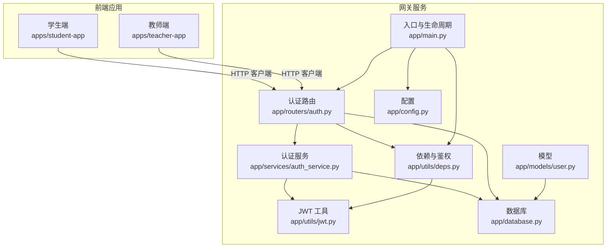
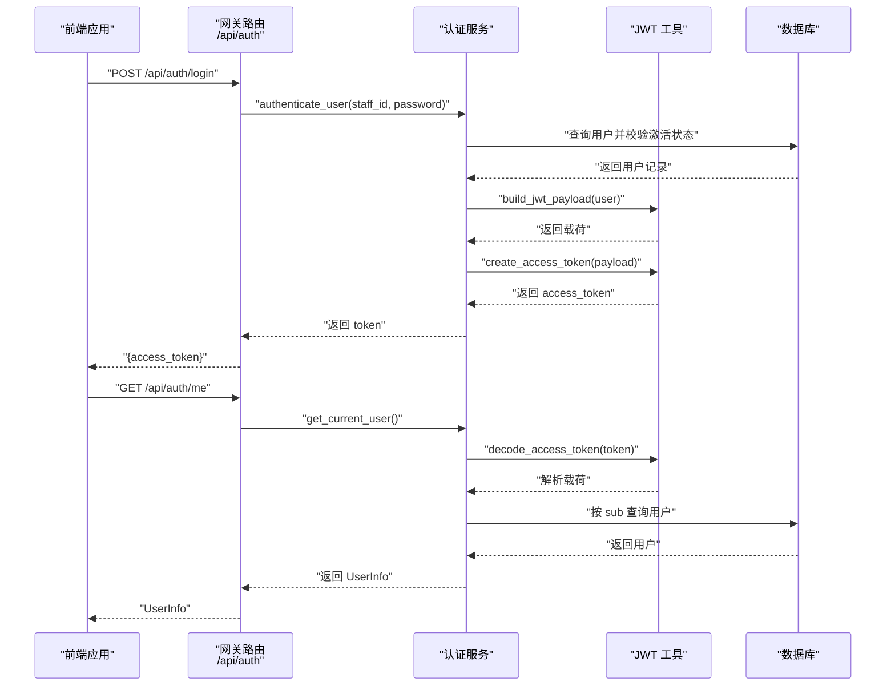
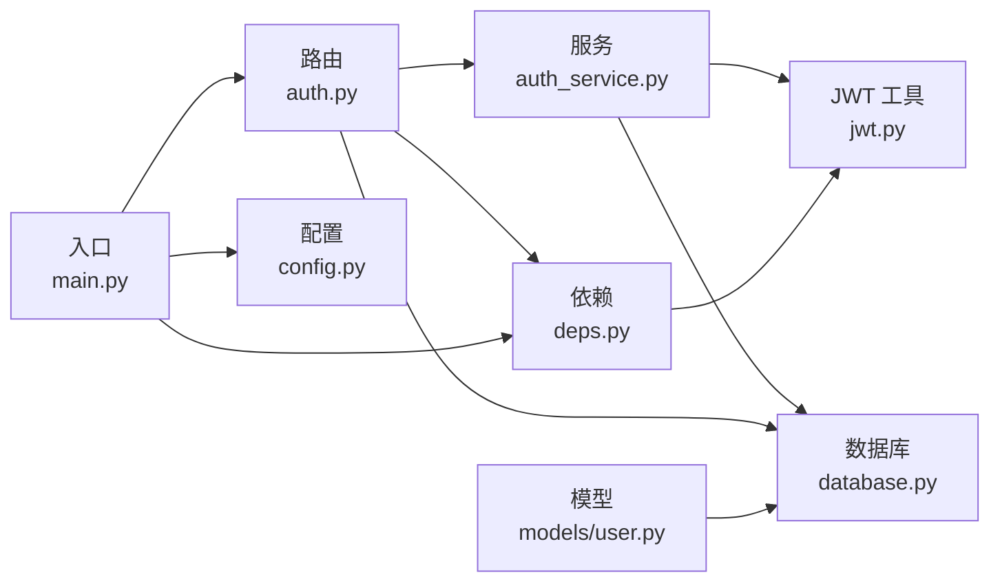

# 认证插件

<cite>
**本文引用的文件**
- [services/gateway/app/routers/auth.py](file://services/gateway/app/routers/auth.py)
- [services/gateway/app/services/auth_service.py](file://services/gateway/app/services/auth_service.py)
- [services/gateway/app/utils/jwt.py](file://services/gateway/app/utils/jwt.py)
- [services/gateway/app/schemas/auth.py](file://services/gateway/app/schemas/auth.py)
- [services/gateway/app/models/user.py](file://services/gateway/app/models/user.py)
- [services/gateway/app/utils/deps.py](file://services/gateway/app/utils/deps.py)
- [services/gateway/app/config.py](file://services/gateway/app/config.py)
- [services/gateway/app/main.py](file://services/gateway/app/main.py)
- [services/gateway/app/database.py](file://services/gateway/app/database.py)
- [apps/student-app/src/api/auth.ts](file://apps/student-app/src/api/auth.ts)
- [apps/teacher-app/src/api/auth.ts](file://apps/teacher-app/src/api/auth.ts)
- [apps/student-app/src/stores/user.ts](file://apps/student-app/src/stores/user.ts)
</cite>

## 目录
1. [简介](#简介)
2. [项目结构](#项目结构)
3. [核心组件](#核心组件)
4. [架构总览](#架构总览)
5. [详细组件分析](#详细组件分析)
6. [依赖分析](#依赖分析)
7. [性能考虑](#性能考虑)
8. [故障排查指南](#故障排查指南)
9. [结论](#结论)
10. [附录](#附录)

## 简介
本指南面向希望在现有网关系统中扩展“认证插件”的开发者，目标是提供一套可插拔、可扩展的认证体系，覆盖如下能力：
- 标准用户名/密码认证（当前实现）
- JWT 令牌签发与校验
- 基于角色的权限访问控制
- 第三方平台绑定与认证（如微信公众号、企业微信）
- 多因素认证（MFA）与第三方认证（OAuth/OIDC）的扩展路径
- 插件式配置与安全策略落地
- 测试、调试与部署流程

现有系统采用 FastAPI + SQLAlchemy 异步 ORM + Redis 缓存 + JWT 的组合，认证流程清晰、边界明确，便于在此基础上进行插件化改造。

## 项目结构
后端服务位于 services/gateway，前端应用位于 apps/student-app 与 apps/teacher-app。认证相关的关键模块分布如下：
- 路由层：/api/auth 登录与用户信息接口
- 服务层：用户认证、令牌签发
- 工具层：JWT 编解码
- 模型层：用户、角色、学院/班级、第三方绑定
- 配置层：数据库、Redis、JWT、Dify、微信等参数
- 前端：统一通过 /api/auth/* 发起认证请求，并持久化令牌与用户信息

图表来源
- [services/gateway/app/main.py:1-78](file://services/gateway/app/main.py#L1-L78)
- [services/gateway/app/routers/auth.py:1-35](file://services/gateway/app/routers/auth.py#L1-L35)
- [services/gateway/app/services/auth_service.py:1-35](file://services/gateway/app/services/auth_service.py#L1-L35)
- [services/gateway/app/utils/jwt.py:1-17](file://services/gateway/app/utils/jwt.py#L1-L17)
- [services/gateway/app/utils/deps.py:1-40](file://services/gateway/app/utils/deps.py#L1-L40)
- [services/gateway/app/config.py:1-31](file://services/gateway/app/config.py#L1-L31)
- [services/gateway/app/database.py:1-15](file://services/gateway/app/database.py#L1-L15)
- [services/gateway/app/models/user.py:1-76](file://services/gateway/app/models/user.py#L1-L76)

章节来源
- [services/gateway/app/main.py:1-78](file://services/gateway/app/main.py#L1-L78)
- [services/gateway/app/routers/auth.py:1-35](file://services/gateway/app/routers/auth.py#L1-L35)
- [services/gateway/app/config.py:1-31](file://services/gateway/app/config.py#L1-L31)

## 核心组件
- 认证路由与接口
  - 登录接口：接收学号/工号与密码，成功则签发 JWT
  - 用户信息接口：基于 JWT 解析当前用户信息
- 认证服务
  - 用户凭证校验（学号存在且密码正确）
  - 构建 JWT 载荷（包含用户标识、角色、组织信息等）
  - 签发 JWT
- JWT 工具
  - 签发带过期时间的访问令牌
  - 解码令牌并校验签名
- 依赖注入与鉴权
  - 提供 HTTP Bearer 依赖解析与校验
  - 从令牌解析用户 ID 并查询活跃用户
- 配置中心
  - 数据库、Redis、JWT 密钥/算法/过期时长
  - Dify 与微信平台参数预留
- 模型与数据
  - 用户、角色、学院/班级、第三方绑定
- 前端集成
  - 统一调用 /api/auth/* 接口
  - 本地存储令牌与用户信息，连接 WebSocket

章节来源
- [services/gateway/app/routers/auth.py:12-35](file://services/gateway/app/routers/auth.py#L12-L35)
- [services/gateway/app/services/auth_service.py:8-35](file://services/gateway/app/services/auth_service.py#L8-L35)
- [services/gateway/app/utils/jwt.py:6-17](file://services/gateway/app/utils/jwt.py#L6-L17)
- [services/gateway/app/utils/deps.py:14-35](file://services/gateway/app/utils/deps.py#L14-L35)
- [services/gateway/app/config.py:3-31](file://services/gateway/app/config.py#L3-L31)
- [services/gateway/app/models/user.py:45-76](file://services/gateway/app/models/user.py#L45-L76)
- [apps/student-app/src/api/auth.ts:9-19](file://apps/student-app/src/api/auth.ts#L9-L19)
- [apps/teacher-app/src/api/auth.ts:30-42](file://apps/teacher-app/src/api/auth.ts#L30-L42)
- [apps/student-app/src/stores/user.ts:15-52](file://apps/student-app/src/stores/user.ts#L15-L52)

## 架构总览
下图展示了从客户端到服务端的认证交互流程，以及 JWT 在其中的角色。

图表来源
- [services/gateway/app/routers/auth.py:12-35](file://services/gateway/app/routers/auth.py#L12-L35)
- [services/gateway/app/services/auth_service.py:8-35](file://services/gateway/app/services/auth_service.py#L8-L35)
- [services/gateway/app/utils/jwt.py:6-17](file://services/gateway/app/utils/jwt.py#L6-L17)
- [services/gateway/app/utils/deps.py:14-35](file://services/gateway/app/utils/deps.py#L14-L35)
- [services/gateway/app/database.py:12-15](file://services/gateway/app/database.py#L12-L15)

## 详细组件分析

### 路由与接口（/api/auth）
- 登录接口
  - 请求体：学号/工号与密码
  - 成功：签发 JWT 并返回 access_token
  - 失败：返回 401
- 用户信息接口
  - 使用 Bearer Token 访问
  - 返回用户基本信息（含角色、组织）

章节来源
- [services/gateway/app/routers/auth.py:12-35](file://services/gateway/app/routers/auth.py#L12-L35)
- [services/gateway/app/schemas/auth.py:4-23](file://services/gateway/app/schemas/auth.py#L4-L23)

### 认证服务（用户凭证校验与令牌签发）
- authenticate_user
  - 查询激活用户
  - 使用 bcrypt 校验密码哈希
- build_jwt_payload
  - 生成 JWT 载荷（sub、staff_id、role、college_id、class_id、name）
- issue_token
  - 调用 JWT 工具签发访问令牌

章节来源
- [services/gateway/app/services/auth_service.py:8-35](file://services/gateway/app/services/auth_service.py#L8-L35)

### JWT 工具（签发与解码）
- create_access_token
  - 基于配置的密钥与算法，设置过期时间
- decode_access_token
  - 校验签名并解码载荷，异常向上抛出

章节来源
- [services/gateway/app/utils/jwt.py:6-17](file://services/gateway/app/utils/jwt.py#L6-L17)
- [services/gateway/app/config.py:10-13](file://services/gateway/app/config.py#L10-L13)

### 依赖注入与鉴权中间件
- HTTP Bearer 依赖
  - 从 Authorization 头提取令牌
  - 解码并校验令牌有效性
  - 查询用户并确保用户处于激活状态
- Redis 注入
  - 通过应用状态注入 Redis 客户端，可用于黑名单、限流等

章节来源
- [services/gateway/app/utils/deps.py:14-39](file://services/gateway/app/utils/deps.py#L14-L39)
- [services/gateway/app/main.py:16-22](file://services/gateway/app/main.py#L16-L22)

### 数据模型与第三方绑定
- 用户模型
  - 角色枚举：student、teacher、admin
  - 关联学院/班级
- 第三方绑定
  - 平台类型枚举：wechat_mp、wechat_work、h5、app
  - 唯一约束：platform + platform_uid
- 为后续扩展提供基础：LDAP、企业微信、OAuth/OIDC 可映射到 UserBinding

章节来源
- [services/gateway/app/models/user.py:10-76](file://services/gateway/app/models/user.py#L10-L76)

### 前端集成与会话管理
- 统一调用 /api/auth/*
- 本地存储 access_token 与用户信息
- 连接 WebSocket 时携带令牌

章节来源
- [apps/student-app/src/api/auth.ts:9-19](file://apps/student-app/src/api/auth.ts#L9-L19)
- [apps/teacher-app/src/api/auth.ts:30-42](file://apps/teacher-app/src/api/auth.ts#L30-L42)
- [apps/student-app/src/stores/user.ts:15-52](file://apps/student-app/src/stores/user.ts#L15-L52)

## 依赖分析
- 组件耦合
  - 路由层仅依赖服务层与依赖注入，职责清晰
  - 服务层依赖模型与 JWT 工具，避免直接操作数据库细节
  - JWT 工具依赖配置中心，集中管理密钥与算法
- 外部依赖
  - 数据库：PostgreSQL（异步驱动）
  - 缓存：Redis（用于会话/限流/黑名单等）
  - 第三方：Dify、微信平台参数预留
- 潜在循环依赖
  - 当前模块间为单向依赖，未见循环

图表来源
- [services/gateway/app/routers/auth.py:1-35](file://services/gateway/app/routers/auth.py#L1-L35)
- [services/gateway/app/services/auth_service.py:1-35](file://services/gateway/app/services/auth_service.py#L1-L35)
- [services/gateway/app/utils/jwt.py:1-17](file://services/gateway/app/utils/jwt.py#L1-L17)
- [services/gateway/app/utils/deps.py:1-40](file://services/gateway/app/utils/deps.py#L1-L40)
- [services/gateway/app/database.py:1-15](file://services/gateway/app/database.py#L1-L15)
- [services/gateway/app/main.py:1-78](file://services/gateway/app/main.py#L1-L78)
- [services/gateway/app/config.py:1-31](file://services/gateway/app/config.py#L1-L31)
- [services/gateway/app/models/user.py:1-76](file://services/gateway/app/models/user.py#L1-L76)

## 性能考虑
- 数据库连接池
  - 异步引擎与会话工厂已配置固定池大小，建议结合压测调整
- Redis 缓存
  - 可用于令牌黑名单、限流、用户会话缓存，减少数据库压力
- JWT 过期策略
  - 合理设置过期时长，平衡安全性与用户体验
- 前端本地存储
  - 令牌与用户信息本地持久化，减少重复请求

章节来源
- [services/gateway/app/database.py:6-7](file://services/gateway/app/database.py#L6-L7)
- [services/gateway/app/config.py:10-13](file://services/gateway/app/config.py#L10-L13)
- [apps/student-app/src/stores/user.ts:15-52](file://apps/student-app/src/stores/user.ts#L15-L52)

## 故障排查指南
- 常见错误与定位
  - 401 未授权
    - 令牌缺失、格式错误、签名不合法、过期
    - 检查前端是否正确携带 Authorization 头
  - 用户不存在或已禁用
    - 核对用户 ID 是否存在于数据库且 is_active 为真
  - 数据库/Redis 不可用
    - 通过 /health 接口检查各组件健康状态
- 调试步骤
  - 后端：开启日志、捕获 JWTError、打印 SQL 执行情况
  - 前端：检查本地存储的令牌是否被覆盖、WebSocket 连接是否携带令牌
- 安全加固
  - 生产环境务必更换默认密钥与算法
  - 限制登录尝试次数、启用 IP 白名单
  - 对敏感接口增加速率限制与审计日志

章节来源
- [services/gateway/app/utils/deps.py:18-35](file://services/gateway/app/utils/deps.py#L18-L35)
- [services/gateway/app/main.py:30-68](file://services/gateway/app/main.py#L30-L68)
- [services/gateway/app/config.py:10-13](file://services/gateway/app/config.py#L10-L13)

## 结论
现有系统提供了清晰的认证骨架：标准用户名/密码认证、JWT 令牌管理、基于角色的访问控制与第三方绑定模型。在此基础上，可通过“插件化”扩展实现多因素认证、LDAP、企业微信、OAuth/OIDC 等多种认证方式，同时保持路由与服务层的稳定不变。

## 附录

### 插件化认证扩展蓝图
- 插件接口设计（建议）
  - 认证适配器接口
    - authenticate(platform, credentials) → User | None
    - bind_user(user_id, platform, platform_uid) → bool
  - 令牌适配器接口
    - issue_token(user) → str
    - validate_token(token) → dict
- 插件注册与路由扩展
  - 在路由层新增 /api/auth/{plugin} 入口
  - 通过配置中心动态加载插件列表
- 第三方平台扩展
  - 企业微信：使用 UserBinding 映射 platform=wechat_work
  - LDAP：在认证服务中新增 LDAP 认证分支
  - OAuth/OIDC：在路由层新增授权回调与令牌交换逻辑
- 安全策略
  - 令牌黑名单（Redis）、滑动过期、二次验证
  - 登录审计、异常登录告警
- 会话管理
  - 基于 Redis 的会话存储与失效策略
  - 前端自动刷新与登出清理

### 开发示例（概念性步骤）
- 企业微信认证
  - 在路由层新增 /api/auth/wechat_work
  - 实现回调处理与用户绑定逻辑
  - 使用 UserBinding 将 platform_uid 与用户关联
- LDAP 认证
  - 在认证服务中新增 authenticate_user_ldap
  - 与现有 authenticate_user 并行，通过配置开关切换
- 多因素认证（MFA）
  - 登录阶段先执行基础认证
  - 发送验证码至绑定的手机号/邮箱
  - 验证通过后签发 JWT

### 配置管理
- 环境变量与配置文件
  - 数据库、Redis、JWT 参数集中于配置类
  - 第三方平台参数预留字段
- 动态配置
  - 支持运行时热更新认证插件列表与开关

章节来源
- [services/gateway/app/config.py:3-31](file://services/gateway/app/config.py#L3-L31)
- [services/gateway/app/models/user.py:63-76](file://services/gateway/app/models/user.py#L63-L76)

### 测试、调试与部署
- 单元测试
  - 路由层：模拟请求体与响应断言
  - 服务层：mock 数据库与 JWT 工具
  - 依赖层：mock 令牌解码与用户查询
- 集成测试
  - /api/auth/login 与 /api/auth/me 端到端验证
  - 401 场景与用户状态变更场景
- 调试
  - 后端：FastAPI 文档与日志
  - 前端：检查本地存储与网络请求头
- 部署
  - Docker Compose 与 Nginx 网关
  - 环境变量注入与密钥轮换
  - 健康检查与探针配置

章节来源
- [services/gateway/app/main.py:30-68](file://services/gateway/app/main.py#L30-L68)
- [services/gateway/app/routers/auth.py:12-35](file://services/gateway/app/routers/auth.py#L12-L35)
- [apps/student-app/src/api/auth.ts:9-19](file://apps/student-app/src/api/auth.ts#L9-L19)
- [apps/teacher-app/src/api/auth.ts:30-42](file://apps/teacher-app/src/api/auth.ts#L30-L42)