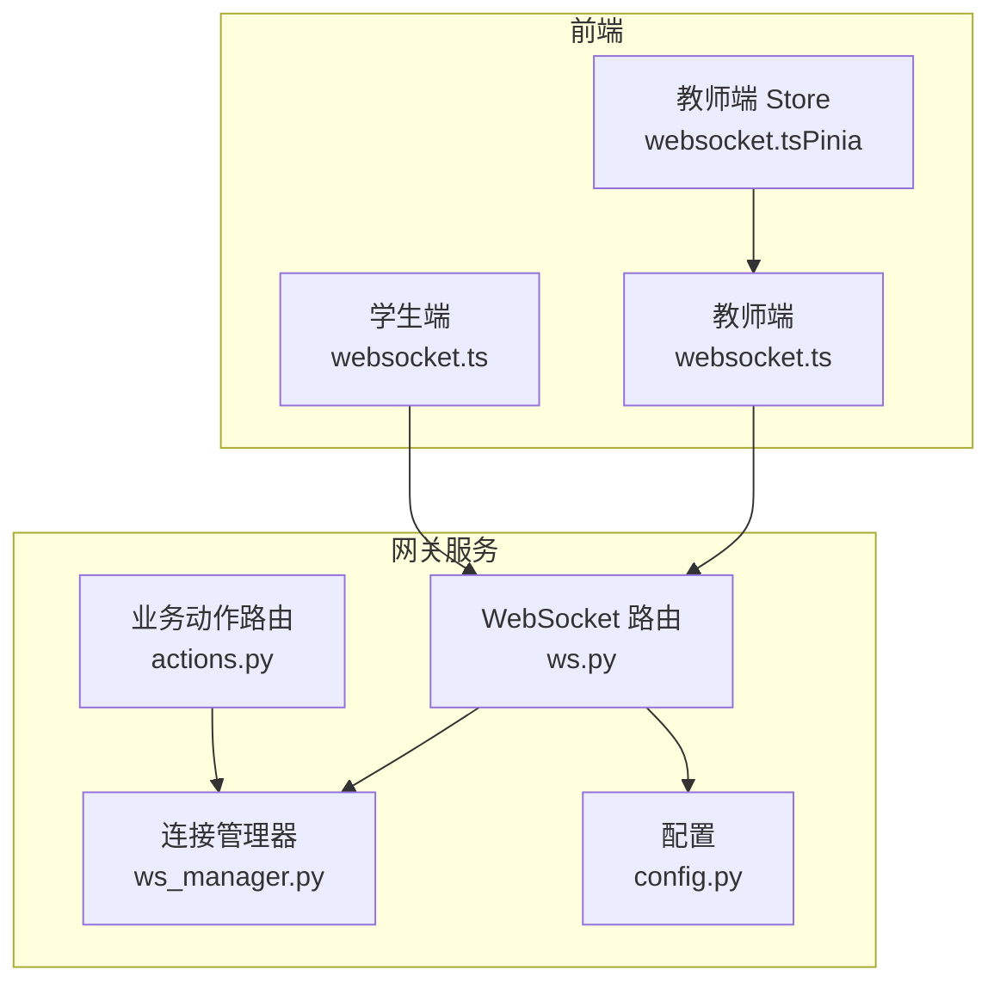
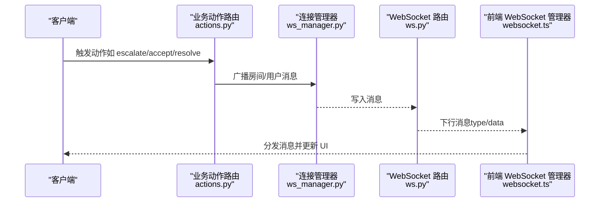
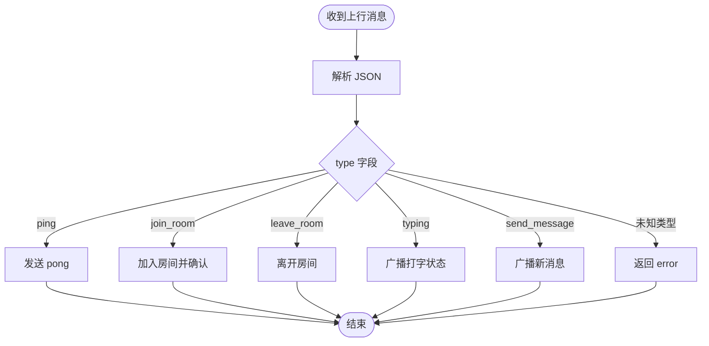
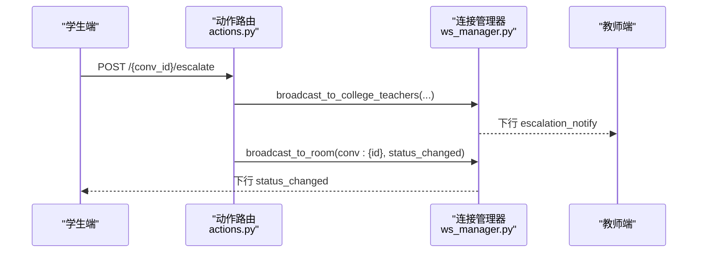
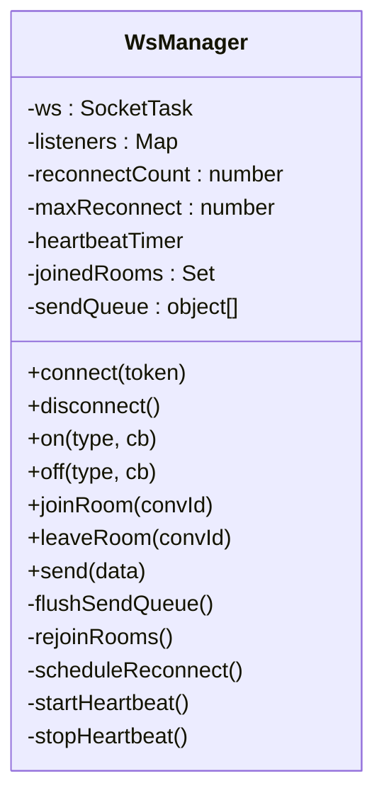
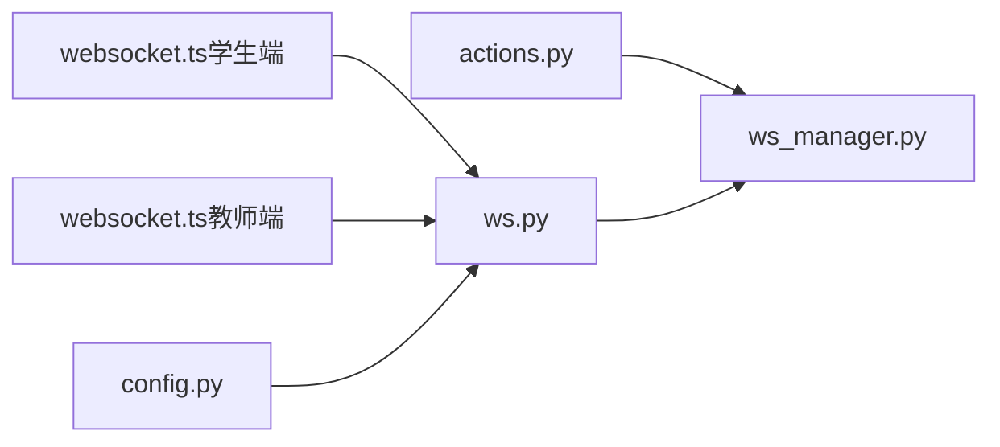

# 通知插件

<cite>
**本文引用的文件**
- [README.md](file://README.md)
- [ws_manager.py](file://services/gateway/app/services/ws_manager.py)
- [ws.py](file://services/gateway/app/routers/ws.py)
- [actions.py](file://services/gateway/app/routers/actions.py)
- [websocket.ts（学生端）](file://apps/student-app/src/utils/websocket.ts)
- [websocket.ts（教师端）](file://apps/teacher-app/src/utils/websocket.ts)
- [websocket.ts（教师端 Pinia Store）](file://apps/teacher-app/src/stores/websocket.ts)
- [config.py](file://services/gateway/app/config.py)
- [s2-ws-test.py](file://scripts/s2-ws-test.py)
- [ws_test.py](file://ws_test.py)
- [dev-plan-v2.md](file://docs/design/dev-plan-v2.md)
</cite>

## 目录
1. [简介](#简介)
2. [项目结构](#项目结构)
3. [核心组件](#核心组件)
4. [架构总览](#架构总览)
5. [详细组件分析](#详细组件分析)
6. [依赖关系分析](#依赖关系分析)
7. [性能考虑](#性能考虑)
8. [故障排查指南](#故障排查指南)
9. [结论](#结论)
10. [附录](#附录)

## 简介
本指南面向需要在实时通信系统中扩展“通知插件”的开发者，系统性讲解如何基于现有 WebSocket 通知通道，扩展出邮件、短信、企业微信、钉钉等多渠道通知插件。文档覆盖插件接口定义、消息格式、推送策略、配置管理、优先级与重试机制，并提供可落地的开发步骤与最佳实践。

## 项目结构
本项目采用前后端分离与插件化思路：
- 网关服务（FastAPI）负责认证、状态机流转、通知广播与 WebSocket 管理
- 学生端与教师端前端通过统一的 WebSocket 管理器订阅房间消息
- 通知插件以“适配器”形式接入网关，实现不同渠道的消息投递

图表来源
- [ws.py:11-119](file://services/gateway/app/routers/ws.py#L11-L119)
- [ws_manager.py:8-100](file://services/gateway/app/services/ws_manager.py#L8-L100)
- [actions.py:35-65](file://services/gateway/app/routers/actions.py#L35-L65)
- [websocket.ts（学生端）:1-153](file://apps/student-app/src/utils/websocket.ts#L1-L153)
- [websocket.ts（教师端）:1-169](file://apps/teacher-app/src/utils/websocket.ts#L1-L169)
- [websocket.ts（教师端 Pinia Store）:1-31](file://apps/teacher-app/src/stores/websocket.ts#L1-L31)
- [config.py:1-31](file://services/gateway/app/config.py#L1-L31)

章节来源
- [README.md: 1-18:1-18](file://README.md#L1-L18)
- [ws.py: 11-119:11-119](file://services/gateway/app/routers/ws.py#L11-L119)
- [ws_manager.py: 8-100:8-100](file://services/gateway/app/services/ws_manager.py#L8-L100)
- [actions.py: 35-65:35-65](file://services/gateway/app/routers/actions.py#L35-L65)
- [websocket.ts（学生端）: 1-153:1-153](file://apps/student-app/src/utils/websocket.ts#L1-L153)
- [websocket.ts（教师端）: 1-169:1-169](file://apps/teacher-app/src/utils/websocket.ts#L1-L169)
- [websocket.ts（教师端 Pinia Store）: 1-31:1-31](file://apps/teacher-app/src/stores/websocket.ts#L1-L31)
- [config.py: 1-31:1-31](file://services/gateway/app/config.py#L1-L31)

## 核心组件
- WebSocket 连接管理器：维护用户连接与房间广播，支持按用户或房间投递消息
- WebSocket 路由：处理认证、心跳、房间加入/离开、消息广播
- 业务动作路由：在状态变更或事件触发时，调用连接管理器进行通知广播
- 前端 WebSocket 管理器：统一封装连接、心跳、重连、房间加入、消息分发
- 配置模块：集中管理数据库、JWT、Dify、微信等配置项

章节来源
- [ws_manager.py: 8-100:8-100](file://services/gateway/app/services/ws_manager.py#L8-L100)
- [ws.py: 11-119:11-119](file://services/gateway/app/routers/ws.py#L11-L119)
- [actions.py: 35-65:35-65](file://services/gateway/app/routers/actions.py#L35-L65)
- [websocket.ts（学生端）: 1-153:1-153](file://apps/student-app/src/utils/websocket.ts#L1-L153)
- [websocket.ts（教师端）: 1-169:1-169](file://apps/teacher-app/src/utils/websocket.ts#L1-L169)
- [config.py: 1-31:1-31](file://services/gateway/app/config.py#L1-L31)

## 架构总览
下图展示了从“业务动作”到“前端通知”的完整链路，以及可扩展的通知插件位置：

图表来源
- [actions.py: 68-89:68-89](file://services/gateway/app/routers/actions.py#L68-L89)
- [ws_manager.py: 71-81:71-81](file://services/gateway/app/services/ws_manager.py#L71-L81)
- [ws.py: 47-113:47-113](file://services/gateway/app/routers/ws.py#L47-L113)
- [websocket.ts（学生端）: 44-50:44-50](file://apps/student-app/src/utils/websocket.ts#L44-L50)
- [websocket.ts（教师端）: 88-96:88-96](file://apps/teacher-app/src/utils/websocket.ts#L88-L96)

## 详细组件分析

### WebSocket 通知通道（核心）
- 认证：通过查询参数携带 JWT，解码后建立用户连接映射
- 房间模型：房间 ID 使用“conv:{conversation_id}”，支持按房间广播
- 心跳与重连：前端每 30 秒发送 ping，断线指数回退重连
- 广播策略：按房间广播（如新消息、状态变更）或按用户广播（如升级通知）

图表来源
- [ws.py: 47-113:47-113](file://services/gateway/app/routers/ws.py#L47-L113)

章节来源
- [ws.py: 11-119:11-119](file://services/gateway/app/routers/ws.py#L11-L119)
- [ws_manager.py: 8-100:8-100](file://services/gateway/app/services/ws_manager.py#L8-L100)
- [websocket.ts（学生端）: 137-149:137-149](file://apps/student-app/src/utils/websocket.ts#L137-L149)
- [websocket.ts（教师端）: 156-165:156-165](file://apps/teacher-app/src/utils/websocket.ts#L156-L165)

### 业务动作与通知广播
- 学生发起“升级”动作时，触发广播“escalation_notify”
- 教师接单/解决/关闭时，广播“status_changed”
- 广播目标：房间内所有在线成员或按用户广播给相关教师

图表来源
- [actions.py: 68-89:68-89](file://services/gateway/app/routers/actions.py#L68-L89)
- [actions.py: 35-65:35-65](file://services/gateway/app/routers/actions.py#L35-L65)
- [ws_manager.py: 83-91:83-91](file://services/gateway/app/services/ws_manager.py#L83-L91)

章节来源
- [actions.py: 35-65:35-65](file://services/gateway/app/routers/actions.py#L35-L65)
- [actions.py: 68-89:68-89](file://services/gateway/app/routers/actions.py#L68-L89)
- [ws_manager.py: 83-91:83-91](file://services/gateway/app/services/ws_manager.py#L83-L91)

### 前端 WebSocket 管理器
- 单连接 + 房间模式：连接成功后自动重发发送队列与房间重加入
- 心跳：每 30 秒发送 ping，断线后指数回退重连（最多 10 次）
- 事件分发：统一 on/off 注册监听，支持通配符监听

图表来源
- [websocket.ts（学生端）: 3-153:3-153](file://apps/student-app/src/utils/websocket.ts#L3-L153)
- [websocket.ts（教师端）: 9-169:9-169](file://apps/teacher-app/src/utils/websocket.ts#L9-L169)

章节来源
- [websocket.ts（学生端）: 1-153:1-153](file://apps/student-app/src/utils/websocket.ts#L1-L153)
- [websocket.ts（教师端）: 1-169:1-169](file://apps/teacher-app/src/utils/websocket.ts#L1-L169)
- [websocket.ts（教师端 Pinia Store）: 1-31:1-31](file://apps/teacher-app/src/stores/websocket.ts#L1-L31)

### 通知插件接口定义与消息格式
- 插件接口职责
  - 输入：标准化通知数据对象（含目标标识、标题、正文、附加字段）
  - 输出：投递结果（成功/失败）、错误码、重试建议
- 消息格式
  - WebSocket 下行消息统一使用 { type, data } 结构
  - 通知类型举例：new_message、status_changed、escalation_notify、teacher_typing、pong、error
- 插件扩展点
  - 在业务动作路由中，于广播前/后插入插件调用
  - 插件实现：邮件、短信、企业微信、钉钉等渠道适配器

章节来源
- [ws.py: 20-34:20-34](file://services/gateway/app/routers/ws.py#L20-L34)
- [actions.py: 55-64:55-64](file://services/gateway/app/routers/actions.py#L55-L64)

### 通知插件开发步骤（以企业微信为例）
- 步骤 1：定义插件接口与配置
  - 接口：send_notification(notification_data) -> delivery_result
  - 配置：在配置模块中新增企业微信相关字段（如企业ID、应用ID、密钥）
- 步骤 2：实现适配器
  - 获取企业微信 Token
  - 构造消息体（文本/卡片/富文本）
  - 发送并处理响应（成功/失败、限流/频率限制）
- 步骤 3：集成到业务动作
  - 在 escalate/accept/resolve 等动作完成后，调用插件 send_notification
  - 失败时记录日志并触发重试
- 步骤 4：前端联动
  - 若需同步提醒，可在 WebSocket 广播中增加“通知已送达”状态，或通过独立通知列表页展示

章节来源
- [config.py: 21-27:21-27](file://services/gateway/app/config.py#L21-L27)
- [actions.py: 68-89:68-89](file://services/gateway/app/routers/actions.py#L68-L89)

### 配置管理、优先级与重试机制
- 配置管理
  - 使用配置模块集中管理各渠道凭据与开关
  - 支持按租户/学院维度启用不同通知策略
- 优先级控制
  - 重要通知（如升级）优先走高优先级通道（如企业微信/短信）
  - 普通通知（如状态变更）可降级为低优先级通道（如邮件）
- 重试机制
  - 指数回退重试（最大次数、最大等待时间）
  - 失败原因分类：网络异常、鉴权失败、渠道限流、内容审核不通过
  - 带幂等键的去重，避免重复投递

章节来源
- [websocket.ts（学生端）: 129-135:129-135](file://apps/student-app/src/utils/websocket.ts#L129-L135)
- [websocket.ts（教师端）: 148-154:148-154](file://apps/teacher-app/src/utils/websocket.ts#L148-L154)

### 性能优化与监控
- 性能优化
  - 批量投递：合并同一租户/房间的通知
  - 去抖动：对频繁状态变更进行节流
  - 连接池：企业微信/短信 SDK 使用连接池与并发限制
- 监控指标
  - 通知成功率、平均耗时、失败原因分布
  - 渠道限流命中率、重试次数统计
  - 前端心跳丢失率、重连次数

章节来源
- [ws_manager.py: 59-81:59-81](file://services/gateway/app/services/ws_manager.py#L59-L81)
- [ws.py: 114-118:114-118](file://services/gateway/app/routers/ws.py#L114-L118)

## 依赖关系分析
- 网关服务依赖
  - WebSocket 路由依赖连接管理器进行广播
  - 业务动作路由依赖连接管理器与状态机
  - 前端依赖 WebSocket 路由与连接管理器
- 外部依赖
  - 企业微信/钉钉等第三方 SDK
  - 邮件/短信服务商 SDK
  - Redis（可选，用于限流与去重）

图表来源
- [actions.py: 9](file://services/gateway/app/routers/actions.py#L9)
- [ws_manager.py: 1](file://services/gateway/app/services/ws_manager.py#L1)
- [ws.py: 1](file://services/gateway/app/routers/ws.py#L1)
- [websocket.ts（学生端）: 1](file://apps/student-app/src/utils/websocket.ts#L1)
- [websocket.ts（教师端）: 1](file://apps/teacher-app/src/utils/websocket.ts#L1)
- [config.py: 1](file://services/gateway/app/config.py#L1)

章节来源
- [actions.py: 1-154:1-154](file://services/gateway/app/routers/actions.py#L1-L154)
- [ws_manager.py: 1-100:1-100](file://services/gateway/app/services/ws_manager.py#L1-L100)
- [ws.py: 1-119:1-119](file://services/gateway/app/routers/ws.py#L1-L119)
- [websocket.ts（学生端）: 1-153:1-153](file://apps/student-app/src/utils/websocket.ts#L1-L153)
- [websocket.ts（教师端）: 1-169:1-169](file://apps/teacher-app/src/utils/websocket.ts#L1-L169)
- [config.py: 1-31:1-31](file://services/gateway/app/config.py#L1-L31)

## 性能考虑
- 连接与广播
  - 使用房间广播减少逐用户遍历成本
  - 断线清理与死连接检测，避免资源泄露
- 前端体验
  - 心跳与指数回退重连，提升弱网稳定性
  - 发送队列与重加入房间，确保消息可达性
- 通知投递
  - 限流与熔断：对第三方渠道设置 QPS 与超时阈值
  - 幂等与去重：基于消息 ID 去重，防止重复投递

章节来源
- [ws_manager.py: 34-46:34-46](file://services/gateway/app/services/ws_manager.py#L34-L46)
- [ws_manager.py: 71-81:71-81](file://services/gateway/app/services/ws_manager.py#L71-L81)
- [websocket.ts（学生端）: 112-127:112-127](file://apps/student-app/src/utils/websocket.ts#L112-L127)
- [websocket.ts（教师端）: 120-135:120-135](file://apps/teacher-app/src/utils/websocket.ts#L120-L135)

## 故障排查指南
- WebSocket 连接问题
  - 现象：断线/无法重连
  - 排查：检查心跳是否正常、断线回调是否触发、指数回退是否生效
- 认证失败
  - 现象：连接被关闭（4001）
  - 排查：确认 token 是否有效、过期时间、角色权限
- 消息未到达
  - 现象：前端未收到消息
  - 排查：确认房间加入、广播目标、消息类型是否正确
- 测试脚本
  - 使用提供的 WebSocket 测试脚本验证 ping/pong 与错误处理

章节来源
- [ws.py: 35-42:35-42](file://services/gateway/app/routers/ws.py#L35-L42)
- [ws.py: 114-118:114-118](file://services/gateway/app/routers/ws.py#L114-L118)
- [s2-ws-test.py: 31-50:31-50](file://scripts/s2-ws-test.py#L31-L50)
- [ws_test.py: 1-8:1-8](file://ws_test.py#L1-L8)

## 结论
通过现有 WebSocket 通知通道与连接管理器，可以低成本扩展多种通知渠道。建议以“插件化适配器”方式接入邮件、短信、企业微信、钉钉等渠道，结合配置管理、优先级与重试机制，构建稳定可靠的多渠道通知体系。同时，关注性能与监控，持续优化用户体验与系统可靠性。

## 附录
- 企业微信集成背景参考：项目设计文档中关于“企微机器人 + 轻量 H5”的推荐架构，可作为通知渠道落地的参考方向

章节来源
- [dev-plan-v2.md: 116-158:116-158](file://docs/design/dev-plan-v2.md#L116-L158)