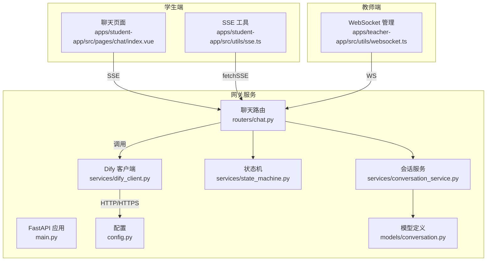
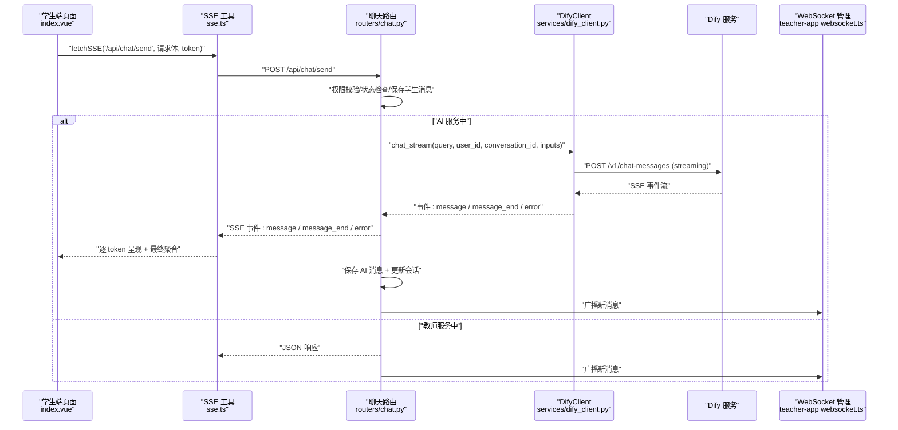
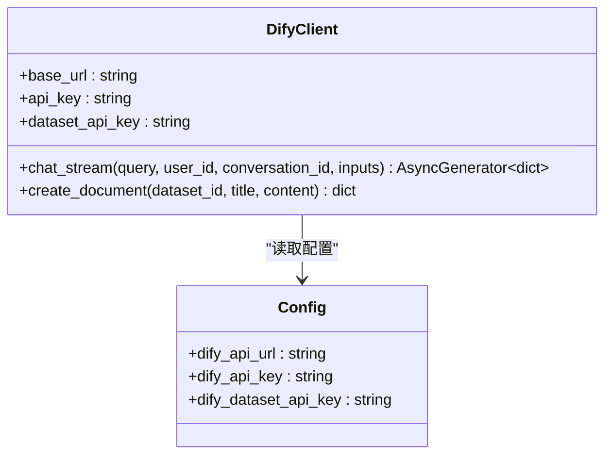
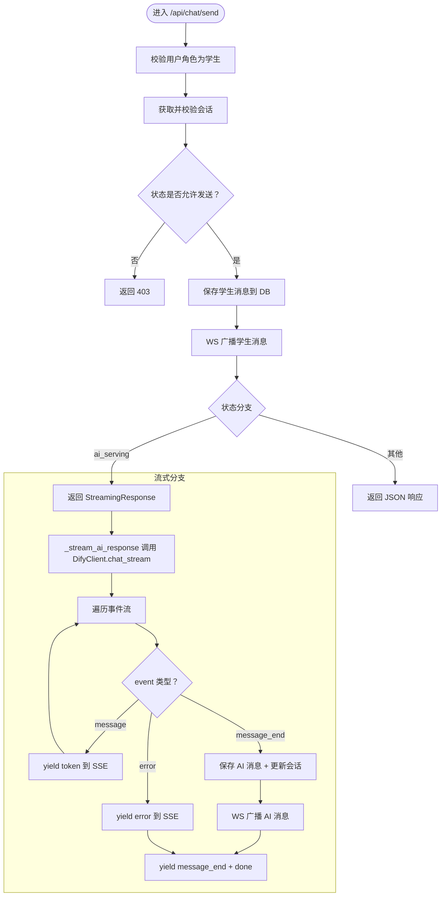
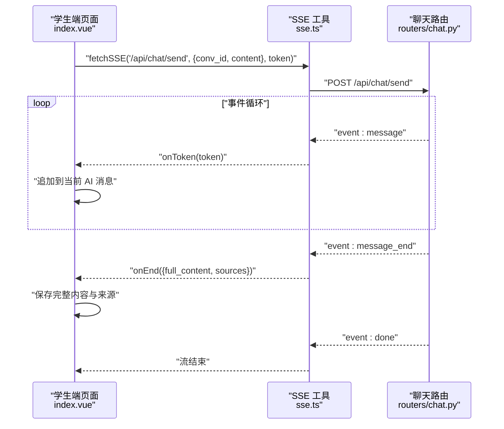
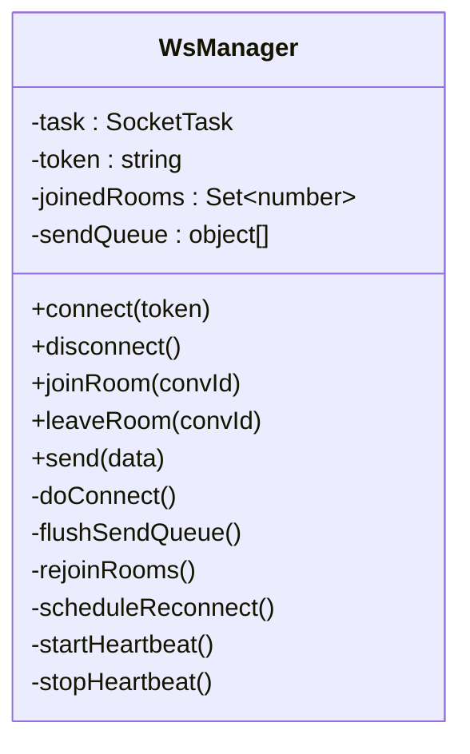
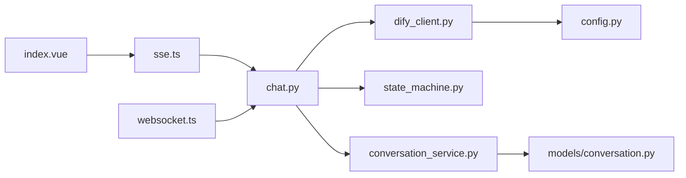

# AI 引擎集成

<cite>
**本文引用的文件**   
- [dify_client.py](file://services/gateway/app/services/dify_client.py)
- [chat.py（网关路由）](file://services/gateway/app/routers/chat.py)
- [main.py（网关入口）](file://services/gateway/app/main.py)
- [config.py（配置）](file://services/gateway/app/config.py)
- [chat.py（请求模型）](file://services/gateway/app/schemas/chat.py)
- [state_machine.py（状态机）](file://services/gateway/app/services/state_machine.py)
- [conversation_service.py（会话服务）](file://services/gateway/app/services/conversation_service.py)
- [conversation.py（模型）](file://services/gateway/app/models/conversation.py)
- [chat.ts（学生端 SSE 工具）](file://apps/student-app/src/utils/sse.ts)
- [index.vue（学生端聊天页面）](file://apps/student-app/src/pages/chat/index.vue)
- [websocket.ts（教师端 WS 管理）](file://apps/teacher-app/src/utils/websocket.ts)
</cite>

## 目录
1. [简介](#简介)
2. [项目结构](#项目结构)
3. [核心组件](#核心组件)
4. [架构总览](#架构总览)
5. [详细组件分析](#详细组件分析)
6. [依赖分析](#依赖分析)
7. [性能考虑](#性能考虑)
8. [故障排查指南](#故障排查指南)
9. [结论](#结论)
10. [附录](#附录)

## 简介
本文件面向“AI 引擎集成”的落地实现，聚焦 Dify AI 服务在本项目的集成方式，包括：
- 流式聊天 API 的实现与前端 SSE 解析
- 文档创建 API 的使用场景与封装
- DifyClient 类的设计模式、异步流式处理机制与 SSE 事件解析
- 完整的调用示例、参数配置、错误处理与超时设置
- 如何替换或扩展 AI 引擎（接口抽象、配置管理、性能优化）

目标是帮助开发者快速理解并安全地扩展或替换 AI 引擎，同时保证前后端交互的一致性与稳定性。

## 项目结构
本项目采用“网关 + 前后端应用”的分层架构：
- 网关服务（FastAPI）负责认证、会话状态管理、Dify 调用与 SSE/WS 广播
- 学生端（Vue + UniApp）通过 SSE 实时接收流式回答
- 教师端（Vue + UniApp）通过 WebSocket 接收实时消息与状态变更

**图表来源**
- [main.py:1-78](file://services/gateway/app/main.py#L1-L78)
- [chat.py（网关路由）:1-191](file://services/gateway/app/routers/chat.py#L1-L191)
- [dify_client.py:1-105](file://services/gateway/app/services/dify_client.py#L1-L105)
- [config.py:1-31](file://services/gateway/app/config.py#L1-L31)
- [state_machine.py:1-96](file://services/gateway/app/services/state_machine.py#L1-L96)
- [conversation_service.py:1-179](file://services/gateway/app/services/conversation_service.py#L1-L179)
- [conversation.py:1-63](file://services/gateway/app/models/conversation.py#L1-L63)
- [chat.ts（学生端 SSE 工具）:1-69](file://apps/student-app/src/utils/sse.ts#L1-L69)
- [index.vue（学生端聊天页面）:1-649](file://apps/student-app/src/pages/chat/index.vue#L1-L649)
- [websocket.ts（教师端 WS 管理）:1-169](file://apps/teacher-app/src/utils/websocket.ts#L1-L169)

**章节来源**
- [main.py:1-78](file://services/gateway/app/main.py#L1-L78)
- [chat.py（网关路由）:1-191](file://services/gateway/app/routers/chat.py#L1-L191)
- [dify_client.py:1-105](file://services/gateway/app/services/dify_client.py#L1-L105)
- [config.py:1-31](file://services/gateway/app/config.py#L1-L31)

## 核心组件
- DifyClient：封装 Dify 的流式聊天与文档创建 API，统一鉴权头与超时控制
- 网关路由 chat：负责权限校验、会话状态流转、消息持久化、SSE/WS 广播
- 学生端 SSE 工具：解析服务器推送的事件流，逐 token 呈现并最终聚合
- 教师端 WS 管理：维护长连接、心跳、房间加入/离开、消息分发
- 配置中心：集中管理 Dify 地址、密钥、全局数据集 ID 等

**章节来源**
- [dify_client.py:11-105](file://services/gateway/app/services/dify_client.py#L11-L105)
- [chat.py（网关路由）:22-191](file://services/gateway/app/routers/chat.py#L22-L191)
- [chat.ts（学生端 SSE 工具）:13-69](file://apps/student-app/src/utils/sse.ts#L13-L69)
- [websocket.ts（教师端 WS 管理）:9-169](file://apps/teacher-app/src/utils/websocket.ts#L9-L169)
- [config.py:15-19](file://services/gateway/app/config.py#L15-L19)

## 架构总览
下图展示了从学生发起消息到 Dify 返回流式结果的端到端流程，以及教师端的实时广播路径。

**图表来源**
- [index.vue（学生端聊天页面）:424-481](file://apps/student-app/src/pages/chat/index.vue#L424-L481)
- [chat.ts（学生端 SSE 工具）:13-69](file://apps/student-app/src/utils/sse.ts#L13-L69)
- [chat.py（网关路由）:22-191](file://services/gateway/app/routers/chat.py#L22-L191)
- [dify_client.py:22-69](file://services/gateway/app/services/dify_client.py#L22-L69)
- [websocket.ts（教师端 WS 管理）:9-169](file://apps/teacher-app/src/utils/websocket.ts#L9-L169)

## 详细组件分析

### DifyClient 设计与实现
- 设计模式
  - 单例模式：通过模块级实例统一管理 Dify 客户端，避免重复初始化
  - 异步生成器：chat_stream 返回异步迭代器，支持边接收边解析
  - 配置注入：从全局配置读取 Dify 地址与 API Key，便于替换引擎时集中调整
- 关键方法
  - chat_stream：构建请求体、设置鉴权头、发起 SSE 连接、逐条解析事件
  - create_document：面向知识库迁移的文本创建接口
- 错误处理
  - 非 JSON SSE 数据记录警告日志，避免中断流式过程
  - 文档创建接口使用 raise_for_status，确保上游错误被上抛
- 超时设置
  - 流式聊天：120 秒；文档创建：60 秒；均通过 httpx.AsyncClient 的 timeout 参数控制

**图表来源**
- [dify_client.py:11-105](file://services/gateway/app/services/dify_client.py#L11-L105)
- [config.py:15-19](file://services/gateway/app/config.py#L15-L19)

**章节来源**
- [dify_client.py:11-105](file://services/gateway/app/services/dify_client.py#L11-L105)
- [config.py:15-19](file://services/gateway/app/config.py#L15-L19)

### 网关路由：流式聊天处理
- 路由职责
  - 权限校验：仅学生可调用 /api/chat/send
  - 会话状态检查：根据状态决定走 SSE 或 JSON
  - 保存消息：先写入数据库，再进行后续处理
  - 状态机：支持 escalate、accept、resolve、reactivate、close 等动作
- 流式处理逻辑
  - 调用 DifyClient.chat_stream 获取事件流
  - message 事件：拼接答案、向前端 SSE 推送 token
  - message_end 事件：提取来源引用，保存完整 AI 消息
  - error 事件：向前端推送错误信息
  - 异常兜底：捕获内部异常并返回统一错误提示
- 广播与更新
  - 保存 AI 消息后，通过 WS 广播新消息
  - 首次对话时更新会话的 dify_conversation_id

**图表来源**
- [chat.py（网关路由）:22-191](file://services/gateway/app/routers/chat.py#L22-L191)
- [dify_client.py:22-69](file://services/gateway/app/services/dify_client.py#L22-L69)

**章节来源**
- [chat.py（网关路由）:22-191](file://services/gateway/app/routers/chat.py#L22-L191)
- [state_machine.py:34-96](file://services/gateway/app/services/state_machine.py#L34-L96)
- [conversation_service.py:148-179](file://services/gateway/app/services/conversation_service.py#L148-L179)

### 学生端 SSE 解析与渲染
- fetchSSE
  - 使用原生 fetch 建立 SSE 连接，基于读取器逐行解析事件
  - 支持 message、message_end、error 三种事件类型
  - onToken：追加 token 到当前 AI 消息
  - onEnd：填充完整内容与来源，并结束流
  - onError：展示错误消息
- 页面渲染
  - 流式显示：isStreaming 标记 + 光标闪烁
  - Markdown 渲染：使用 markdown-it
  - 来源引用：点击弹层展示
  - 拒答检测：识别关键词并提示转人工

**图表来源**
- [index.vue（学生端聊天页面）:424-481](file://apps/student-app/src/pages/chat/index.vue#L424-L481)
- [chat.ts（学生端 SSE 工具）:13-69](file://apps/student-app/src/utils/sse.ts#L13-L69)

**章节来源**
- [chat.ts（学生端 SSE 工具）:13-69](file://apps/student-app/src/utils/sse.ts#L13-L69)
- [index.vue（学生端聊天页面）:424-481](file://apps/student-app/src/pages/chat/index.vue#L424-L481)

### 教师端 WebSocket 管理
- 连接与重连
  - 基于 uni.connectSocket，支持心跳 ping/pong、指数退避重连
  - 断线自动 re-join 房间，保持会话上下文
- 房间与广播
  - join_room/leave_room 控制房间加入/离开
  - 统一分发消息：new_message、status_changed 等
- 与网关协作
  - 在学生端触发状态变更（如 escalate）时，教师端通过 WS 实时感知

**图表来源**
- [websocket.ts（教师端 WS 管理）:9-169](file://apps/teacher-app/src/utils/websocket.ts#L9-L169)

**章节来源**
- [websocket.ts（教师端 WS 管理）:9-169](file://apps/teacher-app/src/utils/websocket.ts#L9-L169)

### 配置与健康检查
- 配置项
  - Dify 服务地址、API Key、全局数据集 ID、数据集 API Key
  - 通过 .env 文件加载，生产环境务必覆盖默认值
- 健康检查
  - /health 检查 PostgreSQL、Redis、Dify 服务连通性
  - Dify 检查使用短超时（5 秒），避免阻塞整体健康状态

**章节来源**
- [config.py:15-19](file://services/gateway/app/config.py#L15-L19)
- [main.py:51-68](file://services/gateway/app/main.py#L51-L68)

## 依赖分析
- 组件耦合
  - 网关路由依赖 DifyClient、状态机、会话服务与模型
  - 学生端依赖网关路由与 SSE 工具；教师端依赖 WebSocket 管理
- 外部依赖
  - httpx 与 httpx_sse：异步 HTTP 与 SSE
  - FastAPI：路由与响应模型
  - SQLAlchemy：数据库访问与模型映射
  - Redis：会话状态缓存（在 main 中初始化）

**图表来源**
- [chat.py（网关路由）:1-191](file://services/gateway/app/routers/chat.py#L1-L191)
- [dify_client.py:1-105](file://services/gateway/app/services/dify_client.py#L1-L105)
- [state_machine.py:1-96](file://services/gateway/app/services/state_machine.py#L1-L96)
- [conversation_service.py:1-179](file://services/gateway/app/services/conversation_service.py#L1-L179)
- [conversation.py:1-63](file://services/gateway/app/models/conversation.py#L1-L63)
- [chat.ts（学生端 SSE 工具）:1-69](file://apps/student-app/src/utils/sse.ts#L1-L69)
- [index.vue（学生端聊天页面）:1-649](file://apps/student-app/src/pages/chat/index.vue#L1-L649)
- [websocket.ts（教师端 WS 管理）:1-169](file://apps/teacher-app/src/utils/websocket.ts#L1-L169)
- [config.py:1-31](file://services/gateway/app/config.py#L1-L31)

**章节来源**
- [chat.py（网关路由）:1-191](file://services/gateway/app/routers/chat.py#L1-L191)
- [dify_client.py:1-105](file://services/gateway/app/services/dify_client.py#L1-L105)
- [main.py:1-78](file://services/gateway/app/main.py#L1-L78)

## 性能考虑
- 流式传输
  - 使用 SSE 逐 token 推送，降低首字节延迟，提升用户体验
  - 前端按需渲染，避免一次性大块内容导致卡顿
- 超时与重试
  - 网关侧对 Dify 的请求设置合理超时，防止阻塞
  - 教师端 WS 使用指数退避重连，减少抖动
- 数据库与缓存
  - 使用异步 ORM 与连接池，避免阻塞 IO
  - Redis 缓存热点数据，减轻数据库压力
- 可观测性
  - 健康检查暴露 Dify 状态，便于快速定位上游问题

[本节为通用性能建议，不直接分析具体文件]

## 故障排查指南
- 常见错误与定位
  - Dify 服务不可达：/health 中 dify 字段报错，检查地址与密钥
  - SSE 事件解析失败：查看网关日志中的非 JSON SSE 数据警告
  - 会话状态异常：检查状态机转换是否符合预期
- 建议排查步骤
  - 确认 .env 中 Dify 配置正确
  - 观察网关日志与 SSE/WS 连接状态
  - 使用最小化请求复现问题，逐步缩小范围
- 错误处理策略
  - 网关对 Dify 异常进行统一包装并通过 SSE/error 事件返回
  - 学生端收到 error 事件时展示友好提示并停止流

**章节来源**
- [main.py:51-68](file://services/gateway/app/main.py#L51-L68)
- [dify_client.py:64-69](file://services/gateway/app/services/dify_client.py#L64-L69)
- [chat.py（网关路由）:145-153](file://services/gateway/app/routers/chat.py#L145-L153)

## 结论
本项目以 DifyClient 为核心，结合 FastAPI 路由、状态机与会话服务，实现了稳定可靠的流式聊天体验。通过 SSE 与 WS 的双通道设计，既满足了学生端的低延迟流式体验，也保障了教师端的实时协作能力。配置集中化与健康检查机制提升了系统的可观测性与可维护性。未来若需替换或扩展 AI 引擎，可在 DifyClient 层面进行抽象与替换，确保上层路由与前端无需改动。

[本节为总结性内容，不直接分析具体文件]

## 附录

### API 调用示例与最佳实践
- 流式聊天（SSE）
  - 请求：POST /api/chat/send
  - 请求体字段：conv_id、content
  - 响应：SSE 事件流，包含 message、message_end、error
  - 前端：使用 fetchSSE 解析事件，逐 token 渲染
  - 错误处理：捕获 error 事件并提示用户
  - 超时：网关侧对 Dify 请求设置 120 秒
- 文档创建（知识库迁移）
  - 请求：POST /v1/datasets/{dataset_id}/document/create-by-text
  - 请求体：name、text、indexing_technique、process_rule
  - 响应：返回文档 ID 与批次信息
  - 超时：网关侧对文档创建设置 60 秒
- 配置管理
  - 在 .env 中设置 Dify 地址与密钥，生产环境务必覆盖默认值
  - 通过 /health 检查 Dify 服务可用性
- 替换或扩展 AI 引擎
  - 抽象接口：保持 chat_stream 与 create_document 的签名不变
  - 配置切换：通过 config.py 集中管理不同引擎的地址与密钥
  - 性能优化：优先采用异步与流式处理，减少中间态存储

**章节来源**
- [chat.py（网关路由）:22-191](file://services/gateway/app/routers/chat.py#L22-L191)
- [dify_client.py:22-100](file://services/gateway/app/services/dify_client.py#L22-L100)
- [config.py:15-19](file://services/gateway/app/config.py#L15-L19)
- [main.py:51-68](file://services/gateway/app/main.py#L51-L68)