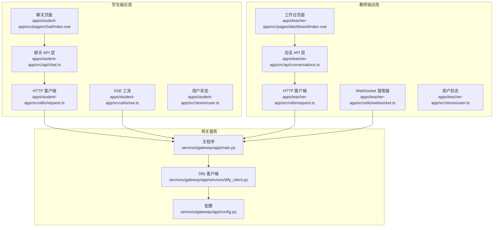
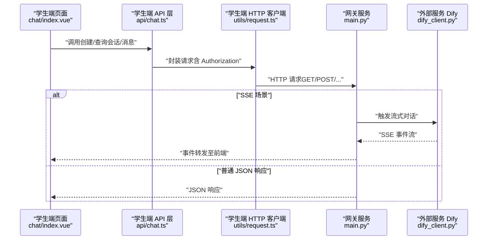
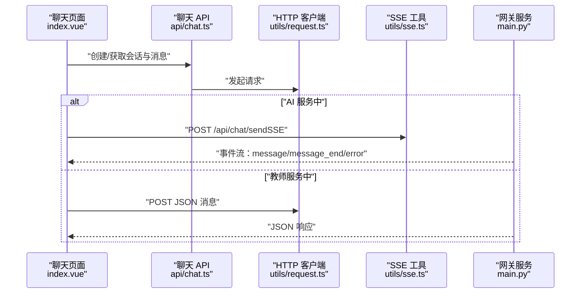
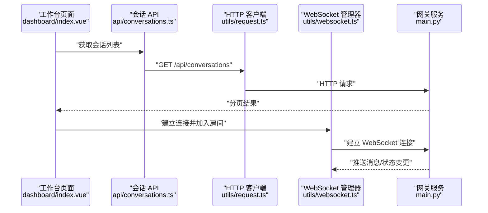
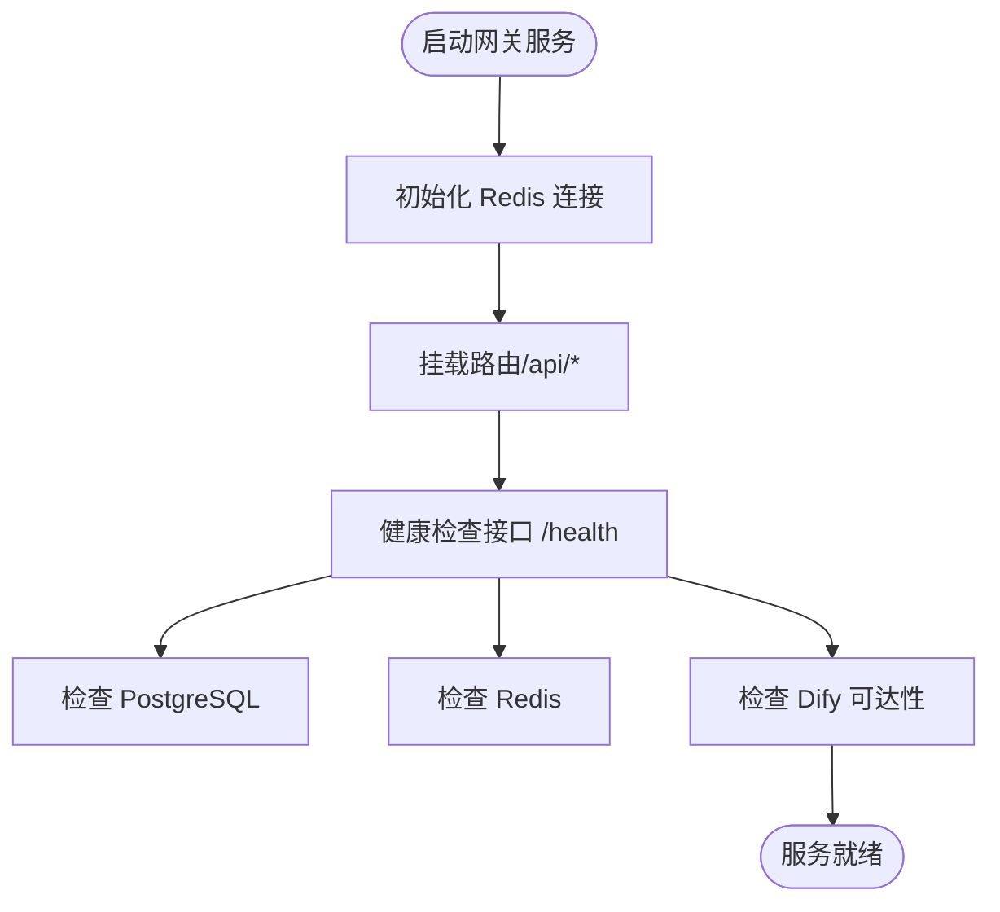
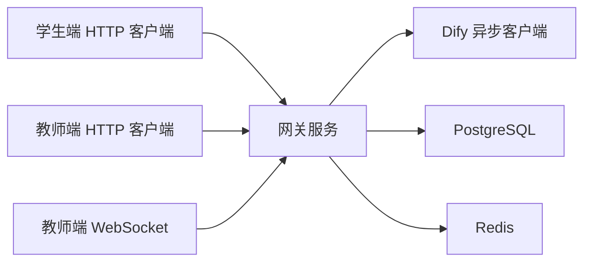

# 外部 API 集成

<cite>
**本文引用的文件**
- [apps/student-app/src/utils/request.ts](file://apps/student-app/src/utils/request.ts)
- [apps/teacher-app/src/utils/request.ts](file://apps/teacher-app/src/utils/request.ts)
- [apps/student-app/src/utils/sse.ts](file://apps/student-app/src/utils/sse.ts)
- [apps/teacher-app/src/utils/websocket.ts](file://apps/teacher-app/src/utils/websocket.ts)
- [apps/student-app/src/api/chat.ts](file://apps/student-app/src/api/chat.ts)
- [apps/teacher-app/src/api/conversations.ts](file://apps/teacher-app/src/api/conversations.ts)
- [apps/student-app/src/stores/user.ts](file://apps/student-app/src/stores/user.ts)
- [apps/teacher-app/src/stores/user.ts](file://apps/teacher-app/src/stores/user.ts)
- [apps/student-app/src/pages/chat/index.vue](file://apps/student-app/src/pages/chat/index.vue)
- [apps/teacher-app/src/pages/dashboard/index.vue](file://apps/teacher-app/src/pages/dashboard/index.vue)
- [services/gateway/app/services/dify_client.py](file://services/gateway/app/services/dify_client.py)
- [services/gateway/app/main.py](file://services/gateway/app/main.py)
- [services/gateway/app/config.py](file://services/gateway/app/config.py)
- [apps/student-app/src/types/chat.ts](file://apps/student-app/src/types/chat.ts)
- [apps/teacher-app/src/types/api.ts](file://apps/teacher-app/src/types/api.ts)
</cite>

## 目录
1. [简介](#简介)
2. [项目结构](#项目结构)
3. [核心组件](#核心组件)
4. [架构总览](#架构总览)
5. [组件详解](#组件详解)
6. [依赖关系分析](#依赖关系分析)
7. [性能考量](#性能考量)
8. [故障排查指南](#故障排查指南)
9. [结论](#结论)
10. [附录](#附录)

## 简介
本指南围绕“外部 API 集成”主题，系统梳理了本项目的前后端交互模式与实现细节，涵盖：
- HTTP 客户端封装与统一请求处理
- SSE 流式响应与 WebSocket 实时通信
- 异步客户端与超时、重试策略
- 错误处理与鉴权机制
- 配置管理、日志与监控
- 安全、性能与故障恢复最佳实践

目标是帮助开发者在不深入源码的前提下，快速理解并正确集成各类外部 API。

## 项目结构
本项目采用多应用与微服务分离的架构：
- 前端应用（学生端与教师端）通过统一的 HTTP 客户端发起请求，并在特定场景下使用 SSE 或 WebSocket
- 网关服务（Gateway）作为后端统一入口，负责路由、鉴权、与外部服务（如 Dify）交互

图表来源
- [apps/student-app/src/utils/request.ts:1-44](file://apps/student-app/src/utils/request.ts#L1-L44)
- [apps/teacher-app/src/utils/request.ts:1-108](file://apps/teacher-app/src/utils/request.ts#L1-L108)
- [apps/student-app/src/utils/sse.ts:1-69](file://apps/student-app/src/utils/sse.ts#L1-L69)
- [apps/teacher-app/src/utils/websocket.ts:1-169](file://apps/teacher-app/src/utils/websocket.ts#L1-L169)
- [apps/student-app/src/api/chat.ts:1-36](file://apps/student-app/src/api/chat.ts#L1-L36)
- [apps/teacher-app/src/api/conversations.ts:1-44](file://apps/teacher-app/src/api/conversations.ts#L1-L44)
- [apps/student-app/src/pages/chat/index.vue:1-649](file://apps/student-app/src/pages/chat/index.vue#L1-L649)
- [apps/teacher-app/src/pages/dashboard/index.vue:1-669](file://apps/teacher-app/src/pages/dashboard/index.vue#L1-L669)
- [services/gateway/app/main.py:1-78](file://services/gateway/app/main.py#L1-L78)
- [services/gateway/app/config.py:1-31](file://services/gateway/app/config.py#L1-L31)
- [services/gateway/app/services/dify_client.py:1-105](file://services/gateway/app/services/dify_client.py#L1-L105)

章节来源
- [apps/student-app/src/utils/request.ts:1-44](file://apps/student-app/src/utils/request.ts#L1-L44)
- [apps/teacher-app/src/utils/request.ts:1-108](file://apps/teacher-app/src/utils/request.ts#L1-L108)
- [apps/student-app/src/utils/sse.ts:1-69](file://apps/student-app/src/utils/sse.ts#L1-L69)
- [apps/teacher-app/src/utils/websocket.ts:1-169](file://apps/teacher-app/src/utils/websocket.ts#L1-L169)
- [apps/student-app/src/api/chat.ts:1-36](file://apps/student-app/src/api/chat.ts#L1-L36)
- [apps/teacher-app/src/api/conversations.ts:1-44](file://apps/teacher-app/src/api/conversations.ts#L1-L44)
- [apps/student-app/src/pages/chat/index.vue:1-649](file://apps/student-app/src/pages/chat/index.vue#L1-L649)
- [apps/teacher-app/src/pages/dashboard/index.vue:1-669](file://apps/teacher-app/src/pages/dashboard/index.vue#L1-L669)
- [services/gateway/app/main.py:1-78](file://services/gateway/app/main.py#L1-L78)
- [services/gateway/app/config.py:1-31](file://services/gateway/app/config.py#L1-L31)
- [services/gateway/app/services/dify_client.py:1-105](file://services/gateway/app/services/dify_client.py#L1-L105)

## 核心组件
- HTTP 客户端封装
  - 学生端：基于 uni.request 的统一封装，自动注入 Authorization，处理 401、422 等状态码，统一错误提示与跳转
  - 教师端：支持查询参数拼接、默认超时、统一注入 Authorization，提供 get/post/put/del 方法
- SSE 流式响应
  - 学生端：fetch + ReadableStream 解析事件流，分发 message/message_end/error 事件，驱动 UI 实时渲染
- WebSocket 实时通信
  - 教师端：单连接 + 房间模式，支持心跳、断线重连、消息队列、房间重加入
- 网关服务
  - 提供健康检查、路由挂载、与 Dify 的异步客户端交互
- 配置管理
  - 网关服务通过环境变量读取数据库、Redis、JWT、Dify 等配置

章节来源
- [apps/student-app/src/utils/request.ts:1-44](file://apps/student-app/src/utils/request.ts#L1-L44)
- [apps/teacher-app/src/utils/request.ts:1-108](file://apps/teacher-app/src/utils/request.ts#L1-L108)
- [apps/student-app/src/utils/sse.ts:1-69](file://apps/student-app/src/utils/sse.ts#L1-L69)
- [apps/teacher-app/src/utils/websocket.ts:1-169](file://apps/teacher-app/src/utils/websocket.ts#L1-L169)
- [services/gateway/app/main.py:1-78](file://services/gateway/app/main.py#L1-L78)
- [services/gateway/app/config.py:1-31](file://services/gateway/app/config.py#L1-L31)

## 架构总览
下图展示了从前端到网关再到外部服务的整体调用链路与数据流向。

图表来源
- [apps/student-app/src/pages/chat/index.vue:369-481](file://apps/student-app/src/pages/chat/index.vue#L369-L481)
- [apps/student-app/src/api/chat.ts:1-36](file://apps/student-app/src/api/chat.ts#L1-L36)
- [apps/student-app/src/utils/request.ts:1-44](file://apps/student-app/src/utils/request.ts#L1-L44)
- [services/gateway/app/services/dify_client.py:22-69](file://services/gateway/app/services/dify_client.py#L22-L69)
- [services/gateway/app/main.py:70-78](file://services/gateway/app/main.py#L70-L78)

## 组件详解

### 学生端 HTTP 客户端与聊天流程
- 统一请求封装：自动注入 Authorization，处理 401 登录态失效、422 参数校验失败、其他 HTTP 错误
- 聊天页面逻辑：根据会话状态决定走 SSE 流式响应还是 JSON 接口；支持拒答检测、转人工、来源引用展示

图表来源
- [apps/student-app/src/pages/chat/index.vue:369-481](file://apps/student-app/src/pages/chat/index.vue#L369-L481)
- [apps/student-app/src/api/chat.ts:1-36](file://apps/student-app/src/api/chat.ts#L1-L36)
- [apps/student-app/src/utils/request.ts:1-44](file://apps/student-app/src/utils/request.ts#L1-L44)
- [apps/student-app/src/utils/sse.ts:1-69](file://apps/student-app/src/utils/sse.ts#L1-L69)
- [services/gateway/app/main.py:70-78](file://services/gateway/app/main.py#L70-L78)

章节来源
- [apps/student-app/src/pages/chat/index.vue:369-481](file://apps/student-app/src/pages/chat/index.vue#L369-L481)
- [apps/student-app/src/api/chat.ts:1-36](file://apps/student-app/src/api/chat.ts#L1-L36)
- [apps/student-app/src/utils/request.ts:1-44](file://apps/student-app/src/utils/request.ts#L1-L44)
- [apps/student-app/src/utils/sse.ts:1-69](file://apps/student-app/src/utils/sse.ts#L1-L69)

### 教师端 HTTP 客户端与 WebSocket
- HTTP 客户端：支持查询参数拼接、默认超时、统一注入 Authorization，提供便捷的 HTTP 方法封装
- WebSocket 管理器：单连接、心跳、指数退避重连、发送队列、房间重加入，确保消息可靠投递
- 工作台页面：拉取待处理会话列表，展示统计与状态卡片

图表来源
- [apps/teacher-app/src/pages/dashboard/index.vue:200-211](file://apps/teacher-app/src/pages/dashboard/index.vue#L200-L211)
- [apps/teacher-app/src/api/conversations.ts:1-44](file://apps/teacher-app/src/api/conversations.ts#L1-L44)
- [apps/teacher-app/src/utils/request.ts:1-108](file://apps/teacher-app/src/utils/request.ts#L1-L108)
- [apps/teacher-app/src/utils/websocket.ts:1-169](file://apps/teacher-app/src/utils/websocket.ts#L1-L169)
- [services/gateway/app/main.py:70-78](file://services/gateway/app/main.py#L70-L78)

章节来源
- [apps/teacher-app/src/pages/dashboard/index.vue:200-211](file://apps/teacher-app/src/pages/dashboard/index.vue#L200-L211)
- [apps/teacher-app/src/api/conversations.ts:1-44](file://apps/teacher-app/src/api/conversations.ts#L1-L44)
- [apps/teacher-app/src/utils/request.ts:1-108](file://apps/teacher-app/src/utils/request.ts#L1-L108)
- [apps/teacher-app/src/utils/websocket.ts:1-169](file://apps/teacher-app/src/utils/websocket.ts#L1-L169)

### 网关服务与 Dify 异步客户端
- 网关服务：提供健康检查、路由挂载、Redis 连接生命周期管理；健康检查包含对 Dify 的连通性探测
- Dify 客户端：封装 Dify Chat API 与 Dataset API，支持流式事件解析、超时控制、错误日志

图表来源
- [services/gateway/app/main.py:16-68](file://services/gateway/app/main.py#L16-L68)
- [services/gateway/app/config.py:1-31](file://services/gateway/app/config.py#L1-L31)

章节来源
- [services/gateway/app/main.py:16-68](file://services/gateway/app/main.py#L16-L68)
- [services/gateway/app/config.py:1-31](file://services/gateway/app/config.py#L1-L31)
- [services/gateway/app/services/dify_client.py:11-105](file://services/gateway/app/services/dify_client.py#L11-L105)

## 依赖关系分析
- 前端应用之间通过各自 HTTP 客户端与网关服务交互，避免直接依赖后端具体实现
- 网关服务内部依赖 SQLAlchemy、Redis、httpx 等库，对外暴露统一 API
- Dify 客户端以异步方式与外部服务交互，降低阻塞风险

图表来源
- [apps/student-app/src/utils/request.ts:1-44](file://apps/student-app/src/utils/request.ts#L1-L44)
- [apps/teacher-app/src/utils/request.ts:1-108](file://apps/teacher-app/src/utils/request.ts#L1-L108)
- [apps/teacher-app/src/utils/websocket.ts:1-169](file://apps/teacher-app/src/utils/websocket.ts#L1-L169)
- [services/gateway/app/main.py:1-78](file://services/gateway/app/main.py#L1-L78)
- [services/gateway/app/services/dify_client.py:1-105](file://services/gateway/app/services/dify_client.py#L1-L105)

章节来源
- [apps/student-app/src/utils/request.ts:1-44](file://apps/student-app/src/utils/request.ts#L1-L44)
- [apps/teacher-app/src/utils/request.ts:1-108](file://apps/teacher-app/src/utils/request.ts#L1-L108)
- [apps/teacher-app/src/utils/websocket.ts:1-169](file://apps/teacher-app/src/utils/websocket.ts#L1-L169)
- [services/gateway/app/main.py:1-78](file://services/gateway/app/main.py#L1-L78)
- [services/gateway/app/services/dify_client.py:1-105](file://services/gateway/app/services/dify_client.py#L1-L105)

## 性能考量
- 超时与重试
  - 教师端 HTTP 客户端提供默认超时配置，建议针对不同接口设置差异化超时
  - WebSocket 使用指数退避重连，避免频繁重连造成抖动
- 流式传输
  - SSE 逐 token 推送，前端即时渲染，减少首屏等待
- 缓存与连接池
  - 网关服务复用 Redis 连接，避免频繁创建销毁
- 并发与限流
  - 建议在网关层引入速率限制与并发控制，防止下游服务过载

[本节为通用性能建议，无需列出章节来源]

## 故障排查指南
- 401 未授权
  - 学生端：收到 401 自动登出并跳转登录页
  - 教师端：收到 401 显示提示并跳转登录页
- 参数错误（422）
  - 学生端：解析 detail 字段，展示第一条错误信息
- 网络错误
  - 统一捕获 fail 回调，提示“网络连接失败”
- SSE/WS 异常
  - SSE：非 JSON 数据记录警告，避免中断流
  - WS：断线自动重连，心跳维持连接，发送队列保障消息不丢失
- 健康检查
  - 网关 /health 检查数据库、缓存与 Dify 可达性，定位服务异常

章节来源
- [apps/student-app/src/utils/request.ts:25-36](file://apps/student-app/src/utils/request.ts#L25-L36)
- [apps/teacher-app/src/utils/request.ts:43-55](file://apps/teacher-app/src/utils/request.ts#L43-L55)
- [apps/student-app/src/utils/sse.ts:67-68](file://apps/student-app/src/utils/sse.ts#L67-L68)
- [apps/teacher-app/src/utils/websocket.ts:148-154](file://apps/teacher-app/src/utils/websocket.ts#L148-L154)
- [services/gateway/app/main.py:30-68](file://services/gateway/app/main.py#L30-L68)

## 结论
本项目在前端与网关层实现了统一、健壮的外部 API 集成方案：
- 前端通过统一封装的 HTTP 客户端、SSE 与 WebSocket，覆盖多种实时与非实时场景
- 网关服务提供健康检查、路由与外部服务交互能力，保障整体稳定性
- 建议在生产环境中进一步完善超时/重试策略、埋点与告警、鉴权与加密等安全措施

[本节为总结性内容，无需列出章节来源]

## 附录

### 集成步骤与最佳实践
- HTTP 客户端配置
  - 在请求头注入 Authorization（令牌来自用户状态存储）
  - 对于 GET 请求，将 params 拼接到 URL 查询字符串
  - 设置合理的默认超时时间
- SSE 使用
  - 前端使用 fetch + ReadableStream 解析事件流
  - 区分 message/message_end/error 事件，分别更新 UI 与结束状态
- WebSocket 使用
  - 建立连接后立即发送心跳与房间加入消息
  - 断线自动重连，重连成功后重新加入房间
- 错误处理
  - 401：清理本地状态并跳转登录
  - 422：展示参数错误详情
  - 其他 HTTP 错误：统一提示并记录日志
- 配置管理
  - 网关服务通过环境变量读取配置，避免硬编码
  - 不同环境使用不同的 .env 文件
- 日志与监控
  - 在网关层记录关键请求与错误
  - 健康检查输出到监控系统
- 安全
  - 严格管理 API Key 与令牌
  - 对外暴露的接口进行鉴权与限流
- 性能优化
  - 合理设置超时与重试次数
  - 使用连接池与缓存
  - 对大流量场景进行限速与熔断

[本节为通用实践建议，无需列出章节来源]