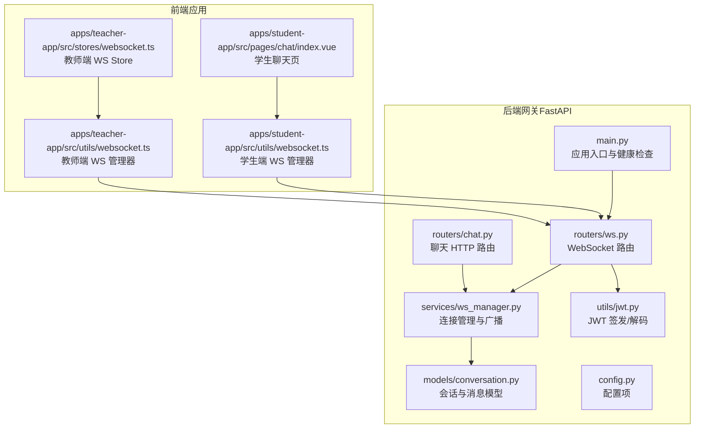
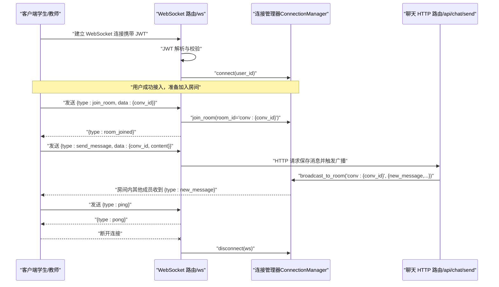
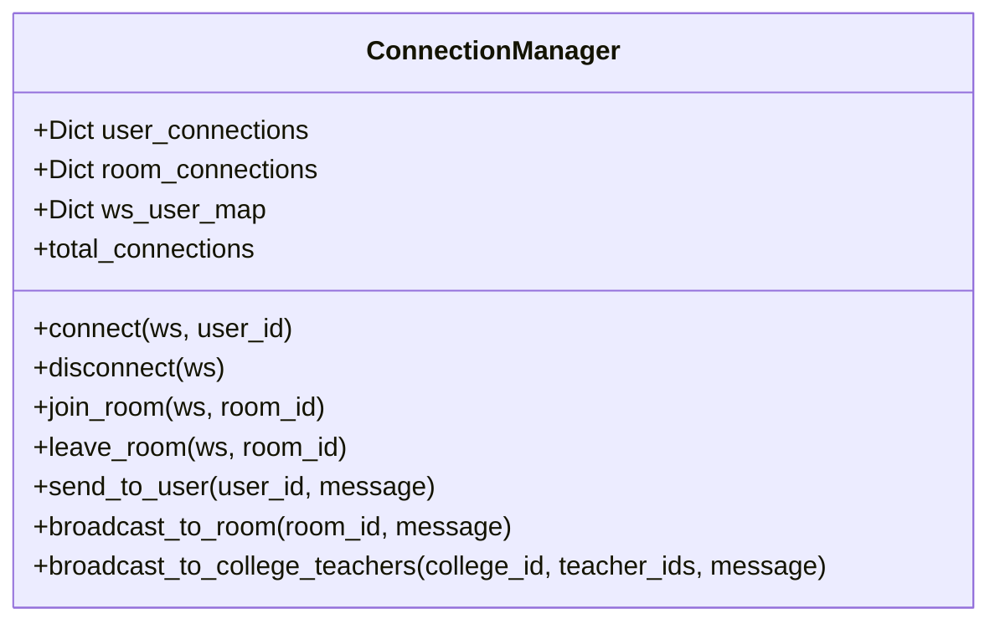
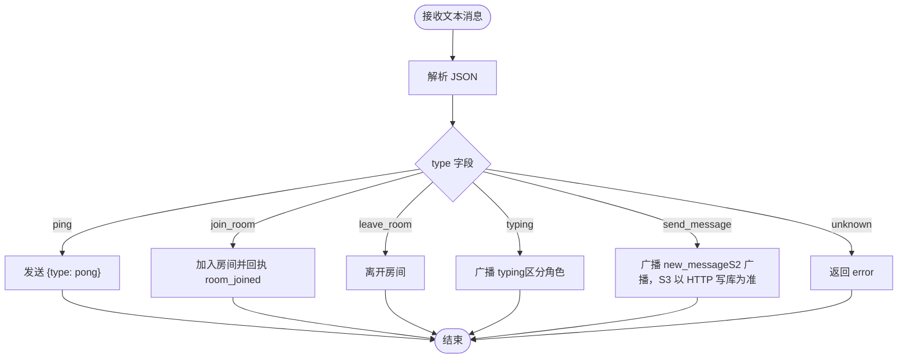
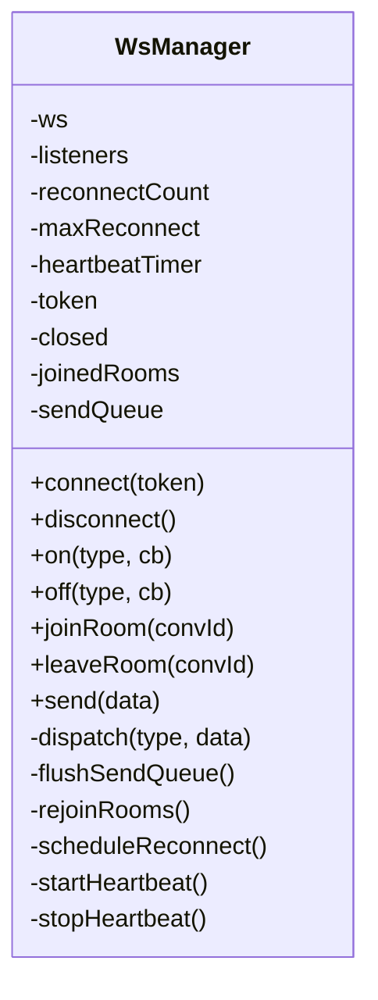
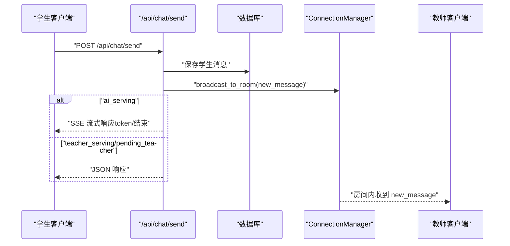
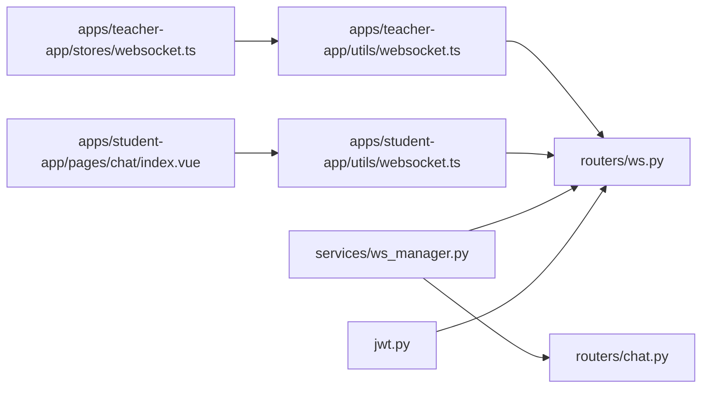

# 实时服务集成

<cite>
**本文档引用的文件**
- [ws_manager.py](file://services/gateway/app/services/ws_manager.py)
- [ws.py](file://services/gateway/app/routers/ws.py)
- [jwt.py](file://services/gateway/app/utils/jwt.py)
- [main.py](file://services/gateway/app/main.py)
- [config.py](file://services/gateway/app/config.py)
- [chat.py](file://services/gateway/app/routers/chat.py)
- [conversation.py](file://services/gateway/app/models/conversation.py)
- [websocket.ts（学生端）](file://apps/student-app/src/utils/websocket.ts)
- [websocket.ts（教师端）](file://apps/teacher-app/src/utils/websocket.ts)
- [websocket.ts（教师端 Pinia Store）](file://apps/teacher-app/src/stores/websocket.ts)
- [chat 页面（学生端）](file://apps/student-app/src/pages/chat/index.vue)
- [s2-ws-test.py](file://scripts/s2-ws-test.py)
</cite>

## 目录
1. [简介](#简介)
2. [项目结构](#项目结构)
3. [核心组件](#核心组件)
4. [架构总览](#架构总览)
5. [详细组件分析](#详细组件分析)
6. [依赖分析](#依赖分析)
7. [性能考虑](#性能考虑)
8. [故障排查指南](#故障排查指南)
9. [结论](#结论)
10. [附录](#附录)

## 简介
本文件面向“实时服务集成”的目标，系统化梳理基于 WebSocket 的实时通信实现，覆盖以下主题：
- WebSocket 服务端集成：连接管理、房间广播、心跳检测、消息路由与错误处理
- WebSocket 客户端集成：连接建立、消息收发、断线重连、异常处理
- 扩展与演进：自定义协议、消息格式、安全认证、性能监控与运维优化
- 实战示例：从连接到消息发送、断线重连、异常处理的完整流程

## 项目结构
该仓库采用前后端分离的多模块组织方式：
- 后端网关服务（FastAPI）位于 services/gateway，包含 WebSocket 路由、连接管理、认证、聊天路由等
- 前端应用位于 apps/student-app 与 apps/teacher-app，分别提供学生端与教师端的实时交互界面
- 运维脚本位于 scripts，包含 WebSocket 基础测试脚本

图表来源
- [main.py:1-78](file://services/gateway/app/main.py#L1-L78)
- [ws.py:1-119](file://services/gateway/app/routers/ws.py#L1-L119)
- [ws_manager.py:1-100](file://services/gateway/app/services/ws_manager.py#L1-L100)
- [jwt.py:1-17](file://services/gateway/app/utils/jwt.py#L1-L17)
- [chat.py:1-191](file://services/gateway/app/routers/chat.py#L1-L191)
- [conversation.py:1-63](file://services/gateway/app/models/conversation.py#L1-L63)
- [config.py:1-31](file://services/gateway/app/config.py#L1-L31)
- [websocket.ts（学生端）:1-153](file://apps/student-app/src/utils/websocket.ts#L1-L153)
- [websocket.ts（教师端）:1-169](file://apps/teacher-app/src/utils/websocket.ts#L1-L169)
- [websocket.ts（教师端 Pinia Store）:1-32](file://apps/teacher-app/src/stores/websocket.ts#L1-L32)
- [chat 页面（学生端）:1-649](file://apps/student-app/src/pages/chat/index.vue#L1-L649)

章节来源
- [main.py:1-78](file://services/gateway/app/main.py#L1-L78)
- [ws.py:1-119](file://services/gateway/app/routers/ws.py#L1-L119)
- [ws_manager.py:1-100](file://services/gateway/app/services/ws_manager.py#L1-L100)
- [jwt.py:1-17](file://services/gateway/app/utils/jwt.py#L1-L17)
- [chat.py:1-191](file://services/gateway/app/routers/chat.py#L1-L191)
- [conversation.py:1-63](file://services/gateway/app/models/conversation.py#L1-L63)
- [config.py:1-31](file://services/gateway/app/config.py#L1-L31)
- [websocket.ts（学生端）:1-153](file://apps/student-app/src/utils/websocket.ts#L1-L153)
- [websocket.ts（教师端）:1-169](file://apps/teacher-app/src/utils/websocket.ts#L1-L169)
- [websocket.ts（教师端 Pinia Store）:1-32](file://apps/teacher-app/src/stores/websocket.ts#L1-L32)
- [chat 页面（学生端）:1-649](file://apps/student-app/src/pages/chat/index.vue#L1-L649)

## 核心组件
- WebSocket 连接管理器（ConnectionManager）
  - 负责用户级连接集合、房间级连接集合、反向映射、广播与清理
  - 提供向用户、房间广播的能力，并在发送异常时自动清理失效连接
- WebSocket 路由（/ws）
  - 基于查询参数携带 JWT 进行认证
  - 处理 ping/pong 心跳、加入/离开房间、发送消息、打字提示等消息类型
  - 对未知消息类型返回错误
- 客户端 WebSocket 管理器（学生端/教师端）
  - 单连接模型，支持连接状态监听、消息分发、发送队列、断线指数退避重连、心跳保活
  - 重连后自动 re-join 房间，确保会话连续性
- 聊天 HTTP 路由（/api/chat/send）
  - 根据会话状态决定走 AI 流式响应还是教师实时推送
  - 将消息持久化后通过 WS 广播至房间

章节来源
- [ws_manager.py:8-100](file://services/gateway/app/services/ws_manager.py#L8-L100)
- [ws.py:11-119](file://services/gateway/app/routers/ws.py#L11-L119)
- [websocket.ts（学生端）:3-153](file://apps/student-app/src/utils/websocket.ts#L3-L153)
- [websocket.ts（教师端）:9-169](file://apps/teacher-app/src/utils/websocket.ts#L9-L169)
- [chat.py:22-191](file://services/gateway/app/routers/chat.py#L22-L191)

## 架构总览
下图展示了从客户端发起连接到消息广播的全链路：

图表来源
- [ws.py:11-119](file://services/gateway/app/routers/ws.py#L11-L119)
- [ws_manager.py:25-82](file://services/gateway/app/services/ws_manager.py#L25-L82)
- [chat.py:22-102](file://services/gateway/app/routers/chat.py#L22-L102)

## 详细组件分析

### WebSocket 服务端：连接管理与广播
- 设计要点
  - 两层映射：用户连接集合与房间连接集合，支持按用户与房间进行消息投递
  - 反向映射：WebSocket 到用户 ID，便于断开清理
  - 广播时捕获发送异常并清理失效连接，避免脏连接占用资源
- 关键方法
  - connect/disconnect：注册/注销连接与房间
  - join_room/leave_room：房间加入/离开
  - send_to_user/broadcast_to_room：按用户/房间广播
  - broadcast_to_college_teachers：向指定教师集合广播（用于通知）
- 复杂度
  - 单次广播为 O(N)（N 为房间内连接数）
  - 断开清理为 O(M)（M 为用户连接数）

图表来源
- [ws_manager.py:8-100](file://services/gateway/app/services/ws_manager.py#L8-L100)

章节来源
- [ws_manager.py:8-100](file://services/gateway/app/services/ws_manager.py#L8-L100)

### WebSocket 路由：消息协议与处理逻辑
- 认证
  - 使用 JWT 解析用户身份与角色，失败则主动关闭连接
- 上行消息类型
  - join_room/leave_room：房间管理
  - send_message：消息广播（S2 阶段仅广播，不入库；S3 完善后改为 HTTP 写库）
  - typing：打字提示广播（区分教师/学生）
  - ping：心跳，服务端返回 pong
  - 其他：返回错误
- 下行消息类型
  - new_message、status_changed、escalation_notify、teacher_typing、student_typing、pong、error

图表来源
- [ws.py:16-112](file://services/gateway/app/routers/ws.py#L16-L112)

章节来源
- [ws.py:11-119](file://services/gateway/app/routers/ws.py#L11-L119)

### 客户端 WebSocket 管理器：连接、重连与心跳
- 设计模式
  - 单例管理器封装连接生命周期、事件分发、发送队列、房间重加入、心跳保活
  - 支持 H5 原生 WebSocket 与小程序 uni.connectSocket
- 关键能力
  - 连接建立：自动拼接 wss/ws 与 host，注入 token 查询参数
  - 心跳：每 30 秒发送 ping，忽略 pong
  - 重连：指数退避，最大次数限制
  - 房间：记录已加入房间，断线后自动 re-join
  - 发送队列：未连接时缓存消息，连上后 flush
- 错误处理
  - onMessage 解析失败静默处理
  - onClose 触发重连调度
  - onError 作为 onClose 的补充

图表来源
- [websocket.ts（学生端）:3-153](file://apps/student-app/src/utils/websocket.ts#L3-L153)
- [websocket.ts（教师端）:9-169](file://apps/teacher-app/src/utils/websocket.ts#L9-L169)

章节来源
- [websocket.ts（学生端）:1-153](file://apps/student-app/src/utils/websocket.ts#L1-L153)
- [websocket.ts（教师端）:1-169](file://apps/teacher-app/src/utils/websocket.ts#L1-L169)

### 聊天 HTTP 路由：状态机与消息持久化
- 状态约束
  - 仅学生可使用 /api/chat/send
  - 仅 ai_serving/pending_teacher/teacher_serving 三类状态允许发送
  - resolved 状态可被重新激活并广播状态变更
- 处理流程
  - 保存学生消息
  - 广播 new_message 至房间
  - ai_serving：返回 SSE 流式响应（Dify 逐 token 输出）
  - teacher_serving/pending_teacher：返回 JSON 响应
- 与 WS 的协作
  - 通过 ConnectionManager 广播消息，确保前端实时可见

图表来源
- [chat.py:22-102](file://services/gateway/app/routers/chat.py#L22-L102)
- [ws_manager.py:71-81](file://services/gateway/app/services/ws_manager.py#L71-L81)

章节来源
- [chat.py:22-191](file://services/gateway/app/routers/chat.py#L22-L191)
- [conversation.py:11-63](file://services/gateway/app/models/conversation.py#L11-L63)

### 安全与认证
- JWT 签发与解码
  - 签发：设置过期时间，返回 access_token
  - 解码：校验签名与算法，失败抛出异常
- WebSocket 认证
  - 通过查询参数携带 token，服务端解码后提取 user_id 与 role
  - 认证失败直接关闭连接（4001）

章节来源
- [jwt.py:6-17](file://services/gateway/app/utils/jwt.py#L6-L17)
- [ws.py:35-42](file://services/gateway/app/routers/ws.py#L35-L42)

### 前端集成与使用示例
- 学生端
  - 在页面 onShow/onHide 中动态 join/leave 房间
  - 注册 on('new_message')、on('status_changed') 等事件监听
  - 发送消息时根据会话状态选择 SSE 或 HTTP 路径
- 教师端
  - 通过 Pinia Store 初始化 wsManager，监听 *_connected* 等事件
  - 重连后自动 re-join 房间，保持会话连续

章节来源
- [chat 页面（学生端）:249-276](file://apps/student-app/src/pages/chat/index.vue#L249-L276)
- [websocket.ts（教师端 Pinia Store）:5-32](file://apps/teacher-app/src/stores/websocket.ts#L5-L32)

## 依赖分析
- 组件耦合
  - ws.py 依赖 jwt.py 进行认证，依赖 ws_manager.py 进行连接与广播
  - chat.py 依赖 ws_manager.py 进行房间广播
  - 前端 wsManager 依赖后端 /ws 路由与消息协议
- 外部依赖
  - FastAPI、SQLAlchemy、Redis、Dify 客户端
  - 前端 uni-app（小程序）、Vue/Pinia（H5）

图表来源
- [ws.py:1-119](file://services/gateway/app/routers/ws.py#L1-L119)
- [ws_manager.py:1-100](file://services/gateway/app/services/ws_manager.py#L1-L100)
- [chat.py:1-191](file://services/gateway/app/routers/chat.py#L1-L191)
- [jwt.py:1-17](file://services/gateway/app/utils/jwt.py#L1-L17)
- [websocket.ts（学生端）:1-153](file://apps/student-app/src/utils/websocket.ts#L1-L153)
- [websocket.ts（教师端）:1-169](file://apps/teacher-app/src/utils/websocket.ts#L1-L169)
- [websocket.ts（教师端 Pinia Store）:1-32](file://apps/teacher-app/src/stores/websocket.ts#L1-L32)
- [chat 页面（学生端）:1-649](file://apps/student-app/src/pages/chat/index.vue#L1-L649)

## 性能考虑
- 广播复杂度
  - 房间广播为 O(N)，建议控制房间规模或引入房间分片
- 连接清理
  - 发送异常即清理，避免僵尸连接；可结合连接总数指标监控
- 心跳与重连
  - 心跳周期 30 秒，重连指数退避上限 30 秒，减少风暴重连
- IO 与序列化
  - 前端发送队列与 flush 降低网络抖动影响
- 数据一致性
  - S2 阶段 WS 仅广播，消息入库与一致性由 HTTP API 保障；S3 建议统一通过 HTTP 写库

[本节为通用性能建议，无需列出章节来源]

## 故障排查指南
- 常见问题定位
  - 认证失败：检查 token 是否正确传递与有效；服务端会以 4001 关闭连接
  - 无法加入房间：确认 conv_id 是否存在且格式为 "conv:{id}"
  - 消息未到达：检查房间是否正确 join；确认广播房间 ID 一致
  - 心跳异常：确认客户端定时发送 ping；服务端返回 pong
  - 重连失败：观察指数退避日志；检查网络与后端健康状态
- 健康检查
  - /health 接口检查数据库、Redis、Dify 服务可用性
- 测试验证
  - 使用 s2-ws-test.py 进行冒烟测试，覆盖 ping/pong、join_room、未知类型、无效 token 场景

章节来源
- [ws.py:35-42](file://services/gateway/app/routers/ws.py#L35-L42)
- [s2-ws-test.py:1-51](file://scripts/s2-ws-test.py#L1-L51)
- [main.py:30-68](file://services/gateway/app/main.py#L30-L68)

## 结论
本项目通过简洁的 WebSocket 路由与连接管理器实现了稳定的实时通信基础，配合前端单连接、房间模型与指数退避重连策略，满足了教学场景下的即时消息与状态同步需求。后续可在以下方面持续演进：
- S3 阶段统一通过 HTTP 写库，WS 专注通知
- 引入房间分片与连接池优化
- 增强消息去重与幂等
- 完善心跳与断线统计指标

[本节为总结性内容，无需列出章节来源]

## 附录

### 扩展与演进清单
- 自定义协议
  - 新增消息类型：在 ws.py 中解析与处理，并在前端对应监听
  - 新增下行事件：在 ws_manager.py 中扩展广播范围
- 消息格式
  - 统一字段命名与版本号，便于兼容升级
- 安全认证
  - 引入速率限制与白名单房间
  - JWT 过期策略与刷新机制
- 性能监控
  - 记录连接数、广播耗时、重连次数、离线消息积压
- 运维优化
  - Nginx/网关层限流与健康探针
  - Redis 缓存房间元信息，降低内存压力

[本节为概念性内容，无需列出章节来源]