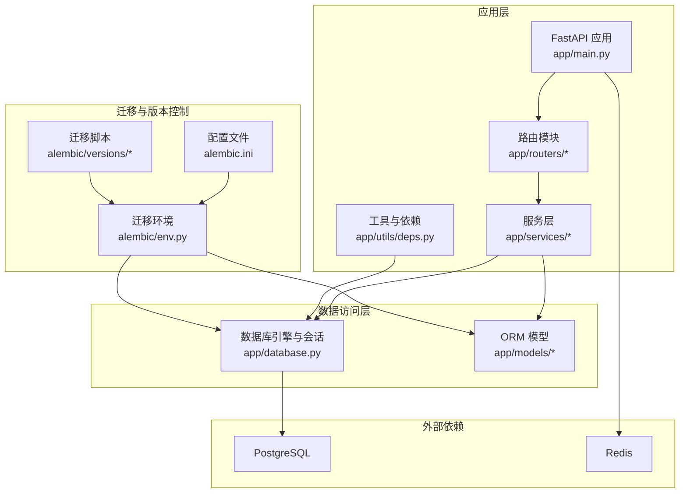
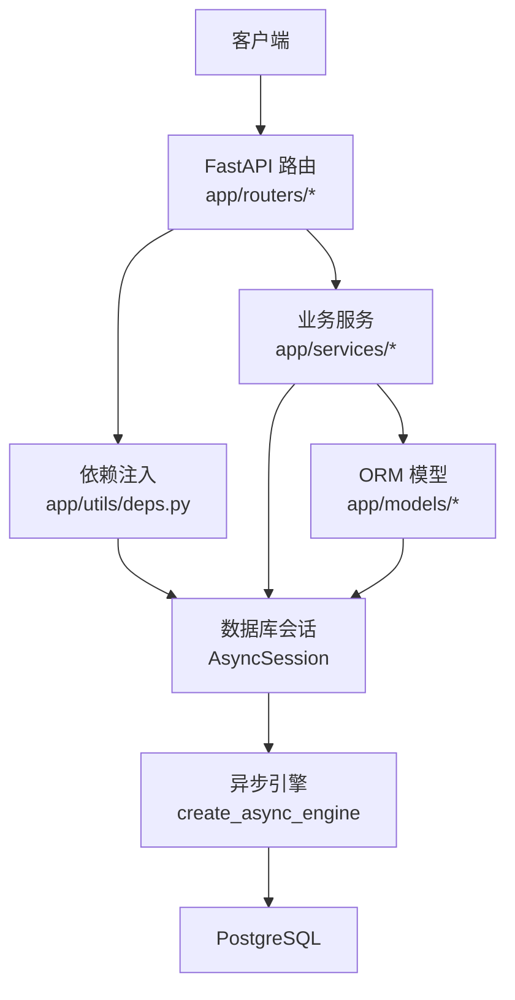
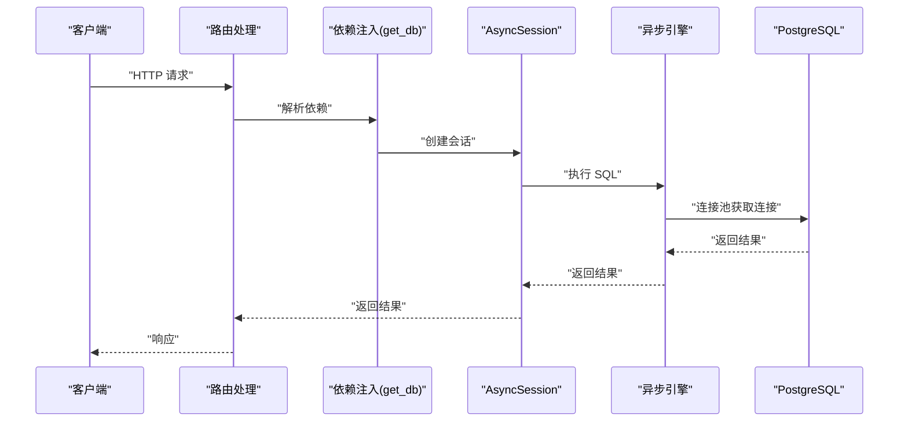
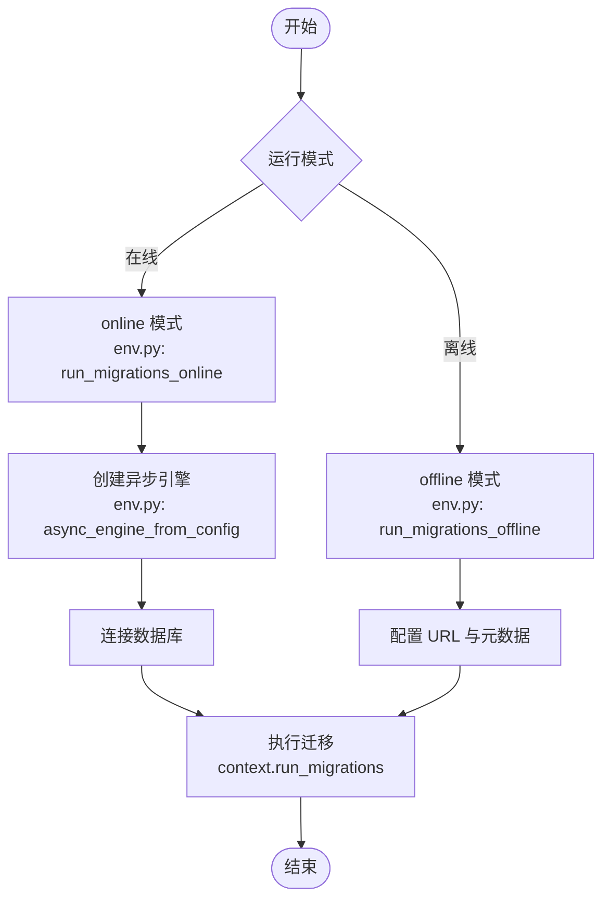
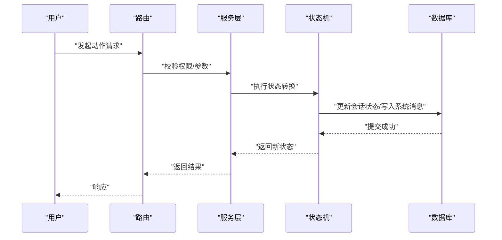
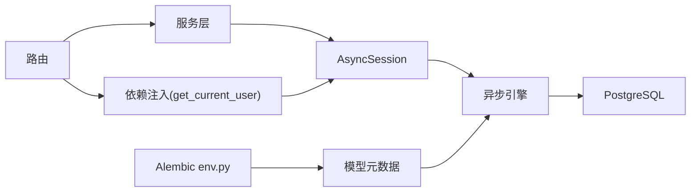

# 数据库集成

<cite>
**本文引用的文件**
- [services/gateway/app/database.py](file://services/gateway/app/database.py)
- [services/gateway/app/config.py](file://services/gateway/app/config.py)
- [services/gateway/alembic/env.py](file://services/gateway/alembic/env.py)
- [services/gateway/alembic.ini](file://services/gateway/alembic.ini)
- [services/gateway/alembic/versions/e11bb6c9d4b8_v2_initial_schema.py](file://services/gateway/alembic/versions/e11bb6c9d4b8_v2_initial_schema.py)
- [services/gateway/alembic/versions/ff1f0ab0c5f8_add_kb_entries_table.py](file://services/gateway/alembic/versions/ff1f0ab0c5f8_add_kb_entries_table.py)
- [services/gateway/app/models/__init__.py](file://services/gateway/app/models/__init__.py)
- [services/gateway/app/models/user.py](file://services/gateway/app/models/user.py)
- [services/gateway/app/models/conversation.py](file://services/gateway/app/models/conversation.py)
- [services/gateway/app/models/knowledge.py](file://services/gateway/app/models/knowledge.py)
- [services/gateway/app/models/kb_entry.py](file://services/gateway/app/models/kb_entry.py)
- [services/gateway/app/utils/deps.py](file://services/gateway/app/utils/deps.py)
- [services/gateway/app/main.py](file://services/gateway/app/main.py)
- [services/gateway/app/routers/actions.py](file://services/gateway/app/routers/actions.py)
- [services/gateway/app/services/conversation_service.py](file://services/gateway/app/services/conversation_service.py)
- [services/gateway/app/services/state_machine.py](file://services/gateway/app/services/state_machine.py)
</cite>

## 目录
1. [简介](#简介)
2. [项目结构](#项目结构)
3. [核心组件](#核心组件)
4. [架构总览](#架构总览)
5. [详细组件分析](#详细组件分析)
6. [依赖分析](#依赖分析)
7. [性能考虑](#性能考虑)
8. [故障排查指南](#故障排查指南)
9. [结论](#结论)
10. [附录](#附录)

## 简介
本指南围绕基于 PostgreSQL 的数据库集成进行系统化说明，涵盖连接与会话管理、ORM 映射、Alembic 迁移体系、连接池与事务、性能优化、索引与查询实践、以及监控与运维要点。文档以实际代码为依据，帮助开发者快速理解并扩展数据库层能力。

## 项目结构
后端采用 FastAPI + SQLAlchemy Async（异步）架构，数据库层位于 services/gateway 下，主要目录与职责如下：
- app/database.py：异步引擎、会话工厂与基础 ORM 类定义
- app/config.py：应用配置（含数据库 URL）
- app/models/*：ORM 模型定义（用户、会话、消息、知识库等）
- alembic/*：迁移脚本与环境配置
- app/routers/* 与 app/services/*：业务路由与服务层，展示数据库读写与事务使用
- app/utils/deps.py：依赖注入（数据库会话、鉴权）
- app/main.py：应用生命周期与健康检查



图表来源
- [services/gateway/app/main.py:1-78](file://services/gateway/app/main.py#L1-L78)
- [services/gateway/app/database.py:1-15](file://services/gateway/app/database.py#L1-L15)
- [services/gateway/alembic/env.py:1-97](file://services/gateway/alembic/env.py#L1-L97)
- [services/gateway/alembic.ini:1-150](file://services/gateway/alembic.ini#L1-L150)

章节来源
- [services/gateway/app/main.py:1-78](file://services/gateway/app/main.py#L1-L78)
- [services/gateway/app/database.py:1-15](file://services/gateway/app/database.py#L1-L15)
- [services/gateway/alembic/env.py:1-97](file://services/gateway/alembic/env.py#L1-L97)
- [services/gateway/alembic.ini:1-150](file://services/gateway/alembic.ini#L1-L150)

## 核心组件
- 异步数据库引擎与会话
  - 使用异步引擎与会话工厂，支持连接池与自动过期管理
  - 提供依赖注入函数，确保每个请求拥有独立的会话作用域
- ORM 模型
  - 定义用户、班级、会话、消息、知识库建议、未解答问题、学院数据集、KB 条目等实体
  - 使用索引与 JSONB/数组类型优化查询与存储
- Alembic 迁移
  - 在线/离线模式均支持，通过 env.py 注入配置与模型元数据
  - 提供初始与增量迁移脚本，覆盖核心表与索引
- 依赖注入与路由
  - 路由中通过依赖注入获取数据库会话与当前用户，结合服务层完成业务逻辑
- 健康检查
  - 应用启动时建立 Redis 连接；/health 接口验证 PostgreSQL 与 Redis 可达性

章节来源
- [services/gateway/app/database.py:1-15](file://services/gateway/app/database.py#L1-L15)
- [services/gateway/app/config.py:1-31](file://services/gateway/app/config.py#L1-L31)
- [services/gateway/app/models/user.py:1-76](file://services/gateway/app/models/user.py#L1-L76)
- [services/gateway/app/models/conversation.py:1-63](file://services/gateway/app/models/conversation.py#L1-L63)
- [services/gateway/app/models/knowledge.py:1-62](file://services/gateway/app/models/knowledge.py#L1-L62)
- [services/gateway/app/models/kb_entry.py:1-31](file://services/gateway/app/models/kb_entry.py#L1-L31)
- [services/gateway/alembic/versions/e11bb6c9d4b8_v2_initial_schema.py:1-160](file://services/gateway/alembic/versions/e11bb6c9d4b8_v2_initial_schema.py#L1-L160)
- [services/gateway/alembic/versions/ff1f0ab0c5f8_add_kb_entries_table.py:1-50](file://services/gateway/alembic/versions/ff1f0ab0c5f8_add_kb_entries_table.py#L1-L50)
- [services/gateway/app/utils/deps.py:1-40](file://services/gateway/app/utils/deps.py#L1-L40)
- [services/gateway/app/routers/actions.py:1-154](file://services/gateway/app/routers/actions.py#L1-L154)
- [services/gateway/app/main.py:1-78](file://services/gateway/app/main.py#L1-L78)

## 架构总览
下图展示了数据库集成在系统中的位置与交互路径，包括 FastAPI 路由、服务层、数据库引擎与迁移环境的关系。



图表来源
- [services/gateway/app/utils/deps.py:1-40](file://services/gateway/app/utils/deps.py#L1-L40)
- [services/gateway/app/database.py:1-15](file://services/gateway/app/database.py#L1-L15)
- [services/gateway/app/models/user.py:1-76](file://services/gateway/app/models/user.py#L1-L76)
- [services/gateway/app/models/conversation.py:1-63](file://services/gateway/app/models/conversation.py#L1-L63)

## 详细组件分析

### 数据库连接与会话管理
- 引擎与会话工厂
  - 创建异步引擎并启用连接池
  - 会话工厂设置为不自动过期，避免在长事务中失效
- 依赖注入
  - get_db 提供异步生成器，确保每个请求获得独立会话并在结束后释放
- 健康检查
  - /health 接口对 PostgreSQL 与 Redis 进行连通性检测



图表来源
- [services/gateway/app/utils/deps.py:1-40](file://services/gateway/app/utils/deps.py#L1-L40)
- [services/gateway/app/database.py:1-15](file://services/gateway/app/database.py#L1-L15)
- [services/gateway/app/main.py:30-68](file://services/gateway/app/main.py#L30-L68)

章节来源
- [services/gateway/app/database.py:1-15](file://services/gateway/app/database.py#L1-L15)
- [services/gateway/app/utils/deps.py:1-40](file://services/gateway/app/utils/deps.py#L1-L40)
- [services/gateway/app/main.py:30-68](file://services/gateway/app/main.py#L30-L68)

### ORM 映射与模型设计
- 用户与组织
  - 用户、绑定、学院、班级模型，支持角色枚举与唯一约束
- 会话与消息
  - 会话状态枚举与索引优化；消息支持 JSONB 元数据与复合索引
- 知识库
  - 建议、未解答问题、学院数据集模型，支持数组字段与外键关联
- KB 条目
  - Dify 文档与原始来源映射，标题建立普通索引

```mermaid
erDiagram
COLLEGES {
int id PK
string name
timestamp created_at
}
CLASSES {
int id PK
string name
int college_id FK
int grade_year
timestamp created_at
}
USERS {
int id PK
string staff_id UK
string name
enum role
int college_id FK
int class_id FK
string password_hash
string avatar_url
boolean is_active
timestamp created_at
timestamp updated_at
}
USER_BINDINGS {
int id PK
int user_id FK
enum platform
string platform_uid
timestamp bound_at
}
CONVERSATIONS {
int id PK
int student_id FK
int teacher_id FK
enum status
string dify_conversation_id
string title
timestamp created_at
timestamp updated_at
timestamp resolved_at
timestamp closed_at
}
MESSAGES {
int id PK
int conversation_id FK
enum sender_type
int sender_id FK
text content
jsonb metadata
timestamp created_at
}
KB_SUGGESTIONS {
int id PK
string title
text content
text raw_content
enum source
string source_url
int college_id FK
enum status
int submitted_by FK
int reviewed_by FK
string dify_document_id
timestamp created_at
timestamp reviewed_at
}
UNANSWERED_QUESTIONS {
int id PK
text question_text
string question_hash
int hit_count
array sample_conv_ids
int college_id FK
boolean is_resolved
int kb_suggestion_id FK
timestamp created_at
timestamp updated_at
}
COLLEGE_DATASETS {
int id PK
int college_id UK FK
string dify_dataset_id
timestamp created_at
}
KB_ENTRIES {
int id PK
string dify_document_id UK
string dify_dataset_id
string title
string category
array tags
string original_source
string source_url
string material_id
string campus
string original_filename
timestamp created_at
}
COLLEGES ||--o{ CLASSES : "拥有"
USERS }o--|| COLLEGES : "属于"
USERS }o--|| CLASSES : "属于"
USER_BINDINGS }o--|| USERS : "属于"
CONVERSATIONS }o--|| USERS : "学生"
CONVERSATIONS }o--|| USERS : "教师"
MESSAGES }o--|| CONVERSATIONS : "属于"
MESSAGES }o--|| USERS : "发送者"
KB_SUGGESTIONS }o--|| USERS : "提交者"
KB_SUGGESTIONS }o--|| USERS : "审核者"
KB_SUGGESTIONS }o--|| COLLEGES : "所属"
UNANSWERED_QUESTIONS }o--|| COLLEGES : "所属"
UNANSWERED_QUESTIONS }o--|| KB_SUGGESTIONS : "关联"
COLLEGE_DATASETS }o--|| COLLEGES : "对应"
```

图表来源
- [services/gateway/app/models/user.py:1-76](file://services/gateway/app/models/user.py#L1-L76)
- [services/gateway/app/models/conversation.py:1-63](file://services/gateway/app/models/conversation.py#L1-L63)
- [services/gateway/app/models/knowledge.py:1-62](file://services/gateway/app/models/knowledge.py#L1-L62)
- [services/gateway/app/models/kb_entry.py:1-31](file://services/gateway/app/models/kb_entry.py#L1-L31)

章节来源
- [services/gateway/app/models/user.py:1-76](file://services/gateway/app/models/user.py#L1-L76)
- [services/gateway/app/models/conversation.py:1-63](file://services/gateway/app/models/conversation.py#L1-L63)
- [services/gateway/app/models/knowledge.py:1-62](file://services/gateway/app/models/knowledge.py#L1-L62)
- [services/gateway/app/models/kb_entry.py:1-31](file://services/gateway/app/models/kb_entry.py#L1-L31)

### Alembic 迁移系统
- 环境配置
  - 在线迁移通过异步引擎连接数据库；离线迁移直接使用 URL
  - 注入目标元数据与模型，支持自动生成迁移
- 迁移脚本
  - 初始版本包含核心表与索引
  - 增量版本新增 KB 条目表及标题索引
- 配置文件
  - alembic.ini 提供日志、钩子、路径等配置项



图表来源
- [services/gateway/alembic/env.py:36-96](file://services/gateway/alembic/env.py#L36-L96)
- [services/gateway/alembic/versions/e11bb6c9d4b8_v2_initial_schema.py:21-160](file://services/gateway/alembic/versions/e11bb6c9d4b8_v2_initial_schema.py#L21-L160)
- [services/gateway/alembic/versions/ff1f0ab0c5f8_add_kb_entries_table.py:21-50](file://services/gateway/alembic/versions/ff1f0ab0c5f8_add_kb_entries_table.py#L21-L50)
- [services/gateway/alembic.ini:1-150](file://services/gateway/alembic.ini#L1-L150)

章节来源
- [services/gateway/alembic/env.py:1-97](file://services/gateway/alembic/env.py#L1-L97)
- [services/gateway/alembic/versions/e11bb6c9d4b8_v2_initial_schema.py:1-160](file://services/gateway/alembic/versions/e11bb6c9d4b8_v2_initial_schema.py#L1-L160)
- [services/gateway/alembic/versions/ff1f0ab0c5f8_add_kb_entries_table.py:1-50](file://services/gateway/alembic/versions/ff1f0ab0c5f8_add_kb_entries_table.py#L1-L50)
- [services/gateway/alembic.ini:1-150](file://services/gateway/alembic.ini#L1-L150)

### 事务管理与业务流程
- 会话状态机
  - 定义合法状态转换与副作用（如更新时间戳、写入系统消息）
- 服务层读写
  - 通过服务层封装查询、插入与更新，保证一致性
- 路由层调用
  - 路由中组合鉴权、权限校验与状态机转换，最终落库



图表来源
- [services/gateway/app/routers/actions.py:68-154](file://services/gateway/app/routers/actions.py#L68-L154)
- [services/gateway/app/services/state_machine.py:34-96](file://services/gateway/app/services/state_machine.py#L34-L96)
- [services/gateway/app/services/conversation_service.py:29-179](file://services/gateway/app/services/conversation_service.py#L29-L179)

章节来源
- [services/gateway/app/routers/actions.py:1-154](file://services/gateway/app/routers/actions.py#L1-L154)
- [services/gateway/app/services/state_machine.py:1-96](file://services/gateway/app/services/state_machine.py#L1-L96)
- [services/gateway/app/services/conversation_service.py:1-179](file://services/gateway/app/services/conversation_service.py#L1-L179)

### 查询与索引优化实践
- 会话查询
  - 按学生与状态建立索引，支持高效分页与筛选
- 消息查询
  - 按会话与创建时间建立复合索引，满足时间顺序翻页场景
- KB 条目
  - 标题建立普通索引，便于检索

章节来源
- [services/gateway/app/models/conversation.py:26-44](file://services/gateway/app/models/conversation.py#L26-L44)
- [services/gateway/app/models/conversation.py:47-63](file://services/gateway/app/models/conversation.py#L47-L63)
- [services/gateway/app/models/kb_entry.py:9-31](file://services/gateway/app/models/kb_entry.py#L9-L31)

## 依赖分析
- 组件耦合
  - 路由依赖服务层，服务层依赖会话与模型，会话依赖引擎
  - Alembic 通过 env.py 与模型元数据耦合，避免硬编码表结构
- 外部依赖
  - PostgreSQL 作为主数据库；Redis 用于缓存与广播
- 依赖注入链路
  - 通过 get_db 与 get_current_user 将会话与用户注入到路由与服务层



图表来源
- [services/gateway/app/utils/deps.py:1-40](file://services/gateway/app/utils/deps.py#L1-L40)
- [services/gateway/app/database.py:1-15](file://services/gateway/app/database.py#L1-L15)
- [services/gateway/alembic/env.py:1-97](file://services/gateway/alembic/env.py#L1-L97)

章节来源
- [services/gateway/app/utils/deps.py:1-40](file://services/gateway/app/utils/deps.py#L1-L40)
- [services/gateway/app/database.py:1-15](file://services/gateway/app/database.py#L1-L15)
- [services/gateway/alembic/env.py:1-97](file://services/gateway/alembic/env.py#L1-L97)

## 性能考虑
- 连接池
  - 引擎初始化时设置连接池大小，建议根据并发与数据库资源评估调整
- 事务边界
  - 服务层明确事务边界，尽量减少长事务；必要时拆分为多个短事务
- 查询优化
  - 为高频查询字段建立索引；避免 N+1 查询，优先使用 join 或批量加载
- 异步优势
  - 使用异步引擎与会话，提升 I/O 密集型场景吞吐
- 缓存策略
  - 结合 Redis 缓存热点数据，降低数据库压力

## 故障排查指南
- 连接失败
  - 检查数据库 URL 与凭据；确认网络可达与防火墙放行
- 迁移失败
  - 在线迁移需确保 Alembic 能访问数据库；离线迁移检查 URL 配置
- 权限错误
  - 确认用户角色与会话权限校验逻辑；检查外键约束与唯一约束冲突
- 健康检查异常
  - /health 接口分别检查 PostgreSQL 与 Redis；逐项定位问题

章节来源
- [services/gateway/app/main.py:30-68](file://services/gateway/app/main.py#L30-L68)
- [services/gateway/alembic/env.py:67-96](file://services/gateway/alembic/env.py#L67-L96)

## 结论
本项目以 SQLAlchemy Async 为核心，结合 Alembic 迁移与清晰的依赖注入，构建了可维护、可扩展的数据库层。通过合理的索引与查询设计、事务边界划分以及异步 I/O，能够在高并发场景下保持稳定与高性能。建议在生产环境中进一步完善连接池参数、监控指标与备份策略，并持续演进迁移脚本以适配业务变化。

## 附录
- 配置项参考
  - 数据库 URL：来自配置对象，用于引擎初始化与 Alembic 环境
  - 日志级别：Alembic 与 SQLAlchemy 日志可在配置文件中调整
- 迁移命令参考
  - 在线迁移：通过 Alembic CLI 调用 env.py 在线模式
  - 离线迁移：直接指定 URL 与元数据
- 建议的运维实践
  - 定期备份与恢复演练
  - 监控慢查询与连接池使用率
  - 为敏感字段增加访问控制与审计日志

章节来源
- [services/gateway/app/config.py:1-31](file://services/gateway/app/config.py#L1-L31)
- [services/gateway/alembic.ini:115-150](file://services/gateway/alembic.ini#L115-L150)
- [services/gateway/alembic/env.py:67-96](file://services/gateway/alembic/env.py#L67-L96)