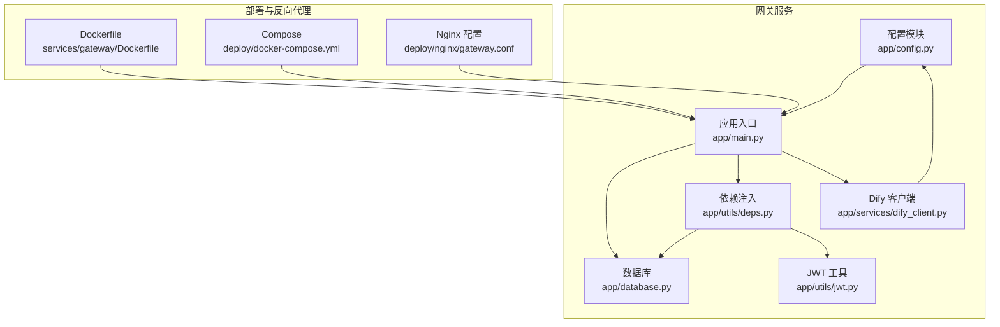
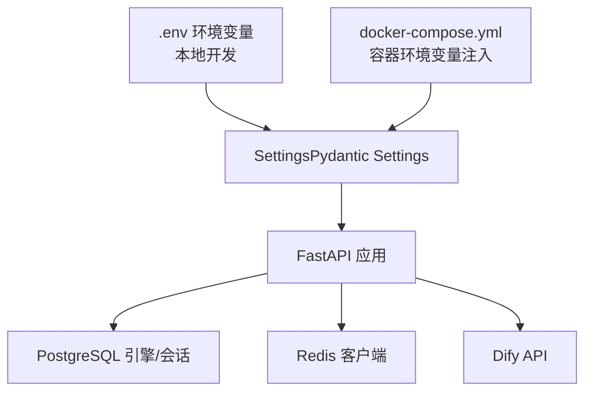
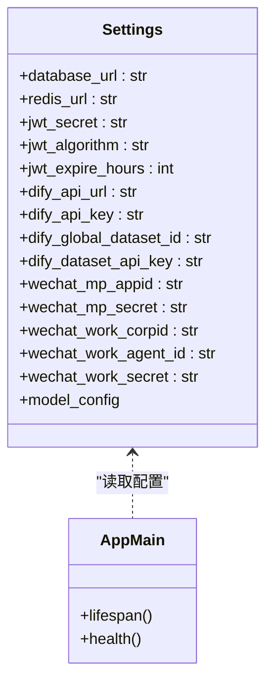
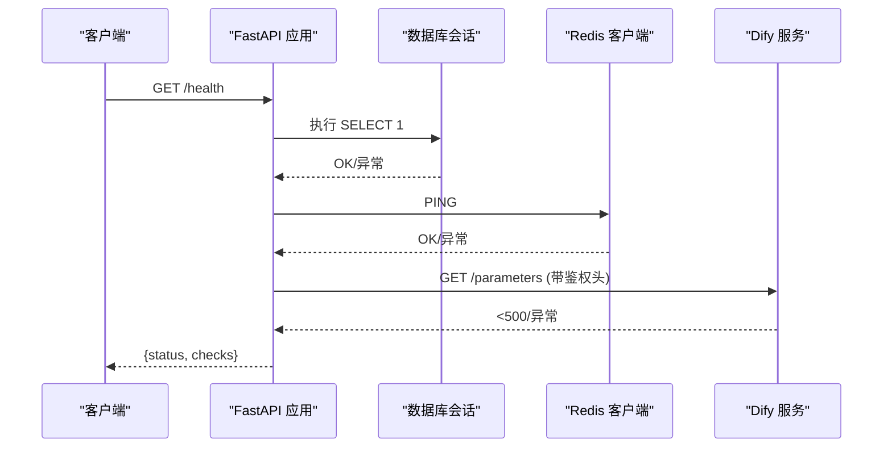
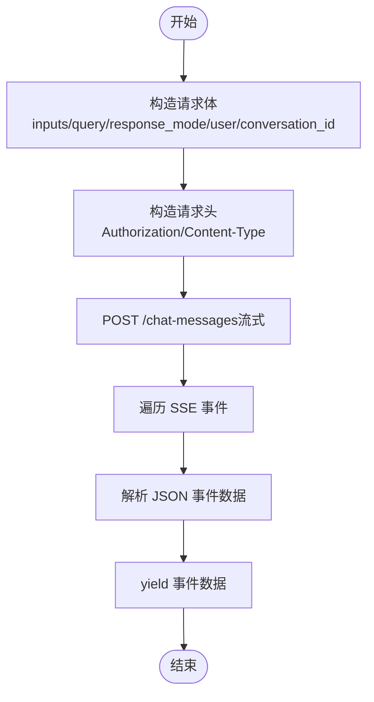
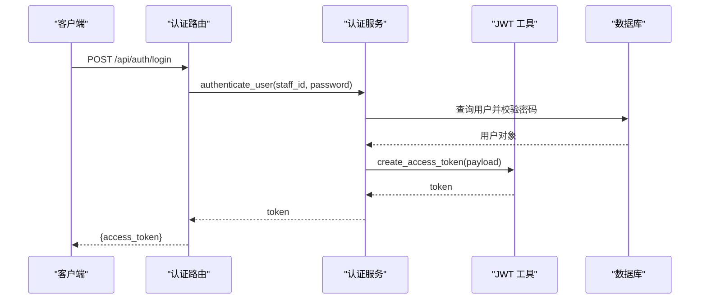
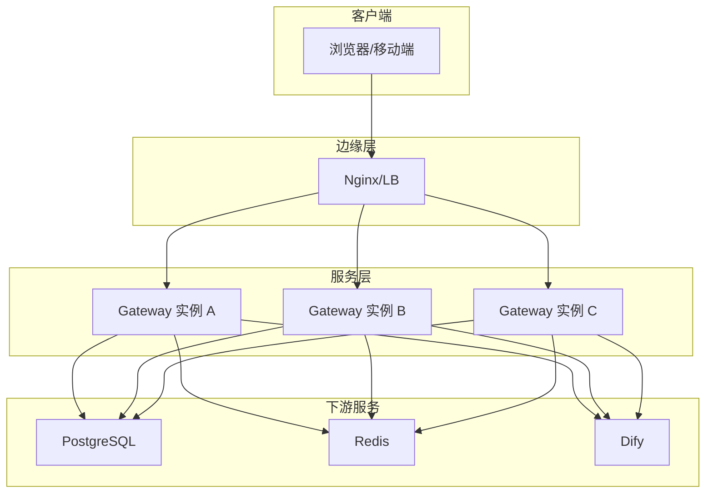
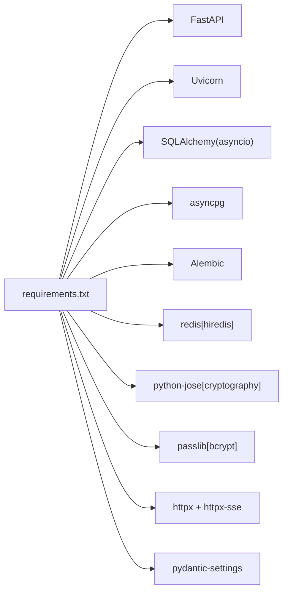

# 服务发现与配置

<cite>
**本文引用的文件**
- [services/gateway/app/config.py](file://services/gateway/app/config.py)
- [services/gateway/app/main.py](file://services/gateway/app/main.py)
- [services/gateway/app/database.py](file://services/gateway/app/database.py)
- [services/gateway/app/utils/deps.py](file://services/gateway/app/utils/deps.py)
- [services/gateway/app/utils/jwt.py](file://services/gateway/app/utils/jwt.py)
- [services/gateway/app/services/dify_client.py](file://services/gateway/app/services/dify_client.py)
- [services/gateway/Dockerfile](file://services/gateway/Dockerfile)
- [deploy/docker-compose.yml](file://deploy/docker-compose.yml)
- [deploy/nginx/gateway.conf](file://deploy/nginx/gateway.conf)
- [services/gateway/requirements.txt](file://services/gateway/requirements.txt)
- [README.md](file://README.md)
- [s2-e-smoke-test.md](file://s2-e-smoke-test.md)
</cite>

## 目录
1. [简介](#简介)
2. [项目结构](#项目结构)
3. [核心组件](#核心组件)
4. [架构总览](#架构总览)
5. [详细组件分析](#详细组件分析)
6. [依赖分析](#依赖分析)
7. [性能考虑](#性能考虑)
8. [故障排查指南](#故障排查指南)
9. [结论](#结论)
10. [附录](#附录)

## 简介
本文件聚焦于“服务发现与配置管理”，围绕网关服务（Gateway）的配置系统进行深入解析，涵盖以下主题：
- 配置模型与加载：基于 Pydantic Settings 的类型安全配置、环境变量映射与默认值策略
- 配置优先级与覆盖：容器编排中的环境变量注入、本地开发的 .env 文件
- 动态配置更新：当前实现为进程启动时一次性加载；建议的热更新与重载策略
- 关键配置项：数据库连接、缓存、认证密钥、外部 AI 引擎（Dify）接入参数
- 服务发现与负载均衡：当前采用单实例部署，Nginx 反向代理；可扩展至多实例与服务注册中心
- 健康检查：数据库、缓存、外部服务连通性检查
- 安全与最佳实践：密钥管理、环境隔离、版本化与变更流程

## 项目结构
网关服务位于 services/gateway，核心目录与文件如下：
- 配置与入口
  - app/config.py：集中定义所有运行时配置项与默认值
  - app/main.py：应用生命周期、健康检查、路由挂载
- 数据与缓存
  - app/database.py：异步数据库引擎与会话工厂
  - app/utils/deps.py：依赖注入（数据库、Redis、鉴权）
- 认证与令牌
  - app/utils/jwt.py：JWT 签发与解码
- 外部服务集成
  - app/services/dify_client.py：封装 Dify API 调用
- 部署与反向代理
  - services/gateway/Dockerfile：镜像构建
  - deploy/docker-compose.yml：容器编排与环境变量注入
  - deploy/nginx/gateway.conf：Nginx 反向代理与 WebSocket 支持
- 依赖与说明
  - services/gateway/requirements.txt：Python 依赖清单
  - README.md：快速启动说明
  - s2-e-smoke-test.md：端到端冒烟测试与 .env 示例

图表来源
- [services/gateway/app/config.py:1-31](file://services/gateway/app/config.py#L1-L31)
- [services/gateway/app/main.py:1-78](file://services/gateway/app/main.py#L1-L78)
- [services/gateway/app/database.py:1-15](file://services/gateway/app/database.py#L1-L15)
- [services/gateway/app/utils/deps.py:1-40](file://services/gateway/app/utils/deps.py#L1-L40)
- [services/gateway/app/utils/jwt.py:1-17](file://services/gateway/app/utils/jwt.py#L1-L17)
- [services/gateway/app/services/dify_client.py:1-105](file://services/gateway/app/services/dify_client.py#L1-L105)
- [services/gateway/Dockerfile:1-14](file://services/gateway/Dockerfile#L1-L14)
- [deploy/docker-compose.yml:1-22](file://deploy/docker-compose.yml#L1-L22)
- [deploy/nginx/gateway.conf:1-36](file://deploy/nginx/gateway.conf#L1-L36)

章节来源
- [README.md:1-18](file://README.md#L1-L18)
- [s2-e-smoke-test.md:1-15](file://s2-e-smoke-test.md#L1-L15)

## 核心组件
- 配置模型（Settings）
  - 数据库连接：database_url
  - 缓存连接：redis_url
  - JWT 参数：jwt_secret、jwt_algorithm、jwt_expire_hours
  - Dify 接入：dify_api_url、dify_api_key、dify_global_dataset_id、dify_dataset_api_key
  - 微信对接（P1 阶段预留）：wechat_mp_appid、wechat_mp_secret、wechat_work_corpid、wechat_work_agent_id、wechat_work_secret
  - 默认值与环境文件：model_config 指定 env_file=".env" 与编码
- 应用入口（FastAPI）
  - 生命周期：lifespan 中初始化 Redis 连接
  - 健康检查：数据库、Redis、Dify 三类探活
  - 路由挂载：认证、会话、动作、WebSocket、聊天等
- 数据库与依赖注入
  - 异步引擎与会话工厂
  - get_db、get_redis 依赖注入函数
- JWT 工具
  - 基于配置生成与校验访问令牌
- Dify 客户端
  - 封装流式对话与知识库文档创建接口

章节来源
- [services/gateway/app/config.py:1-31](file://services/gateway/app/config.py#L1-L31)
- [services/gateway/app/main.py:16-68](file://services/gateway/app/main.py#L16-L68)
- [services/gateway/app/database.py:1-15](file://services/gateway/app/database.py#L1-L15)
- [services/gateway/app/utils/deps.py:1-40](file://services/gateway/app/utils/deps.py#L1-L40)
- [services/gateway/app/utils/jwt.py:1-17](file://services/gateway/app/utils/jwt.py#L1-L17)
- [services/gateway/app/services/dify_client.py:1-105](file://services/gateway/app/services/dify_client.py#L1-L105)

## 架构总览
下图展示配置在系统中的作用与流向：应用启动时读取配置，数据库与缓存按配置建立连接，外部服务调用（如 Dify）使用配置中的参数，健康检查对关键依赖进行探活。

图表来源
- [services/gateway/app/config.py:28-30](file://services/gateway/app/config.py#L28-L30)
- [deploy/docker-compose.yml:11-17](file://deploy/docker-compose.yml#L11-L17)
- [services/gateway/app/main.py:16-22](file://services/gateway/app/main.py#L16-L22)
- [services/gateway/app/database.py:6-7](file://services/gateway/app/database.py#L6-L7)
- [services/gateway/app/services/dify_client.py:14-17](file://services/gateway/app/services/dify_client.py#L14-L17)

## 详细组件分析

### 配置系统设计与加载
- 类型安全与默认值
  - 使用 Pydantic Settings 定义强类型配置项，并提供合理默认值，便于本地快速启动
- 环境文件与覆盖顺序
  - model_config 指定 env_file=".env"，支持本地开发时通过 .env 注入
  - docker-compose.yml 中通过 environment 字段注入生产/测试环境变量，实现容器环境覆盖
- 加载时机
  - 应用启动时一次性加载，随后通过全局 settings 对象使用

图表来源
- [services/gateway/app/config.py:3-28](file://services/gateway/app/config.py#L3-L28)
- [services/gateway/app/main.py:16-68](file://services/gateway/app/main.py#L16-L68)

章节来源
- [services/gateway/app/config.py:1-31](file://services/gateway/app/config.py#L1-L31)
- [deploy/docker-compose.yml:11-17](file://deploy/docker-compose.yml#L11-L17)
- [s2-e-smoke-test.md:9-14](file://s2-e-smoke-test.md#L9-L14)

### 健康检查流程
健康检查对数据库、Redis、Dify 三个关键依赖进行探测，任一异常则整体状态降级。

图表来源
- [services/gateway/app/main.py:30-68](file://services/gateway/app/main.py#L30-L68)

章节来源
- [services/gateway/app/main.py:30-68](file://services/gateway/app/main.py#L30-L68)

### 外部服务集成（Dify）
- DifyClient 封装了流式对话与知识库文档创建两个常用场景
- 通过配置项设置 base_url、API Key、数据集 Key
- 使用 httpx 与 httpx_sse 实现 SSE 流式事件处理

图表来源
- [services/gateway/app/services/dify_client.py:22-69](file://services/gateway/app/services/dify_client.py#L22-L69)

章节来源
- [services/gateway/app/services/dify_client.py:1-105](file://services/gateway/app/services/dify_client.py#L1-L105)

### 认证与令牌
- JWT 工具基于配置中的密钥与算法生成与解码访问令牌
- 依赖注入中通过 HTTP Bearer 方式获取令牌并解析当前用户

图表来源
- [services/gateway/app/routers/auth.py:12-21](file://services/gateway/app/routers/auth.py#L12-L21)
- [services/gateway/app/services/auth_service.py:8-35](file://services/gateway/app/services/auth_service.py#L8-L35)
- [services/gateway/app/utils/jwt.py:6-16](file://services/gateway/app/utils/jwt.py#L6-L16)

章节来源
- [services/gateway/app/utils/jwt.py:1-17](file://services/gateway/app/utils/jwt.py#L1-L17)
- [services/gateway/app/utils/deps.py:14-35](file://services/gateway/app/utils/deps.py#L14-L35)
- [services/gateway/app/services/auth_service.py:1-35](file://services/gateway/app/services/auth_service.py#L1-L35)

### 服务发现与负载均衡
- 当前部署形态
  - 单实例容器运行，端口映射至宿主机
  - Nginx 作为反向代理，支持 API 与 WebSocket
- 可扩展方向
  - 多实例部署：通过服务注册与发现（如 Consul、etcd、Kubernetes Service）实现自动发现
  - 负载均衡：Nginx 或上游 LB 将流量分发至多个网关实例
  - 健康检查：结合 /health 接口与探针实现自动摘除不健康节点

图表来源
- [deploy/nginx/gateway.conf:4-27](file://deploy/nginx/gateway.conf#L4-L27)
- [services/gateway/app/main.py:30-68](file://services/gateway/app/main.py#L30-L68)

章节来源
- [deploy/docker-compose.yml:1-22](file://deploy/docker-compose.yml#L1-L22)
- [deploy/nginx/gateway.conf:1-36](file://deploy/nginx/gateway.conf#L1-L36)

## 依赖分析
- Python 依赖
  - Web 框架与服务器：FastAPI、Uvicorn
  - 数据库：SQLAlchemy（异步）、asyncpg、Alembic
  - 缓存：Redis（异步）
  - 认证：python-jose、passlib、bcrypt
  - HTTP 客户端：httpx、httpx-sse
  - 配置：pydantic-settings
- 镜像与运行
  - 基于 Python 3.12 slim 镜像，暴露 8000 端口
  - Compose 将宿主 8100 映射到容器 8000，避免与 v1 冲突

图表来源
- [services/gateway/requirements.txt:1-29](file://services/gateway/requirements.txt#L1-L29)

章节来源
- [services/gateway/requirements.txt:1-29](file://services/gateway/requirements.txt#L1-L29)
- [services/gateway/Dockerfile:1-14](file://services/gateway/Dockerfile#L1-L14)

## 性能考虑
- 数据库连接池
  - 引擎 pool_size=10，建议根据并发与资源评估调整
- Redis 连接
  - 应用生命周期内复用连接，减少握手开销
- 外部服务超时
  - Dify 客户端与健康检查均设置合理超时，避免阻塞
- 反向代理
  - Nginx 对 WebSocket 设置了升级头与长读超时，保障实时通信

章节来源
- [services/gateway/app/database.py:6-7](file://services/gateway/app/database.py#L6-L7)
- [services/gateway/app/main.py:53-58](file://services/gateway/app/main.py#L53-L58)
- [services/gateway/app/services/dify_client.py:55-56](file://services/gateway/app/services/dify_client.py#L55-L56)
- [deploy/nginx/gateway.conf:20-27](file://deploy/nginx/gateway.conf#L20-L27)

## 故障排查指南
- 健康检查异常定位
  - postgres：检查 database_url、网络连通、数据库可用性
  - redis：检查 redis_url、网络连通、权限
  - dify：检查 dify_api_url、鉴权头 Authorization、网络连通
- 端口与代理
  - 确认宿主机端口映射（8100:8000），Nginx upstream 指向正确
- 开发环境准备
  - 参考冒烟测试文档准备 .env，确保关键配置项齐全
- 日志与错误
  - Dify SSE 非 JSON 数据会记录告警日志，便于定位上游异常

章节来源
- [services/gateway/app/main.py:30-68](file://services/gateway/app/main.py#L30-L68)
- [deploy/docker-compose.yml:9-17](file://deploy/docker-compose.yml#L9-L17)
- [deploy/nginx/gateway.conf:4-27](file://deploy/nginx/gateway.conf#L4-L27)
- [s2-e-smoke-test.md:9-14](file://s2-e-smoke-test.md#L9-L14)
- [services/gateway/app/services/dify_client.py:6-8](file://services/gateway/app/services/dify_client.py#L6-L8)

## 结论
本项目以 Pydantic Settings 为核心实现了类型安全、易于维护的配置体系，结合容器编排与 Nginx 反向代理，提供了清晰的开发与上线路径。当前为单实例部署，建议在后续阶段引入服务注册与发现、多实例与负载均衡，以提升可用性与弹性。同时，应完善配置热更新、密钥轮换与版本化变更流程，确保生产环境的安全与稳定。

## 附录

### 配置项与默认值一览
- 数据库
  - database_url：默认本地 PostgreSQL 地址
- 缓存
  - redis_url：默认本地 Redis 地址
- JWT
  - jwt_secret：默认开发密钥（需生产替换）
  - jwt_algorithm：HS256
  - jwt_expire_hours：72 小时
- Dify
  - dify_api_url：默认本地地址
  - dify_api_key：空字符串（需配置）
  - dify_global_dataset_id：空字符串（需配置）
  - dify_dataset_api_key：空字符串（需配置）
- 微信（P1 阶段）
  - wechat_mp_appid、wechat_mp_secret、wechat_work_corpid、wechat_work_agent_id、wechat_work_secret：均为空字符串（需配置）

章节来源
- [services/gateway/app/config.py:6-26](file://services/gateway/app/config.py#L6-L26)

### 环境变量注入与优先级
- 本地开发：.env 文件
- 容器环境：docker-compose.yml 的 environment 字段
- 优先级：容器环境变量 > .env 文件（Pydantic Settings 行为）

章节来源
- [services/gateway/app/config.py:28-30](file://services/gateway/app/config.py#L28-L30)
- [deploy/docker-compose.yml:11-17](file://deploy/docker-compose.yml#L11-L17)
- [s2-e-smoke-test.md:9-14](file://s2-e-smoke-test.md#L9-L14)

### 动态配置更新建议
- 当前实现
  - 配置在进程启动时加载，运行期不自动刷新
- 建议方案
  - 文件监控：监听 .env 变更后触发 reload
  - API 热重载：提供 /reload 接口或信号触发重新加载
  - 配置中心：集成 Consul/KV 或 etcd，支持远程拉取与 Watch
  - 安全：敏感配置通过密文存储与解密，避免明文落盘

[本节为通用建议，无需特定文件引用]