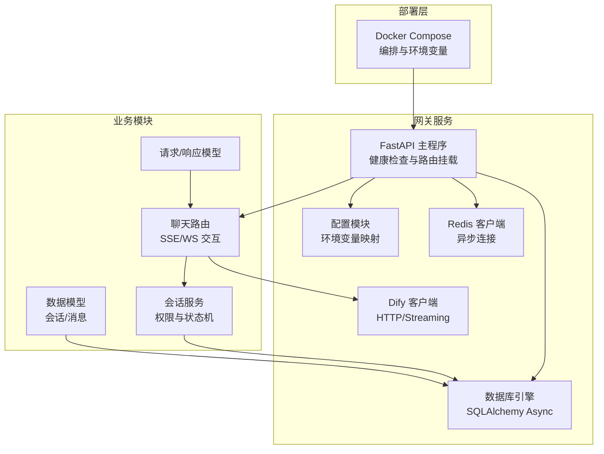
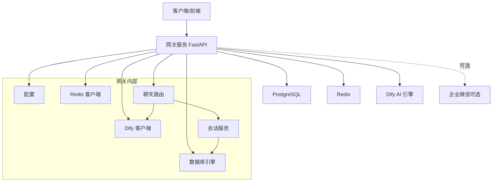
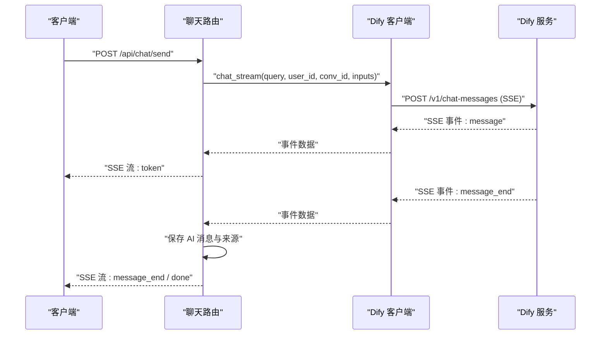
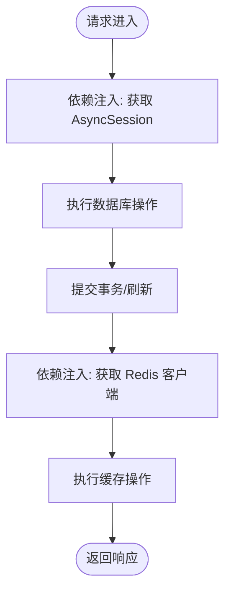
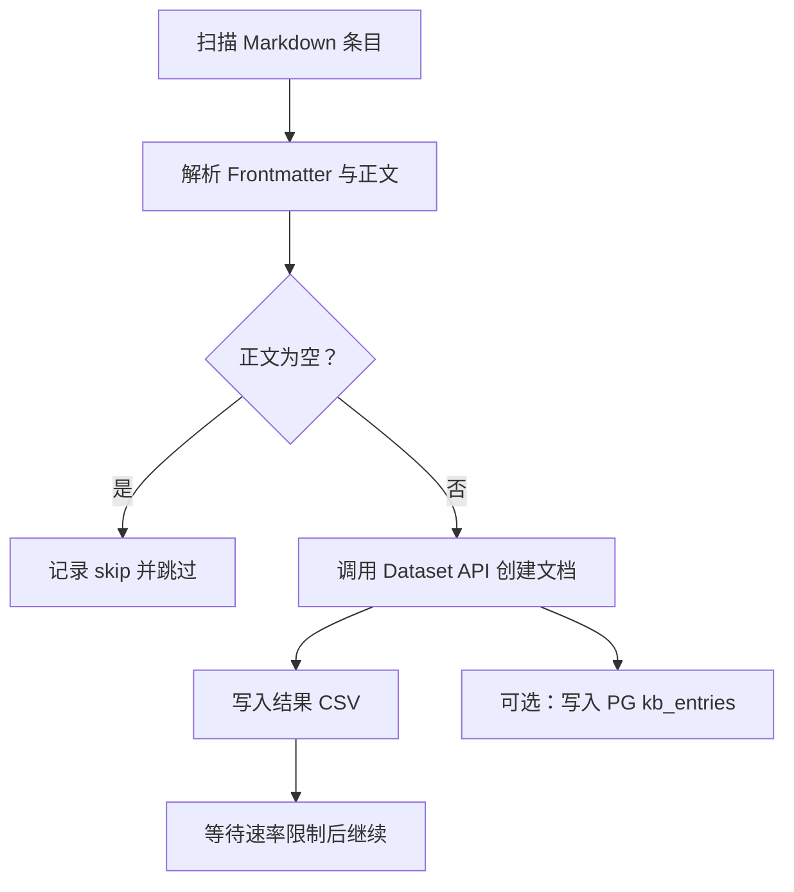
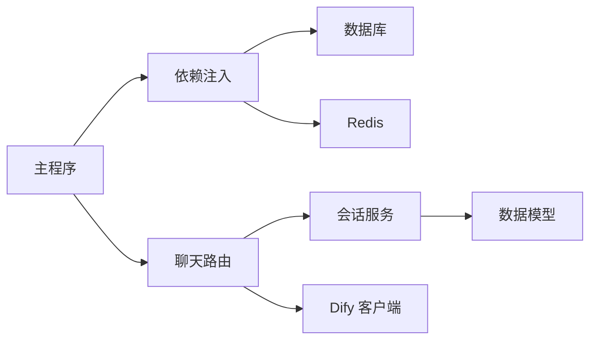

# 第三方服务集成

<cite>
**本文引用的文件**
- [README.md](file://README.md)
- [配置文件](file://services/gateway/app/config.py)
- [主程序入口](file://services/gateway/app/main.py)
- [数据库连接](file://services/gateway/app/database.py)
- [Dify 客户端](file://services/gateway/app/services/dify_client.py)
- [聊天路由](file://services/gateway/app/routers/chat.py)
- [依赖注入与鉴权](file://services/gateway/app/utils/deps.py)
- [会话模型](file://services/gateway/app/models/conversation.py)
- [聊天请求/响应模型](file://services/gateway/app/schemas/chat.py)
- [会话服务](file://services/gateway/app/services/conversation_service.py)
- [Dify 聊天工作流配置](file://deploy/dify/yixiaoguan-chatflow.yml)
- [Docker Compose 编排](file://deploy/docker-compose.yml)
- [知识库迁移脚本](file://scripts/migrate_kb.py)
- [冒烟测试脚本](file://scripts/s2-smoke-test.sh)
- [WebSocket 冒烟测试脚本](file://scripts/s2-ws-test.py)
- [网关依赖清单](file://services/gateway/requirements.txt)
</cite>

## 目录
1. [简介](#简介)
2. [项目结构](#项目结构)
3. [核心组件](#核心组件)
4. [架构总览](#架构总览)
5. [详细组件分析](#详细组件分析)
6. [依赖关系分析](#依赖关系分析)
7. [性能考量](#性能考量)
8. [故障排查指南](#故障排查指南)
9. [结论](#结论)
10. [附录](#附录)

## 简介
本指南面向需要在现有系统中集成第三方服务（如 AI 引擎、数据库、消息队列、企业微信等）的工程师，提供从架构设计、配置适配、连接管理到运维保障的全流程实践方法。结合仓库中的实际实现，重点覆盖以下主题：
- 如何集成新的 AI 引擎（以 Dify 为例，含替换为其他引擎的迁移策略）
- 如何扩展数据库与缓存（PostgreSQL/Redis）的连接与管理
- 如何接入企业微信（当前已有配置项，可作为扩展起点）
- 服务发现、连接池与超时控制、错误处理与降级策略
- 配置管理、环境适配与安全注意事项
- 集成测试、监控告警与故障恢复

## 项目结构
后端采用 FastAPI + SQLAlchemy + Alembic 构建，服务通过 Docker Compose 编排，AI 引擎使用 Dify（自托管）。前端分别提供学生端与教师端应用。

图表来源
- [主程序入口:16-78](file://services/gateway/app/main.py#L16-L78)
- [配置文件:1-31](file://services/gateway/app/config.py#L1-L31)
- [数据库连接:1-15](file://services/gateway/app/database.py#L1-L15)
- [Dify 客户端:1-105](file://services/gateway/app/services/dify_client.py#L1-L105)
- [聊天路由:1-191](file://services/gateway/app/routers/chat.py#L1-L191)
- [会话服务:1-179](file://services/gateway/app/services/conversation_service.py#L1-L179)
- [会话模型:1-63](file://services/gateway/app/models/conversation.py#L1-L63)
- [聊天请求/响应模型:1-18](file://services/gateway/app/schemas/chat.py#L1-L18)
- [Docker Compose 编排:1-22](file://deploy/docker-compose.yml#L1-L22)

章节来源
- [README.md:1-18](file://README.md#L1-L18)
- [Docker Compose 编排:1-22](file://deploy/docker-compose.yml#L1-L22)

## 核心组件
- 配置管理：集中于 Settings 类，统一读取 .env 环境变量，涵盖数据库、Redis、JWT、Dify 与微信配置项。
- 数据库连接：基于 SQLAlchemy Async Engine，提供异步 Session 注入。
- Redis 连接：在 lifespan 中初始化，供全局使用。
- Dify 客户端：封装 Dify Chat API 与 Dataset API，支持流式事件与文档创建。
- 聊天路由：根据会话状态选择 SSE 或 WS 路径，对接 Dify 并持久化消息。
- 会话服务：负责权限校验、状态流转、消息增删改查。
- 健康检查：对 Postgres、Redis、Dify 进行连通性检测。

章节来源
- [配置文件:1-31](file://services/gateway/app/config.py#L1-L31)
- [数据库连接:1-15](file://services/gateway/app/database.py#L1-L15)
- [主程序入口:16-78](file://services/gateway/app/main.py#L16-L78)
- [Dify 客户端:1-105](file://services/gateway/app/services/dify_client.py#L1-L105)
- [聊天路由:1-191](file://services/gateway/app/routers/chat.py#L1-L191)
- [会话服务:1-179](file://services/gateway/app/services/conversation_service.py#L1-L179)

## 架构总览
下图展示“网关服务”与“第三方服务”的交互关系，以及关键数据流。

图表来源
- [主程序入口:16-78](file://services/gateway/app/main.py#L16-L78)
- [配置文件:1-31](file://services/gateway/app/config.py#L1-L31)
- [数据库连接:1-15](file://services/gateway/app/database.py#L1-L15)
- [Dify 客户端:1-105](file://services/gateway/app/services/dify_client.py#L1-L105)
- [聊天路由:1-191](file://services/gateway/app/routers/chat.py#L1-L191)
- [会话服务:1-179](file://services/gateway/app/services/conversation_service.py#L1-L179)

## 详细组件分析

### 组件一：Dify 客户端与 AI 引擎集成
- 设计要点
  - 使用异步 HTTP 客户端与 SSE 事件流，支持长连接与增量输出。
  - 将 Dify API Key 与 Dataset API Key 分离，便于权限隔离。
  - 对非 JSON 的 SSE 数据进行容错处理，避免中断。
- 关键流程（SSE 流式对话）
  - 路由层发起调用，客户端逐事件转发至前端。
  - 事件类型包含 message、message_end、error；其中 message_end 后保存完整 AI 回答。
  - 首次对话时捕获 conversation_id 并回写会话记录。
- 替换策略
  - 若需替换为其他引擎，只需实现相同接口的客户端类（如 chat_stream），保持上游调用方式不变。
  - 通过配置项切换 API 地址与密钥，确保最小侵入。

图表来源
- [聊天路由:105-191](file://services/gateway/app/routers/chat.py#L105-L191)
- [Dify 客户端:22-101](file://services/gateway/app/services/dify_client.py#L22-L101)

章节来源
- [Dify 客户端:1-105](file://services/gateway/app/services/dify_client.py#L1-L105)
- [聊天路由:1-191](file://services/gateway/app/routers/chat.py#L1-L191)

### 组件二：数据库与缓存连接管理
- 数据库
  - 使用异步引擎与连接池，提供依赖注入 get_db，确保每个请求上下文内复用 Session。
  - 通过 Alembic 进行迁移管理，表结构定义在 models 中。
- 缓存
  - 在 lifespan 中初始化 Redis 连接，通过依赖注入 get_redis 提供全局访问。
  - 健康检查中对 Redis 进行 ping 校验。

图表来源
- [数据库连接:1-15](file://services/gateway/app/database.py#L1-L15)
- [依赖注入与鉴权:38-40](file://services/gateway/app/utils/deps.py#L38-L40)
- [主程序入口:16-28](file://services/gateway/app/main.py#L16-L28)

章节来源
- [数据库连接:1-15](file://services/gateway/app/database.py#L1-L15)
- [依赖注入与鉴权:1-40](file://services/gateway/app/utils/deps.py#L1-L40)
- [主程序入口:16-28](file://services/gateway/app/main.py#L16-L28)

### 组件三：配置适配与环境变量
- 配置项
  - 数据库与 Redis 连接串
  - JWT 密钥、算法与过期时间
  - Dify API 地址、API Key、全局知识库 ID、Dataset API Key
  - 企业微信相关配置（AppId/Secret、企业微信 CorpId/AgentId/Secret）
- 环境适配
  - 通过 .env 文件加载，Docker Compose 中以环境变量形式注入。
  - 建议区分 dev/prod/test 环境，使用不同 .env 文件或外部配置中心。

章节来源
- [配置文件:1-31](file://services/gateway/app/config.py#L1-L31)
- [Docker Compose 编排:11-17](file://deploy/docker-compose.yml#L11-L17)

### 组件四：企业微信集成（扩展建议）
- 当前已有企业微信相关配置项，可用于后续扩展。
- 建议新增模块：
  - 企业微信 SDK 客户端封装
  - 消息推送/回调处理路由
  - 与会话状态联动（如转人工通知）

章节来源
- [配置文件:21-26](file://services/gateway/app/config.py#L21-L26)

### 组件五：知识库迁移与 Dataset 集成
- 迁移脚本支持断点续传、CSV 记录与 PG 同步写入。
- 通过 Dataset API 文档创建接口，批量导入知识库条目。
- 与 Dify 工作流配合，实现 RAG 检索与回答。

图表来源
- [知识库迁移脚本:88-196](file://scripts/migrate_kb.py#L88-L196)

章节来源
- [知识库迁移脚本:1-201](file://scripts/migrate_kb.py#L1-L201)
- [Dify 聊天工作流配置:1-387](file://deploy/dify/yixiaoguan-chatflow.yml#L1-L387)

### 组件六：会话状态与消息持久化
- 会话状态机：ai_serving → pending_teacher → teacher_serving → resolved/closed
- 消息类型：student/ai/teacher/system
- 路由层根据状态选择 SSE 或 WS，并在消息保存后广播到房间。

章节来源
- [会话模型:11-63](file://services/gateway/app/models/conversation.py#L11-L63)
- [聊天路由:22-103](file://services/gateway/app/routers/chat.py#L22-L103)
- [会话服务:148-179](file://services/gateway/app/services/conversation_service.py#L148-L179)

## 依赖关系分析
- 组件耦合
  - 路由层依赖会话服务与 Dify 客户端，会话服务依赖数据库模型。
  - 主程序负责生命周期管理与健康检查，注入 Redis 与数据库依赖。
- 外部依赖
  - Dify（HTTP/SSE）、PostgreSQL、Redis、企业微信（可选）。
- 潜在风险
  - Dify 服务不可用时的降级策略（如本地兜底回复或提示）。
  - 数据库/Redis 连接池耗尽或超时未处理导致的阻塞。

图表来源
- [主程序入口:16-28](file://services/gateway/app/main.py#L16-L28)
- [聊天路由:1-191](file://services/gateway/app/routers/chat.py#L1-L191)
- [会话服务:1-179](file://services/gateway/app/services/conversation_service.py#L1-L179)
- [Dify 客户端:1-105](file://services/gateway/app/services/dify_client.py#L1-L105)
- [数据库连接:1-15](file://services/gateway/app/database.py#L1-L15)

章节来源
- [主程序入口:16-28](file://services/gateway/app/main.py#L16-L28)
- [聊天路由:1-191](file://services/gateway/app/routers/chat.py#L1-L191)
- [会话服务:1-179](file://services/gateway/app/services/conversation_service.py#L1-L179)

## 性能考量
- 连接池与并发
  - 数据库连接池大小与超时设置需结合负载评估，避免峰值阻塞。
  - Redis 使用异步客户端，注意命令批量化与管道化。
- 流式传输
  - SSE 事件流应尽量减少序列化开销，事件体保持精简。
- 缓存策略
  - 利用 Redis 缓存热点会话元信息与用户会话列表，降低数据库压力。
- 超时与重试
  - Dify 请求设置合理超时与指数退避重试，避免级联故障。
- 监控指标
  - 建议采集：请求延迟、错误率、连接池利用率、Dify 响应时间、消息吞吐量。

## 故障排查指南
- 健康检查
  - /health 接口会检查 Postgres、Redis、Dify 的可用性，返回聚合状态。
- 常见问题定位
  - Dify 4xx/5xx：核对 API Key、API URL、网络连通性与配额。
  - 数据库连接失败：检查连接串、网络策略与容器间可达性。
  - Redis 连接失败：确认地址、密码与网络策略。
- 日志与追踪
  - 路由层与 Dify 客户端均记录关键事件与异常，便于定位。
- 降级与恢复
  - Dify 不可用时返回友好提示，避免长时间阻塞。
  - 会话状态机保证在异常后仍可恢复。

章节来源
- [主程序入口:30-68](file://services/gateway/app/main.py#L30-L68)
- [聊天路由:145-153](file://services/gateway/app/routers/chat.py#L145-L153)

## 结论
本项目提供了清晰的第三方服务集成范式：以配置为中心、以依赖注入为纽带、以 SSE/WS 为交互通道、以数据库与缓存为支撑。对于新增 AI 引擎、数据库、消息队列与企业微信等服务，均可遵循“接口抽象 + 配置切换 + 生命周期管理 + 健康检查”的通用模式，实现平滑替换与扩展。

## 附录

### A. 集成新 AI 引擎步骤（以 Dify 为参照）
- 新建客户端类，实现与 Dify 相同的 chat_stream 接口签名。
- 在配置中新增引擎相关参数（URL、Key、模型名等）。
- 在路由层或服务层注入新客户端，按需切换。
- 编写集成测试，验证流式事件与错误处理。

章节来源
- [Dify 客户端:11-105](file://services/gateway/app/services/dify_client.py#L11-L105)
- [聊天路由:105-122](file://services/gateway/app/routers/chat.py#L105-L122)
- [配置文件:15-19](file://services/gateway/app/config.py#L15-L19)

### B. 添加新数据库支持（如 MySQL/ClickHouse）
- 选择 ORM/驱动：SQLAlchemy 异步驱动或原生异步驱动。
- 在配置中新增连接串，提供依赖注入函数。
- 定义模型与迁移脚本，确保字段与索引满足查询需求。
- 在路由层按需注入新 Session。

章节来源
- [数据库连接:1-15](file://services/gateway/app/database.py#L1-L15)
- [配置文件:6-8](file://services/gateway/app/config.py#L6-L8)

### C. 集成企业微信（扩展建议）
- 在配置中补充企业微信 AppId/Secret、CorpId/AgentId/Secret。
- 新建企业微信客户端模块，封装消息发送与回调处理。
- 在会话状态流转中触发通知（如转人工）。

章节来源
- [配置文件:21-26](file://services/gateway/app/config.py#L21-L26)

### D. 集成测试与冒烟测试
- 冒烟测试脚本覆盖登录、创建会话、发送消息、升级/接单/结案等关键链路。
- WebSocket 测试验证鉴权、加入房间与错误类型处理。
- 建议将测试纳入 CI，确保每次变更的回归覆盖。

章节来源
- [冒烟测试脚本:1-130](file://scripts/s2-smoke-test.sh#L1-L130)
- [WebSocket 冒烟测试脚本:1-51](file://scripts/s2-ws-test.py#L1-L51)

### E. 监控与告警建议
- 指标采集
  - 网关：请求 QPS、P95/P99 延迟、错误率、Dify 响应时间、数据库/Redis 连接池使用率。
  - 业务：消息发送成功率、会话平均时长、AI 回答长度分布。
- 告警阈值
  - Dify 5xx 超过阈值、数据库连接池耗尽、Redis ping 失败、SSE 连接异常断开。
- 运维工具
  - 结合日志平台与 APM 工具，建立端到端追踪。

### F. 安全与合规
- 密钥管理
  - 使用环境变量或密钥管理服务，避免硬编码。
- 传输安全
  - 生产环境启用 HTTPS/TLS，严格限制网络访问。
- 数据保护
  - 对敏感字段脱敏存储与传输，遵循最小可见原则。

### G. Docker 与部署要点
- 使用 Docker Compose 统一编排，明确端口映射与环境变量注入。
- 建议将 .env 等敏感文件排除在镜像之外，通过挂载或环境变量注入。
- 与现有 v1 服务共存时，注意端口冲突（如 v2 使用 8100）。

章节来源
- [Docker Compose 编排:1-22](file://deploy/docker-compose.yml#L1-L22)