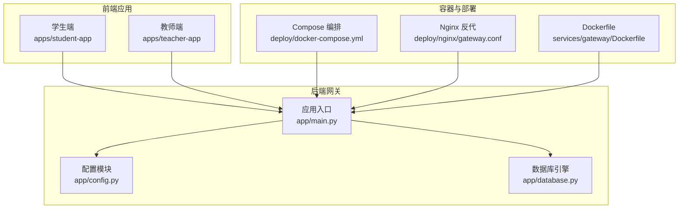
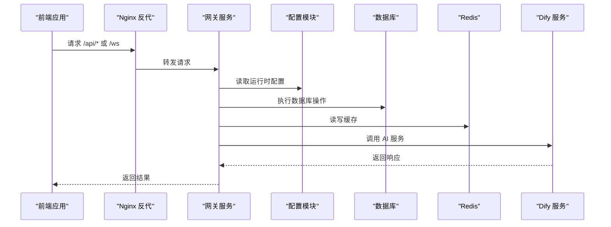
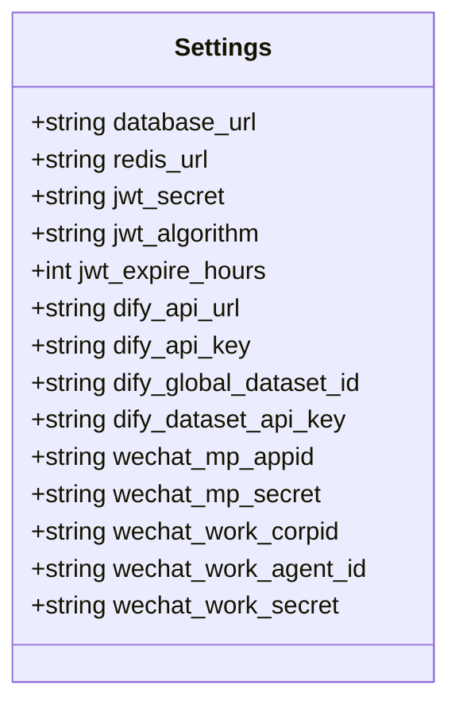
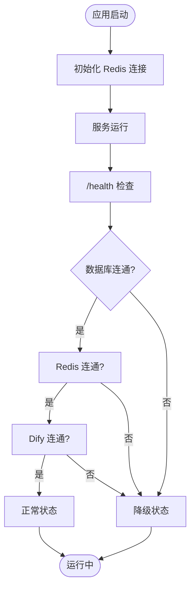
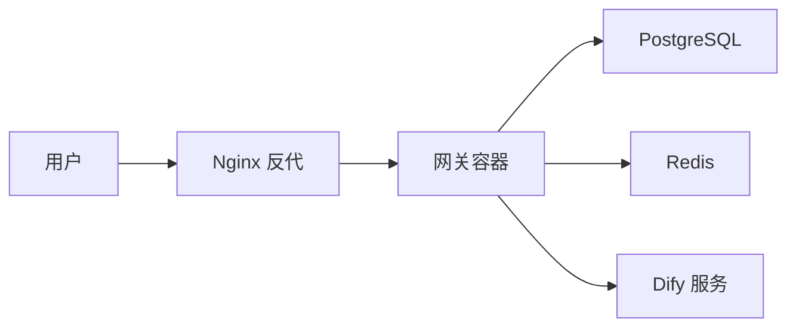
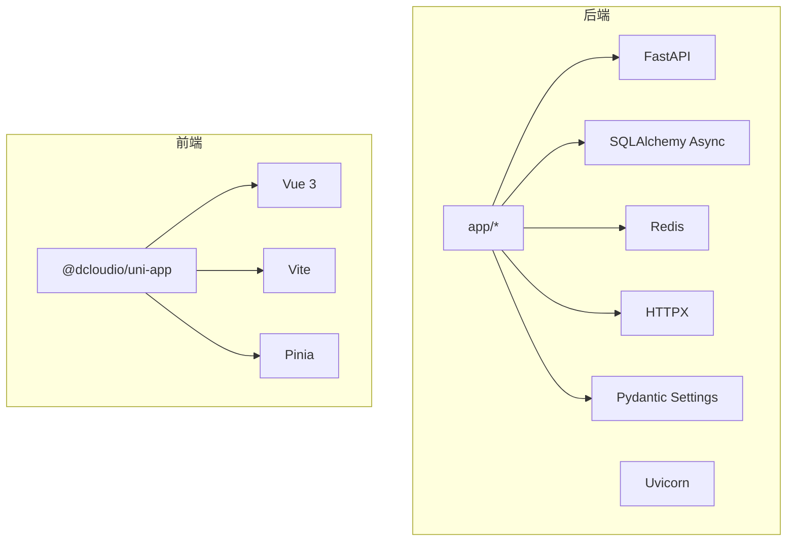

# 配置定制与环境适配

<cite>
**本文引用的文件**
- [services/gateway/app/config.py](file://services/gateway/app/config.py)
- [services/gateway/app/main.py](file://services/gateway/app/main.py)
- [services/gateway/app/database.py](file://services/gateway/app/database.py)
- [services/gateway/Dockerfile](file://services/gateway/Dockerfile)
- [services/gateway/requirements.txt](file://services/gateway/requirements.txt)
- [deploy/docker-compose.yml](file://deploy/docker-compose.yml)
- [deploy/nginx/gateway.conf](file://deploy/nginx/gateway.conf)
- [apps/student-app/vite.config.ts](file://apps/student-app/vite.config.ts)
- [apps/teacher-app/vite.config.ts](file://apps/teacher-app/vite.config.ts)
- [apps/student-app/src/env.d.ts](file://apps/student-app/src/env.d.ts)
- [apps/teacher-app/src/env.d.ts](file://apps/teacher-app/src/env.d.ts)
- [apps/student-app/package.json](file://apps/student-app/package.json)
- [apps/teacher-app/package.json](file://apps/teacher-app/package.json)
- [mutagen.yml](file://mutagen.yml)
</cite>

## 目录
1. [简介](#简介)
2. [项目结构](#项目结构)
3. [核心组件](#核心组件)
4. [架构总览](#架构总览)
5. [详细组件分析](#详细组件分析)
6. [依赖分析](#依赖分析)
7. [性能考虑](#性能考虑)
8. [故障排查指南](#故障排查指南)
9. [结论](#结论)
10. [附录](#附录)

## 简介
本指南聚焦于“配置定制与环境适配”，系统梳理后端网关服务、前端应用以及容器化部署的配置体系与最佳实践。内容涵盖：
- 环境变量配置、运行时配置、静态配置的组织方式
- 开发、测试、生产三类环境的差异化参数配置策略
- 典型配置项示例：数据库连接、AI 服务地址、前端 API 地址
- 配置验证、热更新、安全配置等技术要点
- Docker 环境配置、Kubernetes 部署思路、CI/CD 集成建议

## 项目结构
本项目采用多模块分层设计：
- 后端网关服务（FastAPI + SQLAlchemy Async + Redis）位于 services/gateway
- 前端应用（UniApp）位于 apps/student-app 与 apps/teacher-app
- 容器化与反向代理位于 deploy 目录
- 开发同步与远程开发配置位于根目录 mutagen.yml

图表来源
- [services/gateway/app/config.py:1-31](file://services/gateway/app/config.py#L1-L31)
- [services/gateway/app/main.py:1-78](file://services/gateway/app/main.py#L1-L78)
- [services/gateway/app/database.py:1-15](file://services/gateway/app/database.py#L1-L15)
- [deploy/docker-compose.yml:1-22](file://deploy/docker-compose.yml#L1-L22)
- [deploy/nginx/gateway.conf:1-36](file://deploy/nginx/gateway.conf#L1-L36)
- [services/gateway/Dockerfile:1-14](file://services/gateway/Dockerfile#L1-L14)

章节来源
- [services/gateway/app/config.py:1-31](file://services/gateway/app/config.py#L1-L31)
- [services/gateway/app/main.py:1-78](file://services/gateway/app/main.py#L1-L78)
- [services/gateway/app/database.py:1-15](file://services/gateway/app/database.py#L1-L15)
- [deploy/docker-compose.yml:1-22](file://deploy/docker-compose.yml#L1-L22)
- [deploy/nginx/gateway.conf:1-36](file://deploy/nginx/gateway.conf#L1-L36)
- [services/gateway/Dockerfile:1-14](file://services/gateway/Dockerfile#L1-L14)

## 核心组件
- 配置模型与加载
  - 使用 Pydantic Settings 统一管理配置，支持从 .env 文件与环境变量加载
  - 关键配置域：数据库连接、Redis 连接、JWT 密钥与过期时间、Dify AI 服务地址与密钥、微信相关参数
- 应用生命周期与健康检查
  - FastAPI 生命周期中初始化 Redis 连接；/health 接口对数据库、Redis、Dify 服务进行连通性校验
- 数据库与会话
  - 异步 SQLAlchemy 引擎与会话工厂，统一注入到路由依赖
- 前端开发代理
  - Vite 插件 @dcloudio/vite-plugin-uni，本地开发时通过代理转发 /api 与 /ws 到后端网关
- 容器化与编排
  - Dockerfile 指定工作目录、依赖安装、暴露端口与启动命令
  - docker-compose.yml 将环境变量注入容器，并映射端口

章节来源
- [services/gateway/app/config.py:1-31](file://services/gateway/app/config.py#L1-L31)
- [services/gateway/app/main.py:16-68](file://services/gateway/app/main.py#L16-L68)
- [services/gateway/app/database.py:1-15](file://services/gateway/app/database.py#L1-L15)
- [apps/student-app/vite.config.ts:1-22](file://apps/student-app/vite.config.ts#L1-L22)
- [apps/teacher-app/vite.config.ts:1-22](file://apps/teacher-app/vite.config.ts#L1-L22)
- [services/gateway/Dockerfile:1-14](file://services/gateway/Dockerfile#L1-L14)
- [deploy/docker-compose.yml:1-22](file://deploy/docker-compose.yml#L1-L22)

## 架构总览
下图展示配置在系统中的流转路径：前端通过代理访问后端，后端从配置模块读取运行时参数，连接数据库与外部 AI 服务。

图表来源
- [services/gateway/app/main.py:16-68](file://services/gateway/app/main.py#L16-L68)
- [services/gateway/app/config.py:1-31](file://services/gateway/app/config.py#L1-L31)
- [deploy/nginx/gateway.conf:1-36](file://deploy/nginx/gateway.conf#L1-L36)

## 详细组件分析

### 后端配置模块（Pydantic Settings）
- 配置域划分
  - 数据库与缓存：database_url、redis_url
  - 认证与授权：jwt_secret、jwt_algorithm、jwt_expire_hours
  - 外部集成：dify_api_url、dify_api_key、dify_global_dataset_id、dify_dataset_api_key
  - 微信对接（P1 阶段）：微信公众号与企业微信相关参数
- 加载机制
  - 通过 model_config 指定 env_file 与编码，实现 .env 文件与环境变量的优先级覆盖
- 安全要点
  - 默认 jwt_secret 与 dify_api_key 为空或示例值，必须在生产环境替换
  - 建议使用只读权限的数据库账号与最小权限的 API Key

图表来源
- [services/gateway/app/config.py:3-28](file://services/gateway/app/config.py#L3-L28)

章节来源
- [services/gateway/app/config.py:1-31](file://services/gateway/app/config.py#L1-L31)

### 应用生命周期与健康检查
- 生命周期
  - FastAPI lifespan 中创建 Redis 连接并注入到 app.state，退出时关闭连接
- 健康检查
  - /health 接口依次检查 PostgreSQL、Redis、Dify 服务可用性，并返回聚合状态
- 实践建议
  - 将 Dify 参数校验前置到应用启动阶段，避免运行期失败

图表来源
- [services/gateway/app/main.py:16-68](file://services/gateway/app/main.py#L16-L68)

章节来源
- [services/gateway/app/main.py:16-68](file://services/gateway/app/main.py#L16-L68)

### 数据库引擎与会话
- 引擎与会话
  - 使用异步引擎与会话工厂，池大小默认 10；依赖注入到路由层
- 最佳实践
  - 生产环境根据并发与延迟调优池大小与超时参数

章节来源
- [services/gateway/app/database.py:1-15](file://services/gateway/app/database.py#L1-L15)

### 前端开发代理与跨环境适配
- 学生端与教师端
  - 两套 Vite 配置均启用 @dcloudio/vite-plugin-uni，分别监听不同端口
  - 通过代理将 /api 转发至后端网关地址，/ws 转发至 WebSocket 地址
- 环境差异
  - 开发环境指向内网 IP；测试/生产环境应通过构建参数或环境变量注入目标地址

章节来源
- [apps/student-app/vite.config.ts:1-22](file://apps/student-app/vite.config.ts#L1-L22)
- [apps/teacher-app/vite.config.ts:1-22](file://apps/teacher-app/vite.config.ts#L1-L22)
- [apps/student-app/src/env.d.ts:1-8](file://apps/student-app/src/env.d.ts#L1-L8)
- [apps/teacher-app/src/env.d.ts:1-8](file://apps/teacher-app/src/env.d.ts#L1-L8)
- [apps/student-app/package.json:1-37](file://apps/student-app/package.json#L1-L37)
- [apps/teacher-app/package.json:1-37](file://apps/teacher-app/package.json#L1-L37)

### 容器化与编排
- Dockerfile
  - 基于 Python slim 镜像，复制依赖与源码，暴露 8000 端口，使用 uvicorn 启动
- docker-compose
  - 映射宿主 8100 至容器 8000，注入数据库、Redis、Dify、JWT 等环境变量
  - 使用 extra_hosts 解决 Docker 内外主机名解析问题
- Nginx 反向代理
  - 提供 /api 与 /ws 的转发规则，保留必要的头部信息；Dify 控制台限制内网访问

图表来源
- [services/gateway/Dockerfile:1-14](file://services/gateway/Dockerfile#L1-L14)
- [deploy/docker-compose.yml:1-22](file://deploy/docker-compose.yml#L1-L22)
- [deploy/nginx/gateway.conf:1-36](file://deploy/nginx/gateway.conf#L1-L36)

章节来源
- [services/gateway/Dockerfile:1-14](file://services/gateway/Dockerfile#L1-L14)
- [deploy/docker-compose.yml:1-22](file://deploy/docker-compose.yml#L1-L22)
- [deploy/nginx/gateway.conf:1-36](file://deploy/nginx/gateway.conf#L1-L36)

## 依赖分析
- 后端依赖
  - FastAPI、Uvicorn、SQLAlchemy Async、Redis、HTTPX、Pydantic Settings 等
- 前端依赖
  - @dcloudio/uni-app、Vue 3、Vite、Pinia 等
- 配置耦合
  - 网关服务对配置模块强依赖；前端对后端接口弱依赖（通过代理）

图表来源
- [services/gateway/requirements.txt:1-29](file://services/gateway/requirements.txt#L1-L29)

章节来源
- [services/gateway/requirements.txt:1-29](file://services/gateway/requirements.txt#L1-L29)

## 性能考虑
- 数据库连接池
  - 根据并发量与平均响应时间调整池大小与超时；监控慢查询与连接泄漏
- Redis 缓存
  - 合理设置键空间过期策略与内存淘汰策略；区分热点数据与冷数据
- 健康检查频率
  - /health 检查应短周期探测但避免过于频繁导致额外负载
- 反向代理
  - Nginx 对 WebSocket 的升级头与超时需正确配置，避免长连接中断

## 故障排查指南
- 健康检查失败
  - PostgreSQL：检查连接串、网络连通、数据库实例状态
  - Redis：检查地址、密码、网络连通
  - Dify：检查 API 地址与 API Key、网络连通、服务可用性
- Docker 环境
  - 确认环境变量已注入、端口映射正确、extra_hosts 解析生效
- 前端代理
  - 确认 /api 与 /ws 代理目标地址正确，变更后需重启开发服务器
- 配置覆盖顺序
  - 环境变量优先于 .env 文件；确保生产环境不提交敏感配置

章节来源
- [services/gateway/app/main.py:30-68](file://services/gateway/app/main.py#L30-L68)
- [services/gateway/app/config.py:28-31](file://services/gateway/app/config.py#L28-L31)
- [deploy/docker-compose.yml:11-21](file://deploy/docker-compose.yml#L11-L21)
- [apps/student-app/vite.config.ts:9-20](file://apps/student-app/vite.config.ts#L9-L20)
- [apps/teacher-app/vite.config.ts:9-20](file://apps/teacher-app/vite.config.ts#L9-L20)

## 结论
本项目通过 Pydantic Settings 实现集中式配置管理，结合 Docker 与 Nginx 实现环境解耦与高可用。建议在生产环境强化安全配置（密钥轮换、最小权限）、完善健康检查与可观测性，并在 CI/CD 流水线中自动化注入环境变量与密钥。

## 附录

### 环境变量清单与示例
- 数据库与缓存
  - DATABASE_URL：示例格式见配置文件
  - REDIS_URL：示例格式见配置文件
- 认证与授权
  - JWT_SECRET：生产环境必须替换
  - JWT_ALGORITHM：默认 HS256
  - JWT_EXPIRE_HOURS：默认 72
- 外部集成
  - DIFY_API_URL：示例地址见配置文件
  - DIFY_API_KEY：生产环境必填
  - DIFY_GLOBAL_DATASET_ID：可选
  - DIFY_DATASET_API_KEY：可选
- 微信对接（P1 阶段）
  - WECHAT_MP_APPID、WECHAT_MP_SECRET、WECHAT_WORK_CORPID、WECHAT_WORK_AGENT_ID、WECHAT_WORK_SECRET：按需填写

章节来源
- [services/gateway/app/config.py:6-26](file://services/gateway/app/config.py#L6-L26)

### 开发、测试、生产环境配置建议
- 开发环境
  - 使用本地默认值与环回地址；开启调试日志；前端代理指向本地网关
- 测试环境
  - 使用独立数据库与 Redis；最小权限 API Key；禁用或限制 Dify 控制台访问
- 生产环境
  - 所有敏感配置通过环境变量注入；启用 HTTPS 与 TLS；严格访问控制与审计日志

### 配置验证与热更新
- 验证
  - 启动阶段对关键依赖进行连通性检查；/health 接口作为就绪探针
- 热更新
  - 配置变更建议通过滚动重启容器或重新加载进程；对数据库与缓存连接需优雅关闭与重建

### Docker 与 Kubernetes 部署要点
- Docker
  - 使用 .env 文件与环境变量组合；映射必要端口；持久化日志与临时文件
- Kubernetes
  - 使用 ConfigMap 管理非敏感配置，Secret 管理敏感配置；设置资源限制与健康检查探针；通过 Ingress/NLB 暴露服务

### CI/CD 集成建议
- 构建阶段
  - 固定基础镜像版本；缓存 pip 依赖；多阶段构建减小镜像体积
- 部署阶段
  - 分环境分支保护；密钥与令牌通过 CI 凭据管理；部署后执行健康检查

### 远程开发与同步
- Mutagen
  - 两向同步模式，忽略大量开发缓存与虚拟环境目录；注意 .env 与 deploy/.env 的忽略策略，避免误同步

章节来源
- [mutagen.yml:1-26](file://mutagen.yml#L1-L26)