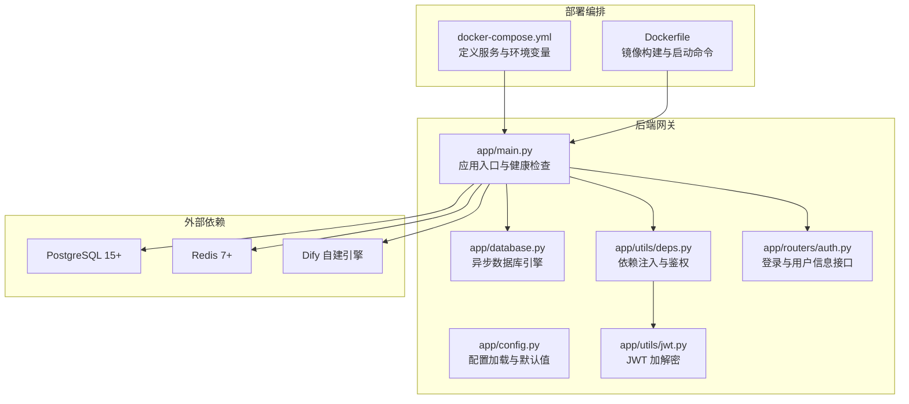
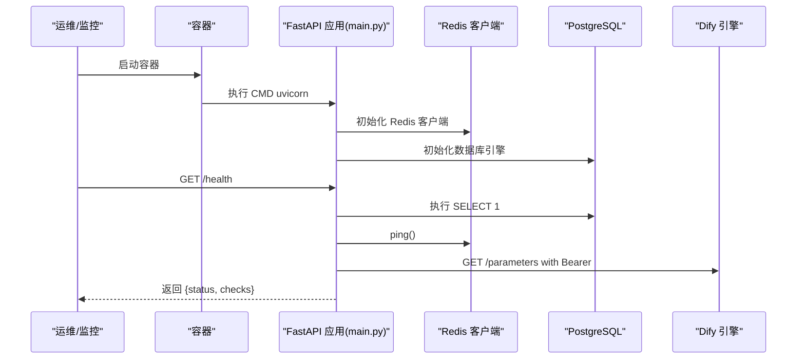
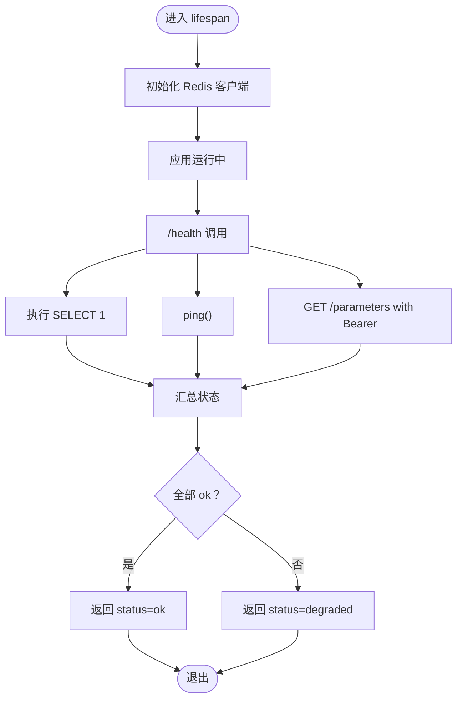
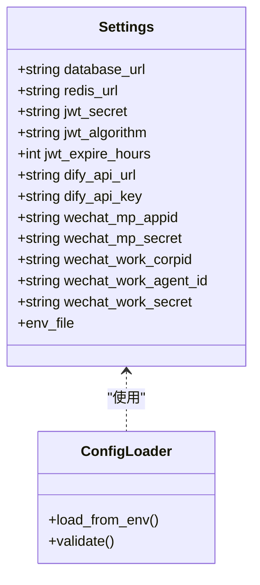
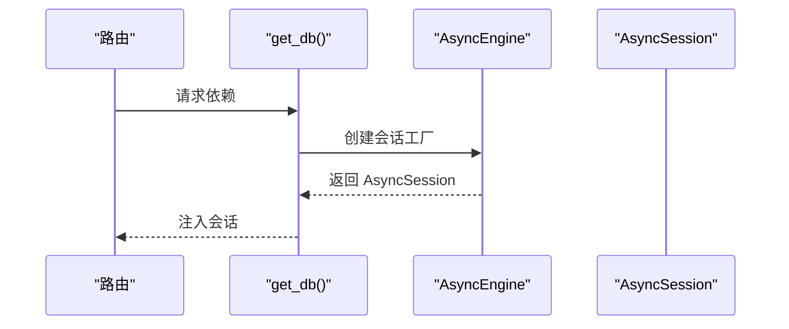
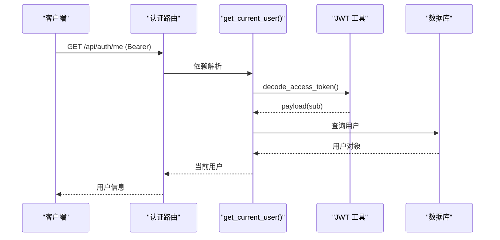
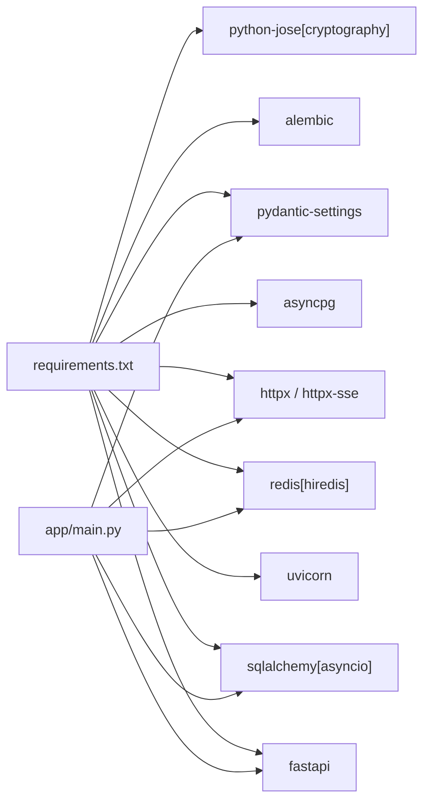

# 常见问题诊断

<cite>
**本文引用的文件**
- [README.md](file://README.md)
- [docker-compose.yml](file://deploy/docker-compose.yml)
- [Dockerfile](file://services/gateway/Dockerfile)
- [main.py](file://services/gateway/app/main.py)
- [config.py](file://services/gateway/app/config.py)
- [database.py](file://services/gateway/app/database.py)
- [deps.py](file://services/gateway/app/utils/deps.py)
- [jwt.py](file://services/gateway/app/utils/jwt.py)
- [auth.py](file://services/gateway/app/routers/auth.py)
- [requirements.txt](file://services/gateway/requirements.txt)
</cite>

## 目录
1. [简介](#简介)
2. [项目结构](#项目结构)
3. [核心组件](#核心组件)
4. [架构总览](#架构总览)
5. [详细组件分析](#详细组件分析)
6. [依赖关系分析](#依赖关系分析)
7. [性能考虑](#性能考虑)
8. [故障排查指南](#故障排查指南)
9. [结论](#结论)
10. [附录](#附录)

## 简介
本指南面向医小管 v2 的运维与开发人员，聚焦后端网关服务在启动、运行期连接与认证方面的常见问题，提供症状特征、可能原因、标准排查步骤、错误消息解读与解决方案。内容覆盖启动失败、连接超时、认证错误、数据库连接问题、Redis 连接异常等典型场景，并结合项目中的健康检查接口与配置加载机制，给出可操作的定位路径。

## 项目结构
后端网关采用 FastAPI + SQLAlchemy Async + Redis 异步架构，通过 Docker Compose 编排运行，暴露健康检查端点用于快速自检。前端应用为 UniApp（学生端）与 Vue 3（教师端），不直接影响后端启动与运行，但会通过网关 API 发起请求。

图表来源
- [docker-compose.yml:1-22](file://deploy/docker-compose.yml#L1-L22)
- [Dockerfile:1-14](file://services/gateway/Dockerfile#L1-L14)
- [main.py:1-78](file://services/gateway/app/main.py#L1-L78)
- [config.py:1-31](file://services/gateway/app/config.py#L1-L31)
- [database.py:1-15](file://services/gateway/app/database.py#L1-L15)
- [deps.py:1-40](file://services/gateway/app/utils/deps.py#L1-L40)
- [jwt.py:1-17](file://services/gateway/app/utils/jwt.py#L1-L17)
- [auth.py:1-35](file://services/gateway/app/routers/auth.py#L1-L35)

章节来源
- [README.md:1-18](file://README.md#L1-L18)
- [docker-compose.yml:1-22](file://deploy/docker-compose.yml#L1-L22)
- [Dockerfile:1-14](file://services/gateway/Dockerfile#L1-L14)

## 核心组件
- 应用入口与生命周期管理：负责创建 Redis 客户端实例、注册路由、提供健康检查端点。
- 配置模块：从环境文件加载数据库、Redis、Dify、JWT 等关键参数。
- 数据库层：基于 SQLAlchemy Async 的异步引擎与会话工厂。
- 鉴权与依赖注入：HTTP Bearer 认证、JWT 解码、用户上下文解析、Redis 注入。
- 认证路由：登录接口与用户信息查询接口。
- 外部依赖：PostgreSQL、Redis、Dify 引擎。

章节来源
- [main.py:16-68](file://services/gateway/app/main.py#L16-L68)
- [config.py:3-31](file://services/gateway/app/config.py#L3-L31)
- [database.py:6-14](file://services/gateway/app/database.py#L6-L14)
- [deps.py:14-39](file://services/gateway/app/utils/deps.py#L14-L39)
- [auth.py:12-34](file://services/gateway/app/routers/auth.py#L12-L34)

## 架构总览
下图展示启动与健康检查的关键流程，以及各组件间的依赖关系。

图表来源
- [Dockerfile:13](file://services/gateway/Dockerfile#L13)
- [main.py:16-68](file://services/gateway/app/main.py#L16-L68)

## 详细组件分析

### 组件一：健康检查与启动流程
- 启动阶段：应用在 lifespan 中初始化 Redis 客户端；关闭时释放连接。
- 健康检查：对 PostgreSQL、Redis、Dify 三类依赖进行连通性与可用性检测，返回聚合状态。
- 关键点：超时控制、异常捕获与错误信息拼装；Dify 检查使用短超时避免阻塞。

图表来源
- [main.py:16-68](file://services/gateway/app/main.py#L16-L68)

章节来源
- [main.py:16-68](file://services/gateway/app/main.py#L16-L68)

### 组件二：配置加载与环境变量
- 配置来源：pydantic-settings 从 .env 文件加载，支持默认值与类型校验。
- 关键项：DATABASE_URL、REDIS_URL、DIFY_API_URL、DIFY_API_KEY、JWT_SECRET 等。
- Docker Compose 提供环境变量覆盖，extra_hosts 将 host.docker.internal 映射到宿主机网关。

图表来源
- [config.py:3-31](file://services/gateway/app/config.py#L3-L31)

章节来源
- [config.py:3-31](file://services/gateway/app/config.py#L3-L31)
- [docker-compose.yml:11-19](file://deploy/docker-compose.yml#L11-L19)

### 组件三：数据库连接与会话
- 使用异步引擎与会话工厂，池大小固定，连接字符串来自配置。
- 依赖注入：路由层通过依赖函数获取会话，确保作用域内事务安全。
- 常见问题：连接字符串格式错误、端口不通、数据库未就绪、权限不足。

图表来源
- [database.py:6-14](file://services/gateway/app/database.py#L6-L14)

章节来源
- [database.py:6-14](file://services/gateway/app/database.py#L6-L14)

### 组件四：认证与依赖注入
- 鉴权流程：HTTP Bearer 头 → 解码 JWT → 查询用户 → 校验激活状态。
- 依赖注入：get_current_user 依赖 HTTP 授权头与数据库会话；get_redis 依赖应用状态中的 Redis 实例。
- 错误路径：令牌无效、用户不存在或禁用、数据库查询失败。

图表来源
- [deps.py:14-35](file://services/gateway/app/utils/deps.py#L14-L35)
- [jwt.py:6-16](file://services/gateway/app/utils/jwt.py#L6-L16)
- [auth.py:24-34](file://services/gateway/app/routers/auth.py#L24-L34)

章节来源
- [deps.py:14-39](file://services/gateway/app/utils/deps.py#L14-L39)
- [jwt.py:6-16](file://services/gateway/app/utils/jwt.py#L6-L16)
- [auth.py:12-34](file://services/gateway/app/routers/auth.py#L12-L34)

## 依赖关系分析
- 运行时依赖：FastAPI、SQLAlchemy Async、asyncpg、redis、httpx、pydantic-settings 等。
- Dockerfile 指定监听 8000 端口，与 docker-compose 暴露映射一致。
- 健康检查对三类外部依赖进行探测，便于快速定位故障域。

图表来源
- [requirements.txt:1-29](file://services/gateway/requirements.txt#L1-L29)
- [main.py:1-14](file://services/gateway/app/main.py#L1-L14)

章节来源
- [requirements.txt:1-29](file://services/gateway/requirements.txt#L1-L29)
- [Dockerfile:11-13](file://services/gateway/Dockerfile#L11-L13)

## 性能考虑
- 数据库连接池：默认池大小适中，可根据并发峰值调整。
- Redis 客户端：单实例连接，注意高并发下的连接争用与超时设置。
- Dify 调用：健康检查使用短超时，避免阻塞整体健康状态。
- 日志与调试：生产环境建议关闭 SQL echo，仅在排障时开启。

## 故障排查指南

### 启动失败
- 症状特征
  - 容器启动即退出或反复重启
  - 控制台出现导入错误、端口占用、依赖缺失提示
- 可能原因
  - Python 依赖安装失败或版本不兼容
  - 环境变量未正确注入（如 DATABASE_URL、REDIS_URL）
  - Docker 网络映射错误（端口冲突、host.docker.internal 无法解析）
- 标准排查步骤
  - 查看容器日志，确认依赖安装是否成功
  - 在本地 shell 中执行 uvicorn 启动命令，验证端口与路径
  - 检查 docker-compose.yml 的 environment 与 extra_hosts 设置
  - 确认 .env 文件存在且包含必需键
- 错误消息解读
  - 导入异常：通常指向 requirements.txt 或模块路径问题
  - 端口占用：uvicorn 报告端口绑定失败
- 解决方案与预防
  - 固定 Python 版本与依赖范围，使用镜像源加速安装
  - 使用 docker-compose config 校验配置语法
  - 预留端口避免与历史服务冲突
- 相关实现参考
  - [Dockerfile:13](file://services/gateway/Dockerfile#L13)
  - [docker-compose.yml:11-19](file://deploy/docker-compose.yml#L11-L19)

章节来源
- [Dockerfile:11-13](file://services/gateway/Dockerfile#L11-L13)
- [docker-compose.yml:11-19](file://deploy/docker-compose.yml#L11-L19)

### 连接超时
- 症状特征
  - /health 返回 degraded，其中 postgres 或 redis 字段显示 error
  - 认证接口偶发超时或响应缓慢
- 可能原因
  - 数据库/Redis 主机不可达或端口未开放
  - 网络策略限制（防火墙、安全组）
  - 容器与外部服务不在同一网络或 DNS 解析异常
- 标准排查步骤
  - 在容器内使用网络工具测试连通性（如 nc、telnet）
  - 使用 curl 或 httpx 测试 Dify /parameters 接口连通性与超时
  - 检查 host.docker.internal 到宿主机网关的映射
- 错误消息解读
  - postgres 字段报错：多为连接字符串或网络不可达
  - redis 字段报错：多为端口不通或密码/DB索引错误
- 解决方案与预防
  - 使用 docker network inspect 检查容器网络
  - 将外部服务地址改为宿主机直连或使用服务名
  - 为 Dify 配置正确的 API Key 与访问地址
- 相关实现参考
  - [main.py:30-68](file://services/gateway/app/main.py#L30-L68)
  - [docker-compose.yml:18-19](file://deploy/docker-compose.yml#L18-L19)

章节来源
- [main.py:30-68](file://services/gateway/app/main.py#L30-L68)
- [docker-compose.yml:18-19](file://deploy/docker-compose.yml#L18-L19)

### 认证错误
- 症状特征
  - 登录接口返回 401，提示“学号或密码错误”
  - 获取用户信息接口返回 401，提示“无效的认证凭据”或“用户不存在或已禁用”
- 可能原因
  - JWT Secret 未正确配置或前后端不一致
  - 令牌格式不合法、过期或被篡改
  - 用户不存在或未启用
- 标准排查步骤
  - 确认 JWT_SECRET 环境变量已在 .env 中设置
  - 使用有效登录凭据重新获取令牌
  - 校验令牌签名算法与过期时间
- 错误消息解读
  - “学号或密码错误”：认证服务未找到匹配用户
  - “无效的认证凭据”：JWT 解码失败（格式/签名/算法）
  - “用户不存在或已禁用”：数据库查询结果为空或用户状态异常
- 解决方案与预防
  - 生成强随机密钥并统一部署
  - 前端正确存储与传递 Bearer 令牌
  - 定期清理过期令牌，合理设置过期时长
- 相关实现参考
  - [auth.py:12-21](file://services/gateway/app/routers/auth.py#L12-L21)
  - [deps.py:18-35](file://services/gateway/app/utils/deps.py#L18-L35)
  - [jwt.py:6-16](file://services/gateway/app/utils/jwt.py#L6-L16)

章节来源
- [auth.py:12-21](file://services/gateway/app/routers/auth.py#L12-L21)
- [deps.py:18-35](file://services/gateway/app/utils/deps.py#L18-L35)
- [jwt.py:6-16](file://services/gateway/app/utils/jwt.py#L6-L16)

### 数据库连接问题
- 症状特征
  - /health 中 postgres 字段为 error
  - 认证或业务接口报数据库连接异常
- 可能原因
  - 连接字符串格式错误（协议、主机、端口、数据库名、密码）
  - 数据库未启动或未创建目标数据库
  - 用户权限不足或密码错误
  - 网络隔离导致容器无法访问数据库
- 标准排查步骤
  - 在容器内尝试以相同连接串连接数据库（如 psql）
  - 检查数据库服务状态与监听地址
  - 对照 docker-compose 的 DATABASE_URL 环境变量
- 错误消息解读
  - 连接被拒绝：主机/端口错误或服务未监听
  - 认证失败：用户名/密码/数据库名错误
- 解决方案与预防
  - 使用官方驱动与推荐的连接参数
  - 为不同环境准备独立的 .env 文件
  - 通过 Docker 网络共享或服务编排统一依赖
- 相关实现参考
  - [database.py:6](file://services/gateway/app/database.py#L6)
  - [docker-compose.yml:12](file://deploy/docker-compose.yml#L12)

章节来源
- [database.py:6](file://services/gateway/app/database.py#L6)
- [docker-compose.yml:12](file://deploy/docker-compose.yml#L12)

### Redis 连接异常
- 症状特征
  - /health 中 redis 字段为 error
  - 业务侧缓存读写失败或超时
- 可能原因
  - REDIS_URL 地址或端口错误
  - 密码或数据库索引配置错误
  - Redis 未启动或网络隔离
- 标准排查步骤
  - 在容器内使用 redis-cli 测试连接
  - 检查 REDIS_URL 环境变量与 .env 配置
- 错误消息解读
  - 连接被拒绝：主机/端口/网络问题
  - 认证失败：密码错误
- 解决方案与预防
  - 使用稳定的服务发现或网络别名
  - 为 Redis 配置强密码与最小权限
- 相关实现参考
  - [main.py:18-20](file://services/gateway/app/main.py#L18-L20)
  - [docker-compose.yml:13](file://deploy/docker-compose.yml#L13)

章节来源
- [main.py:18-20](file://services/gateway/app/main.py#L18-L20)
- [docker-compose.yml:13](file://deploy/docker-compose.yml#L13)

### Dify 连接异常
- 症状特征
  - /health 中 dify 字段为 error 或返回非 2xx 状态码
  - 聊天或知识检索接口调用失败
- 可能原因
  - DIFY_API_URL 地址错误或端口不可达
  - DIFY_API_KEY 未设置或错误
  - Dify 服务未启动或限流
- 标准排查步骤
  - 使用 curl 或 httpx 直接调用 /parameters 并携带 Bearer Key
  - 检查 Dify 服务日志与健康状态
- 错误消息解读
  - 4xx：认证失败或参数错误
  - 5xx：服务内部错误
- 解决方案与预防
  - 为 Dify 配置专用 API Key 并严格保密
  - 在网关侧增加重试与熔断策略（建议）
- 相关实现参考
  - [main.py:52-61](file://services/gateway/app/main.py#L52-L61)
  - [docker-compose.yml:14-15](file://deploy/docker-compose.yml#L14-L15)

章节来源
- [main.py:52-61](file://services/gateway/app/main.py#L52-L61)
- [docker-compose.yml:14-15](file://deploy/docker-compose.yml#L14-L15)

## 结论
通过健康检查端点与配置加载机制，可以快速定位医小管 v2 网关的启动与运行期问题。建议在生产环境中：
- 统一管理 .env 文件与密钥轮换
- 使用稳定的网络与服务发现
- 为数据库、Redis、Dify 分别建立独立的健康检查与告警
- 对认证与会话进行定期审计与优化

## 附录
- 快速自检清单
  - 执行 docker-compose config 校验配置
  - 访问 /health 观察 postgres、redis、dify 状态
  - 使用 curl 验证 /api/auth/login 与 /api/auth/me
  - 在容器内使用 psql/redis-cli 进行连通性测试
- 常用命令参考
  - 启动：cd deploy && docker compose up -d
  - 日志：docker compose logs -f v2_gateway
  - 进入容器：docker compose exec v2_gateway bash