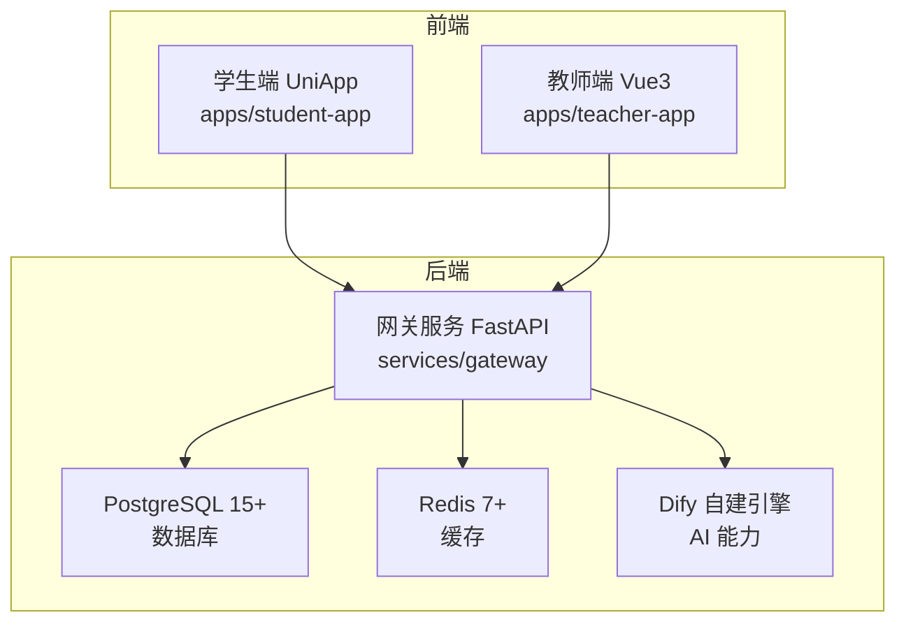
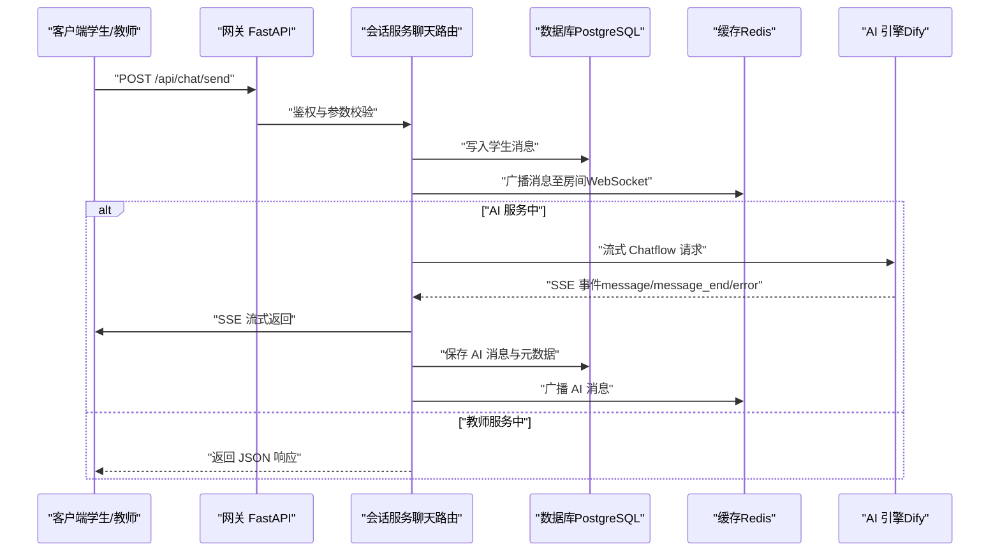
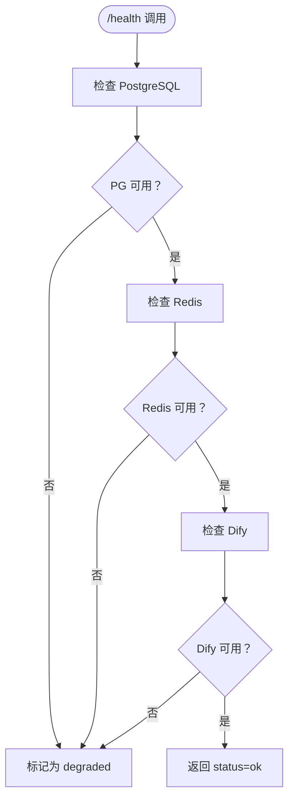
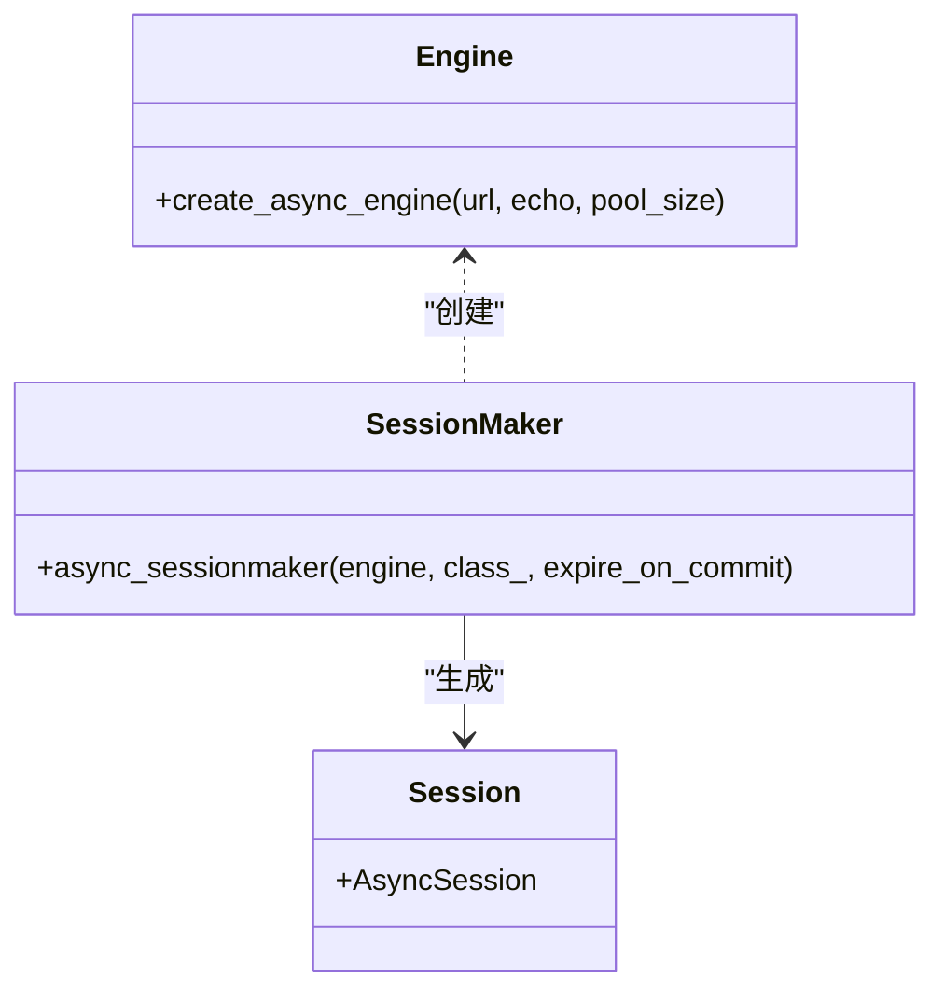
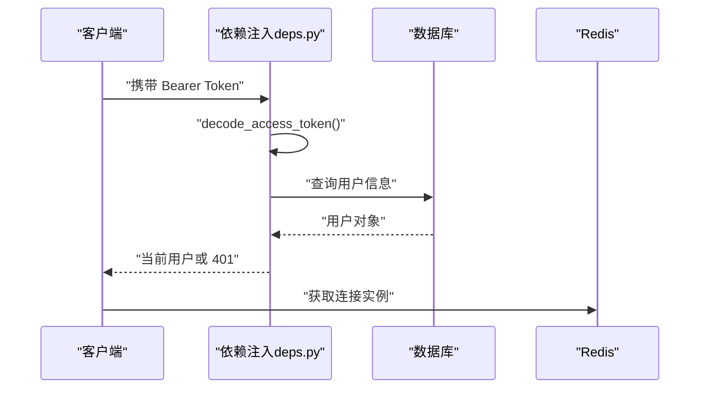
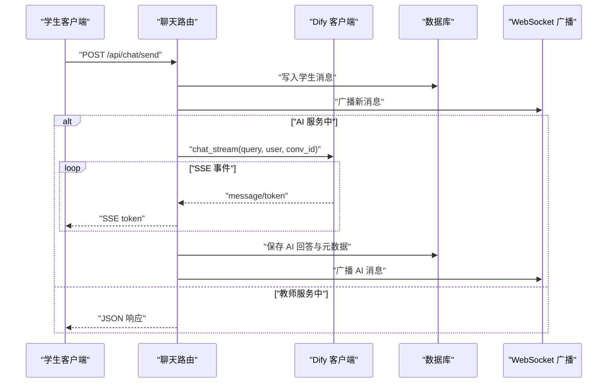
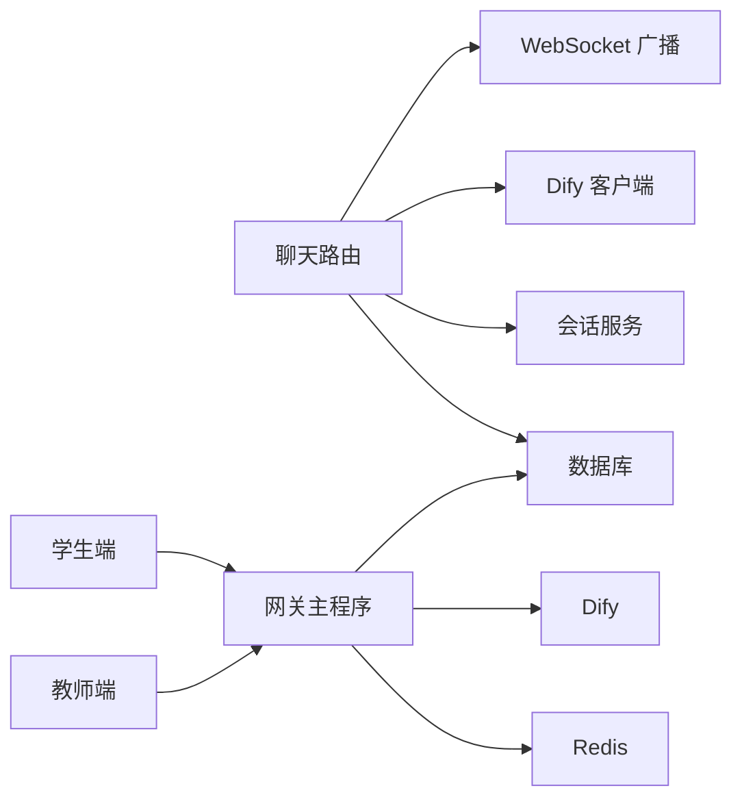

# 性能监控与优化

<cite>
**本文引用的文件**
- [README.md](file://README.md)
- [docker-compose.yml](file://deploy/docker-compose.yml)
- [Dockerfile](file://services/gateway/Dockerfile)
- [main.py](file://services/gateway/app/main.py)
- [config.py](file://services/gateway/app/config.py)
- [database.py](file://services/gateway/app/database.py)
- [deps.py](file://services/gateway/app/utils/deps.py)
- [auth.py](file://services/gateway/app/routers/auth.py)
- [chat.py](file://services/gateway/app/routers/chat.py)
- [dify_client.py](file://services/gateway/app/services/dify_client.py)
- [request.ts（学生端）](file://apps/student-app/src/utils/request.ts)
- [request.ts（教师端）](file://apps/teacher-app/src/utils/request.ts)
</cite>

## 目录
1. [引言](#引言)
2. [项目结构](#项目结构)
3. [核心组件](#核心组件)
4. [架构总览](#架构总览)
5. [详细组件分析](#详细组件分析)
6. [依赖关系分析](#依赖关系分析)
7. [性能考量](#性能考量)
8. [故障排查指南](#故障排查指南)
9. [结论](#结论)
10. [附录](#附录)

## 引言
本指南面向医小管 v2 的性能监控与优化工作，聚焦于后端网关服务（FastAPI + SQLAlchemy + Alembic）、AI 引擎（Dify 自建）、数据库（PostgreSQL）与缓存（Redis），以及前后端交互链路。文档围绕关键性能指标（响应时间、吞吐量、并发数、内存使用率、数据库查询性能等）给出定义与测量建议，并提供瓶颈识别与优化策略，覆盖数据库优化、缓存策略、异步处理、负载均衡与性能测试方法。

## 项目结构
- 后端网关服务位于 services/gateway，采用 FastAPI + SQLAlchemy Async + Redis 异步模型，通过健康检查接口对数据库、Redis 与 Dify 服务进行连通性验证。
- 前端应用位于 apps/student-app 与 apps/teacher-app，均通过统一请求封装访问后端 API。
- 部署通过 docker-compose 编排，容器暴露 8100:8000 映射，环境变量注入数据库、Redis、Dify 等配置。

图表来源
- [docker-compose.yml:1-22](file://deploy/docker-compose.yml#L1-L22)
- [main.py:24-78](file://services/gateway/app/main.py#L24-L78)
- [config.py:6-26](file://services/gateway/app/config.py#L6-L26)

章节来源
- [README.md:1-18](file://README.md#L1-L18)
- [docker-compose.yml:1-22](file://deploy/docker-compose.yml#L1-L22)

## 核心组件
- 网关服务主程序：负责应用生命周期管理、健康检查、路由挂载与外部依赖初始化。
- 配置模块：集中管理数据库、Redis、JWT、Dify 等配置项。
- 数据库模块：基于 SQLAlchemy Async 的连接池配置与会话依赖注入。
- 认证与依赖：JWT 校验、当前用户解析、Redis 获取等。
- 聊天路由：实现消息发送、状态机流转、SSE 流式响应与 WebSocket 广播。
- Dify 客户端：封装 Dify Chatflow 的流式调用，支持事件驱动的数据透传。
- 前端请求封装：统一封装 GET/POST/PUT/DELETE，自动注入 Token、超时控制与错误处理。

章节来源
- [main.py:16-78](file://services/gateway/app/main.py#L16-L78)
- [config.py:3-31](file://services/gateway/app/config.py#L3-L31)
- [database.py:1-15](file://services/gateway/app/database.py#L1-L15)
- [deps.py:14-40](file://services/gateway/app/utils/deps.py#L14-L40)
- [chat.py:22-191](file://services/gateway/app/routers/chat.py#L22-L191)
- [dify_client.py:11-105](file://services/gateway/app/services/dify_client.py#L11-L105)
- [request.ts（学生端）:1-44](file://apps/student-app/src/utils/request.ts#L1-L44)
- [request.ts（教师端）:10-108](file://apps/teacher-app/src/utils/request.ts#L10-L108)

## 架构总览
下图展示从客户端到后端服务、数据库与 AI 引擎的典型调用链路，重点标注了性能敏感环节（SSE 流、数据库写入、Dify 调用、Redis 使用）。

图表来源
- [chat.py:22-191](file://services/gateway/app/routers/chat.py#L22-L191)
- [dify_client.py:22-69](file://services/gateway/app/services/dify_client.py#L22-L69)
- [main.py:30-68](file://services/gateway/app/main.py#L30-L68)

## 详细组件分析

### 网关健康检查与外部依赖
- 健康检查接口同时探测数据库、Redis 与 Dify 服务可用性，返回聚合状态，便于运维快速定位问题。
- 应用生命周期内初始化 Redis 连接，确保全局可用；关闭时释放连接，避免资源泄漏。

图表来源
- [main.py:30-68](file://services/gateway/app/main.py#L30-L68)

章节来源
- [main.py:16-78](file://services/gateway/app/main.py#L16-L78)

### 数据库连接与会话管理
- 使用 SQLAlchemy Async 引擎与异步会话工厂，连接池默认大小为 10；在高并发场景下需结合实际 QPS 评估是否扩容。
- 会话依赖注入模式简化路由层数据库操作，减少重复代码。

图表来源
- [database.py:6-15](file://services/gateway/app/database.py#L6-L15)

章节来源
- [database.py:1-15](file://services/gateway/app/database.py#L1-L15)

### 认证与依赖注入
- JWT 校验：从 Authorization 头提取令牌，解码后查询用户并校验有效性与活跃状态。
- Redis 获取：通过请求上下文获取全局 Redis 实例，用于广播与缓存。

图表来源
- [deps.py:14-40](file://services/gateway/app/utils/deps.py#L14-L40)
- [auth.py:12-35](file://services/gateway/app/routers/auth.py#L12-L35)

章节来源
- [deps.py:14-40](file://services/gateway/app/utils/deps.py#L14-L40)
- [auth.py:12-35](file://services/gateway/app/routers/auth.py#L12-L35)

### 聊天路由与 SSE 流式响应
- 学生发送消息后，先持久化消息并广播至房间；根据会话状态决定走 AI 流式或直接返回 JSON。
- AI 路径通过 Dify 客户端发起流式请求，按事件类型逐 token 下发至前端，最终保存完整回答并再次广播。

图表来源
- [chat.py:22-191](file://services/gateway/app/routers/chat.py#L22-L191)
- [dify_client.py:22-69](file://services/gateway/app/services/dify_client.py#L22-L69)

章节来源
- [chat.py:22-191](file://services/gateway/app/routers/chat.py#L22-L191)
- [dify_client.py:11-105](file://services/gateway/app/services/dify_client.py#L11-L105)

### 前端请求封装与错误处理
- 学生端与教师端均提供统一请求函数，自动注入 Authorization、处理 401、422 等错误码，并在失败时弹窗提示。
- 教师端设置默认请求超时，有助于避免长时间阻塞影响用户体验。

章节来源
- [request.ts（学生端）:1-44](file://apps/student-app/src/utils/request.ts#L1-L44)
- [request.ts（教师端）:10-108](file://apps/teacher-app/src/utils/request.ts#L10-L108)

## 依赖关系分析
- 网关服务依赖数据库、Redis 与 Dify；健康检查接口串联三者可用性。
- 聊天路由依赖会话服务、状态机、Dify 客户端与 WebSocket 管理器。
- 前端通过代理将 /api 请求转发至网关服务，避免跨域与环境差异。

图表来源
- [chat.py:11-16](file://services/gateway/app/routers/chat.py#L11-L16)
- [main.py:10-14](file://services/gateway/app/main.py#L10-L14)
- [docker-compose.yml:11-16](file://deploy/docker-compose.yml#L11-L16)

章节来源
- [main.py:10-78](file://services/gateway/app/main.py#L10-L78)
- [chat.py:11-16](file://services/gateway/app/routers/chat.py#L11-L16)

## 性能考量

### 关键性能指标定义与测量方法
- 响应时间
  - 定义：从客户端发起请求到收到首包（SSE 首 token 或 JSON 响应）的时间。
  - 测量：在网关路由层记录请求进入与首包发出时间差；前端记录 XHR/SSE 连接建立与首个事件到达时间。
  - 指标用途：评估端到端延迟，定位网络、Dify 调用、数据库写入瓶颈。
- 吞吐量
  - 定义：单位时间内成功处理的请求数（QPS）。
  - 测量：在网关侧统计每秒请求数与成功率；结合 Nginx/反向代理统计整体 QPS。
  - 指标用途：评估系统承载能力与容量规划。
- 并发数
  - 定义：同时活跃的连接数（HTTP、SSE、WebSocket）。
  - 测量：通过系统监控（如 netstat/ss/lsof）与容器资源监控观察峰值并发。
  - 指标用途：指导连接池与线程/协程上限配置。
- 内存使用率
  - 定义：进程常驻内存与堆外内存占用。
  - 测量：容器层面采集 RSS、堆内存（如 Python GC 统计）与缓存命中率。
  - 指标用途：发现内存泄漏与缓存膨胀。
- 数据库查询性能
  - 定义：慢查询比例、平均执行时间、锁等待与回表次数。
  - 测量：开启 pg_stat_statements（PostgreSQL 扩展），收集慢查询日志与 EXPLAIN 分析。
  - 指标用途：识别索引缺失、查询计划不当与热点表。

### 性能瓶颈识别与分析技巧
- 慢查询分析
  - 在聊天路由中，数据库写入与状态更新较为频繁，建议对会话与消息表的关键字段建立合适索引，并定期分析 EXPLAIN。
  - 对 Dify 首次对话产生的 conversation_id 更新，注意事务边界与提交频率。
- 连接池监控
  - 当前数据库连接池大小为 10，若出现排队或超时，应评估并发峰值与 QPS，适当扩容连接池或引入连接池监控告警。
- 缓存命中率分析
  - 利用 Redis INFO 命令查看命中率与内存使用；对高频读取的用户信息、会话元数据进行缓存预热与失效策略设计。
- SSE 与 WebSocket
  - 观察 SSE 首 token 延迟与断流重连次数；WebSocket 房间广播的并发与消息积压情况。

### 性能优化策略与最佳实践
- 数据库优化
  - 索引优化：为会话表的用户 ID、状态、创建时间等常用过滤字段建立复合索引；消息表按会话 ID 分区或分表。
  - 查询优化：避免 N+1 查询，批量写入与批处理提交；对大字段（如答案文本）考虑压缩存储或外部化。
  - 连接池优化：根据峰值 QPS 与平均事务时长计算所需连接数，设置合适的空闲回收与超时阈值。
- 缓存策略
  - LRU 缓存：对用户资料、会话元数据进行短期缓存；设置 TTL 与失效策略，避免脏读。
  - 读写分离：热点读取走只读副本，写入集中在主库。
- 异步处理
  - 将非关键路径（如日志上报、通知发送）改为后台任务队列，降低主流程延迟。
- 负载均衡
  - 前端通过 Nginx 或反向代理进行多实例部署与健康检查；对 SSE/WS 场景保持会话亲和或使用共享状态存储。
- 配置与部署
  - 生产环境调整 Uvicorn 工作进程与 worker 数量，结合 CPU 核数与 IO 特性调优。
  - 通过 docker-compose 设置合理的重启策略与资源限制，避免单点过载。

### 性能测试方法与基准测试工具
- 压测工具
  - wrk/wrk2：模拟高并发 HTTP 请求，统计 P95/P99 延迟与吞吐量。
  - k6/Locust：支持复杂脚本与真实浏览器行为，适合端到端场景。
  - ab（Apache Bench）：简单快速的基准测试，适合快速对比不同配置。
- 测试场景
  - 单接口压测：针对 /api/chat/send 的不同状态（AI/教师）分别压测。
  - 端到端压测：从前端发起消息，追踪到数据库写入与 Dify 调用的全链路延迟。
  - 峰值场景：模拟突发流量与长尾 SSE 流，观察连接池与 Redis 命中率变化。
- 结果分析
  - 关注延迟分布（P50/P90/P95/P99）、错误率、资源使用率（CPU/内存/IO）与数据库慢查询占比。
  - 对比不同配置（连接池大小、Redis 缓存策略、Dify 超时）下的性能表现，确定最优组合。

## 故障排查指南
- 健康检查失败
  - 若 postgres/redis/dify 任一项报错，优先检查对应服务地址、密钥与网络连通性；核对环境变量与容器映射。
- SSE 断流或延迟
  - 检查 Dify 调用超时与网络抖动；确认 Nginx/反向代理未对 SSE 做缓冲或压缩；前端重连逻辑与断线恢复。
- 数据库写入慢
  - 查看慢查询日志与索引使用情况；评估批量写入与事务大小；必要时拆分热点表或引入只读副本。
- Redis 命中率低
  - 检查键空间淘汰策略与 TTL 设置；对冷数据进行归档或降级缓存；避免大对象频繁序列化。
- 前端错误处理
  - 401 未授权：检查 Token 注入与刷新机制；确认后端 JWT 密钥与算法一致。
  - 参数错误（422）：前端提示与后端校验保持一致，避免误导用户。

章节来源
- [main.py:30-68](file://services/gateway/app/main.py#L30-L68)
- [chat.py:105-191](file://services/gateway/app/routers/chat.py#L105-L191)
- [request.ts（学生端）:25-42](file://apps/student-app/src/utils/request.ts#L25-L42)
- [request.ts（教师端）:42-65](file://apps/teacher-app/src/utils/request.ts#L42-L65)

## 结论
通过对网关服务、数据库、缓存与 AI 引擎的全链路分析，结合关键性能指标与压测方法，可系统性地识别瓶颈并制定优化策略。建议以“数据库索引与连接池”“缓存命中与失效策略”“异步化与限流”“负载均衡与资源隔离”为主线持续迭代，配合自动化监控与告警体系，保障系统在高并发场景下的稳定性与低延迟。

## 附录
- 部署与运行
  - 使用 docker-compose 启动网关服务，端口映射为 8100:8000；确保数据库、Redis、Dify 服务可达。
- 配置要点
  - 数据库 URL、Redis URL、Dify API 地址与密钥通过环境变量注入；生产环境务必替换默认值。
- 开发与测试
  - 前端通过 Vite/UniApp 代理将 /api 请求转发至网关；测试时可切换 BASE_URL 与超时参数以模拟不同网络条件。

章节来源
- [docker-compose.yml:11-16](file://deploy/docker-compose.yml#L11-L16)
- [config.py:6-26](file://services/gateway/app/config.py#L6-L26)
- [Dockerfile:11-14](file://services/gateway/Dockerfile#L11-L14)