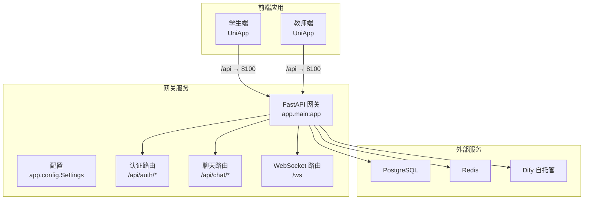
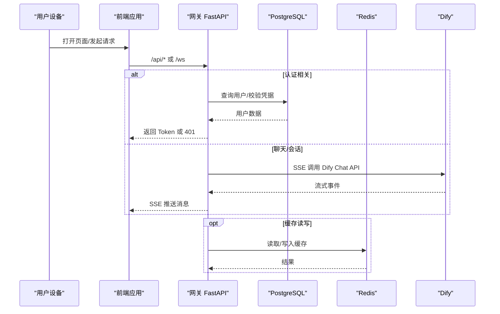
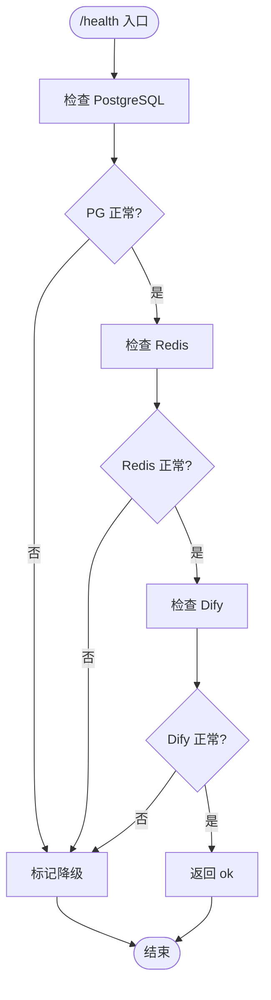
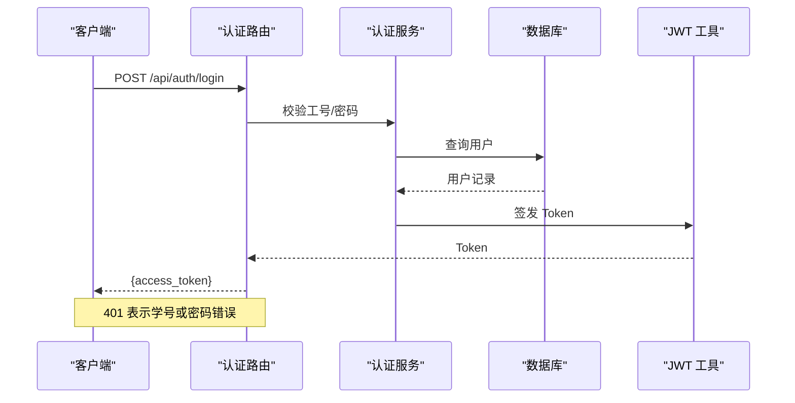
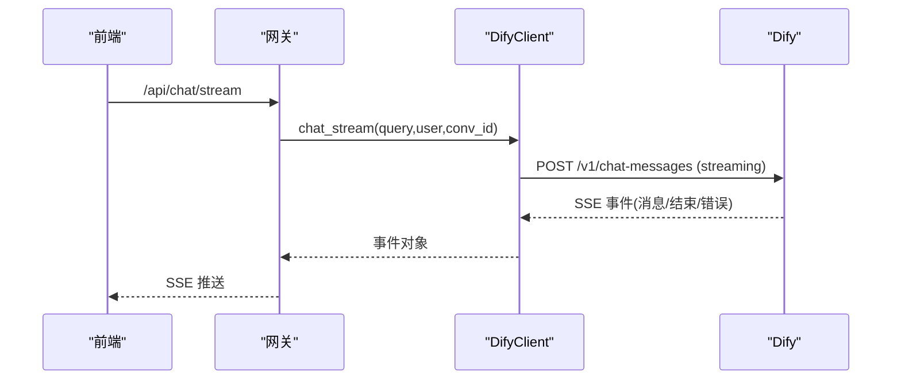
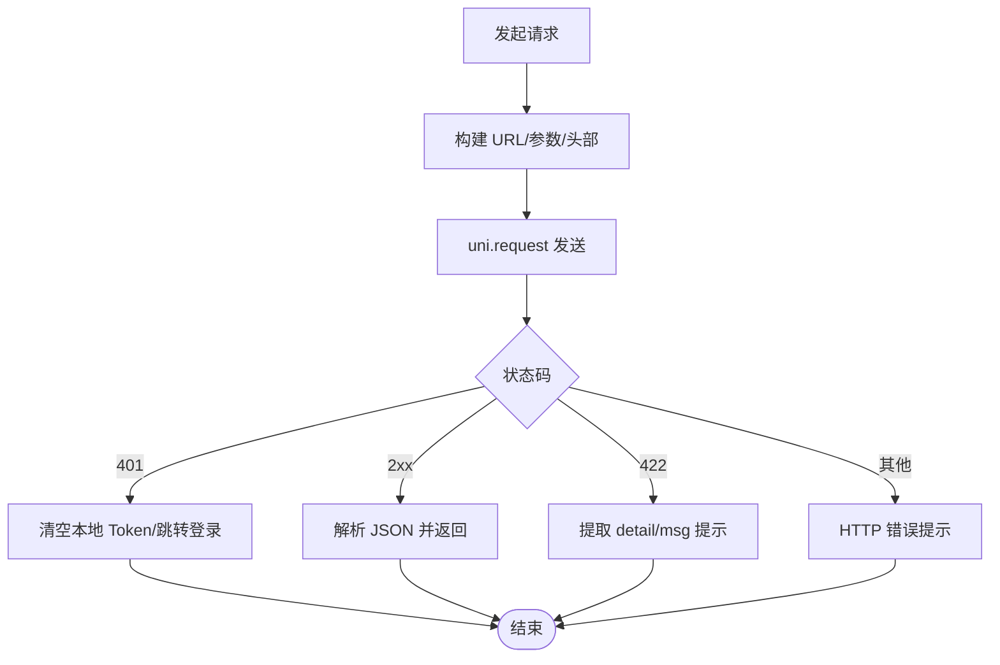
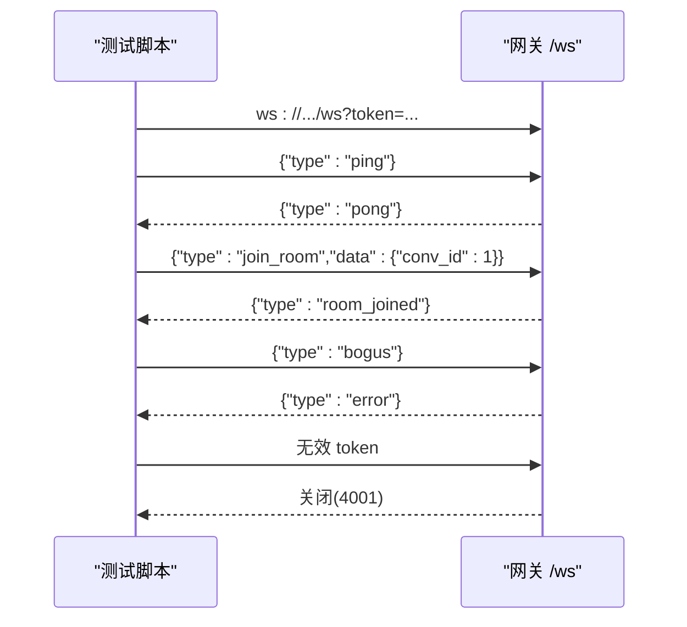
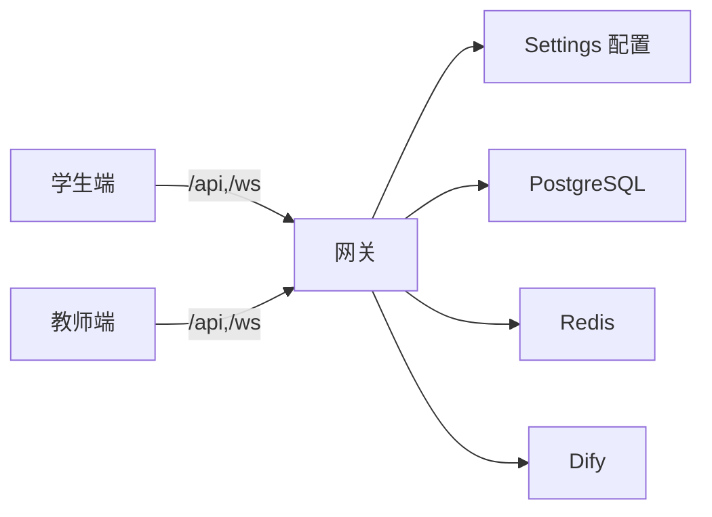

# 故障排除与调试

<cite>
**本文引用的文件**
- [README.md](file://README.md)
- [docker-compose.yml](file://deploy/docker-compose.yml)
- [Dockerfile](file://services/gateway/Dockerfile)
- [main.py](file://services/gateway/app/main.py)
- [config.py](file://services/gateway/app/config.py)
- [auth.py](file://services/gateway/app/routers/auth.py)
- [dify_client.py](file://services/gateway/app/services/dify_client.py)
- [request.ts（学生端）](file://apps/student-app/src/utils/request.ts)
- [request.ts（教师端）](file://apps/teacher-app/src/utils/request.ts)
- [user.ts（学生端 Store）](file://apps/student-app/src/stores/user.ts)
- [vite.config.ts（学生端）](file://apps/student-app/vite.config.ts)
- [vite.config.ts（教师端）](file://apps/teacher-app/vite.config.ts)
- [s2-ws-test.py](file://scripts/s2-ws-test.py)
- [ws_test.py](file://ws_test.py)
</cite>

## 目录
1. [简介](#简介)
2. [项目结构](#项目结构)
3. [核心组件](#核心组件)
4. [架构总览](#架构总览)
5. [详细组件分析](#详细组件分析)
6. [依赖关系分析](#依赖关系分析)
7. [性能考虑](#性能考虑)
8. [故障排除指南](#故障排除指南)
9. [结论](#结论)
10. [附录](#附录)

## 简介
本指南面向运维与开发人员，聚焦“医小管 v2”的故障排除与调试实践，覆盖启动失败、连接超时、认证错误、性能瓶颈与生产应急流程。内容基于仓库中的实际代码与配置，提供可操作的日志定位、工具使用与排障步骤。

## 项目结构
- 后端网关服务采用 FastAPI，容器化部署并通过 docker-compose 编排。
- 学生端与教师端均为 UniApp 应用，通过 Vite 开发服务器与代理访问后端 API。
- AI 引擎为自托管 Dify，后端通过 HTTP(SSE) 与之交互；数据库与缓存分别为 PostgreSQL 与 Redis。

图表来源
- [docker-compose.yml:1-22](file://deploy/docker-compose.yml#L1-L22)
- [Dockerfile:1-14](file://services/gateway/Dockerfile#L1-L14)
- [main.py:24-78](file://services/gateway/app/main.py#L24-L78)
- [config.py:3-31](file://services/gateway/app/config.py#L3-L31)

章节来源
- [README.md:1-18](file://README.md#L1-L18)
- [docker-compose.yml:1-22](file://deploy/docker-compose.yml#L1-L22)
- [Dockerfile:1-14](file://services/gateway/Dockerfile#L1-L14)

## 核心组件
- 网关健康检查与路由挂载：提供 /health 健康探针，检查数据库、Redis 与 Dify 可达性；挂载认证、会话、动作与聊天相关路由。
- 认证模块：提供登录与当前用户信息接口，返回 JWT Token。
- Dify 客户端：封装 Dify Chat API（流式）与知识库文档创建接口。
- 前端请求封装：统一封装 GET/POST/PUT/DELETE，自动注入 Authorization 头，处理 401、422 等状态码。
- WebSocket 测试脚本：用于快速验证鉴权、心跳与房间加入等行为。

章节来源
- [main.py:30-68](file://services/gateway/app/main.py#L30-L68)
- [auth.py:12-35](file://services/gateway/app/routers/auth.py#L12-L35)
- [dify_client.py:11-105](file://services/gateway/app/services/dify_client.py#L11-L105)
- [request.ts（学生端）:5-44](file://apps/student-app/src/utils/request.ts#L5-L44)
- [request.ts（教师端）:10-77](file://apps/teacher-app/src/utils/request.ts#L10-L77)
- [s2-ws-test.py:8-51](file://scripts/s2-ws-test.py#L8-L51)

## 架构总览
下图展示从浏览器到后端网关、再到数据库/缓存/AI 引擎的关键链路与错误易发点。

图表来源
- [main.py:30-68](file://services/gateway/app/main.py#L30-L68)
- [auth.py:12-35](file://services/gateway/app/routers/auth.py#L12-L35)
- [dify_client.py:22-69](file://services/gateway/app/services/dify_client.py#L22-L69)

## 详细组件分析

### 网关健康检查与路由
- 健康检查包含数据库、Redis 与 Dify 三类探测，任一异常都会在响应中体现。
- 路由挂载点明确，便于按模块定位问题。

图表来源
- [main.py:30-68](file://services/gateway/app/main.py#L30-L68)

章节来源
- [main.py:30-68](file://services/gateway/app/main.py#L30-L68)

### 认证流程与错误处理
- 登录成功返回 Token；失败返回 401。
- 当前用户接口依赖鉴权中间件，直接返回用户信息。

图表来源
- [auth.py:12-21](file://services/gateway/app/routers/auth.py#L12-L21)
- [auth.py:24-34](file://services/gateway/app/routers/auth.py#L24-L34)

章节来源
- [auth.py:12-35](file://services/gateway/app/routers/auth.py#L12-L35)

### Dify 客户端与流式聊天
- 使用 SSE 与 Dify Chat API 交互，支持流式事件与错误事件。
- 对非 JSON 的 SSE 数据进行告警记录，避免中断。

图表来源
- [dify_client.py:22-69](file://services/gateway/app/services/dify_client.py#L22-L69)

章节来源
- [dify_client.py:11-105](file://services/gateway/app/services/dify_client.py#L11-L105)

### 前端请求封装与鉴权头注入
- 学生端与教师端均在请求头注入 Authorization: Bearer <token>。
- 对 401、422 等状态进行统一处理，401 触发登出与跳转。

图表来源
- [request.ts（学生端）:10-43](file://apps/student-app/src/utils/request.ts#L10-L43)
- [request.ts（教师端）:10-77](file://apps/teacher-app/src/utils/request.ts#L10-L77)

章节来源
- [request.ts（学生端）:5-44](file://apps/student-app/src/utils/request.ts#L5-L44)
- [request.ts（教师端）:10-108](file://apps/teacher-app/src/utils/request.ts#L10-L108)

### WebSocket 调试脚本
- 通过 Python 脚本快速验证鉴权、心跳与房间加入。
- 无效 Token 将导致连接被关闭，便于定位鉴权问题。

图表来源
- [s2-ws-test.py:8-47](file://scripts/s2-ws-test.py#L8-L47)
- [ws_test.py:2-8](file://ws_test.py#L2-L8)

章节来源
- [s2-ws-test.py:1-51](file://scripts/s2-ws-test.py#L1-L51)
- [ws_test.py:1-9](file://ws_test.py#L1-L9)

## 依赖关系分析
- 网关服务依赖数据库、缓存与 Dify；Dify 依赖其自身的数据集与模型。
- 前端通过 Vite 代理转发 /api 与 /ws 到网关 8100 端口。
- 环境变量通过 .env 文件注入，需确保密钥与地址正确。

图表来源
- [vite.config.ts（学生端）:9-19](file://apps/student-app/vite.config.ts#L9-L19)
- [vite.config.ts（教师端）:9-19](file://apps/teacher-app/vite.config.ts#L9-L19)
- [config.py:3-31](file://services/gateway/app/config.py#L3-L31)

章节来源
- [docker-compose.yml:11-16](file://deploy/docker-compose.yml#L11-L16)
- [config.py:3-31](file://services/gateway/app/config.py#L3-L31)

## 性能考虑
- 响应时间
  - 网关层：关注路由延迟与上游 Dify 的 SSE 响应时间；必要时增加超时配置与重试策略。
  - 前端层：合理设置请求超时与重试次数，避免长时间阻塞 UI。
- 内存使用
  - 网关：注意异步连接池与 SSE 事件流的生命周期管理，避免内存泄漏。
  - 前端：及时清理定时器与事件监听，避免长连接导致的内存累积。
- 数据库查询
  - 使用索引优化高频查询；对慢查询开启日志分析；控制单次查询返回量。
- 缓存命中
  - 合理设置键空间与过期策略；对热点数据进行预热；监控命中率与淘汰情况。

## 故障排除指南

### 启动失败
- 症状
  - 容器启动后立即退出或无法访问。
- 排查步骤
  1) 查看容器日志与启动命令。
     - 参考容器启动命令与暴露端口。
  2) 检查环境变量是否正确加载（数据库、Redis、Dify 地址与密钥）。
  3) 确认宿主机端口 8100 是否被占用。
  4) 在本地运行 uvicorn 验证入口模块与依赖安装。
- 关键日志位置
  - 容器标准输出/错误输出（查看容器日志）。
  - 网关启动日志（uvicorn 启动信息）。
- 相关文件
  - [Dockerfile:13](file://services/gateway/Dockerfile#L13)
  - [docker-compose.yml:11-17](file://deploy/docker-compose.yml#L11-L17)
  - [config.py:28](file://services/gateway/app/config.py#L28)

章节来源
- [Dockerfile:1-14](file://services/gateway/Dockerfile#L1-L14)
- [docker-compose.yml:1-22](file://deploy/docker-compose.yml#L1-L22)
- [config.py:1-31](file://services/gateway/app/config.py#L1-L31)

### 连接超时
- 症状
  - 前端请求长时间无响应；SSE/WS 无法建立或断连。
- 排查步骤
  1) 健康检查
     - 访问 /health，观察数据库、Redis、Dify 的状态。
  2) 网络连通性
     - 确认 Dify 地址可达；核对 Dify API Key。
  3) 代理与端口
     - 检查 Vite 代理配置是否指向正确的网关地址与端口。
  4) 超时与重试
     - 前端请求超时阈值是否过低；后端 Dify 调用超时是否合理。
- 关键日志位置
  - 网关侧 HTTP/SSE/Dify 调用日志。
  - 前端控制台错误与网络面板。
- 相关文件
  - [/health 实现:30-68](file://services/gateway/app/main.py#L30-L68)
  - [Vite 代理配置（学生端）:9-19](file://apps/student-app/vite.config.ts#L9-L19)
  - [Vite 代理配置（教师端）:9-19](file://apps/teacher-app/vite.config.ts#L9-L19)
  - [Dify 客户端超时:55-56](file://services/gateway/app/services/dify_client.py#L55-L56)

章节来源
- [main.py:30-68](file://services/gateway/app/main.py#L30-L68)
- [vite.config.ts（学生端）:9-19](file://apps/student-app/vite.config.ts#L9-L19)
- [vite.config.ts（教师端）:9-19](file://apps/teacher-app/vite.config.ts#L9-L19)
- [dify_client.py:55-56](file://services/gateway/app/services/dify_client.py#L55-L56)

### 认证错误（401/422）
- 症状
  - 登录失败返回 401；参数错误返回 422。
- 排查步骤
  1) 登录接口
     - 确认传入工号/密码是否正确；后端是否返回 Token。
  2) 401 处理
     - 前端收到 401 是否触发登出与跳转；Token 是否被清除。
  3) 参数错误
     - 422 时从 detail/msg 中提取具体提示。
- 关键日志位置
  - 网关认证路由日志。
  - 前端控制台错误与 Toast 提示。
- 相关文件
  - [认证路由:12-21](file://services/gateway/app/routers/auth.py#L12-L21)
  - [前端 401 处理（学生端）:25-28](file://apps/student-app/src/utils/request.ts#L25-L28)
  - [前端 401 处理（教师端）:42-48](file://apps/teacher-app/src/utils/request.ts#L42-L48)
  - [前端 422 处理（学生端）:29-32](file://apps/student-app/src/utils/request.ts#L29-L32)
  - [前端 422 处理（教师端）:50-55](file://apps/teacher-app/src/utils/request.ts#L50-L55)

章节来源
- [auth.py:12-35](file://services/gateway/app/routers/auth.py#L12-L35)
- [request.ts（学生端）:25-32](file://apps/student-app/src/utils/request.ts#L25-L32)
- [request.ts（教师端）:42-55](file://apps/teacher-app/src/utils/request.ts#L42-L55)

### WebSocket 问题
- 症状
  - 无法建立连接；鉴权失败被关闭；心跳/房间加入异常。
- 排查步骤
  1) 使用脚本快速验证
     - 获取有效 Token；发送 ping/pong；加入房间；尝试未知类型触发 error。
  2) 无效 Token
     - 连接应被关闭，关闭码通常为 4001。
- 关键日志位置
  - 网关 WebSocket 路由日志。
  - 脚本输出与连接状态。
- 相关文件
  - [WebSocket 测试脚本（完整版）:8-47](file://scripts/s2-ws-test.py#L8-L47)
  - [WebSocket 测试脚本（简化版）:2-8](file://ws_test.py#L2-L8)

章节来源
- [s2-ws-test.py:8-47](file://scripts/s2-ws-test.py#L8-L47)
- [ws_test.py:2-8](file://ws_test.py#L2-L8)

### 日志分析方法与关键位置
- 后端日志
  - 容器标准输出；Dify 客户端日志（非 JSON SSE 数据会记录警告）。
- 前端日志
  - 控制台错误；网络面板查看请求/响应与状态码；Toast 提示。
- 数据库日志
  - PostgreSQL 默认日志路径与慢查询日志；建议启用慢查询阈值与统计信息。
- 关键文件
  - [Dify 客户端日志记录:6-8](file://services/gateway/app/services/dify_client.py#L6-8)

章节来源
- [dify_client.py:6-8](file://services/gateway/app/services/dify_client.py#L6-L8)

### 调试工具使用指南
- 浏览器开发者工具
  - Network 面板：查看 /api 与 /ws 的请求/响应、状态码与耗时。
  - Console：查看错误堆栈与日志。
- 网络抓包
  - 使用 tcpdump/wireshark 抓取网关与 Dify 之间的通信，定位丢包或超时。
- 数据库查询分析
  - 分析慢查询日志，定位热点表与缺失索引；结合业务场景优化 SQL。
- WebSocket 调试
  - 使用脚本或浏览器扩展验证握手、鉴权与事件流转。

### 生产环境问题排查标准流程与应急处理
- 标准流程
  1) 快速评估：通过 /health 判断整体健康度。
  2) 分层定位：前端（Network/Console）、网关（日志/超时）、数据库/缓存（连接数/慢查询）、AI 引擎（可用性/限流）。
  3) 临时缓解：限流/熔断、降级部分功能、回滚最近变更。
  4) 根因修复：定位代码/配置/资源瓶颈，修复并回归测试。
  5) 复盘总结：记录问题根因、改进措施与预案。
- 应急处理
  - 服务不可用：优先恢复网关与数据库/缓存连通性；必要时降级到只读模式。
  - 认证风暴：检查 JWT 密钥一致性与签发算法；核对前端存储的 Token。
  - AI 引擎异常：切换备用实例或临时禁用相关功能；增加重试与超时上限。
  - 性能骤降：扩容网关实例、优化数据库索引、限制并发与批量操作。

## 结论
本指南以代码与配置为依据，提供了从启动、连接、认证到性能与生产的全链路排障路径。建议在日常运维中结合健康检查、日志与监控指标，形成闭环的可观测体系，并制定标准化的应急处置流程。

## 附录
- 常用端口与服务
  - 网关：8100（容器映射至 8000）
  - Dify：默认 5001（需与配置一致）
- 常用命令
  - 启动：进入 deploy 目录执行 docker compose up -d
  - 健康检查：curl http://host:8100/health
  - WebSocket 测试：运行 s2-ws-test.py 或 ws_test.py