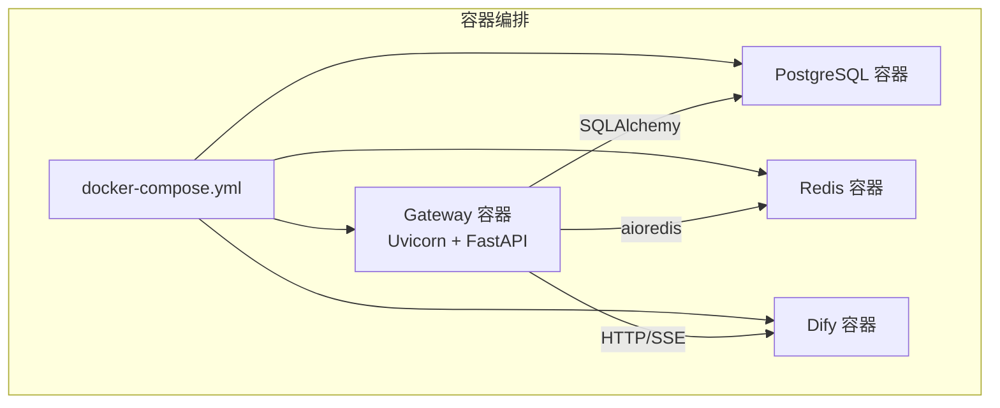
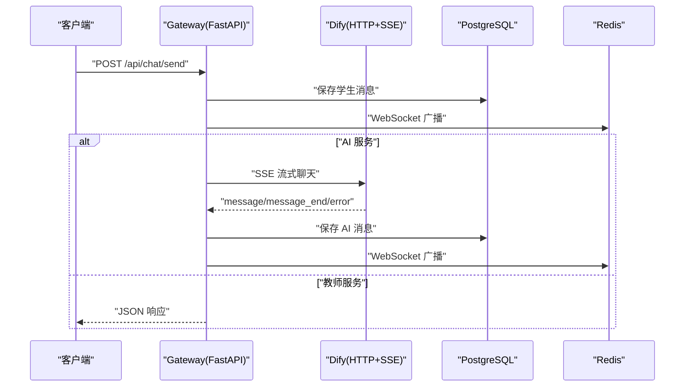
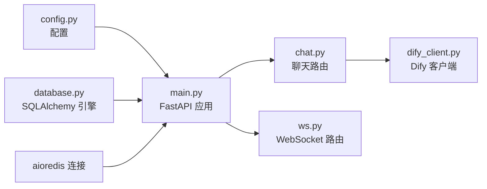

# 日志分析与监控

<cite>
**本文引用的文件**
- [README.md](file://README.md)
- [docker-compose.yml](file://deploy/docker-compose.yml)
- [Dockerfile](file://services/gateway/Dockerfile)
- [main.py](file://services/gateway/app/main.py)
- [config.py](file://services/gateway/app/config.py)
- [database.py](file://services/gateway/app/database.py)
- [chat.py](file://services/gateway/app/routers/chat.py)
- [ws.py](file://services/gateway/app/routers/ws.py)
- [dify_client.py](file://services/gateway/app/services/dify_client.py)
- [alembic.ini](file://services/gateway/alembic.ini)
- [env.py](file://services/gateway/alembic/env.py)
- [migrate_kb.py](file://scripts/migrate_kb.py)
</cite>

## 目录
1. [简介](#简介)
2. [项目结构](#项目结构)
3. [核心组件](#核心组件)
4. [架构总览](#架构总览)
5. [详细组件分析](#详细组件分析)
6. [依赖分析](#依赖分析)
7. [性能考虑](#性能考虑)
8. [故障排查指南](#故障排查指南)
9. [结论](#结论)
10. [附录](#附录)

## 简介
本指南面向医小管 v2 的运维与开发团队，聚焦于日志分析与监控实践。内容覆盖后端服务日志、数据库日志、Redis 日志、AI 服务（Dify）日志的级别与格式建议；给出关键日志位置与格式说明（请求日志、错误日志、性能日志等）；提供日志聚合、过滤与搜索技巧；并介绍监控指标采集与告警配置思路，涵盖系统资源、应用性能与业务指标。

## 项目结构
- 后端网关服务采用 FastAPI + SQLAlchemy 异步 ORM，容器化部署并通过 docker-compose 编排。
- AI 服务为自托管 Dify，通过 HTTP(SSE) 与后端交互。
- 数据库使用 PostgreSQL，缓存使用 Redis。
- 日志方面，后端服务默认使用 Python 标准 logging；数据库与迁移工具使用 Alembic/SQLAlchemy 日志配置；知识库迁移脚本使用独立的 logging 配置。

图表来源
- [docker-compose.yml:1-22](file://deploy/docker-compose.yml#L1-L22)
- [Dockerfile:1-14](file://services/gateway/Dockerfile#L1-L14)

章节来源
- [README.md:1-18](file://README.md#L1-L18)
- [docker-compose.yml:1-22](file://deploy/docker-compose.yml#L1-L22)
- [Dockerfile:1-14](file://services/gateway/Dockerfile#L1-L14)

## 核心组件
- 网关服务（FastAPI）：负责健康检查、路由分发、与 Dify 的流式交互、WebSocket 会话管理、数据库与 Redis 依赖注入。
- 数据库层（SQLAlchemy 异步）：统一的异步引擎与会话管理，echo 关闭以降低日志噪声。
- Redis 客户端（aioredis）：在应用生命周期中初始化与释放连接。
- Dify 客户端（httpx + SSE）：封装 Dify Chatflow 的流式调用，包含错误处理与非 JSON SSE 数据警告。
- 迁移脚本（migrate_kb.py）：独立的 Python 脚本，使用 logging 输出迁移进度与结果。

章节来源
- [main.py:1-78](file://services/gateway/app/main.py#L1-L78)
- [config.py:1-31](file://services/gateway/app/config.py#L1-L31)
- [database.py:1-15](file://services/gateway/app/database.py#L1-L15)
- [dify_client.py:1-105](file://services/gateway/app/services/dify_client.py#L1-L105)
- [migrate_kb.py:1-201](file://scripts/migrate_kb.py#L1-L201)

## 架构总览
下图展示日志与监控相关的关键路径：请求进入网关，经认证与路由，调用 Dify 流式接口，同时写入数据库与 Redis，并通过 WebSocket 广播消息。

图表来源
- [chat.py:22-103](file://services/gateway/app/routers/chat.py#L22-L103)
- [dify_client.py:22-69](file://services/gateway/app/services/dify_client.py#L22-L69)
- [main.py:30-68](file://services/gateway/app/main.py#L30-L68)

## 详细组件分析

### 后端服务日志（FastAPI/Uvicorn）
- 默认日志源
  - 应用入口与健康检查：使用标准 logging 输出错误与健康检查结果。
  - 聊天路由：在 Dify 流式调用异常时记录错误日志。
  - WebSocket 路由：捕获异常并记录错误日志。
- 建议日志级别
  - 生产环境：INFO 或更高，避免冗余调试信息。
  - 错误场景：ERROR，确保异常堆栈与上下文信息完整。
- 建议输出格式
  - 时间戳、级别、模块名、消息体，便于日志聚合与检索。
- 关键日志位置
  - 网关容器标准输出/错误输出（由 Uvicorn 写入）。
  - docker-compose 中映射的宿主机日志目录（如需持久化）。

章节来源
- [main.py:30-68](file://services/gateway/app/main.py#L30-L68)
- [chat.py:17-191](file://services/gateway/app/routers/chat.py#L17-L191)
- [ws.py:1-119](file://services/gateway/app/routers/ws.py#L1-L119)
- [Dockerfile:11-14](file://services/gateway/Dockerfile#L11-L14)

### 数据库日志（PostgreSQL/SQLAlchemy）
- 默认日志源
  - SQLAlchemy 引擎日志在 Alembic 配置中被抑制（WARNING 级别）。
  - 网关侧 engine.echo 关闭，避免 SQL 语句噪声。
- 建议日志级别
  - 开发：可临时开启 echo 观察 SQL；生产关闭。
  - 生产：保持 WARNING 或更高，必要时针对慢查询单独记录。
- 建议输出格式
  - 包含模块名、SQL 语句、参数、耗时、异常信息。
- 关键日志位置
  - 容器标准输出（PostgreSQL）。
  - Alembic 日志配置文件。

章节来源
- [alembic.ini:115-149](file://services/gateway/alembic.ini#L115-L149)
- [database.py:6](file://services/gateway/app/database.py#L6)
- [env.py:1](file://services/gateway/alembic/env.py#L1)

### Redis 日志（aioredis）
- 默认日志源
  - Redis 客户端在应用生命周期中初始化与关闭，未显式配置日志级别。
- 建议日志级别
  - 生产：INFO，关注连接、命令执行与异常。
- 建议输出格式
  - 时间戳、级别、模块、命令、目标地址、耗时、错误。
- 关键日志位置
  - 容器标准输出（Redis）。
  - 应用侧日志（连接/断开、Ping/Pong 健康检查）。

章节来源
- [main.py:16-22](file://services/gateway/app/main.py#L16-L22)
- [config.py:7-8](file://services/gateway/app/config.py#L7-L8)

### AI 服务日志（Dify）
- 默认日志源
  - Dify 服务自身日志由其容器输出。
  - 网关侧 DifyClient 对非 JSON SSE 数据发出警告。
- 建议日志级别
  - 网关：INFO 记录关键事件（开始/结束、错误），ERROR 记录异常。
  - Dify：根据其官方日志级别进行调整。
- 建议输出格式
  - 包含时间戳、级别、模块、事件类型、对话 ID、耗时、错误码。
- 关键日志位置
  - Dify 容器标准输出。
  - 网关侧 DifyClient 警告与错误日志。

章节来源
- [dify_client.py:68](file://services/gateway/app/services/dify_client.py#L68)
- [chat.py:150-153](file://services/gateway/app/routers/chat.py#L150-L153)

### 知识库迁移脚本日志（migrate_kb.py）
- 默认日志源
  - 使用 logging.basicConfig 设置格式与级别（示例为 INFO）。
  - 输出迁移进度、成功/失败统计与断点续传信息。
- 建议日志级别
  - INFO：进度与统计；WARNING：连接/写入失败；ERROR：异常与失败项。
- 建议输出格式
  - 时间戳、级别、模块、任务、文档标题、状态、错误详情。
- 关键日志位置
  - 控制台输出（脚本运行时）。

章节来源
- [migrate_kb.py:32-33](file://scripts/migrate_kb.py#L32-L33)
- [migrate_kb.py:107-109](file://scripts/migrate_kb.py#L107-L109)
- [migrate_kb.py:145-146](file://scripts/migrate_kb.py#L145-L146)
- [migrate_kb.py:176-182](file://scripts/migrate_kb.py#L176-L182)
- [migrate_kb.py:195-196](file://scripts/migrate_kb.py#L195-L196)

### 请求日志、错误日志、性能日志
- 请求日志
  - 网关服务：由 Uvicorn 默认提供访问日志；可按需调整格式与级别。
  - 建议字段：时间戳、远程地址、方法、路径、状态码、响应时长、用户代理。
- 错误日志
  - 网关：健康检查、Dify 调用、WebSocket 异常均记录错误。
  - 数据库：SQL 异常、连接失败。
  - Redis：连接异常、命令失败。
  - Dify：HTTP 错误、SSE 解析异常。
- 性能日志
  - 建议在关键路径（Dify 流式响应、数据库写入、WebSocket 广播）埋点，记录耗时与吞吐。

章节来源
- [main.py:30-68](file://services/gateway/app/main.py#L30-L68)
- [chat.py:105-191](file://services/gateway/app/routers/chat.py#L105-L191)
- [ws.py:117](file://services/gateway/app/routers/ws.py#L117)
- [dify_client.py:67-68](file://services/gateway/app/services/dify_client.py#L67-L68)

## 依赖分析
- 组件耦合
  - 网关服务依赖数据库、Redis、Dify；Dify 与数据库之间无直接日志耦合。
  - 迁移脚本独立运行，依赖 Dify Dataset API 与数据库。
- 外部依赖
  - PostgreSQL、Redis、Dify 均通过 docker-compose 编排，日志集中采集。

图表来源
- [config.py:1-31](file://services/gateway/app/config.py#L1-L31)
- [database.py:1-15](file://services/gateway/app/database.py#L1-L15)
- [main.py:1-28](file://services/gateway/app/main.py#L1-L28)
- [chat.py:1-191](file://services/gateway/app/routers/chat.py#L1-L191)
- [ws.py:1-119](file://services/gateway/app/routers/ws.py#L1-L119)
- [dify_client.py:1-105](file://services/gateway/app/services/dify_client.py#L1-L105)

## 性能考虑
- 日志量控制
  - 生产环境关闭 SQLAlchemy echo，限制 Alembic/SQLAlchemy 日志级别。
  - 适度降低网关访问日志频率或采样率，避免 I/O 抖动。
- I/O 优化
  - 将日志输出到 stdout/stderr，交由容器平台或外部日志系统处理。
  - 对高频事件（如 SSE token）采用批量或节流策略。
- 监控指标
  - 建议采集：请求 QPS/延迟、错误率、Dify 响应时间、数据库连接池使用率、Redis 命令耗时、WebSocket 房间数量与连接数。

## 故障排查指南
- 健康检查失败
  - 检查 PostgreSQL/Redis/Dify 的连通性与鉴权配置。
  - 查看网关健康检查返回中的具体错误描述。
- Dify 流式异常
  - 关注网关侧错误日志与 DifyClient 的非 JSON SSE 警告。
  - 核查 Dify API Key、Dataset Key、超时设置。
- WebSocket 异常
  - 检查 JWT 令牌有效性与房间加入/离开流程。
  - 关注 WS 错误日志与断开原因码。
- 数据库/Redis 异常
  - 查看对应容器日志；核对连接字符串与网络可达性。
- 迁移脚本失败
  - 查看断点续传 CSV 与脚本日志，定位 YAML 解析、空正文、DB 写入失败等问题。

章节来源
- [main.py:30-68](file://services/gateway/app/main.py#L30-L68)
- [chat.py:150-153](file://services/gateway/app/routers/chat.py#L150-L153)
- [ws.py:117](file://services/gateway/app/routers/ws.py#L117)
- [migrate_kb.py:145-146](file://scripts/migrate_kb.py#L145-L146)
- [migrate_kb.py:176-182](file://scripts/migrate_kb.py#L176-L182)

## 结论
本指南提供了医小管 v2 在日志与监控方面的系统化实践建议：明确各组件日志级别与输出格式、识别关键日志位置、掌握日志聚合与检索技巧，并结合系统资源、应用性能与业务指标构建监控与告警体系。建议在生产环境中统一日志格式与级别，配合外部日志平台与监控系统，持续优化可观测性。

## 附录

### 日志聚合、过滤与搜索技巧
- 聚合
  - 使用容器平台日志驱动或集中式日志系统（如 ELK/EFK、Loki/Grafana）收集 stdout/stderr。
- 过滤
  - 按服务名（gateway、postgres、redis、dify）、级别（ERROR/WARNING/INFO）、模块名（chat.py、ws.py、dify_client.py）过滤。
- 搜索
  - 关键词：异常堆栈、错误码、对话 ID、房间号、用户 ID。
  - 时间范围：结合 UTC/本地时区与时区偏移。

### 监控指标采集与告警配置（建议）
- 系统资源
  - CPU、内存、磁盘 I/O、网络带宽。
- 应用性能
  - 请求 QPS、P95/P99 延迟、错误率、Dify 响应时间、数据库连接池使用率、Redis 命令耗时。
- 业务指标
  - 活跃会话数、消息发送量、AI 回答命中率（基于来源引用）、教师转接率。