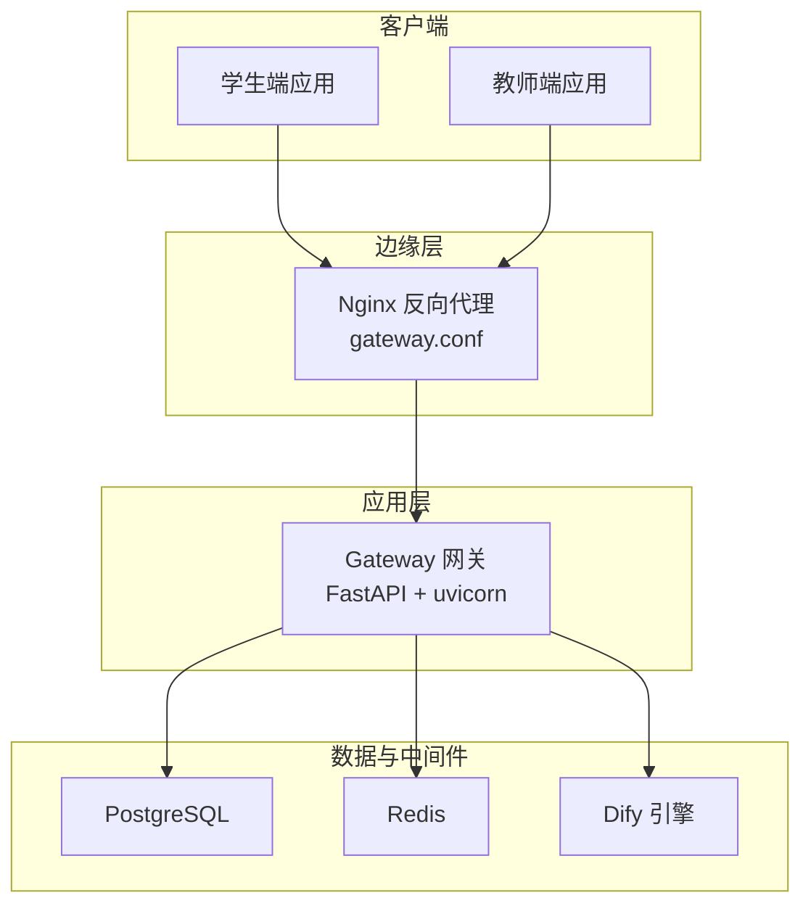
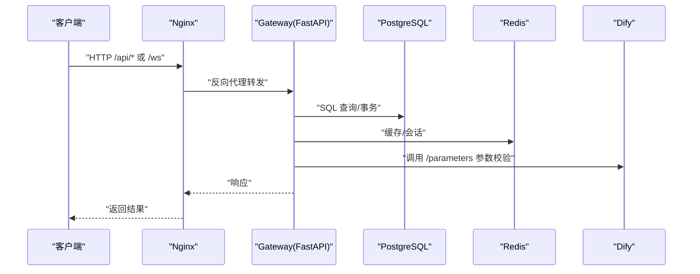
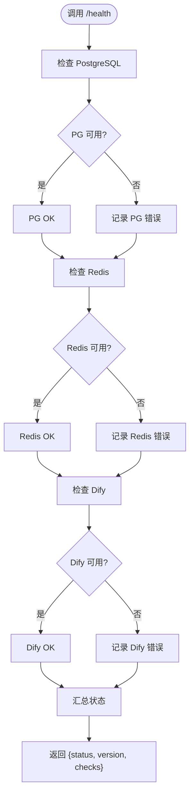
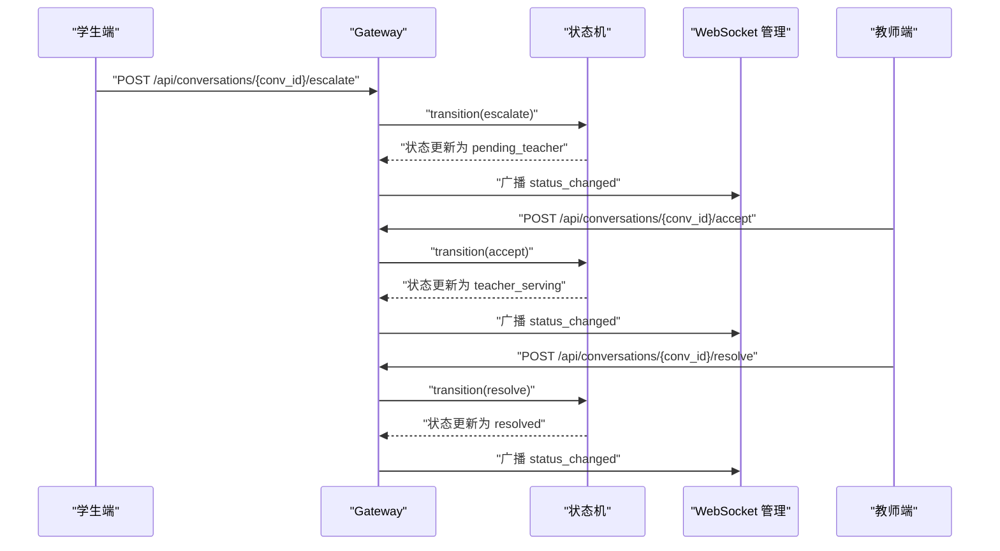
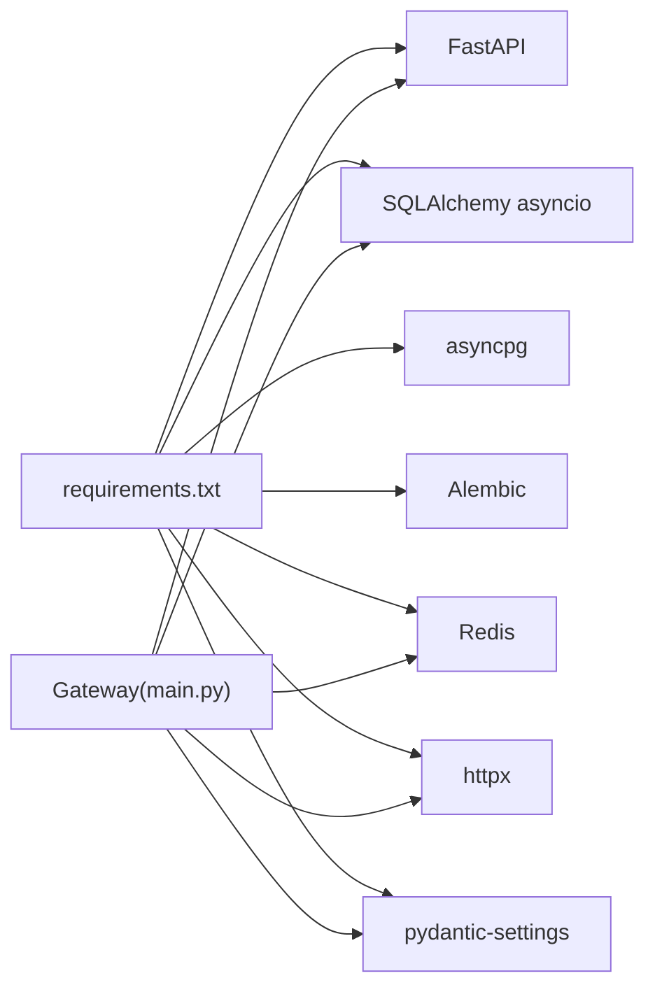

# 生产环境问题排查

<cite>
**本文引用的文件**
- [README.md](file://README.md)
- [docker-compose.yml](file://deploy/docker-compose.yml)
- [gateway.conf](file://deploy/nginx/gateway.conf)
- [main.py](file://services/gateway/app/main.py)
- [config.py](file://services/gateway/app/config.py)
- [requirements.txt](file://services/gateway/requirements.txt)
- [Dockerfile](file://services/gateway/Dockerfile)
- [actions.py](file://services/gateway/app/routers/actions.py)
- [s2-smoke-test.sh](file://scripts/s2-smoke-test.sh)
- [dev-plan-v2.md](file://docs/design/dev-plan-v2.md)
</cite>

## 目录
1. [简介](#简介)
2. [项目结构](#项目结构)
3. [核心组件](#核心组件)
4. [架构总览](#架构总览)
5. [详细组件分析](#详细组件分析)
6. [依赖关系分析](#依赖关系分析)
7. [性能考量](#性能考量)
8. [故障排查指南](#故障排查指南)
9. [结论](#结论)
10. [附录](#附录)

## 简介
本指南面向生产环境的医小管 v2 系统，提供标准化的问题分类、优先级处理与应急响应流程，覆盖服务不可用、性能下降、数据不一致等紧急场景。文档结合当前代码库中的健康检查、依赖服务、配置与部署脚本，给出可落地的排查步骤、检查清单、监控与恢复策略，并明确与运维团队协作的问题报告与处理流程。

## 项目结构
- 后端网关服务采用 FastAPI + 异步数据库与 Redis，通过 Docker Compose 编排，对外提供 /api/* REST 与 /ws WebSocket 服务。
- Nginx 作为反向代理，承载 /api 与 /ws 请求转发至网关容器。
- 学生端与教师端为前端应用，通过网关进行认证、会话与消息流转。
- 系统依赖 PostgreSQL 与 Redis，AI 引擎通过 Dify 提供意图识别与对话能力。

图表来源
- [docker-compose.yml:1-22](file://deploy/docker-compose.yml#L1-L22)
- [gateway.conf:1-36](file://deploy/nginx/gateway.conf#L1-L36)
- [main.py:1-78](file://services/gateway/app/main.py#L1-L78)
- [config.py:1-31](file://services/gateway/app/config.py#L1-L31)

章节来源
- [README.md:1-18](file://README.md#L1-L18)
- [docker-compose.yml:1-22](file://deploy/docker-compose.yml#L1-L22)
- [gateway.conf:1-36](file://deploy/nginx/gateway.conf#L1-L36)

## 核心组件
- 网关服务（FastAPI）
  - 提供 /health 健康检查，包含 PostgreSQL、Redis、Dify 依赖连通性检测。
  - 挂载认证、会话、动作（升级/接单/解决/关闭）、WebSocket 与聊天路由。
- 配置管理（pydantic-settings）
  - 通过 .env 加载数据库、Redis、JWT、Dify 等关键配置。
- 依赖与运行
  - 使用 uvicorn 启动，Dockerfile 暴露 8000 端口，compose 将 8100:8000 映射。
- 前端应用
  - 学生端与教师端通过网关完成登录、会话与消息交互；存在独立的冒烟测试脚本。

章节来源
- [main.py:1-78](file://services/gateway/app/main.py#L1-L78)
- [config.py:1-31](file://services/gateway/app/config.py#L1-L31)
- [requirements.txt:1-29](file://services/gateway/requirements.txt#L1-L29)
- [Dockerfile:1-14](file://services/gateway/Dockerfile#L1-L14)
- [s2-smoke-test.sh:1-130](file://scripts/s2-smoke-test.sh#L1-L130)

## 架构总览
下图展示生产环境典型流量路径：客户端经 Nginx 反向代理访问网关，网关连接数据库、Redis 与 Dify，实现认证、会话管理与消息分发。

图表来源
- [gateway.conf:1-36](file://deploy/nginx/gateway.conf#L1-L36)
- [main.py:30-68](file://services/gateway/app/main.py#L30-L68)
- [config.py:15-20](file://services/gateway/app/config.py#L15-L20)

## 详细组件分析

### 网关健康检查与依赖验证
- 健康检查接口 /health 同时验证数据库、Redis 与 Dify 的可用性，并返回整体状态与各子项检查结果。
- 该接口是生产环境健康巡检与自动化探活的关键入口。

图表来源
- [main.py:30-68](file://services/gateway/app/main.py#L30-L68)

章节来源
- [main.py:30-68](file://services/gateway/app/main.py#L30-L68)

### 会话状态机与教师介入流程
- 学生端通过 /api/conversations/{conv_id}/escalate 触发“呼叫教师”，随后教师端可执行 /api/conversations/{conv_id}/accept 与 /api/conversations/{conv_id}/resolve。
- 系统通过状态机保证状态转换合法，并通过 WebSocket 广播状态变化，确保实时通知。

图表来源
- [actions.py:68-134](file://services/gateway/app/routers/actions.py#L68-L134)

章节来源
- [actions.py:1-154](file://services/gateway/app/routers/actions.py#L1-L154)

### 配置与部署要点
- 网关通过环境变量注入数据库、Redis、Dify 与 JWT 等配置，建议在生产环境以 .env 文件与密钥管理服务配合使用。
- Dockerfile 暴露 8000 端口，docker-compose 将宿主 8100 映射到容器 8000，避免与 v1 端口冲突。
- Nginx 配置支持 /api 与 /ws 路由转发，WebSocket 需要升级头与较长读超时。

章节来源
- [config.py:1-31](file://services/gateway/app/config.py#L1-L31)
- [Dockerfile:1-14](file://services/gateway/Dockerfile#L1-L14)
- [docker-compose.yml:1-22](file://deploy/docker-compose.yml#L1-L22)
- [gateway.conf:1-36](file://deploy/nginx/gateway.conf#L1-L36)

## 依赖关系分析
- 运行时依赖：FastAPI、SQLAlchemy asyncio、asyncpg、Alembic、Redis、httpx、pydantic-settings 等。
- 网关服务对数据库、Redis 与 Dify 的耦合度较高，任一依赖异常都会影响服务可用性。
- 前端冒烟测试脚本覆盖登录、会话创建、消息收发与状态变更，可用于快速回归验证。

图表来源
- [requirements.txt:1-29](file://services/gateway/requirements.txt#L1-L29)
- [main.py:1-14](file://services/gateway/app/main.py#L1-L14)

章节来源
- [requirements.txt:1-29](file://services/gateway/requirements.txt#L1-L29)
- [main.py:1-14](file://services/gateway/app/main.py#L1-L14)

## 性能考量
- 数据库与 Redis 的异步驱动与连接池配置直接影响吞吐与延迟，建议在生产环境启用连接池与慢查询日志。
- Dify 调用存在超时限制，需关注其可用性与响应时间，必要时引入熔断与降级策略。
- WebSocket 长连接与广播需评估并发与内存占用，建议设置合理的读超时与心跳机制。

## 故障排查指南

### 1. 问题分类与优先级
- P0（最高）：服务完全不可用（/health 非 ok/degraded）
- P1（高）：部分功能不可用（认证/会话/消息/教师介入异常）
- P2（中）：性能显著下降（响应时间长、并发受限）
- P3（低）：数据不一致或边界行为异常（状态机非法转换、消息丢失）

章节来源
- [main.py:30-68](file://services/gateway/app/main.py#L30-L68)

### 2. 应急响应流程
- 立即执行健康检查与依赖验证，定位故障根因。
- 根据影响面分级，启动相应预案（回滚、隔离、扩容或降级）。
- 与运维团队协作，发布问题报告并同步处置进展。

章节来源
- [main.py:30-68](file://services/gateway/app/main.py#L30-L68)

### 3. 标准化排查步骤与检查清单

- 服务状态检查
  - 访问 /health，确认 postgres、redis、dify 三项检查是否均为 ok。
  - 若非 ok，记录具体错误信息并进入对应子项排查。
- 依赖服务验证
  - PostgreSQL：确认连接字符串、网络连通、实例可用性与权限。
  - Redis：确认连接字符串、网络连通、键空间与持久化策略。
  - Dify：确认 API 地址与密钥、网络可达性、返回状态码。
- 配置文件审查
  - 检查 .env 是否存在且包含数据库、Redis、JWT、Dify 等关键字段。
  - 确认环境变量在容器内生效（compose 的 environment 配置）。
- 网络与代理
  - 检查 Nginx upstream 与 location 配置，确认 /api 与 /ws 路由转发正常。
  - 验证 WebSocket 升级头与读超时设置。
- 功能回归验证
  - 使用冒烟测试脚本执行端到端流程，覆盖登录、会话创建、消息收发与状态变更。
- 日志与监控
  - 检查网关容器日志与 Nginx 访问/错误日志。
  - 结合外部监控（如指标采集与告警）定位异常时段与阈值触发点。

章节来源
- [main.py:30-68](file://services/gateway/app/main.py#L30-L68)
- [config.py:1-31](file://services/gateway/app/config.py#L1-L31)
- [docker-compose.yml:1-22](file://deploy/docker-compose.yml#L1-L22)
- [gateway.conf:1-36](file://deploy/nginx/gateway.conf#L1-L36)
- [s2-smoke-test.sh:1-130](file://scripts/s2-smoke-test.sh#L1-L130)

### 4. 监控告警机制与故障恢复策略
- 健康检查与探活
  - 将 /health 作为 K8s readiness/liveness 探针，设置合理超时与重试。
- 关键指标
  - 网关：请求量、错误率、P95/P99 延迟、并发连接数。
  - 数据库：连接数、慢查询、锁等待、复制延迟。
  - Redis：命中率、内存使用、慢命令。
  - Dify：调用成功率、平均耗时、超时比例。
- 故障恢复
  - 自愈：探针失败自动重启容器；依赖异常时启用降级（如禁用教师介入）。
  - 人工干预：隔离故障节点、回滚版本、扩容或切换备用实例。
- 与运维协作
  - 问题报告模板：时间、现象、影响范围、已尝试措施、日志与截图、期望协助。
  - 处理流程：接收 → 分级 → 诊断 → 实施 → 验证 → 复盘 → 文档更新。

章节来源
- [main.py:30-68](file://services/gateway/app/main.py#L30-L68)
- [dev-plan-v2.md:1-285](file://docs/design/dev-plan-v2.md#L1-L285)

### 5. 灾难恢复与数据备份策略
- 数据库备份
  - 定期全量备份 + 增量/归档日志，异地存储，周期性恢复演练。
- 缓存与会话
  - Redis 持久化策略（RDB/AOF）与快照备份，确保会话与临时数据可恢复。
- 配置与密钥
  - .env 与密钥集中管理，变更走审批与灰度发布。
- 应急预案
  - 多副本部署与跨可用区容灾，自动故障转移与手动接管流程。

章节来源
- [config.py:1-31](file://services/gateway/app/config.py#L1-L31)
- [docker-compose.yml:1-22](file://deploy/docker-compose.yml#L1-L22)

### 6. 与运维团队协作的问题报告与处理流程
- 问题报告
  - 时间、地点、现象描述、影响范围、重现步骤、日志与截图、关联变更。
- 处理流程
  - 接收 → 分级 → 诊断 → 实施 → 验证 → 复盘 → 文档更新。
- 常见协作点
  - 网络与代理：Nginx 配置、防火墙与端口策略。
  - 容器与编排：镜像版本、环境变量、资源限制与重启策略。
  - 数据与中间件：数据库与 Redis 的可观测性与容量规划。

章节来源
- [dev-plan-v2.md:1-285](file://docs/design/dev-plan-v2.md#L1-L285)

## 结论
本指南基于当前代码库的健康检查、依赖关系与部署配置，提供了生产环境问题的分类、优先级与标准排查流程。建议在生产环境中完善监控告警、灾备与回滚策略，并建立与运维团队的标准化协作机制，以缩短故障恢复时间并提升系统稳定性。

## 附录

### A. 快速检查清单
- /health 是否返回 ok
- 数据库、Redis、Dify 是否连通
- .env 配置是否完整
- Nginx /api 与 /ws 路由是否正确
- 冒烟测试脚本是否通过
- 日志与监控指标是否异常

章节来源
- [main.py:30-68](file://services/gateway/app/main.py#L30-L68)
- [s2-smoke-test.sh:1-130](file://scripts/s2-smoke-test.sh#L1-L130)