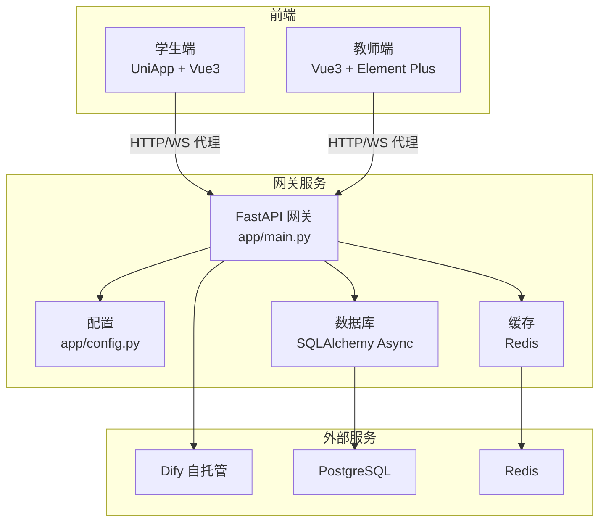
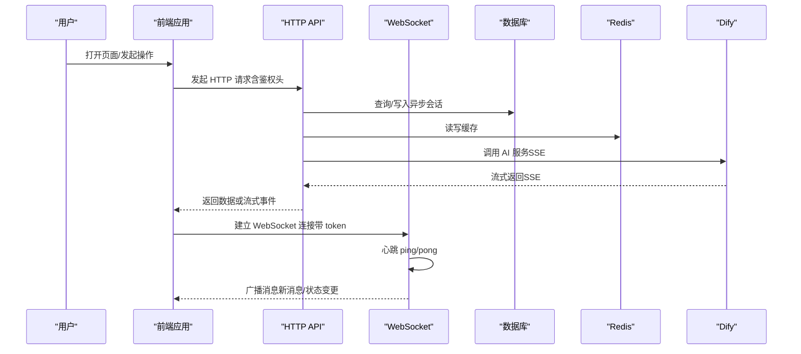
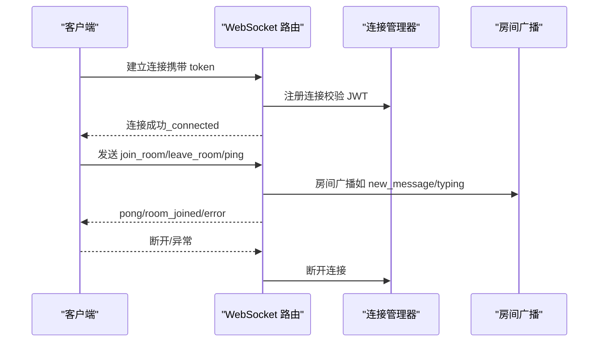
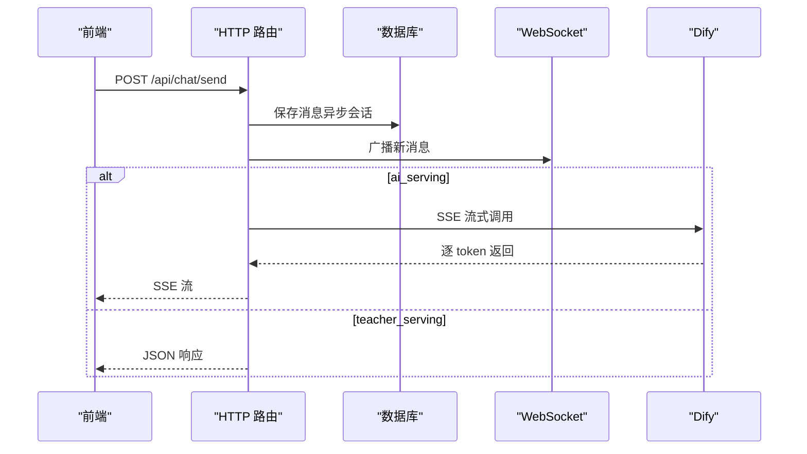
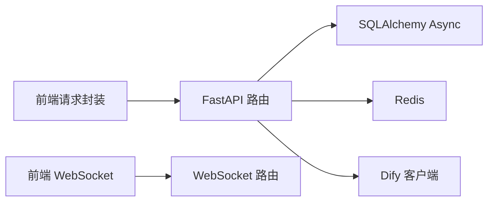

# 调试工具与技术

<cite>
**本文引用的文件**
- [README.md](file://README.md)
- [vite.config.ts（学生端）](file://apps/student-app/vite.config.ts)
- [vite.config.ts（教师端）](file://apps/teacher-app/vite.config.ts)
- [Dockerfile（网关）](file://services/gateway/Dockerfile)
- [requirements.txt（网关）](file://services/gateway/requirements.txt)
- [main.py（网关入口）](file://services/gateway/app/main.py)
- [config.py（网关配置）](file://services/gateway/app/config.py)
- [database.py（网关数据库）](file://services/gateway/app/database.py)
- [request.ts（学生端请求封装）](file://apps/student-app/src/utils/request.ts)
- [request.ts（教师端请求封装）](file://apps/teacher-app/src/utils/request.ts)
- [websocket.ts（学生端 WebSocket）](file://apps/student-app/src/utils/websocket.ts)
- [websocket.ts（教师端 WebSocket）](file://apps/teacher-app/src/utils/websocket.ts)
- [ws.py（网关 WebSocket 路由）](file://services/gateway/app/routers/ws.py)
- [chat.py（网关聊天路由）](file://services/gateway/app/routers/chat.py)
- [chat.py（网关聊天模型）](file://services/gateway/app/schemas/chat.py)
- [docker-compose.yml（部署）](file://deploy/docker-compose.yml)
</cite>

## 目录
1. [简介](#简介)
2. [项目结构](#项目结构)
3. [核心组件](#核心组件)
4. [架构总览](#架构总览)
5. [详细组件分析](#详细组件分析)
6. [依赖关系分析](#依赖关系分析)
7. [性能考虑](#性能考虑)
8. [故障排查指南](#故障排查指南)
9. [结论](#结论)
10. [附录](#附录)

## 简介
本手册面向“医小管 v2”项目的前端与后端开发者，提供从浏览器与移动端调试工具到后端日志、断点与性能分析的全链路调试指南。内容覆盖：
- 浏览器开发者工具与移动端调试技巧
- 网络抓包与代理调试
- 数据库查询与索引优化
- 后端 FastAPI 调试模式与日志
- WebSocket 消息调试与心跳机制
- API 请求调试与参数校验
- 日志调试、断点调试与性能分析
- 常见场景的解决方案与最佳实践

## 项目结构
项目采用多应用与微服务分层设计：
- 前端：学生端与教师端分别基于 UniApp/Vue3，使用 Vite 开发服务器与反向代理
- 后端：FastAPI 网关服务，负责认证、会话管理、聊天路由与 WebSocket 管理
- 部署：Docker Compose 编排，暴露网关端口并注入环境变量

图表来源
- [main.py（网关入口）:1-78](file://services/gateway/app/main.py#L1-L78)
- [config.py（网关配置）:1-31](file://services/gateway/app/config.py#L1-L31)
- [database.py（网关数据库）:1-15](file://services/gateway/app/database.py#L1-L15)
- [docker-compose.yml（部署）:1-22](file://deploy/docker-compose.yml#L1-L22)

章节来源
- [README.md:1-18](file://README.md#L1-L18)
- [vite.config.ts（学生端）:1-22](file://apps/student-app/vite.config.ts#L1-L22)
- [vite.config.ts（教师端）:1-22](file://apps/teacher-app/vite.config.ts#L1-L22)
- [Dockerfile（网关）:1-14](file://services/gateway/Dockerfile#L1-L14)
- [requirements.txt（网关）:1-29](file://services/gateway/requirements.txt#L1-L29)
- [docker-compose.yml（部署）:1-22](file://deploy/docker-compose.yml#L1-L22)

## 核心组件
- 前端请求封装：统一处理鉴权头、错误码映射、超时与 401 登出逻辑
- WebSocket 管理器：单连接、房间订阅、重连指数退避、心跳保活、消息队列
- 网关路由：HTTP 路由（认证、会话、聊天）、WebSocket 路由、健康检查
- 数据库与缓存：异步引擎、连接池、Redis 连接生命周期
- 部署编排：端口映射、环境变量注入、容器网络

章节来源
- [request.ts（学生端请求封装）:1-44](file://apps/student-app/src/utils/request.ts#L1-L44)
- [request.ts（教师端请求封装）:1-108](file://apps/teacher-app/src/utils/request.ts#L1-L108)
- [websocket.ts（学生端 WebSocket）:1-153](file://apps/student-app/src/utils/websocket.ts#L1-L153)
- [websocket.ts（教师端 WebSocket）:1-169](file://apps/teacher-app/src/utils/websocket.ts#L1-L169)
- [main.py（网关入口）:1-78](file://services/gateway/app/main.py#L1-L78)
- [config.py（网关配置）:1-31](file://services/gateway/app/config.py#L1-L31)
- [database.py（网关数据库）:1-15](file://services/gateway/app/database.py#L1-L15)
- [docker-compose.yml（部署）:1-22](file://deploy/docker-compose.yml#L1-L22)

## 架构总览
下图展示从前端到后端的关键交互路径与调试关注点。

图表来源
- [main.py（网关入口）:1-78](file://services/gateway/app/main.py#L1-L78)
- [chat.py（网关聊天路由）:1-191](file://services/gateway/app/routers/chat.py#L1-L191)
- [ws.py（网关 WebSocket 路由）:1-119](file://services/gateway/app/routers/ws.py#L1-L119)
- [websocket.ts（学生端 WebSocket）:1-153](file://apps/student-app/src/utils/websocket.ts#L1-L153)
- [websocket.ts（教师端 WebSocket）:1-169](file://apps/teacher-app/src/utils/websocket.ts#L1-L169)

## 详细组件分析

### 前端调试要点（浏览器与移动端）
- 使用浏览器开发者工具的 Network 面板观察：
  - 请求头是否包含正确的 Authorization（Bearer）
  - 响应状态码与错误信息映射（401 登录页跳转、422 参数错误提示）
  - 超时与失败重试策略
- 移动端调试：
  - 使用 Vite 代理将 /api 与 /ws 指向后端地址，避免跨域问题
  - 在真机上开启调试模式，查看控制台日志与网络面板
- 关键调试位置：
  - 请求封装与错误处理
  - WebSocket 连接、心跳、房间加入/离开、消息派发

章节来源
- [vite.config.ts（学生端）:1-22](file://apps/student-app/vite.config.ts#L1-L22)
- [vite.config.ts（教师端）:1-22](file://apps/teacher-app/vite.config.ts#L1-L22)
- [request.ts（学生端请求封装）:1-44](file://apps/student-app/src/utils/request.ts#L1-L44)
- [request.ts（教师端请求封装）:1-108](file://apps/teacher-app/src/utils/request.ts#L1-L108)
- [websocket.ts（学生端 WebSocket）:1-153](file://apps/student-app/src/utils/websocket.ts#L1-L153)
- [websocket.ts（教师端 WebSocket）:1-169](file://apps/teacher-app/src/utils/websocket.ts#L1-L169)

### 后端调试要点（FastAPI）
- 启动与端口：
  - 网关容器暴露 8000 端口，宿主机映射为 8100，避免与旧版服务冲突
- 健康检查：
  - GET /health 检查数据库、Redis、Dify 服务可用性
- 路由调试：
  - HTTP 路由：认证、会话、聊天（含 SSE 流）
  - WebSocket 路由：连接认证、房间管理、心跳与错误处理
- 配置与环境：
  - 通过 .env 或环境变量注入数据库、Redis、JWT、Dify 等参数

章节来源
- [Dockerfile（网关）:1-14](file://services/gateway/Dockerfile#L1-L14)
- [docker-compose.yml（部署）:1-22](file://deploy/docker-compose.yml#L1-L22)
- [main.py（网关入口）:1-78](file://services/gateway/app/main.py#L1-L78)
- [config.py（网关配置）:1-31](file://services/gateway/app/config.py#L1-L31)
- [chat.py（网关聊天路由）:1-191](file://services/gateway/app/routers/chat.py#L1-L191)
- [ws.py（网关 WebSocket 路由）:1-119](file://services/gateway/app/routers/ws.py#L1-L119)

### WebSocket 调试流程

图表来源
- [ws.py（网关 WebSocket 路由）:1-119](file://services/gateway/app/routers/ws.py#L1-L119)
- [websocket.ts（学生端 WebSocket）:1-153](file://apps/student-app/src/utils/websocket.ts#L1-L153)
- [websocket.ts（教师端 WebSocket）:1-169](file://apps/teacher-app/src/utils/websocket.ts#L1-L169)

### API 请求调试流程

图表来源
- [chat.py（网关聊天路由）:1-191](file://services/gateway/app/routers/chat.py#L1-L191)
- [chat.py（网关聊天模型）:1-18](file://services/gateway/app/schemas/chat.py#L1-L18)
- [request.ts（学生端请求封装）:1-44](file://apps/student-app/src/utils/request.ts#L1-L44)
- [request.ts（教师端请求封装）:1-108](file://apps/teacher-app/src/utils/request.ts#L1-L108)

### 数据库与缓存调试
- 数据库：
  - 异步引擎与连接池配置，建议开启慢查询日志与执行计划分析
  - 对高频查询建立合适索引（如会话表、消息表的外键与时间字段）
- 缓存：
  - Redis 用于会话状态与临时数据，注意键空间清理与过期策略
  - 通过 ping/pong 检测连接可用性

章节来源
- [database.py（网关数据库）:1-15](file://services/gateway/app/database.py#L1-L15)
- [config.py（网关配置）:1-31](file://services/gateway/app/config.py#L1-L31)
- [main.py（网关入口）:1-78](file://services/gateway/app/main.py#L1-L78)

## 依赖关系分析
- 前端依赖：
  - Vite 反向代理将 /api 与 /ws 转发至后端
  - 请求封装统一封装鉴权与错误处理
  - WebSocket 管理器负责连接、心跳与房间管理
- 后端依赖：
  - FastAPI + SQLAlchemy Async + Redis
  - Dify HTTPX 客户端进行流式调用
  - Alembic 进行数据库迁移

图表来源
- [requirements.txt（网关）:1-29](file://services/gateway/requirements.txt#L1-L29)
- [request.ts（学生端请求封装）:1-44](file://apps/student-app/src/utils/request.ts#L1-L44)
- [request.ts（教师端请求封装）:1-108](file://apps/teacher-app/src/utils/request.ts#L1-L108)
- [websocket.ts（学生端 WebSocket）:1-153](file://apps/student-app/src/utils/websocket.ts#L1-L153)
- [websocket.ts（教师端 WebSocket）:1-169](file://apps/teacher-app/src/utils/websocket.ts#L1-L169)
- [chat.py（网关聊天路由）:1-191](file://services/gateway/app/routers/chat.py#L1-L191)
- [ws.py（网关 WebSocket 路由）:1-119](file://services/gateway/app/routers/ws.py#L1-L119)

章节来源
- [requirements.txt（网关）:1-29](file://services/gateway/requirements.txt#L1-L29)

## 性能考虑
- 前端
  - 合理设置请求超时与重试策略，避免阻塞 UI
  - WebSocket 心跳间隔与指数退避，防止频繁重连
- 后端
  - 异步数据库与连接池，避免阻塞事件循环
  - SSE 流式输出需关闭缓存与启用无缓冲头
  - 对热点接口增加缓存与限流
- 数据库
  - 分析慢查询，对高并发字段建立索引
  - 控制单次事务大小，避免长事务锁竞争

## 故障排查指南
- 健康检查失败
  - 使用 GET /health 检查数据库、Redis、Dify 可用性
  - 若报错，检查环境变量与容器网络映射
- WebSocket 连接异常
  - 查看连接日志与心跳是否正常
  - 确认 token 校验与房间加入流程
- API 请求失败
  - 检查鉴权头是否正确传递
  - 关注 401（登出跳转）、422（参数错误）与通用错误映射
- SSE 流异常
  - 确认服务端返回的事件类型与头部设置
  - 检查 Dify 服务可用性与超时设置

章节来源
- [main.py（网关入口）:1-78](file://services/gateway/app/main.py#L1-L78)
- [ws.py（网关 WebSocket 路由）:1-119](file://services/gateway/app/routers/ws.py#L1-L119)
- [chat.py（网关聊天路由）:1-191](file://services/gateway/app/routers/chat.py#L1-L191)
- [request.ts（学生端请求封装）:1-44](file://apps/student-app/src/utils/request.ts#L1-L44)
- [request.ts（教师端请求封装）:1-108](file://apps/teacher-app/src/utils/request.ts#L1-L108)
- [websocket.ts（学生端 WebSocket）:1-153](file://apps/student-app/src/utils/websocket.ts#L1-L153)
- [websocket.ts（教师端 WebSocket）:1-169](file://apps/teacher-app/src/utils/websocket.ts#L1-L169)

## 结论
通过统一的前端请求与 WebSocket 管理器、清晰的 FastAPI 路由与健康检查、以及完善的部署编排，医小管 v2 在调试与运维层面具备良好的可观测性与可维护性。建议在开发与测试环境中优先启用日志与监控，在生产环境配合缓存与限流策略以保障稳定性。

## 附录
- 常用调试命令与步骤
  - 启动服务：使用 docker-compose 启动网关并映射端口
  - 健康检查：访问 /health 观察各组件状态
  - 网络抓包：使用浏览器/抓包工具观察 /api 与 /ws 的请求与响应
  - 日志定位：根据错误码与事件类型快速定位问题模块
- 最佳实践
  - 前端：集中化错误处理与 Toast 提示
  - 后端：结构化日志、明确的错误响应与必要的超时控制
  - 数据库：定期分析慢查询与索引优化