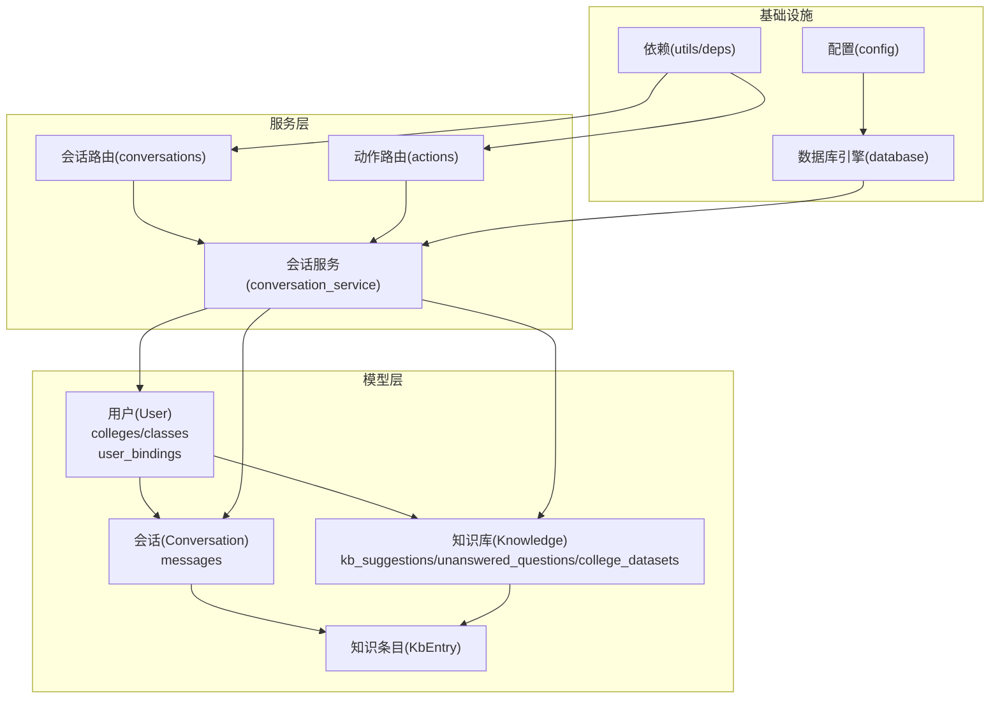
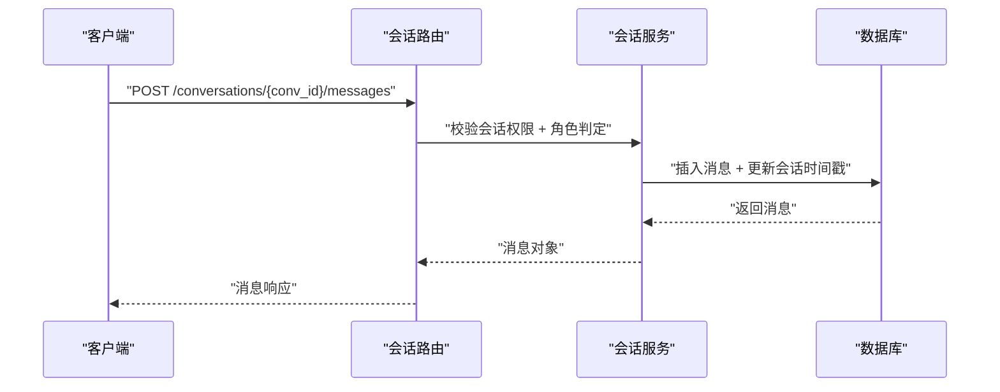
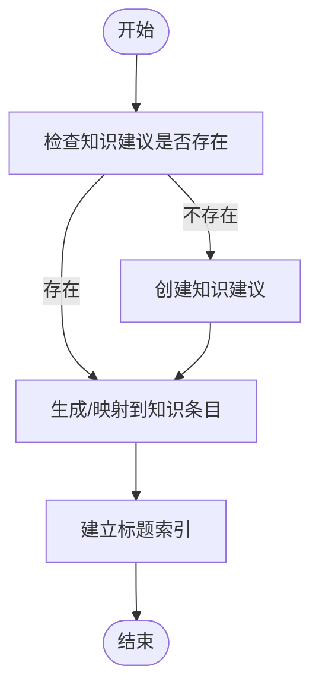
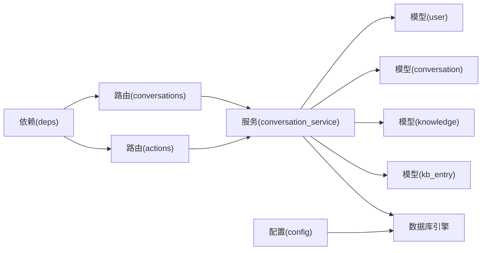

# 实体关系映射

<cite>
**本文引用的文件**
- [services/gateway/app/models/__init__.py](file://services/gateway/app/models/__init__.py)
- [services/gateway/app/models/user.py](file://services/gateway/app/models/user.py)
- [services/gateway/app/models/conversation.py](file://services/gateway/app/models/conversation.py)
- [services/gateway/app/models/knowledge.py](file://services/gateway/app/models/knowledge.py)
- [services/gateway/app/models/kb_entry.py](file://services/gateway/app/models/kb_entry.py)
- [services/gateway/app/database.py](file://services/gateway/app/database.py)
- [services/gateway/alembic/versions/e11bb6c9d4b8_v2_initial_schema.py](file://services/gateway/alembic/versions/e11bb6c9d4b8_v2_initial_schema.py)
- [services/gateway/alembic/versions/ff1f0ab0c5f8_add_kb_entries_table.py](file://services/gateway/alembic/versions/ff1f0ab0c5f8_add_kb_entries_table.py)
- [services/gateway/app/schemas/conversation.py](file://services/gateway/app/schemas/conversation.py)
- [services/gateway/app/services/conversation_service.py](file://services/gateway/app/services/conversation_service.py)
- [services/gateway/app/routers/conversations.py](file://services/gateway/app/routers/conversations.py)
- [services/gateway/app/routers/actions.py](file://services/gateway/app/routers/actions.py)
- [services/gateway/app/utils/deps.py](file://services/gateway/app/utils/deps.py)
- [services/gateway/app/config.py](file://services/gateway/app/config.py)
</cite>

## 目录
1. [引言](#引言)
2. [项目结构](#项目结构)
3. [核心组件](#核心组件)
4. [架构总览](#架构总览)
5. [详细组件分析](#详细组件分析)
6. [依赖分析](#依赖分析)
7. [性能考虑](#性能考虑)
8. [故障排查指南](#故障排查指南)
9. [结论](#结论)
10. [附录](#附录)

## 引言
本文件面向“医小管 v2”的数据库实体关系映射，系统性梳理用户、会话、消息、知识库建议、未回答问题、学院/班级、绑定信息及知识条目等模型之间的关联关系，明确一对一、一对多、多对多的设计与实现；解释外键约束与引用完整性保障；给出实体关系图与 ER 图；总结关系查询实现方式与性能优化策略，并结合 SQLAlchemy 的关系定义与查询示例进行说明。

## 项目结构
围绕数据库模型与迁移脚本，核心文件分布如下：
- 模型定义：位于 app/models 下，包含用户、会话、消息、知识库相关表
- 迁移脚本：位于 alembic/versions，定义初始与扩展的表结构
- 查询与服务：位于 app/services，封装关系查询与业务逻辑
- 接口路由：位于 app/routers，暴露 REST API
- 工具与配置：位于 app/utils 与 app/config，提供依赖注入与配置



图表来源
- [services/gateway/app/models/user.py:45-76](file://services/gateway/app/models/user.py#L45-L76)
- [services/gateway/app/models/conversation.py:26-63](file://services/gateway/app/models/conversation.py#L26-L63)
- [services/gateway/app/models/knowledge.py:22-62](file://services/gateway/app/models/knowledge.py#L22-L62)
- [services/gateway/app/models/kb_entry.py:9-31](file://services/gateway/app/models/kb_entry.py#L9-L31)
- [services/gateway/app/services/conversation_service.py:1-179](file://services/gateway/app/services/conversation_service.py#L1-L179)
- [services/gateway/app/routers/conversations.py:1-129](file://services/gateway/app/routers/conversations.py#L1-L129)
- [services/gateway/app/routers/actions.py:1-154](file://services/gateway/app/routers/actions.py#L1-L154)
- [services/gateway/app/database.py:1-15](file://services/gateway/app/database.py#L1-L15)
- [services/gateway/app/config.py:1-31](file://services/gateway/app/config.py#L1-L31)
- [services/gateway/app/utils/deps.py:1-40](file://services/gateway/app/utils/deps.py#L1-L40)

章节来源
- [services/gateway/app/models/__init__.py:1-5](file://services/gateway/app/models/__init__.py#L1-L5)
- [services/gateway/app/database.py:1-15](file://services/gateway/app/database.py#L1-L15)
- [services/gateway/app/config.py:1-31](file://services/gateway/app/config.py#L1-L31)

## 核心组件
- 用户(User)：记录身份、角色、所属学院/班级、绑定平台等
- 绑定(UserBinding)：记录第三方平台唯一标识与用户映射
- 学院(College)/班级(Class)：组织架构，支持按学院派发会话
- 会话(Conversation)：一次问答流程，关联学生与教师，记录状态与时间戳
- 消息(Message)：会话内的具体消息，区分发送者类型与来源用户
- 知识库建议(KbSuggestion)：教师提交的知识建议，含来源、状态、审核人
- 未回答问题(UnansweredQuestion)：高频问题聚合，可关联到知识建议
- 学院数据集(CollegeDataset)：为学院配置 Dify 数据集
- 知识条目(KbEntry)：Dify 文档与原始来源映射，用于溯源

章节来源
- [services/gateway/app/models/user.py:23-76](file://services/gateway/app/models/user.py#L23-L76)
- [services/gateway/app/models/conversation.py:26-63](file://services/gateway/app/models/conversation.py#L26-L63)
- [services/gateway/app/models/knowledge.py:22-62](file://services/gateway/app/models/knowledge.py#L22-L62)
- [services/gateway/app/models/kb_entry.py:9-31](file://services/gateway/app/models/kb_entry.py#L9-L31)

## 架构总览
下图展示实体关系与外键约束，体现一对一、一对多与多对多关系：

```mermaid
erDiagram
COLLEGES {
int id PK
string name
timestamp created_at
}
CLASSES {
int id PK
string name
int college_id FK
int grade_year
timestamp created_at
}
USERS {
int id PK
string staff_id UK
string name
enum role
int college_id FK
int class_id FK
string password_hash
string avatar_url
bool is_active
timestamp created_at
timestamp updated_at
}
USER_BINDINGS {
int id PK
int user_id FK
enum platform
string platform_uid
timestamp bound_at
}
CONVERSATIONS {
int id PK
int student_id FK
int teacher_id FK
enum status
string dify_conversation_id
string title
timestamp created_at
timestamp updated_at
timestamp resolved_at
timestamp closed_at
}
MESSAGES {
int id PK
int conversation_id FK
enum sender_type
int sender_id FK
text content
jsonb metadata
timestamp created_at
}
KB_SUGGESTIONS {
int id PK
string title
text content
text raw_content
enum source
string source_url
int college_id FK
enum status
int submitted_by FK
int reviewed_by FK
string dify_document_id
timestamp created_at
timestamp reviewed_at
}
UNANSWERED_QUESTIONS {
int id PK
text question_text
string question_hash
int hit_count
int[] sample_conv_ids
int college_id FK
bool is_resolved
int kb_suggestion_id FK
timestamp created_at
timestamp updated_at
}
COLLEGE_DATASETS {
int id PK
int college_id FK UK
string dify_dataset_id
timestamp created_at
}
KB_ENTRIES {
int id PK
string dify_document_id UK
string dify_dataset_id
string title
string category
string[] tags
string original_source
string source_url
string material_id
string campus
string original_filename
timestamp created_at
}
COLLEGES ||--o{ CLASSES : "拥有"
USERS }o--|| CLASSES : "属于"
USERS }o--|| COLLEGES : "属于"
USERS ||--o{ USER_BINDINGS : "有"
USERS ||--o{ CONVERSATIONS : "发起/服务"
CONVERSATIONS ||--o{ MESSAGES : "包含"
KB_SUGGESTIONS ||--o{ UNANSWERED_QUESTIONS : "被引用"
COLLEGES ||--|| COLLEGE_DATASETS : "配置"
KB_SUGGESTIONS ||--o{ KB_ENTRIES : "生成/映射"
```

图表来源
- [services/gateway/alembic/versions/e11bb6c9d4b8_v2_initial_schema.py:24-140](file://services/gateway/alembic/versions/e11bb6c9d4b8_v2_initial_schema.py#L24-L140)
- [services/gateway/alembic/versions/ff1f0ab0c5f8_add_kb_entries_table.py:24-41](file://services/gateway/alembic/versions/ff1f0ab0c5f8_add_kb_entries_table.py#L24-L41)

## 详细组件分析

### 用户与组织架构
- 关系
  - 一对一：班级 → 学院
  - 多对一：用户 → 学院/班级
  - 一对多：用户 → 绑定
- 设计要点
  - 用户可选归属学院与班级，便于按学院派发会话
  - 绑定表使用复合唯一索引，确保同一平台下的唯一性
- 外键与约束
  - 用户的 class_id 与 college_id 分别引用 classes.id 与 colleges.id
- 查询示例（路径）
  - 获取用户所属学院与班级：[services/gateway/app/services/conversation_service.py:22-26](file://services/gateway/app/services/conversation_service.py#L22-L26)
  - 列举用户绑定：[services/gateway/app/models/user.py:63-76](file://services/gateway/app/models/user.py#L63-L76)

章节来源
- [services/gateway/app/models/user.py:23-76](file://services/gateway/app/models/user.py#L23-L76)
- [services/gateway/alembic/versions/e11bb6c9d4b8_v2_initial_schema.py:30-64](file://services/gateway/alembic/versions/e11bb6c9d4b8_v2_initial_schema.py#L30-L64)

### 会话与消息
- 关系
  - 一对多：会话 → 消息
  - 多对一：消息 → 会话
  - 多对一：会话 → 用户（学生/教师）
- 设计要点
  - 会话状态机驱动业务流转（AI 服务、等待教师、教师服务、已解决、已关闭）
  - 消息表包含发送者类型与来源用户 ID，便于权限校验
- 外键与约束
  - 会话 student_id/teacher_id 引用 users.id
  - 消息 conversation_id 引用 conversations.id，sender_id 引用 users.id
- 查询与权限
  - 会话列表按角色过滤并分页统计：[services/gateway/app/services/conversation_service.py:54-111](file://services/gateway/app/services/conversation_service.py#L54-L111)
  - 消息列表按时间顺序分页：[services/gateway/app/services/conversation_service.py:129-146](file://services/gateway/app/services/conversation_service.py#L129-L146)
  - 发送消息并广播：[services/gateway/app/routers/conversations.py:81-129](file://services/gateway/app/routers/conversations.py#L81-L129)



图表来源
- [services/gateway/app/routers/conversations.py:81-129](file://services/gateway/app/routers/conversations.py#L81-L129)
- [services/gateway/app/services/conversation_service.py:148-179](file://services/gateway/app/services/conversation_service.py#L148-L179)

章节来源
- [services/gateway/app/models/conversation.py:26-63](file://services/gateway/app/models/conversation.py#L26-L63)
- [services/gateway/app/schemas/conversation.py:1-50](file://services/gateway/app/schemas/conversation.py#L1-L50)
- [services/gateway/app/services/conversation_service.py:54-179](file://services/gateway/app/services/conversation_service.py#L54-L179)
- [services/gateway/app/routers/conversations.py:1-129](file://services/gateway/app/routers/conversations.py#L1-L129)

### 知识库与知识条目
- 关系
  - 多对一：知识建议 → 学院
  - 多对一：未回答问题 → 知识建议
  - 多对一：知识建议 → 提交人/审核人（用户）
  - 多对一：知识条目 → 知识建议（通过 Dify 文档映射）
  - 一对一：学院 → 数据集
- 设计要点
  - 知识条目独立存储，便于检索与溯源
  - 未回答问题可指向知识建议，形成闭环
- 外键与约束
  - kb_suggestions.reviewed_by/submitted_by 引用 users.id
  - unanswered_questions.kb_suggestion_id 引用 kb_suggestions.id
  - kb_entries.dify_document_id 唯一
- 查询示例（路径）
  - 未回答问题与知识建议关联：[services/gateway/alembic/versions/e11bb6c9d4b8_v2_initial_schema.py:125-139](file://services/gateway/alembic/versions/e11bb6c9d4b8_v2_initial_schema.py#L125-L139)
  - 知识条目唯一约束与索引：[services/gateway/alembic/versions/ff1f0ab0c5f8_add_kb_entries_table.py:24-41](file://services/gateway/alembic/versions/ff1f0ab0c5f8_add_kb_entries_table.py#L24-L41)



图表来源
- [services/gateway/app/models/kb_entry.py:9-31](file://services/gateway/app/models/kb_entry.py#L9-L31)
- [services/gateway/app/models/knowledge.py:22-62](file://services/gateway/app/models/knowledge.py#L22-L62)
- [services/gateway/alembic/versions/ff1f0ab0c5f8_add_kb_entries_table.py:24-41](file://services/gateway/alembic/versions/ff1f0ab0c5f8_add_kb_entries_table.py#L24-L41)

章节来源
- [services/gateway/app/models/knowledge.py:22-62](file://services/gateway/app/models/knowledge.py#L22-L62)
- [services/gateway/app/models/kb_entry.py:9-31](file://services/gateway/app/models/kb_entry.py#L9-L31)
- [services/gateway/alembic/versions/e11bb6c9d4b8_v2_initial_schema.py:82-139](file://services/gateway/alembic/versions/e11bb6c9d4b8_v2_initial_schema.py#L82-L139)
- [services/gateway/alembic/versions/ff1f0ab0c5f8_add_kb_entries_table.py:24-41](file://services/gateway/alembic/versions/ff1f0ab0c5f8_add_kb_entries_table.py#L24-L41)

### 外键约束与引用完整性
- 外键关系
  - users.college_id → colleges.id
  - users.class_id → classes.id
  - conversations.student_id/teacher_id → users.id
  - messages.conversation_id → conversations.id
  - messages.sender_id → users.id
  - kb_suggestions.submitted_by/reviewed_by → users.id
  - kb_suggestions.college_id → colleges.id
  - unanswered_questions.kb_suggestion_id → kb_suggestions.id
  - unanswered_questions.college_id → colleges.id
  - college_datasets.college_id → colleges.id（唯一）
  - kb_entries.dify_document_id 唯一
- 约束与索引
  - users.staff_id 唯一
  - user_bindings.platform + platform_uid 复合唯一
  - conversations 上的索引：student、status
  - messages 上的索引：conversation、(conversation, created_at)
  - kb_entries.title 建立索引
- 级联与删除规则
  - 当前迁移脚本未显式声明 ON DELETE CASCADE，遵循默认行为（如受限删除）。若需级联删除，应在迁移中显式声明。

章节来源
- [services/gateway/alembic/versions/e11bb6c9d4b8_v2_initial_schema.py:36-124](file://services/gateway/alembic/versions/e11bb6c9d4b8_v2_initial_schema.py#L36-L124)
- [services/gateway/alembic/versions/ff1f0ab0c5f8_add_kb_entries_table.py:37-41](file://services/gateway/alembic/versions/ff1f0ab0c5f8_add_kb_entries_table.py#L37-L41)

### 关系查询实现与性能优化
- 查询实现
  - 会话列表：按角色拼接条件、连接用户表以判断学院、分页与计数分离：[services/gateway/app/services/conversation_service.py:54-111](file://services/gateway/app/services/conversation_service.py#L54-L111)
  - 消息列表：按时间升序分页，先统计总数再取数据：[services/gateway/app/services/conversation_service.py:129-146](file://services/gateway/app/services/conversation_service.py#L129-L146)
  - 权限校验：管理员直通，学生仅限本人，教师按状态与学院过滤：[services/gateway/app/services/conversation_service.py:7-27](file://services/gateway/app/services/conversation_service.py#L7-L27)
- 性能优化
  - 为 conversations.student 与 conversations.status 建立索引，加速会话查询：[services/gateway/alembic/versions/e11bb6c9d4b8_v2_initial_schema.py:80-81](file://services/gateway/alembic/versions/e11bb6c9d4b8_v2_initial_schema.py#L80-L81)
  - 为 messages.conversation_id 与 (conversation_id, created_at) 建立索引，提升消息分页与排序效率：[services/gateway/alembic/versions/e11bb6c9d4b8_v2_initial_schema.py:123-124](file://services/gateway/alembic/versions/e11bb6c9d4b8_v2_initial_schema.py#L123-L124)
  - 为 kb_entries.title 建立索引，提升检索性能：[services/gateway/alembic/versions/ff1f0ab0c5f8_add_kb_entries_table.py](file://services/gateway/alembic/versions/ff1f0ab0c5f8_add_kb_entries_table.py#L40)
  - 使用子查询计数避免重复扫描：[services/gateway/app/services/conversation_service.py:102-103](file://services/gateway/app/services/conversation_service.py#L102-L103)

章节来源
- [services/gateway/app/services/conversation_service.py:54-146](file://services/gateway/app/services/conversation_service.py#L54-L146)
- [services/gateway/alembic/versions/e11bb6c9d4b8_v2_initial_schema.py:80-124](file://services/gateway/alembic/versions/e11bb6c9d4b8_v2_initial_schema.py#L80-L124)
- [services/gateway/alembic/versions/ff1f0ab0c5f8_add_kb_entries_table.py](file://services/gateway/alembic/versions/ff1f0ab0c5f8_add_kb_entries_table.py#L40)

### 级联操作、删除规则与数据一致性
- 现状
  - 迁移脚本未显式声明 ON DELETE CASCADE，删除行为遵循数据库默认策略（通常为受限删除）
- 建议
  - 若需要在删除用户时级联删除其会话与消息，可在迁移中为外键添加 ON DELETE CASCADE
  - 对于重要业务表（如会话、消息），建议在应用层增加软删除字段与审计日志，避免物理删除导致不可恢复
- 一致性维护
  - 通过权限校验函数统一入口，防止越权访问：[services/gateway/app/services/conversation_service.py:7-27](file://services/gateway/app/services/conversation_service.py#L7-L27)
  - 使用事务包裹插入与更新（如创建会话同时插入系统消息），保证原子性：[services/gateway/app/services/conversation_service.py:29-51](file://services/gateway/app/services/conversation_service.py#L29-L51)

章节来源
- [services/gateway/app/services/conversation_service.py:7-51](file://services/gateway/app/services/conversation_service.py#L7-L51)
- [services/gateway/alembic/versions/e11bb6c9d4b8_v2_initial_schema.py:36-124](file://services/gateway/alembic/versions/e11bb6c9d4b8_v2_initial_schema.py#L36-L124)

### SQLAlchemy 关系定义与查询示例
- 关系定义
  - 使用 relationship/back_populates 声明双向关系，如用户与绑定、会话与消息、学院与班级等
  - 使用 mapped_column 与 ForeignKey 定义外键列
- 查询示例（路径）
  - 读取当前用户：[services/gateway/app/utils/deps.py:14-35](file://services/gateway/app/utils/deps.py#L14-L35)
  - 创建会话并插入系统消息：[services/gateway/app/services/conversation_service.py:29-51](file://services/gateway/app/services/conversation_service.py#L29-L51)
  - 会话列表与消息列表：[services/gateway/app/services/conversation_service.py:54-146](file://services/gateway/app/services/conversation_service.py#L54-L146)
  - 发送消息并广播：[services/gateway/app/routers/conversations.py:81-129](file://services/gateway/app/routers/conversations.py#L81-L129)

章节来源
- [services/gateway/app/models/user.py:45-76](file://services/gateway/app/models/user.py#L45-L76)
- [services/gateway/app/models/conversation.py:26-63](file://services/gateway/app/models/conversation.py#L26-L63)
- [services/gateway/app/utils/deps.py:14-35](file://services/gateway/app/utils/deps.py#L14-L35)
- [services/gateway/app/services/conversation_service.py:29-146](file://services/gateway/app/services/conversation_service.py#L29-L146)
- [services/gateway/app/routers/conversations.py:81-129](file://services/gateway/app/routers/conversations.py#L81-L129)

## 依赖分析
- 组件耦合
  - 路由层依赖服务层；服务层依赖模型层；模型层依赖数据库基类与引擎
  - 权限校验集中在服务层，路由层仅做参数与鉴权
- 外部依赖
  - 数据库：PostgreSQL（异步驱动）
  - 缓存：Redis（用于通知广播）
  - 认证：JWT 解码
- 依赖可视化



图表来源
- [services/gateway/app/routers/conversations.py:1-129](file://services/gateway/app/routers/conversations.py#L1-L129)
- [services/gateway/app/routers/actions.py:1-154](file://services/gateway/app/routers/actions.py#L1-L154)
- [services/gateway/app/services/conversation_service.py:1-179](file://services/gateway/app/services/conversation_service.py#L1-L179)
- [services/gateway/app/models/user.py:1-76](file://services/gateway/app/models/user.py#L1-L76)
- [services/gateway/app/models/conversation.py:1-63](file://services/gateway/app/models/conversation.py#L1-L63)
- [services/gateway/app/models/knowledge.py:1-62](file://services/gateway/app/models/knowledge.py#L1-L62)
- [services/gateway/app/models/kb_entry.py:1-31](file://services/gateway/app/models/kb_entry.py#L1-L31)
- [services/gateway/app/database.py:1-15](file://services/gateway/app/database.py#L1-L15)
- [services/gateway/app/utils/deps.py:1-40](file://services/gateway/app/utils/deps.py#L1-L40)
- [services/gateway/app/config.py:1-31](file://services/gateway/app/config.py#L1-L31)

章节来源
- [services/gateway/app/routers/conversations.py:1-129](file://services/gateway/app/routers/conversations.py#L1-L129)
- [services/gateway/app/routers/actions.py:1-154](file://services/gateway/app/routers/actions.py#L1-L154)
- [services/gateway/app/services/conversation_service.py:1-179](file://services/gateway/app/services/conversation_service.py#L1-L179)
- [services/gateway/app/database.py:1-15](file://services/gateway/app/database.py#L1-L15)
- [services/gateway/app/utils/deps.py:1-40](file://services/gateway/app/utils/deps.py#L1-L40)
- [services/gateway/app/config.py:1-31](file://services/gateway/app/config.py#L1-L31)

## 性能考虑
- 索引策略
  - 会话：按 student 与 status 建立索引，满足列表查询与状态筛选
  - 消息：按 conversation_id 与 (conversation_id, created_at) 建立索引，支撑分页与排序
  - 知识条目：按 title 建立索引，提升检索效率
- 查询模式
  - 分页与计数分离，使用子查询计数减少扫描成本
  - 将角色过滤与连接操作前置，缩小结果集
- 连接池与并发
  - 异步引擎与连接池配置，避免阻塞与资源浪费
- 建议
  - 对高频查询字段补充复合索引
  - 对大文本字段（content、raw_content）谨慎建索引，必要时采用倒排或搜索引擎

## 故障排查指南
- 常见错误与定位
  - 会话不存在：路由层返回 404，检查 conv_id 与权限校验
  - 无权操作：检查 can_access_conversation 的角色与状态逻辑
  - 发送消息失败：确认会话状态与发送者类型是否匹配
- 日志与监控
  - 在服务层记录关键 SQL 与异常堆栈
  - 使用数据库慢查询日志定位索引缺失或扫描过大
- 数据一致性
  - 事务包裹关键写操作（创建会话、更新状态）
  - 对外键约束违规进行捕获与反馈

章节来源
- [services/gateway/app/routers/conversations.py:53-78](file://services/gateway/app/routers/conversations.py#L53-L78)
- [services/gateway/app/services/conversation_service.py:7-27](file://services/gateway/app/services/conversation_service.py#L7-L27)

## 结论
本文件系统化梳理了医小管 v2 的实体关系映射，明确了用户、会话、消息、知识库建议、未回答问题、学院/班级、绑定信息与知识条目的关联设计与实现细节。通过外键约束与索引策略保障引用完整性与查询性能，并结合 SQLAlchemy 的关系定义与服务层封装，提供了清晰的查询实现与优化建议。后续可在迁移脚本中明确级联删除策略，并在应用层引入软删除与审计机制，进一步提升系统的可维护性与数据安全性。

## 附录
- 配置项参考
  - 数据库连接、JWT 密钥、Dify API 地址等
- 路由与服务对应关系
  - 会话路由与动作路由分别调用会话服务与状态机服务

章节来源
- [services/gateway/app/config.py:1-31](file://services/gateway/app/config.py#L1-L31)
- [services/gateway/app/routers/conversations.py:1-129](file://services/gateway/app/routers/conversations.py#L1-L129)
- [services/gateway/app/routers/actions.py:1-154](file://services/gateway/app/routers/actions.py#L1-L154)
- [services/gateway/app/services/conversation_service.py:1-179](file://services/gateway/app/services/conversation_service.py#L1-L179)