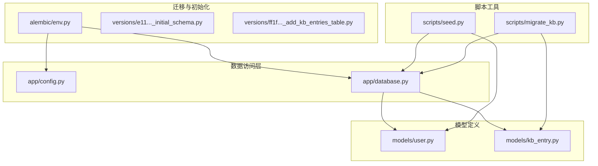
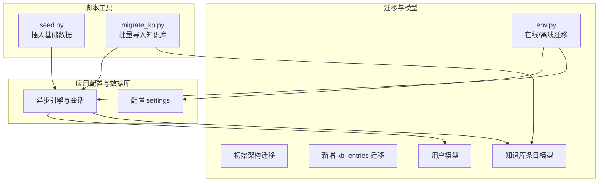
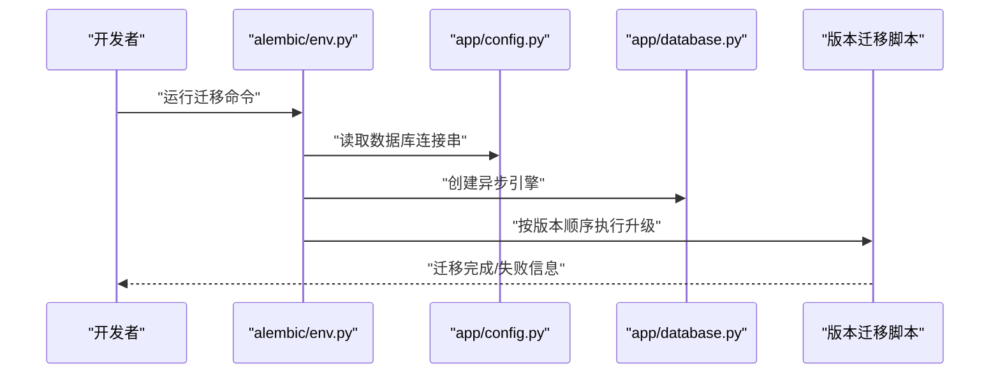
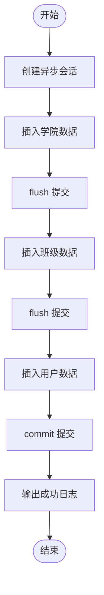
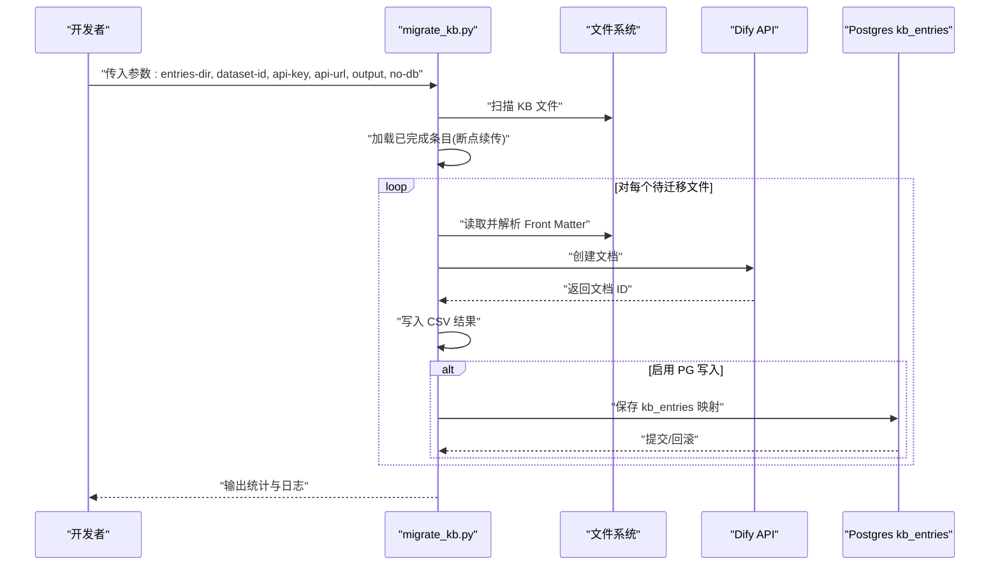
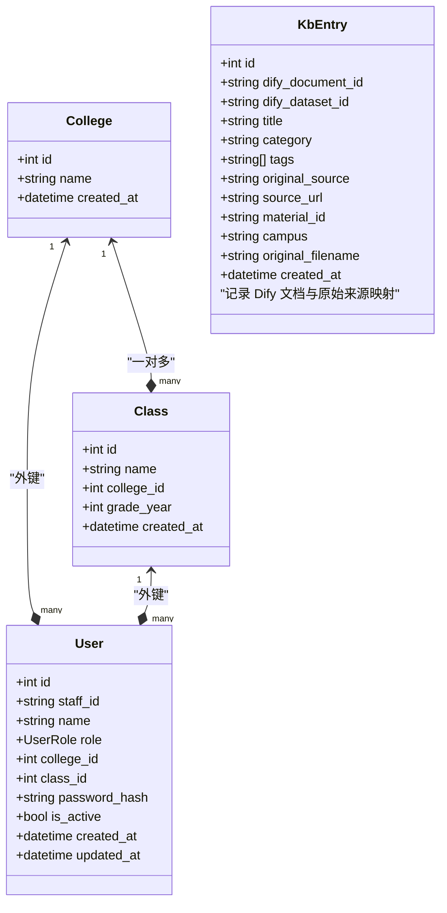
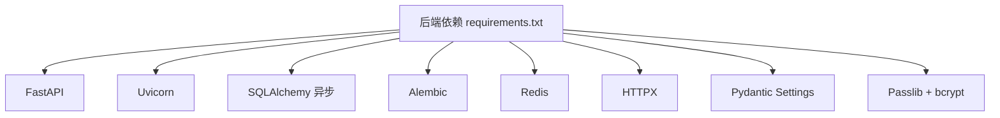

# 数据初始化与种子

<cite>
**本文引用的文件**
- [scripts/seed.py](file://scripts/seed.py)
- [scripts/migrate_kb.py](file://scripts/migrate_kb.py)
- [services/gateway/app/config.py](file://services/gateway/app/config.py)
- [services/gateway/app/database.py](file://services/gateway/app/database.py)
- [services/gateway/app/models/user.py](file://services/gateway/app/models/user.py)
- [services/gateway/app/models/kb_entry.py](file://services/gateway/app/models/kb_entry.py)
- [services/gateway/alembic/env.py](file://services/gateway/alembic/env.py)
- [services/gateway/alembic/versions/e11bb6c9d4b8_v2_initial_schema.py](file://services/gateway/alembic/versions/e11bb6c9d4b8_v2_initial_schema.py)
- [services/gateway/alembic/versions/ff1f0ab0c5f8_add_kb_entries_table.py](file://services/gateway/alembic/versions/ff1f0ab0c5f8_add_kb_entries_table.py)
- [services/gateway/requirements.txt](file://services/gateway/requirements.txt)
- [README.md](file://README.md)
</cite>

## 目录
1. [简介](#简介)
2. [项目结构](#项目结构)
3. [核心组件](#核心组件)
4. [架构总览](#架构总览)
5. [详细组件分析](#详细组件分析)
6. [依赖分析](#依赖分析)
7. [性能考虑](#性能考虑)
8. [故障排查指南](#故障排查指南)
9. [结论](#结论)
10. [附录](#附录)

## 简介
本文件面向“医小管 v2”的开发者与运维人员，系统化说明数据库初始化与种子数据的生成策略，深入解析以下脚本与模块的作用与使用方式：
- 数据库迁移与初始化：基于 Alembic 的版本化迁移，确保数据库结构演进可控。
- 种子数据脚本 seed.py：快速注入测试所需的学院、班级与用户数据，便于本地开发与联调。
- 知识库迁移脚本 migrate_kb.py：将历史知识库条目批量导入 Dify，并同步记录到 Postgres 的 kb_entries 表中，支持断点续传与错误恢复。

通过本文档，您将掌握：
- 完整的数据初始化步骤与配置项
- 如何在测试与开发环境中创建基础数据
- 如何批量导入知识库并处理冲突
- 数据清理与重置操作
- 数据验证与完整性检查方法
- 常见初始化问题的解决方案与调试技巧

## 项目结构
围绕数据初始化与种子相关的关键文件组织如下：
- 迁移与初始化：Alembic 版本化迁移脚本与运行环境
- 数据访问层：数据库引擎与会话管理
- 模型定义：用户、学院、班级、知识库条目等
- 脚本工具：种子数据与知识库迁移
- 后端依赖：FastAPI、SQLAlchemy、Alembic、Redis、HTTP 客户端等

**图表来源**
- [services/gateway/alembic/env.py:1-97](file://services/gateway/alembic/env.py#L1-L97)
- [services/gateway/alembic/versions/e11bb6c9d4b8_v2_initial_schema.py:1-160](file://services/gateway/alembic/versions/e11bb6c9d4b8_v2_initial_schema.py#L1-L160)
- [services/gateway/alembic/versions/ff1f0ab0c5f8_add_kb_entries_table.py:1-50](file://services/gateway/alembic/versions/ff1f0ab0c5f8_add_kb_entries_table.py#L1-L50)
- [services/gateway/app/config.py:1-31](file://services/gateway/app/config.py#L1-L31)
- [services/gateway/app/database.py:1-15](file://services/gateway/app/database.py#L1-L15)
- [services/gateway/app/models/user.py:1-76](file://services/gateway/app/models/user.py#L1-L76)
- [services/gateway/app/models/kb_entry.py:1-31](file://services/gateway/app/models/kb_entry.py#L1-L31)
- [scripts/seed.py:1-56](file://scripts/seed.py#L1-L56)
- [scripts/migrate_kb.py:1-201](file://scripts/migrate_kb.py#L1-L201)

**章节来源**
- [README.md:1-18](file://README.md#L1-L18)
- [services/gateway/requirements.txt:1-29](file://services/gateway/requirements.txt#L1-L29)

## 核心组件
- 数据库配置与连接
  - 配置项：数据库连接串、Redis、JWT、Dify API 地址与密钥等
  - 引擎与会话：异步引擎与会话工厂，支持连接池与自动事务提交控制
- 模型层
  - 用户、角色、绑定平台类型；学院、班级；知识库条目映射
- 迁移层
  - 初始架构与 kb_entries 表的版本化迁移
- 脚本工具
  - seed.py：批量插入基础数据
  - migrate_kb.py：批量导入知识库并记录映射

**章节来源**
- [services/gateway/app/config.py:1-31](file://services/gateway/app/config.py#L1-L31)
- [services/gateway/app/database.py:1-15](file://services/gateway/app/database.py#L1-L15)
- [services/gateway/app/models/user.py:1-76](file://services/gateway/app/models/user.py#L1-L76)
- [services/gateway/app/models/kb_entry.py:1-31](file://services/gateway/app/models/kb_entry.py#L1-L31)
- [services/gateway/alembic/versions/e11bb6c9d4b8_v2_initial_schema.py:1-160](file://services/gateway/alembic/versions/e11bb6c9d4b8_v2_initial_schema.py#L1-L160)
- [services/gateway/alembic/versions/ff1f0ab0c5f8_add_kb_entries_table.py:1-50](file://services/gateway/alembic/versions/ff1f0ab0c5f8_add_kb_entries_table.py#L1-L50)
- [scripts/seed.py:1-56](file://scripts/seed.py#L1-L56)
- [scripts/migrate_kb.py:1-201](file://scripts/migrate_kb.py#L1-L201)

## 架构总览
下图展示了数据初始化与种子的整体架构：迁移脚本负责数据库结构演进，应用配置与数据库模块提供连接与模型支持，种子与迁移脚本分别负责静态数据与动态内容的注入。

**图表来源**
- [services/gateway/alembic/env.py:1-97](file://services/gateway/alembic/env.py#L1-L97)
- [services/gateway/alembic/versions/e11bb6c9d4b8_v2_initial_schema.py:1-160](file://services/gateway/alembic/versions/e11bb6c9d4b8_v2_initial_schema.py#L1-L160)
- [services/gateway/alembic/versions/ff1f0ab0c5f8_add_kb_entries_table.py:1-50](file://services/gateway/alembic/versions/ff1f0ab0c5f8_add_kb_entries_table.py#L1-L50)
- [services/gateway/app/config.py:1-31](file://services/gateway/app/config.py#L1-L31)
- [services/gateway/app/database.py:1-15](file://services/gateway/app/database.py#L1-L15)
- [services/gateway/app/models/user.py:1-76](file://services/gateway/app/models/user.py#L1-L76)
- [services/gateway/app/models/kb_entry.py:1-31](file://services/gateway/app/models/kb_entry.py#L1-L31)
- [scripts/seed.py:1-56](file://scripts/seed.py#L1-L56)
- [scripts/migrate_kb.py:1-201](file://scripts/migrate_kb.py#L1-L201)

## 详细组件分析

### 组件一：数据库初始化与迁移（Alembic）
- 在线迁移：通过异步引擎连接数据库，按版本顺序执行升级/降级
- 离线迁移：直接使用配置中的数据库 URL 生成迁移脚本
- 目标元数据：基于 Base.metadata，包含用户、班级、学院、对话、消息、未回答问题、知识库建议、用户绑定、kb_entries 等表

**图表来源**
- [services/gateway/alembic/env.py:67-96](file://services/gateway/alembic/env.py#L67-L96)
- [services/gateway/app/config.py:6-8](file://services/gateway/app/config.py#L6-L8)
- [services/gateway/app/database.py:6-7](file://services/gateway/app/database.py#L6-L7)
- [services/gateway/alembic/versions/e11bb6c9d4b8_v2_initial_schema.py:21-140](file://services/gateway/alembic/versions/e11bb6c9d4b8_v2_initial_schema.py#L21-L140)
- [services/gateway/alembic/versions/ff1f0ab0c5f8_add_kb_entries_table.py:21-41](file://services/gateway/alembic/versions/ff1f0ab0c5f8_add_kb_entries_table.py#L21-L41)

**章节来源**
- [services/gateway/alembic/env.py:1-97](file://services/gateway/alembic/env.py#L1-L97)
- [services/gateway/alembic/versions/e11bb6c9d4b8_v2_initial_schema.py:1-160](file://services/gateway/alembic/versions/e11bb6c9d4b8_v2_initial_schema.py#L1-L160)
- [services/gateway/alembic/versions/ff1f0ab0c5f8_add_kb_entries_table.py:1-50](file://services/gateway/alembic/versions/ff1f0ab0c5f8_add_kb_entries_table.py#L1-L50)

### 组件二：种子数据脚本 seed.py
- 功能概述
  - 插入测试用的学院、班级与用户数据
  - 使用异步会话批量 flush 与 commit，保证原子性
  - 密码采用哈希存储，避免明文泄露
- 关键流程
  - 构造 College、Class、User 实例列表
  - 依次添加并 flush，最后统一 commit
  - 输出成功提示

**图表来源**
- [scripts/seed.py:14-52](file://scripts/seed.py#L14-L52)

**章节来源**
- [scripts/seed.py:1-56](file://scripts/seed.py#L1-L56)
- [services/gateway/app/models/user.py:23-61](file://services/gateway/app/models/user.py#L23-L61)

### 组件三：知识库迁移脚本 migrate_kb.py
- 功能概述
  - 扫描指定目录下的 Markdown 条目，解析 YAML Front Matter
  - 调用 Dify Dataset API 创建文档，记录返回的文档 ID
  - 可选写入 Postgres 的 kb_entries 表，建立 Dify 文档与原始来源的映射
  - 支持断点续传：通过 CSV 记录已成功条目，重复执行时自动跳过
- 关键流程
  - 解析参数与初始化数据库会话
  - 加载已完成条目集合，过滤已成功文件
  - 遍历待迁移文件，逐条调用 Dify API 并写入结果 CSV
  - 可选写入 kb_entries 表，异常时回滚并继续
  - 输出统计结果

**图表来源**
- [scripts/migrate_kb.py:88-196](file://scripts/migrate_kb.py#L88-L196)
- [services/gateway/app/models/kb_entry.py:9-31](file://services/gateway/app/models/kb_entry.py#L9-L31)

**章节来源**
- [scripts/migrate_kb.py:1-201](file://scripts/migrate_kb.py#L1-L201)
- [services/gateway/app/models/kb_entry.py:1-31](file://services/gateway/app/models/kb_entry.py#L1-L31)

### 组件四：数据模型与关系
- 用户与角色
  - 用户包含工号、姓名、角色、所属学院与班级、密码哈希等字段
  - 角色枚举包含 student、teacher、admin
- 学院与班级
  - 学院与班级为一对多关系，班级外键关联学院
- 知识库条目
  - 记录 Dify 文档 ID、数据集 ID、标题、分类、标签、原始来源、材料 ID、校区、原始文件名等

**图表来源**
- [services/gateway/app/models/user.py:23-76](file://services/gateway/app/models/user.py#L23-L76)
- [services/gateway/app/models/kb_entry.py:9-31](file://services/gateway/app/models/kb_entry.py#L9-L31)

**章节来源**
- [services/gateway/app/models/user.py:1-76](file://services/gateway/app/models/user.py#L1-L76)
- [services/gateway/app/models/kb_entry.py:1-31](file://services/gateway/app/models/kb_entry.py#L1-L31)

## 依赖分析
- 后端依赖
  - FastAPI、Uvicorn、SQLAlchemy 异步、Alembic、Redis、HTTPX、Pydantic Settings、Passlib、bcrypt 等
- 运行环境
  - PostgreSQL 与 Redis 作为持久化与缓存
  - Docker Compose 可用于一键启动服务

**图表来源**
- [services/gateway/requirements.txt:1-29](file://services/gateway/requirements.txt#L1-L29)

**章节来源**
- [services/gateway/requirements.txt:1-29](file://services/gateway/requirements.txt#L1-L29)
- [README.md:5-11](file://README.md#L5-L11)

## 性能考虑
- 连接池与并发
  - 异步引擎默认池大小适中，可根据并发场景调整
- 请求限流
  - 知识库迁移脚本内置请求间隔，避免对 Dify API 造成压力
- 断点续传
  - 通过 CSV 记录成功条目，重复执行时自动跳过，提升大体量导入效率
- 批量写入
  - 种子脚本使用 flush/commit 控制事务边界，减少单次提交成本

[本节为通用指导，不直接分析具体文件]

## 故障排查指南
- 数据库连接失败
  - 检查配置中的数据库 URL 是否正确，网络连通性是否正常
  - 确认 Alembic 在线/离线迁移使用的 URL 一致
- 迁移执行异常
  - 查看迁移日志，定位具体版本脚本的错误位置
  - 确保目标数据库具备相应权限与扩展
- 种子数据插入失败
  - 检查主键/唯一约束冲突（如学院/班级/用户 ID 重复）
  - 确认密码哈希生成逻辑与数据库字符集兼容
- 知识库迁移中断
  - 检查 CSV 输出路径是否存在写权限
  - 确认 Dify API 的 dataset-id、api-key、api-url 是否正确
  - 若 PG 写入失败，检查 kb_entries 表结构与索引状态
- 断点续传无效
  - 确认 CSV 中 status 字段值与文件名匹配
  - 清理或修正 CSV 后重新执行

**章节来源**
- [services/gateway/app/config.py:6-8](file://services/gateway/app/config.py#L6-L8)
- [services/gateway/alembic/env.py:67-96](file://services/gateway/alembic/env.py#L67-L96)
- [scripts/migrate_kb.py:112-196](file://scripts/migrate_kb.py#L112-L196)
- [scripts/seed.py:46-52](file://scripts/seed.py#L46-L52)

## 结论
通过 Alembic 的版本化迁移、seed.py 的种子数据注入以及 migrate_kb.py 的批量知识库导入，医小管 v2 形成了完善的数据库初始化与内容填充方案。配合断点续传、错误回滚与日志记录，能够在测试与生产环境中稳定地完成数据准备与维护工作。建议在每次重大结构变更前先执行迁移，并在导入大量知识库条目前进行充分的环境与权限校验。

[本节为总结性内容，不直接分析具体文件]

## 附录

### A. 数据初始化步骤与配置选项
- 步骤概览
  1) 准备数据库与 Redis
  2) 执行 Alembic 迁移以创建/更新表结构
  3) 运行 seed.py 注入基础数据
  4) 运行 migrate_kb.py 导入知识库条目
- 配置项参考
  - 数据库连接串、Redis URL、JWT 密钥与算法、Dify API 地址与密钥、数据集 ID 与 API Key
- 环境变量
  - 通过 .env 文件加载配置，确保与部署环境一致

**章节来源**
- [services/gateway/app/config.py:6-28](file://services/gateway/app/config.py#L6-L28)
- [services/gateway/alembic/env.py:73-74](file://services/gateway/alembic/env.py#L73-L74)
- [scripts/migrate_kb.py:88-96](file://scripts/migrate_kb.py#L88-L96)

### B. 开发与测试环境基础数据
- 开发环境
  - 使用 seed.py 快速生成学生、教师、管理员与对应学院/班级
  - 配合本地 Dify 与数据库，进行端到端联调
- 测试环境
  - 可复用相同迁移与种子脚本，确保测试数据一致性
  - 使用断点续传功能加速大规模知识库导入

**章节来源**
- [scripts/seed.py:14-52](file://scripts/seed.py#L14-L52)
- [scripts/migrate_kb.py:112-124](file://scripts/migrate_kb.py#L112-L124)

### C. 数据清理与重置
- 清理策略
  - 降级迁移：回退到初始版本，删除所有业务表
  - 手动清空：针对 kb_entries 与用户表执行 TRUNCATE/DELETE
- 重置流程
  - 先执行降级迁移，再执行升级迁移，最后重新运行 seed.py 与 migrate_kb.py

**章节来源**
- [services/gateway/alembic/versions/e11bb6c9d4b8_v2_initial_schema.py:143-160](file://services/gateway/alembic/versions/e11bb6c9d4b8_v2_initial_schema.py#L143-L160)
- [services/gateway/alembic/versions/ff1f0ab0c5f8_add_kb_entries_table.py:44-50](file://services/gateway/alembic/versions/ff1f0ab0c5f8_add_kb_entries_table.py#L44-L50)

### D. 批量导入与冲突处理
- 批量导入
  - migrate_kb.py 支持扫描目录、解析 Front Matter、调用 Dify API、写入 CSV 与 kb_entries
- 冲突处理
  - 断点续传：跳过已成功的文件
  - PG 写入异常：捕获异常并回滚，不影响后续条目
  - 建议在导入前备份 kb_entries 表，便于回滚

**章节来源**
- [scripts/migrate_kb.py:112-196](file://scripts/migrate_kb.py#L112-L196)

### E. 数据验证与完整性检查
- 结构验证
  - 确认迁移版本已应用，表与索引存在
- 数据验证
  - 校验种子数据：用户数量、角色分布、学院/班级关联
  - 校验知识库映射：kb_entries 数量与 Dify 文档 ID 唯一性
- 建议工具
  - 使用 psql 查询计数与示例行，结合日志核对 CSV 结果

**章节来源**
- [services/gateway/alembic/versions/e11bb6c9d4b8_v2_initial_schema.py:21-140](file://services/gateway/alembic/versions/e11bb6c9d4b8_v2_initial_schema.py#L21-L140)
- [services/gateway/app/models/kb_entry.py:9-31](file://services/gateway/app/models/kb_entry.py#L9-L31)