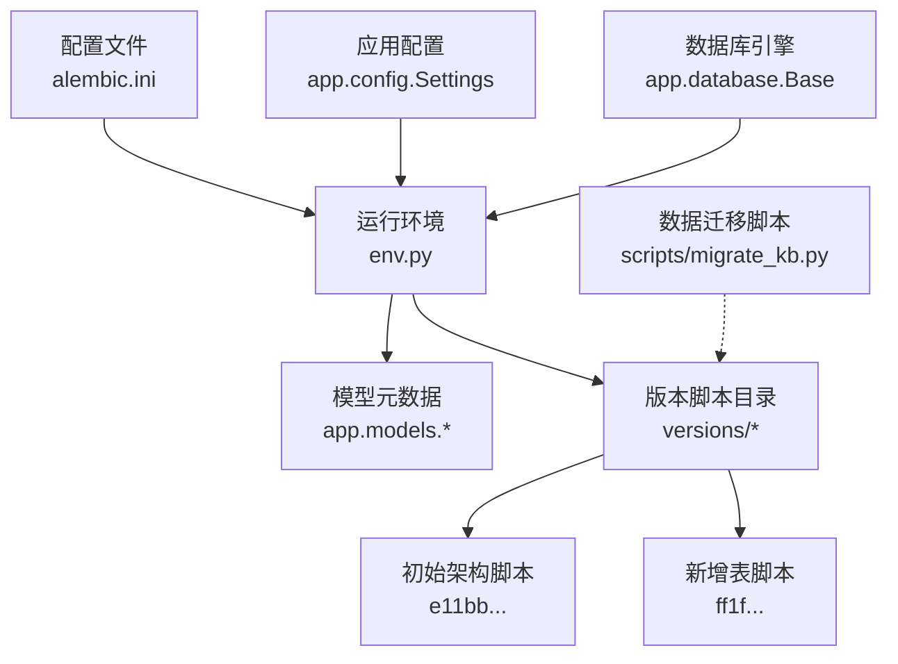
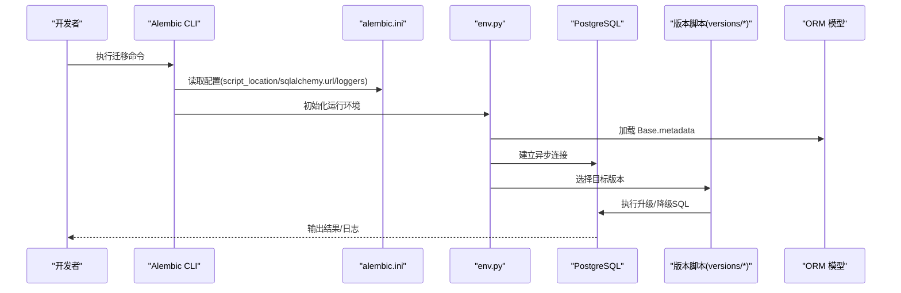
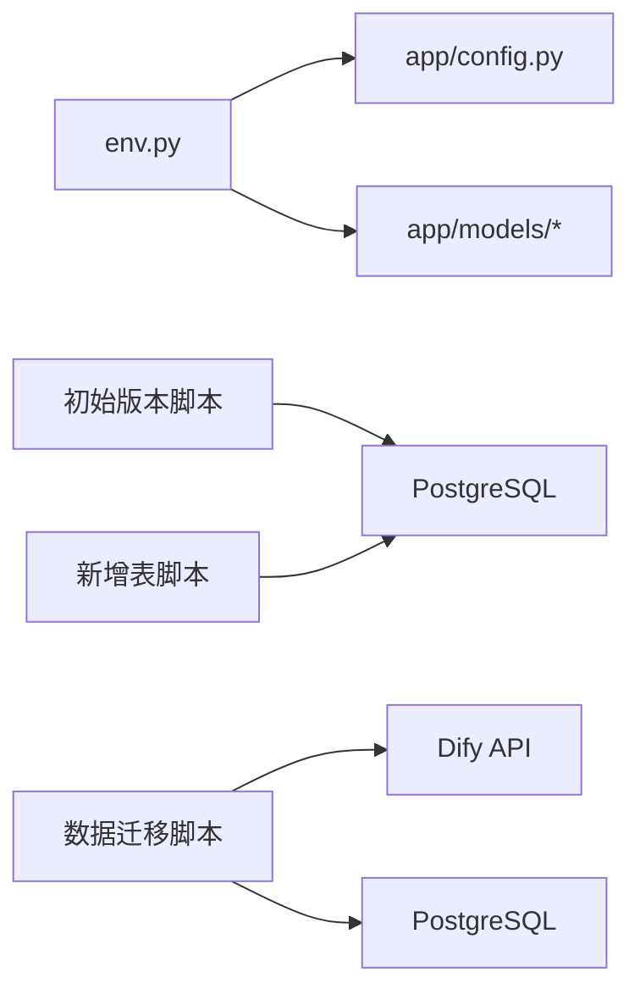

# 数据库迁移策略

<cite>
**本文引用的文件**
- [services/gateway/alembic.ini](file://services/gateway/alembic.ini)
- [services/gateway/alembic/env.py](file://services/gateway/alembic/env.py)
- [services/gateway/alembic/script.py.mako](file://services/gateway/alembic/script.py.mako)
- [services/gateway/alembic/versions/e11bb6c9d4b8_v2_initial_schema.py](file://services/gateway/alembic/versions/e11bb6c9d4b8_v2_initial_schema.py)
- [services/gateway/alembic/versions/ff1f0ab0c5f8_add_kb_entries_table.py](file://services/gateway/alembic/versions/ff1f0ab0c5f8_add_kb_entries_table.py)
- [services/gateway/app/models/__init__.py](file://services/gateway/app/models/__init__.py)
- [services/gateway/app/models/conversation.py](file://services/gateway/app/models/conversation.py)
- [services/gateway/app/models/kb_entry.py](file://services/gateway/app/models/kb_entry.py)
- [services/gateway/app/models/knowledge.py](file://services/gateway/app/models/knowledge.py)
- [services/gateway/app/models/user.py](file://services/gateway/app/models/user.py)
- [services/gateway/app/database.py](file://services/gateway/app/database.py)
- [services/gateway/app/config.py](file://services/gateway/app/config.py)
- [services/gateway/alembic/README](file://services/gateway/alembic/README)
- [scripts/migrate_kb.py](file://scripts/migrate_kb.py)
- [scripts/seed.py](file://scripts/seed.py)
</cite>

## 目录
1. [简介](#简介)
2. [项目结构](#项目结构)
3. [核心组件](#核心组件)
4. [架构总览](#架构总览)
5. [详细组件分析](#详细组件分析)
6. [依赖分析](#依赖分析)
7. [性能考虑](#性能考虑)
8. [故障排除指南](#故障排除指南)
9. [结论](#结论)
10. [附录](#附录)

## 简介
本文件系统化梳理医小管 v2 的数据库迁移策略，围绕 Alembic 迁移框架在异步环境下的配置与使用，给出版本管理策略、迁移脚本编写规范、初始架构与演进路径、完整命令与操作流程、表结构变更与索引约束操作、数据迁移最佳实践与兼容性处理、以及迁移失败的排障建议。目标是帮助开发者在不直接阅读源码的情况下，也能准确理解并安全地执行数据库迁移。

## 项目结构
- 迁移框架位于后端服务目录内，采用单数据库、异步驱动的通用配置。
- 迁移脚本按版本分层存放于版本目录，每个版本脚本对应一次“升级/降级”的原子变更。
- ORM 模型集中定义于应用模型层，Alembic 通过 env.py 动态加载模型元数据以支持自动生成与一致性校验。
- 数据迁移工具脚本独立于迁移框架，用于从外部知识库向新架构迁移数据。



图表来源
- [services/gateway/alembic.ini:1-150](file://services/gateway/alembic.ini#L1-L150)
- [services/gateway/alembic/env.py:1-97](file://services/gateway/alembic/env.py#L1-L97)
- [services/gateway/app/models/__init__.py:1-5](file://services/gateway/app/models/__init__.py#L1-L5)
- [services/gateway/alembic/versions/e11bb6c9d4b8_v2_initial_schema.py:1-160](file://services/gateway/alembic/versions/e11bb6c9d4b8_v2_initial_schema.py#L1-L160)
- [services/gateway/alembic/versions/ff1f0ab0c5f8_add_kb_entries_table.py:1-50](file://services/gateway/alembic/versions/ff1f0ab0c5f8_add_kb_entries_table.py#L1-L50)
- [services/gateway/app/config.py:1-31](file://services/gateway/app/config.py#L1-L31)
- [services/gateway/app/database.py:1-15](file://services/gateway/app/database.py#L1-L15)
- [scripts/migrate_kb.py:1-201](file://scripts/migrate_kb.py#L1-L201)

章节来源
- [services/gateway/alembic.ini:1-150](file://services/gateway/alembic.ini#L1-L150)
- [services/gateway/alembic/env.py:1-97](file://services/gateway/alembic/env.py#L1-L97)
- [services/gateway/alembic/README:1-1](file://services/gateway/alembic/README#L1-L1)
- [services/gateway/app/config.py:1-31](file://services/gateway/app/config.py#L1-L31)
- [services/gateway/app/database.py:1-15](file://services/gateway/app/database.py#L1-L15)

## 核心组件
- Alembic 配置与模板
  - 配置文件定义脚本位置、数据库 URL、日志级别等；模板文件提供迁移脚本骨架。
- 运行环境
  - env.py 负责离线/在线两种模式的迁移执行，动态注入数据库 URL，并加载 ORM 元数据。
- 版本脚本
  - 初始版本脚本定义 v2 的完整初始架构；后续版本脚本在已有基础上扩展表与索引。
- ORM 模型
  - 用户、对话、消息、知识库建议、未解答问题、学院/班级、绑定等模型，统一由 Base 元数据驱动。
- 数据迁移脚本
  - 独立的知识库迁移脚本，负责将外部内容批量导入 Dify 并同步写入 kb_entries 表。

章节来源
- [services/gateway/alembic.ini:1-150](file://services/gateway/alembic.ini#L1-L150)
- [services/gateway/alembic/env.py:1-97](file://services/gateway/alembic/env.py#L1-L97)
- [services/gateway/alembic/script.py.mako:1-29](file://services/gateway/alembic/script.py.mako#L1-L29)
- [services/gateway/alembic/versions/e11bb6c9d4b8_v2_initial_schema.py:1-160](file://services/gateway/alembic/versions/e11bb6c9d4b8_v2_initial_schema.py#L1-L160)
- [services/gateway/alembic/versions/ff1f0ab0c5f8_add_kb_entries_table.py:1-50](file://services/gateway/alembic/versions/ff1f0ab0c5f8_add_kb_entries_table.py#L1-L50)
- [services/gateway/app/models/__init__.py:1-5](file://services/gateway/app/models/__init__.py#L1-L5)
- [scripts/migrate_kb.py:1-201](file://scripts/migrate_kb.py#L1-L201)

## 架构总览
下图展示了迁移框架在应用中的整体交互：配置文件驱动 env.py，env.py 依据应用配置与 ORM 模型加载元数据，随后根据版本脚本执行升级或降级。



图表来源
- [services/gateway/alembic.ini:1-150](file://services/gateway/alembic.ini#L1-L150)
- [services/gateway/alembic/env.py:1-97](file://services/gateway/alembic/env.py#L1-L97)
- [services/gateway/app/models/__init__.py:1-5](file://services/gateway/app/models/__init__.py#L1-L5)

## 详细组件分析

### Alembic 配置与模板
- 配置要点
  - 脚本位置与路径分隔符设置，确保版本脚本目录结构清晰。
  - 数据库 URL 由 env.py 注入，避免硬编码在配置文件中。
  - 日志系统分别控制 SQLAlchemy 与 Alembic 的输出级别。
- 模板要点
  - 提供标准的升级/降级函数占位，便于生成一致的脚本骨架。

章节来源
- [services/gateway/alembic.ini:1-150](file://services/gateway/alembic.ini#L1-L150)
- [services/gateway/alembic/script.py.mako:1-29](file://services/gateway/alembic/script.py.mako#L1-L29)

### 运行环境与数据库连接
- 离线模式
  - 通过配置文件中的数据库 URL 直接执行 SQL 生成，无需真实连接。
- 在线模式
  - 从应用配置读取数据库 URL，使用异步引擎建立连接，再执行迁移。
- 元数据加载
  - 通过导入应用模型，将 ORM 元数据注入到迁移上下文中，保证脚本与模型一致。

章节来源
- [services/gateway/alembic/env.py:1-97](file://services/gateway/alembic/env.py#L1-L97)
- [services/gateway/app/config.py:1-31](file://services/gateway/app/config.py#L1-L31)
- [services/gateway/app/database.py:1-15](file://services/gateway/app/database.py#L1-L15)
- [services/gateway/app/models/__init__.py:1-5](file://services/gateway/app/models/__init__.py#L1-L5)

### 初始数据库架构与版本演进
- 初始版本（升级）
  - 定义了学院、班级、用户、用户绑定、对话、消息、知识库建议、未解答问题、学院数据集等表。
  - 定义了必要的外键约束、唯一约束、枚举类型及常用索引。
- 新增 kb_entries 表（升级）
  - 新增知识库条目表，包含文档与来源信息字段，并创建标题索引。
- 降级顺序
  - 严格遵循反向删除顺序，先删子表后删父表，先删索引后删表，确保外键约束不冲突。

```mermaid
erDiagram
COLLEGES {
int id PK
string name
timestamp created_at
}
CLASSES {
int id PK
string name
int college_id FK
int grade_year
timestamp created_at
}
USERS {
int id PK
string staff_id UK
string name
enum role
int college_id FK
int class_id FK
string password_hash
string avatar_url
bool is_active
timestamp created_at
timestamp updated_at
}
USER_BINDINGS {
int id PK
int user_id FK
enum platform
string platform_uid
timestamp bound_at
}
CONVERSATIONS {
int id PK
int student_id FK
int teacher_id FK
enum status
string dify_conversation_id
string title
timestamp created_at
timestamp updated_at
timestamp resolved_at
timestamp closed_at
}
MESSAGES {
int id PK
int conversation_id FK
enum sender_type
int sender_id FK
text content
jsonb metadata
timestamp created_at
}
KB_SUGGESTIONS {
int id PK
string title
text content
text raw_content
enum source
string source_url
int college_id FK
enum status
int submitted_by FK
int reviewed_by FK
string dify_document_id
timestamp created_at
timestamp reviewed_at
}
UNANSWERED_QUESTIONS {
int id PK
text question_text
string question_hash
int hit_count
array sample_conv_ids
int college_id FK
bool is_resolved
int kb_suggestion_id FK
timestamp created_at
timestamp updated_at
}
COLLEGE_DATASETS {
int id PK
int college_id UK FK
string dify_dataset_id
timestamp created_at
}
KB_ENTRIES {
int id PK
string dify_document_id UK
string dify_dataset_id
string title
string category
array tags
string original_source
string source_url
string material_id
string campus
string original_filename
timestamp created_at
}
COLLEGES ||--o{ CLASSES : "拥有"
COLLEGES ||--o{ USERS : "拥有"
COLLEGES ||--o{ KB_SUGGESTIONS : "拥有"
COLLEGES ||--o{ UNANSWERED_QUESTIONS : "拥有"
COLLEGES ||--o{ COLLEGE_DATASETS : "拥有"
USERS ||--o{ USER_BINDINGS : "绑定"
USERS ||--o{ CONVERSATIONS : "发起/服务"
CONVERSATIONS ||--o{ MESSAGES : "包含"
KB_SUGGESTIONS ||--o{ UNANSWERED_QUESTIONS : "关联"
```

图表来源
- [services/gateway/alembic/versions/e11bb6c9d4b8_v2_initial_schema.py:1-160](file://services/gateway/alembic/versions/e11bb6c9d4b8_v2_initial_schema.py#L1-L160)
- [services/gateway/alembic/versions/ff1f0ab0c5f8_add_kb_entries_table.py:1-50](file://services/gateway/alembic/versions/ff1f0ab0c5f8_add_kb_entries_table.py#L1-L50)
- [services/gateway/app/models/conversation.py:1-63](file://services/gateway/app/models/conversation.py#L1-L63)
- [services/gateway/app/models/kb_entry.py:1-31](file://services/gateway/app/models/kb_entry.py#L1-L31)
- [services/gateway/app/models/knowledge.py:1-62](file://services/gateway/app/models/knowledge.py#L1-L62)
- [services/gateway/app/models/user.py:1-76](file://services/gateway/app/models/user.py#L1-L76)

章节来源
- [services/gateway/alembic/versions/e11bb6c9d4b8_v2_initial_schema.py:1-160](file://services/gateway/alembic/versions/e11bb6c9d4b8_v2_initial_schema.py#L1-L160)
- [services/gateway/alembic/versions/ff1f0ab0c5f8_add_kb_entries_table.py:1-50](file://services/gateway/alembic/versions/ff1f0ab0c5f8_add_kb_entries_table.py#L1-L50)
- [services/gateway/app/models/conversation.py:1-63](file://services/gateway/app/models/conversation.py#L1-L63)
- [services/gateway/app/models/kb_entry.py:1-31](file://services/gateway/app/models/kb_entry.py#L1-L31)
- [services/gateway/app/models/knowledge.py:1-62](file://services/gateway/app/models/knowledge.py#L1-L62)
- [services/gateway/app/models/user.py:1-76](file://services/gateway/app/models/user.py#L1-L76)

### 迁移脚本编写规范
- 升级/降级函数
  - 使用模板提供的升级/降级函数作为入口，所有 DDL 变更集中在函数内部。
- 版本标识
  - 每个版本脚本包含唯一的修订 ID、上一版本 ID、分支标签与依赖项，确保版本链路清晰。
- 约束与索引
  - 显式声明主键、外键、唯一约束与索引，保持与 ORM 模型一致。
- 可逆性
  - 降级脚本必须与升级脚本一一对应，删除顺序与创建顺序相反。

章节来源
- [services/gateway/alembic/script.py.mako:1-29](file://services/gateway/alembic/script.py.mako#L1-L29)
- [services/gateway/alembic/versions/e11bb6c9d4b8_v2_initial_schema.py:1-160](file://services/gateway/alembic/versions/e11bb6c9d4b8_v2_initial_schema.py#L1-L160)
- [services/gateway/alembic/versions/ff1f0ab0c5f8_add_kb_entries_table.py:1-50](file://services/gateway/alembic/versions/ff1f0ab0c5f8_add_kb_entries_table.py#L1-L50)

### 数据迁移最佳实践
- 断点续传
  - 迁移脚本支持断点续传，通过输出 CSV 记录成功/失败状态，避免重复处理。
- 速率限制
  - 对外部 API 请求施加最小间隔，防止触发限流。
- 错误隔离
  - 单条记录失败不影响整体流程，记录错误原因并继续处理。
- 数据一致性
  - 同步写入 kb_entries 表时进行事务提交与回滚处理，确保失败可恢复。

章节来源
- [scripts/migrate_kb.py:1-201](file://scripts/migrate_kb.py#L1-L201)

## 依赖分析
- 组件耦合
  - env.py 依赖应用配置与 ORM 模型，确保迁移上下文与应用一致。
  - 版本脚本仅依赖 Alembic API 与 SQLAlchemy 类型，保持低耦合。
- 外部依赖
  - 迁移脚本依赖 PostgreSQL 异步驱动与 Dify API；数据迁移脚本依赖 HTTP 客户端与 YAML 解析库。
- 潜在循环依赖
  - 通过显式导入模型与配置，避免在 env.py 中形成循环引用。



图表来源
- [services/gateway/alembic/env.py:1-97](file://services/gateway/alembic/env.py#L1-L97)
- [services/gateway/app/config.py:1-31](file://services/gateway/app/config.py#L1-L31)
- [services/gateway/app/models/__init__.py:1-5](file://services/gateway/app/models/__init__.py#L1-L5)
- [services/gateway/alembic/versions/e11bb6c9d4b8_v2_initial_schema.py:1-160](file://services/gateway/alembic/versions/e11bb6c9d4b8_v2_initial_schema.py#L1-L160)
- [services/gateway/alembic/versions/ff1f0ab0c5f8_add_kb_entries_table.py:1-50](file://services/gateway/alembic/versions/ff1f0ab0c5f8_add_kb_entries_table.py#L1-L50)
- [scripts/migrate_kb.py:1-201](file://scripts/migrate_kb.py#L1-L201)

章节来源
- [services/gateway/alembic/env.py:1-97](file://services/gateway/alembic/env.py#L1-L97)
- [services/gateway/app/config.py:1-31](file://services/gateway/app/config.py#L1-L31)
- [services/gateway/app/models/__init__.py:1-5](file://services/gateway/app/models/__init__.py#L1-L5)
- [scripts/migrate_kb.py:1-201](file://scripts/migrate_kb.py#L1-L201)

## 性能考虑
- 异步连接
  - 使用异步引擎减少阻塞，提升迁移执行效率。
- 索引与查询
  - 初始版本为高频查询字段建立索引，有助于迁移后业务查询性能。
- 批量处理
  - 数据迁移脚本采用逐条处理与速率限制，平衡吞吐与稳定性。
- 连接池
  - 应用层配置连接池参数，避免迁移期间资源争用。

章节来源
- [services/gateway/alembic/env.py:1-97](file://services/gateway/alembic/env.py#L1-L97)
- [services/gateway/app/database.py:1-15](file://services/gateway/app/database.py#L1-L15)
- [services/gateway/alembic/versions/e11bb6c9d4b8_v2_initial_schema.py:1-160](file://services/gateway/alembic/versions/e11bb6c9d4b8_v2_initial_schema.py#L1-L160)
- [scripts/migrate_kb.py:1-201](file://scripts/migrate_kb.py#L1-L201)

## 故障排除指南
- 迁移命令执行失败
  - 检查数据库 URL 是否正确注入（env.py 从配置读取），确认数据库可达。
  - 查看日志级别配置，定位具体错误信息。
- 版本链断裂
  - 确认当前版本与目标版本之间的依赖关系是否完整，必要时手动修复版本链。
- 降级失败
  - 按照降级脚本的删除顺序逐一排查，优先检查外键约束与索引删除顺序。
- 数据迁移中断
  - 检查 CSV 输出文件是否包含断点记录，清理失败条目后重试。
  - 关注速率限制与外部 API 状态，避免因限流导致的失败。

章节来源
- [services/gateway/alembic.ini:1-150](file://services/gateway/alembic.ini#L1-L150)
- [services/gateway/alembic/env.py:1-97](file://services/gateway/alembic/env.py#L1-L97)
- [services/gateway/alembic/versions/e11bb6c9d4b8_v2_initial_schema.py:1-160](file://services/gateway/alembic/versions/e11bb6c9d4b8_v2_initial_schema.py#L1-L160)
- [services/gateway/alembic/versions/ff1f0ab0c5f8_add_kb_entries_table.py:1-50](file://services/gateway/alembic/versions/ff1f0ab0c5f8_add_kb_entries_table.py#L1-L50)
- [scripts/migrate_kb.py:1-201](file://scripts/migrate_kb.py#L1-L201)

## 结论
本项目采用 Alembic 管理 v2 数据库演进，结合异步环境与 ORM 元数据，实现了可逆、可追踪、可扩展的迁移体系。初始版本覆盖核心业务表与索引，后续版本通过新增表进一步完善知识库能力。配合独立的数据迁移脚本，既能保障数据完整性，又能实现断点续传与错误隔离。建议在生产环境中严格执行“先备份、后迁移、再验证”的流程，并在每次迁移前后进行充分测试。

## 附录

### 迁移命令与操作流程
- 创建迁移
  - 使用模板生成新的版本脚本，编辑升级/降级函数以描述 DDL 变更。
- 应用迁移
  - 在线模式：确保数据库 URL 正确，执行迁移命令，观察日志输出。
  - 离线模式：适用于生成 SQL 文件或在无连接场景下预检。
- 回滚迁移
  - 指定目标版本进行降级，严格遵循降级脚本的删除顺序。
- 数据迁移
  - 使用知识库迁移脚本批量导入内容至 Dify，并同步写入 kb_entries 表。

章节来源
- [services/gateway/alembic/script.py.mako:1-29](file://services/gateway/alembic/script.py.mako#L1-L29)
- [services/gateway/alembic/env.py:1-97](file://services/gateway/alembic/env.py#L1-L97)
- [scripts/migrate_kb.py:1-201](file://scripts/migrate_kb.py#L1-L201)

### 表结构变更与索引约束示例
- 初始版本涉及的主要变更
  - 创建多张核心表，定义主键、外键、唯一约束与枚举类型。
  - 为对话与消息表的关键字段建立复合索引，提升查询性能。
- 新增表版本
  - 新增 kb_entries 表，包含文档与来源字段，并创建标题索引。
- 降级版本
  - 逆序删除索引与表，确保外键约束不冲突。

章节来源
- [services/gateway/alembic/versions/e11bb6c9d4b8_v2_initial_schema.py:1-160](file://services/gateway/alembic/versions/e11bb6c9d4b8_v2_initial_schema.py#L1-L160)
- [services/gateway/alembic/versions/ff1f0ab0c5f8_add_kb_entries_table.py:1-50](file://services/gateway/alembic/versions/ff1f0ab0c5f8_add_kb_entries_table.py#L1-L50)

### 数据迁移最佳实践与注意事项
- 断点续传与错误记录
  - 使用 CSV 记录每条记录的状态与错误，支持失败后继续处理。
- 速率限制与超时
  - 控制对外部 API 的请求频率，设置合理的超时时间。
- 事务与回滚
  - 对数据库写入进行事务提交与异常回滚，避免部分写入导致的数据不一致。
- 兼容性与回滚
  - 在引入新字段或索引时，确保降级脚本能安全移除，避免破坏历史数据。

章节来源
- [scripts/migrate_kb.py:1-201](file://scripts/migrate_kb.py#L1-L201)