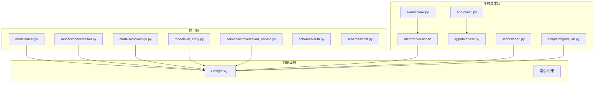
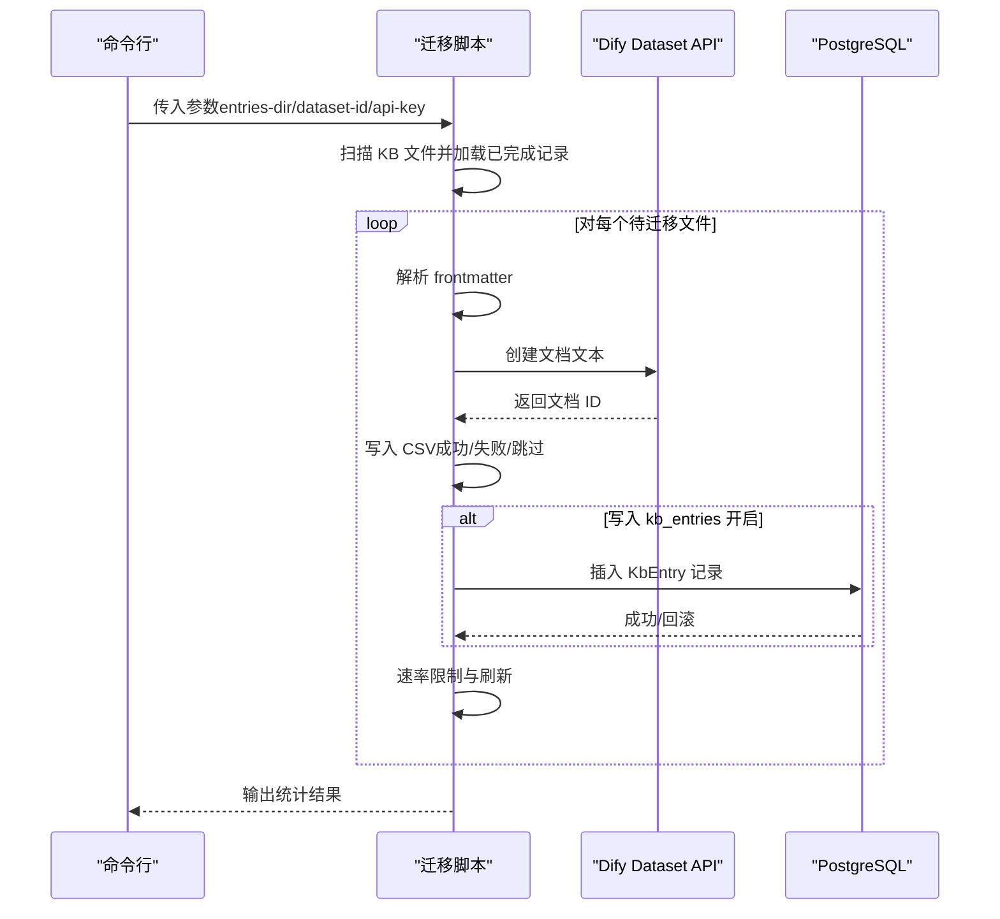
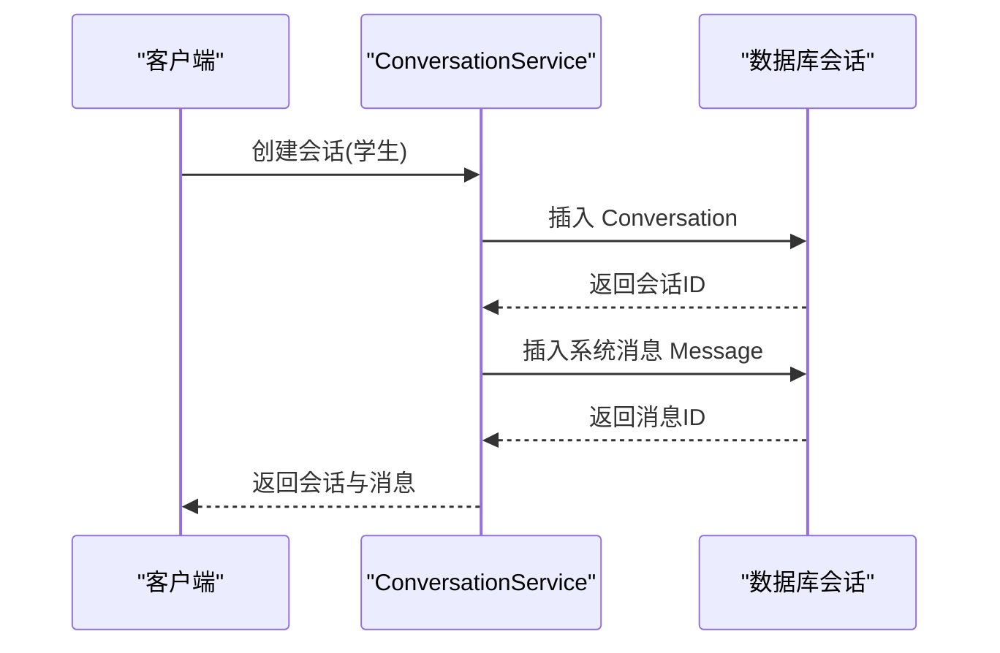
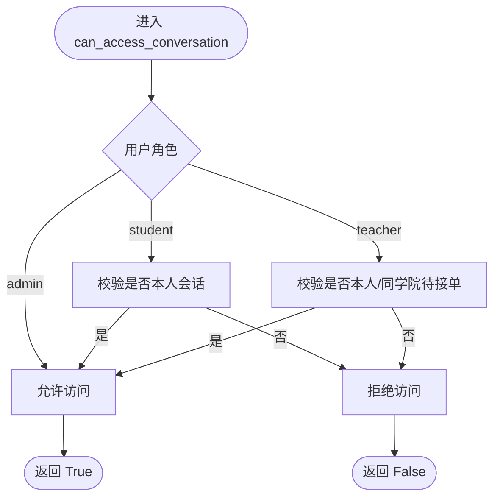
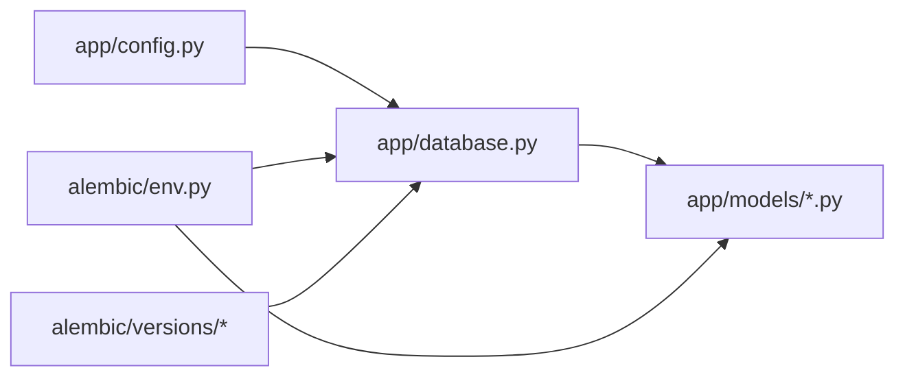

# 数据模型

<cite>
**本文引用的文件**
- [services/gateway/app/models/__init__.py](file://services/gateway/app/models/__init__.py)
- [services/gateway/app/models/user.py](file://services/gateway/app/models/user.py)
- [services/gateway/app/models/conversation.py](file://services/gateway/app/models/conversation.py)
- [services/gateway/app/models/knowledge.py](file://services/gateway/app/models/knowledge.py)
- [services/gateway/app/models/kb_entry.py](file://services/gateway/app/models/kb_entry.py)
- [services/gateway/alembic/versions/e11bb6c9d4b8_v2_initial_schema.py](file://services/gateway/alembic/versions/e11bb6c9d4b8_v2_initial_schema.py)
- [services/gateway/alembic/versions/ff1f0ab0c5f8_add_kb_entries_table.py](file://services/gateway/alembic/versions/ff1f0ab0c5f8_add_kb_entries_table.py)
- [services/gateway/alembic/env.py](file://services/gateway/alembic/env.py)
- [services/gateway/alembic.ini](file://services/gateway/alembic.ini)
- [services/gateway/app/database.py](file://services/gateway/app/database.py)
- [services/gateway/app/config.py](file://services/gateway/app/config.py)
- [services/gateway/app/services/conversation_service.py](file://services/gateway/app/services/conversation_service.py)
- [services/gateway/app/schemas/auth.py](file://services/gateway/app/schemas/auth.py)
- [services/gateway/app/schemas/chat.py](file://services/gateway/app/schemas/chat.py)
- [scripts/seed.py](file://scripts/seed.py)
- [scripts/migrate_kb.py](file://scripts/migrate_kb.py)
</cite>

## 目录
1. [简介](#简介)
2. [项目结构](#项目结构)
3. [核心组件](#核心组件)
4. [架构总览](#架构总览)
5. [详细组件分析](#详细组件分析)
6. [依赖分析](#依赖分析)
7. [性能考虑](#性能考虑)
8. [故障排查指南](#故障排查指南)
9. [结论](#结论)
10. [附录](#附录)

## 简介
本文件系统化梳理医小管 v2 的数据模型与数据库迁移策略，覆盖用户、会话、消息、知识库建议、未解答问题、学院/班级、用户绑定以及知识库条目等核心实体。文档提供完整表结构定义、字段说明、索引与约束、实体关系映射，并给出 Alembic 迁移版本、初始化脚本与种子数据、数据访问模式与 ORM 使用要点，以及数据安全与隐私保护建议。

## 项目结构
围绕数据模型的关键目录与文件如下：
- 数据模型定义：位于应用层 models 包，采用 SQLAlchemy 2.x ORM 映射 PostgreSQL 表结构
- 迁移与版本：Alembic 版本化迁移脚本，定义初始 schema 与新增 kb_entries 表
- 数据访问与服务：基于异步 SQLAlchemy 会话进行 CRUD 与查询封装
- 初始化与迁移工具：种子数据脚本与知识库迁移脚本
- 配置：数据库连接、JWT、Dify 集成参数等



图表来源
- [services/gateway/app/models/user.py:1-76](file://services/gateway/app/models/user.py#L1-L76)
- [services/gateway/app/models/conversation.py:1-63](file://services/gateway/app/models/conversation.py#L1-L63)
- [services/gateway/app/models/knowledge.py:1-62](file://services/gateway/app/models/knowledge.py#L1-L62)
- [services/gateway/app/models/kb_entry.py:1-31](file://services/gateway/app/models/kb_entry.py#L1-L31)
- [services/gateway/alembic/versions/e11bb6c9d4b8_v2_initial_schema.py:1-160](file://services/gateway/alembic/versions/e11bb6c9d4b8_v2_initial_schema.py#L1-L160)
- [services/gateway/alembic/versions/ff1f0ab0c5f8_add_kb_entries_table.py:1-50](file://services/gateway/alembic/versions/ff1f0ab0c5f8_add_kb_entries_table.py#L1-L50)
- [services/gateway/alembic/env.py:1-97](file://services/gateway/alembic/env.py#L1-L97)
- [services/gateway/app/database.py:1-15](file://services/gateway/app/database.py#L1-L15)
- [services/gateway/app/config.py:1-31](file://services/gateway/app/config.py#L1-L31)
- [scripts/seed.py:1-56](file://scripts/seed.py#L1-L56)
- [scripts/migrate_kb.py:1-201](file://scripts/migrate_kb.py#L1-L201)

章节来源
- [services/gateway/app/models/__init__.py:1-5](file://services/gateway/app/models/__init__.py#L1-L5)
- [services/gateway/app/models/user.py:1-76](file://services/gateway/app/models/user.py#L1-L76)
- [services/gateway/app/models/conversation.py:1-63](file://services/gateway/app/models/conversation.py#L1-L63)
- [services/gateway/app/models/knowledge.py:1-62](file://services/gateway/app/models/knowledge.py#L1-L62)
- [services/gateway/app/models/kb_entry.py:1-31](file://services/gateway/app/models/kb_entry.py#L1-L31)

## 核心组件
本节概述各数据模型的职责、关键字段与约束，并说明其在业务中的作用。

- 用户与组织
  - 学院（Colleges）：记录教学单位
  - 班级（Classes）：记录班级，关联所属学院
  - 用户（Users）：统一身份主体，含角色、绑定平台信息
  - 用户绑定（UserBindings）：跨平台账号绑定，唯一性约束

- 会话与消息
  - 会话（Conversations）：记录一次问答流程，含状态、教师分配、时间戳
  - 消息（Messages）：记录具体消息内容、发送者、元数据

- 知识库与建议
  - 知识库建议（KbSuggestions）：教师提交或采集的内容建议，含来源、状态、审核人
  - 未解答问题（UnansweredQuestions）：高频问题聚合，便于建议与知识库关联
  - 学院数据集（CollegeDatasets）：为每个学院绑定 Dify 全局数据集
  - 知识库条目（KbEntries）：Dify 文档与原始来源映射，支持断点迁移与溯源

章节来源
- [services/gateway/app/models/user.py:23-76](file://services/gateway/app/models/user.py#L23-L76)
- [services/gateway/app/models/conversation.py:26-63](file://services/gateway/app/models/conversation.py#L26-L63)
- [services/gateway/app/models/knowledge.py:22-62](file://services/gateway/app/models/knowledge.py#L22-L62)
- [services/gateway/app/models/kb_entry.py:9-31](file://services/gateway/app/models/kb_entry.py#L9-L31)

## 架构总览
下图展示数据模型之间的关系映射，包括一对一、一对多与外键约束。

```mermaid
erDiagram
COLLEGES {
int id PK
string name
timestamp created_at
}
CLASSES {
int id PK
string name
int college_id FK
int grade_year
timestamp created_at
}
USERS {
int id PK
string staff_id UK
string name
enum role
int college_id FK
int class_id FK
string password_hash
string avatar_url
bool is_active
timestamp created_at
timestamp updated_at
}
USER_BINDINGS {
int id PK
int user_id FK
enum platform
string platform_uid
timestamp bound_at
}
CONVERSATIONS {
int id PK
int student_id FK
int teacher_id FK
enum status
string dify_conversation_id
string title
timestamp created_at
timestamp updated_at
timestamp resolved_at
timestamp closed_at
}
MESSAGES {
int id PK
int conversation_id FK
enum sender_type
int sender_id FK
text content
jsonb metadata
timestamp created_at
}
KB_SUGGESTIONS {
int id PK
string title
text content
text raw_content
enum source
string source_url
int college_id FK
enum status
int submitted_by FK
int reviewed_by FK
string dify_document_id
timestamp created_at
timestamp reviewed_at
}
UNANSWERED_QUESTIONS {
int id PK
text question_text
string question_hash
int hit_count
int[] sample_conv_ids
int college_id FK
bool is_resolved
int kb_suggestion_id FK
timestamp created_at
timestamp updated_at
}
COLLEGE_DATASETS {
int id PK
int college_id UK FK
string dify_dataset_id
timestamp created_at
}
KB_ENTRIES {
int id PK
string dify_document_id UK
string dify_dataset_id
string title
string category
string[] tags
string original_source
string source_url
string material_id
string campus
string original_filename
timestamp created_at
}
COLLEGES ||--o{ CLASSES : "拥有"
COLLEGES ||--o{ USERS : "拥有"
COLLEGES ||--o{ KB_SUGGESTIONS : "拥有"
COLLEGES ||--|| COLLEGE_DATASETS : "绑定"
USERS ||--o{ USER_BINDINGS : "绑定"
USERS ||--o{ CONVERSATIONS : "发起/指派"
USERS ||--o{ MESSAGES : "发送"
CONVERSATIONS ||--o{ MESSAGES : "包含"
KB_SUGGESTIONS ||--o{ UNANSWERED_QUESTIONS : "驱动"
KB_SUGGESTIONS ||--o{ KB_ENTRIES : "映射"
```

图表来源
- [services/gateway/app/models/user.py:23-76](file://services/gateway/app/models/user.py#L23-L76)
- [services/gateway/app/models/conversation.py:26-63](file://services/gateway/app/models/conversation.py#L26-L63)
- [services/gateway/app/models/knowledge.py:22-62](file://services/gateway/app/models/knowledge.py#L22-L62)
- [services/gateway/app/models/kb_entry.py:9-31](file://services/gateway/app/models/kb_entry.py#L9-L31)

## 详细组件分析

### 用户与组织模型
- 学院（Colleges）
  - 主键：id
  - 字段：name（唯一）、created_at
  - 关系：与 Classes 一对多；与 Users、KbSuggestions 多对一
- 班级（Classes）
  - 主键：id；外键：college_id → Colleges
  - 字段：name、grade_year、created_at
  - 关系：与 Colleges 多对一；与 Users 多对一
- 用户（Users）
  - 主键：id；唯一：staff_id
  - 字段：role（枚举）、college_id/class_id（可空）用于归属；密码哈希、头像、激活状态
  - 关系：与 Classes/Colleges 多对一；与 UserBindings 一对多；与 Conversations/Messages 多对一
- 用户绑定（UserBindings）
  - 主键：id；唯一约束：platform + platform_uid
  - 字段：user_id、platform（枚举）、platform_uid、bound_at
  - 关系：与 Users 多对一

章节来源
- [services/gateway/app/models/user.py:23-76](file://services/gateway/app/models/user.py#L23-L76)

### 会话与消息模型
- 会话（Conversations）
  - 主键：id；外键：student_id/teacher_id → Users
  - 字段：status（枚举）、标题、Dify 会话标识、时间戳（创建/更新/解决/关闭）
  - 索引：student_id、status
  - 关系：与 Messages 一对多
- 消息（Messages）
  - 主键：id；外键：conversation_id → Conversations；sender_id → Users
  - 字段：sender_type（枚举）、content、metadata（JSONB）、created_at
  - 索引：conversation_id；(conversation_id, created_at)
  - 关系：与 Conversations 多对一

章节来源
- [services/gateway/app/models/conversation.py:26-63](file://services/gateway/app/models/conversation.py#L26-L63)

### 知识库与建议模型
- 知识库建议（KbSuggestions）
  - 主键：id；外键：college_id → Colleges；submitted_by/reviewed_by → Users
  - 字段：title/content/raw_content、source（枚举）、source_url、status（枚举）、dify_document_id、时间戳
- 未解答问题（UnansweredQuestions）
  - 主键：id；外键：college_id → Colleges；kb_suggestion_id → KbSuggestions
  - 字段：question_text、question_hash、hit_count、sample_conv_ids、is_resolved、时间戳
- 学院数据集（CollegeDatasets）
  - 主键：id；唯一：college_id；外键：college_id → Colleges
  - 字段：dify_dataset_id、created_at
- 知识库条目（KbEntries）
  - 主键：id；唯一：dify_document_id
  - 字段：dify_document_id/dify_dataset_id、title（带索引）、category/tags、原始来源字段、时间戳

章节来源
- [services/gateway/app/models/knowledge.py:22-62](file://services/gateway/app/models/knowledge.py#L22-L62)
- [services/gateway/app/models/kb_entry.py:9-31](file://services/gateway/app/models/kb_entry.py#L9-L31)

### 数据访问模式与 ORM 使用
- 异步会话与依赖注入
  - 使用异步引擎与会话工厂，通过依赖注入提供数据库会话
  - 会话设置为不自动过期，避免提交后对象失效
- 服务层封装
  - 会话与消息服务封装了权限校验、分页、计数、更新时间戳等逻辑
  - 提供创建会话、列出会话、获取会话详情、列出消息、新增消息等方法

章节来源
- [services/gateway/app/database.py:1-15](file://services/gateway/app/database.py#L1-L15)
- [services/gateway/app/services/conversation_service.py:1-179](file://services/gateway/app/services/conversation_service.py#L1-L179)

### 数据模型类图
```mermaid
classDiagram
class College {
+int id
+string name
+datetime created_at
}
class Class {
+int id
+string name
+int college_id
+int grade_year
+datetime created_at
}
class User {
+int id
+string staff_id
+string name
+UserRole role
+int college_id
+int class_id
+string password_hash
+string avatar_url
+bool is_active
+datetime created_at
+datetime updated_at
}
class UserBinding {
+int id
+int user_id
+PlatformType platform
+string platform_uid
+datetime bound_at
}
class Conversation {
+int id
+int student_id
+int teacher_id
+ConversationStatus status
+string dify_conversation_id
+string title
+datetime created_at
+datetime updated_at
+datetime resolved_at
+datetime closed_at
}
class Message {
+int id
+int conversation_id
+SenderType sender_type
+int sender_id
+string content
+dict metadata
+datetime created_at
}
class KbSuggestion {
+int id
+string title
+string content
+string raw_content
+SuggestionSource source
+string source_url
+int college_id
+SuggestionStatus status
+int submitted_by
+int reviewed_by
+string dify_document_id
+datetime created_at
+datetime reviewed_at
}
class UnansweredQuestion {
+int id
+string question_text
+string question_hash
+int hit_count
+int[] sample_conv_ids
+int college_id
+bool is_resolved
+int kb_suggestion_id
+datetime created_at
+datetime updated_at
}
class CollegeDataset {
+int id
+int college_id
+string dify_dataset_id
+datetime created_at
}
class KbEntry {
+int id
+string dify_document_id
+string dify_dataset_id
+string title
+string category
+string[] tags
+string original_source
+string source_url
+string material_id
+string campus
+string original_filename
+datetime created_at
}
College "1" o-- "*" Class : "拥有"
College "1" o-- "*" User : "拥有"
Class "1" o-- "*" User : "属于"
User "1" o-- "*" UserBinding : "绑定"
User "1" o-- "*" Conversation : "发起/指派"
User "1" o-- "*" Message : "发送"
Conversation "1" o-- "*" Message : "包含"
KbSuggestion "1" o-- "*" UnansweredQuestion : "驱动"
KbSuggestion "1" o-- "*" KbEntry : "映射"
College "1" o--|"1" CollegeDataset : "绑定"
```

图表来源
- [services/gateway/app/models/user.py:23-76](file://services/gateway/app/models/user.py#L23-L76)
- [services/gateway/app/models/conversation.py:26-63](file://services/gateway/app/models/conversation.py#L26-L63)
- [services/gateway/app/models/knowledge.py:22-62](file://services/gateway/app/models/knowledge.py#L22-L62)
- [services/gateway/app/models/kb_entry.py:9-31](file://services/gateway/app/models/kb_entry.py#L9-L31)

### 数据模型关系映射
- 一对一
  - College → CollegeDataset（一个学院对应一个全局数据集）
- 一对多
  - College → Class/User/KbSuggestion（学院拥有多个班级、用户、建议）
  - User → UserBinding/Conversation/Message（用户绑定、发起/指派会话、发送消息）
  - Conversation → Message（会话包含多条消息）
  - KbSuggestion → UnansweredQuestion/KbEntry（建议驱动未解答问题与条目映射）
- 多对一
  - Class/College → User（班级/学院 → 用户）
  - User → Conversation/Message（用户 → 会话/消息）
  - KbSuggestion → KbEntry（建议 → 条目映射）

章节来源
- [services/gateway/app/models/user.py:23-76](file://services/gateway/app/models/user.py#L23-L76)
- [services/gateway/app/models/conversation.py:26-63](file://services/gateway/app/models/conversation.py#L26-L63)
- [services/gateway/app/models/knowledge.py:22-62](file://services/gateway/app/models/knowledge.py#L22-L62)
- [services/gateway/app/models/kb_entry.py:9-31](file://services/gateway/app/models/kb_entry.py#L9-L31)

### Alembic 迁移策略与版本管理
- 初始版本（v2_initial_schema）
  - 创建 colleges、classes、college_datasets、users、conversations、kb_suggestions、user_bindings、messages、unanswered_questions 表
  - 定义主键、外键、唯一约束、索引（如 conversations 的 student/status 索引，messages 的 conversation/created 组合索引）
- 新增版本（add_kb_entries_table）
  - 新增 kb_entries 表，包含唯一约束与 title 索引
- 迁移执行
  - Alembic 环境通过 env.py 注入目标元数据与异步引擎，支持在线/离线迁移
  - 配置文件 alembic.ini 控制脚本位置、日志级别与路径分隔符

章节来源
- [services/gateway/alembic/versions/e11bb6c9d4b8_v2_initial_schema.py:21-160](file://services/gateway/alembic/versions/e11bb6c9d4b8_v2_initial_schema.py#L21-L160)
- [services/gateway/alembic/versions/ff1f0ab0c5f8_add_kb_entries_table.py:21-50](file://services/gateway/alembic/versions/ff1f0ab0c5f8_add_kb_entries_table.py#L21-L50)
- [services/gateway/alembic/env.py:1-97](file://services/gateway/alembic/env.py#L1-L97)
- [services/gateway/alembic.ini:1-150](file://services/gateway/alembic.ini#L1-L150)

### 数据初始化与种子数据
- 种子脚本（seed.py）
  - 异步插入测试用学院、班级与用户，使用哈希后的密码
  - 通过 async_session 获取会话，flush 后再 commit，确保外键顺序正确
- 运行方式
  - 在项目根目录执行脚本，确保 Python 路径包含 gateway

章节来源
- [scripts/seed.py:1-56](file://scripts/seed.py#L1-L56)

### 知识库迁移流程
- 脚本功能
  - 解析 Markdown 前言元数据，调用 Dify Dataset API 创建文档，生成文档 ID
  - 支持断点续传：根据输出 CSV 记录跳过已成功条目
  - 可选写入 PostgreSQL kb_entries 表，记录 Dify 文档与原始来源映射
- 关键步骤
  - 解析 frontmatter → 创建 Dify 文档 → 写入 CSV → 可选写入 kb_entries
  - 速率限制与异常处理，保证稳定性



图表来源
- [scripts/migrate_kb.py:88-201](file://scripts/migrate_kb.py#L88-L201)
- [services/gateway/app/models/kb_entry.py:9-31](file://services/gateway/app/models/kb_entry.py#L9-L31)

章节来源
- [scripts/migrate_kb.py:1-201](file://scripts/migrate_kb.py#L1-L201)

### 数据访问序列示例
以下序列展示“创建会话并添加系统消息”的典型流程。



图表来源
- [services/gateway/app/services/conversation_service.py:29-51](file://services/gateway/app/services/conversation_service.py#L29-L51)

章节来源
- [services/gateway/app/services/conversation_service.py:1-179](file://services/gateway/app/services/conversation_service.py#L1-L179)

### 复杂逻辑流程图（权限校验）


图表来源
- [services/gateway/app/services/conversation_service.py:7-26](file://services/gateway/app/services/conversation_service.py#L7-L26)

章节来源
- [services/gateway/app/services/conversation_service.py:1-179](file://services/gateway/app/services/conversation_service.py#L1-L179)

## 依赖分析
- 模型导出
  - models/__init__.py 统一导出用户、会话、知识库相关模型，便于 Alembic 与应用其他模块引用
- 迁移环境
  - env.py 从配置读取数据库 URL，注册 Base.metadata 并注入模型包，使迁移脚本可见所有表结构
- 配置与连接
  - config.py 提供数据库 URL、Redis、JWT、Dify 等参数；database.py 基于配置创建异步引擎与会话工厂



图表来源
- [services/gateway/app/config.py:1-31](file://services/gateway/app/config.py#L1-L31)
- [services/gateway/app/database.py:1-15](file://services/gateway/app/database.py#L1-L15)
- [services/gateway/alembic/env.py:1-97](file://services/gateway/alembic/env.py#L1-L97)

章节来源
- [services/gateway/app/models/__init__.py:1-5](file://services/gateway/app/models/__init__.py#L1-L5)
- [services/gateway/alembic/env.py:1-97](file://services/gateway/alembic/env.py#L1-L97)
- [services/gateway/app/config.py:1-31](file://services/gateway/app/config.py#L1-L31)
- [services/gateway/app/database.py:1-15](file://services/gateway/app/database.py#L1-L15)

## 性能考虑
- 索引设计
  - conversations：按 student_id 与 status 建立索引，提升按学生与状态筛选效率
  - messages：按 conversation_id 建立索引；(conversation_id, created_at) 组合索引，优化消息分页与排序
  - kb_entries：按 title 建立索引，加速检索
- 查询优化
  - 分页查询使用 count 子查询统计总数，避免重复扫描
  - 使用 join 与 or_ 组合条件，减少多次往返
- 异步与连接池
  - 使用异步引擎与连接池，降低高并发下的阻塞
- 数据类型选择
  - JSONB 用于消息元数据，支持灵活扩展
  - ARRAY 用于未解答问题样本会话 ID 列表，便于快速定位示例

[本节为通用指导，无需特定文件分析]

## 故障排查指南
- 迁移失败
  - 检查 alembic.ini 中 sqlalchemy.url 是否正确，确认 env.py 注入的 URL 来源于配置
  - 确认 models/__init__.py 导入了所有模型，使迁移可见
- 权限访问被拒
  - 核对 can_access_conversation 的角色分支与条件，特别是教师对“待接单”会话的同学院判断
- 消息分页异常
  - 确认 messages 表索引是否存在；检查 created_at 排序是否符合预期
- 种子数据插入失败
  - 检查 staff_id 唯一性；确认 flush/commit 顺序以满足外键依赖
- 知识库迁移中断
  - 断点续传由 CSV 记录控制；检查 CSV 文件完整性与网络超时重试

章节来源
- [services/gateway/alembic/env.py:1-97](file://services/gateway/alembic/env.py#L1-L97)
- [services/gateway/alembic/versions/e11bb6c9d4b8_v2_initial_schema.py:21-160](file://services/gateway/alembic/versions/e11bb6c9d4b8_v2_initial_schema.py#L21-L160)
- [services/gateway/app/services/conversation_service.py:7-26](file://services/gateway/app/services/conversation_service.py#L7-L26)
- [scripts/seed.py:1-56](file://scripts/seed.py#L1-L56)
- [scripts/migrate_kb.py:112-196](file://scripts/migrate_kb.py#L112-L196)

## 结论
本数据模型以清晰的实体边界与合理的索引/约束设计支撑了医小管 v2 的用户管理、会话流转、知识库治理与迁移集成。配合 Alembic 的版本化迁移与异步 ORM 访问模式，系统具备良好的可演进性与可维护性。建议在生产环境中进一步完善审计日志、敏感字段脱敏与访问控制策略，持续优化查询路径与缓存策略。

[本节为总结性内容，无需特定文件分析]

## 附录
- 表与字段速查
  - users：主键、唯一学号/工号、角色、归属学院/班级、密码哈希、头像、激活状态、时间戳
  - user_bindings：唯一平台+UID 组合、绑定时间
  - conversations：状态枚举、Dify 会话标识、时间戳
  - messages：发送者类型/ID、内容、JSONB 元数据
  - kb_suggestions：来源枚举、状态、Dify 文档 ID
  - unanswered_questions：问题哈希、命中次数、样本会话、是否已解决
  - college_datasets：全局数据集 ID
  - kb_entries：Dify 文档 ID 唯一、标题索引、原始来源字段
- API 与模型交互
  - 登录请求与用户信息模型用于鉴权与上下文构建
  - 聊天发送请求限定内容长度，保障输入质量

章节来源
- [services/gateway/app/schemas/auth.py:1-23](file://services/gateway/app/schemas/auth.py#L1-L23)
- [services/gateway/app/schemas/chat.py:1-18](file://services/gateway/app/schemas/chat.py#L1-L18)